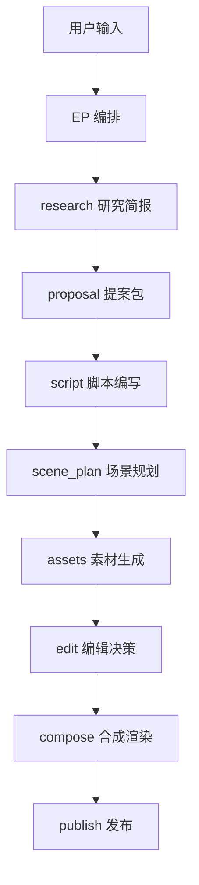
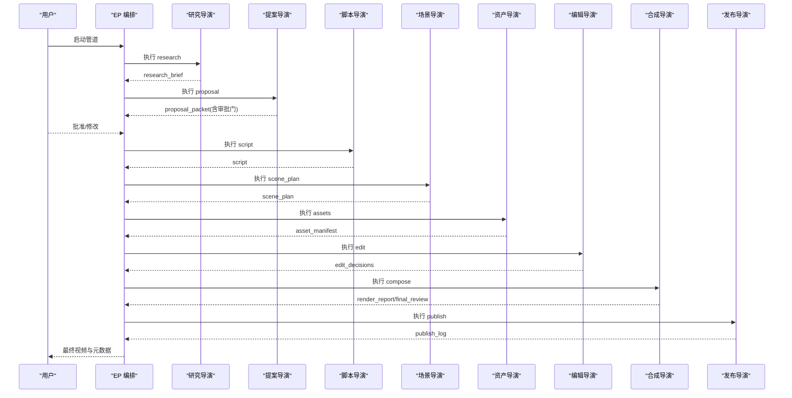
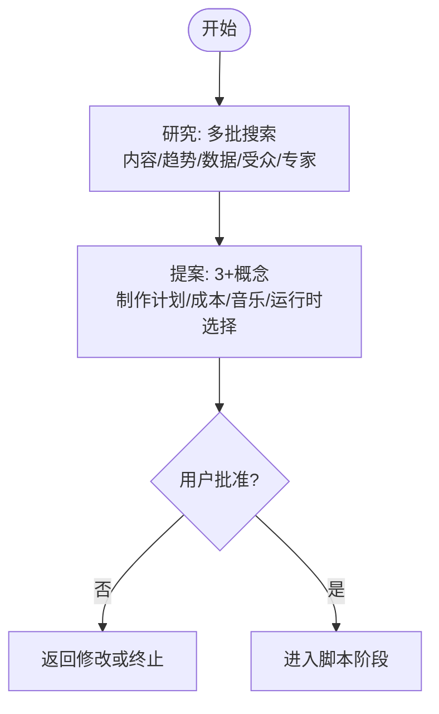
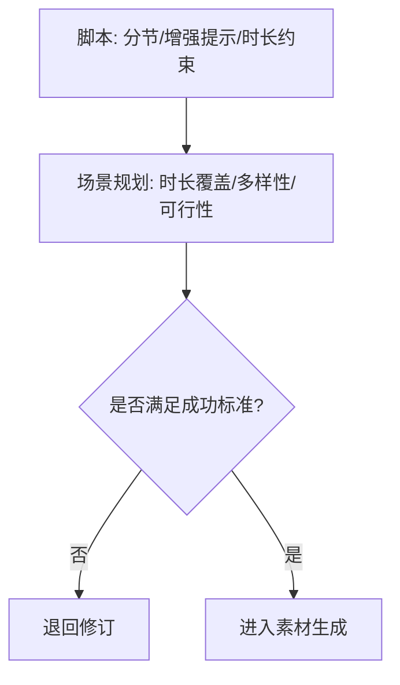
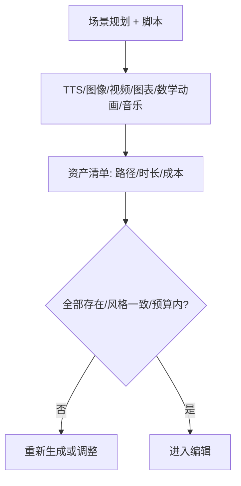
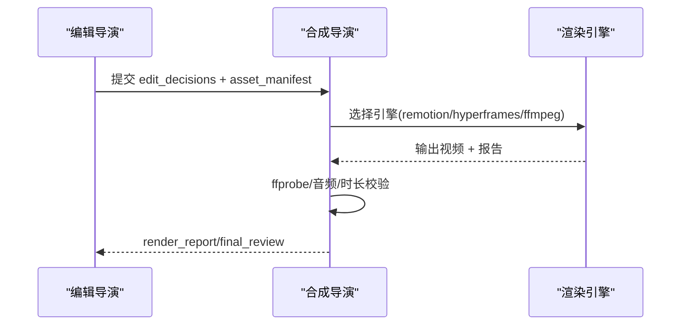
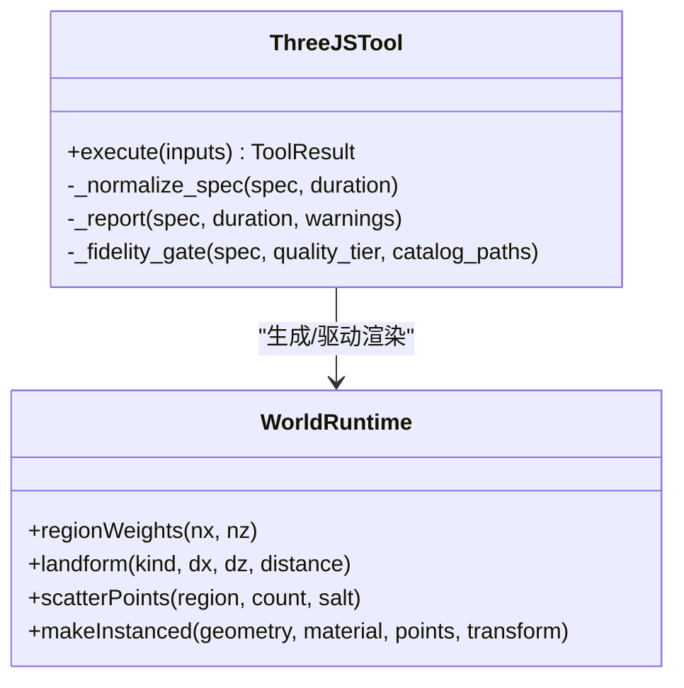
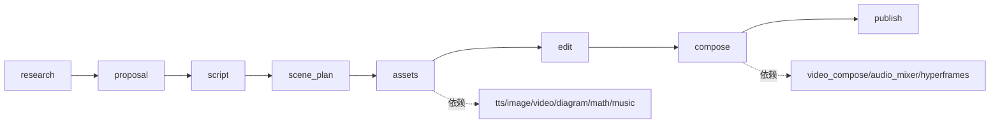

# 动画解释器管道

<cite>
**本文引用的文件**
- [README.md](file://README.md)
- [animated-explainer.yaml](file://pipeline_defs/animated-explainer.yaml)
- [config.yaml](file://config.yaml)
- [config_model.py](file://lib/config_model.py)
- [executive-producer.md](file://skills/pipelines/explainer/executive-producer.md)
- [research-director.md](file://skills/pipelines/explainer/research-director.md)
- [proposal-director.md](file://skills/pipelines/explainer/proposal-director.md)
- [checkpoint.py](file://lib/checkpoint.py)
- [cost_tracker.py](file://tools/cost_tracker.py)
- [video_compose.py](file://tools/video/video_compose.py)
- [hyperframes_compose.py](file://tools/video/hyperframes_compose.py)
- [threejs_world.py](file://tools/graphics/threejs_world.py)
- [world-runtime.js](file://tools/graphics/templates/threejs_world/world-runtime.js)
</cite>

## 目录
1. [简介](#简介)
2. [项目结构](#项目结构)
3. [核心组件](#核心组件)
4. [架构总览](#架构总览)
5. [详细组件分析](#详细组件分析)
6. [依赖关系分析](#依赖关系分析)
7. [性能与质量配置](#性能与质量配置)
8. [故障排查指南](#故障排查指南)
9. [结论](#结论)
10. [附录：使用示例与最佳实践](#附录使用示例与最佳实践)

## 简介
本文件面向“OpenMontage 动画解释器管道”的使用者与维护者，系统性说明其设计目标、阶段流程、配置选项与最佳实践。该管道专注于以下生成能力：动态图形、图表驱动的解说、动态排版、数学可视化、Three.js 世界与风格化插图序列。它通过“研究→提案→脚本→场景规划→素材→编辑→合成→发布”的串行阶段，配合预算控制、质量门控与人类审批，确保从创意到成片的可审计、可回滚、可复现的生产过程。

## 项目结构
- 管道定义位于 pipeline_defs，以 YAML 描述阶段、工具、审查焦点与成功标准。
- 导演技能位于 skills/pipelines/explainer，指导每个阶段的执行策略与质量要求。
- 运行时配置在 config.yaml，并通过 lib/config_model.py 提供类型化加载与路径解析。
- 编排由 Executive Producer（EP）串联各阶段，并在关键节点进行质量检查与预算治理。
- 渲染与合成由 video_compose/hyperframes_compose 等工具完成；Three.js 世界通过 graphics/threejs_world 生成并驱动 world-runtime.js 渲染。

**图示来源**
- [animated-explainer.yaml:61-270](file://pipeline_defs/animated-explainer.yaml#L61-L270)
- [executive-producer.md:78-136](file://skills/pipelines/explainer/executive-producer.md#L78-L136)

**章节来源**
- [README.md:356-383](file://README.md#L356-L383)
- [animated-explainer.yaml:61-270](file://pipeline_defs/animated-explainer.yaml#L61-L270)

## 核心组件
- 管道定义（YAML）：声明阶段顺序、所需技能、产物、工具可用性与审查焦点。
- 导演技能（Markdown）：为每个阶段提供执行步骤、质量门槛与常见陷阱提示。
- EP 编排：维护跨阶段状态（预算、时长、风格锚点），执行串行推进、审阅与退回修订。
- 配置模型：集中管理 LLM、预算、检查点策略、输出参数与路径。
- 成本追踪：估算、预留、对账与阈值审批，支持 observe/warn/cap 模式。
- 渲染与合成：Remotion/HyperFrames/FFmpeg 多引擎选择与严格校验。
- Three.js 世界：基于 spec/runtime 的三维世界生成与镜头路径渲染。

**章节来源**
- [animated-explainer.yaml:61-270](file://pipeline_defs/animated-explainer.yaml#L61-L270)
- [executive-producer.md:30-136](file://skills/pipelines/explainer/executive-producer.md#L30-L136)
- [config_model.py:16-93](file://lib/config_model.py#L16-L93)
- [cost_tracker.py:117-171](file://tools/cost_tracker.py#L117-L171)
- [video_compose.py:1814-1843](file://tools/video/video_compose.py#L1814-L1843)
- [hyperframes_compose.py:165-200](file://tools/video/hyperframes_compose.py#L165-L200)
- [threejs_world.py:159-181](file://tools/graphics/threejs_world.py#L159-L181)

## 架构总览
OpenMontage 采用“代理优先”的编排方式：AI 助手读取管道清单与导演技能，调用工具注册表中的能力，按阶段产出工件，并在关键节点进行人类审批与质量门禁。

**图示来源**
- [executive-producer.md:78-136](file://skills/pipelines/explainer/executive-producer.md#L78-L136)
- [animated-explainer.yaml:61-270](file://pipeline_defs/animated-explainer.yaml#L61-L270)

## 详细组件分析

### 预生产阶段：研究与提案
- 研究（research）：零成本、无工具调用，通过多批次并行搜索构建内容全景、趋势信号、数据证据、受众问题与专家声音，产出 research_brief。
- 提案（proposal）：基于研究结果提出至少 3 个差异化概念，包含叙事结构、视觉身份、时长与平台适配、音乐计划、制作路径与成本估算；必须呈现两种渲染运行时（Remotion/HyperFrames）供用户选择并记录决策日志；设置审批门，未获批准不得进入后续阶段。

**图示来源**
- [research-director.md:19-251](file://skills/pipelines/explainer/research-director.md#L19-L251)
- [proposal-director.md:11-32](file://skills/pipelines/explainer/proposal-director.md#L11-L32)
- [proposal-director.md:78-113](file://skills/pipelines/explainer/proposal-director.md#L78-L113)
- [proposal-director.md:277-313](file://skills/pipelines/explainer/proposal-director.md#L277-L313)
- [proposal-director.md:366-427](file://skills/pipelines/explainer/proposal-director.md#L366-L427)
- [proposal-director.md:428-451](file://skills/pipelines/explainer/proposal-director.md#L428-L451)

**章节来源**
- [research-director.md:19-251](file://skills/pipelines/explainer/research-director.md#L19-L251)
- [proposal-director.md:11-32](file://skills/pipelines/explainer/proposal-director.md#L11-L32)
- [proposal-director.md:78-113](file://skills/pipelines/explainer/proposal-director.md#L78-L113)
- [proposal-director.md:277-313](file://skills/pipelines/explainer/proposal-director.md#L277-L313)
- [proposal-director.md:366-427](file://skills/pipelines/explainer/proposal-director.md#L366-L427)
- [proposal-director.md:428-451](file://skills/pipelines/explainer/proposal-director.md#L428-L451)

### 脚本与场景规划
- 脚本（script）：依据选定概念与时长目标撰写分节脚本，嵌入增强提示（enhancement cues），保证语速与时长匹配。
- 场景规划（scene_plan）：将脚本映射为可视化的场景序列，确保时长覆盖、视觉多样性、资产可行性与风格遵循。

**图示来源**
- [animated-explainer.yaml:118-159](file://pipeline_defs/animated-explainer.yaml#L118-L159)

**章节来源**
- [animated-explainer.yaml:118-159](file://pipeline_defs/animated-explainer.yaml#L118-L159)

### 素材生成
- 素材（assets）：根据场景规划与制作计划生成 TTS、图像、可选视频、数学动画、图表、代码片段与音乐；需验证所有文件存在、旁白覆盖完整、风格一致且成本在预算内。

**图示来源**
- [animated-explainer.yaml:160-197](file://pipeline_defs/animated-explainer.yaml#L160-L197)

**章节来源**
- [animated-explainer.yaml:160-197](file://pipeline_defs/animated-explainer.yaml#L160-L197)

### 编辑与合成
- 编辑（edit）：组装时间线，启用字幕与音乐避让，确保无时间轴空隙或重叠。
- 合成（compose）：选择 Remotion/HyperFrames/FFmpeg 进行渲染，输出视频并通过 ffprobe 验证；若使用 HyperFrames，需在渲染前通过 lint/validate。

**图示来源**
- [animated-explainer.yaml:198-249](file://pipeline_defs/animated-explainer.yaml#L198-L249)
- [video_compose.py:1814-1843](file://tools/video/video_compose.py#L1814-L1843)
- [hyperframes_compose.py:165-200](file://tools/video/hyperframes_compose.py#L165-L200)

**章节来源**
- [animated-explainer.yaml:198-249](file://pipeline_defs/animated-explainer.yaml#L198-L249)
- [video_compose.py:1814-1843](file://tools/video/video_compose.py#L1814-L1843)
- [hyperframes_compose.py:165-200](file://tools/video/hyperframes_compose.py#L165-L200)

### 发布
- 发布（publish）：完善 SEO 元数据、章节标记，打包导出目录（视频、元数据、缩略图概念）。

**章节来源**
- [animated-explainer.yaml:251-270](file://pipeline_defs/animated-explainer.yaml#L251-L270)

### Three.js 世界与数学可视化
- Three.js 世界：通过 world_spec 定义区域、地形材质、资产调色板、地标与相机路径；quality_tier 控制渲染保真度；world-runtime.js 负责实例化、散点分布与着色。
- 数学可视化：通过 math_animate 工具生成数学动画，作为场景资产之一参与合成。

**图示来源**
- [threejs_world.py:159-181](file://tools/graphics/threejs_world.py#L159-L181)
- [threejs_world.py:427-463](file://tools/graphics/threejs_world.py#L427-L463)
- [world-runtime.js:1-242](file://tools/graphics/templates/threejs_world/world-runtime.js#L1-L242)

**章节来源**
- [threejs_world.py:159-181](file://tools/graphics/threejs_world.py#L159-L181)
- [threejs_world.py:427-463](file://tools/graphics/threejs_world.py#L427-L463)
- [world-runtime.js:1-242](file://tools/graphics/templates/threejs_world/world-runtime.js#L1-L242)

## 依赖关系分析
- 阶段依赖：每个阶段明确 required_artifacts_in 与 produces，形成严格的流水线契约。
- 工具依赖：assets 阶段依赖 tts_selector/image_selector/video_selector/diagram_gen/math_animate/music_gen 等；compose 阶段依赖 video_compose/audio_mixer/hyperframes_compose/video_stitch。
- 运行时选择：proposal 阶段锁定 render_runtime（remotion/hyperframes），并在 compose 阶段强制执行一致性，避免静默切换。
- 配置依赖：config.yaml 与 config_model.py 提供全局 LLM、预算、检查点策略、输出参数与路径；成本追踪与审批阈值受其影响。

**图示来源**
- [animated-explainer.yaml:61-270](file://pipeline_defs/animated-explainer.yaml#L61-L270)
- [proposal-director.md:11-32](file://skills/pipelines/explainer/proposal-director.md#L11-L32)
- [config_model.py:16-93](file://lib/config_model.py#L16-L93)

**章节来源**
- [animated-explainer.yaml:61-270](file://pipeline_defs/animated-explainer.yaml#L61-L270)
- [proposal-director.md:11-32](file://skills/pipelines/explainer/proposal-director.md#L11-L32)
- [config_model.py:16-93](file://lib/config_model.py#L16-L93)

## 性能与质量配置
- 预算控制
  - 模式：observe（仅跟踪）、warn（记录超支）、cap（硬限制）。
  - 总额度：默认 $10，可按项目调整。
  - 单次行动审批阈值：默认 $0.50，超过需人工确认。
  - 新付费工具首次使用需审批（可配置）。
- 质量设置
  - 输出格式/编码/分辨率/FPS/CRF 可在 config.yaml 中统一设定。
  - 渲染质量：draft/standard/high（HyperFrames）；Remotion 通过组件与转场提升质量。
  - 严格模式：HyperFrames 渲染可通过 strict 开启严格校验。
- 工具选择与优化
  - 评分选择器：任务契合度、输出质量、控制特性、可靠性、成本效率、延迟、连续性七维打分。
  - 运行时选择：Remotion 适合数据驱动与字幕；HyperFrames 适合动效与 HTML/GSAP 场景。
  - 性能建议：优先使用 Remotion 组件减少图像生成次数；合理设置 quality_tier 与 fps；利用缓存与复用模板。

**章节来源**
- [config.yaml:1-34](file://config.yaml#L1-L34)
- [config_model.py:16-93](file://lib/config_model.py#L16-L93)
- [cost_tracker.py:117-171](file://tools/cost_tracker.py#L117-L171)
- [hyperframes_compose.py:165-200](file://tools/video/hyperframes_compose.py#L165-L200)
- [video_compose.py:1814-1843](file://tools/video/video_compose.py#L1814-L1843)
- [README.md:664-688](file://README.md#L664-L688)

## 故障排查指南
- 审批门违规
  - 现象：尝试直接写入 completed 但缺少 human_approved。
  - 原因：manifest 要求该阶段需要人类审批。
  - 处理：先写入 awaiting_human，展示摘要并等待用户批准后再写 completed。
- 预算超限
  - 现象：reserve 时抛出预算不足或需审批异常。
  - 原因：单次行动阈值或总额度被突破。
  - 处理：降低工具选择、切换到免费/本地方案或提高预算；必要时调整单动作阈值。
- 渲染失败
  - 现象：HyperFrames 严格模式下 lint/validate 失败。
  - 处理：修复样式/语法错误，或关闭严格模式迭代；确保 asset_manifest 与 playbook 正确传入。
- 时长/音画不同步
  - 现象：最终视频时长偏差或旁白与画面不匹配。
  - 处理：在 EP 阶段进行 A/V 同步检查；必要时退回 script/scene_plan/edit 调整。

**章节来源**
- [checkpoint.py:293-491](file://lib/checkpoint.py#L293-L491)
- [cost_tracker.py:117-171](file://tools/cost_tracker.py#L117-L171)
- [hyperframes_compose.py:165-200](file://tools/video/hyperframes_compose.py#L165-L200)
- [executive-producer.md:138-171](file://skills/pipelines/explainer/executive-producer.md#L138-L171)

## 结论
OpenMontage 动画解释器管道以“研究先行、提案审批、脚本与场景规划、素材生成、编辑与合成、发布”为主线，结合预算治理、质量门控与人类审批，实现了从创意到成片的端到端可控生产。通过 Remotion/HyperFrames 的多引擎渲染与 Three.js 世界的三维能力，系统能够高效生成动态图形、图表驱动解说、动态排版、数学可视化与风格化插图序列。使用者只需关注主题与目标，其余可由管道自动化推进。

## 附录：使用示例与最佳实践
- 快速开始
  - 安装依赖后，在 AI 编程助手内输入自然语言需求，例如：“制作一个关于神经网络的 60 秒动画解释视频”。
  - 系统将自动执行研究、提案、脚本、场景规划、素材生成、编辑、合成与发布。
- 参考视频驱动
  - 粘贴一个你喜欢的参考视频链接，系统会分析其节奏、结构与风格，给出 2-3 个差异化概念与成本估算，再进入制作。
- 最佳实践
  - 在提案阶段明确时长、平台与预算，选择合适渲染运行时（Remotion 或 HyperFrames）。
  - 充分利用免费/本地工具（如 Piper TTS、Remotion 组件、开源素材）降低成本。
  - 保持风格一致性：在提案阶段确定视觉身份与配色，并在素材阶段持续校验。
  - 重视预算治理：提前估算成本，设置单次行动审批阈值，避免意外支出。
  - 使用 Backlot 看板实时查看进度与审批点，及时做出创意决策。

**章节来源**
- [README.md:180-216](file://README.md#L180-L216)
- [README.md:308-353](file://README.md#L308-L353)
- [README.md:356-383](file://README.md#L356-L383)
- [executive-producer.md:78-136](file://skills/pipelines/explainer/executive-producer.md#L78-L136)