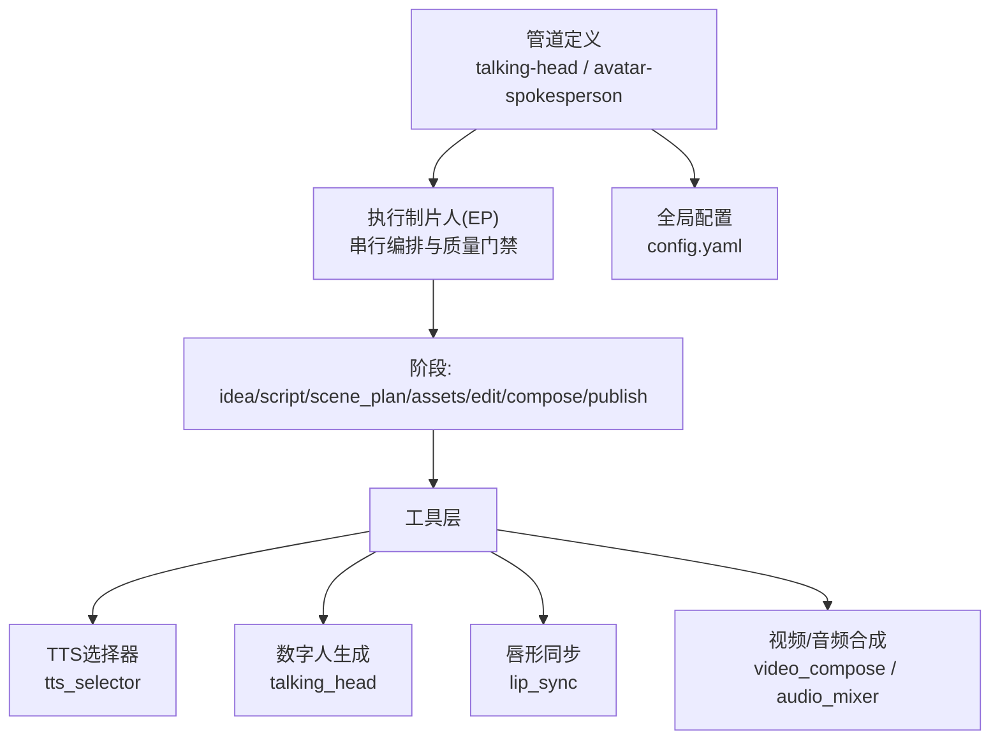
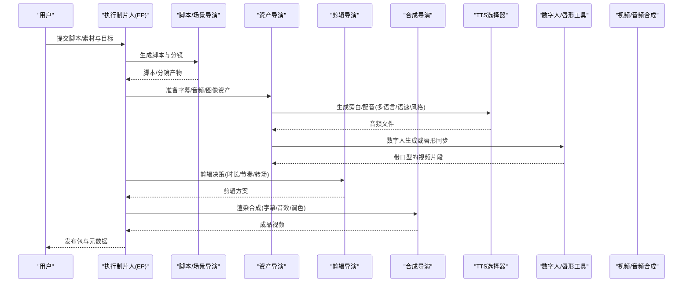
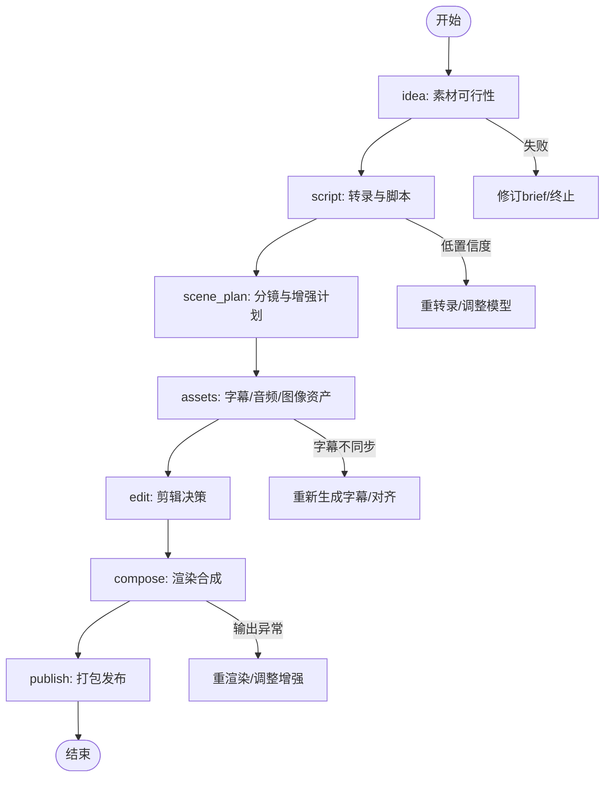
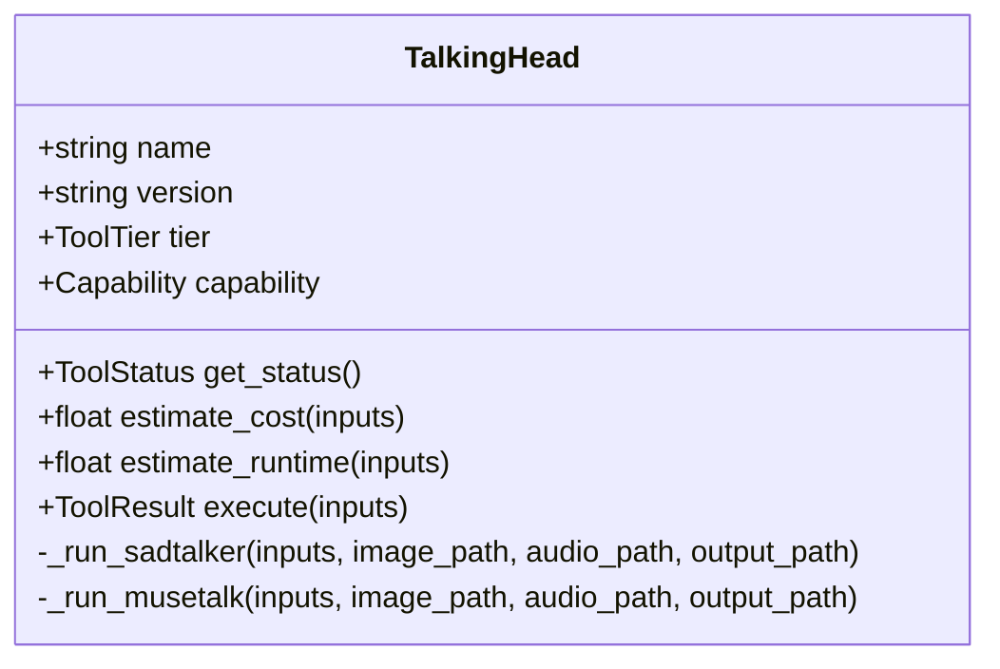
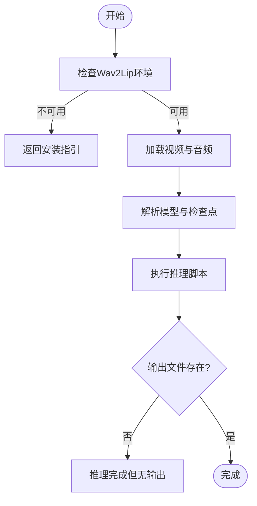
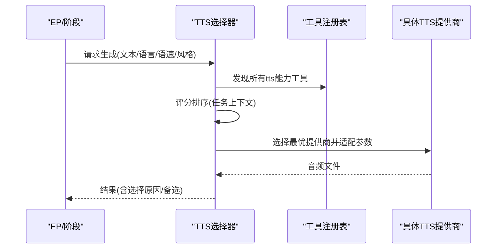
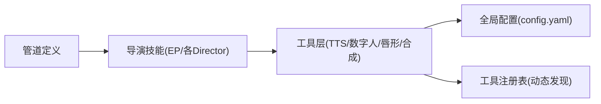

# 对话头像管道

<cite>
**本文引用的文件**
- [pipeline_defs/talking-head.yaml](file://pipeline_defs/talking-head.yaml)
- [pipeline_defs/avatar-spokesperson.yaml](file://pipeline_defs/avatar-spokesperson.yaml)
- [skills/pipelines/talking-head/executive-producer.md](file://skills/pipelines/talking-head/executive-producer.md)
- [skills/pipelines/avatar-spokesperson/executive-producer.md](file://skills/pipelines/avatar-spokesperson/executive-producer.md)
- [tools/avatar/talking_head.py](file://tools/avatar/talking_head.py)
- [tools/avatar/lip_sync.py](file://tools/avatar/lip_sync.py)
- [tools/audio/tts_selector.py](file://tools/audio/tts_selector.py)
- [config.yaml](file://config.yaml)
</cite>

## 目录
1. [简介](#简介)
2. [项目结构](#项目结构)
3. [核心组件](#核心组件)
4. [架构总览](#架构总览)
5. [详细组件分析](#详细组件分析)
6. [依赖关系分析](#依赖关系分析)
7. [性能考量](#性能考量)
8. [故障排查指南](#故障排查指南)
9. [结论](#结论)
10. [附录](#附录)

## 简介
本文件面向“对话头像管道”，聚焦AI驱动的数字人视频生成与口播内容制作。文档从端到端流程出发，解释脚本到视频的转换链路：文本分析、语音合成、唇形同步/面部动画、以及最终的视频合成与发布。同时提供数字人形象定制、语音选择与语种支持、语速控制与情感表达等最佳实践，并对比新闻播报、产品介绍、教育讲解等典型场景的配置与效果差异。

## 项目结构
OpenMontage通过“管道定义 + 导演技能 + 工具注册”的方式组织对话头像能力：
- 管道定义：描述阶段、产物、可用工具、质量门禁与预算策略（如 talking-head、avatar-spokesperson）。
- 导演技能：以“执行制片人（EP）”串联各阶段，维护累计状态并在关键节点进行跨阶段校验与回退。
- 工具层：提供TTS选择器、数字人生成（照片驱动说话）、唇形同步等可插拔能力。
- 全局配置：输出格式、分辨率、编码、路径等统一参数。

图表来源
- [pipeline_defs/talking-head.yaml:1-229](file://pipeline_defs/talking-head.yaml#L1-L229)
- [pipeline_defs/avatar-spokesperson.yaml:1-207](file://pipeline_defs/avatar-spokesperson.yaml#L1-L207)
- [tools/audio/tts_selector.py:1-324](file://tools/audio/tts_selector.py#L1-L324)
- [tools/avatar/talking_head.py:1-259](file://tools/avatar/talking_head.py#L1-L259)
- [tools/avatar/lip_sync.py:1-232](file://tools/avatar/lip_sync.py#L1-L232)
- [config.yaml:1-34](file://config.yaml#L1-L34)

章节来源
- [pipeline_defs/talking-head.yaml:1-229](file://pipeline_defs/talking-head.yaml#L1-L229)
- [pipeline_defs/avatar-spokesperson.yaml:1-207](file://pipeline_defs/avatar-spokesperson.yaml#L1-L207)
- [config.yaml:1-34](file://config.yaml#L1-L34)

## 核心组件
- 执行制片人（EP）：负责串行调度各阶段、维护累计状态、执行跨阶段检查、必要时将任务退回上游修正，确保字幕同步、音频质量、画面一致性。
- 管道阶段：idea（素材可行性）、script（转录/脚本）、scene_plan（分镜与增强计划）、assets（字幕/音频/图像资产）、edit（剪辑决策）、compose（渲染合成）、publish（打包发布）。
- 工具能力：
  - TTS选择器：自动发现并选择最优TTS提供商，支持多语言、语速、音高、稳定性、风格化等参数透传。
  - 数字人生成：基于照片+音频驱动面部动画（SadTalker/MuseTalk），支持表情强度、头部静止模式、预处理方式等。
  - 唇形同步：将新配音与原有视频口型对齐（Wav2Lip/Wav2Lip-GAN），支持面区域裁剪、缩放因子等。
  - 音视频合成：视频拼接、字幕烧录、音频混音、降噪、色彩校正、自动裁切等。

章节来源
- [skills/pipelines/talking-head/executive-producer.md:1-447](file://skills/pipelines/talking-head/executive-producer.md#L1-L447)
- [skills/pipelines/avatar-spokesperson/executive-producer.md:1-172](file://skills/pipelines/avatar-spokesperson/executive-producer.md#L1-L172)
- [tools/audio/tts_selector.py:1-324](file://tools/audio/tts_selector.py#L1-L324)
- [tools/avatar/talking_head.py:1-259](file://tools/avatar/talking_head.py#L1-L259)
- [tools/avatar/lip_sync.py:1-232](file://tools/avatar/lip_sync.py#L1-L232)

## 架构总览
下图展示“脚本到视频”的端到端数据流，涵盖文本分析、语音合成、唇形同步/面部动画与视频合成。

图表来源
- [pipeline_defs/talking-head.yaml:42-229](file://pipeline_defs/talking-head.yaml#L42-L229)
- [pipeline_defs/avatar-spokesperson.yaml:45-207](file://pipeline_defs/avatar-spokesperson.yaml#L45-L207)
- [tools/audio/tts_selector.py:15-324](file://tools/audio/tts_selector.py#L15-L324)
- [tools/avatar/talking_head.py:29-259](file://tools/avatar/talking_head.py#L29-L259)
- [tools/avatar/lip_sync.py:36-232](file://tools/avatar/lip_sync.py#L36-L232)

## 详细组件分析

### 执行制片人（EP）与质量门禁
- 角色定位：EP是状态机与裁判，维护累计状态（预算、时长、转录片段、同步偏移等），在每阶段后执行“审查焦点”和“成功标准”。
- 关键门禁：
  - idea：素材可行性（是否有音轨、时长是否合理）。
  - script：转录置信度、时间戳单调性、段落边界合理性。
  - scene_plan：覆盖完整性、增强可行性、叠加元素时间对齐。
  - assets：字幕同步误差阈值、音频提取与归一化、预算门限。
  - edit：时间线完整、引用有效、字幕配置存在。
  - compose：输出探测（时长/分辨率/编解码）、字幕烧录可见性、音频清晰。
  - publish：元数据与导出包结构。
- 回退机制：当下游发现上游错误（如字幕漂移），可将任务退回上游指定阶段修正，限制最大退回次数防止死循环。

图表来源
- [skills/pipelines/talking-head/executive-producer.md:92-192](file://skills/pipelines/talking-head/executive-producer.md#L92-L192)
- [skills/pipelines/talking-head/executive-producer.md:194-286](file://skills/pipelines/talking-head/executive-producer.md#L194-L286)
- [skills/pipelines/talking-head/executive-producer.md:338-361](file://skills/pipelines/talking-head/executive-producer.md#L338-L361)

章节来源
- [skills/pipelines/talking-head/executive-producer.md:1-447](file://skills/pipelines/talking-head/executive-producer.md#L1-L447)
- [skills/pipelines/avatar-spokesperson/executive-producer.md:1-172](file://skills/pipelines/avatar-spokesperson/executive-producer.md#L1-L172)

### 数字人生成（照片驱动说话）
- 输入：人脸照片路径、驱动音频路径；可选模型（sadtalker/musetalk）、表情强度、头部静止模式、预处理方式。
- 处理：调用本地GPU推理（SadTalker），根据音频驱动面部动画，输出MP4。
- 资源与约束：需要CUDA与ffmpeg；估计运行时间约60秒；支持幂等键避免重复计算。
- 验证：用户需观看生成视频确认口型准确度与面部自然度。

图表来源
- [tools/avatar/talking_head.py:29-259](file://tools/avatar/talking_head.py#L29-L259)

章节来源
- [tools/avatar/talking_head.py:1-259](file://tools/avatar/talking_head.py#L1-L259)

### 唇形同步（替换配音并对齐口型）
- 输入：源视频（含人脸）、新音频；可选模型（wav2lip/wav2lip_gan）、面部裁剪边距、缩放因子。
- 处理：定位Wav2Lip安装目录与检查点，执行推理脚本，输出对口型的视频。
- 资源与约束：需要PyTorch与ffmpeg；超时保护（600秒）；若缺少检查点或脚本则返回错误。
- 验证：用户需核对口型与新音频的一致性，检查面部区域伪影。

图表来源
- [tools/avatar/lip_sync.py:110-232](file://tools/avatar/lip_sync.py#L110-L232)

章节来源
- [tools/avatar/lip_sync.py:1-232](file://tools/avatar/lip_sync.py#L1-L232)

### 文本转语音（TTS选择器）
- 功能：自动发现所有具备“tts”能力的工具，按任务上下文评分选择最优提供商；支持多语言、语速、音高、稳定性、风格化、SSML、时间戳等。
- 路由：允许用户指定首选提供商或限定候选集；支持“rank”模式仅返回评分而不生成。
- 适配：对不同提供商的参数进行标准化映射（如speaking_rate→rate、pitch→st、style→express-as）。
- 集成：与EP和各阶段协作，为数字人或旁白提供高质量配音。

图表来源
- [tools/audio/tts_selector.py:15-324](file://tools/audio/tts_selector.py#L15-L324)

章节来源
- [tools/audio/tts_selector.py:1-324](file://tools/audio/tts_selector.py#L1-L324)

### 管道阶段与产物
- talking-head：面向真实人物口播素材，强调转录准确性、字幕同步与后期增强。
- avatar-spokesperson：面向数字人发言人，强调口型质量、主持人构图、音频清晰度与CTA落地。
- 两管道均包含idea→script→scene_plan→assets→edit→compose→publish七阶段，并通过EP进行质量门禁与回退。

章节来源
- [pipeline_defs/talking-head.yaml:1-229](file://pipeline_defs/talking-head.yaml#L1-L229)
- [pipeline_defs/avatar-spokesperson.yaml:1-207](file://pipeline_defs/avatar-spokesperson.yaml#L1-L207)

## 依赖关系分析
- 管道与技能：管道定义声明所需技能（如executive-producer、各director），由EP加载并串行执行。
- 工具依赖：
  - talking_head依赖SadTalker/MuseTalk（本地GPU）。
  - lip_sync依赖Wav2Lip（本地GPU）。
  - tts_selector依赖工具注册表与各TTS提供商可用性。
- 全局配置：输出格式、分辨率、编码、路径等影响最终合成与发布。

图表来源
- [pipeline_defs/talking-head.yaml:17-41](file://pipeline_defs/talking-head.yaml#L17-L41)
- [pipeline_defs/avatar-spokesperson.yaml:26-44](file://pipeline_defs/avatar-spokesperson.yaml#L26-L44)
- [tools/audio/tts_selector.py:157-181](file://tools/audio/tts_selector.py#L157-L181)
- [config.yaml:20-34](file://config.yaml#L20-L34)

章节来源
- [pipeline_defs/talking-head.yaml:17-41](file://pipeline_defs/talking-head.yaml#L17-L41)
- [pipeline_defs/avatar-spokesperson.yaml:26-44](file://pipeline_defs/avatar-spokesperson.yaml#L26-L44)
- [tools/audio/tts_selector.py:157-181](file://tools/audio/tts_selector.py#L157-L181)
- [config.yaml:20-34](file://config.yaml#L20-L34)

## 性能考量
- 本地GPU推理：数字人与唇形同步对显存与算力要求较高，建议预留足够VRAM并选择合适的预处理/缩放以降低耗时。
- 超时与重试：唇形同步设置600秒超时；EP限制每阶段最多3次修订与有限退回次数，避免无限循环。
- 预算控制：全局预算与单动作审批阈值可防止过度消费；EP在各阶段进行预算门限检查。
- 并行与缓存：工具幂等键可减少重复计算；TTS选择器支持“rank”模式预评估，减少无效生成。

[本节为通用指导，不直接分析具体文件]

## 故障排查指南
- 数字人生成失败：
  - 检查SADTALKER_PATH环境变量与目录是否存在；确认CUDA与ffmpeg已安装。
  - 若使用MuseTalk尚未实现，请切换至sadtalker。
  - 验证输入图片与音频路径有效。
- 唇形同步失败：
  - 检查WAV2LIP_PATH与检查点文件是否存在；确认inference.py存在。
  - 若超时或无输出，检查系统资源与输入媒体兼容性。
- TTS选择失败：
  - 确认至少一个TTS提供商可用；可通过“rank”模式查看候选与评分。
  - 检查语言代码、语速、风格等参数是否与所选提供商兼容。
- 字幕不同步：
  - EP会在assets阶段进行字幕同步检查（误差阈值±0.3s）；若超差，退回asset director重新生成字幕。
- 输出异常：
  - 使用ffprobe探测输出文件的时长、分辨率、编解码；检查字幕烧录与音频轨道。

章节来源
- [tools/avatar/talking_head.py:111-173](file://tools/avatar/talking_head.py#L111-L173)
- [tools/avatar/lip_sync.py:110-209](file://tools/avatar/lip_sync.py#L110-L209)
- [tools/audio/tts_selector.py:178-225](file://tools/audio/tts_selector.py#L178-L225)
- [skills/pipelines/talking-head/executive-producer.md:244-286](file://skills/pipelines/talking-head/executive-producer.md#L244-L286)

## 结论
OpenMontage的对话头像管道通过“管道定义 + 执行制片人 + 可插拔工具”实现了从脚本到数字人口播视频的自动化生产。借助严格的阶段门禁与跨阶段校验，系统能保障转录质量、字幕同步、音频清晰与画面一致。结合TTS选择器与数字人/唇形工具，可灵活适配多种风格与语种，满足新闻播报、产品介绍、教育讲解等多场景需求。

[本节为总结性内容，不直接分析具体文件]

## 附录

### 配置选项与最佳实践
- 外观定制：
  - 数字人：选择模型（sadtalker/musetalk）、表情强度、头部静止模式、预处理方式（crop/resize/full）。
  - 背景与叠加：在scene_plan中规划背景与次要图形，保持主持人为视觉主体。
- 声音选择与语种：
  - 通过TTS选择器指定语言代码、语速、音高、稳定性、风格化；支持多语言与SSML。
  - 推荐先使用“rank”模式评估候选提供商，再批量生成。
- 语速与情感：
  - 语速控制在0.5–2.0倍（或对应提供商的speaking_rate/range），保证自然流畅。
  - 情感表达通过style/instructions等参数调节，注意避免过度夸张导致失真。
- 专业表现：
  - 保持脚本口语化、段落边界合理；避免长句与复杂术语堆砌。
  - 在compose阶段加入字幕、音效与调色，确保整体观感一致。

章节来源
- [tools/avatar/talking_head.py:56-99](file://tools/avatar/talking_head.py#L56-L99)
- [tools/audio/tts_selector.py:39-155](file://tools/audio/tts_selector.py#L39-L155)
- [pipeline_defs/avatar-spokesperson.yaml:82-135](file://pipeline_defs/avatar-spokesperson.yaml#L82-L135)

### 应用场景对比
- 新闻播报：
  - 倾向clean-professional风格；主持人居中构图；字幕简洁；语速适中；强调信息密度与清晰度。
- 产品介绍：
  - 可搭配flat-motion-graphics；适度叠加产品图与要点；CTA明确；语速稍快以提升节奏感。
- 教育讲解：
  - 注重可读性与重点突出；适当放慢语速；字幕位置避开面部；可加入图示与标注。

章节来源
- [pipeline_defs/avatar-spokesperson.yaml:36-44](file://pipeline_defs/avatar-spokesperson.yaml#L36-L44)
- [skills/pipelines/avatar-spokesperson/executive-producer.md:86-119](file://skills/pipelines/avatar-spokesperson/executive-producer.md#L86-L119)