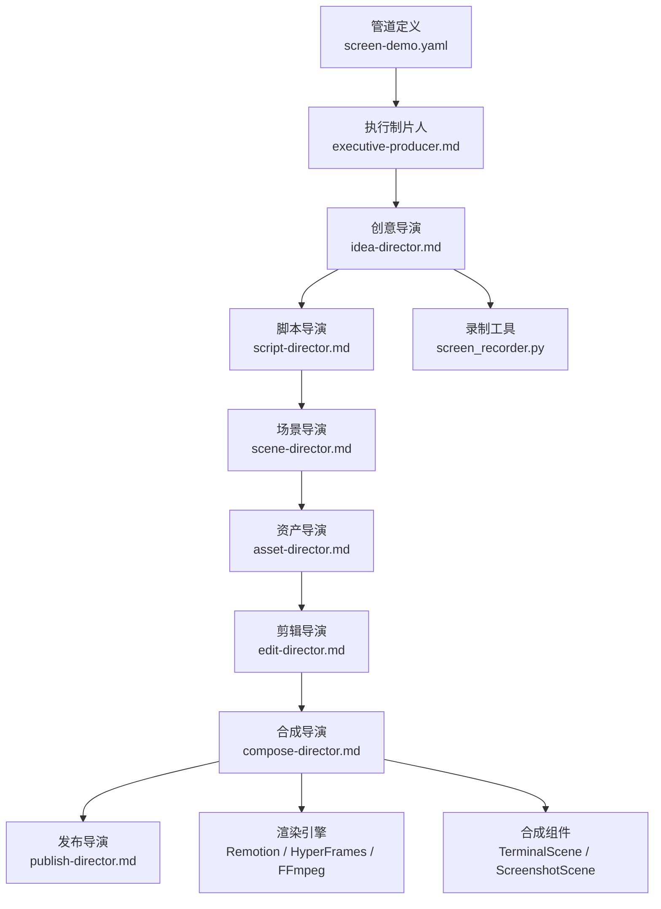
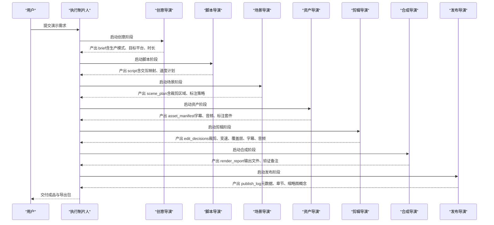
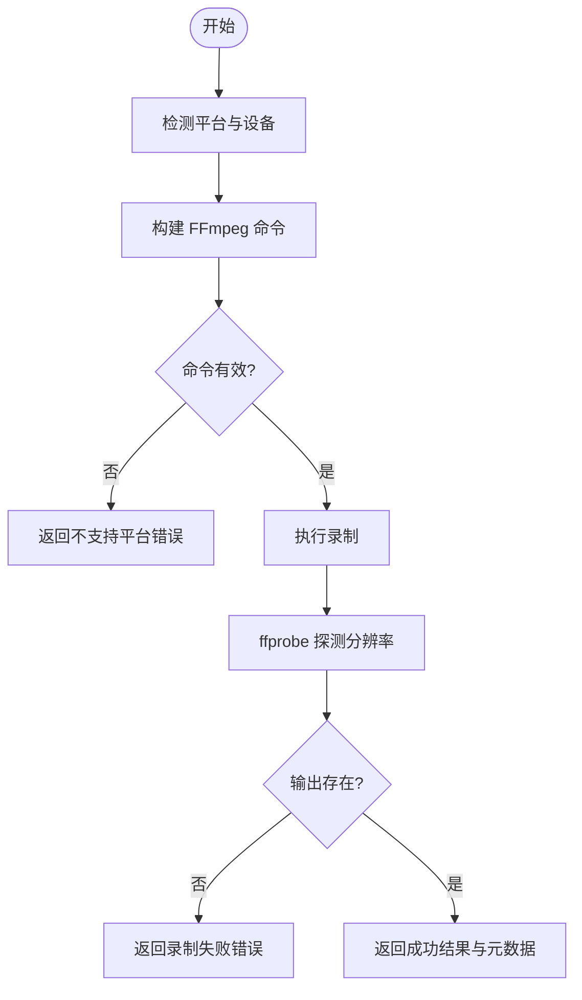
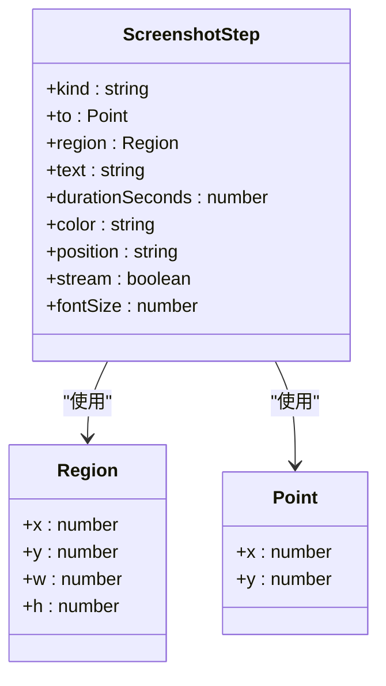
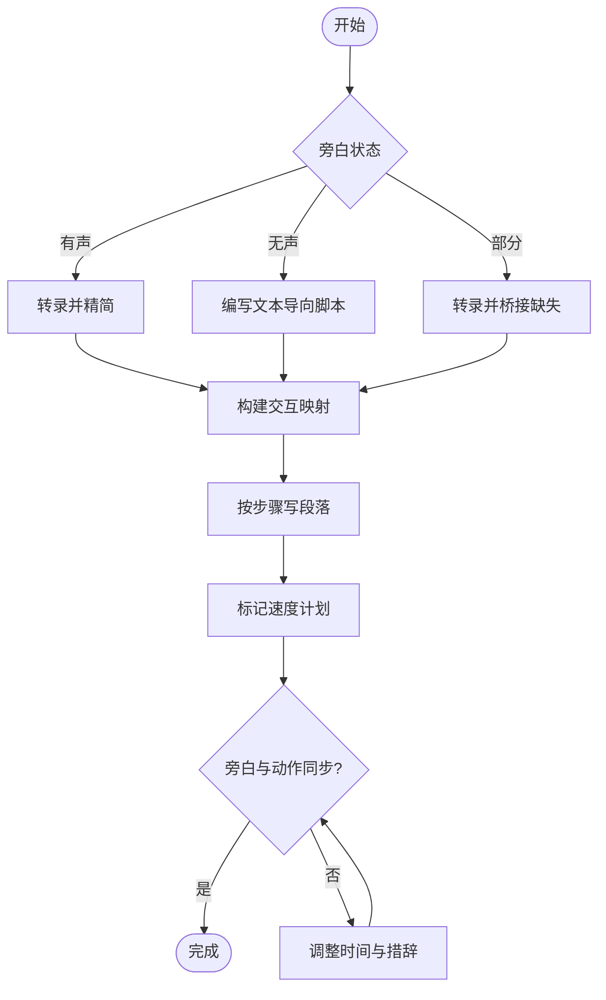
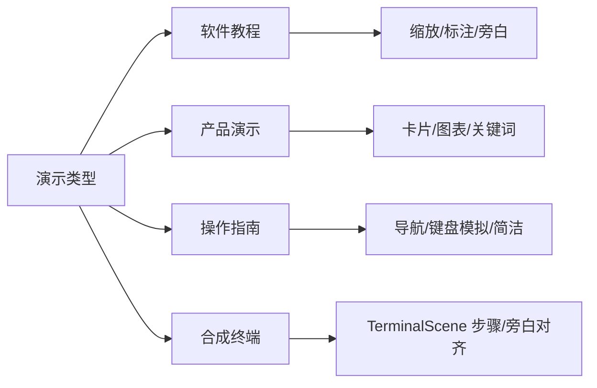
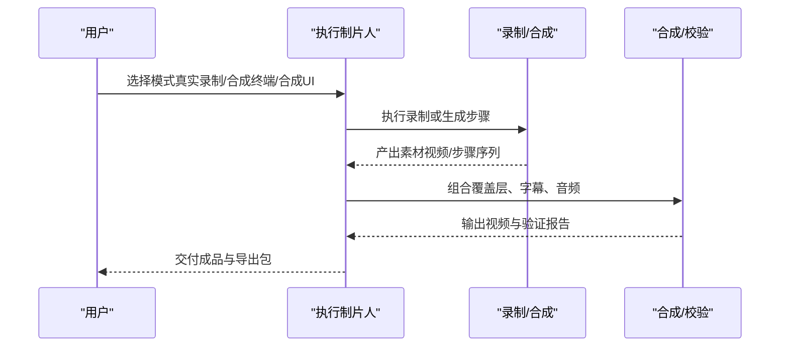
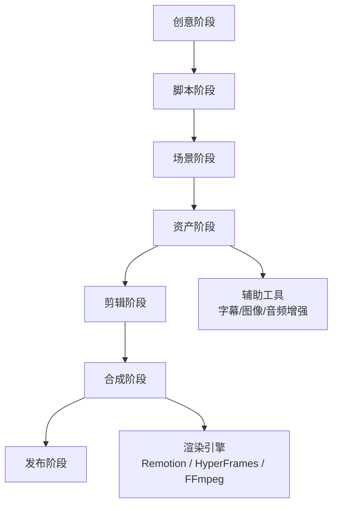

# 屏幕演示管道

<cite>
**本文引用的文件**
- [screen-demo.yaml](file://pipeline_defs/screen-demo.yaml)
- [executive-producer.md](file://skills/pipelines/screen-demo/executive-producer.md)
- [idea-director.md](file://skills/pipelines/screen-demo/idea-director.md)
- [script-director.md](file://skills/pipelines/screen-demo/script-director.md)
- [scene-director.md](file://skills/pipelines/screen-demo/scene-director.md)
- [asset-director.md](file://skills/pipelines/screen-demo/asset-director.md)
- [edit-director.md](file://skills/pipelines/screen-demo/edit-director.md)
- [compose-director.md](file://skills/pipelines/screen-demo/compose-director.md)
- [publish-director.md](file://skills/pipelines/screen-demo/publish-director.md)
- [screen_recorder.py](file://tools/capture/screen_recorder.py)
- [SKILL.md（合成终端录制）](file://.agents/skills/synthetic-screen-recording/SKILL.md)
- [SCENE_TYPES.md](file://remotion-composer/SCENE_TYPES.md)
- [ScreenshotScene.tsx](file://remotion-composer/src/components/ScreenshotScene.tsx)
- [screen-recording.md](file://skills/creative/screen-recording.md)
</cite>

## 目录
1. [简介](#简介)
2. [项目结构](#项目结构)
3. [核心组件](#核心组件)
4. [架构总览](#架构总览)
5. [详细组件分析](#详细组件分析)
6. [依赖关系分析](#依赖关系分析)
7. [性能与质量考量](#性能与质量考量)
8. [故障排查指南](#故障排查指南)
9. [结论](#结论)
10. [附录：配置与示例](#附录配置与示例)

## 简介
本文件面向“OpenMontage 屏幕演示管道”，聚焦于软件演示、产品教程与操作指导视频的自动化生成。该管道支持两类生产模式：
- 真实录制模式：基于系统级屏幕录制，叠加标注、缩放裁剪、字幕与音频清理，产出高质量演示视频。
- 合成终端模式：使用 Remotion TerminalScene 生成可重复、像素精确的终端动画，适合 CLI/安装流程等可脚本化的演示。

管道通过多阶段编排（创意→脚本→场景→资产→剪辑→合成→发布），在每个阶段设置人工审核门控与跨阶段质检，确保文本可读性、节奏感与最终输出质量。

**章节来源**
- [screen-demo.yaml:1-247](file://pipeline_defs/screen-demo.yaml#L1-L247)
- [executive-producer.md:1-278](file://skills/pipelines/screen-demo/executive-producer.md#L1-L278)

## 项目结构
屏幕演示管道由以下关键部分组成：
- 管道定义：描述阶段、工具、产物与审核策略。
- 导演技能：每个阶段的执行规范与质量门禁。
- 录制与合成工具：屏幕录制、Remotion/HyperFrames 渲染、FFmpeg 处理。
- 运行时组件：TerminalScene、ScreenshotScene 等用于合成 UI/终端演示。

**图表来源**
- [screen-demo.yaml:77-247](file://pipeline_defs/screen-demo.yaml#L77-L247)
- [executive-producer.md:67-137](file://skills/pipelines/screen-demo/executive-producer.md#L67-L137)
- [screen_recorder.py:80-175](file://tools/capture/screen_recorder.py#L80-L175)
- [SCENE_TYPES.md:9-27](file://remotion-composer/SCENE_TYPES.md#L9-L27)

**章节来源**
- [screen-demo.yaml:1-247](file://pipeline_defs/screen-demo.yaml#L1-L247)
- [executive-producer.md:1-278](file://skills/pipelines/screen-demo/executive-producer.md#L1-L278)

## 核心组件
- 执行制片人（EP）：串行编排各阶段，维护预算、时长、分辨率、噪音标记等状态；在每阶段后执行跨阶段检查，必要时退回修订或重跑。
- 创意导演：确定生产模式（真实录制/合成终端）、目标平台、时长范围、关键交互与死时间；锁定 render_runtime。
- 脚本导演：将录制内容转为带时间戳的操作脚本，建立交互映射与速度计划，保证旁白与动作同步。
- 场景导演：规划注意力移动，制定缩放裁剪区域、标注策略与节奏处理。
- 资产导演：生成字幕、清理音频、构建可复用标注套件（高亮框、箭头、步骤标签、键盘快捷键徽章、模糊遮罩）。
- 剪辑导演：将计划转化为具体剪辑决策（裁剪、变速、覆盖层、字幕、音频行为）。
- 合成导演：按锁定的运行时代码路径进行渲染与校验，确保文本可读性与音画一致。
- 发布导演：打包元数据、章节标记、缩略图概念与平台适配文案。

**章节来源**
- [executive-producer.md:32-137](file://skills/pipelines/screen-demo/executive-producer.md#L32-L137)
- [idea-director.md:15-129](file://skills/pipelines/screen-demo/idea-director.md#L15-L129)
- [script-director.md:15-121](file://skills/pipelines/screen-demo/script-director.md#L15-L121)
- [scene-director.md:16-125](file://skills/pipelines/screen-demo/scene-director.md#L16-L125)
- [asset-director.md:7-130](file://skills/pipelines/screen-demo/asset-director.md#L7-L130)
- [edit-director.md:15-88](file://skills/pipelines/screen-demo/edit-director.md#L15-L88)
- [compose-director.md:7-99](file://skills/pipelines/screen-demo/compose-director.md#L7-L99)
- [publish-director.md:15-81](file://skills/pipelines/screen-demo/publish-director.md#L15-L81)

## 架构总览
屏幕演示管道的端到端流程如下：

**图表来源**
- [screen-demo.yaml:77-247](file://pipeline_defs/screen-demo.yaml#L77-L247)
- [executive-producer.md:76-137](file://skills/pipelines/screen-demo/executive-producer.md#L76-L137)

**章节来源**
- [screen-demo.yaml:77-247](file://pipeline_defs/screen-demo.yaml#L77-L247)
- [executive-producer.md:67-137](file://skills/pipelines/screen-demo/executive-producer.md#L67-L137)

## 详细组件分析

### 录制集成：真实屏幕录制
- 能力：跨平台（Windows/macOS/Linux）屏幕录制，可选系统/麦克风音频，支持区域录制与多显示器索引。
- 实现要点：
  - Windows：gdigrab + dshow 音频设备探测。
  - macOS：avfoundation，支持 region 裁剪（后期 crop）。
  - Linux：x11grab + pulse 音频。
- 输出：MP4，包含分辨率探测、文件大小、是否含音频等元信息。
- 失败处理：超时、无输出文件、平台不支持时返回明确错误。

**图表来源**
- [screen_recorder.py:176-253](file://tools/capture/screen_recorder.py#L176-L253)
- [screen_recorder.py:255-374](file://tools/capture/screen_recorder.py#L255-L374)
- [screen_recorder.py:376-395](file://tools/capture/screen_recorder.py#L376-L395)

**章节来源**
- [screen_recorder.py:80-175](file://tools/capture/screen_recorder.py#L80-L175)
- [screen_recorder.py:176-253](file://tools/capture/screen_recorder.py#L176-L253)
- [screen_recorder.py:255-374](file://tools/capture/screen_recorder.py#L255-L374)
- [screen_recorder.py:376-395](file://tools/capture/screen_recorder.py#L376-L395)

### 界面元素标注与用户交互模拟
- 标注类型：高亮框、箭头、步骤标签、键盘快捷键徽章、模糊遮罩。
- 交互模拟：鼠标移动、点击脉冲、输入框打字、气泡注释、打字点、暂停。
- 坐标体系：归一化坐标（0–1），适配 contain-fit 矩形，便于在不同分辨率下保持一致布局。
- 适用场景：15–30 秒聚焦式 UI 演示，无需真实录制即可呈现接近真实录制的效果。

**图表来源**
- [ScreenshotScene.tsx:28-71](file://remotion-composer/src/components/ScreenshotScene.tsx#L28-L71)
- [ScreenshotScene.tsx:170-216](file://remotion-composer/src/components/ScreenshotScene.tsx#L170-L216)

**章节来源**
- [ScreenshotScene.tsx:28-71](file://remotion-composer/src/components/ScreenshotScene.tsx#L28-L71)
- [ScreenshotScene.tsx:170-216](file://remotion-composer/src/components/ScreenshotScene.tsx#L170-L216)
- [SCENE_TYPES.md:9-27](file://remotion-composer/SCENE_TYPES.md#L9-L27)

### 步骤分解与演示脚本生成逻辑
- 步骤分解：将演示拆分为“打开设置”“粘贴令牌”“运行构建”“验证结果”等可操作的步骤。
- 脚本模式：有声旁白、无声+字幕、部分旁白三种策略；为无声录制准备纯文本导向方案。
- 交互映射：记录时间戳、动作类型、目标、重要性、建议处理方式（实时、加速、裁剪、高亮、缩放）。
- 速度计划：对安装/编译/加载等死时间采用 3–6 倍速或裁剪；关键结果保持正常速度。
- 旁白与动作同步：避免叙述光标运动，强调意图与效果；保留原声自然语流。

**图表来源**
- [script-director.md:15-121](file://skills/pipelines/screen-demo/script-director.md#L15-L121)

**章节来源**
- [script-director.md:15-121](file://skills/pipelines/screen-demo/script-director.md#L15-L121)

### 不同演示类型的配置选项
- 软件教程：侧重步骤清晰、关键功能强调、缩放与标注适度；推荐 16:9 或 1:1。
- 产品演示：突出结果与对比，使用卡片/图表/统计展示；注意标题与关键词优化。
- 操作指南：强调导航指引与键盘输入模拟；避免过度装饰，保持实用优先。
- 合成终端：适用于 CLI/安装流程，使用 TerminalScene 生成字符逐字输入、滚动输出、浮动提示与闪烁光标。

**图表来源**
- [screen-demo.yaml:22-42](file://pipeline_defs/screen-demo.yaml#L22-L42)
- [SKILL.md（合成终端录制）:55-130](file://.agents/skills/synthetic-screen-recording/SKILL.md#L55-L130)

**章节来源**
- [screen-demo.yaml:22-42](file://pipeline_defs/screen-demo.yaml#L22-L42)
- [SKILL.md（合成终端录制）:55-130](file://.agents/skills/synthetic-screen-recording/SKILL.md#L55-L130)

### 实际演示视频生成流程与效果展示
- 真实录制：捕获桌面/浏览器会话，叠加标注与字幕，清理键盘噪音，输出可读 UI 文本的视频。
- 合成终端：以步骤序列驱动 TerminalScene，命令逐字输入、输出滚动、提示浮出，旁白精准对齐。
- 合成 UI：使用 ScreenshotScene 在截图上叠加鼠标移动、点击脉冲、输入框打字、气泡注释、高亮框等，达到接近真实录制的效果。

**图表来源**
- [screen-demo.yaml:77-247](file://pipeline_defs/screen-demo.yaml#L77-L247)
- [SCENE_TYPES.md:9-27](file://remotion-composer/SCENE_TYPES.md#L9-L27)
- [ScreenshotScene.tsx:28-71](file://remotion-composer/src/components/ScreenshotScene.tsx#L28-L71)

**章节来源**
- [screen-demo.yaml:77-247](file://pipeline_defs/screen-demo.yaml#L77-L247)
- [SCENE_TYPES.md:9-27](file://remotion-composer/SCENE_TYPES.md#L9-L27)
- [ScreenshotScene.tsx:28-71](file://remotion-composer/src/components/ScreenshotScene.tsx#L28-L71)

## 依赖关系分析
- 阶段依赖：idea → script → scene_plan → assets → edit → compose → publish，顺序执行且每阶段有产出物。
- 工具依赖：
  - 录制：screen_recorder（FFmpeg）。
  - 合成：video_compose（Remotion/HyperFrames）、audio_mixer、video_trimmer。
  - 辅助：transcriber、subtitle_gen、image_selector、diagram_gen、audio_enhance。
- 运行时约束：render_runtime 在创意阶段锁定，合成阶段不得静默替换；若不可用需升级处理。

**图表来源**
- [screen-demo.yaml:77-247](file://pipeline_defs/screen-demo.yaml#L77-L247)
- [compose-director.md:7-19](file://skills/pipelines/screen-demo/compose-director.md#L7-L19)

**章节来源**
- [screen-demo.yaml:77-247](file://pipeline_defs/screen-demo.yaml#L77-L247)
- [compose-director.md:7-19](file://skills/pipelines/screen-demo/compose-director.md#L7-L19)

## 性能与质量考量
- 文本可读性：缩放裁剪需保留足够上下文，避免极端放大导致像素化；编码时选择文本友好参数。
- 节奏控制：死时间（安装、编译、加载）应加速或裁剪；关键结果保持正常速度。
- 音频质量：去除键盘噪音与房间底噪，保持旁白清晰度；音乐仅在必要时加入并确保不竞争语音。
- 标注克制：同时出现的注意力提示不超过两个；标注不应遮挡关键 UI。
- 合规与治理：锁定 render_runtime，禁止静默替换；预算与时长上限防止无限迭代。

**章节来源**
- [executive-produnder.md:104-137](file://skills/pipelines/screen-demo/executive-producer.md#L104-L137)
- [compose-director.md:31-99](file://skills/pipelines/screen-demo/compose-director.md#L31-L99)
- [screen-recording.md:37-82](file://skills/creative/screen-recording.md#L37-L82)

## 故障排查指南
- 录制失败：
  - 平台不支持：确认 Windows/macOS/Linux 环境；检查 FFmpeg 安装。
  - 无输出文件：检查权限与磁盘空间；查看 FFmpeg stderr。
  - 超时：延长超时或缩短录制时长；确认音频设备可用。
- 文本不可读：
  - 缩放过度：降低 zoom level，增加上下文。
  - 编码压缩：提高比特率或使用文本友好预设。
- 音频问题：
  - 键盘噪音：启用 audio_enhance；必要时重新录制或裁剪噪音段。
  - 旁白不同步：调整脚本时间戳与速度计划。
- 合成问题：
  - 运行时代码不可用：按 AGENT_GUIDE 升级或切换；记录决策日志。
  - 标注冲突：调整标注位置与大小，避免与字幕重叠。

**章节来源**
- [screen_recorder.py:192-253](file://tools/capture/screen_recorder.py#L192-L253)
- [compose-director.md:31-99](file://skills/pipelines/screen-demo/compose-director.md#L31-L99)
- [executive-producer.md:219-278](file://skills/pipelines/screen-demo/executive-producer.md#L219-L278)

## 结论
OpenMontage 屏幕演示管道通过严谨的多阶段编排与严格的质量门禁，实现了从真实录制到合成终端/UI 演示的完整自动化流程。其核心优势在于：
- 明确的阶段职责与产物契约。
- 针对屏幕演示的专项优化（文本可读性、节奏控制、标注克制）。
- 灵活的生产模式选择与运行时约束，保障可重复性与隐私安全。
- 丰富的交互模拟与标注能力，提升演示的可理解性与专业度。

建议在项目中优先采用“最小可行编辑”原则，逐步叠加覆盖层与特效，确保演示始终服务于教学与任务完成目标。

[本节未直接分析具体文件]

## 附录：配置与示例
- 管道配置：
  - 生产模式：real_capture 或 synthetic_terminal。
  - 目标平台与分辨率：YouTube/LinkedIn/Shorts 对应 16:9/1:1/9:16。
  - 预算与时限：默认 $1.00，最长 10 分钟。
- 示例步骤（合成终端）：
  - 使用 cmd/out/pause/pill 构建步骤序列，确保与旁白对齐。
  - 使用 verify_scene_pacing 验证时序一致性。
- 示例步骤（合成 UI）：
  - 使用 cursor_move、click_pulse、type_into、bubble_append、highlight_box、callout_balloon 等步骤。
  - 坐标使用归一化值，适配不同分辨率。

**章节来源**
- [screen-demo.yaml:22-42](file://pipeline_defs/screen-demo.yaml#L22-L42)
- [SKILL.md（合成终端录制）:55-130](file://.agents/skills/synthetic-screen-recording/SKILL.md#L55-L130)
- [ScreenshotScene.tsx:28-71](file://remotion-composer/src/components/ScreenshotScene.tsx#L28-L71)