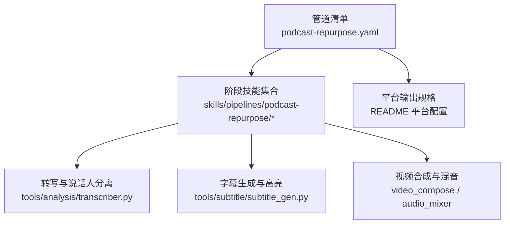
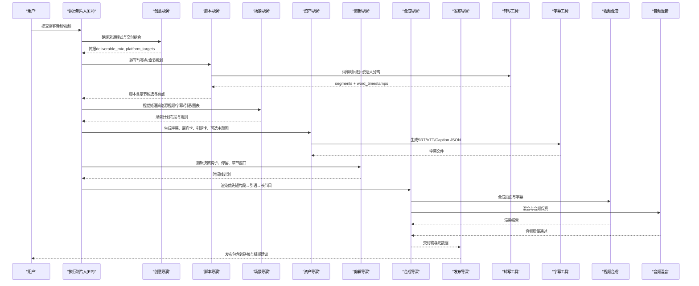
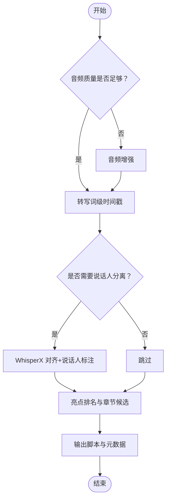
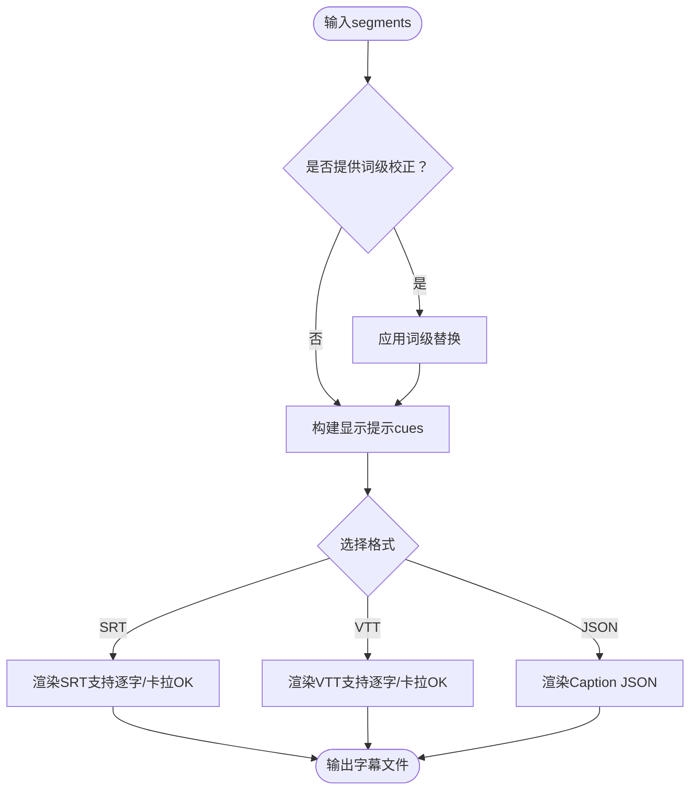
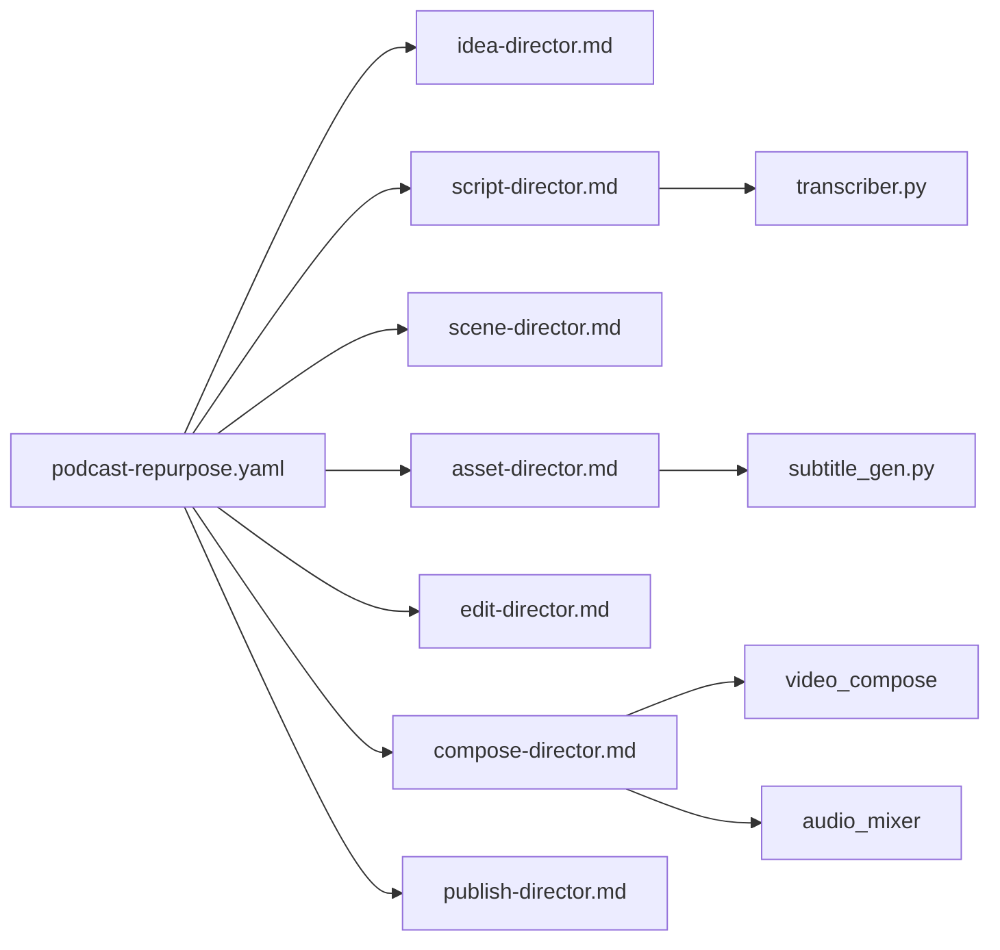

# 播客重制管道

<cite>
**本文引用的文件**
- [README.md](file://README.md)
- [podcast-repurpose.yaml](file://pipeline_defs/podcast-repurpose.yaml)
- [executive-producer.md](file://skills/pipelines/podcast-repurpose/executive-producer.md)
- [idea-director.md](file://skills/pipelines/podcast-repurpose/idea-director.md)
- [script-director.md](file://skills/pipelines/podcast-repurpose/script-director.md)
- [scene-director.md](file://skills/pipelines/podcast-repurpose/scene-director.md)
- [asset-director.md](file://skills/pipelines/podcast-repurpose/asset-director.md)
- [edit-director.md](file://skills/pipelines/podcast-repurpose/edit-director.md)
- [compose-director.md](file://skills/pipelines/podcast-repurpose/compose-director.md)
- [publish-director.md](file://skills/pipelines/podcast-repurpose/publish-director.md)
- [transcriber.py](file://tools/analysis/transcriber.py)
- [subtitle_gen.py](file://tools/subtitle/subtitle_gen.py)
</cite>

## 目录
1. [简介](#简介)
2. [项目结构](#项目结构)
3. [核心组件](#核心组件)
4. [架构总览](#架构总览)
5. [详细组件分析](#详细组件分析)
6. [依赖关系分析](#依赖关系分析)
7. [性能与质量保障](#性能与质量保障)
8. [故障排查指南](#故障排查指南)
9. [结论](#结论)
10. [附录：多平台输出与适配方案](#附录多平台输出与适配方案)

## 简介
本文件面向“OpenMontage 播客重制管道”的使用者，系统化说明如何将音频或视频播客内容自动改编为可分发的短视频、引语卡片与长节目伴生视频。文档聚焦以下能力：
- 音频分析与章节标记：基于词级时间戳的转写、说话人分离、亮点段落识别与章节划分。
- 视觉元素生成：字幕优先、嘉宾卡、引语卡、可选主题图与音乐支持。
- 字幕同步：词级高亮（逐字/卡拉OK）与多格式导出（SRT/VTT/Caption JSON）。
- 视频改编策略：根据来源模式（纯音频/视频播客/混合）选择最合适的视觉处理。
- 多平台优化：YouTube、TikTok、Instagram 等分辨率与画幅配置。
- 分发流程：从剪辑到发布元数据的全链路编排与质量门禁。

## 项目结构
播客重制管道由“编排清单 + 阶段技能 + 工具链”构成：
- 管道清单定义阶段、产物、工具与评审标准。
- 各阶段技能指导智能体如何执行并产出高质量中间产物。
- 工具层提供转写、字幕、音视频合成等能力。

图表来源
- [podcast-repurpose.yaml:1-213](file://pipeline_defs/podcast-repurpose.yaml#L1-L213)
- [executive-producer.md:1-136](file://skills/pipelines/podcast-repurpose/executive-producer.md#L1-L136)
- [transcriber.py:1-280](file://tools/analysis/transcriber.py#L1-L280)
- [subtitle_gen.py:1-336](file://tools/subtitle/subtitle_gen.py#L1-L336)
- [README.md:635-649](file://README.md#L635-L649)

章节来源
- [podcast-repurpose.yaml:1-213](file://pipeline_defs/podcast-repurpose.yaml#L1-L213)
- [README.md:356-383](file://README.md#L356-L383)

## 核心组件
- 执行制片人（EP）：串行编排七阶段，贯穿质量门禁与预算控制，确保音频保真、选片质量与多交付物一致性。
- 创意导演（Idea Director）：识别来源模式（纯音频/视频播客/混合）、对话形式（单人/访谈/小组），制定可行的交付组合与平台目标。
- 脚本导演（Script Director）：高质量转写、说话人分离、亮点排名、章节候选构建。
- 场景导演（Scene Director）：按来源模式选择视觉处理方式（源视频优先、字幕主导、引语主导、波形图等），避免“虚假丰富”。
- 资产导演（Asset Director）：字幕优先、嘉宾卡/引语卡模板化、可选主题图与音乐，首样确认后再批量生产。
- 剪辑导演（Edit Director）：短片段钩子前置、引语停留时长、长节目伴生保持简洁。
- 合成导演（Compose Director）：渲染优先级、音频保真、平台画幅校验、交付物验证。
- 发布导演（Publish Director）：每段引用回全节目、平台文案定制、发布顺序建议与跨链接元数据。

章节来源
- [executive-producer.md:1-136](file://skills/pipelines/podcast-repurpose/executive-producer.md#L1-L136)
- [idea-director.md:1-102](file://skills/pipelines/podcast-repurpose/idea-director.md#L1-L102)
- [script-director.md:1-91](file://skills/pipelines/podcast-repurpose/script-director.md#L1-L91)
- [scene-director.md:1-80](file://skills/pipelines/podcast-repurpose/scene-director.md#L1-L80)
- [asset-director.md:1-115](file://skills/pipelines/podcast-repurpose/asset-director.md#L1-L115)
- [edit-director.md:1-61](file://skills/pipelines/podcast-repurpose/edit-director.md#L1-L61)
- [compose-director.md:1-72](file://skills/pipelines/podcast-repurpose/compose-director.md#L1-L72)
- [publish-director.md:1-71](file://skills/pipelines/podcast-repurpose/publish-director.md#L1-L71)

## 架构总览
播客重制管道采用“清单驱动 + 技能指导 + 工具实现”的分层架构。清单定义阶段与产物；技能指导智能体在每个阶段的具体做法；工具层提供转写、字幕、合成等能力。

图表来源
- [podcast-repurpose.yaml:46-213](file://pipeline_defs/podcast-repurpose.yaml#L46-L213)
- [executive-producer.md:46-118](file://skills/pipelines/podcast-repurpose/executive-producer.md#L46-L118)
- [transcriber.py:116-240](file://tools/analysis/transcriber.py#L116-L240)
- [subtitle_gen.py:82-129](file://tools/subtitle/subtitle_gen.py#L82-L129)

## 详细组件分析

### 音频分析与章节标记
- 词级时间戳：转写工具输出每个词的起止时间与置信度，支撑字幕逐字高亮与精确对齐。
- 说话人分离：在多人场景中启用说话人标注，提升引语归属准确性。
- 亮点与章节：脚本阶段基于转录文本识别洞察、争议点、情感峰值与实践建议，并规划章节边界用于长节目伴生。

图表来源
- [transcriber.py:116-240](file://tools/analysis/transcriber.py#L116-L240)
- [transcriber.py:242-280](file://tools/analysis/transcriber.py#L242-L280)
- [script-director.md:15-57](file://skills/pipelines/podcast-repurpose/script-director.md#L15-L57)

章节来源
- [script-director.md:15-57](file://skills/pipelines/podcast-repurpose/script-director.md#L15-L57)
- [transcriber.py:116-240](file://tools/analysis/transcriber.py#L116-L240)

### 视觉元素生成与模板化
- 字幕优先：所有交付物必须包含字幕，保证可读性与无障碍。
- 嘉宾卡与引语卡：使用可复用模板，确保同一期节目视觉一致。
- 主题图与音乐：仅在必要时使用，避免喧宾夺主；先出“英雄片段”样例确认风格再批量生产。

章节来源
- [asset-director.md:17-69](file://skills/pipelines/podcast-repurpose/asset-director.md#L17-L69)
- [asset-director.md:27-35](file://skills/pipelines/podcast-repurpose/asset-director.md#L27-L35)

### 字幕同步与高亮
- 输入：来自转写的分段与词级时间戳。
- 输出：SRT/VTT/Caption JSON，支持“无高亮/逐字/卡拉OK”三种样式。
- 校正：支持词级替换修正，提高专有名词与品牌词准确性。

图表来源
- [subtitle_gen.py:82-129](file://tools/subtitle/subtitle_gen.py#L82-L129)
- [subtitle_gen.py:131-166](file://tools/subtitle/subtitle_gen.py#L131-L166)
- [subtitle_gen.py:168-227](file://tools/subtitle/subtitle_gen.py#L168-L227)
- [subtitle_gen.py:229-309](file://tools/subtitle/subtitle_gen.py#L229-L309)

章节来源
- [subtitle_gen.py:82-129](file://tools/subtitle/subtitle_gen.py#L82-L129)
- [subtitle_gen.py:168-227](file://tools/subtitle/subtitle_gen.py#L168-L227)

### 视频改编策略与平台适配
- 来源模式决定视觉策略：
  - 视频播客：优先使用源视频说话人镜头。
  - 纯音频：采用字幕主导或引语主导布局，辅以波形或主题图。
  - 混合：结合源视频与品牌素材。
- 平台画幅与分辨率：
  - 竖屏 9:16（Shorts/Reels/TikTok）
  - 方形 1:1（LinkedIn/Feed安全版）
  - 横屏 16:9（YouTube 伴生视频）
  - 其他如 4K、电影宽屏等见平台配置表。

章节来源
- [idea-director.md:23-65](file://skills/pipelines/podcast-repurpose/idea-director.md#L23-L65)
- [scene-director.md:18-28](file://skills/pipelines/podcast-repurpose/scene-director.md#L18-L28)
- [compose-director.md:43-47](file://skills/pipelines/podcast-repurpose/compose-director.md#L43-L47)
- [README.md:635-649](file://README.md#L635-L649)

### 不同播客类型的适配方案
- 访谈节目：强调说话人分离与引语归属，使用嘉宾卡与引语卡突出金句；长节目伴生用章节卡分隔话题。
- 独白演讲：以字幕主导为主，配合关键词高亮与少量主题图；保持节奏紧凑。
- 讨论小组：强化说话人切换标记与多视角布局；引语卡需明确发言者；长节目伴生注重话题过渡。

章节来源
- [script-director.md:21-53](file://skills/pipelines/podcast-repurpose/script-director.md#L21-L53)
- [scene-director.md:18-39](file://skills/pipelines/podcast-repurpose/scene-director.md#L18-L39)
- [edit-director.md:17-38](file://skills/pipelines/podcast-repurpose/edit-director.md#L17-L38)

### 多平台优化选项
- YouTube Landscape 16:9：适合长节目伴生与搜索友好描述。
- YouTube Shorts 9:16：强钩子开头、快速字幕出现、清晰归属。
- Instagram Reels/TikTok 9:16：引语卡与关键词高亮，移动端可读性优先。
- LinkedIn Feed 1:1：更稳健的构图与更丰富的上下文文案。

章节来源
- [README.md:635-649](file://README.md#L635-L649)
- [publish-director.md:26-31](file://skills/pipelines/podcast-repurpose/publish-director.md#L26-L31)

## 依赖关系分析
- 管道清单依赖阶段技能与工具：
  - 脚本阶段依赖转写工具与可选音频增强。
  - 资产阶段依赖字幕生成、图像选择、图表生成与音乐生成。
  - 合成阶段依赖视频合成与音频混音。
- 运行时约束：
  - 播客管道当前阶段限定 Remotion 或 FFmpeg 作为渲染后端，HyperFrames 因字幕能力尚未完全对等而暂不可用。

图表来源
- [podcast-repurpose.yaml:46-213](file://pipeline_defs/podcast-repurpose.yaml#L46-L213)
- [compose-director.md:7-13](file://skills/pipelines/podcast-repurpose/compose-director.md#L7-L13)

章节来源
- [podcast-repurpose.yaml:46-213](file://pipeline_defs/podcast-repurpose.yaml#L46-L213)
- [compose-director.md:7-13](file://skills/pipelines/podcast-repurpose/compose-director.md#L7-L13)

## 性能与质量保障
- 质量门禁（EP 贯穿）：
  - 来源评估、转写质量、片段独立性、音频保真、交付物一致性、渲染验证、发布元数据。
- 渲染优先级：
  - 短片段 → 引语片段 → 长节目伴生，确保最快产出可发布内容。
- 音频保真：
  - 避免不必要的重编码，保持语音清晰度与稳定性，谨慎使用背景音乐。
- 平台规格校验：
  - 分辨率、画幅、字幕可读性、归属信息、品牌一致性。

章节来源
- [executive-produnder.md:46-118](file://skills/pipelines/podcast-repurpose/executive-producer.md#L46-L118)
- [compose-director.md:24-56](file://skills/pipelines/podcast-repurpose/compose-director.md#L24-L56)

## 故障排查指南
- 转写失败或延迟：
  - 检查 faster-whisper 安装与设备可用性；GPU 不可用时自动回退 CPU。
  - 若启用说话人分离，确保 WhisperX 与 HF_TOKEN 可用。
- 字幕不同步：
  - 核对词级时间戳与播放效果；必要时使用校正字典修正专有名词。
- 渲染失败或画质问题：
  - 确认渲染后端为 Remotion 或 FFmpeg；检查平台画幅与分辨率设置；验证字幕与归属信息。
- 预算超支：
  - 关注资产阶段的“首样确认”，避免批量生成方向错误；限制可选主题图数量。

章节来源
- [transcriber.py:116-240](file://tools/analysis/transcriber.py#L116-L240)
- [transcriber.py:242-280](file://tools/analysis/transcriber.py#L242-L280)
- [subtitle_gen.py:82-129](file://tools/subtitle/subtitle_gen.py#L82-L129)
- [compose-director.md:7-13](file://skills/pipelines/podcast-repurpose/compose-director.md#L7-L13)

## 结论
OpenMontage 播客重制管道以“音频优先、字幕先行、视觉辅助”为核心原则，通过严格的阶段门禁与平台适配，将单集播客高效转化为多平台可发布的短视频、引语卡片与长节目伴生视频。借助词级时间戳与说话人分离，系统能精准定位亮点与章节，并以模板化的视觉元素保证一致性与可维护性。

## 附录：多平台输出与适配方案
- 平台输出规格（节选）：
  - YouTube Landscape：1920x1080，16:9
  - YouTube 4K：3840x2160，16:9
  - YouTube Shorts：1080x1920，9:16
  - Instagram Reels：1080x1920，9:16
  - Instagram Feed：1080x1080，1:1
  - TikTok：1080x1920，9:16
  - LinkedIn：1920x1080，16:9
  - Cinematic：2560x1080，21:9

章节来源
- [README.md:635-649](file://README.md#L635-L649)