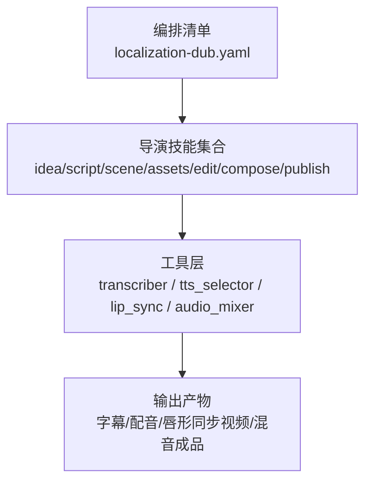
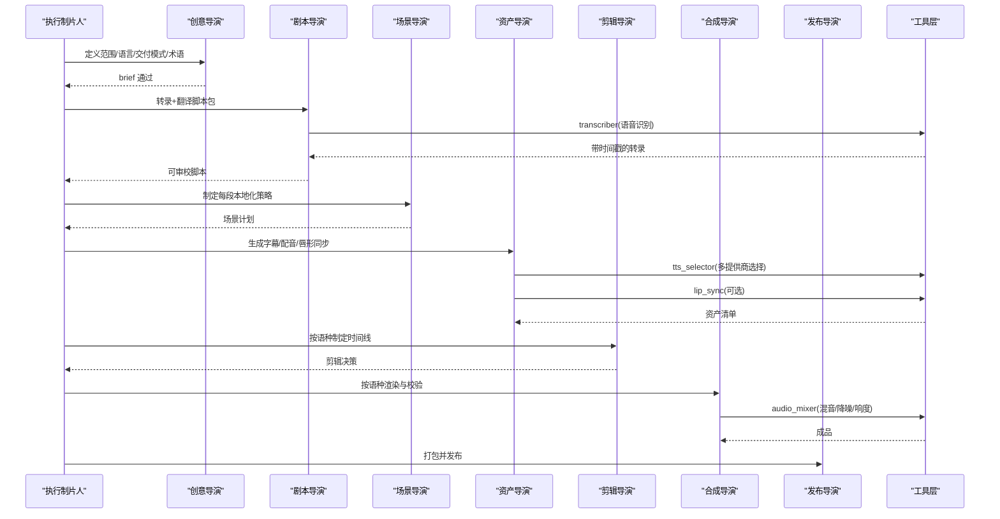
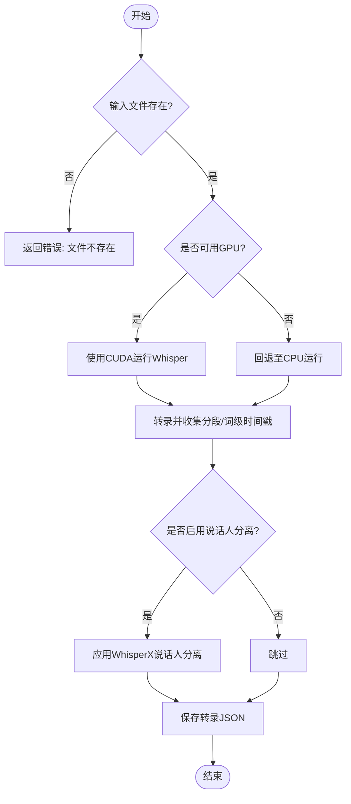
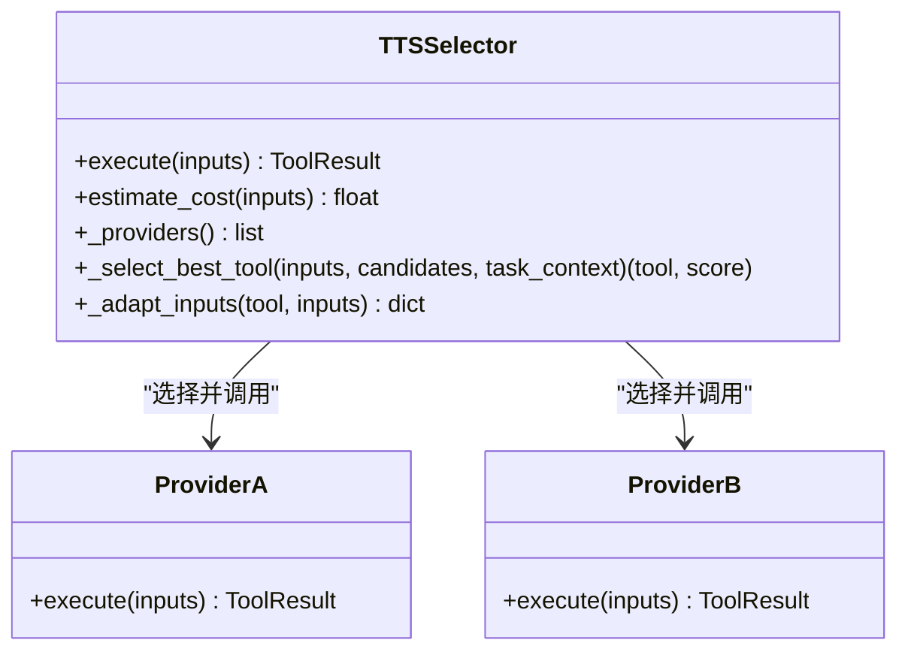
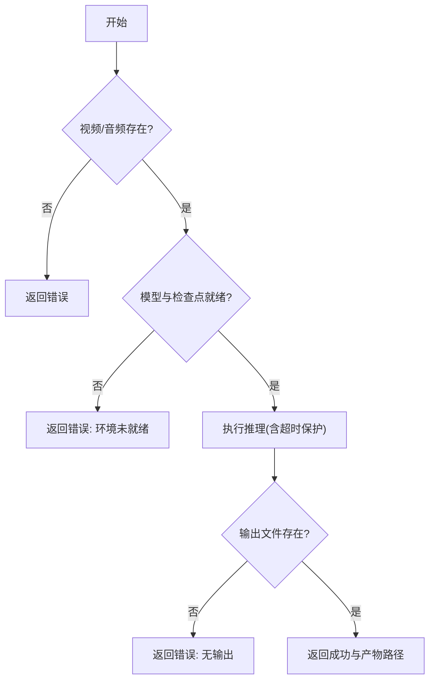
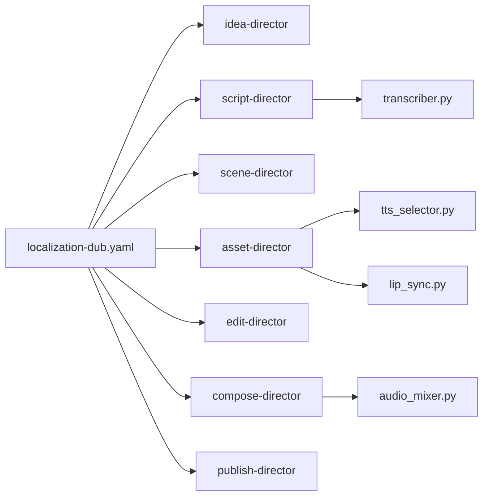

# 本地化配音管道

<cite>
**本文引用的文件**
- [localization-dub.yaml](file://pipeline_defs/localization-dub.yaml)
- [executive-producer.md](file://skills/pipelines/localization-dub/executive-producer.md)
- [idea-director.md](file://skills/pipelines/localization-dub/idea-director.md)
- [script-director.md](file://skills/pipelines/localization-dub/script-director.md)
- [scene-director.md](file://skills/pipelines/localization-dub/scene-director.md)
- [asset-director.md](file://skills/pipelines/localization-dub/asset-director.md)
- [edit-director.md](file://skills/pipelines/localization-dub/edit-director.md)
- [compose-director.md](file://skills/pipelines/localization-dub/compose-director.md)
- [publish-director.md](file://skills/pipelines/localization-dub/publish-director.md)
- [transcriber.py](file://tools/analysis/transcriber.py)
- [tts_selector.py](file://tools/audio/tts_selector.py)
- [lip_sync.py](file://tools/avatar/lip_sync.py)
- [audio_mixer.py](file://tools/audio/audio_mixer.py)
- [lip-sync-usage.md](file://skills/creative/lip-sync-usage.md)
</cite>

## 目录
1. [简介](#简介)
2. [项目结构](#项目结构)
3. [核心组件](#核心组件)
4. [架构总览](#架构总览)
5. [详细组件分析](#详细组件分析)
6. [依赖关系分析](#依赖关系分析)
7. [性能与成本考量](#性能与成本考量)
8. [故障排查指南](#故障排查指南)
9. [结论](#结论)
10. [附录](#附录)

## 简介
本文件面向“OpenMontage 本地化配音管道”，聚焦视频内容的多语言本地化与配音制作。文档围绕语音识别、文本翻译（以脚本包形式体现）、语音合成与唇形同步四大技术环节，系统说明从原始内容提取、翻译质量控制、配音录制到音画对齐的完整流程；并给出多语言版本管理、批量生成与质量保证措施。同时提供不同语言与方言的支持选项（音色选择、语速调整、地域特色），以及配音质量评估标准（发音准确性、情感表达、文化适应性）。

## 项目结构
本地化配音管道由“编排清单 + 导演技能 + 工具”三层构成：
- 编排清单定义阶段、产物、工具与质量门控
- 导演技能指导每个阶段的执行策略与检查点
- 工具层提供语音识别、TTS、字幕、混音、唇形同步等能力

图表来源
- [localization-dub.yaml:1-208](file://pipeline_defs/localization-dub.yaml#L1-L208)

章节来源
- [localization-dub.yaml:1-208](file://pipeline_defs/localization-dub.yaml#L1-L208)

## 核心组件
- 执行制片人（EP）：跨阶段串联，维护本地化上下文（源语言、目标语言、每语种交付模式、术语表、时间漂移容忍度），在各阶段后执行一致性检查与预算门控。
- 七阶段导演：
  - 创意导演（idea）：明确范围、目标语言、交付模式（仅字幕/配音/带唇形同步）、术语与审查要求。
  - 剧本导演（script）：基于转录构建可审校的脚本包，保留术语与受保护词，产出目标语言段落。
  - 场景导演（scene）：为每段制定本地化处理（仅字幕/配音/唇形同步/混合覆盖），标注时间风险与屏显文字替换需求。
  - 资产导演（assets）：生成字幕、配音与可选唇形同步素材，记录音色映射与发音警告。
  - 剪辑导演（edit）：按语种制定时间线决策，必要时做时长压缩或覆盖。
  - 合成导演（compose）：按语种渲染，校验字幕贴合、口型同步与版本标签。
  - 发布导演（publish）：打包每语种视频、字幕、脚本、元数据与审查备注。

章节来源
- [executive-producer.md:1-134](file://skills/pipelines/localization-dub/executive-producer.md#L1-L134)
- [idea-director.md:1-86](file://skills/pipelines/localization-dub/idea-director.md#L1-L86)
- [script-director.md:1-75](file://skills/pipelines/localization-dub/script-director.md#L1-L75)
- [scene-director.md:1-68](file://skills/pipelines/localization-dub/scene-director.md#L1-L68)
- [asset-director.md:1-102](file://skills/pipelines/localization-dub/asset-director.md#L1-L102)
- [edit-director.md:1-47](file://skills/pipelines/localization-dub/edit-director.md#L1-L47)
- [compose-director.md:1-66](file://skills/pipelines/localization-dub/compose-director.md#L1-L66)
- [publish-director.md:1-54](file://skills/pipelines/localization-dub/publish-director.md#L1-L54)

## 架构总览
本地化配音管道的端到端流程如下：

图表来源
- [localization-dub.yaml:44-208](file://pipeline_defs/localization-dub.yaml#L44-L208)
- [transcriber.py:116-240](file://tools/analysis/transcriber.py#L116-L240)
- [tts_selector.py:190-225](file://tools/audio/tts_selector.py#L190-L225)
- [lip_sync.py:146-231](file://tools/avatar/lip_sync.py#L146-L231)
- [audio_mixer.py:257-278](file://tools/audio/audio_mixer.py#L257-L278)

## 详细组件分析

### 语音识别（Transcriber）
- 功能：对输入音视频进行转写，输出分段与词级时间戳，支持说话人分离（可选）。
- 关键特性：
  - 自动设备检测与GPU回退至CPU，保证稳定性
  - 输出JSON包含segments、word_timestamps、language、duration_seconds
  - 写入转录结果文件便于后续审阅与校对
- 适用场景：本地化管道中作为“转录真相”的来源，确保翻译与配音基于准确的时间轴

图表来源
- [transcriber.py:116-280](file://tools/analysis/transcriber.py#L116-L280)

章节来源
- [transcriber.py:116-280](file://tools/analysis/transcriber.py#L116-L280)

### 文本翻译与脚本包（Script Director）
- 目标：在生成任何配音前，先产出可审校的目标语言脚本包，保留术语与受保护词，维持原结构与时序节奏。
- 建议元数据：source_transcript_status、target_language_sections、glossary_terms、protected_terms、pronunciation_notes、review_status_by_language。
- 质量门：转录可信、目标文案齐全、术语一致、可在合成前审阅。

章节来源
- [script-director.md:1-75](file://skills/pipelines/localization-dub/script-director.md#L1-L75)

### 场景规划与本地化策略（Scene Director）
- 目标：为每段决定本地化处理方式（仅字幕/配音/唇形同步/混合覆盖），标注时间漂移风险与屏显文字替换需求。
- 推荐元数据：dub_mode_map、timing_risk_map、on_screen_text_replacement_map、language_variant_notes。
- 质量门：每交付物有明确处理方案、风险已标注、唇形同步仅在合适镜头使用。

章节来源
- [scene-director.md:1-68](file://skills/pipelines/localization-dub/scene-director.md#L1-L68)

### 资产生成（Asset Director）
- 目标：生成字幕、配音与可选唇形同步素材，建立“本地化资产包”。
- 流程要点：
  - 先生成字幕，作为兜底交付
  - 英雄场景采样：先为最重要场景生成一段配音样本，经批准后再批量生产
  - 按语种生成配音，记录所用音色路径
  - 唇形同步按需启用，若不可用则保持纯配音路径
- 推荐元数据：subtitle_assets_by_language、dub_audio_assets_by_language、lip_sync_assets_by_language、voice_map、pronunciation_warnings、blocked_assets。

章节来源
- [asset-director.md:1-102](file://skills/pipelines/localization-dub/asset-director.md#L1-L102)

### 文本到语音（TTS Selector）
- 功能：根据任务上下文与用户偏好，自动选择最佳TTS提供商，并适配参数（语速、音调、风格、输出格式等）。
- 关键能力：
  - 多语言支持、离线回退、用户偏好路由
  - 统一接口：voice_id/voice/speed/speaking_rate/pitch/style/instructions/language_code等
  - 评分排名与备选提供商记录，便于审计与回滚
- 适配示例：将通用速度转换为Azure TTS的rate字符串；将pitch转为st单位；标准化输出格式。

图表来源
- [tts_selector.py:15-324](file://tools/audio/tts_selector.py#L15-L324)

章节来源
- [tts_selector.py:15-324](file://tools/audio/tts_selector.py#L15-L324)

### 唇形同步（Lip Sync）
- 功能：将新音频与原始视频中人物嘴部动作对齐，适用于本地化配音与音频替换。
- 模型与参数：wav2lip/wav2lip_gan、face_padding、resize_factor等；支持超时控制与失败回退。
- 使用规则：
  - 优先用于可见清晰面部的正面镜头
  - 不应用于照片转视频（应使用TalkingHead）
  - 批量生产前先做小样验证，避免方向性错误导致大规模返工

图表来源
- [lip_sync.py:146-231](file://tools/avatar/lip_sync.py#L146-L231)
- [lip-sync-usage.md:1-41](file://skills/creative/lip-sync-usage.md#L1-L41)

章节来源
- [lip_sync.py:146-231](file://tools/avatar/lip_sync.py#L146-L231)
- [lip-sync-usage.md:1-41](file://skills/creative/lip-sync-usage.md#L1-L41)

### 音频混音与后期（Audio Mixer）
- 功能：多轨混音、旁白压低（ducking）、淡入淡出、响度归一化、分段音乐叠加等。
- 关键参数：duck_level/music_volume_during_speech/attack_ms/release_ms/loudnorm_target/target_duration等。
- 用途：在合成阶段将配音、音乐、音效整合为最终音轨，确保各语种输出的一致性与平台响度标准。

章节来源
- [audio_mixer.py:1-776](file://tools/audio/audio_mixer.py#L1-L776)

### 合成与发布（Compose & Publish Directors）
- 合成导演：按语种渲染，校验字幕贴合、口型同步、版本标签；限制运行时为Remotion或FFmpeg（Phase 1不支持HyperFrames）。
- 发布导演：按语种打包视频、字幕、脚本、元数据与审查备注，确保命名精确、信息不丢失。

章节来源
- [compose-director.md:1-66](file://skills/pipelines/localization-dub/compose-director.md#L1-L66)
- [publish-director.md:1-54](file://skills/pipelines/localization-dub/publish-director.md#L1-L54)

## 依赖关系分析
- 编排清单驱动阶段顺序与产物契约
- 导演技能依赖工具能力（transcriber、tts_selector、lip_sync、audio_mixer）
- 工具间解耦：TTS选择器屏蔽提供商差异；音频混音器封装FFmpeg复杂滤镜；唇形同步封装Wav2Lip/MuseTalk执行

图表来源
- [localization-dub.yaml:44-208](file://pipeline_defs/localization-dub.yaml#L44-L208)
- [transcriber.py:116-240](file://tools/analysis/transcriber.py#L116-L240)
- [tts_selector.py:190-225](file://tools/audio/tts_selector.py#L190-L225)
- [lip_sync.py:146-231](file://tools/avatar/lip_sync.py#L146-L231)
- [audio_mixer.py:257-278](file://tools/audio/audio_mixer.py#L257-L278)

章节来源
- [localization-dub.yaml:44-208](file://pipeline_defs/localization-dub.yaml#L44-L208)

## 性能与成本考量
- 语音识别：CPU默认稳定，GPU加速但具备回退机制；长音频建议分批处理。
- TTS：按提供商评分选择，支持离线回退；注意不同语言的时长膨胀（某些语言可能比英语长20-30%）。
- 唇形同步：计算密集，建议使用半分辨率草稿先行验证；GAN模型质量更高但更慢。
- 混音：合理设置响度目标（如-14 LUFS用于短视频平台）与ducking参数，避免人声被音乐掩盖。
- 预算与限额：EP阶段设定最大修订次数、最大退回次数、总预算与墙钟时间上限，防止失控。

章节来源
- [executive-producer.md:117-134](file://skills/pipelines/localization-dub/executive-producer.md#L117-L134)
- [lip-sync-usage.md:1-41](file://skills/creative/lip-sync-usage.md#L1-L41)
- [audio_mixer.py:205-223](file://tools/audio/audio_mixer.py#L205-L223)

## 故障排查指南
- 转录失败：检查输入文件是否存在、faster-whisper是否安装、GPU/CUDA是否可用；查看设备回退原因。
- TTS失败：确认提供商可用性、API密钥、允许提供商列表；使用rank模式查看评分与备选。
- 唇形同步失败：检查Wav2Lip路径、模型检查点、inference脚本是否存在；关注超时与输出文件缺失。
- 混音异常：核对轨道路径、角色（speech/music/sfx）、ducking参数与目标响度；验证FFmpeg命令与滤镜链。
- 合成问题：确认render_runtime为remotion或ffmpeg；检查字幕样式与位置（避免遮挡面部）；验证版本标签与文件名规范。

章节来源
- [transcriber.py:98-115](file://tools/analysis/transcriber.py#L98-L115)
- [tts_selector.py:178-181](file://tools/audio/tts_selector.py#L178-L181)
- [lip_sync.py:110-124](file://tools/avatar/lip_sync.py#L110-L124)
- [audio_mixer.py:257-278](file://tools/audio/audio_mixer.py#L257-L278)
- [compose-director.md:7-13](file://skills/pipelines/localization-dub/compose-director.md#L7-L13)

## 结论
OpenMontage本地化配音管道通过“编排清单 + 导演技能 + 工具层”的解耦设计，实现了从转录、翻译、配音到唇形同步与合成的全流程自动化与可控化。借助严格的质量门、预算治理与供应商评分选择，能够在多语言、多方言环境下稳定批量产出高质量本地化视频。建议在正式批量生产前，先完成英雄场景采样与唇形同步小样验证，确保方向正确后再扩大规模。

## 附录

### 多语言版本管理流程
- 原始内容提取：使用transcriber获取带时间戳的转录，修正明显错误（人名、术语、数字、CTA措辞）。
- 翻译质量控制：在script阶段产出可审校的目标语言脚本，保留术语与受保护词；必要时结合web搜索进行事实核验。
- 配音录制：通过tts_selector选择合适提供商与音色，按语种生成配音；必要时进行音频增强与响度归一化。
- 音画对齐：对需要唇形同步的镜头，使用lip_sync将新音频与画面嘴部动作对齐；对不适合的镜头采用字幕或覆盖策略。

章节来源
- [script-director.md:13-48](file://skills/pipelines/localization-dub/script-director.md#L13-L48)
- [asset-director.md:16-56](file://skills/pipelines/localization-dub/asset-director.md#L16-L56)
- [lip-sync-usage.md:76-121](file://skills/creative/lip-sync-usage.md#L76-L121)

### 多语言支持与方言选项
- 音色选择：通过tts_selector的voice_id/voice字段指定提供商特定音色；支持ElevenLabs、Google TTS、Kling Official、OpenAI TTS、Piper等。
- 语速调整：使用speed/speaking_rate/pitch等参数调节语速与音调；Azure TTS会转换为rate与pitch字符串。
- 地域特色：通过language_code与provider-specific语言类型（如DashScope的Auto/zh/en）匹配地域口音与发音习惯。

章节来源
- [tts_selector.py:39-154](file://tools/audio/tts_selector.py#L39-L154)
- [tts_selector.py:227-256](file://tools/audio/tts_selector.py#L227-L256)
- [tests/contracts/test_dashscope_tools.py:526-554](file://tests/contracts/test_dashscope_tools.py#L526-L554)

### 配音质量评估标准
- 发音准确性：词级时间戳与转录对比，确保术语与专有名词正确；必要时人工复核。
- 情感表达：通过style/instructions与provider-specific表达参数（如Azure express-as）控制语气与能量。
- 文化适应性：术语表与受保护词贯穿全流程；对涉及文化敏感的内容进行专项审查。
- 唇形同步质量：口型与新音频自然匹配、无拖拽或延迟、面部区域无缝融合、无帧间闪烁。

章节来源
- [executive-producer.md:47-102](file://skills/pipelines/localization-dub/executive-producer.md#L47-L102)
- [lip-sync-usage.md:113-121](file://skills/creative/lip-sync-usage.md#L113-L121)

### 批量生成流程与质量保证
- 批量前准备：确定目标语言与交付模式，准备术语表与受保护词；为英雄场景生成配音样本并获批。
- 批量执行：按语种并行生成字幕与配音；唇形同步仅对必要镜头启用；混音时统一响度与ducking策略。
- 质量保证：每阶段设置人类审批门；合成后进行ffprobe验证、帧抽样、音频分析与承诺校验；发布前打包并保留QA备注。

章节来源
- [asset-director.md:22-31](file://skills/pipelines/localization-dub/asset-director.md#L22-L31)
- [compose-director.md:24-59](file://skills/pipelines/localization-dub/compose-director.md#L24-L59)
- [publish-director.md:8-38](file://skills/pipelines/localization-dub/publish-director.md#L8-L38)