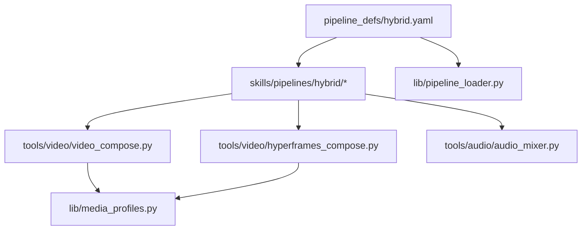
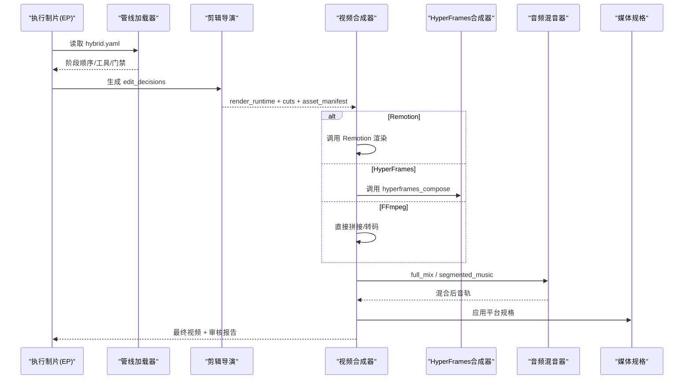
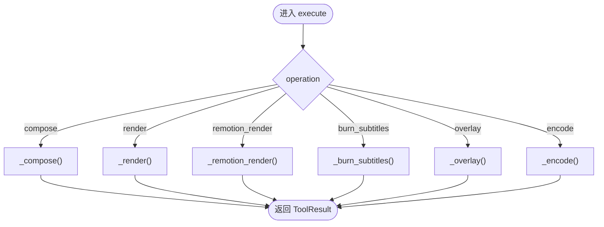
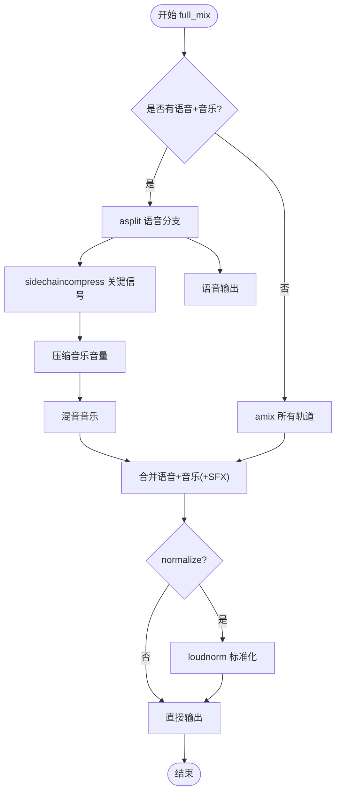
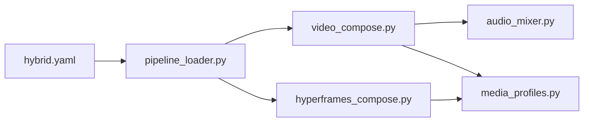

# 混合媒体管道

<cite>
**本文引用的文件**
- [README.md](file://README.md)
- [pipeline_defs/hybrid.yaml](file://pipeline_defs/hybrid.yaml)
- [lib/pipeline_loader.py](file://lib/pipeline_loader.py)
- [tools/video/video_compose.py](file://tools/video/video_compose.py)
- [tools/video/hyperframes_compose.py](file://tools/video/hyperframes_compose.py)
- [tools/audio/audio_mixer.py](file://tools/audio/audio_mixer.py)
- [lib/media_profiles.py](file://lib/media_profiles.py)
- [skills/pipelines/hybrid/executive-producer.md](file://skills/pipelines/hybrid/executive-producer.md)
- [skills/pipelines/hybrid/compose-director.md](file://skills/pipelines/hybrid/compose-director.md)
- [skills/pipelines/hybrid/edit-director.md](file://skills/pipelines/hybrid/edit-director.md)
</cite>

## 目录
1. [简介](#简介)
2. [项目结构](#项目结构)
3. [核心组件](#核心组件)
4. [架构总览](#架构总览)
5. [详细组件分析](#详细组件分析)
6. [依赖关系分析](#依赖关系分析)
7. [性能考量](#性能考量)
8. [故障排查指南](#故障排查指南)
9. [结论](#结论)
10. [附录](#附录)

## 简介
本文件面向OpenMontage的“混合媒体管道”，聚焦图像、视频、音频与文本元素的无缝融合，解释跨模态内容生成、统一时间线管理与多轨编辑流程。文档覆盖素材准备、多轨编辑、特效合成与音画同步；提供图文混排、视频加特效、音频可视化等配置选项；并给出资源缓存、并行处理与内存管理等性能优化策略，帮助复杂项目稳定输出高质量成品。

## 项目结构
OpenMontage采用“清单驱动+技能指导”的编排方式：
- pipeline_defs/ 定义流水线阶段、工具与质量门禁
- skills/pipelines/ 为每个阶段提供导演级执行指引
- tools/ 提供音视频处理、图形生成、字幕、增强等能力
- lib/ 提供管线加载、媒体规格、配置等基础设施
- remotion-composer/ 与 HyperFrames 作为两种渲染运行时

图表来源
- [pipeline_defs/hybrid.yaml:1-228](file://pipeline_defs/hybrid.yaml#L1-L228)
- [lib/pipeline_loader.py:1-241](file://lib/pipeline_loader.py#L1-L241)
- [tools/video/video_compose.py:1-800](file://tools/video/video_compose.py#L1-L800)
- [tools/video/hyperframes_compose.py:1-200](file://tools/video/hyperframes_compose.py#L1-L200)
- [tools/audio/audio_mixer.py:1-776](file://tools/audio/audio_mixer.py#L1-L776)
- [lib/media_profiles.py:1-166](file://lib/media_profiles.py#L1-L166)

章节来源
- [README.md:356-475](file://README.md#L356-L475)
- [pipeline_defs/hybrid.yaml:1-228](file://pipeline_defs/hybrid.yaml#L1-L228)

## 核心组件
- 混合管线清单（hybrid.yaml）：定义idea→script→scene_plan→assets→edit→compose→publish七阶段，明确每阶段的输入/产出、可用工具、检查点与人类审批策略，以及compose阶段对video_compose与audio_mixer的强制要求。
- 管线加载器（pipeline_loader.py）：负责加载并校验YAML清单、获取阶段顺序、所需工具、扩展权限等，提供只读缓存以提升热路径性能。
- 视频合成器（video_compose.py）：根据edit_decisions.render_runtime路由到Remotion或HyperFrames，或纯FFmpeg拼接；支持字幕烧录、叠加、编码、转码与平台规格适配。
- HyperFrames合成器（hyperframes_compose.py）：HTML/CSS/GSAP渲染路径，提供工作区脚手架、lint/validate/check、渲染与现有工作区渲染等操作。
- 音频混音器（audio_mixer.py）：多轨混音、语音旁路降音（ducking）、淡入淡出、响度标准化、分段音乐注入等。
- 媒体规格（media_profiles.py）：平台分辨率、宽高比、帧率、编码参数等预设，供compose与发布阶段使用。

章节来源
- [pipeline_defs/hybrid.yaml:46-228](file://pipeline_defs/hybrid.yaml#L46-L228)
- [lib/pipeline_loader.py:39-77](file://lib/pipeline_loader.py#L39-L77)
- [tools/video/video_compose.py:58-232](file://tools/video/video_compose.py#L58-L232)
- [tools/video/hyperframes_compose.py:51-200](file://tools/video/hyperframes_compose.py#L51-L200)
- [tools/audio/audio_mixer.py:26-203](file://tools/audio/audio_mixer.py#L26-L203)
- [lib/media_profiles.py:22-166](file://lib/media_profiles.py#L22-L166)

## 架构总览
混合媒体管道的端到端流程如下：
- 创意与脚本：识别锚定媒体（源视频/图片/屏幕录制等），规划支持层（图表、叠加、动画、字幕）。
- 场景与资产：将叙事节拍映射到具体素材与生成任务，形成资产清单。
- 剪辑决策：先锁定“锚定剪辑”，再按优先级叠加支持层，确保可读性与一致性。
- 合成与混音：依据render_runtime选择Remotion或HyperFrames进行一轨合成；通过audio_mixer完成多轨混音、降音、标准化与目标时长对齐。
- 发布与质检：输出多平台规格产物，附带元数据与审核报告。

图表来源
- [pipeline_defs/hybrid.yaml:170-207](file://pipeline_defs/hybrid.yaml#L170-L207)
- [tools/video/video_compose.py:337-360](file://tools/video/video_compose.py#L337-L360)
- [tools/video/hyperframes_compose.py:107-200](file://tools/video/hyperframes_compose.py#L107-L200)
- [tools/audio/audio_mixer.py:479-667](file://tools/audio/audio_mixer.py#L479-L667)
- [lib/media_profiles.py:142-166](file://lib/media_profiles.py#L142-L166)

## 详细组件分析

### 混合管线清单（hybrid.yaml）
- 阶段划分：idea/script/scene_plan/assets/edit/compose/publish，每阶段声明必需/可选工具、检查点与人类审批默认值。
- compose阶段强制要求：必须使用video_compose与audio_mixer；可选video_stitch/video_trimmer/color_grade/audio_enhance。
- 治理要点：禁止silent runtime swap；建议remotion用于“源视频+React支持层”的一轨合成；仅在支持层是HTML/GSAP原生时选hyperframes。

章节来源
- [pipeline_defs/hybrid.yaml:12-37](file://pipeline_defs/hybrid.yaml#L12-L37)
- [pipeline_defs/hybrid.yaml:170-207](file://pipeline_defs/hybrid.yaml#L170-L207)

### 管线加载器（pipeline_loader.py）
- 清单加载与校验：从pipeline_defs读取YAML并通过JSON Schema验证。
- 缓存与只读访问：_load_pipeline_cached提供lru_cache；load_pipeline_readonly保证热路径不修改清单。
- 阶段与工具解析：get_stage_order/get_required_tools/get_stage_skill等辅助函数支撑编排与前置检查。
- 扩展控制：check_extension_permitted限制custom_scripts/custom_playbooks/custom_skills/custom_tools的使用。

章节来源
- [lib/pipeline_loader.py:27-77](file://lib/pipeline_loader.py#L27-L77)
- [lib/pipeline_loader.py:98-162](file://lib/pipeline_loader.py#L98-L162)
- [lib/pipeline_loader.py:201-241](file://lib/pipeline_loader.py#L201-L241)

### 视频合成器（video_compose.py）
- 运行时路由：根据edit_decisions.render_runtime选择Remotion/HyperFrames/FFmpeg；若不可用则返回结构化阻塞提示，禁止静默替换。
- 操作集：compose（视频片段拼接/字幕/音频）、render（自动路由）、remotion_render、burn_subtitles、overlay、encode。
- 字幕样式：支持playbook与edit_decisions分层解析，避免样式冲突。
- 平台规格：通过profile或compose_target设置分辨率、宽高比与fit模式（pad/cover）。
- 资源探测：检测ffmpeg/npx/node_modules可用性，并在info中暴露各引擎状态。

图表来源
- [tools/video/video_compose.py:337-360](file://tools/video/video_compose.py#L337-L360)
- [tools/video/video_compose.py:438-728](file://tools/video/video_compose.py#L438-L728)

章节来源
- [tools/video/video_compose.py:58-232](file://tools/video/video_compose.py#L58-L232)
- [tools/video/video_compose.py:234-335](file://tools/video/video_compose.py#L234-L335)
- [tools/video/video_compose.py:337-360](file://tools/video/video_compose.py#L337-L360)
- [tools/video/video_compose.py:438-728](file://tools/video/video_compose.py#L438-L728)

### HyperFrames合成器（hyperframes_compose.py）
- 能力范围：渲染、lint/validate/check/inspect、工作区脚手架、添加注册表块、渲染现有工作区。
- 环境检查：依赖Node.js≥22、FFmpeg、npx与npm包hyperframes；提供doctor操作定位缺失项。
- 与video_compose协作：当render_runtime=hyperframes时由video_compose委派；也可被管线直接调用。

章节来源
- [tools/video/hyperframes_compose.py:1-105](file://tools/video/hyperframes_compose.py#L1-L105)
- [tools/video/hyperframes_compose.py:107-200](file://tools/video/hyperframes_compose.py#L107-L200)

### 音频混音器（audio_mixer.py）
- 操作集：mix（多轨混音）、duck（语音旁路降音）、extract（提取音轨）、full_mix（一键混音+降音+标准化）、segmented_music（分段音乐注入）。
- 响度标准：loudnorm可配置目标LUFS，匹配不同平台规范。
- 时间对齐：full_mix支持target_duration，确保音频与视频时长一致。

图表来源
- [tools/audio/audio_mixer.py:479-667](file://tools/audio/audio_mixer.py#L479-L667)

章节来源
- [tools/audio/audio_mixer.py:26-203](file://tools/audio/audio_mixer.py#L26-L203)
- [tools/audio/audio_mixer.py:280-445](file://tools/audio/audio_mixer.py#L280-L445)
- [tools/audio/audio_mixer.py:479-667](file://tools/audio/audio_mixer.py#L479-L667)
- [tools/audio/audio_mixer.py:669-776](file://tools/audio/audio_mixer.py#L669-L776)

### 媒体规格（media_profiles.py）
- 内置平台规格：YouTube横屏/4K/Shorts、Instagram Reels/Feed、TikTok、LinkedIn、Cinematic、通用HD等。
- 参数说明：分辨率、宽高比、帧率、编码、CRF、像素格式、最大时长/文件大小、字幕格式等。
- 使用方式：compose阶段通过profile或compose_target指定；发布阶段用于导出与元数据标注。

章节来源
- [lib/media_profiles.py:14-166](file://lib/media_profiles.py#L14-L166)

### 导演技能（Hybrid Pipeline Skills）
- 执行制片（executive-producer.md）：定义跨阶段质量门禁，强调源/支持比例、叠加密度与跨媒介一致性。
- 剪辑导演（edit-director.md）：先锁定锚定剪辑，再按优先级叠加支持层，保护可读性。
- 合成导演（compose-director.md）：优先Remotion以“源视频+React支持层”一轨合成；仅在支持层为HTML/GSAP原生时选HyperFrames；禁止silent runtime swap。

章节来源
- [skills/pipelines/hybrid/executive-producer.md:1-130](file://skills/pipelines/hybrid/executive-producer.md#L1-L130)
- [skills/pipelines/hybrid/edit-director.md:1-56](file://skills/pipelines/hybrid/edit-director.md#L1-L56)
- [skills/pipelines/hybrid/compose-director.md:1-61](file://skills/pipelines/hybrid/compose-director.md#L1-L61)

## 依赖关系分析
- 清单驱动：hybrid.yaml决定阶段顺序、工具与门禁；pipeline_loader.py提供只读缓存与查询接口。
- 运行时选择：video_compose.py在提案阶段锁定render_runtime，compose阶段严格遵循，失败时上报结构化错误。
- 音频链路：audio_mixer.py为compose阶段必选，负责多轨混音、降音、标准化与时长对齐。
- 规格约束：media_profiles.py为输出规格的统一来源，避免散落的硬编码。

图表来源
- [pipeline_defs/hybrid.yaml:170-207](file://pipeline_defs/hybrid.yaml#L170-L207)
- [lib/pipeline_loader.py:39-77](file://lib/pipeline_loader.py#L39-L77)
- [tools/video/video_compose.py:337-360](file://tools/video/video_compose.py#L337-L360)
- [tools/video/hyperframes_compose.py:107-200](file://tools/video/hyperframes_compose.py#L107-L200)
- [tools/audio/audio_mixer.py:479-667](file://tools/audio/audio_mixer.py#L479-L667)
- [lib/media_profiles.py:142-166](file://lib/media_profiles.py#L142-L166)

章节来源
- [pipeline_defs/hybrid.yaml:12-37](file://pipeline_defs/hybrid.yaml#L12-L37)
- [lib/pipeline_loader.py:98-162](file://lib/pipeline_loader.py#L98-L162)

## 性能考量
- 资源缓存
  - 清单加载缓存：_load_pipeline_cached使用lru_cache，减少重复解析与校验开销。
  - 工具幂等键：video_compose与audio_mixer基于idempotency_key_fields避免重复计算。
- 并行处理
  - 依赖驱动的并行化：在外部编排层可对无相互依赖的任务（如多段素材预处理、多轨独立混音）进行并发调度。
  - 渲染并行：Remotion/HyperFrames渲染本身为进程级任务，可在多核主机上并发执行多个项目实例。
- 内存管理
  - 临时文件清理：compose阶段在finally中删除临时片段与concat列表，降低磁盘占用。
  - 流式处理：audio_mixer使用FFmpeg filter_complex构建图，避免全量加载大文件到内存。
  - 规格裁剪：通过profile或compose_target尽早确定分辨率与帧率，减少不必要的重编码。
- 编码与质量平衡
  - CRF与preset可调：在quality与速度间权衡；推荐标准质量下CRF≈18-20，快速迭代可用更高CRF。
  - 平台规格：使用media_profiles.py中的预设，避免手工参数不一致导致的返工。

章节来源
- [lib/pipeline_loader.py:27-47](file://lib/pipeline_loader.py#L27-L47)
- [tools/video/video_compose.py:226-232](file://tools/video/video_compose.py#L226-L232)
- [tools/audio/audio_mixer.py:198-203](file://tools/audio/audio_mixer.py#L198-L203)
- [tools/video/video_compose.py:715-728](file://tools/video/video_compose.py#L715-L728)
- [lib/media_profiles.py:155-166](file://lib/media_profiles.py#L155-L166)

## 故障排查指南
- 运行时不可用
  - Remotion：需npx与remotion-composer/node_modules；若缺失会提示安装命令。
  - HyperFrames：需Node.js≥22、FFmpeg、npx与hyperframes npm包；可通过doctor定位问题。
  - FFmpeg：确保PATH可解析；否则compose/encode/duck等都会失败。
- 运行时静默替换
  - 若所选render_runtime不可用，应返回结构化阻塞并等待人工批准后再切换，严禁静默替换。
- 音频无声/串扰
  - 检查source是否含音频流；若无则会自动注入静音轨以保证concat一致性。
  - full_mix时确认speech/music角色正确，且ducking参数合理。
- 字幕错位/样式异常
  - 确认subtitle_style来自playbook/edit_decisions/显式传入的分层优先级；必要时单独burn_subtitles调试。
- 平台规格不符
  - 使用media_profiles.py的profile名称；或在compose_target中指定width/height/fit。

章节来源
- [tools/video/video_compose.py:234-335](file://tools/video/video_compose.py#L234-L335)
- [tools/video/hyperframes_compose.py:62-71](file://tools/video/hyperframes_compose.py#L62-L71)
- [tools/video/video_compose.py:369-394](file://tools/video/video_compose.py#L369-L394)
- [tools/audio/audio_mixer.py:479-667](file://tools/audio/audio_mixer.py#L479-L667)
- [lib/media_profiles.py:142-166](file://lib/media_profiles.py#L142-L166)

## 结论
OpenMontage的混合媒体管道通过清晰的清单驱动、严格的运行时治理与强大的音视频工具链，实现了“源视频+支持层”的一体化创作与交付。借助Remotion与HyperFrames双运行时、统一的媒体规格与完善的混音能力，系统能够高效处理图文混排、视频特效与音频可视化等复杂需求，并在质量门禁与性能优化保障下稳定输出高质量成品。

## 附录
- 典型配置示例（概念性说明）
  - 图文混排：选择remotion，使用text_card/stat_card/chart等组件叠加于源视频之上；通过media_profiles指定平台规格。
  - 视频加特效：在compose阶段使用overlay或Remotion/HyperFrames组件实现转场、遮罩、动效；必要时color_grade微调。
  - 音频可视化：使用audio_mixer.full_mix将旁白、音乐、音效混合，并开启ducking与loudnorm标准化；segmented_music用于仅在某些段落播放背景音乐。
- 最佳实践
  - 先锚定剪辑，再叠加支持层；控制叠加密度，避免视觉噪声。
  - 在提案阶段锁定render_runtime，compose阶段严格遵守。
  - 使用media_profiles统一输出规格，减少后期返工。
  - 利用pipeline_loader缓存与工具幂等键提升整体吞吐。