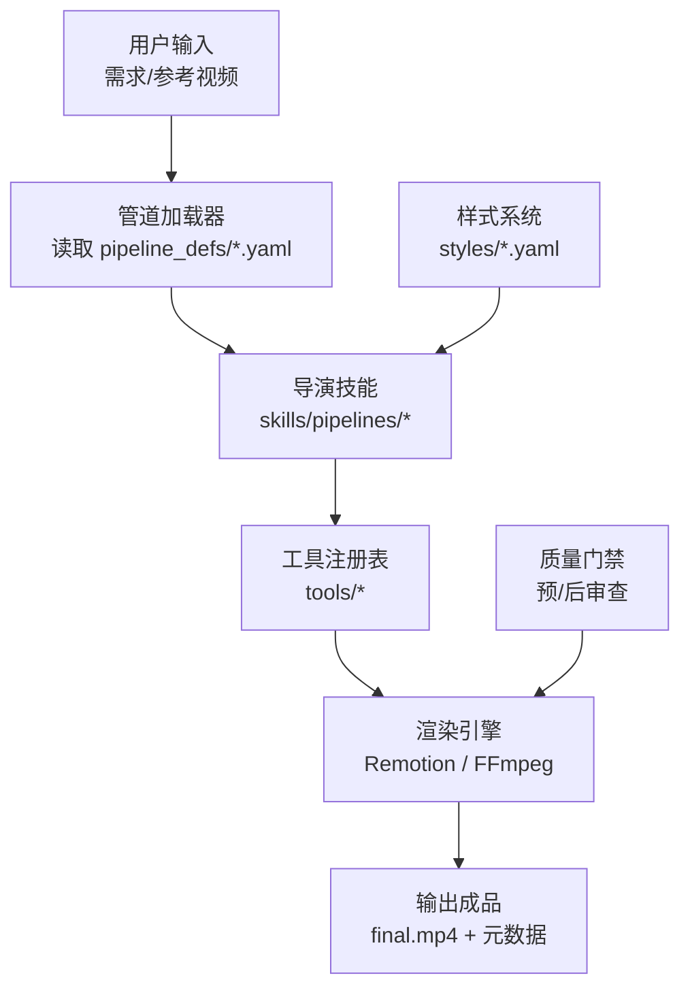
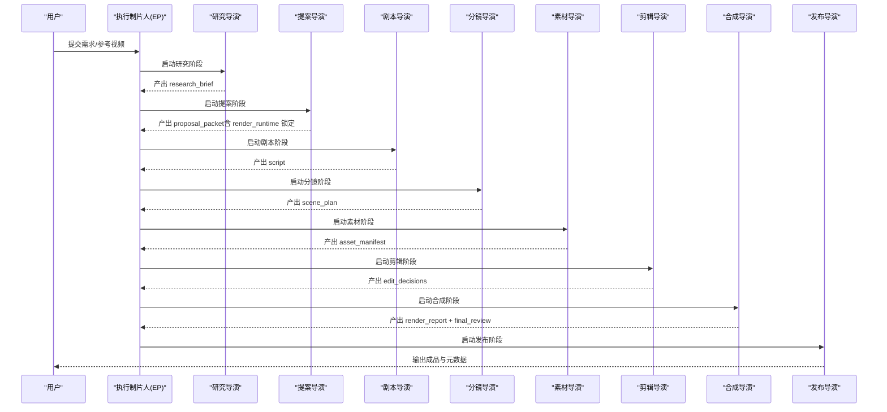
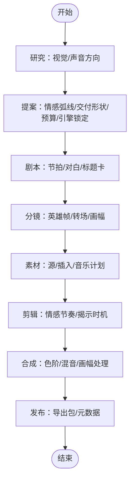
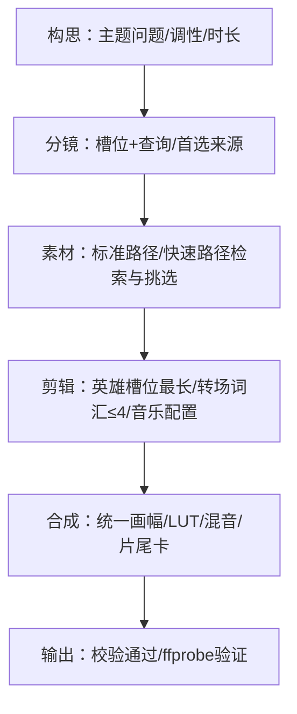
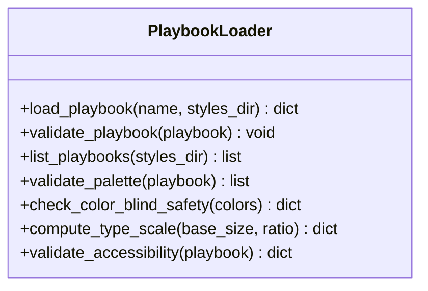
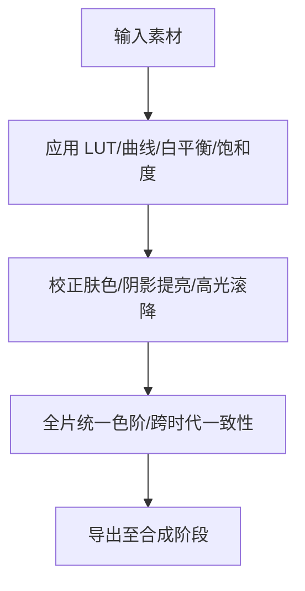
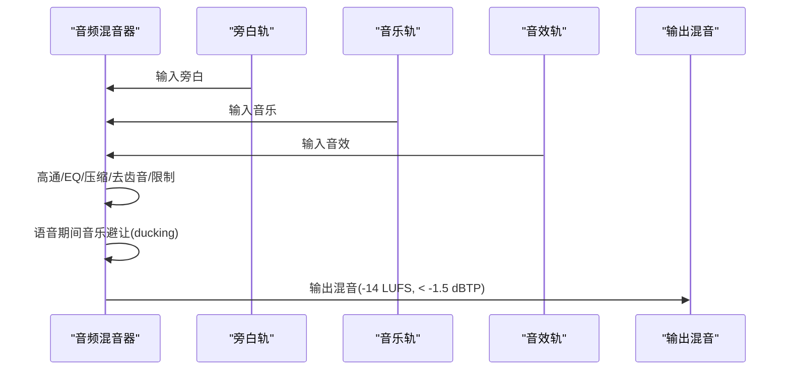
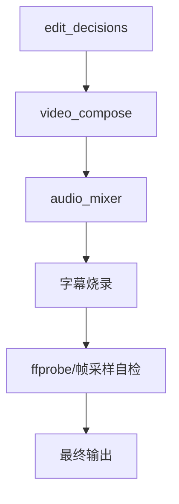
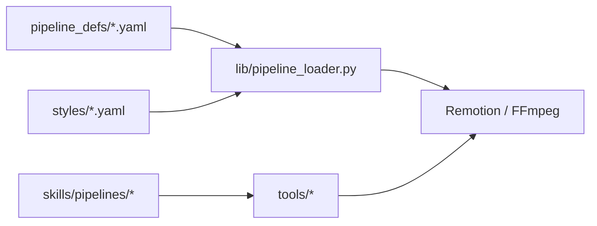

# 电影风格管道

<cite>
**本文引用的文件**
- [README.md](file://README.md)
- [pipeline_defs/cinematic.yaml](file://pipeline_defs/cinematic.yaml)
- [pipeline_defs/documentary-montage.yaml](file://pipeline_defs/documentary-montage.yaml)
- [styles/playbook_loader.py](file://styles/playbook_loader.py)
- [lib/pipeline_loader.py](file://lib/pipeline_loader.py)
- [skills/creative/cinematic.md](file://skills/creative/cinematic.md)
- [skills/core/color-grading.md](file://skills/core/color-grading.md)
- [tools/enhancement/color_grade.py](file://tools/enhancement/color_grade.py)
- [skills/creative/sound-design.md](file://skills/creative/sound-design.md)
- [tools/audio/audio_mixer.py](file://tools/audio/audio_mixer.py)
- [tests/qa/test_05_video_compose.py](file://tests/qa/test_05_video_compose.py)
- [skills/pipelines/cinematic/executive-producer.md](file://skills/pipelines/cinematic/executive-producer.md)
- [skills/pipelines/cinematic/proposal-director.md](file://skills/pipelines/cinematic/proposal-director.md)
- [skills/pipelines/documentary-montage/compose-director.md](file://skills/pipelines/documentary-montage/compose-director.md)
</cite>

## 目录
1. [简介](#简介)
2. [项目结构](#项目结构)
3. [核心组件](#核心组件)
4. [架构总览](#架构总览)
5. [详细组件分析](#详细组件分析)
6. [依赖关系分析](#依赖关系分析)
7. [性能与质量保障](#性能与质量保障)
8. [故障排查指南](#故障排查指南)
9. [结论](#结论)
10. [附录：分阶段工作流与配置清单](#附录：分阶段工作流与配置清单)

## 简介
本文件面向“电影风格管道”的使用者与创作者，聚焦电影级视觉效果、专业叙事结构与高质量视觉呈现。OpenMontage 提供以“导演技能 + 管道清单 + 工具注册表”为核心的可编排生产系统，支持从创意研究、概念开发、剧本创作、分镜设计、素材制作、后期编辑到最终输出的完整流程。文档将解释电影风格的特殊配置项（镜头语言、色彩分级、音效设计与节奏控制），并给出宣传片、纪录片片段、产品展示等内容的适配指南，附带实际项目案例与常见问题解决方案。

## 项目结构
OpenMontage 的电影风格能力由以下关键部分组成：
- 管道定义：YAML 清单描述阶段、工具、检查点与审核焦点
- 导演技能：Markdown 指令指导每个阶段的执行策略与质量标准
- 样式系统：Playbook 统一视觉语言、排版、动效与音频基调
- 工具层：视频生成/合成、音频混音、色彩分级、字幕与增强
- 渲染引擎：Remotion（React 程序化视频）与 FFmpeg（底层封装）

图表来源
- [lib/pipeline_loader.py:49-70](file://lib/pipeline_loader.py#L49-L70)
- [pipeline_defs/cinematic.yaml:60-288](file://pipeline_defs/cinematic.yaml#L60-L288)
- [styles/playbook_loader.py:37-70](file://styles/playbook_loader.py#L37-L70)

章节来源
- [README.md:356-475](file://README.md#L356-L475)
- [lib/pipeline_loader.py:49-70](file://lib/pipeline_loader.py#L49-L70)
- [styles/playbook_loader.py:37-70](file://styles/playbook_loader.py#L37-L70)

## 核心组件
- 电影管道（cinematic）：情绪驱动、强调情感弧线、色彩一致性与音频动态的七阶段流水线
- 纪录片蒙太奇（documentary-montage）：检索优先的主题剪辑，跨时代素材统一色阶与画幅
- 样式 Playbook：控制调色板、排版、动效规则与音频基调，确保品牌一致性
- 色彩分级：内置 LUT 与曲线、白平衡、饱和度等参数，支持电影级暖/冷/复古/高对比度
- 音频混音：多轨混合、淡入淡出、静音窗口、旁白避让（ducking）、目标响度与真峰值限制
- 渲染与合成：Remotion 负责程序化场景与片尾卡；FFmpeg 负责底层拼接、编码与字幕烧录

章节来源
- [pipeline_defs/cinematic.yaml:60-288](file://pipeline_defs/cinematic.yaml#L60-L288)
- [pipeline_defs/documentary-montage.yaml:45-179](file://pipeline_defs/documentary-montage.yaml#L45-L179)
- [skills/creative/cinematic.md:126-146](file://skills/creative/cinematic.md#L126-L146)
- [skills/core/color-grading.md:1-32](file://skills/core/color-grading.md#L1-L32)
- [tools/enhancement/color_grade.py:54-75](file://tools/enhancement/color_grade.py#L54-L75)
- [skills/creative/sound-design.md:104-142](file://skills/creative/sound-design.md#L104-L142)
- [tools/audio/audio_mixer.py:180-195](file://tools/audio/audio_mixer.py#L180-L195)

## 架构总览
电影风格管道的执行遵循“研究→提案→剧本→分镜→素材→剪辑→合成→发布”的串行流程，每阶段均有检查点与人类审批门。执行器（Executive Producer）负责全局状态、预算、情感弧线与渲染引擎锁定。

图表来源
- [pipeline_defs/cinematic.yaml:60-288](file://pipeline_defs/cinematic.yaml#L60-L288)
- [skills/pipelines/cinematic/executive-producer.md:1-48](file://skills/pipelines/cinematic/executive-producer.md#L1-L48)

章节来源
- [README.md:408-444](file://README.md#L408-L444)
- [pipeline_defs/cinematic.yaml:60-288](file://pipeline_defs/cinematic.yaml#L60-L288)

## 详细组件分析

### 电影风格管道（cinematic）
- 阶段职责
  - 研究：收集视觉参考、声音与音乐方向，至少识别三种不同的电影方向
  - 提案：明确交付形状（预告片/品牌片/情绪剪辑）、情感弧线、运动需求与成本估算，锁定渲染引擎
  - 剧本：节拍映射、对白/标题卡克制使用、揭示与着陆节拍清晰
  - 分镜：英雄帧与揭示时刻、转场与画幅选择服务于情绪
  - 素材：源素材与支持性插入分离，运动节拍必须使用真实视频而非静态图替代
  - 剪辑：保留情感节奏，避免过度覆盖或过度裁剪
  - 合成：输出情绪匹配、运动承诺未降级、音频动态可控、画幅处理提升观感
  - 发布：主导出与衍生导出标注清晰，元数据与海报帧概念一致

- 关键约束
  - 渲染引擎在提案阶段锁定，合成阶段不得静默替换
  - 若需求为“运动必需”，不可降级为静态图主导
  - 通过 ffprobe 验证与帧采样自检，确保无黑帧与损坏叠加

图表来源
- [pipeline_defs/cinematic.yaml:60-288](file://pipeline_defs/cinematic.yaml#L60-L288)

章节来源
- [pipeline_defs/cinematic.yaml:60-288](file://pipeline_defs/cinematic.yaml#L60-L288)
- [skills/pipelines/cinematic/proposal-director.md:91-116](file://skills/pipelines/cinematic/proposal-director.md#L91-L116)

### 纪录片蒙太奇（documentary-montage）
- 特点
  - 检索优先：基于 CLIP 语义检索构建语料库，按主题短词填充槽位
  - 统一画幅与色阶：跨时代素材（如 Prelinger/NASA/Wikimedia/Pexels）需统一 canvas 与 LUT
  - 强制音乐与片尾卡：默认 overlay 模式（Remotion 透明通道叠加），回退 concat 模式（不透明卡片追加）
  - 严格时长与切点：主体时长与 brief 目标误差在 10% 内，相邻切点避免相同主体与尺度重复

图表来源
- [pipeline_defs/documentary-montage.yaml:45-179](file://pipeline_defs/documentary-montage.yaml#L45-L179)
- [skills/pipelines/documentary-montage/compose-director.md:20-177](file://skills/pipelines/documentary-montage/compose-director.md#L20-L177)

章节来源
- [pipeline_defs/documentary-montage.yaml:45-179](file://pipeline_defs/documentary-montage.yaml#L45-L179)
- [skills/pipelines/documentary-montage/compose-director.md:20-177](file://skills/pipelines/documentary-montage/compose-director.md#L20-L177)

### 样式系统与可访问性
- Playbook 控制字体、配色、动效、音频基调与质量规则
- 内置可访问性校验：WCAG 对比度、色盲安全、最小字号、层级权重
- 自定义 Playbook 支持：生成式风格写入 styles/custom/，与预设同名时优先使用预设

图表来源
- [styles/playbook_loader.py:37-70](file://styles/playbook_loader.py#L37-L70)
- [styles/playbook_loader.py:210-396](file://styles/playbook_loader.py#L210-L396)
- [styles/playbook_loader.py:446-565](file://styles/playbook_loader.py#L446-L565)
- [styles/playbook_loader.py:739-800](file://styles/playbook_loader.py#L739-L800)

章节来源
- [styles/playbook_loader.py:37-70](file://styles/playbook_loader.py#L37-L70)
- [styles/playbook_loader.py:210-396](file://styles/playbook_loader.py#L210-L396)
- [styles/playbook_loader.py:446-565](file://styles/playbook_loader.py#L446-L565)
- [styles/playbook_loader.py:739-800](file://styles/playbook_loader.py#L739-L800)

### 色彩分级（电影级）
- 推荐流程
  - 设定画幅：2.39:1 letterbox 或 16:9 加 cinematic_warm
  - 帧率：纯生成/动画内容使用 24fps
  - 镜头时长：平均 4-8 秒，刻意变化避免重复
  - 分层音频：旁白+音乐+环境音，关键处加入 Foley
  - 音乐 BPM：60-90，动态推进，关键揭示前留白 3-5 秒
  - 色阶强度：0.7-0.85 的 cinematic_warm/cool
  - 图像提示：包含电影光、浅景深、胶片颗粒
  - 旁白语速：140-150 WPM

- 工具与滤镜
  - 内置 profile：cinematic_warm、cinematic_cool、moody_dark、bright_clean、vintage_film、high_contrast、neutral
  - FFmpeg 滤镜：eq、colorbalance、curves、colortemperature、lut3d、hue、normalize
  - 皮肤色调：向量示波器落在肤色线附近；全片统一 LUT/profile

图表来源
- [skills/creative/cinematic.md:126-146](file://skills/creative/cinematic.md#L126-L146)
- [skills/core/color-grading.md:1-32](file://skills/core/color-grading.md#L1-L32)
- [tools/enhancement/color_grade.py:54-75](file://tools/enhancement/color_grade.py#L54-L75)

章节来源
- [skills/creative/cinematic.md:126-146](file://skills/creative/cinematic.md#L126-L146)
- [skills/core/color-grading.md:1-32](file://skills/core/color-grading.md#L1-L32)
- [tools/enhancement/color_grade.py:54-75](file://tools/enhancement/color_grade.py#L54-L75)

### 音效设计与混音
- AI TTS 处理链：高通滤波、EQ、压缩、去齿音、限制器；侧链避让音乐
- 混音规则：旁白为主轨、音乐次轨；语音期间音乐下潜 -18 至 -20 dB；目标响度 -14 LUFS；真峰值低于 -1.5 dBTP
- 工具能力：淡入淡出、静音窗口、分段音乐、目标时长对齐

图表来源
- [skills/creative/sound-design.md:104-142](file://skills/creative/sound-design.md#L104-L142)
- [tools/audio/audio_mixer.py:180-195](file://tools/audio/audio_mixer.py#L180-L195)

章节来源
- [skills/creative/sound-design.md:104-142](file://skills/creative/sound-design.md#L104-L142)
- [tools/audio/audio_mixer.py:180-195](file://tools/audio/audio_mixer.py#L180-L195)

### 视频合成与测试
- 合成阶段负责统一画幅、LUT 与混音，并通过 ffprobe 与帧采样进行自检
- 测试用例展示了基本 compose 操作：两路视频剪辑、音频混合与字幕烧录

图表来源
- [tests/qa/test_05_video_compose.py:67-110](file://tests/qa/test_05_video_compose.py#L67-L110)

章节来源
- [tests/qa/test_05_video_compose.py:67-110](file://tests/qa/test_05_video_compose.py#L67-L110)

## 依赖关系分析
- 管道加载器负责读取 YAML 清单并校验 schema，提供只读缓存接口以提升性能
- 导演技能依赖工具注册表与外部模型/服务（视频生成、TTS、音乐、增强）
- 样式系统通过 Playbook 注入视觉与音频规则，影响素材生成与合成阶段
- 渲染引擎在提案阶段锁定，合成阶段不得静默切换，保证治理合规

图表来源
- [lib/pipeline_loader.py:49-70](file://lib/pipeline_loader.py#L49-L70)
- [pipeline_defs/cinematic.yaml:60-288](file://pipeline_defs/cinematic.yaml#L60-L288)

章节来源
- [lib/pipeline_loader.py:49-70](file://lib/pipeline_loader.py#L49-L70)
- [pipeline_defs/cinematic.yaml:60-288](file://pipeline_defs/cinematic.yaml#L60-L288)

## 性能与质量保障
- 预合成验证：检测交付承诺是否被违反（如“运动必需”却用大量静态图）、幻灯片风险评分、渲染器家族缺失
- 后渲染自检：ffprobe 验证、四位置帧抽取、音频电平分析、字幕存在性检查
- 提供者评分：任务契合度、输出质量、控制特性、可靠性、成本效率、延迟、连续性
- 预算治理：执行前估算、预留预算、事后对账、阈值审批与总预算上限

章节来源
- [README.md:652-686](file://README.md#L652-L686)

## 故障排查指南
- 常见错误
  - 渲染引擎静默切换：提案锁定的 render_runtime 在合成阶段被替换，属于严重违规
  - 音乐缺失：纪录片蒙太奇默认强制音乐，除非 brief 明确 opt-out
  - 时长不符：主体时长与 brief 目标误差超过 10%，需调整切点与转场
  - 色阶不一致：跨时代素材未统一 LUT，导致跳变
  - 音频失真：未做压缩/限制，真峰值超标或响度不达标

- 排查步骤
  - 检查 edit_decisions 与 brief 的硬约束
  - 确认 asset_manifest 中所有资源存在且可用
  - 查看 render_report 中的 end_tag_rendered、music_mixed、duration 与 resolution
  - 运行 ffprobe 与帧采样自检，定位黑帧或损坏叠加
  - 回放 Backlot 时间轴，核对各阶段审批与决策日志

章节来源
- [pipeline_defs/documentary-montage.yaml:118-179](file://pipeline_defs/documentary-montage.yaml#L118-L179)
- [skills/pipelines/documentary-montage/compose-director.md:20-177](file://skills/pipelines/documentary-montage/compose-director.md#L20-L177)
- [README.md:652-686](file://README.md#L652-L686)

## 结论
OpenMontage 的电影风格管道以“导演技能 + 管道清单 + 样式系统 + 工具层”为核心，提供从创意到成品的端到端自动化生产。通过严格的阶段门禁、提供商评分与预算治理，确保电影级视觉、专业叙事与高质量输出。使用者可根据内容类型（宣传片、纪录片片段、产品展示）选择合适的管道与样式，并在关键节点进行人工审批，以获得稳定且可追溯的生产结果。

## 附录：分阶段工作流与配置清单
- 创意研究
  - 目标：收集视觉参考、声音与音乐方向，至少三种不同电影方向
  - 工具：web_search、transcript_fetcher、scene_detect、frame_sampler
  - 产出：research_brief

- 概念开发（提案）
  - 目标：明确交付形状、情感弧线、运动需求、成本估算与渲染引擎锁定
  - 工具：tts_selector、image_selector、video_selector、video_compose、audio_mixer、color_grade（用于预览）
  - 产出：proposal_packet、decision_log

- 剧本创作
  - 目标：节拍映射、对白/标题卡克制、揭示与着陆节拍清晰
  - 工具：transcriber、scene_detect
  - 产出：script

- 分镜设计
  - 目标：英雄帧与揭示时刻、转场与画幅选择服务于情绪
  - 工具：frame_sampler、scene_detect
  - 产出：scene_plan

- 素材制作
  - 目标：源素材与支持性插入分离，运动节拍使用真实视频；音乐与环境音计划匹配节拍
  - 工具：subtitle_gen、audio_enhance、image_selector、video_selector、threejs_world、atlas_3d、fal_3d、blender_world、pixabay_music、freesound_music、music_gen
  - 产出：asset_manifest

- 后期编辑
  - 目标：保持情感节奏，避免过度覆盖或裁剪；音频 cue 与标题卡时机强化故事
  - 工具：无（决策阶段）
  - 产出：edit_decisions

- 最终输出（合成与发布）
  - 目标：输出情绪匹配、运动承诺未降级、音频动态可控、画幅处理提升观感；导出主版本与衍生版本
  - 工具：video_compose、hyperframes_compose、audio_mixer、video_stitch、video_trimmer、color_grade、audio_enhance
  - 产出：render_report、final_review、publish_log

章节来源
- [pipeline_defs/cinematic.yaml:60-288](file://pipeline_defs/cinematic.yaml#L60-L288)
- [pipeline_defs/documentary-montage.yaml:45-179](file://pipeline_defs/documentary-montage.yaml#L45-L179)
- [skills/pipelines/cinematic/executive-producer.md:1-48](file://skills/pipelines/cinematic/executive-producer.md#L1-L48)