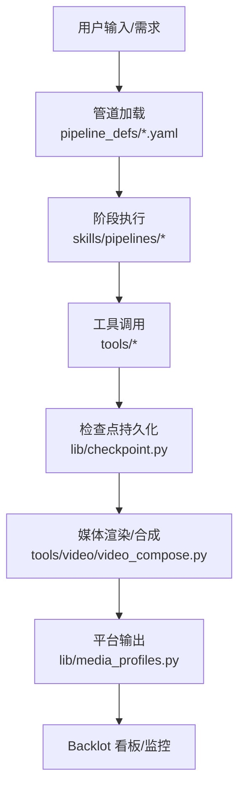
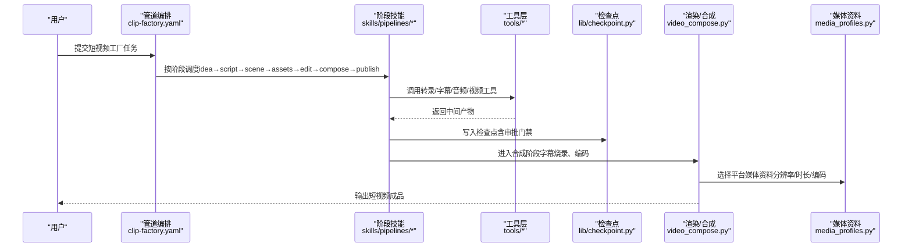
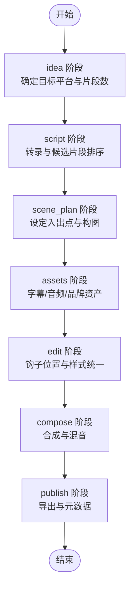
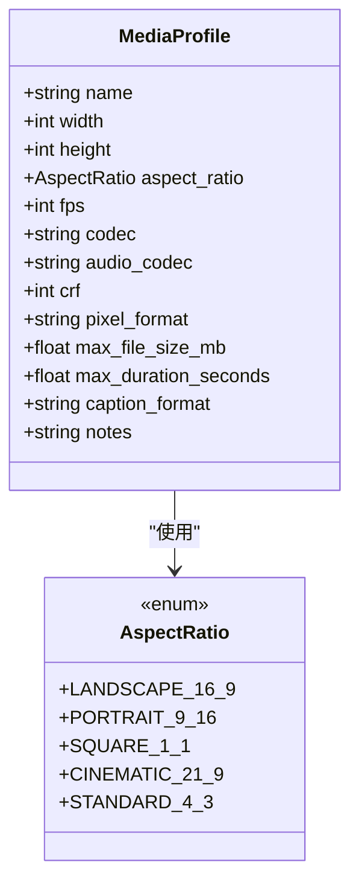
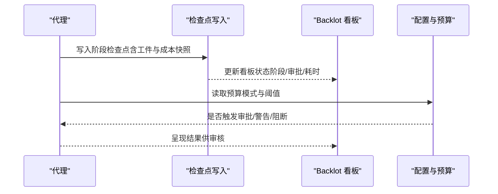
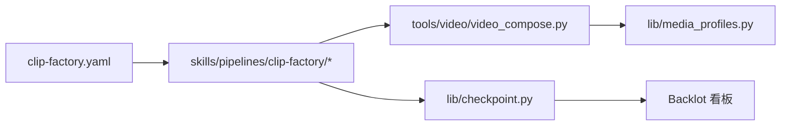

# 短视频工厂管道

<cite>
**本文引用的文件**
- [README.md](file://README.md)
- [config.yaml](file://config.yaml)
- [clip-factory.yaml](file://pipeline_defs/clip-factory.yaml)
- [media_profiles.py](file://lib/media_profiles.py)
- [checkpoint.py](file://lib/checkpoint.py)
- [video_compose.py](file://tools/video/video_compose.py)
- [subtitle-sync.md](file://skills/core/subtitle-sync.md)
- [idea-director.md](file://skills/pipelines/clip-factory/idea-director.md)
- [asset-director.md](file://skills/pipelines/clip-factory/asset-director.md)
</cite>

## 目录
1. [简介](#简介)
2. [项目结构](#项目结构)
3. [核心组件](#核心组件)
4. [架构总览](#架构总览)
5. [详细组件分析](#详细组件分析)
6. [依赖关系分析](#依赖关系分析)
7. [性能与规模化](#性能与规模化)
8. [故障排查指南](#故障排查指南)
9. [结论](#结论)
10. [附录](#附录)

## 简介
本文件面向“短视频工厂”场景，聚焦批量生产能力、模板化工作流、自动化编辑与平台优化。OpenMontage 通过可编排的管道（Pipeline）将“创意—脚本—分镜—素材—剪辑—合成—发布”串联起来，并以质量门禁、预算治理和审计追踪保障大规模内容生产的一致性与可控性。针对社交媒体短视频，系统内置竖屏比例、时长限制、字幕样式与平台输出配置，支持知识分享、产品推广、娱乐内容等多样化模板化产出。

## 项目结构
- 管道定义：YAML 清单描述阶段、工具、审查要点与成功标准，如 clip-factory 用于从长视频批量抽取短视频。
- 技能与规则：Markdown 技能文件指导代理在每个阶段如何执行，包括字幕规范、批处理策略与质量门禁。
- 媒体资料与渲染：平台媒体配置文件提供分辨率、宽高比、编码参数与时长限制；视频合成器负责字幕烧录与音频变速等。
- 状态与检查点：检查点机制保证流程可恢复、可审计，并在关键节点强制人工审批。

**图表来源**
- [clip-factory.yaml:1-207](file://pipeline_defs/clip-factory.yaml#L1-L207)
- [checkpoint.py:194-564](file://lib/checkpoint.py#L194-L564)
- [media_profiles.py:14-166](file://lib/media_profiles.py#L14-L166)
- [video_compose.py:2845-2944](file://tools/video/video_compose.py#L2845-L2944)

**章节来源**
- [README.md:356-378](file://README.md#L356-L378)
- [config.yaml:1-34](file://config.yaml#L1-L34)

## 核心组件
- 管道清单（Manifest）：以 YAML 声明阶段顺序、所需技能、可用工具、审查焦点与成功标准。clip-factory 是短视频工厂的核心，支持多片段抽取与批量一致性控制。
- 技能（Skills）：每个阶段由专用技能文档指导执行，例如 idea/script/scene/assets/edit/compose/publish 各阶段的导演技能。
- 媒体资料（Profiles）：平台特定的分辨率、宽高比、编码、时长与文件大小限制，确保输出符合 TikTok、Reels、Shorts 等平台要求。
- 检查点（Checkpoint）：每阶段完成后写入结构化状态，支持恢复、审计与门禁控制（必须人工批准的关键节点）。
- 视频合成（Compose）：负责字幕烧录、音频变速、编码输出，并支持按风格与平台解析字幕样式。

**章节来源**
- [clip-factory.yaml:1-207](file://pipeline_defs/clip-factory.yaml#L1-L207)
- [media_profiles.py:14-166](file://lib/media_profiles.py#L14-L166)
- [checkpoint.py:194-564](file://lib/checkpoint.py#L194-L564)
- [video_compose.py:2845-2944](file://tools/video/video_compose.py#L2845-L2944)

## 架构总览
短视频工厂采用“代理驱动 + 管道编排”的架构：代理读取 YAML 清单与技能文件，调用工具完成研究、脚本、分镜、素材生成、剪辑与合成，并通过检查点记录决策与成本快照。关键特性：
- 模板化工作流：每个 pipeline 是一整套生产流程，可按类型复用。
- 批量处理能力：clip-factory 支持从单一长源批量抽取 N 个短视频，统一字幕、音频与品牌资产。
- 平台优化：内置 YouTube Shorts、Instagram Reels、TikTok 等媒体资料，自动适配分辨率、时长与编码。
- 质量门禁：预合成校验、后渲染自检、人类审批门禁与审计日志。

**图表来源**
- [clip-factory.yaml:45-207](file://pipeline_defs/clip-factory.yaml#L45-L207)
- [checkpoint.py:422-564](file://lib/checkpoint.py#L422-L564)
- [video_compose.py:2845-2944](file://tools/video/video_compose.py#L2845-L2944)
- [media_profiles.py:60-100](file://lib/media_profiles.py#L60-L100)

## 详细组件分析

### 短视频工厂管道（Clip Factory）
- 目标：从长视频（直播、会议、访谈、演示）批量抽取多个独立短视频，适配社交平台分发。
- 阶段说明：
  - idea：识别源内容类型、目标平台与片段数量，制定筛选标准（钩子、连贯性、价值、能量、平台契合度）。
  - script：完整转录与时间戳，识别候选片段并排序，确保每个片段自包含。
  - scene_plan：为每个片段设定入出点、边界干净、平台特定构图（竖屏/方形/横屏）。
  - assets：为每个片段生成字幕（带偏移）、共享标题/钩子/品牌资产，统一音频归一化。
  - edit：每个片段独立且自包含，前 2-3 秒放置钩子，字幕样式一致。
  - compose：使用 video_compose/video_trimmer/audio_mixer 进行合成与混音，验证所有片段输出与平台规格。
  - publish：导出包按平台组织，附带元数据与编号顺序。

**图表来源**
- [clip-factory.yaml:45-207](file://pipeline_defs/clip-factory.yaml#L45-L207)

**章节来源**
- [clip-factory.yaml:1-207](file://pipeline_defs/clip-factory.yaml#L1-L207)
- [idea-director.md:99-114](file://skills/pipelines/clip-factory/idea-director.md#L99-L114)
- [asset-director.md:44-89](file://skills/pipelines/clip-factory/asset-director.md#L44-L89)

### 模板化工作流与内容类型
- 模板化：每个 pipeline 即一套模板，可复用与扩展；clip-factory 适合“知识分享”“产品推广”“娱乐内容”等批量短视频场景。
- 内容类型建议：
  - 知识分享：强调信息密度与图表可视化，配合清晰旁白与字幕。
  - 产品推广：突出卖点与对比，使用钩子在前 2-3 秒抓住注意力。
  - 娱乐内容：节奏快、视觉冲击强，注重音乐与转场。
- 模板库扩展：可在 skills/pipelines 下新增导演技能与阶段规则，结合 styles/playbook 统一视觉语言。

**章节来源**
- [README.md:356-378](file://README.md#L356-L378)
- [PROMPT_GALLERY.md:191-221](file://PROMPT_GALLERY.md#L191-L221)

### 批量素材处理与自动化编辑
- 批量策略：
  - 统一字幕：为每个片段生成字幕并设置正确时间偏移，避免跨片段不一致。
  - 统一音频：对整批片段进行归一化处理，保持响度、噪声底与清晰度一致。
  - 共享资产：标题、钩子、品牌元素集中管理，减少重复生成与风格漂移。
  - 元数据组织：使用 shared_assets、subtitle_map、audio_profile、clip_asset_index、style_tokens 等键组织批次结构。
- 自动化编辑：
  - 钩子前置：每个片段前 2-3 秒放置钩子，提升完播率。
  - 样式一致：字幕字体、大小、描边、阴影与对齐方式统一。
  - 质量门禁：每片段需具备字幕与清洁音频，共享资产引用一致，片段数量合理。

**章节来源**
- [asset-director.md:44-89](file://skills/pipelines/clip-factory/asset-director.md#L44-L89)
- [clip-factory.yaml:110-186](file://pipeline_defs/clip-factory.yaml#L110-L186)

### 短视频格式要求与平台优化
- 竖屏比例：优先 9:16（1080x1920），适用于 TikTok、Reels、Shorts。
- 时长限制：YouTube Shorts 最大 60 秒；Instagram Reels 最大 90 秒；TikTok 最长可达 10 分钟但短视频通常控制在 60 秒内。
- 字幕样式：
  - 竖屏短视频：每句最多 3-4 词，每行不超过 20 字符；字幕为必需（多数观众静音观看）。
  - 水平视频：每句最多 6-8 词，每行不超过 42 字符。
  - ASS force_style 颜色格式为 &H00FFFFFF（非普通十六进制 RGB）。
- 平台输出：通过 media_profiles 中的 YOUTUBE_SHORTS、INSTAGRAM_REELS、TIKTOK 等配置自动适配分辨率、编码与 CRF。

**图表来源**
- [media_profiles.py:14-38](file://lib/media_profiles.py#L14-L38)

**章节来源**
- [media_profiles.py:60-100](file://lib/media_profiles.py#L60-L100)
- [subtitle-sync.md:23-81](file://skills/core/subtitle-sync.md#L23-L81)

### 进度监控与资源管理
- 检查点与审计：
  - 每阶段完成后写入 checkpoint，包含状态、工件、成本快照与决策日志。
  - 关键阶段需要人工审批（awaiting_human → completed），防止跳过质量控制。
  - 历史归档：覆盖的检查点会复制到 history/，保留版本与门禁审计轨迹。
- 进度展示：
  - Backlot 看板实时显示项目状态、阶段进度与资源消耗。
  - 可通过命令打开库或具体项目的实时看板。
- 资源管理：
  - 预算模式：observe/warn/cap，支持单动作审批阈值与总预算上限。
  - 路径与输出：默认 mp4、libx264、aac、1920x1080、30fps、CRF 23，可按平台调整。

**图表来源**
- [checkpoint.py:194-564](file://lib/checkpoint.py#L194-L564)
- [config.yaml:9-34](file://config.yaml#L9-L34)
- [README.md:150-176](file://README.md#L150-L176)

**章节来源**
- [checkpoint.py:194-564](file://lib/checkpoint.py#L194-L564)
- [config.yaml:1-34](file://config.yaml#L1-L34)
- [README.md:150-176](file://README.md#L150-L176)

## 依赖关系分析
- 管道与技能：clip-factory.yaml 依赖 skills/pipelines/clip-factory/* 的技能文件，明确各阶段职责与工具。
- 工具与渲染：compose 阶段依赖 video_compose、video_trimmer、audio_mixer；字幕样式由 video_compose 解析并烧录。
- 媒体资料：渲染阶段依据 media_profiles 的平台配置输出正确的分辨率、编码与时长限制。
- 检查点与审计：所有阶段通过 checkpoint 写入状态，确保流程可恢复与审计。

**图表来源**
- [clip-factory.yaml:26-37](file://pipeline_defs/clip-factory.yaml#L26-L37)
- [video_compose.py:2845-2944](file://tools/video/video_compose.py#L2845-L2944)
- [media_profiles.py:14-166](file://lib/media_profiles.py#L14-L166)
- [checkpoint.py:194-564](file://lib/checkpoint.py#L194-L564)

**章节来源**
- [clip-factory.yaml:26-37](file://pipeline_defs/clip-factory.yaml#L26-L37)
- [video_compose.py:2845-2944](file://tools/video/video_compose.py#L2845-L2944)
- [media_profiles.py:14-166](file://lib/media_profiles.py#L14-L166)
- [checkpoint.py:194-564](file://lib/checkpoint.py#L194-L564)

## 性能与规模化
- 批量一致性：通过共享资产与统一音频归一化，确保整批短视频风格一致、观感统一。
- 效率提升：
  - 模板化工作流减少重复劳动，快速复制成功模式。
  - 平台媒体资料自动适配，避免手动调整分辨率与编码。
  - 检查点与回滚机制提高容错能力，降低失败成本。
- 质量保证：
  - 预合成校验与后渲染自检，防止低质量输出。
  - 人类审批门禁在关键节点拦截风险。
  - 决策日志与成本快照提供可追溯审计。

[本节为通用指导，不直接分析具体文件]

## 故障排查指南
- 检查点错误：
  - 若阶段未满足前置条件或跳过审批，会抛出检查点验证错误。请确认前一阶段已完成并获得批准。
  - 参考 checkpoint 写入逻辑与门禁规则，修正工件或审批状态。
- 字幕样式问题：
  - 确保使用正确的 ASS color 格式（&H00FFFFFF），避免定位错误。
  - 竖屏短视频字幕字号不宜过大，避免遮挡画面主体。
- 平台输出异常：
  - 核对媒体资料配置（分辨率、时长、编码），确保与目标平台匹配。
  - 若输出不符合预期，检查 compose 阶段的 FFmpeg 参数与缩放滤镜。

**章节来源**
- [checkpoint.py:422-564](file://lib/checkpoint.py#L422-L564)
- [subtitle-sync.md:42-81](file://skills/core/subtitle-sync.md#L42-L81)
- [media_profiles.py:60-100](file://lib/media_profiles.py#L60-L100)

## 结论
OpenMontage 的短视频工厂管道通过模板化工作流、批量素材处理与自动化编辑，实现了社交媒体短视频的高效生产与平台优化。借助检查点与质量门禁，系统在大规模生产中保持了稳定性与可审计性。结合平台媒体资料与字幕规范，可稳定产出符合 TikTok、Reels、Shorts 等要求的竖屏短视频，适用于知识分享、产品推广与娱乐内容等多种场景。

[本节为总结，不直接分析具体文件]

## 附录
- 快速启动与示例提示：参见 README 中的“Try These Prompts”，可直接运行完整生产流水线。
- 提供者与工具：详见 docs/PROVIDERS.md，了解视频、图像、TTS、音乐等集成选项。
- 风格系统：styles/*.yaml 提供视觉语言模板，确保批量产出的风格一致性。

**章节来源**
- [README.md:308-353](file://README.md#L308-L353)
- [README.md:489-617](file://README.md#L489-L617)
- [README.md:621-632](file://README.md#L621-L632)