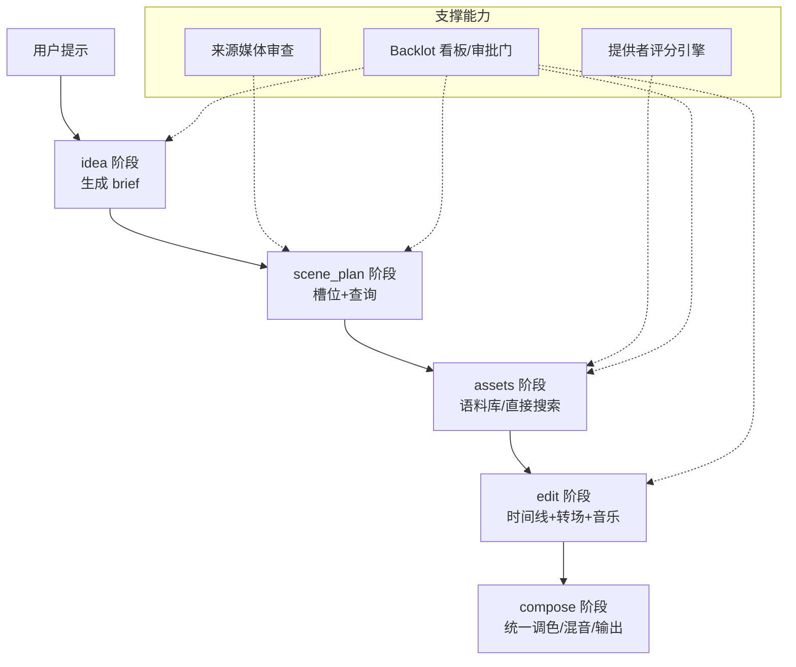
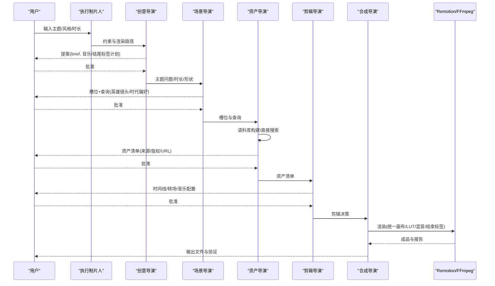
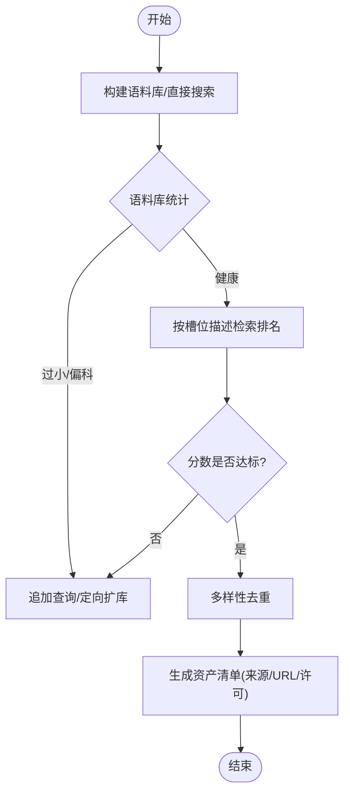
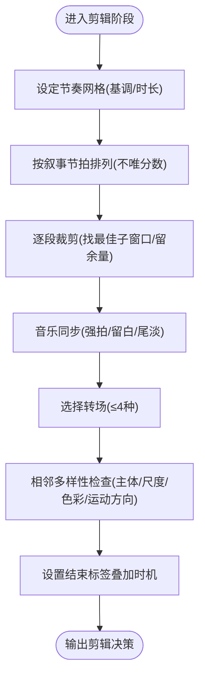
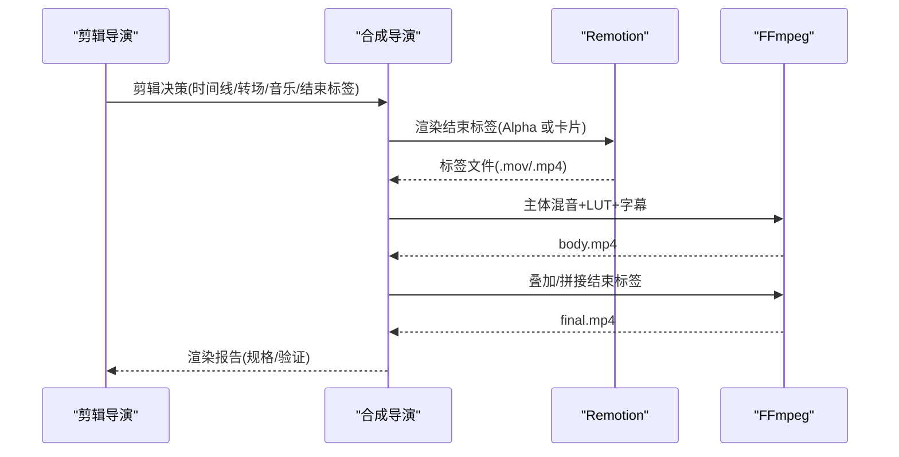
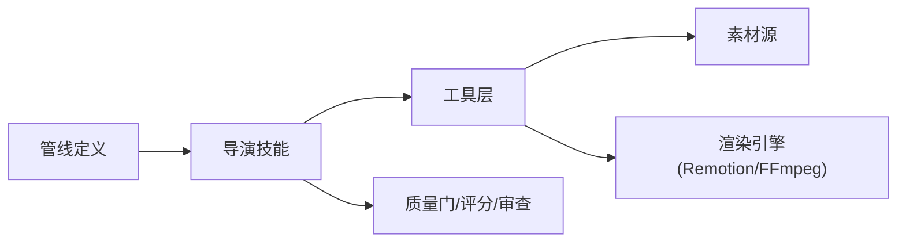

# 纪录片蒙太奇管道

<cite>
**本文引用的文件**
- [documentary-montage.yaml](file://pipeline_defs/documentary-montage.yaml)
- [executive-producer.md](file://skills/pipelines/documentary-montage/executive-producer.md)
- [idea-director.md](file://skills/pipelines/documentary-montage/idea-director.md)
- [scene-director.md](file://skills/pipelines/documentary-montage/scene-director.md)
- [asset-director.md](file://skills/pipelines/documentary-montage/asset-director.md)
- [edit-director.md](file://skills/pipelines/documentary-montage/edit-director.md)
- [compose-director.md](file://skills/pipelines/documentary-montage/compose-director.md)
- [source_media_review.py](file://lib/source_media_review.py)
- [scoring.py](file://lib/scoring.py)
- [README.md](file://README.md)
</cite>

## 目录
1. [简介](#简介)
2. [项目结构](#项目结构)
3. [核心组件](#核心组件)
4. [架构总览](#架构总览)
5. [详细组件分析](#详细组件分析)
6. [依赖关系分析](#依赖关系分析)
7. [性能与质量考量](#性能与质量考量)
8. [故障排查指南](#故障排查指南)
9. [结论](#结论)
10. [附录：不同纪录片类型适配方案](#附录不同纪录片类型适配方案)

## 简介
本使用文档面向“OpenMontage 纪录片蒙太奇管道”，聚焦多源素材整合、蒙太奇剪辑技术与叙事性视频制作。该管道以“检索优先”为核心，从免费与开源的影像库（如 Pexels、Archive.org、NASA、Wikimedia、Unsplash）构建可检索语料库，通过语义检索为每个叙事槽位匹配真实运动片段，再按节拍编排转场、节奏与音乐同步，最终输出统一色调与音轨的成片。文档覆盖素材收集与分析、蒙太奇编排、质量控制、输出格式与跨类型适配，并提供实际流程与效果对比建议。

## 项目结构
OpenMontage 将“管线定义 + 导演技能 + 工具注册表 + 校验模式”解耦，纪录片蒙太奇管道由以下关键部分组成：
- 管线定义：描述阶段、产物、工具与审查标准
- 导演技能：每个阶段的执行策略、质量门与常见陷阱
- 工具层：素材搜索、检索、音视频处理、渲染与混音
- 质量与评分：提供者选择评分、来源媒体审查、预/后审校验

图表来源
- [documentary-montage.yaml:45-179](file://pipeline_defs/documentary-montage.yaml#L45-L179)
- [executive-producer.md:41-63](file://skills/pipelines/documentary-montage/executive-producer.md#L41-L63)

章节来源
- [documentary-montage.yaml:1-179](file://pipeline_defs/documentary-montage.yaml#L1-L179)
- [README.md:356-404](file://README.md#L356-L404)

## 核心组件
- 执行制片人（Executive Producer）：界定适用场景、哲学与跨阶段规则，锁定 Remotion 渲染路径与结束标签策略
- 创意导演（Idea Director）：提炼主题问题、定调、时长与形状、音乐与结尾标签计划
- 场景导演（Scene Director）：将主题拆解为可检索的槽位与查询，标注英雄镜头与时代偏好
- 资产导演（Asset Director）：构建语料库或直接搜索，CLIP 检索与多样性控制，产出资产清单
- 剪辑导演（Edit Director）：制定节奏网格、转场词汇、音乐同步、L-Cut、结束标签叠加时机
- 合成导演（Compose Director）：统一画布、LUT 调色、音频混音、Remotion 结束标签合成与输出验证

章节来源
- [executive-producer.md:26-63](file://skills/pipelines/documentary-montage/executive-producer.md#L26-L63)
- [idea-director.md:10-203](file://skills/pipelines/documentary-montage/idea-director.md#L10-L203)
- [scene-director.md:22-281](file://skills/pipelines/documentary-montage/scene-director.md#L22-L281)
- [asset-director.md:8-48](file://skills/pipelines/documentary-montage/asset-director.md#L8-L48)
- [edit-director.md:23-40](file://skills/pipelines/documentary-montage/edit-director.md#L23-L40)
- [compose-director.md:32-48](file://skills/pipelines/documentary-montage/compose-director.md#L32-L48)

## 架构总览
纪录片蒙太奇管道的数据流与控制流如下：

图表来源
- [documentary-montage.yaml:45-179](file://pipeline_defs/documentary-montage.yaml#L45-L179)
- [compose-director.md:87-109](file://skills/pipelines/documentary-montage/compose-director.md#L87-L109)

## 详细组件分析

### 素材收集与分析阶段
- 素材来源与检索
  - 标准路径：通过语料库构建器聚合多源素材并索引，使用 CLIP 对槽位描述进行相似度排序，支持多样性去重与相似集扩展
  - 快速路径：直接搜索并下载候选片段，适合分幕制作与人工审阅
- 素材评估与内容分析
  - 来源媒体审查：自动探测分辨率、帧率、声道、时长等，抽取代表性帧，推断可用性与风险
  - 质量门槛：语料库规模需达到槽位数量的若干倍；检索分数低于阈值时追加查询或替换
- 版权检查
  - 每段素材必须记录来源、原始 URL 与许可证，确保下游发布合规

图表来源
- [asset-director.md:186-363](file://skills/pipelines/documentary-montage/asset-director.md#L186-L363)
- [source_media_review.py:215-331](file://lib/source_media_review.py#L215-L331)

章节来源
- [asset-director.md:8-48](file://skills/pipelines/documentary-montage/asset-director.md#L8-L48)
- [asset-director.md:186-448](file://skills/pipelines/documentary-montage/asset-director.md#L186-L448)
- [source_media_review.py:215-331](file://lib/source_media_review.py#L215-L331)

### 蒙太奇编排过程
- 镜头选择
  - 基于槽位描述与时代偏好，结合 CLIP 相似度与人类判断挑选最佳片段
  - 避免相邻重复主体/尺度/色彩，必要时回退到第二候选
- 转场设计
  - 限制转场词汇（硬切、淡入/出、淡黑），避免花哨特效破坏纪录片基调
- 节奏控制
  - 依据基调设定基础持镜时长，英雄镜头更长，中间过场更短；总时长与目标时长误差在允许范围内
- 情感表达
  - 利用音乐同步（强拍切点）、一次留白（情绪中心静音）、尾段淡出营造呼吸感；可选 L-Cut 衔接环境声增强连贯性
- 结束标签
  - 默认叠加模式（ProRes 4444 Alpha 叠加于最后画面），备选拼接模式（片尾黑卡）

图表来源
- [edit-director.md:59-179](file://skills/pipelines/documentary-montage/edit-director.md#L59-L179)
- [edit-director.md:214-252](file://skills/pipelines/documentary-montage/edit-director.md#L214-L252)

章节来源
- [edit-director.md:23-179](file://skills/pipelines/documentary-montage/edit-director.md#L23-L179)
- [edit-director.md:214-331](file://skills/pipelines/documentary-montage/edit-director.md#L214-L331)

### 合成与输出
- 统一画布与裁边：根据目标平台确定画布尺寸与遮幅
- 统一调色：整条时间线应用单一 LUT，弥合不同年代/来源的视觉差异
- 音频混音：音乐音量、淡入淡出、静音窗、L-Cut 环境声层
- 结束标签渲染：Remotion 生成带 Alpha 的叠加层或拼接卡片，FFmpeg 合成
- 输出规格：H.264、yuv420p、CRF 18、24fps、AAC 192k；完成后进行 ffprobe 与帧级验证

图表来源
- [compose-director.md:69-129](file://skills/pipelines/documentary-montage/compose-director.md#L69-L129)
- [compose-director.md:153-257](file://skills/pipelines/documentary-montage/compose-director.md#L153-L257)
- [compose-director.md:258-341](file://skills/pipelines/documentary-montage/compose-director.md#L258-L341)

章节来源
- [compose-director.md:51-129](file://skills/pipelines/documentary-montage/compose-director.md#L51-L129)
- [compose-director.md:153-341](file://skills/pipelines/documentary-montage/compose-director.md#L153-L341)

## 依赖关系分析
- 管线与技能耦合
  - 管线定义声明阶段顺序、所需产物与工具；各导演技能提供执行策略与质量门
- 工具依赖
  - 素材检索：corpus_builder、clip_search、direct_clip_search
  - 音视频处理：video_compose、audio_mixer、color_grade、video_trimmer、video_stitch
  - 分析与审查：source_media_review、scoring（提供者评分）
- 外部集成
  - 素材源：Pexels、Pixabay、Coverr、Mixkit、Archive.org、NARA、LOC、Pond5 PD、Videvo、NASA、ESA、JAXA、NOAA、Dareful、Wikimedia、Unsplash
  - 渲染引擎：Remotion（默认且强制用于结束标签叠加）、FFmpeg（主体合成）

图表来源
- [documentary-montage.yaml:32-44](file://pipeline_defs/documentary-montage.yaml#L32-L44)
- [asset-director.md:10-48](file://skills/pipelines/documentary-montage/asset-director.md#L10-L48)
- [compose-director.md:12-19](file://skills/pipelines/documentary-montage/compose-director.md#L12-L19)

章节来源
- [documentary-montage.yaml:1-44](file://pipeline_defs/documentary-montage.yaml#L1-L44)
- [scoring.py:373-542](file://lib/scoring.py#L373-L542)

## 性能与质量考量
- 语料库规模与检索效率
  - 标准路径建议语料库行数为槽位数的 8–12 倍；单查询 per_source 4–8 即可，过大引入噪声
  - 检索分数阈值：≥0.30 强匹配；0.22–0.30 需人工判断；<0.22 应扩库而非强行采用
- 多样性与相邻重复
  - 使用 clip_search.diversify 对候选序列去重，避免相邻镜头主体/尺度/色彩/运动方向重复
- 节奏与时长控制
  - 基线持镜时长依基调设定；英雄镜头取上限，过场取下限；总时长误差控制在 ±10%
- 统一调色与画布
  - 全片单一 LUT 与固定画布，避免混合年代素材跳变；低分辨率素材采用遮幅而非拉伸
- 音频质量
  - 音乐音量、淡入淡出、静音窗与环境声 L-Cut；无旁白时 ducking=false
- 提供者选择评分
  - 七维加权评分（任务契合、输出质量、可控性、可靠性、成本效率、延迟、连续性），保证可解释的选择

章节来源
- [asset-director.md:233-363](file://skills/pipelines/documentary-montage/asset-director.md#L233-L363)
- [edit-director.md:59-179](file://skills/pipelines/documentary-montage/edit-director.md#L59-L179)
- [compose-director.md:111-129](file://skills/pipelines/documentary-montage/compose-director.md#L111-L129)
- [scoring.py:21-70](file://lib/scoring.py#L21-L70)
- [scoring.py:373-542](file://lib/scoring.py#L373-L542)

## 故障排查指南
- 检索弱/语料不足
  - 现象：top 分数 <0.22 或语料行数不足
  - 处理：重写查询、定向扩库（如仅 archive_org 批次）、再次检索；仍失败则标记不可拍摄并建议替换槽位
- 相邻重复导致“幻灯片感”
  - 现象：连续镜头主体/尺度/色彩一致
  - 处理：运行多样性去重，回退到第二候选或调整顺序
- 渲染失败/编码错误
  - 现象：video_compose 报错、容器异常
  - 处理：先标准化输入（video_trimmer 转为 mp4/h264），内存/超时错误可分段渲染后用 video_stitch 拼接
- 结束标签 Alpha 丢失
  - 现象：叠加文本背景为黑
  - 处理：确认 Remotion 渲染使用 PNG 图像与 ProRes 4444 Alpha；重新合成并验证
- 音乐缺失
  - 现象：输出无声
  - 处理：若 brief 未明确“无音乐”，此为合同违规，需中止并提示用户；若已明确 opt-out，保持静默并在报告中注明

章节来源
- [asset-director.md:327-343](file://skills/pipelines/documentary-montage/asset-director.md#L327-L343)
- [compose-director.md:368-384](file://skills/pipelines/documentary-montage/compose-director.md#L368-L384)
- [compose-director.md:214-218](file://skills/pipelines/documentary-montage/compose-director.md#L214-L218)
- [compose-director.md:142-152](file://skills/pipelines/documentary-montage/compose-director.md#L142-L152)

## 结论
OpenMontage 纪录片蒙太奇管道以“检索优先 + 严格质量门”的方式，将多源素材整合为具有叙事节奏与情感表达的成片。其优势在于：
- 可追溯的素材来源与版权信息
- 基于语义检索的高质量匹配与多样性控制
- 严格的节奏、转场与音乐同步规范
- 统一的画布与调色，使跨年代素材融合为一部作品
- 强制的 Remotion 结束标签与输出验证，保障成片一致性

建议在项目中遵循“先规划、再检索、后编排、终合成”的流程，在每个阶段完成质量门与人工审批，以获得稳定且高质量的纪录片蒙太奇输出。

## 附录：不同纪录片类型适配方案
- 历史纪录片
  - 时代偏好：vintage，优先 Archive.org、NARA、LOC、Pond5 PD
  - 查询词：符合时代语境（如“commuter”“housewife”“suburb”）
  - 调色：cool_archive_60 或 neutral_doc_20，强调档案质感
  - 节奏：reverent/elegiac，较长持镜，少切多留
- 科技纪录片
  - 素材来源：NASA、ESA、JAXA、NOAA、Pexels/Pixabay 现代技术场景
  - 查询词：具体设备/实验/数据可视化相关名词与形容词
  - 调色：neutral_doc_20 或 cool_archive_60，突出科技感
  - 节奏：urgent/wry，配合数据揭示与转折
- 人物传记
  - 素材来源：公共事件、新闻档案、肖像类素材；必要时加入 AI 生成的幻想风格（儿童/童话向）
  - 查询词：人物特征、场景、时代细节
  - 调色：warm_film_100，温暖人文
  - 节奏：elegiac/dreamlike，注重情感累积与高潮释放

章节来源
- [scene-director.md:140-169](file://skills/pipelines/documentary-montage/scene-director.md#L140-L169)
- [scene-director.md:171-205](file://skills/pipelines/documentary-montage/scene-director.md#L171-L205)
- [compose-director.md:111-129](file://skills/pipelines/documentary-montage/compose-director.md#L111-L129)