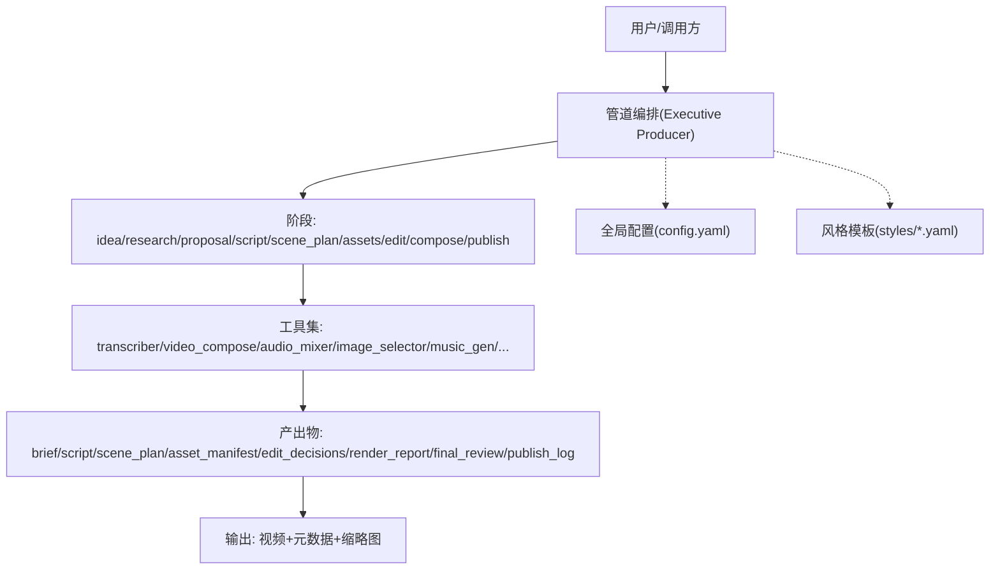
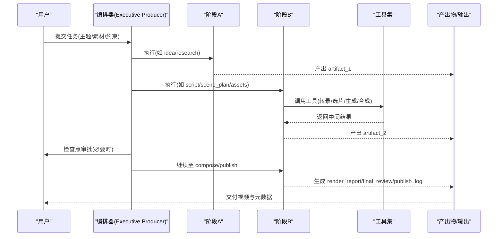
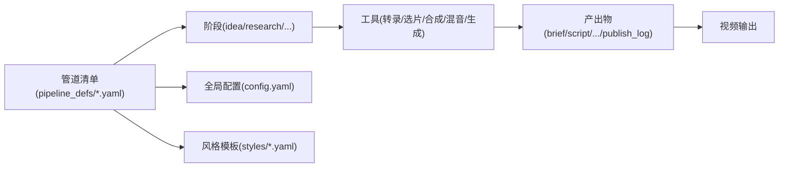

# 预定义管道

<cite>
**本文引用的文件**
- [animated-explainer.yaml](file://pipeline_defs/animated-explainer.yaml)
- [animation.yaml](file://pipeline_defs/animation.yaml)
- [cinematic.yaml](file://pipeline_defs/cinematic.yaml)
- [documentary-montage.yaml](file://pipeline_defs/documentary-montage.yaml)
- [screen-demo.yaml](file://pipeline_defs/screen-demo.yaml)
- [talking-head.yaml](file://pipeline_defs/talking-head.yaml)
- [avatar-spokesperson.yaml](file://pipeline_defs/avatar-spokesperson.yaml)
- [hybrid.yaml](file://pipeline_defs/hybrid.yaml)
- [config.yaml](file://config.yaml)
- [clean-professional.yaml](file://styles/clean-professional.yaml)
- [flat-motion-graphics.yaml](file://styles/flat-motion-graphics.yaml)
</cite>

## 目录
1. [简介](#简介)
2. [项目结构](#项目结构)
3. [核心组件](#核心组件)
4. [架构总览](#架构总览)
5. [详细组件分析](#详细组件分析)
6. [依赖分析](#依赖分析)
7. [性能考虑](#性能考虑)
8. [故障排查指南](#故障排查指南)
9. [结论](#结论)
10. [附录](#附录)

## 简介
本文件面向OpenMontage的“预定义管道”使用与定制，覆盖以下工作流：动画解释器、电影风格、纪录片蒙太奇、屏幕演示、对话头像、虚拟发言人、混合素材等。每个管道以YAML清单定义阶段、工具、质量门禁与产出物，配合全局配置与风格模板，形成从创意到发布的端到端视频生产流水线。

## 项目结构
- 管道清单位于 pipeline_defs 目录，每个 .yaml 描述一个可执行的预定义管道，包含名称、版本、分类、稳定性、编排策略、所需技能、兼容风格、阶段序列、工具白名单、检查点策略、成功标准等。
- 全局配置在 config.yaml，控制LLM、预算、检查点策略、输出格式/编码/分辨率/帧率/码率等。
- 风格模板在 styles 目录，提供视觉语言、动效、音频、资产生成提示、质量规则等，供管道在compose阶段或渲染时参考。

**图示来源**
- [config.yaml:1-34](file://config.yaml#L1-L34)
- [clean-professional.yaml:1-105](file://styles/clean-professional.yaml#L1-L105)
- [flat-motion-graphics.yaml:1-105](file://styles/flat-motion-graphics.yaml#L1-L105)

**章节来源**
- [config.yaml:1-34](file://config.yaml#L1-L34)

## 核心组件
- 管道清单（Pipeline Manifest）：定义目标、阶段、工具、检查点、成功标准、兼容性等。
- 编排器（Executive Producer）：按清单驱动阶段执行，管理预算、重试、回退、时间上限。
- 技能（Skills）：各阶段的导演型技能，负责具体创作与决策。
- 工具（Tools）：转录、选片、配音、图像/音乐生成、合成、混音、剪辑、转场、字幕等。
- 产出物（Artifacts）：brief、script、scene_plan、asset_manifest、edit_decisions、render_report、final_review、publish_log 等。
- 风格模板（Playbooks）：统一视觉与动效规范，影响compose与最终呈现。

**章节来源**
- [animated-explainer.yaml:1-270](file://pipeline_defs/animated-explainer.yaml#L1-L270)
- [animation.yaml:1-300](file://pipeline_defs/animation.yaml#L1-L300)
- [cinematic.yaml:1-288](file://pipeline_defs/cinematic.yaml#L1-L288)
- [documentary-montage.yaml:1-179](file://pipeline_defs/documentary-montage.yaml#L1-L179)
- [screen-demo.yaml:1-247](file://pipeline_defs/screen-demo.yaml#L1-L247)
- [talking-head.yaml:1-229](file://pipeline_defs/talking-head.yaml#L1-L229)
- [avatar-spokesperson.yaml:1-207](file://pipeline_defs/avatar-spokesperson.yaml#L1-L207)
- [hybrid.yaml:1-228](file://pipeline_defs/hybrid.yaml#L1-L228)

## 架构总览
所有预定义管道遵循统一的“阶段化编排”模式：
- 输入：主题/脚本/参考视频/源素材
- 阶段：idea/research/proposal/script/scene_plan/assets/edit/compose/publish（不同管道组合略有差异）
- 工具：按阶段暴露可选/必需工具集合
- 检查点：关键阶段强制人工审批或自动校验
- 输出：视频成品与配套元数据、发布包

**图示来源**
- [animation.yaml:62-300](file://pipeline_defs/animation.yaml#L62-L300)
- [cinematic.yaml:60-288](file://pipeline_defs/cinematic.yaml#L60-L288)
- [documentary-montage.yaml:45-179](file://pipeline_defs/documentary-montage.yaml#L45-L179)
- [screen-demo.yaml:77-247](file://pipeline_defs/screen-demo.yaml#L77-L247)
- [talking-head.yaml:42-229](file://pipeline_defs/talking-head.yaml#L42-L229)
- [avatar-spokesperson.yaml:45-207](file://pipeline_defs/avatar-spokesperson.yaml#L45-L207)
- [hybrid.yaml:46-228](file://pipeline_defs/hybrid.yaml#L46-L228)

## 详细组件分析

### 动画解释器（Animated Explainer）
- 设计目标：基于主题/想法，由AI全链路生成旁白、画面与音乐；强调研究优先的前置阶段，先出概念方案与成本估算，经批准后再生产。
- 适用场景：知识科普、产品功能讲解、教育内容、品牌理念传播。
- 阶段组成与流程：
  - research → proposal（含sample子阶段）→ script → scene_plan → assets → edit → compose → publish
  - 关键产出：research_brief、proposal_packet、decision_log、script、scene_plan、asset_manifest、edit_decisions、render_report、final_review、publish_log
- 数据流转：
  - research 产出研究简报；proposal 基于研究提出多概念并给出成本估算；script 将概念转为分镜脚本；scene_plan 规划每段画面与工具路径；assets 生成配音、图像、图表、代码片段、音乐等；edit 做时间线决策；compose 合成渲染；publish 打包导出。
- 配置要点：
  - 默认预算、最大修订次数、最长运行时间、检查点策略、兼容风格（推荐 clean-professional、flat-motion-graphics）。
  - 渲染运行时选择需在提案中明确，并在compose阶段保持一致性校验。
- 定制扩展：
  - 可通过 compatible_playbooks 切换风格；可在 assets 阶段启用 math_animate/diagram_gen/code_snippet/music_gen 等工具；可自定义脚本与技能。

**章节来源**
- [animated-explainer.yaml:1-270](file://pipeline_defs/animated-explainer.yaml#L1-L270)

### 动画（Animation）
- 设计目标：以动效为先，涵盖图形动效、图表可视化、动态排版、数学可视化、Three.js世界与风格化插画序列；前置研究决定动画模式与复用策略。
- 适用场景：技术演示、数据可视化、品牌宣传片、复杂概念可视化。
- 阶段组成与流程：research → proposal（含sample）→ script → scene_plan → assets → edit → compose → publish
- 数据流转：
  - 研究聚焦动画技术与参考；提案确定动画模式、复用策略、音频架构与提供商对比；脚本与分镜确保节奏与可读性；资产阶段严格遵循“层3技能读取”与“选择器工具优先”原则；compose阶段需通过HyperFrames lint/validate并自检关键帧。
- 配置要点：
  - 推荐风格：flat-motion-graphics、anime-ghibli；也兼容 clean-professional、minimalist-diagram。
  - 渲染运行时选择必须记录在 decision_log，compose阶段禁止静默替换。
- 定制扩展：
  - 在 assets 阶段可选择 threejs_world/threejs_asset_catalog/atlas_3d/fal_3d/blender_world 等3D能力；支持 music_gen/fal_elevenlabs_music 等音频生成。

**章节来源**
- [animation.yaml:1-300](file://pipeline_defs/animation.yaml#L1-L300)

### 电影风格（Cinematic）
- 设计目标：情绪驱动的预告片、品牌短片、蒙太奇、明确的3D世界漫游与短剧式剪辑；适合已有素材为主，辅以生成支撑画面。
- 适用场景：品牌广告、活动预告、情感向短片、高质量混剪。
- 阶段组成与流程：research → proposal（含sample）→ script → scene_plan → assets → edit → compose → publish
- 数据流转：
  - 研究聚焦视觉参考与声音方向；提案锁定情绪弧线、运动需求、交付形态与渲染家族；assets 区分源素材与支撑资产，3D世界需保持场景图一致性；compose 强调情绪、色彩、动态与字幕时机。
- 配置要点：
  - 推荐风格：flat-motion-graphics；也兼容 clean-professional、minimalist-diagram。
  - 通常选择 remotion（CinematicRenderer）用于视频主导作品；hyperframes适用于动效标题卡与HTML/GSAP驱动预告片。
- 定制扩展：
  - assets 阶段可使用 subtitle_gen/audio_enhance/image_selector/video_selector/3D工具/音乐库等；compose 支持 color_grade/audio_enhance/video_trimmer。

**章节来源**
- [cinematic.yaml:1-288](file://pipeline_defs/cinematic.yaml#L1-L288)

### 纪录片蒙太奇（Documentary Montage）
- 设计目标：检索优先的主题蒙太奇，构建真实世界影像语料库，用CLIP检索填充槽位描述，按叙事节拍剪辑，统一调色与音乐同步。
- 适用场景：主题诗式短片、历史/文化题材、资料汇编类视频。
- 阶段组成与流程：idea → scene_plan → assets → edit → compose
- 数据流转：
  - idea 产出 brief（主题问题、基调、时长、音乐与结尾标签计划）；scene_plan 为每个槽位准备搜索查询与首选来源；assets 走标准或快速路径检索并挑选片段；edit 锁定渲染家族，安排英雄槽位与过渡词汇；compose 应用统一LUT、混音与结尾标签（overlay 或 concat）。
- 配置要点：
  - 不支持参考视频输入；默认预算较低，允许较长运行时间；compose 阶段要求固定渲染家族与结尾标签渲染方式。
- 定制扩展：
  - 可调整 corpus_builder/clip_search/direct_clip_search 参数；可启用 music_gen；compose 阶段可叠加 color_grade/video_trimmer/video_stitch。

**章节来源**
- [documentary-montage.yaml:1-179](file://pipeline_defs/documentary-montage.yaml#L1-L179)

### 屏幕演示（Screen Demo）
- 设计目标：两类生产模式——真实录制（桌面/浏览器操作）与合成终端动画（Remotion TerminalScene），产出带标注、缩放裁剪、字幕与降噪的演示视频。
- 适用场景：软件教程、安装引导、CLI演示、API配置流程。
- 阶段组成与流程：idea → script → scene_plan → assets → edit → compose → publish
- 数据流转：
  - idea 识别演示表面与模式；script 转录并标注关键UI动作；scene_plan 规划缩放区域与标注位置；assets 生成字幕、可选TTS、图像/图表、音频增强；edit 修剪死时间与标注时机；compose 保证UI可读性与音频清晰。
- 配置要点：
  - 推荐风格：minimalist-diagram、clean-professional；合成终端偏好 remotion（TerminalScene），HTML UI可用 hyperframes。
- 定制扩展：
  - 可接入 playwright-recording 或 cap_recorder；compose 阶段支持 audio_enhance/video_trimmer。

**章节来源**
- [screen-demo.yaml:1-247](file://pipeline_defs/screen-demo.yaml#L1-L247)

### 对话头像（Talking Head）
- 设计目标：端到端处理真人说话视频，转录、剪辑决策、生成字幕、混音并合成输出。
- 适用场景：口播短视频、课程讲解、访谈精剪。
- 阶段组成与流程：idea → script → scene_plan → assets → edit → compose → publish
- 数据流转：
  - idea 确认素材与平台；script 转录并划分段落；scene_plan 规划增强机会与叠加场景；assets 生成字幕与音频预处理；edit 自动跳切与速度控制；compose 进行人脸增强、调色、自动重构图、逐字字幕等。
- 配置要点：
  - 推荐风格：clean-professional；compose 阶段可选 face_enhance/eye_enhance/color_grade/audio_enhance/auto_reframe/remotion_caption_burn/showcase_card/video_stitch/visual_qa。
- 定制扩展：
  - 可按需开启自动跳切与逐字字幕；支持多平台画幅变体。

**章节来源**
- [talking-head.yaml:1-229](file://pipeline_defs/talking-head.yaml#L1-L229)

### 虚拟发言人（Avatar Spokesperson）
- 设计目标：以数字发言人为主角的视频，适用于内部更新、入职培训、销售介绍与短脚本说明；强调口型同步、发言人构图与CTA落地。
- 适用场景：企业内训、产品介绍、营销短视频。
- 阶段组成与流程：idea → script → scene_plan → assets → edit → compose → publish
- 数据流转：
  - idea 明确发言人路径与CTA；script 精简口语化文案；scene_plan 规划发言人与背景系统；assets 生成发言人、口型同步、字幕、背景与音频增强；edit 确保发言人主体地位与CTA时机；compose 校验口型与字幕布局。
- 配置要点：
  - 推荐风格：clean-professional、flat-motion-graphics；compose 阶段重点校验口型与字幕清晰度。
- 定制扩展：
  - 可接入 talking_head/lip_sync/tts_selector/subtitle_gen/image_selector/audio_enhance/video_selector。

**章节来源**
- [avatar-spokesperson.yaml:1-207](file://pipeline_defs/avatar-spokesperson.yaml#L1-L207)

### 混合素材（Hybrid）
- 设计目标：结合源素材与设计/生成的支撑资产，如采访配图表、产品 footage 配叠加、屏幕录制配伴生图形、蒙太奇配插入画面。
- 适用场景：产品评测、技术分享、混合媒体内容。
- 阶段组成与流程：idea → script → scene_plan → assets → edit → compose → publish
- 数据流转：
  - idea 明确锚定媒介与支撑层；script 分离源与支撑节拍；scene_plan 避免过载并确保画幅变体；assets 映射真实叙事缺口并复用模板；edit 保证源剪辑连贯后再叠加支撑；compose 平衡源与支撑并保持音频一致。
- 配置要点：
  - 推荐风格：clean-professional、flat-motion-graphics；也兼容 minimalist-diagram。
  - 通常选择 remotion 以便源素材与React叠加一次性合成；仅在支撑层为HTML/GSAP原生时选择 hyperframes。
- 定制扩展：
  - 可启用 subtitle_gen/tts_selector/image_selector/video_selector/diagram_gen/code_snippet/music_gen/audio_enhance；compose 支持 video_stitch/video_trimmer/color_grade/audio_enhance。

**章节来源**
- [hybrid.yaml:1-228](file://pipeline_defs/hybrid.yaml#L1-L228)

## 依赖分析
- 管道间共享元素：
  - 共同阶段名（idea/research/proposal/script/scene_plan/assets/edit/compose/publish）便于跨管道迁移与复用。
  - 共同产出物（brief/script/scene_plan/asset_manifest/edit_decisions/render_report/final_review/publish_log）构成统一的数据契约。
  - 共同工具族（transcriber/video_compose/audio_mixer/image_selector/music_gen等）在不同管道按需启用。
- 外部依赖：
  - LLM提供商与模型（config.yaml llm.*）
  - 预算与审批（config.yaml budget.*）
  - 输出编码与分辨率（config.yaml output.*）
  - 风格模板（styles/*.yaml）

**图示来源**
- [config.yaml:1-34](file://config.yaml#L1-L34)
- [clean-professional.yaml:1-105](file://styles/clean-professional.yaml#L1-L105)
- [flat-motion-graphics.yaml:1-105](file://styles/flat-motion-graphics.yaml#L1-L105)

**章节来源**
- [config.yaml:1-34](file://config.yaml#L1-L34)

## 性能考虑
- 预算与时间上限：各管道在 orchestration 中设置预算、最大修订次数、最长墙钟时间，避免无限迭代。
- 工具选择优先级：优先使用选择器工具（video_selector/tts_selector/image_selector）而非直接调用提供商工具，减少冗余调用与成本。
- 渲染运行时一致性：在提案阶段锁定渲染运行时（remotion/hyperframes/ffmpeg），compose阶段禁止静默替换，避免质量与性能波动。
- 资源复用：在动画与混合管道中鼓励复用模板与动机，降低重复生成成本。
- 输出优化：根据平台选择合适的分辨率、帧率与CRF，避免过度渲染。

[本节为通用指导，不直接分析具体文件]

## 故障排查指南
- 常见错误与定位：
  - 渲染失败：检查 render_report 与 final_review，确认输出文件存在并通过 ffprobe 验证。
  - 运行时不一致：核对 edit_decisions 中的 render_runtime 是否与 proposal_packet 一致，若不一致需在 decision_log 中记录变更原因。
  - 工具不可用：确认 tools_available 列表是否包含所需工具，必要时在 assets 阶段启用对应工具。
  - 风格不匹配：检查 compatible_playbooks 与 styles 配置，确保视觉语言与动效符合预期。
- 调试建议：
  - 逐步推进检查点：在关键阶段（proposal/script/scene_plan/assets/compose/publish）启用 checkpoint_required 与 human_approval_default。
  - 查看日志与产物：关注 brief/script/scene_plan/asset_manifest/edit_decisions/render_report/final_review/publish_log 的结构完整性。
  - 限制范围：先在小片段上验证工具链与风格，再扩展到全长视频。

**章节来源**
- [animation.yaml:245-279](file://pipeline_defs/animation.yaml#L245-L279)
- [cinematic.yaml:229-267](file://pipeline_defs/cinematic.yaml#L229-L267)
- [documentary-montage.yaml:141-179](file://pipeline_defs/documentary-montage.yaml#L141-L179)
- [screen-demo.yaml:194-227](file://pipeline_defs/screen-demo.yaml#L194-L227)
- [talking-head.yaml:162-212](file://pipeline_defs/talking-head.yaml#L162-L212)
- [avatar-spokesperson.yaml:156-186](file://pipeline_defs/avatar-spokesperson.yaml#L156-L186)
- [hybrid.yaml:170-207](file://pipeline_defs/hybrid.yaml#L170-L207)

## 结论
OpenMontage的预定义管道以标准化阶段与产出物为核心，结合灵活的工具体系与风格模板，覆盖从知识讲解到品牌宣传、从真实录制到合成动画的广泛场景。通过严格的检查点与治理规则（预算、运行时一致性、质量门禁），在保证质量的同时提升生产效率。用户可基于现有管道快速上手，也可通过风格模板与工具扩展实现高度定制。

[本节为总结性内容，不直接分析具体文件]

## 附录

### 配置选项速查（来自全局配置）
- LLM：provider、model、temperature、max_tokens
- 预算：mode、total_usd、reserve_pct、single_action_approval_usd、require_approval_for_new_paid_tool
- 检查点：policy、storage_dir
- 输出：default_format、default_codec、default_audio_codec、default_resolution、default_fps、default_crf
- 路径：pipeline_dir、library_dir、styles_dir、skills_dir、output_dir

**章节来源**
- [config.yaml:1-34](file://config.yaml#L1-L34)

### 风格模板要点
- Clean Professional：专业、可信、清晰；中等节奏；蓝白灰主色；适合企业讲解与教育内容。
- Flat Motion Graphics：活力、现代、大胆；快节奏；深色背景与高亮强调；适合社交媒体与产品发布。

**章节来源**
- [clean-professional.yaml:1-105](file://styles/clean-professional.yaml#L1-L105)
- [flat-motion-graphics.yaml:1-105](file://styles/flat-motion-graphics.yaml#L1-L105)