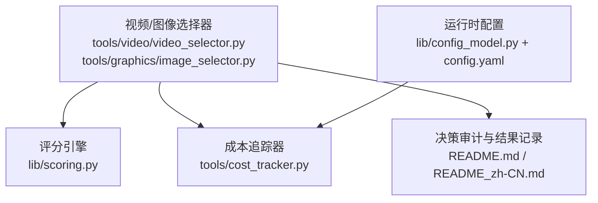
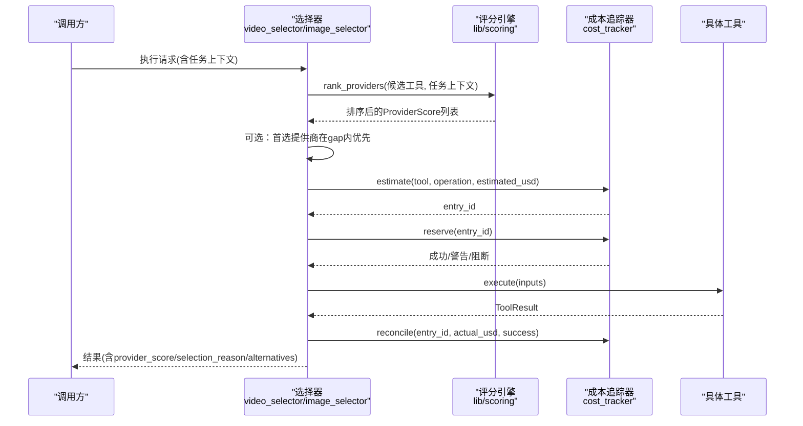
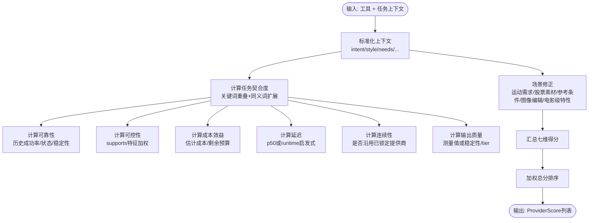
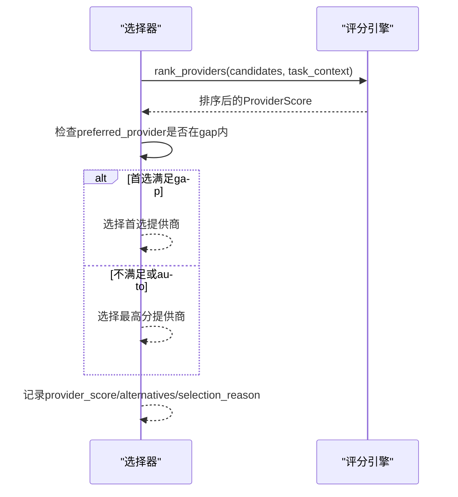
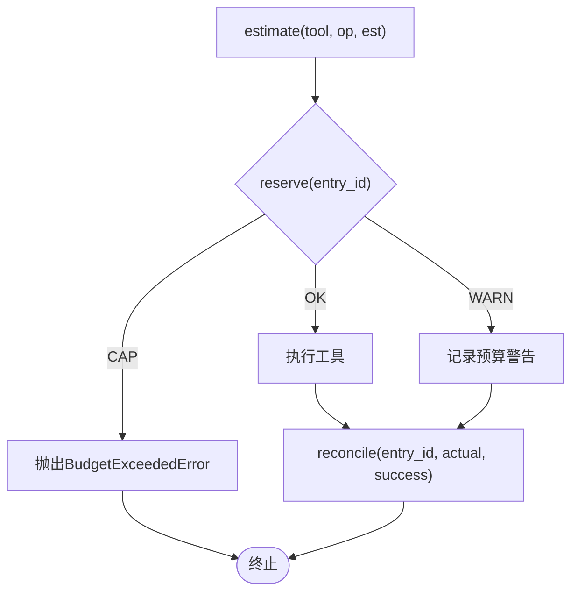
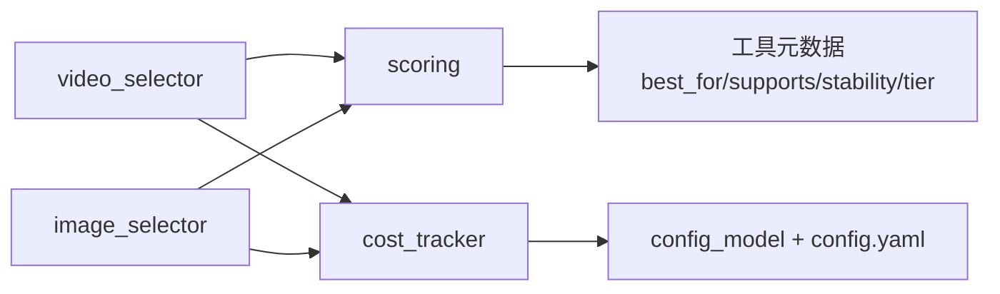

# 评分引擎

<cite>
**本文引用的文件**
- [lib/scoring.py](file://lib/scoring.py)
- [tools/cost_tracker.py](file://tools/cost_tracker.py)
- [lib/config_model.py](file://lib/config_model.py)
- [config.yaml](file://config.yaml)
- [tools/video/video_selector.py](file://tools/video/video_selector.py)
- [tools/graphics/image_selector.py](file://tools/graphics/image_selector.py)
- [tests/tools/test_scoring.py](file://tests/tools/test_scoring.py)
- [tests/tools/test_cost_tracker_governance.py](file://tests/tools/test_cost_tracker_governance.py)
- [tests/contracts/test_phase0_contracts.py](file://tests/contracts/test_phase0_contracts.py)
- [README.md](file://README.md)
- [README_zh-CN.md](file://README_zh-CN.md)
</cite>

## 目录
1. [简介](#简介)
2. [项目结构](#项目结构)
3. [核心组件](#核心组件)
4. [架构总览](#架构总览)
5. [详细组件分析](#详细组件分析)
6. [依赖关系分析](#依赖关系分析)
7. [性能与调优建议](#性能与调优建议)
8. [故障排查指南](#故障排查指南)
9. [结论](#结论)
10. [附录：配置示例与最佳实践](#附录：配置示例与最佳实践)

## 简介
本技术文档聚焦 OpenMontage 的“评分引擎”，系统性阐述多维权重评分算法、提供商自动选择策略、质量治理机制（预算控制、质量门禁、合规检查）、评分配置与调优方法，以及成本追踪与报告能力。目标是帮助开发者与项目管理者理解并优化资源使用与产出质量之间的平衡。

## 项目结构
评分引擎由以下关键模块构成：
- 评分模型与排序：位于 lib/scoring.py，提供 ProviderScore、ProductionPathScore、任务上下文标准化、多维度打分与排序。
- 提供商选择器：位于 tools/video/video_selector.py 与 tools/graphics/image_selector.py，调用评分引擎进行候选工具筛选与决策输出。
- 成本追踪与预算治理：位于 tools/cost_tracker.py，实现预估、预留、结算、模式控制与持久化。
- 运行时配置：位于 lib/config_model.py 与 config.yaml，定义预算模式、阈值、路径等全局配置。
- 测试与契约：tests 目录下覆盖评分、成本治理与集成契约，确保行为稳定可预期。

图表来源
- [tools/video/video_selector.py:308-440](file://tools/video/video_selector.py#L308-L440)
- [tools/graphics/image_selector.py:320-349](file://tools/graphics/image_selector.py#L320-L349)
- [lib/scoring.py:1-557](file://lib/scoring.py#L1-L557)
- [tools/cost_tracker.py:1-524](file://tools/cost_tracker.py#L1-L524)
- [lib/config_model.py:1-93](file://lib/config_model.py#L1-L93)
- [config.yaml:1-34](file://config.yaml#L1-L34)

章节来源
- [lib/scoring.py:1-557](file://lib/scoring.py#L1-L557)
- [tools/cost_tracker.py:1-524](file://tools/cost_tracker.py#L1-L524)
- [lib/config_model.py:1-93](file://lib/config_model.py#L1-L93)
- [config.yaml:1-34](file://config.yaml#L1-L34)
- [tools/video/video_selector.py:308-440](file://tools/video/video_selector.py#L308-L440)
- [tools/graphics/image_selector.py:320-349](file://tools/graphics/image_selector.py#L320-L349)

## 核心组件
- 多维权重评分模型
  - ProviderScore：对单个提供商在给定任务上下文中进行七维打分（任务契合度、输出质量、可控性、可靠性、成本效益、延迟、连续性），并按固定权重计算加权总分。
  - ProductionPathScore：对整条生产路径进行八维打分（交付契合、质量契合、能力置信、回退完整性、预算契合、速度契合、可控性、一致性）。
  - 任务上下文标准化：将松散的意图、风格、平台、需求等文本片段归一化为评分器可用的结构化信号（如是否偏好生成式视觉、是否需要参考条件、是否需要图像编辑等）。
  - 语义匹配与同义词扩展：通过关键词重叠系数与同义词簇提升“cinematic/film”、“social/tiktok”等语义匹配精度。
  - 特殊场景加分/惩罚：运动需求、股票素材倾向、参考条件、图像编辑、电影级特性等对得分进行修正。
- 提供商选择策略
  - 基于 rank_providers 对所有候选工具打分并排序，支持“首选提供商”在分数差距阈值内优先。
  - 选择器在执行前会注入任务上下文，并在结果中记录选择原因、备选方案与评分详情。
- 成本追踪与预算治理
  - 预估-预留-结算闭环：estimate → reserve → reconcile/refund。
  - 预算模式：observe（仅跟踪）、warn（超支警告）、cap（硬性上限）。
  - 单动作审批与新付费工具审批：超过阈值的操作需人工确认。
  - 参考驱动的成本估算：根据视频分析简报、目标时长、工具计划，按场景数、运动比例、TTS字数、音乐等分项估算，并提供低/高区间与样本成本。
- 质量门禁与合规检查
  - 质量门禁贯穿各阶段（研究、脚本、场景规划、资产、剪辑、合成、发布），失败时退回或暂停。
  - 预合成校验与渲染后自检：检测交付承诺、幻灯片风险、黑帧、音频电平、字幕存在性等。
  - 源媒体探测：解析分辨率、编码、声道、时长等，避免误判。

章节来源
- [lib/scoring.py:21-107](file://lib/scoring.py#L21-L107)
- [lib/scoring.py:114-359](file://lib/scoring.py#L114-L359)
- [lib/scoring.py:373-542](file://lib/scoring.py#L373-L542)
- [tools/video/video_selector.py:413-440](file://tools/video/video_selector.py#L413-L440)
- [tools/graphics/image_selector.py:320-349](file://tools/graphics/image_selector.py#L320-L349)
- [tools/cost_tracker.py:40-179](file://tools/cost_tracker.py#L40-L179)
- [tools/cost_tracker.py:183-398](file://tools/cost_tracker.py#L183-L398)
- [README.md:656-688](file://README.md#L656-L688)
- [README_zh-CN.md:577-601](file://README_zh-CN.md#L577-L601)

## 架构总览
评分引擎与选择器、成本追踪器协同工作，形成“评估—选择—执行—结算—审计”的闭环。

图表来源
- [tools/video/video_selector.py:308-440](file://tools/video/video_selector.py#L308-L440)
- [tools/graphics/image_selector.py:320-349](file://tools/graphics/image_selector.py#L320-L349)
- [lib/scoring.py:373-542](file://lib/scoring.py#L373-L542)
- [tools/cost_tracker.py:101-179](file://tools/cost_tracker.py#L101-L179)

## 详细组件分析

### 评分引擎（lib/scoring.py）
- ProviderScore 加权评分
  - 七维度：任务契合度(30%)、输出质量(20%)、可控性(15%)、可靠性(15%)、成本效益(10%)、延迟(5%)、连续性(5%)。
  - 加权总分用于排序；explain() 提供人类可读解释；to_dict() 便于审计日志。
- 任务契合度计算
  - 使用关键词重叠系数（交集/较小集合大小）而非 Jaccard，避免宽泛描述被过度惩罚。
  - 同义词簇扩展（如 cinematic/film/movie/trailer/dramatic/epic 等）提升语义匹配。
  - 结合意图与风格关键词，综合评分并加入基础偏移。
- 可控性评分
  - 依据 supports 字典中的功能开关（controlnet、reference_image、style_transfer、inpainting、img2img、negative_prompt、custom_size、aspect_ratio、seed）加权计算。
- 成本效益评分
  - 免费为满分；若已知剩余预算且估计成本占比过高则降分；无预算信息时使用绝对成本启发式。
- 延迟评分
  - 优先使用历史 p50 延迟映射到 0-1；否则按 runtime（local/local_gpu/hybrid/api）启发式赋值。
- 连续性评分
  - 若已锁定同一提供商，给予高分以维持风格一致性。
- 输出质量评分
  - 优先使用 measured quality；否则按稳定性与 tier 映射，并对生产级生成类工具给予小幅加分。
- 场景修正
  - 运动需求惩罚：视频任务但工具不支持视频时大幅降低任务契合度。
  - 股票素材倾向：当偏好生成式视觉且为视频/图像时，降低任务契合与输出质量。
  - 参考条件与图像编辑：若 supports 满足 reference_to_video/reference_image/multiple_reference_images 或 image_edit/style_transfer/multiple_reference_images，则提升任务契合与可控性。
  - 电影级特性加分：当视频任务包含 cinematic/film/movie/trailer/dramatic/epic/premium 等信号，且具备 native_audio/multi_shot/camera_direction/lip_sync/cinematic_quality 等多项特性时，提升任务契合与输出质量。
- 上下文标准化
  - 合并 intent/style/brief/goal/platform/needs/prompt 等文本片段，提取 style_keywords。
  - 推断 asset_type、motion_required、prefers_generated_visuals、wants_reference_conditioning、wants_image_editing。
- 排序与格式化
  - rank_providers 返回按 weighted_score 降序排列的结果；format_ranking 提供可读输出。

图表来源
- [lib/scoring.py:205-359](file://lib/scoring.py#L205-L359)
- [lib/scoring.py:373-542](file://lib/scoring.py#L373-L542)

章节来源
- [lib/scoring.py:21-107](file://lib/scoring.py#L21-L107)
- [lib/scoring.py:114-359](file://lib/scoring.py#L114-L359)
- [lib/scoring.py:373-542](file://lib/scoring.py#L373-L542)
- [tests/tools/test_scoring.py:9-48](file://tests/tools/test_scoring.py#L9-L48)

### 提供商选择策略（video_selector / image_selector）
- 选择流程
  - 收集候选工具，过滤 allowed_providers 与可用性。
  - 调用 rank_providers 得到排序结果。
  - 若指定 preferred_provider，且其得分不低于 top 得分减去 gap（默认阈值），则优先选择该提供商。
  - 否则选择最高分且可执行的提供商。
- 结果记录
  - 返回 selected_tool、selected_provider、selection_reason（explain）、provider_score（to_dict）、alternatives_considered 等，便于审计与回溯。

图表来源
- [tools/video/video_selector.py:413-440](file://tools/video/video_selector.py#L413-L440)
- [tools/graphics/image_selector.py:320-349](file://tools/graphics/image_selector.py#L320-L349)

章节来源
- [tools/video/video_selector.py:413-440](file://tools/video/video_selector.py#L413-L440)
- [tools/graphics/image_selector.py:320-349](file://tools/graphics/image_selector.py#L320-L349)

### 成本追踪与预算治理（tools/cost_tracker.py）
- 生命周期
  - estimate：记录预估成本，返回 entry_id。
  - reserve：预留预算，检查单动作审批阈值与新付费工具审批；在 warn 模式下标记预算警告，在 cap 模式下抛出异常阻止。
  - reconcile/refund：执行后结算实际花费或取消预留。
- 预算视图
  - budget_reserved_usd、budget_spent_usd、budget_remaining_usd、usable_budget_usd（扣除预留保留比例）。
- 参考驱动估算
  - 基于视频分析简报的结构化信息（场景数、节奏、运动比例、TTS字数、音乐等）生成分项成本明细、总成本区间、样本成本与置信度。
  - 考虑重试缓冲与覆盖率（clip_duration_seconds）以避免低估。
- 持久化
  - 写入 cost_log.json，包含版本、预算总额、预留/已花费、已批准工具与条目列表。

图表来源
- [tools/cost_tracker.py:101-179](file://tools/cost_tracker.py#L101-L179)
- [tools/cost_tracker.py:183-398](file://tools/cost_tracker.py#L183-L398)

章节来源
- [tools/cost_tracker.py:40-179](file://tools/cost_tracker.py#L40-L179)
- [tools/cost_tracker.py:183-398](file://tools/cost_tracker.py#L183-L398)
- [tests/tools/test_cost_tracker_governance.py:15-56](file://tests/tools/test_cost_tracker_governance.py#L15-L56)
- [tests/contracts/test_phase0_contracts.py:475-506](file://tests/contracts/test_phase0_contracts.py#L475-L506)

### 质量门禁与合规检查
- 质量门禁
  - 各阶段（研究、脚本、场景规划、资产、剪辑、合成、发布）设置门禁，失败时退回或暂停，防止错误累积。
- 预合成与后渲染自检
  - 预合成：检查交付承诺、幻灯片风险、渲染器族系缺失等，避免浪费 GPU 时间。
  - 后渲染：ffprobe 验证、抽帧检查黑帧与叠加层、音频静音/削峰、交付承诺与字幕存在性。
- 源媒体探测
  - 解析分辨率、编码、声道、时长等，构建规划影响，避免基于文件名臆测内容。

章节来源
- [README.md:656-688](file://README.md#L656-L688)
- [README_zh-CN.md:577-601](file://README_zh-CN.md#L577-L601)

## 依赖关系分析
- 评分引擎与选择器
  - 选择器依赖评分引擎进行候选工具排序；评分引擎不反向依赖选择器，保持解耦。
- 成本追踪与配置
  - 成本追踪器依赖配置模型读取预算模式与阈值；配置可通过 YAML 与环境变量覆盖。
- 测试与契约
  - 单元测试覆盖评分器的词法处理与电影级特性加分；成本治理测试覆盖 warn/cap 模式与持久化；契约测试覆盖 estimate/reserve/reconcile 流程。

图表来源
- [tools/video/video_selector.py:308-440](file://tools/video/video_selector.py#L308-L440)
- [tools/graphics/image_selector.py:320-349](file://tools/graphics/image_selector.py#L320-L349)
- [lib/scoring.py:373-542](file://lib/scoring.py#L373-L542)
- [tools/cost_tracker.py:101-179](file://tools/cost_tracker.py#L101-L179)
- [lib/config_model.py:1-93](file://lib/config_model.py#L1-L93)
- [config.yaml:1-34](file://config.yaml#L1-L34)

章节来源
- [lib/scoring.py:373-542](file://lib/scoring.py#L373-L542)
- [tools/cost_tracker.py:101-179](file://tools/cost_tracker.py#L101-L179)
- [lib/config_model.py:1-93](file://lib/config_model.py#L1-L93)
- [config.yaml:1-34](file://config.yaml#L1-L34)

## 性能与调优建议
- 评分权重调优
  - 当前权重为经验值，可根据业务侧重调整：例如更重视质量时可提高 output_quality 权重；更重视成本时可提高 cost_efficiency 权重。
  - 注意：权重总和应保持合理范围，避免某维度主导导致其他维度失效。
- 任务契合度优化
  - 完善 best_for 描述与 supports 字段，有助于提升语义匹配与可控性评分。
  - 利用同义词簇与 tokenizer 特性，减少标点与拼写差异带来的影响。
- 成本效益与预算
  - 合理设置 reserve_pct 与 single_action_approval_usd，平衡重试空间与风险控制。
  - 使用 estimate_from_reference 进行更精确的成本预估，结合 motion_ratio 与 clip_duration_seconds 避免低估。
- 延迟与可靠性
  - 维护工具的 latency_p50_seconds 与 historical_success_rate，使评分更贴近真实表现。
- 首选提供商策略
  - 通过 preferred_provider_gap 控制首选提供商的容忍度，兼顾用户体验与最优选择。

[本节为通用指导，无需特定文件引用]

## 故障排查指南
- 提供商选择异常
  - 现象：首选提供商未被选择。
  - 排查：检查 preferred_provider_gap 是否过小；查看 rankings 中首选提供商的 weighted_score 与 top 得分差距；确认候选工具 availability。
  - 参考：选择器逻辑与评分排序。
- 预算超限
  - 现象：reserve 抛出 BudgetExceededError 或记录预算警告。
  - 排查：检查 total_usd、reserve_pct、single_action_approval_usd；确认 estimate 是否准确；必要时提高预算或降低预估。
  - 参考：成本追踪器 reserve 流程与模式控制。
- 成本估算偏差
  - 现象：实际花费显著高于预估。
  - 排查：检查 estimate_from_reference 的假设（场景数、运动比例、TTS字数、重试缓冲）；核对 clip_duration_seconds 与工具单价。
  - 参考：成本估算函数与分项明细。
- 质量门禁失败
  - 现象：阶段被退回或暂停。
  - 排查：查看门禁检查项（交付承诺、幻灯片风险、音频/字幕等）；修复问题后重新提交。
  - 参考：质量门禁与自检说明。

章节来源
- [tools/video/video_selector.py:413-440](file://tools/video/video_selector.py#L413-L440)
- [tools/cost_tracker.py:117-179](file://tools/cost_tracker.py#L117-L179)
- [tools/cost_tracker.py:183-398](file://tools/cost_tracker.py#L183-L398)
- [README.md:656-688](file://README.md#L656-L688)
- [README_zh-CN.md:577-601](file://README_zh-CN.md#L577-L601)

## 结论
OpenMontage 的评分引擎通过多维加权评分与语义匹配，实现了可解释、可审计的提供商自动选择；配合成本追踪与预算治理，确保资源使用透明可控；质量门禁与自检机制保障产出质量与合规性。通过合理的配置与调优，可在质量、成本与性能之间取得最佳平衡。

[本节为总结，无需特定文件引用]

## 附录：配置示例与最佳实践
- 预算配置示例（config.yaml）
  - mode: warn（超支时记录警告）
  - total_usd: 10.00（总预算）
  - reserve_pct: 0.10（预留保留比例）
  - single_action_approval_usd: 0.50（单动作审批阈值）
  - require_approval_for_new_paid_tool: true（新付费工具需审批）
- 评分调优建议
  - 完善工具元数据：best_for、supports、stability、tier、latency_p50_seconds、historical_success_rate。
  - 调整 preferred_provider_gap：在体验与最优选择间权衡。
  - 使用 estimate_from_reference：结合视频分析简报与目标时长，获得更准确的成本区间。
- 最佳实践
  - 在关键阶段启用质量门禁，避免错误累积。
  - 使用决策审计跟踪记录提供商选择、风格选择、音乐与声音选择等，便于回溯与复盘。
  - 定期回顾成本日志，识别高开销环节并优化。

章节来源
- [config.yaml:9-14](file://config.yaml#L9-L14)
- [lib/config_model.py:35-41](file://lib/config_model.py#L35-L41)
- [tools/cost_tracker.py:183-398](file://tools/cost_tracker.py#L183-L398)
- [README.md:664-688](file://README.md#L664-L688)
- [README_zh-CN.md:577-601](file://README_zh-CN.md#L577-L601)