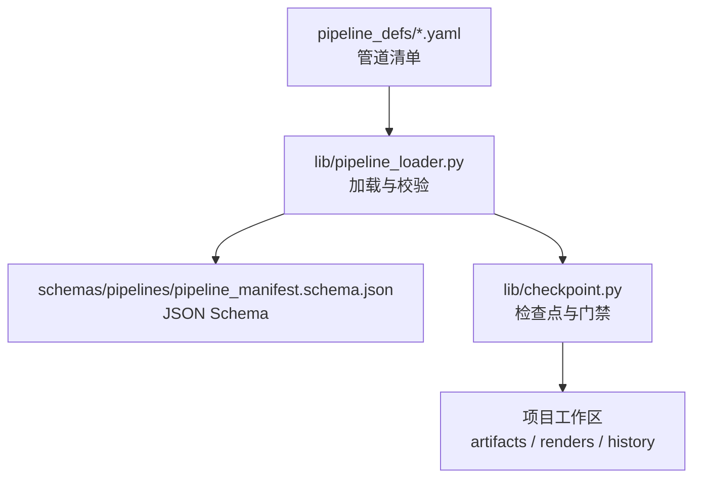
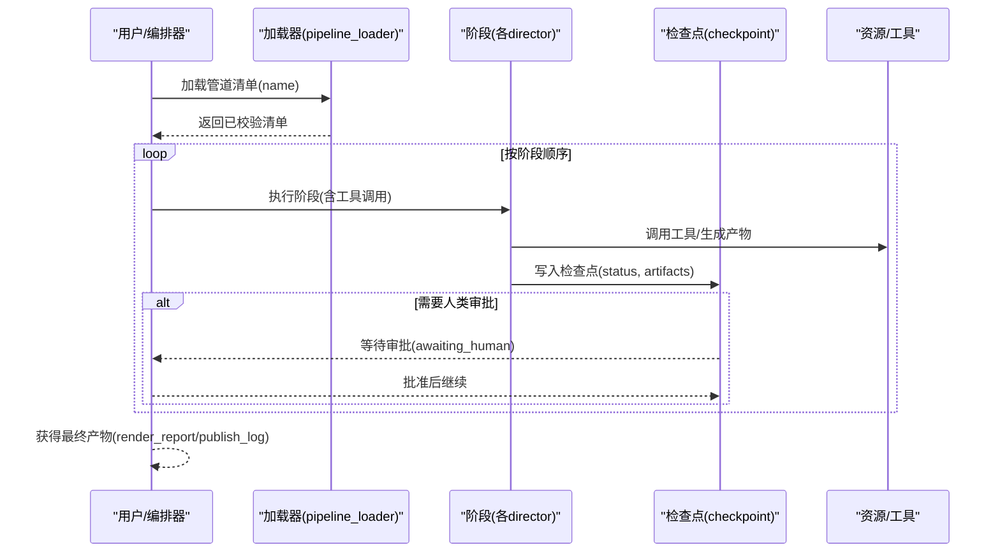
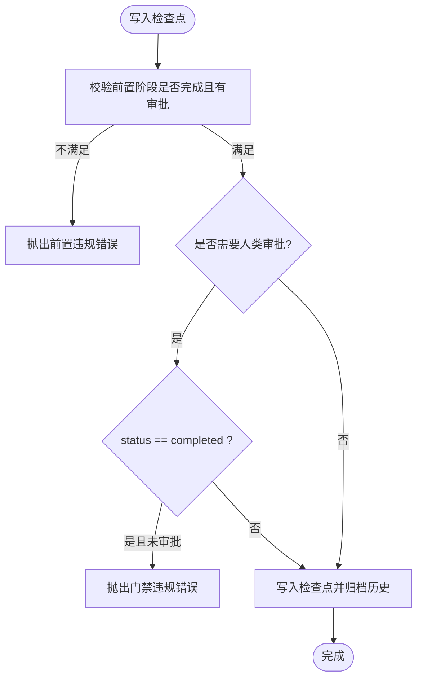

# 管道定义规范

<cite>
**本文引用的文件**
- [pipeline_manifest.schema.json](file://schemas/pipelines/pipeline_manifest.schema.json)
- [pipeline_loader.py](file://lib/pipeline_loader.py)
- [checkpoint.py](file://lib/checkpoint.py)
- [animation.yaml](file://pipeline_defs/animation.yaml)
- [cinematic.yaml](file://pipeline_defs/cinematic.yaml)
- [documentary-montage.yaml](file://pipeline_defs/documentary-montage.yaml)
- [talking-head.yaml](file://pipeline_defs/talking-head.yaml)
- [hybrid.yaml](file://pipeline_defs/hybrid.yaml)
</cite>

## 目录
1. [简介](#简介)
2. [项目结构](#项目结构)
3. [核心组件](#核心组件)
4. [架构总览](#架构总览)
5. [详细组件分析](#详细组件分析)
6. [依赖关系分析](#依赖关系分析)
7. [性能考量](#性能考量)
8. [故障排查指南](#故障排查指南)
9. [结论](#结论)
10. [附录：字段参考与验证规则](#附录字段参考与验证规则)

## 简介
本规范系统化阐述 OpenMontage 的 YAML 管道清单（Pipeline Manifest）定义方式，覆盖元数据、阶段（stages）、工具依赖、检查点策略、人类审批流程、兼容性配置、扩展选项与技能要求。文档以 schemas 中的 JSON Schema 为权威依据，并结合 pipeline_defs 下的多个真实管道示例进行说明，帮助读者从零开始编写、校验和运行一个合规的管道。

## 项目结构
OpenMontage 将“管道定义”与“运行时加载/校验”解耦：
- 声明式定义位于 pipeline_defs/*.yaml
- 解析与校验由 lib/pipeline_loader.py 完成，并基于 schemas/pipelines/pipeline_manifest.schema.json 进行强类型约束
- 运行时状态通过 lib/checkpoint.py 写入检查点，强制执行前置阶段、人类审批与产物契约

图表来源
- [pipeline_loader.py:49-70](file://lib/pipeline_loader.py#L49-L70)
- [pipeline_manifest.schema.json:1-197](file://schemas/pipelines/pipeline_manifest.schema.json#L1-L197)
- [checkpoint.py:422-564](file://lib/checkpoint.py#L422-L564)

章节来源
- [pipeline_loader.py:49-70](file://lib/pipeline_loader.py#L49-L70)
- [pipeline_manifest.schema.json:1-197](file://schemas/pipelines/pipeline_manifest.schema.json#L1-L197)

## 核心组件
- 管道清单（Manifest）：描述名称、版本、类别、稳定性、兼容样式、所需技能、编排参数、参考输入支持、扩展权限以及 stages 数组。
- 阶段（Stage）：每个阶段声明其能力边界（required/optional/tools_available）、产物（produces）、前置产物（required_artifacts_in/optional_artifacts_in）、检查点策略（checkpoint_required）、人类审批默认值（human_approval_default）、审查关注点（review_focus）与成功标准（success_criteria），并可包含子阶段（sub_stages）。
- 检查点（Checkpoint）：持久化阶段产出与状态，强制前置阶段完成与人类审批门禁，归档历史，合并决策日志。
- 加载器（Loader）：读取 YAML、应用 JSON Schema 校验、缓存结果、提供阶段顺序与工具集合等查询接口。

章节来源
- [pipeline_manifest.schema.json:7-197](file://schemas/pipelines/pipeline_manifest.schema.json#L7-L197)
- [pipeline_loader.py:49-70](file://lib/pipeline_loader.py#L49-L70)
- [checkpoint.py:124-191](file://lib/checkpoint.py#L124-L191)

## 架构总览
下图展示了从清单到执行的关键路径：清单被加载并校验；阶段按顺序推进；每步写入检查点；在需要人类审批的门禁处暂停，直至批准后才继续。

图表来源
- [pipeline_loader.py:49-70](file://lib/pipeline_loader.py#L49-L70)
- [checkpoint.py:422-564](file://lib/checkpoint.py#L422-L564)

## 详细组件分析

### 管道清单结构与字段语义
- 顶层元数据
  - name/version/description/category/stability：标识与治理级别
  - compatible_playbooks：推荐/兼容的样式表，是否允许自定义
  - required_skills：该管道必须加载的技能路径
  - orchestration：编排模式、预算、最大修订/退回次数、超时限制
  - reference_input：是否支持参考视频输入与分析深度/工具
  - extensions：能力扩展开关（脚本/样式/技能/工具）
- stages：阶段数组，每个阶段包含：
  - 身份与能力：name/skill/agent、required_artifacts_in/optional_artifacts_in、produces、preferred_tools/fallback_tools/required_tools/optional_tools/tools_available
  - 质量门禁：checkpoint_required、human_approval_default、review_focus、success_criteria
  - 子阶段：sub_stages（条件激活、默认审批、可用工具、审查关注）

章节来源
- [pipeline_manifest.schema.json:7-197](file://schemas/pipelines/pipeline_manifest.schema.json#L7-L197)

### 阶段（Stages）定义与执行
- 阶段顺序由清单中 stages 数组顺序决定；加载器提供 get_stage_order 暴露主阶段与可选的子阶段序列。
- 工具可用性：
  - tools_available 是 agent 在该阶段可使用的工具集合（required + optional 的并集）
  - required_tools 表示必须可用的工具，否则阶段失败
  - preferred_tools/fallback_tools 用于遗留 Python 处理器选择
- 产物契约：
  - produces 声明该阶段产出的 artifact 名称
  - required_artifacts_in/optional_artifacts_in 声明前置产物依赖
- 检查点与人类审批：
  - checkpoint_required 控制是否写检查点
  - human_approval_default 控制该阶段是否默认需要人类审批
  - review_focus/success_criteria 指导评审与自动化校验

章节来源
- [pipeline_loader.py:125-162](file://lib/pipeline_loader.py#L125-L162)
- [pipeline_manifest.schema.json:76-153](file://schemas/pipelines/pipeline_manifest.schema.json#L76-L153)

### 检查点策略与人类审批流程
- 检查点写入时执行：
  - 前置阶段完整性校验（未完成或无审批的前置阶段将阻止推进）
  - 人类审批门禁：若 manifest 中 human_approval_default=true 或调用方显式要求，则 status=completed 时必须附带 human_approved=True，否则抛出错误
  - 产物校验：canonical artifact 存在且符合 schema
  - 决策日志合并：将 decision_log 合并到项目级日志，并在相关产物中回写引用
- 策略枚举：
  - default_checkpoint_policy 支持 guided/manual_all/auto_noncreative，影响整体检查点行为

图表来源
- [checkpoint.py:284-346](file://lib/checkpoint.py#L284-L346)
- [checkpoint.py:422-564](file://lib/checkpoint.py#L422-L564)

章节来源
- [checkpoint.py:284-346](file://lib/checkpoint.py#L284-L346)
- [checkpoint.py:422-564](file://lib/checkpoint.py#L422-L564)

### 管道元数据配置
- 名称/版本/描述：用于识别与展示
- 类别：talking_head/generated/hybrid/screen_recording/animation/cinematic/documentary/custom
- 稳定性：production/beta，表明审计与稳定程度
- 兼容样式表：recommended/also_works/custom_allowed，限定或放宽样式使用范围
- 所需技能：required_skills 列表，确保编排器加载对应 director 技能
- 编排参数：mode/skill/budget_default_usd/max_revisions_per_stage/max_send_backs/max_wall_time_minutes

章节来源
- [pipeline_manifest.schema.json:9-75](file://schemas/pipelines/pipeline_manifest.schema.json#L9-L75)
- [animation.yaml:1-51](file://pipeline_defs/animation.yaml#L1-L51)
- [cinematic.yaml:1-30](file://pipeline_defs/cinematic.yaml#L1-L30)
- [hybrid.yaml:1-18](file://pipeline_defs/hybrid.yaml#L1-L18)
- [talking-head.yaml:1-35](file://pipeline_defs/talking-head.yaml#L1-L35)

### 兼容性配置、扩展选项与技能要求
- 兼容性：
  - compatible_playbooks 指定推荐与兼容的样式表，custom_allowed 控制是否允许自定义
  - reference_input 声明是否支持参考视频输入及分析深度/工具
- 扩展选项：
  - extensions.custom_scripts/custom_playbooks/custom_skills/custom_tools 控制能力扩展权限
- 技能要求：
  - required_skills 列出该管道必须加载的技能路径，如 executive-producer、research-director、meta/reviewer、meta/checkpoint-protocol 等

章节来源
- [pipeline_manifest.schema.json:21-40](file://schemas/pipelines/pipeline_manifest.schema.json#L21-L40)
- [pipeline_manifest.schema.json:183-193](file://schemas/pipelines/pipeline_manifest.schema.json#L183-L193)
- [animation.yaml:24-43](file://pipeline_defs/animation.yaml#L24-L43)
- [cinematic.yaml:32-50](file://pipeline_defs/cinematic.yaml#L32-L50)
- [hybrid.yaml:20-36](file://pipeline_defs/hybrid.yaml#L20-L36)
- [talking-head.yaml:11-27](file://pipeline_defs/talking-head.yaml#L11-L27)

### 不同复杂度管道的示例模式
- 动画优先（animation）：研究先行、提案审批、资产生产、编辑、合成、发布；强调动画模式选择与复用策略
- 电影感（cinematic）：情绪导向、素材驱动、音乐与色彩一致性；强调情感节奏与交付承诺
- 纪录片蒙太奇（documentary-montage）：检索优先、主题剪辑、统一调色与音乐；强调素材来源与版权信息
- 口播（talking-head）：转录、字幕、音频混合、人脸增强与自动重框；强调时间戳对齐与可读性
- 混合（hybrid）：源素材与设计/生成支撑层结合；强调平衡与多平台适配

章节来源
- [animation.yaml:1-300](file://pipeline_defs/animation.yaml#L1-L300)
- [cinematic.yaml:1-288](file://pipeline_defs/cinematic.yaml#L1-L288)
- [documentary-montage.yaml:1-179](file://pipeline_defs/documentary-montage.yaml#L1-L179)
- [talking-head.yaml:1-229](file://pipeline_defs/talking-head.yaml#L1-L229)
- [hybrid.yaml:1-228](file://pipeline_defs/hybrid.yaml#L1-L228)

## 依赖关系分析
- 清单到加载器：YAML 清单经 pipeline_loader 加载并基于 JSON Schema 校验，返回只读字典
- 加载器到检查点：checkpoint 模块根据 manifest 的阶段顺序与人类审批默认值执行门禁
- 阶段到工具：tools_available 聚合 required/optional/preferred/fallback 以及 reference_input.analysis_tools
- 产物契约：canonical artifacts 与 supplementary artifacts 在 checkpoint 写入时被校验

图表来源
- [pipeline_loader.py:49-70](file://lib/pipeline_loader.py#L49-L70)
- [pipeline_loader.py:152-162](file://lib/pipeline_loader.py#L152-L162)
- [checkpoint.py:422-564](file://lib/checkpoint.py#L422-L564)

章节来源
- [pipeline_loader.py:49-70](file://lib/pipeline_loader.py#L49-L70)
- [pipeline_loader.py:152-162](file://lib/pipeline_loader.py#L152-L162)
- [checkpoint.py:422-564](file://lib/checkpoint.py#L422-L564)

## 性能考量
- 清单加载缓存：使用 lru_cache 缓存 schema 与清单，避免重复解析与校验
- 只读访问：load_pipeline_readonly 返回不可变视图，适合高频 gate 检查
- 最小化工具扫描：get_required_tools 仅聚合必要字段，减少开销
- 检查点原子写入：先写临时文件再替换，防止中断导致损坏

章节来源
- [pipeline_loader.py:27-46](file://lib/pipeline_loader.py#L27-L46)
- [pipeline_loader.py:152-162](file://lib/pipeline_loader.py#L152-L162)
- [checkpoint.py:549-564](file://lib/checkpoint.py#L549-L564)

## 故障排查指南
- 清单未找到：确认 name 与 pipeline_defs 下文件名一致（不含 .yaml）
- Schema 校验失败：对照 pipeline_manifest.schema.json 检查必填字段与枚举值
- 前置阶段违规：检查前一阶段的 checkpoint 是否存在且状态为 completed，且必要时 human_approved 为真
- 门禁违规：若 human_approval_default=true，不得直接写入 status=completed 且 human_approved=False
- 样式表无效：style_playbook 必须可加载，否则会抛出校验错误
- 工具缺失：确认 tools_available 与 required_tools 与实际环境匹配

章节来源
- [pipeline_loader.py:49-70](file://lib/pipeline_loader.py#L49-L70)
- [checkpoint.py:284-346](file://lib/checkpoint.py#L284-L346)
- [checkpoint.py:422-564](file://lib/checkpoint.py#L422-L564)

## 结论
OpenMontage 的管道定义以 YAML 清单为核心，配合严格的 JSON Schema 校验与检查点门禁，实现了可审计、可恢复、可扩展的视频生产流水线。通过 stages、tools、checkpoints 与 human approval 的组合，既能保证质量，又能灵活适配多种制作风格与平台需求。

## 附录：字段参考与验证规则

### 清单顶层字段
- name：字符串，必填
- version：字符串，必填
- description：字符串，可选
- category：枚举，可选
- stability：枚举 production/beta，可选
- compatible_playbooks：数组或对象（recommended/also_works/custom_allowed），可选
- required_skills：字符串数组，可选
- production_modes：对象数组（name/description/required_tools/optional_tools/scene_type/agent_skills/best_for），可选
- stages：阶段数组，必填
- default_checkpoint_policy：guided/manual_all/auto_noncreative，可选
- reference_input：supported/analysis_depth/analysis_tools，可选
- metadata：任意对象，可选
- orchestration：mode/skill/budget_default_usd/max_revisions_per_stage/max_send_backs/max_wall_time_minutes，可选
- extensions：custom_scripts/custom_playbooks/custom_skills/custom_tools，可选

章节来源
- [pipeline_manifest.schema.json:7-197](file://schemas/pipelines/pipeline_manifest.schema.json#L7-L197)

### 阶段字段
- name：字符串，必填
- agent：字符串（遗留），可选
- skill：字符串（指令驱动阶段），可选
- required_artifacts_in：字符串数组，可选
- optional_artifacts_in：字符串数组，可选
- produces：字符串数组，可选
- preferred_tools：字符串数组（遗留），可选
- fallback_tools：字符串数组，可选
- required_tools：字符串数组，可选
- optional_tools：字符串数组，可选
- tools_available：字符串数组，可选
- review_focus：字符串数组，可选
- checkpoint_required：布尔，默认 true，可选
- human_approval_default：布尔，默认 false，可选
- success_criteria：字符串数组，可选
- sub_stages：子阶段数组（name/description/condition/human_approval_default/tools_available/review_focus），可选

章节来源
- [pipeline_manifest.schema.json:76-153](file://schemas/pipelines/pipeline_manifest.schema.json#L76-L153)

### 检查点与人类审批规则
- 前置阶段必须已完成且通过人类审批（当 human_approval_default=true）
- 门禁阶段禁止直接写入 completed 且 human_approved=False
- 产物需通过 canonical artifact 与 schema 校验
- 决策日志会被合并并回写到相关产物

章节来源
- [checkpoint.py:284-346](file://lib/checkpoint.py#L284-L346)
- [checkpoint.py:422-564](file://lib/checkpoint.py#L422-L564)

### 示例片段路径（便于对照实现）
- 动画优先管道：[animation.yaml:1-300](file://pipeline_defs/animation.yaml#L1-L300)
- 电影感管道：[cinematic.yaml:1-288](file://pipeline_defs/cinematic.yaml#L1-L288)
- 纪录片蒙太奇：[documentary-montage.yaml:1-179](file://pipeline_defs/documentary-montage.yaml#L1-L179)
- 口播管道：[talking-head.yaml:1-229](file://pipeline_defs/talking-head.yaml#L1-L229)
- 混合管道：[hybrid.yaml:1-228](file://pipeline_defs/hybrid.yaml#L1-L228)