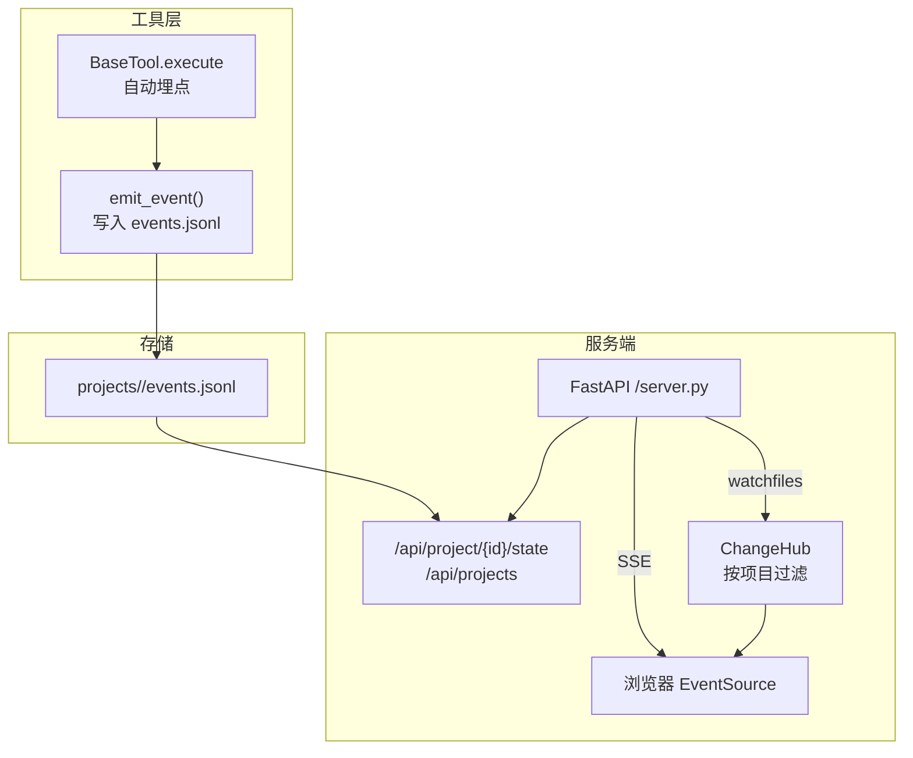
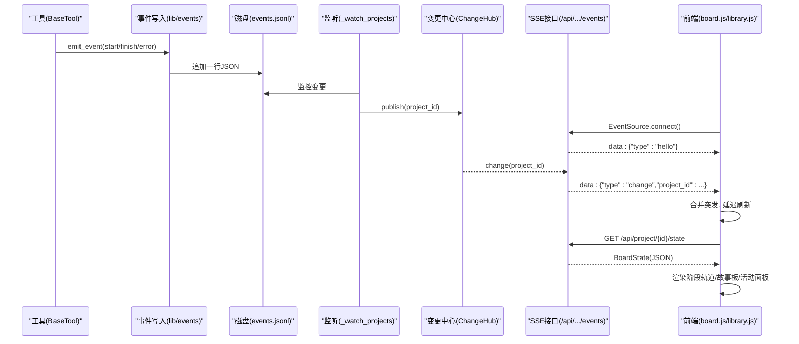
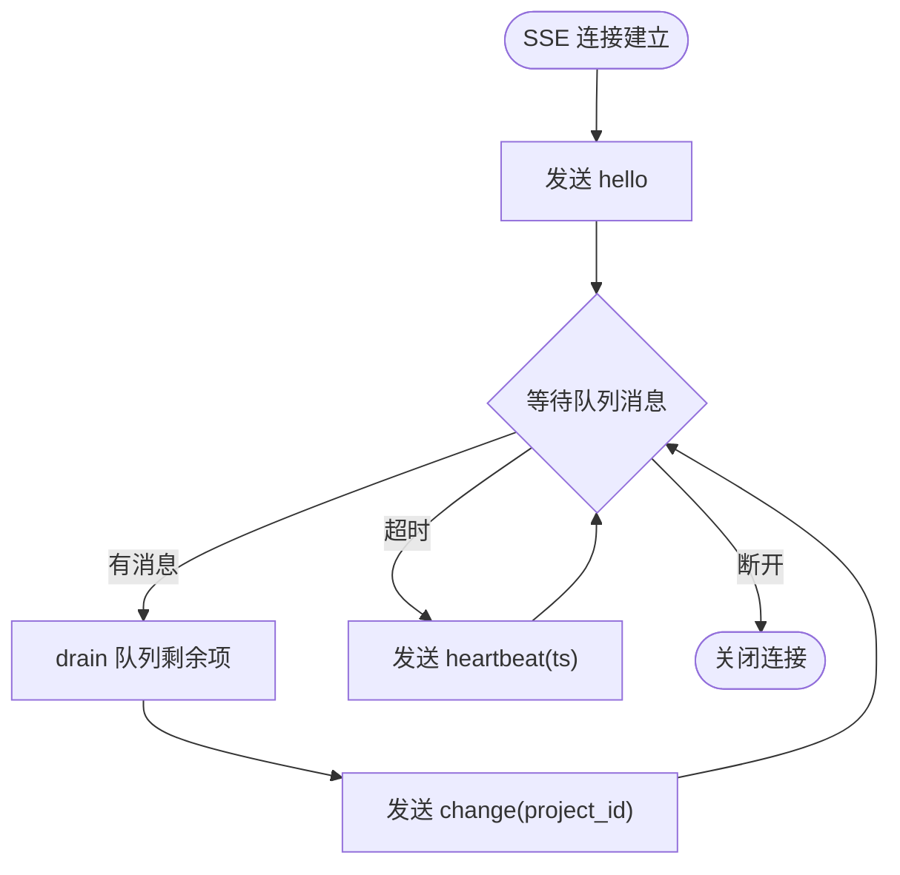
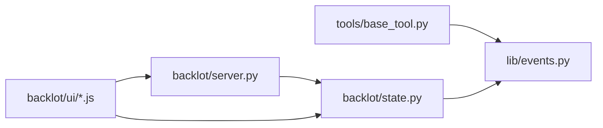
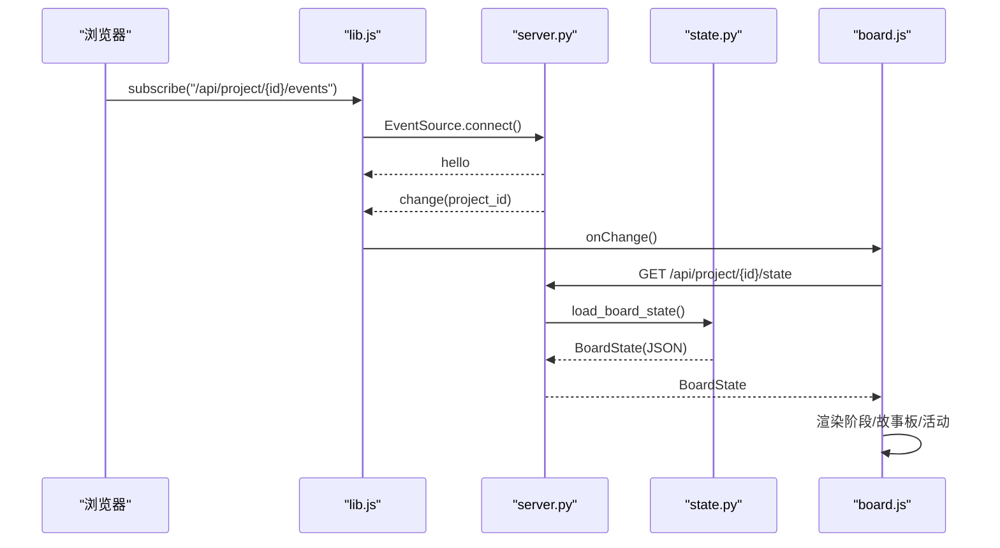

# 事件系统

<cite>
**本文引用的文件**
- [lib/events.py](file://lib/events.py)
- [tools/base_tool.py](file://tools/base_tool.py)
- [backlot/server.py](file://backlot/server.py)
- [backlot/state.py](file://backlot/state.py)
- [backlot/ui/lib.js](file://backlot/ui/lib.js)
- [backlot/ui/board.js](file://backlot/ui/board.js)
- [backlot/ui/library.js](file://backlot/ui/library.js)
</cite>

## 目录
1. [简介](#简介)
2. [项目结构](#项目结构)
3. [核心组件](#核心组件)
4. [架构总览](#架构总览)
5. [详细组件分析](#详细组件分析)
6. [依赖关系分析](#依赖关系分析)
7. [性能与内存管理](#性能与内存管理)
8. [故障排查指南](#故障排查指南)
9. [结论](#结论)
10. [附录：Backlot 界面消费事件的流程](#附录backlot-界面消费事件的流程)

## 简介
本技术文档系统性阐述 OpenMontage 的事件系统，覆盖事件驱动架构的设计原理、事件定义、发布/订阅模式与消息传递机制；实时事件流的处理（SSE 连接管理、事件过滤与路由策略）；事件序列化/反序列化、错误处理与重试机制；监听器的注册与管理、性能优化与内存管理策略；以及 Backlot 界面如何消费事件以更新用户界面。

## 项目结构
事件系统由“工具侧埋点 → 事件落盘 → 服务端 SSE 推送 → 前端订阅渲染”构成，关键目录与职责如下：
- lib/events.py：事件写入与读取（append-only JSONL），项目归属推断，线程安全追加。
- tools/base_tool.py：BaseTool 自动包装 execute()，在工具执行前后发射 start/finish/error 事件。
- backlot/server.py：FastAPI 服务，提供状态 API、SSE 变更通知、媒体与缩略图服务；后台 watchfiles 监听项目目录变化并广播。
- backlot/state.py：将项目目录解析为 BoardState（阶段轨道、故事板、媒体、成本等），供 UI 展示。
- backlot/ui/*.js：前端通过 EventSource 订阅 SSE，合并突发、拉取最新状态并刷新 UI。

**图表来源**
- [tools/base_tool.py:148-224](file://tools/base_tool.py#L148-L224)
- [lib/events.py:77-118](file://lib/events.py#L77-L118)
- [backlot/server.py:132-149](file://backlot/server.py#L132-L149)
- [backlot/server.py:178-240](file://backlot/server.py#L178-L240)

**章节来源**
- [lib/events.py:1-119](file://lib/events.py#L1-L119)
- [tools/base_tool.py:148-224](file://tools/base_tool.py#L148-L224)
- [backlot/server.py:1-369](file://backlot/server.py#L1-L369)

## 核心组件
- 事件写入器（lib/events.py）：提供 emit_event/read_events/infer_project_dir，保证零侵入、永不抛错。
- 工具埋点（tools/base_tool.py）：_instrument_execute 自动注入 start/finish/error 事件，支持嵌套 depth。
- 变更中心（backlot/server.py ChangeHub）：基于 asyncio.Queue 的 fan-out，按 project_id 过滤，避免无关项目风暴。
- 文件系统监听（backlot/server.py _watch_projects）：awatch 聚合变更，去重后失效缓存并广播。
- 状态派生（backlot/state.py）：从 checkpoint/artifacts/events 构建 BoardState，含阶段轨道、故事板、媒体、成本、活跃/停滞检测。
- 前端订阅（backlot/ui/lib.js subscribe）：EventSource 接收 SSE，合并突发，定时刷新。

**章节来源**
- [lib/events.py:46-118](file://lib/events.py#L46-L118)
- [tools/base_tool.py:148-224](file://tools/base_tool.py#L148-L224)
- [backlot/server.py:43-74](file://backlot/server.py#L43-L74)
- [backlot/server.py:132-149](file://backlot/server.py#L132-L149)
- [backlot/state.py:588-658](file://backlot/state.py#L588-L658)
- [backlot/ui/lib.js:66-81](file://backlot/ui/lib.js#L66-L81)

## 架构总览
事件系统采用“append-only 日志 + 服务端广播 + 前端订阅”的解耦设计：
- 工具侧仅负责写事件，不关心谁在读。
- 服务端统一汇聚文件系统变更，按项目过滤后推送到订阅者。
- 前端按需拉取完整状态，保持轻量 UI 更新。

**图表来源**
- [tools/base_tool.py:148-224](file://tools/base_tool.py#L148-L224)
- [lib/events.py:77-118](file://lib/events.py#L77-L118)
- [backlot/server.py:132-149](file://backlot/server.py#L132-L149)
- [backlot/server.py:178-240](file://backlot/server.py#L178-L240)
- [backlot/ui/lib.js:66-81](file://backlot/ui/lib.js#L66-L81)

## 详细组件分析

### 事件定义与序列化/反序列化
- 事件模型：每条事件为单行 JSON，包含时间戳、tool、scene_id、depth、event 类型（start/finish/error）、可选字段如 output_path、success、cost_usd、duration_s、error。
- 序列化：emit_event 使用 json.dumps(entry, default=str)，确保可序列化的最小集合，None 值被剔除。
- 反序列化：read_events 逐行读取，忽略空行与解析失败行，容忍损坏数据。
- 项目归属推断：infer_project_dir 优先匹配显式键（project_dir/project_path），其次根据输出/输入路径归一化到 projects 根下的首个子目录。

复杂度与健壮性：
- 写入 O(1) 追加，跨进程无锁但依赖 O_APPEND 原子性；读时跳过坏行，降级可用。
- 异常吞掉，保证观测不影响生产。

**章节来源**
- [lib/events.py:46-118](file://lib/events.py#L46-L118)

### 工具埋点与事件发射
- BaseTool.__init_subclass__ 自动包装 execute()，注入 _instrument_execute。
- 埋点逻辑：
  - 计算 depth（线程局部变量），用于区分 selector 与 provider 调用层级。
  - 尝试 infer_project_dir，若可归属则发射 start。
  - 捕获异常发射 error 并重新抛出。
  - finally 中恢复 depth。
  - 成功返回后再次 infer_project_dir（可能执行期间创建项目目录），发射 finish，携带 success/cost_usd/duration_s。
- 非致命性：事件层导入失败或写入失败均被吞掉，不影响工具执行。

**章节来源**
- [tools/base_tool.py:148-224](file://tools/base_tool.py#L148-L224)

### 实时事件流：SSE 连接管理与心跳
- 变更中心 ChangeHub：
  - subscribe(project_id?) 返回队列，maxsize=64，防止背压。
  - publish(project_id) 仅向匹配订阅者投递，队列满直接丢弃（已保证至少一次唤醒）。
- 后端接口：
  - /api/project/{id}/events：按项目订阅，发送 hello/change/heartbeat。
  - /api/library/events：全局订阅，广播所有项目变更。
- 心跳：每 15 秒超时未收到消息则发送 heartbeat，维持长连接存活。
- 突发合并：收到一条后 drain 队列其余项，减少重复刷新。

**图表来源**
- [backlot/server.py:43-74](file://backlot/server.py#L43-L74)
- [backlot/server.py:178-240](file://backlot/server.py#L178-L240)

**章节来源**
- [backlot/server.py:43-74](file://backlot/server.py#L43-L74)
- [backlot/server.py:178-240](file://backlot/server.py#L178-L240)

### 事件过滤与路由策略
- 文件系统监听：awatch 递归监听 projects/，对每个变更路径映射到项目 id（忽略 node_modules/.git/__pycache__/.cache 等噪声）。
- 去重与失效：收集 touched 项目集合，逐个失效对应 summary 缓存，再广播。
- 订阅过滤：ChangeHub 支持 per-project 订阅，避免无关项目风暴。

**章节来源**
- [backlot/server.py:111-149](file://backlot/server.py#L111-L149)

### 错误处理与重试机制
- 事件写入：任何异常被吞掉，不会中断工具执行。
- 事件读取：忽略空行与 JSON 解析错误，OSError 返回空列表。
- 工具执行：埋点层 try/except 包裹，error 事件记录错误信息并截断长度，最终仍抛出原始异常给调用方。
- 重试：当前实现未内置重试；可在上层工具或编排层结合 RetryPolicy 配置实现。

**章节来源**
- [lib/events.py:77-118](file://lib/events.py#L77-L118)
- [tools/base_tool.py:148-224](file://tools/base_tool.py#L148-L224)

### 监听器注册与管理
- 后端：ChangeHub 内部维护 {Queue: Optional[project_id]} 映射，subscribe/unsubscribe 动态增删。
- 前端：lib.js 的 subscribe(url, onChange) 封装 EventSource，onmessage 解析 data.type 为 change 时触发 onChange，并通过 setTimeout 做 250ms 防抖合并突发。

**章节来源**
- [backlot/server.py:43-74](file://backlot/server.py#L43-L74)
- [backlot/ui/lib.js:66-81](file://backlot/ui/lib.js#L66-L81)

### 性能与内存管理
- 写入端：单行追加 + 线程锁，避免并发写竞争；只写必要字段，降低 I/O。
- 读取端：read_events 支持 limit，默认最多 250 条，控制内存占用。
- 监听端：awatch step=400 批量处理，路径比较用字符串 normcase/normpath，避免频繁 stat。
- 缓存：summary_cache 按项目缓存摘要，变更时失效；缩略图本地缓存 JPEG。
- 前端：EventSource 自动重连；onChange 防抖合并突发；懒加载图片与视频元数据。

**章节来源**
- [lib/events.py:98-118](file://lib/events.py#L98-L118)
- [backlot/server.py:76-108](file://backlot/server.py#L76-L108)
- [backlot/server.py:111-149](file://backlot/server.py#L111-L149)
- [backlot/server.py:325-365](file://backlot/server.py#L325-L365)
- [backlot/ui/lib.js:66-81](file://backlot/ui/lib.js#L66-L81)

## 依赖关系分析
- BaseTool 依赖 lib.events 进行埋点；若导入失败则回退为无埋点执行。
- server.py 依赖 watchfiles（可选），若无则 board 仍可手动刷新。
- state.py 依赖 lib.events.read_events 获取最近事件，参与故事板生成与活跃/停滞判定。
- 前端依赖 lib.js 的 getJSON/subscribe/mediaURL/thumbURL 等工具函数。

**图表来源**
- [tools/base_tool.py:148-224](file://tools/base_tool.py#L148-L224)
- [backlot/server.py:16-22](file://backlot/server.py#L16-L22)
- [backlot/state.py:16-17](file://backlot/state.py#L16-L17)
- [backlot/ui/lib.js:3-81](file://backlot/ui/lib.js#L3-L81)

**章节来源**
- [tools/base_tool.py:148-224](file://tools/base_tool.py#L148-L224)
- [backlot/server.py:16-22](file://backlot/server.py#L16-L22)
- [backlot/state.py:16-17](file://backlot/state.py#L16-L17)
- [backlot/ui/lib.js:3-81](file://backlot/ui/lib.js#L3-L81)

## 性能与内存管理
- 事件文件：append-only JSONL，适合高吞吐追加；读时限制条数，避免大文件全量加载。
- 变更监听：批量聚合与字符串比对，减少系统调用；忽略噪声目录。
- 摘要缓存：按项目缓存 summarize_project 结果，变更时失效，降低昂贵解析频率。
- 缩略图：按需生成并缓存 JPEG，避免每次请求都转码。
- 前端：EventSource 自动重连；onChange 防抖；懒加载媒体资源；thumbnail 尺寸分级。

建议优化：
- 对超大 events.jsonl 可考虑滚动归档（例如按天/大小切分）并在 read_events 中支持 offset/tail。
- 对 ChangeHub 队列可根据负载动态调整 maxsize，或引入丢策略（如最旧丢弃）以保护内存。
- 对缩略图缓存增加 TTL 或 LRU 清理策略，避免磁盘膨胀。

[本节为通用指导，不直接分析具体文件]

## 故障排查指南
- 事件未出现：
  - 检查 infer_project_dir 是否能归因到 projects 下子目录；确认输入包含 project_dir/output_path 等键。
  - 查看 events.jsonl 是否存在且可写；确认权限与磁盘空间。
- SSE 无消息：
  - 确认 /api/health 正常；检查 awatch 是否安装；确认项目目录确有变更。
  - 观察浏览器网络面板中 EventSource 是否持续收到 heartbeat。
- UI 不刷新：
  - 检查 subscribe 回调是否触发；确认 onChange 防抖未被长时间阻塞。
  - 验证 /api/project/{id}/state 返回有效 BoardState。
- 卡顿/停滞：
  - state.py 会标记 in_progress 超过阈值的活动为 stalled；检查 agent 是否仍在产出事件或 checkpoint。

**章节来源**
- [lib/events.py:46-118](file://lib/events.py#L46-L118)
- [backlot/server.py:132-149](file://backlot/server.py#L132-L149)
- [backlot/server.py:178-240](file://backlot/server.py#L178-L240)
- [backlot/state.py:626-658](file://backlot/state.py#L626-L658)

## 结论
OpenMontage 的事件系统以极简、健壮的 append-only 日志为核心，配合服务端 SSE 广播与前端订阅，实现了低耦合、可扩展的实时可视化能力。工具侧零侵入埋点、服务端按项目过滤、前端防抖合并，共同保证了在高并发与大数据量场景下的稳定性与性能。通过合理的缓存与资源管理策略，系统在保障实时性的同时控制了内存与 I/O 开销。

[本节为总结性内容，不直接分析具体文件]

## 附录：Backlot 界面消费事件的流程
- 库页面（library.js）：
  - 初始拉取 /api/projects 渲染卡片网格。
  - 订阅 /api/library/events，收到 change 后防抖刷新。
- 项目看板（board.js）：
  - 进入项目页后，通过 lib.js 的 subscribe 订阅 /api/project/{id}/events。
  - 收到 change 后拉取 /api/project/{id}/state，得到 BoardState。
  - 渲染阶段轨道、故事板、活动面板（基于 events 计算 running/finished/error）。
  - 对生成中的场景显示 shimmer 与工具名；对缺失/不可渲染的资源回退到 spec 描述。
  - 音频波形与播放控件基于 mediaURL 与缩略图 thumbURL 构建。

**图表来源**
- [backlot/ui/lib.js:66-81](file://backlot/ui/lib.js#L66-L81)
- [backlot/server.py:178-240](file://backlot/server.py#L178-L240)
- [backlot/state.py:588-658](file://backlot/state.py#L588-L658)
- [backlot/ui/board.js:1-800](file://backlot/ui/board.js#L1-L800)

**章节来源**
- [backlot/ui/library.js:1-92](file://backlot/ui/library.js#L1-L92)
- [backlot/ui/board.js:1-800](file://backlot/ui/board.js#L1-L800)
- [backlot/ui/lib.js:1-104](file://backlot/ui/lib.js#L1-L104)