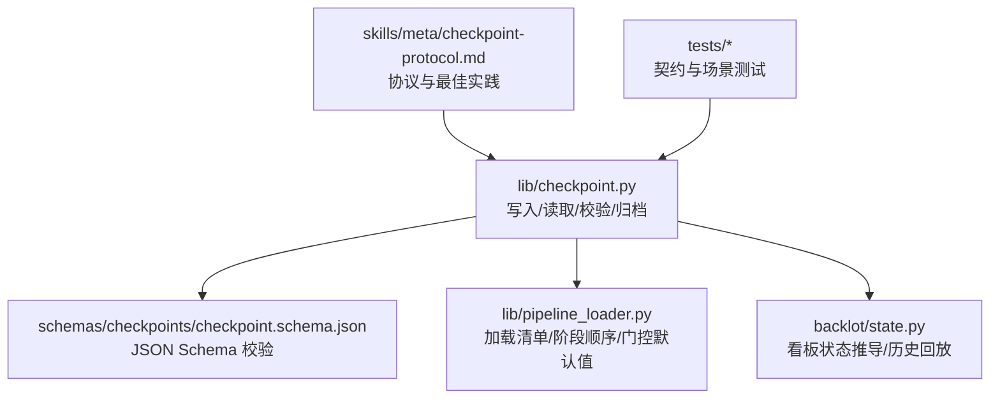
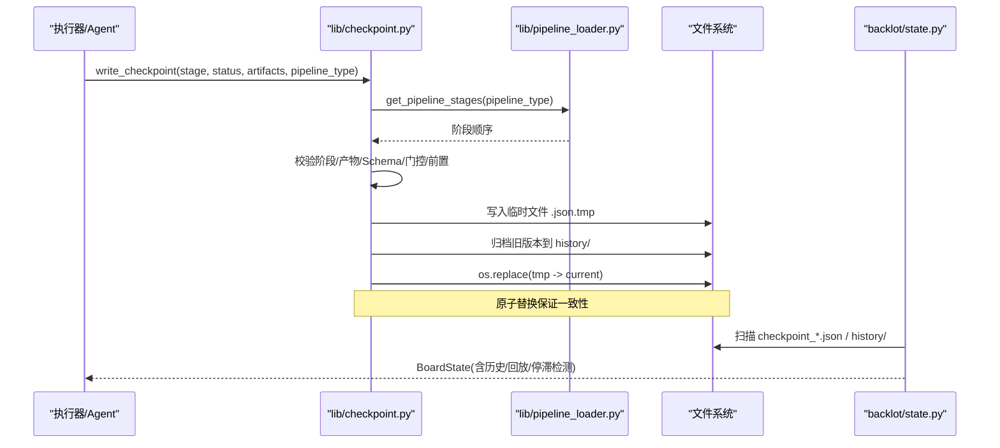
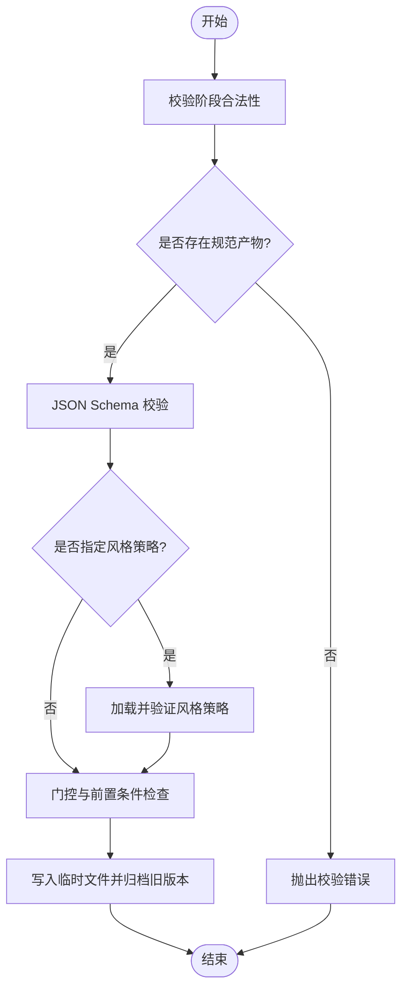
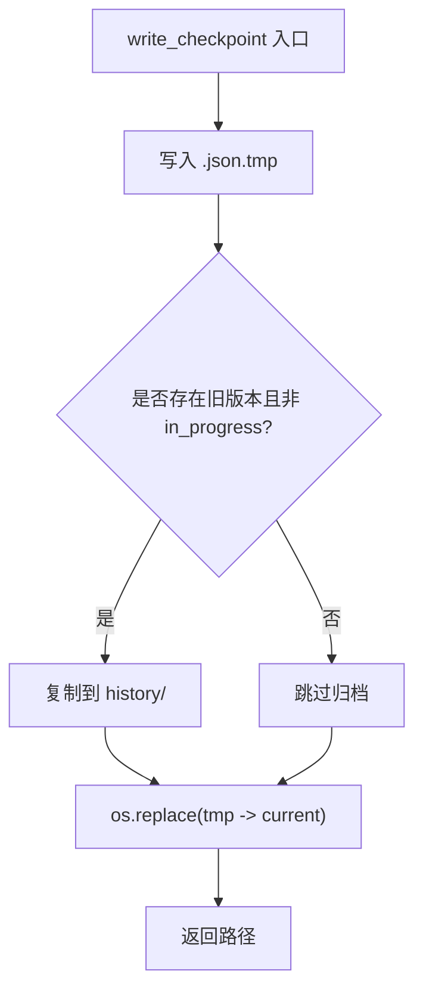
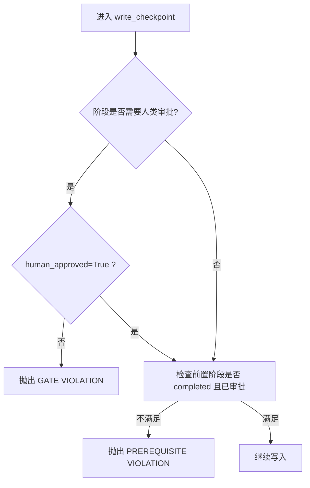
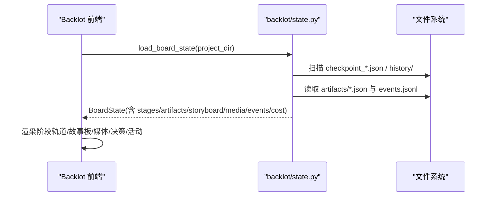
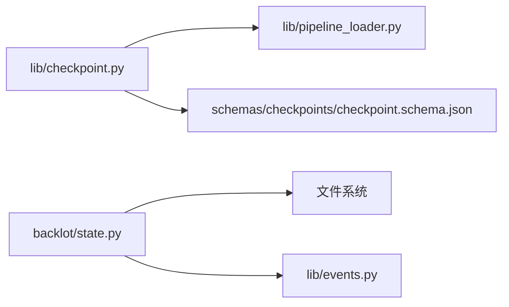

# 检查点系统

<cite>
**本文引用的文件**
- [lib/checkpoint.py](file://lib/checkpoint.py)
- [schemas/checkpoints/checkpoint.schema.json](file://schemas/checkpoints/checkpoint.schema.json)
- [lib/pipeline_loader.py](file://lib/pipeline_loader.py)
- [backlot/state.py](file://backlot/state.py)
- [skills/meta/checkpoint-protocol.md](file://skills/meta/checkpoint-protocol.md)
- [tests/contracts/test_phase0_contracts.py](file://tests/contracts/test_phase0_contracts.py)
- [tests/backlot/test_gate_scenarios.py](file://tests/backlot/test_gate_scenarios.py)
- [tests/lib/test_checkpoint_prerequisites.py](file://tests/lib/test_checkpoint_prerequisites.py)
</cite>

## 目录
1. [简介](#简介)
2. [项目结构](#项目结构)
3. [核心组件](#核心组件)
4. [架构总览](#架构总览)
5. [详细组件分析](#详细组件分析)
6. [依赖关系分析](#依赖关系分析)
7. [性能与一致性](#性能与一致性)
8. [故障恢复与数据迁移](#故障恢复与数据迁移)
9. [API 接口与使用示例](#api-接口与使用示例)
10. [结论](#结论)

## 简介
本技术文档系统性阐述 OpenMontage 的检查点系统，覆盖状态持久化的设计模式、数据结构、存储策略、版本管理、并发与一致性保障、压缩加密备份建议、故障恢复与数据迁移，以及与管道执行（Backlot 看板）的集成方式。重点说明如何在关键步骤进行状态快照，确保长任务可中断恢复、人类审批门控可审计、以及跨阶段的前置条件校验。

## 项目结构
检查点系统由以下关键部分组成：
- 检查点读写与校验：lib/checkpoint.py
- 检查点 JSON Schema：schemas/checkpoints/checkpoint.schema.json
- 管道清单加载与阶段顺序：lib/pipeline_loader.py
- 看板状态推导与可视化：backlot/state.py
- 检查点协议与最佳实践：skills/meta/checkpoint-protocol.md
- 测试用例验证契约行为：tests/*

**图示来源**
- [lib/checkpoint.py:1-634](file://lib/checkpoint.py#L1-L634)
- [schemas/checkpoints/checkpoint.schema.json:1-47](file://schemas/checkpoints/checkpoint.schema.json#L1-L47)
- [lib/pipeline_loader.py:1-241](file://lib/pipeline_loader.py#L1-L241)
- [backlot/state.py:1-716](file://backlot/state.py#L1-L716)
- [skills/meta/checkpoint-protocol.md:1-247](file://skills/meta/checkpoint-protocol.md#L1-L247)

**章节来源**
- [lib/checkpoint.py:1-634](file://lib/checkpoint.py#L1-L634)
- [schemas/checkpoints/checkpoint.schema.json:1-47](file://schemas/checkpoints/checkpoint.schema.json#L1-L47)
- [lib/pipeline_loader.py:1-241](file://lib/pipeline_loader.py#L1-L241)
- [backlot/state.py:1-716](file://backlot/state.py#L1-L716)
- [skills/meta/checkpoint-protocol.md:1-247](file://skills/meta/checkpoint-protocol.md#L1-L247)

## 核心组件
- 检查点数据结构与校验
  - 通过 JSON Schema 定义必填字段与枚举约束，包含 version、project_id、pipeline_type、stage、status、timestamp、artifacts 等。
  - 运行时额外校验：阶段合法性、规范产物存在性、补充产物校验、风格策略有效性。
- 存储策略与版本管理
  - 每个阶段一个 checkpoint_<stage>.json；被覆盖前归档到 history/ 目录，保留完整运行记录。
  - 临时文件原子替换，避免部分写入导致损坏。
- 门控与前置条件
  - 基于管道清单 human_approval_default 强制人类审批门控；未满足前置完成或审批将拒绝推进。
- 看板集成
  - Backlot 从磁盘只读推导 BoardState，支持历史回放、停滞检测、媒体发现与故事板组装。

**章节来源**
- [lib/checkpoint.py:124-191](file://lib/checkpoint.py#L124-L191)
- [lib/checkpoint.py:349-386](file://lib/checkpoint.py#L349-L386)
- [lib/checkpoint.py:422-564](file://lib/checkpoint.py#L422-L564)
- [backlot/state.py:118-224](file://backlot/state.py#L118-L224)
- [backlot/state.py:588-658](file://backlot/state.py#L588-L658)

## 架构总览
检查点系统围绕“写时校验 + 原子落盘 + 历史归档 + 看板只读”的模式构建。管道清单驱动阶段顺序与门控策略；看板负责呈现与回放。

**图示来源**
- [lib/checkpoint.py:422-564](file://lib/checkpoint.py#L422-L564)
- [lib/pipeline_loader.py:125-182](file://lib/pipeline_loader.py#L125-L182)
- [backlot/state.py:118-224](file://backlot/state.py#L118-L224)
- [backlot/state.py:588-658](file://backlot/state.py#L588-L658)

## 详细组件分析

### 检查点数据结构与校验
- 数据结构
  - 必需字段：version、project_id、pipeline_type、stage、status、timestamp、artifacts。
  - 可选字段：style_playbook、checkpoint_policy、human_approval_required、human_approved、review、cost_snapshot、error、metadata。
- 校验流程
  - 阶段合法性：依据管道清单或已知阶段集合。
  - 规范产物：如 research 对应 research_brief，缺失则报错。
  - 补充产物：source_media_review、final_review、video_analysis_brief 按契约校验。
  - Schema 校验：使用 schemas/checkpoints/checkpoint.schema.json。
  - 风格策略：若指定 style_playbook，需能加载成功。

**图示来源**
- [lib/checkpoint.py:124-191](file://lib/checkpoint.py#L124-L191)
- [schemas/checkpoints/checkpoint.schema.json:1-47](file://schemas/checkpoints/checkpoint.schema.json#L1-L47)

**章节来源**
- [lib/checkpoint.py:124-191](file://lib/checkpoint.py#L124-L191)
- [schemas/checkpoints/checkpoint.schema.json:1-47](file://schemas/checkpoints/checkpoint.schema.json#L1-L47)

### 存储策略与版本管理
- 文件布局
  - 项目根：project.json（标记文件）。
  - 阶段检查点：checkpoint_<stage>.json。
  - 历史归档：history/checkpoint_<stage>_<timestamp>.json。
- 原子写入
  - 先写入 .json.tmp，再 os.replace 原子替换，避免部分写入。
- 归档策略
  - 仅对非 in_progress 的已存在检查点进行归档，保留版本与门控审计轨迹。
  - 归档失败为 best-effort，不阻塞主流程。

**图示来源**
- [lib/checkpoint.py:349-386](file://lib/checkpoint.py#L349-L386)
- [lib/checkpoint.py:549-564](file://lib/checkpoint.py#L549-L564)

**章节来源**
- [lib/checkpoint.py:349-386](file://lib/checkpoint.py#L349-L386)
- [lib/checkpoint.py:549-564](file://lib/checkpoint.py#L549-L564)

### 门控与前置条件
- 门控（人类审批）
  - 基于管道清单 human_approval_default；若为真，则必须 human_approved=True 才能写入 completed。
  - 否则写入 completed 会触发 GATE VIOLATION。
- 前置条件
  - 仅允许在全部前置阶段 completed 且必要时已审批的情况下推进当前阶段。
  - 对 in_progress 和失败心跳保持可写，便于观察与恢复。

**图示来源**
- [lib/checkpoint.py:251-346](file://lib/checkpoint.py#L251-L346)
- [lib/checkpoint.py:467-502](file://lib/checkpoint.py#L467-L502)

**章节来源**
- [lib/checkpoint.py:251-346](file://lib/checkpoint.py#L251-L346)
- [lib/checkpoint.py:467-502](file://lib/checkpoint.py#L467-L502)

### 看板集成与状态回放
- 状态推导
  - 收集当前检查点与历史版本，构建阶段轨道（rail），标注门控、产出物、时间戳、评审、成本快照等。
  - 故事板组装：scene_plan × script × asset_manifest，结合事件流显示生成中状态。
  - 媒体发现：renders、snapshots、music 等扫描。
- 停滞检测
  - 若 in_progress 阶段长时间无活动，标记 stalled 并显示等待时长。
- 回放能力
  - 历史条目按时间排序，支持按时间点回溯状态。

**图示来源**
- [backlot/state.py:118-224](file://backlot/state.py#L118-L224)
- [backlot/state.py:246-266](file://backlot/state.py#L246-L266)
- [backlot/state.py:403-495](file://backlot/state.py#L403-L495)
- [backlot/state.py:502-534](file://backlot/state.py#L502-L534)
- [backlot/state.py:588-658](file://backlot/state.py#L588-L658)

**章节来源**
- [backlot/state.py:118-224](file://backlot/state.py#L118-L224)
- [backlot/state.py:588-658](file://backlot/state.py#L588-L658)

### 管道清单与阶段顺序
- 清单加载与缓存
  - 通过 lib/pipeline_loader.py 加载 YAML 清单并校验 Schema，结果缓存以提升性能。
- 阶段顺序与子阶段
  - get_stage_order 提取主阶段顺序；可选暴露子阶段用于演示/预览。
- 门控默认值
  - get_stage_human_approval_default 提供单一点读取 human_approval_default，供门控与看板一致使用。

**章节来源**
- [lib/pipeline_loader.py:27-70](file://lib/pipeline_loader.py#L27-L70)
- [lib/pipeline_loader.py:125-182](file://lib/pipeline_loader.py#L125-L182)

## 依赖关系分析
- 模块耦合
  - checkpoint.py 依赖 pipeline_loader.py 获取阶段顺序与门控默认值。
  - backlot/state.py 依赖 checkpoint 文件与 artifacts/events 进行只读推导。
- 外部依赖
  - jsonschema 用于 Schema 校验。
  - yaml 用于清单解析。
- 潜在循环
  - 无直接循环依赖；各模块职责清晰。

**图示来源**
- [lib/checkpoint.py:1-18](file://lib/checkpoint.py#L1-L18)
- [lib/pipeline_loader.py:1-21](file://lib/pipeline_loader.py#L1-L21)
- [backlot/state.py:1-25](file://backlot/state.py#L1-L25)

**章节来源**
- [lib/checkpoint.py:1-18](file://lib/checkpoint.py#L1-L18)
- [lib/pipeline_loader.py:1-21](file://lib/pipeline_loader.py#L1-L21)
- [backlot/state.py:1-25](file://backlot/state.py#L1-L25)

## 性能与一致性
- 性能优化
  - 清单加载与 Schema 使用 lru_cache 缓存，减少重复解析与校验开销。
  - 看板状态推导中对管线元数据进行缓存，降低高频调用成本。
  - 媒体扫描限制范围，避免全量遍历。
- 一致性保障
  - 原子写入：临时文件 + os.replace，避免部分写入。
  - 归档策略：仅归档非 in_progress 的版本，保留审计轨迹。
  - 门控与前置条件：严格校验，防止越级推进。
- 并发访问控制
  - 当前实现未引入显式锁；多进程并发写入同一检查点可能产生竞争。建议在调用层加锁或使用分布式锁（如 filelock）保护临界区。
  - 看板为只读，不会引发写入冲突。

[本节提供通用指导，无需特定文件引用]

## 故障恢复与数据迁移
- 故障恢复
  - 每阶段开始时写入 in_progress 检查点，支持断点续传。
  - 长任务中定期更新 partial_progress，以便恢复时跳过已完成子任务。
  - 看板显示停滞检测，帮助定位卡住的阶段。
- 数据迁移
  - 历史归档保留所有版本，便于回滚与审计。
  - 若升级 Schema，需在写入前兼容旧格式或提供迁移脚本。
- 备份策略建议
  - 定期备份 projects/<id>/ 目录，包括 checkpoint_*.json、history/、artifacts/、renders/、events.jsonl。
  - 可使用对象存储（S3/OSS）或增量同步工具进行异地备份。
- 压缩与加密建议
  - 压缩：对历史归档进行 gzip/zstd 压缩以减少空间占用。
  - 加密：对敏感信息（如 cost_snapshot、review）进行字段级加密或整包加密（如 AES-GCM），密钥由外部密钥管理服务托管。

[本节提供通用指导，无需特定文件引用]

## API 接口与使用示例
- 初始化项目
  - init_project(project_id, title, pipeline_type, pipeline_dir=None, style_playbook=None)
  - 创建标准目录结构与 project.json 标记文件。
- 写入检查点
  - write_checkpoint(pipeline_dir, project_id, stage, status, artifacts, pipeline_type=None, style_playbook=None, checkpoint_policy="guided", human_approval_required=False, human_approved=False, review=None, cost_snapshot=None, error=None, metadata=None)
  - 自动校验、门控、前置条件、归档与原子写入。
- 读取检查点
  - read_checkpoint(pipeline_dir, project_id, stage)
  - get_latest_checkpoint(pipeline_dir, project_id)
  - get_completed_stages(pipeline_dir, project_id, pipeline_type=None)
  - get_next_stage(pipeline_dir, project_id, pipeline_type=None)
- 使用示例（参考协议）
  - 进入阶段先写 in_progress，完成后写 completed 或 awaiting_human。
  - 人类审批通过后重写 completed 并设置 human_approved=True。
  - 使用 get_next_stage 决定下一步。

**章节来源**
- [lib/checkpoint.py:198-248](file://lib/checkpoint.py#L198-L248)
- [lib/checkpoint.py:422-564](file://lib/checkpoint.py#L422-L564)
- [lib/checkpoint.py:567-634](file://lib/checkpoint.py#L567-L634)
- [skills/meta/checkpoint-protocol.md:62-100](file://skills/meta/checkpoint-protocol.md#L62-L100)
- [skills/meta/checkpoint-protocol.md:169-201](file://skills/meta/checkpoint-protocol.md#L169-L201)

## 结论
OpenMontage 的检查点系统以“写时校验 + 原子落盘 + 历史归档 + 看板只读”为核心，结合管道清单驱动的阶段顺序与门控策略，实现了可靠的管道状态持久化与人类审批审计。通过 in_progress 检查点与 partial_progress 机制，支持长任务断点续传；看板提供丰富的可视化与回放能力。未来可在并发控制、压缩加密与备份方面进一步增强，以满足更大规模与更高安全要求的生产环境。