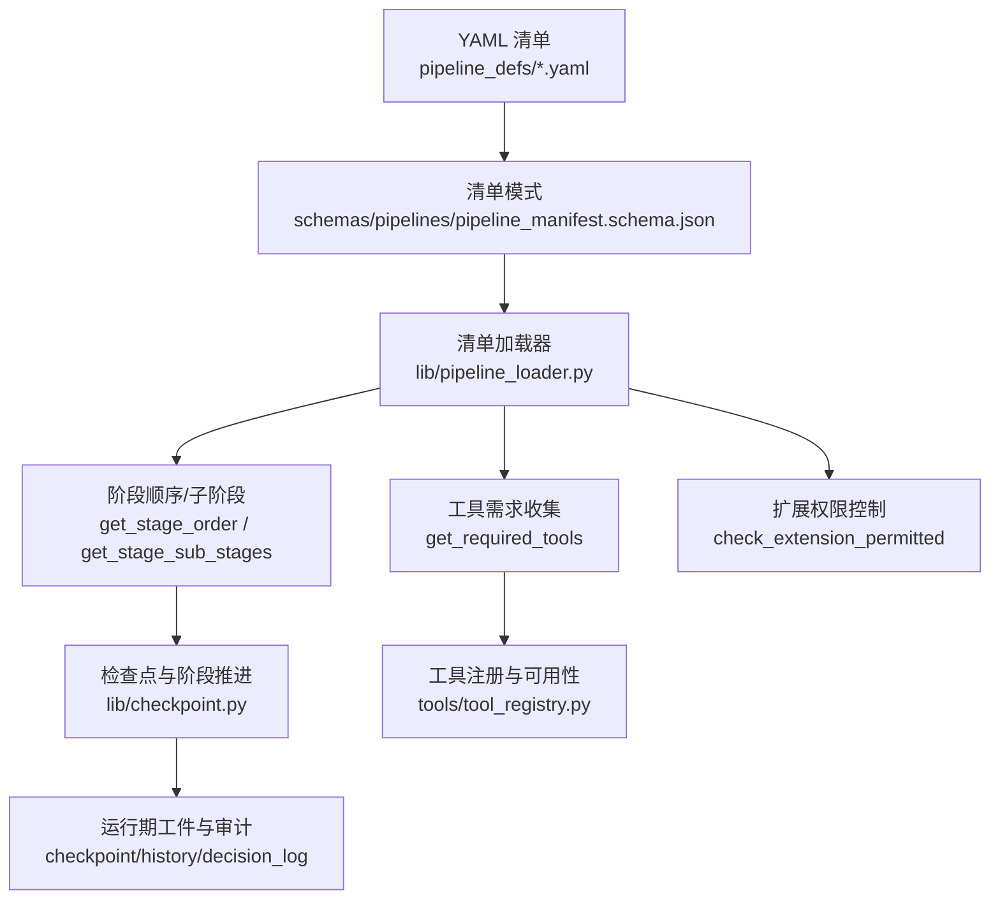
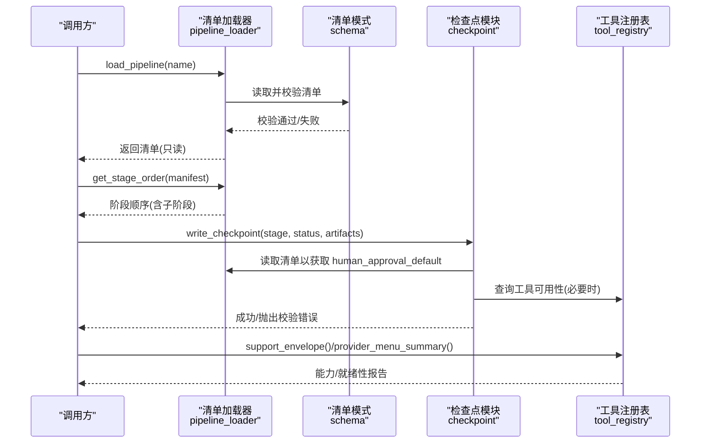
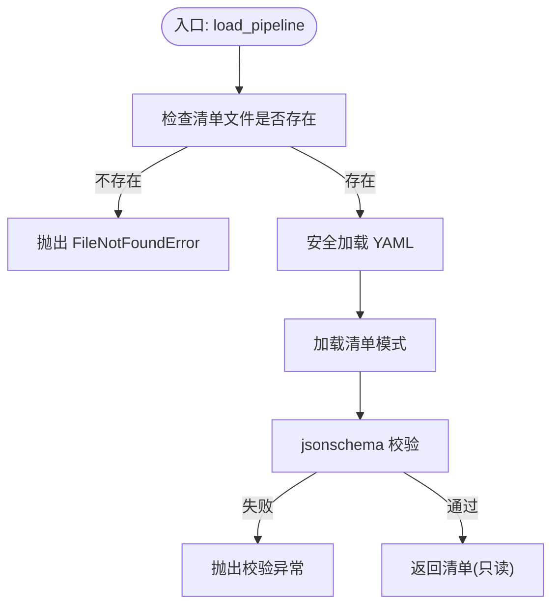
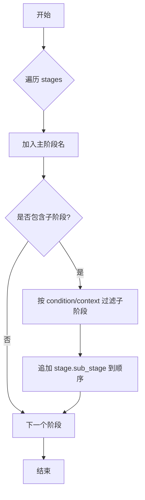
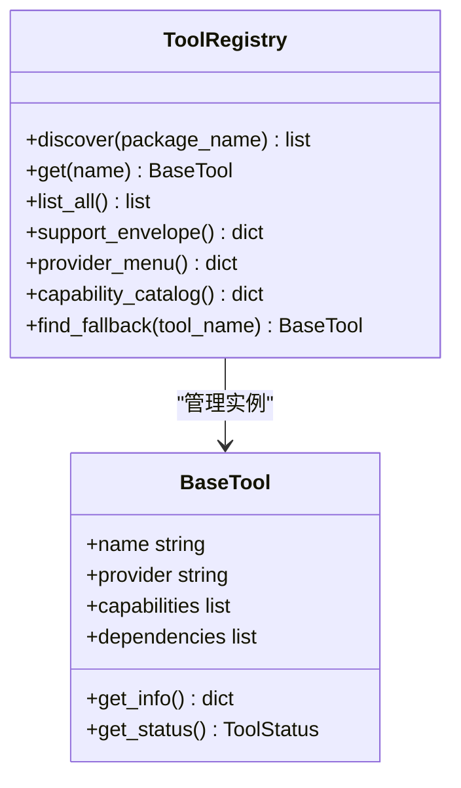
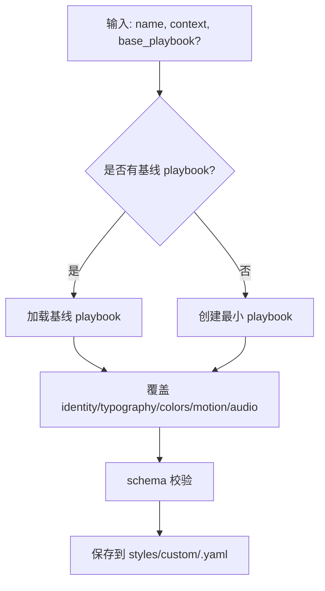
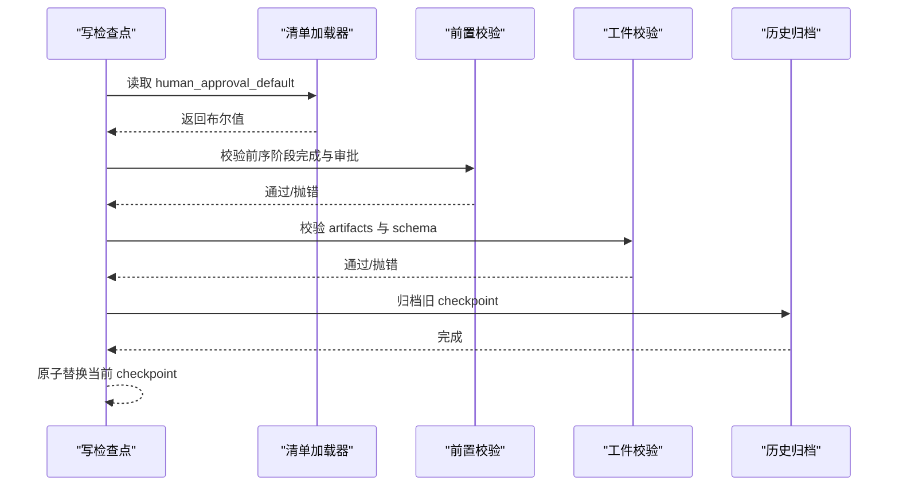
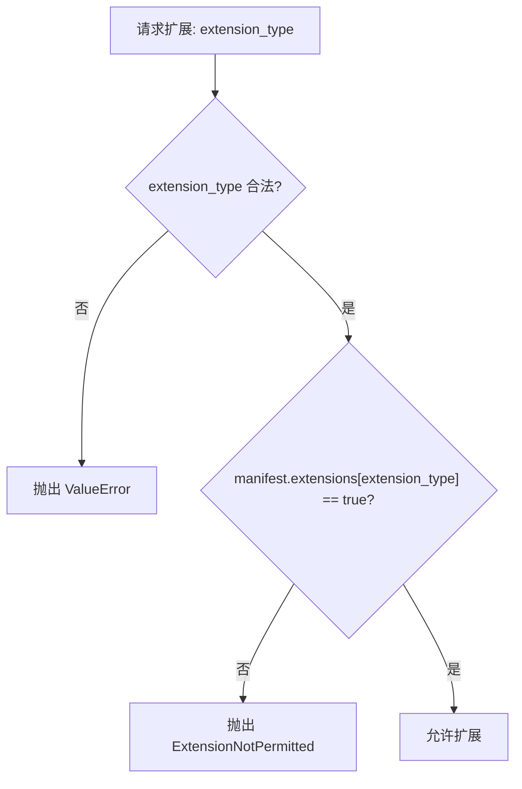
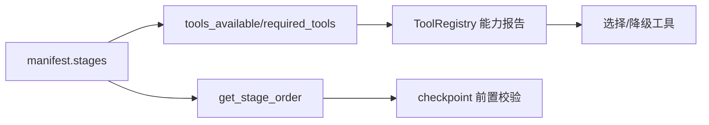

# 管道加载器

<cite>
**本文引用的文件**
- [lib/pipeline_loader.py](file://lib/pipeline_loader.py)
- [schemas/pipelines/pipeline_manifest.schema.json](file://schemas/pipelines/pipeline_manifest.schema.json)
- [pipeline_defs/animation.yaml](file://pipeline_defs/animation.yaml)
- [lib/checkpoint.py](file://lib/checkpoint.py)
- [tools/tool_registry.py](file://tools/tool_registry.py)
- [tools/video/hyperframes_compose.py](file://tools/video/hyperframes_compose.py)
- [lib/playbook_generator.py](file://lib/playbook_generator.py)
</cite>

## 目录
1. [简介](#简介)
2. [项目结构](#项目结构)
3. [核心组件](#核心组件)
4. [架构总览](#架构总览)
5. [详细组件分析](#详细组件分析)
6. [依赖分析](#依赖分析)
7. [性能考虑](#性能考虑)
8. [故障排查指南](#故障排查指南)
9. [结论](#结论)
10. [附录](#附录)

## 简介
本技术文档聚焦于“管道加载器”系统，围绕 YAML 管道清单的解析、校验、依赖分析与执行计划生成展开。重点说明：
- 清单语法与结构验证（基于 JSON Schema）
- 元数据处理（版本、稳定性、兼容样式表、技能依赖、编排配置）
- 阶段图构建与执行顺序确定（含子阶段与条件激活）
- 工具可用性探测与能力扩展权限控制
- 模板系统与继承机制（样式表/Playbook 的生成与继承）
- 错误处理、日志记录与性能监控最佳实践
- load_pipeline 函数的实现细节（缓存、条件评估、扩展权限）

## 项目结构
管道加载器由以下关键部分组成：
- 清单定义：位于 pipeline_defs/*.yaml，声明管道名称、版本、阶段、工具、策略等
- 清单模式：schemas/pipelines/pipeline_manifest.schema.json，用于严格校验清单结构
- 加载器：lib/pipeline_loader.py，负责读取、校验、查询清单信息
- 检查点与阶段推进：lib/checkpoint.py，将清单中的阶段顺序与审批策略落地为运行时约束
- 工具注册与可用性：tools/tool_registry.py，动态发现并报告工具状态
- 样式/模板：lib/playbook_generator.py，支持从上下文生成或继承样式表

**图示来源**
- [lib/pipeline_loader.py:49-70](file://lib/pipeline_loader.py#L49-L70)
- [schemas/pipelines/pipeline_manifest.schema.json:1-197](file://schemas/pipelines/pipeline_manifest.schema.json#L1-L197)
- [lib/checkpoint.py:51-75](file://lib/checkpoint.py#L51-L75)
- [tools/tool_registry.py:118-134](file://tools/tool_registry.py#L118-L134)

**章节来源**
- [lib/pipeline_loader.py:1-241](file://lib/pipeline_loader.py#L1-L241)
- [schemas/pipelines/pipeline_manifest.schema.json:1-197](file://schemas/pipelines/pipeline_manifest.schema.json#L1-L197)
- [lib/checkpoint.py:1-634](file://lib/checkpoint.py#L1-L634)
- [tools/tool_registry.py:1-493](file://tools/tool_registry.py#L1-L493)

## 核心组件
- 清单加载与校验：load_pipeline(name, defs_dir) 读取 YAML，按 schema 校验并返回只读字典；提供列表与缓存接口
- 阶段与子阶段：get_stage_order 输出主阶段顺序；get_stage_sub_stages 支持按条件过滤子阶段
- 工具需求：get_required_tools 汇总各阶段的必需/可选/可用工具集合
- 扩展权限：check_extension_permitted 强制白名单式的能力扩展开关
- 检查点与阶段推进：write_checkpoint 在写入时进行前置阶段校验、人类审批门控、工件校验与归档
- 工具注册：ToolRegistry 动态发现工具、聚合能力目录、生成 provider 菜单与就绪性报告
- 模板/样式：playbook_generator 支持从上下文生成或继承样式表，确保产物符合 schema

**章节来源**
- [lib/pipeline_loader.py:27-70](file://lib/pipeline_loader.py#L27-L70)
- [lib/pipeline_loader.py:98-162](file://lib/pipeline_loader.py#L98-L162)
- [lib/pipeline_loader.py:201-241](file://lib/pipeline_loader.py#L201-L241)
- [lib/checkpoint.py:422-564](file://lib/checkpoint.py#L422-L564)
- [tools/tool_registry.py:55-134](file://tools/tool_registry.py#L55-L134)
- [lib/playbook_generator.py:52-119](file://lib/playbook_generator.py#L52-L119)

## 架构总览
下图展示了从清单到执行计划的完整链路：清单被加载并校验，随后提取阶段顺序与工具需求；检查点模块依据清单策略强制执行前置阶段与人类审批；工具注册模块提供运行时能力视图，支撑选择与降级。

**图示来源**
- [lib/pipeline_loader.py:49-70](file://lib/pipeline_loader.py#L49-L70)
- [lib/checkpoint.py:251-281](file://lib/checkpoint.py#L251-L281)
- [tools/tool_registry.py:198-230](file://tools/tool_registry.py#L198-L230)

## 详细组件分析

### 清单加载与校验（load_pipeline）
- 路径解析与存在性检查：根据 name 定位 pipeline_defs/*.yaml
- 安全加载：使用安全加载器解析 YAML
- 模式校验：加载 schemas/pipelines/pipeline_manifest.schema.json 并进行 jsonschema 校验
- 缓存：_load_manifest_schema 与 _load_pipeline_cached 使用 lru_cache 减少重复 IO 与校验开销
- 只读访问：load_pipeline_readonly 暴露缓存后的清单，供热路径（如 checkpoint 门控）复用

**图示来源**
- [lib/pipeline_loader.py:49-70](file://lib/pipeline_loader.py#L49-L70)
- [lib/pipeline_loader.py:27-36](file://lib/pipeline_loader.py#L27-L36)

**章节来源**
- [lib/pipeline_loader.py:27-70](file://lib/pipeline_loader.py#L27-L70)

### 阶段图构建与执行顺序
- 主阶段顺序：get_stage_order 遍历 stages 数组，按声明顺序输出
- 子阶段与条件：get_stage_sub_stages 支持 include_inactive=False 并按 condition 字段结合 context 过滤
- 子阶段命名：当 include_sub_stages=True 时，子阶段以 stage.sub_stage 形式追加到顺序中
- 典型用法：Backlot 与 orchestrator 使用该顺序决定下一步阶段与展示轨道

**图示来源**
- [lib/pipeline_loader.py:125-149](file://lib/pipeline_loader.py#L125-L149)
- [lib/pipeline_loader.py:98-122](file://lib/pipeline_loader.py#L98-L122)

**章节来源**
- [lib/pipeline_loader.py:98-149](file://lib/pipeline_loader.py#L98-L149)

### 工具需求与可用性验证
- 需求收集：get_required_tools 汇总 preferred/fallback/tools_available 以及 reference_input.analysis_tools
- 注册与发现：ToolRegistry.discover 自动扫描 tools 包，注册 BaseTool 子类
- 能力报告：support_envelope/provider_menu/capability_catalog 提供工具能力与就绪性视图
- 运行时探针：例如 hyperframes_compose 对 npm/npx/CLI 的可执行性进行探测，避免误报

**图示来源**
- [tools/tool_registry.py:55-134](file://tools/tool_registry.py#L55-L134)
- [tools/tool_registry.py:198-230](file://tools/tool_registry.py#L198-L230)
- [tools/video/hyperframes_compose.py:288-421](file://tools/video/hyperframes_compose.py#L288-L421)

**章节来源**
- [lib/pipeline_loader.py:152-162](file://lib/pipeline_loader.py#L152-L162)
- [tools/tool_registry.py:118-134](file://tools/tool_registry.py#L118-L134)
- [tools/tool_registry.py:198-230](file://tools/tool_registry.py#L198-L230)
- [tools/video/hyperframes_compose.py:288-421](file://tools/video/hyperframes_compose.py#L288-L421)

### 模板系统与继承机制（Playbook）
- 生成与继承：generate_playbook 可从现有 playbook 继承并覆盖 identity/typography/color/motion/audio 等字段
- 最小模板：_create_minimal_playbook 根据 mood/tone 生成默认视觉与动效参数
- 保存与校验：save_playbook 将生成的 playbook 写入 styles/custom，并通过 schema 校验
- 用途：与管道 manifest 的 compatible_playbooks 配合，确保风格一致性与可组合性

**图示来源**
- [lib/playbook_generator.py:52-119](file://lib/playbook_generator.py#L52-L119)
- [lib/playbook_generator.py:122-197](file://lib/playbook_generator.py#L122-L197)
- [lib/playbook_generator.py:200-226](file://lib/playbook_generator.py#L200-L226)

**章节来源**
- [lib/playbook_generator.py:52-226](file://lib/playbook_generator.py#L52-L226)

### 检查点与阶段推进（Gate Enforcement）
- 前置阶段校验：_enforce_stage_prerequisites 要求所有前序阶段已完成且必要的人类审批已通过
- 人类审批门控：_stage_requires_approval 从清单读取 human_approval_default，并在 write_checkpoint 时强制 gate
- 工件校验：validate_artifact 与 CANONICAL_STAGE_ARTIFACTS 保证每个阶段产出符合契约
- 历史归档：_archive_superseded_checkpoint 将旧版 checkpoint 归档至 history，便于审计与回放

**图示来源**
- [lib/checkpoint.py:251-281](file://lib/checkpoint.py#L251-L281)
- [lib/checkpoint.py:284-346](file://lib/checkpoint.py#L284-L346)
- [lib/checkpoint.py:349-386](file://lib/checkpoint.py#L349-L386)
- [lib/checkpoint.py:422-564](file://lib/checkpoint.py#L422-L564)

**章节来源**
- [lib/checkpoint.py:251-564](file://lib/checkpoint.py#L251-L564)

### 扩展权限控制
- 白名单类型：custom_scripts、custom_playbooks、custom_skills、custom_tools
- 强制检查：check_extension_permitted 若未开启对应开关则抛出 ExtensionNotPermitted
- 默认策略：get_permitted_extensions 提供默认值，manifest 可覆盖

**图示来源**
- [lib/pipeline_loader.py:201-241](file://lib/pipeline_loader.py#L201-L241)

**章节来源**
- [lib/pipeline_loader.py:201-241](file://lib/pipeline_loader.py#L201-L241)

### 参考视频输入与子阶段条件
- 参考输入配置：reference_input.supported/analysis_depth/analysis_tools
- 子阶段条件：sub_stages.condition 与 context 匹配决定是否激活
- 示例：animation.yaml 启用 reference_input 并在 proposal.sample 中使用 video_analysis_brief_exists 作为条件

**章节来源**
- [pipeline_defs/animation.yaml:13-28](file://pipeline_defs/animation.yaml#L13-L28)
- [pipeline_defs/animation.yaml:110-118](file://pipeline_defs/animation.yaml#L110-L118)
- [lib/pipeline_loader.py:88-95](file://lib/pipeline_loader.py#L88-L95)
- [lib/pipeline_loader.py:98-122](file://lib/pipeline_loader.py#L98-L122)

## 依赖分析
- 清单到阶段：manifest.stages 决定阶段顺序与工件契约
- 阶段到工具：stages.tools_available/required_tools/optional_tools 驱动工具选择与降级
- 工具到运行时：ToolRegistry 动态发现并报告可用性；hyperframes_compose 对 npm/npx/CLI 做运行时探测
- 检查点到清单：checkpoint 模块读取 human_approval_default 与阶段顺序，确保流程合规

**图示来源**
- [lib/pipeline_loader.py:125-162](file://lib/pipeline_loader.py#L125-L162)
- [tools/tool_registry.py:198-230](file://tools/tool_registry.py#L198-L230)
- [lib/checkpoint.py:284-346](file://lib/checkpoint.py#L284-L346)

**章节来源**
- [lib/pipeline_loader.py:125-162](file://lib/pipeline_loader.py#L125-L162)
- [tools/tool_registry.py:198-230](file://tools/tool_registry.py#L198-L230)
- [lib/checkpoint.py:284-346](file://lib/checkpoint.py#L284-L346)

## 性能考虑
- 清单模式缓存：_load_manifest_schema 使用 lru_cache(maxsize=1)，避免重复 IO
- 清单结果缓存：_load_pipeline_cached 使用 lru_cache(maxsize=64)，热路径（gate checks）复用
- 原子写入：write_checkpoint 先写临时文件再替换，防止部分写入导致损坏
- 历史归档：仅归档非 in_progress 的检查点，避免频繁 I/O 干扰
- 工具探测缓存：hyperframes_compose 对 npm/npx/CLI 探测结果进行进程内缓存，降低重复开销

**章节来源**
- [lib/pipeline_loader.py:27-36](file://lib/pipeline_loader.py#L27-L36)
- [lib/checkpoint.py:549-564](file://lib/checkpoint.py#L549-L564)
- [lib/checkpoint.py:349-386](file://lib/checkpoint.py#L349-L386)
- [tools/video/hyperframes_compose.py:288-421](file://tools/video/hyperframes_compose.py#L288-L421)

## 故障排查指南
- 清单未找到：FileNotFoundError，确认 name 与 defs_dir 正确
- 清单校验失败：jsonschema.ValidationError，检查字段类型、枚举值与必填项
- 阶段非法：CheckpointValidationError，确认 stage 属于该 pipeline 的有效阶段
- 前置阶段未完成：PREREQUISITE VIOLATION，补齐缺失的前序阶段
- 人类审批门控：GATE VIOLATION，需先写 awaiting_human，用户批准后再写 completed
- 工件校验失败：artifact schema 不匹配，修正工件结构
- 工具不可用：ToolRegistry 报告 unavailable，检查依赖与环境变量

**章节来源**
- [lib/pipeline_loader.py:49-70](file://lib/pipeline_loader.py#L49-L70)
- [lib/checkpoint.py:160-191](file://lib/checkpoint.py#L160-L191)
- [lib/checkpoint.py:284-346](file://lib/checkpoint.py#L284-L346)
- [lib/checkpoint.py:422-564](file://lib/checkpoint.py#L422-L564)
- [tools/tool_registry.py:198-230](file://tools/tool_registry.py#L198-L230)

## 结论
管道加载器通过严格的清单模式校验、清晰的阶段顺序与子阶段条件、强一致的工具能力报告与检查点门控，构建了稳定可靠的执行框架。配合 Playbook 模板系统，可在保持风格一致性的同时灵活定制。推荐在生产环境中：
- 始终通过 load_pipeline_readonly 获取清单，避免重复解析
- 在编排层显式传递 pipeline_type，以获得准确的阶段顺序与门控策略
- 利用 ToolRegistry 的能力报告进行预检与降级决策
- 借助 checkpoint 的历史归档与决策日志进行审计与回放

## 附录
- 清单关键字段速览（节选）
  - name/version/description/category/stability
  - required_skills/orchestration/default_checkpoint_policy
  - stages[].name/skill/required_artifacts_in/produces/tools_*
  - stages[].sub_stages[].name/condition/tools_available
  - reference_input.supported/analysis_depth/analysis_tools
  - extensions.custom_scripts/custom_playbooks/custom_skills/custom_tools

**章节来源**
- [schemas/pipelines/pipeline_manifest.schema.json:1-197](file://schemas/pipelines/pipeline_manifest.schema.json#L1-L197)
- [pipeline_defs/animation.yaml:1-61](file://pipeline_defs/animation.yaml#L1-L61)