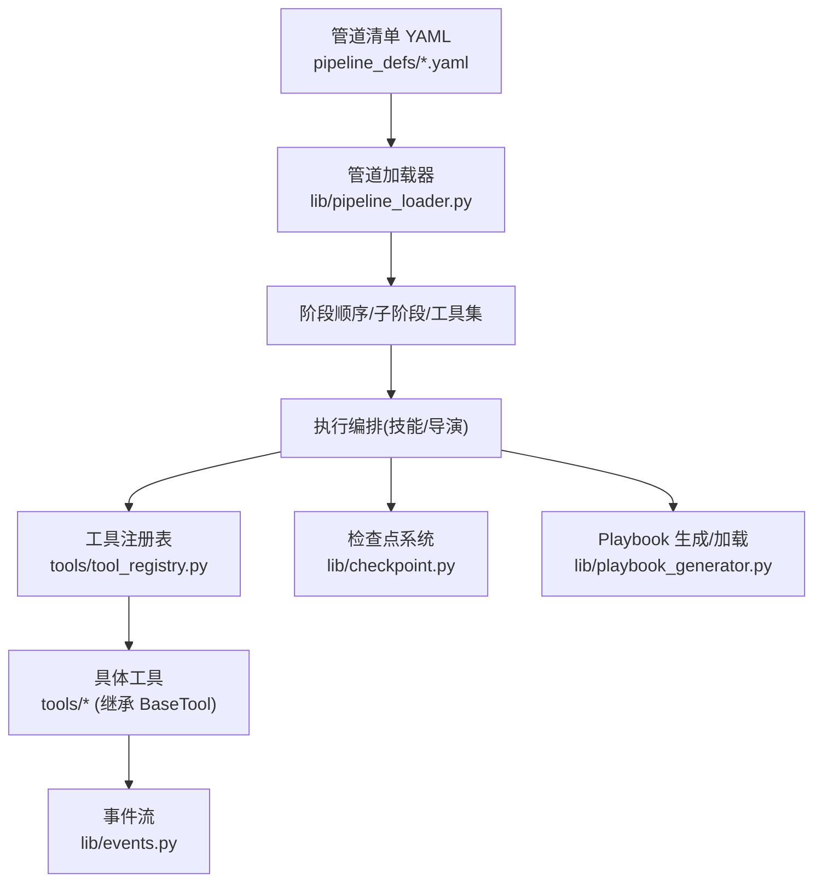
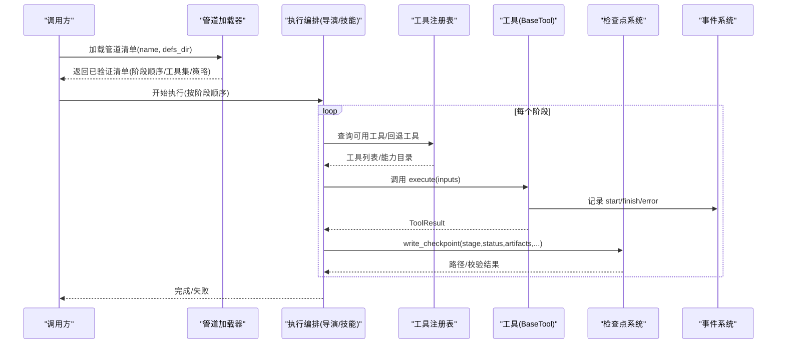
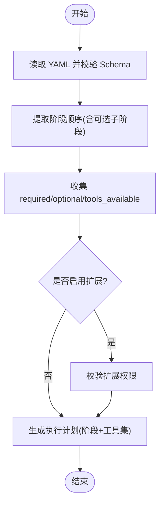
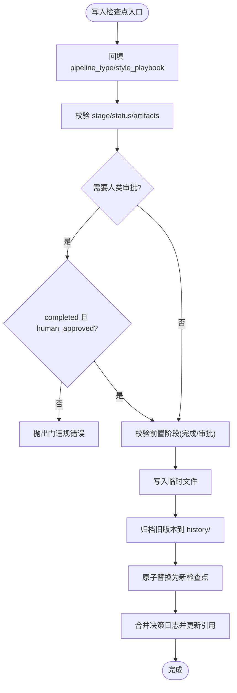
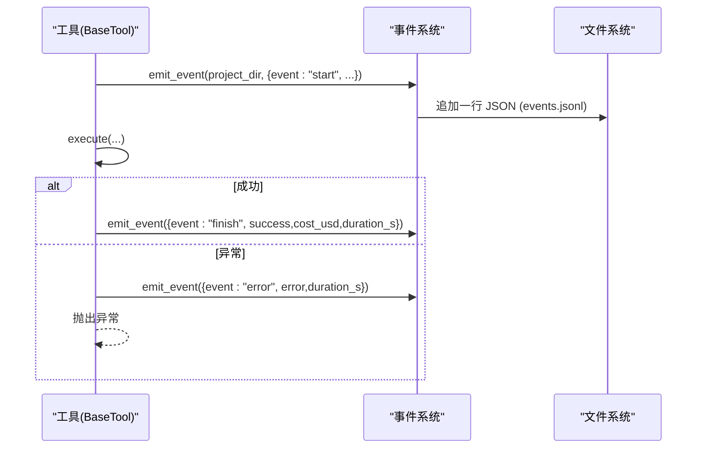
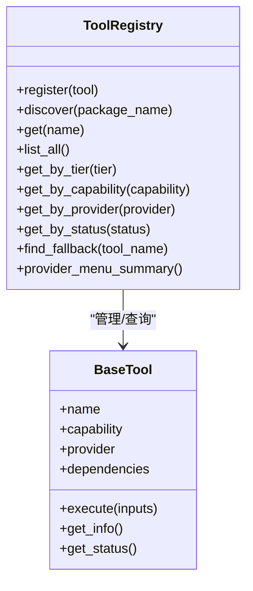
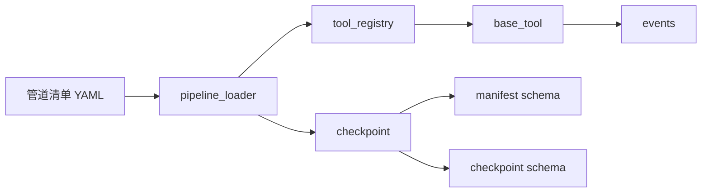

# 管道执行引擎

<cite>
**本文引用的文件**
- [lib/pipeline_loader.py](file://lib/pipeline_loader.py)
- [lib/checkpoint.py](file://lib/checkpoint.py)
- [lib/events.py](file://lib/events.py)
- [tools/tool_registry.py](file://tools/tool_registry.py)
- [tools/base_tool.py](file://tools/base_tool.py)
- [lib/playbook_generator.py](file://lib/playbook_generator.py)
- [schemas/pipelines/pipeline_manifest.schema.json](file://schemas/pipelines/pipeline_manifest.schema.json)
- [schemas/checkpoints/checkpoint.schema.json](file://schemas/checkpoints/checkpoint.schema.json)
- [pipeline_defs/cinematic.yaml](file://pipeline_defs/cinematic.yaml)
- [pipeline_defs/talking-head.yaml](file://pipeline_defs/talking-head.yaml)
</cite>

## 目录
1. [简介](#简介)
2. [项目结构](#项目结构)
3. [核心组件](#核心组件)
4. [架构总览](#架构总览)
5. [详细组件分析](#详细组件分析)
6. [依赖关系分析](#依赖关系分析)
7. [性能与资源管理](#性能与资源管理)
8. [故障排查指南](#故障排查指南)
9. [结论](#结论)
10. [附录](#附录)

## 简介
本技术文档聚焦 OpenMontage 的“管道执行引擎”，围绕以下目标展开：
- 管道加载器：YAML 解析、依赖图构建、执行计划生成
- 检查点系统：状态管理、持久化策略、恢复机制与数据一致性
- 事件驱动模型：事件发布/订阅、异步处理、错误传播
- 工具注册表：动态发现与依赖注入
- 性能优化与资源管理策略
- 调试工具与监控指标使用方法

OpenMontage 通过声明式 YAML 描述管道（阶段、产物、工具、审批策略），在运行时解析为可执行的阶段序列，并以检查点实现幂等、可恢复的执行；以事件流提供实时观测；以工具注册表完成能力发现与选择。

## 项目结构
- 管道定义位于 pipeline_defs/*.yaml，使用 schemas/pipelines/pipeline_manifest.schema.json 校验
- 执行期核心库位于 lib/：
  - pipeline_loader.py：加载并验证管道清单，提取阶段顺序、子阶段、所需工具、扩展权限等
  - checkpoint.py：检查点读写、前置条件校验、人类审批门控、归档历史
  - events.py：项目级事件追加日志 events.jsonl，用于 UI 实时活动展示
  - playbook_generator.py：样式/风格 Playbook 的动态生成与保存
- 工具层位于 tools/：
  - base_tool.py：统一工具契约、依赖检查、成本/时长估算、执行包装（自动埋点）
  - tool_registry.py：工具动态发现、能力目录、提供者菜单、回退工具查找
- 模式与约束：
  - schemas/checkpoints/checkpoint.schema.json：检查点结构约束
  - schemas/pipelines/pipeline_manifest.schema.json：管道清单结构约束

图表来源
- [lib/pipeline_loader.py:49-76](file://lib/pipeline_loader.py#L49-L76)
- [lib/checkpoint.py:422-564](file://lib/checkpoint.py#L422-L564)
- [tools/tool_registry.py:118-134](file://tools/tool_registry.py#L118-L134)
- [tools/base_tool.py:148-224](file://tools/base_tool.py#L148-L224)
- [lib/events.py:77-95](file://lib/events.py#L77-L95)
- [lib/playbook_generator.py:52-119](file://lib/playbook_generator.py#L52-L119)

章节来源
- [lib/pipeline_loader.py:49-76](file://lib/pipeline_loader.py#L49-L76)
- [schemas/pipelines/pipeline_manifest.schema.json:1-197](file://schemas/pipelines/pipeline_manifest.schema.json#L1-L197)
- [schemas/checkpoints/checkpoint.schema.json:1-47](file://schemas/checkpoints/checkpoint.schema.json#L1-L47)

## 核心组件
- 管道加载器：负责读取 YAML、按 schema 校验、提取阶段顺序、子阶段、工具集合、扩展权限、参考输入配置等
- 检查点系统：负责项目初始化、检查点写入/读取、前置阶段校验、人类审批门控、历史归档、决策日志合并
- 事件系统：基于 events.jsonl 的追加型事件日志，支持线程安全写入、容错读取、项目归属推断
- 工具注册表：扫描 tools 包树，自动发现 BaseTool 子类，提供按能力/提供者/层级/状态的查询与菜单汇总
- 基础工具基类：统一依赖检查、成本/时长估算、幂等键、命令执行封装、自动事件埋点

章节来源
- [lib/pipeline_loader.py:49-162](file://lib/pipeline_loader.py#L49-L162)
- [lib/checkpoint.py:198-564](file://lib/checkpoint.py#L198-L564)
- [lib/events.py:46-119](file://lib/events.py#L46-L119)
- [tools/tool_registry.py:55-134](file://tools/tool_registry.py#L55-L134)
- [tools/base_tool.py:63-139](file://tools/base_tool.py#L63-L139)

## 架构总览
下图展示了从 YAML 到执行、再到检查点与事件的全链路：

图表来源
- [lib/pipeline_loader.py:49-76](file://lib/pipeline_loader.py#L49-L76)
- [tools/tool_registry.py:118-134](file://tools/tool_registry.py#L118-L134)
- [tools/base_tool.py:148-224](file://tools/base_tool.py#L148-L224)
- [lib/checkpoint.py:422-564](file://lib/checkpoint.py#L422-L564)
- [lib/events.py:77-95](file://lib/events.py#L77-L95)

## 详细组件分析

### 管道加载器：YAML 解析、依赖图构建与执行计划生成
- YAML 解析与校验
  - 读取 pipeline_defs/*.yaml，使用 JSON Schema 校验清单结构
  - 缓存 schema 与清单加载结果，避免重复 IO/校验
- 阶段顺序与子阶段
  - get_stage_order：输出主阶段顺序；可选包含 sub_stages（形如 stage.sub_stage）
  - get_stage_sub_stages：根据 context 中的 condition 过滤活跃子阶段
- 工具需求收集
  - get_required_tools：聚合 stages/sub_stages/reference_input 中声明的工具
- 扩展权限控制
  - check_extension_permitted/get_permitted_extensions：限制自定义脚本/Playbook/技能/工具的启用范围
- 人类审批默认值
  - get_stage_human_approval_default：供 gate 强制逻辑读取

图表来源
- [lib/pipeline_loader.py:49-76](file://lib/pipeline_loader.py#L49-L76)
- [lib/pipeline_loader.py:98-162](file://lib/pipeline_loader.py#L98-L162)
- [lib/pipeline_loader.py:201-241](file://lib/pipeline_loader.py#L201-L241)

章节来源
- [lib/pipeline_loader.py:49-162](file://lib/pipeline_loader.py#L49-L162)
- [lib/pipeline_loader.py:201-241](file://lib/pipeline_loader.py#L201-L241)
- [schemas/pipelines/pipeline_manifest.schema.json:76-154](file://schemas/pipelines/pipeline_manifest.schema.json#L76-L154)

### 检查点系统：状态管理、持久化、恢复与一致性
- 项目初始化
  - init_project：创建标准目录结构与 project.json 标记文件，幂等合并元信息
- 检查点写入流程
  - write_checkpoint：
    - 回填 pipeline_type/style_playbook（来自 project.json）
    - 校验 stage/status/artifacts（含 schema 与阶段必需产物）
    - 人类审批门控：若 manifest 或调用方要求 human_approval，则 completed 必须附带 human_approved=True
    - 前置阶段校验：仅允许在全部前置阶段 completed 且必要时已审批后推进
    - 原子写入：先写 .tmp，再归档旧版本至 history/，最后 os.replace 替换
    - 决策日志合并：将 decision_log 合并入项目级 decision_log.json，并在相关产物中引用
- 读取与恢复
  - read_checkpoint/get_latest_checkpoint/get_completed_stages/get_next_stage：读取最新检查点、计算已完成阶段、确定下一步
- 一致性保障
  - 严格 schema 校验 + 阶段产物校验
  - 前置阶段强一致检查
  - 人类审批门控不可绕过
  - 历史归档保留审计轨迹

图表来源
- [lib/checkpoint.py:198-248](file://lib/checkpoint.py#L198-L248)
- [lib/checkpoint.py:251-347](file://lib/checkpoint.py#L251-L347)
- [lib/checkpoint.py:422-564](file://lib/checkpoint.py#L422-L564)

章节来源
- [lib/checkpoint.py:198-564](file://lib/checkpoint.py#L198-L564)
- [schemas/checkpoints/checkpoint.schema.json:1-47](file://schemas/checkpoints/checkpoint.schema.json#L1-L47)

### 事件驱动执行模型：发布/订阅、异步与错误传播
- 事件写入
  - emit_event：追加一行 JSON 到 projects/<project_id>/events.jsonl，线程锁保护写入，异常吞掉保证不中断生产
- 项目归属推断
  - infer_project_dir：从 inputs 中显式 key 或路径 hint 推断所属项目目录，仅在 projects 根下有效
- 读取与消费
  - read_events：逐行读取，容忍损坏行，支持 limit 截取
- 自动埋点
  - BaseTool.execute 被装饰器包裹，自动记录 start/finish/error，包含 cost_usd、duration_s、scene_id、depth 等

图表来源
- [tools/base_tool.py:148-224](file://tools/base_tool.py#L148-L224)
- [lib/events.py:46-119](file://lib/events.py#L46-L119)

章节来源
- [tools/base_tool.py:148-224](file://tools/base_tool.py#L148-L224)
- [lib/events.py:46-119](file://lib/events.py#L46-L119)

### 工具注册表：动态发现与依赖注入
- 动态发现
  - discover：递归导入 tools 包，跳过 base_tool/tool_registry，对每个模块扫描 BaseTool 子类并实例化注册
  - ensure_discovered：确保只发现一次
- 查询与目录
  - list_all/get_by_tier/get_by_capability/get_by_provider/get_by_status/get_available/get_unavailable
  - support_envelope/capability_catalog/provider_catalog/tier_summary/provider_menu/provider_menu_summary
- 回退工具
  - find_fallback：优先使用 fallback/fallback_tools 列表中可用的工具
- 环境加载
  - _load_dotenv：从 .env 加载环境变量，便于工具访问 API Key

图表来源
- [tools/tool_registry.py:55-134](file://tools/tool_registry.py#L55-L134)
- [tools/tool_registry.py:141-196](file://tools/tool_registry.py#L141-L196)
- [tools/tool_registry.py:198-471](file://tools/tool_registry.py#L198-L471)
- [tools/base_tool.py:227-372](file://tools/base_tool.py#L227-L372)

章节来源
- [tools/tool_registry.py:55-471](file://tools/tool_registry.py#L55-L471)
- [tools/base_tool.py:227-372](file://tools/base_tool.py#L227-L372)

### Playbook 生成与加载
- 生成
  - generate_playbook：基于上下文（mood/tone/colors/fonts/pace/audience）生成符合 schema 的 Playbook，可选择基于已有模板覆盖
  - save_playbook：校验并保存到 styles/custom/
- 加载
  - load_existing_playbook/list_playbooks：支持内置与自定义 Playbook

章节来源
- [lib/playbook_generator.py:27-119](file://lib/playbook_generator.py#L27-L119)
- [lib/playbook_generator.py:200-226](file://lib/playbook_generator.py#L200-L226)

## 依赖关系分析
- 管道清单与阶段
  - cinematic.yaml/talking-head.yaml 定义了阶段顺序、产物、工具、人类审批默认值、子阶段条件等
  - 这些字段被 pipeline_loader 解析，作为执行计划的输入
- 检查点与阶段推进
  - checkpoint 依赖 pipeline_loader.get_pipeline_stages 获取当前管道的阶段顺序，进行前置阶段校验
- 工具与能力
  - tool_registry 依赖 base_tool 的统一契约，提供能力目录与回退策略
- 事件与可观测性
  - base_tool 在执行时自动触发事件，events 提供轻量事件存储与读取

图表来源
- [pipeline_defs/cinematic.yaml:60-288](file://pipeline_defs/cinematic.yaml#L60-L288)
- [pipeline_defs/talking-head.yaml:42-229](file://pipeline_defs/talking-head.yaml#L42-L229)
- [lib/pipeline_loader.py:49-162](file://lib/pipeline_loader.py#L49-L162)
- [lib/checkpoint.py:51-76](file://lib/checkpoint.py#L51-L76)
- [tools/tool_registry.py:118-134](file://tools/tool_registry.py#L118-L134)
- [tools/base_tool.py:148-224](file://tools/base_tool.py#L148-L224)
- [lib/events.py:77-95](file://lib/events.py#L77-L95)

章节来源
- [pipeline_defs/cinematic.yaml:60-288](file://pipeline_defs/cinematic.yaml#L60-L288)
- [pipeline_defs/talking-head.yaml:42-229](file://pipeline_defs/talking-head.yaml#L42-L229)
- [lib/pipeline_loader.py:49-162](file://lib/pipeline_loader.py#L49-L162)
- [lib/checkpoint.py:51-76](file://lib/checkpoint.py#L51-L76)

## 性能与资源管理
- 缓存与 IO 优化
  - 管道清单与 schema 使用 lru_cache 缓存，减少重复解析与校验
  - 检查点写入采用临时文件 + 原子替换，避免部分写入导致的不一致
- 并发与线程安全
  - 事件写入使用线程锁，保证追加日志的一致性
  - 事件读取容忍损坏行，降低读端阻塞风险
- 工具资源画像
  - ResourceProfile 描述 CPU/RAM/VRAM/Disk/网络需求，配合 registry 统计 GPU/网络需求工具
- 重试与幂等
  - RetryPolicy 与 idempotency_key_fields 支持幂等与重试策略
- 建议
  - 对长耗时工具设置 estimate_runtime，便于编排预算与超时控制
  - 对昂贵工具设置 estimate_cost，结合 checkpoint.cost_snapshot 跟踪花费
  - 合理设置 checkpoint_policy（guided/manual_all/auto_noncreative）平衡效率与可控性

[本节为通用指导，不直接分析具体文件]

## 故障排查指南
- 常见错误与定位
  - 管道清单无效：检查 YAML 是否符合 schemas/pipelines/pipeline_manifest.schema.json
  - 检查点无效：检查 artifacts 是否符合 schemas/checkpoints/checkpoint.schema.json 及阶段必需产物
  - 人类审批门控失败：确认 completed 写入时 human_approved=True，或改为 awaiting_human 等待人工批准
  - 前置阶段未完成：检查上游阶段是否存在 completed 且必要的审批
- 事件与调试
  - 查看 events.jsonl 了解工具执行起止、错误、耗时与成本
  - 使用 provider_menu_summary 快速了解可用/不可用工具与环境问题
- 恢复与重放
  - 使用 get_next_stage 确定下一步阶段
  - 通过 history/ 下的历史检查点回溯变更与审计

章节来源
- [lib/checkpoint.py:251-347](file://lib/checkpoint.py#L251-L347)
- [lib/checkpoint.py:422-564](file://lib/checkpoint.py#L422-L564)
- [lib/events.py:77-119](file://lib/events.py#L77-L119)
- [tools/tool_registry.py:316-471](file://tools/tool_registry.py#L316-L471)

## 结论
OpenMontage 的管道执行引擎以声明式 YAML 为核心，结合严格的 schema 校验、检查点门控与事件流，实现了高可靠、可恢复、可观测的媒体生产流水线。工具注册表提供动态能力发现与回退策略，Playbook 生成增强风格一致性。通过合理的缓存、原子写入与资源画像，系统在可扩展性与稳定性之间取得良好平衡。

[本节为总结，不直接分析具体文件]

## 附录
- 关键概念速查
  - 管道清单：描述阶段、产物、工具、策略的 YAML
  - 检查点：每阶段完成后写入的状态快照，支持恢复与审计
  - 事件流：项目级 events.jsonl，记录工具执行与错误
  - 工具注册表：集中管理工具能力、状态与回退
  - Playbook：视觉与音频风格配置，可动态生成与保存

[本节为补充说明，不直接分析具体文件]