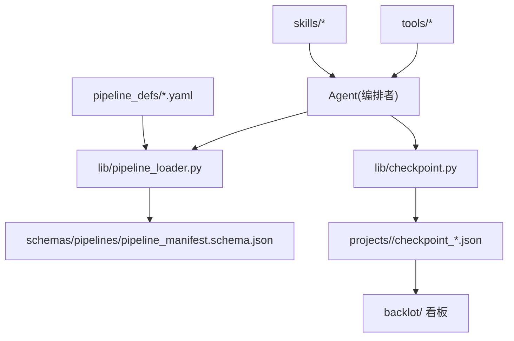
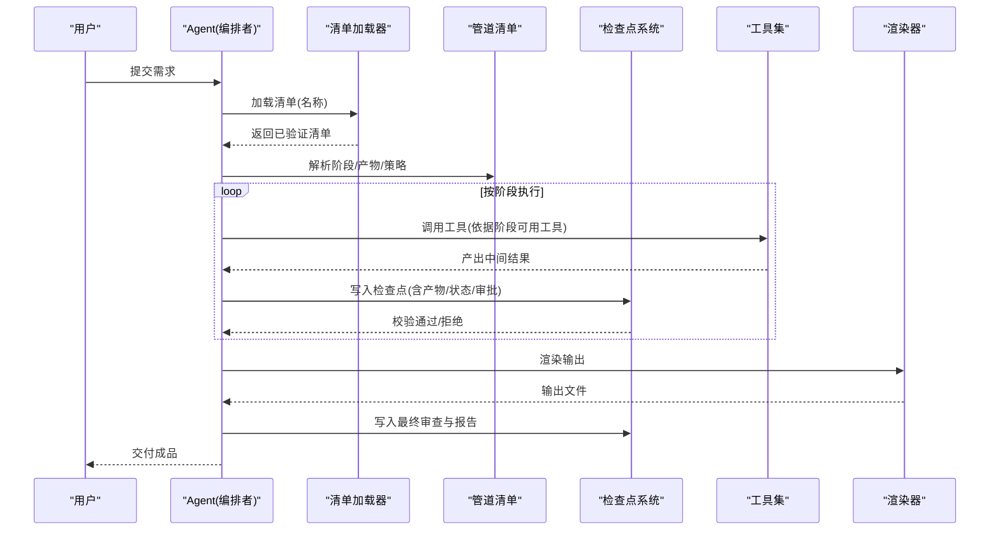
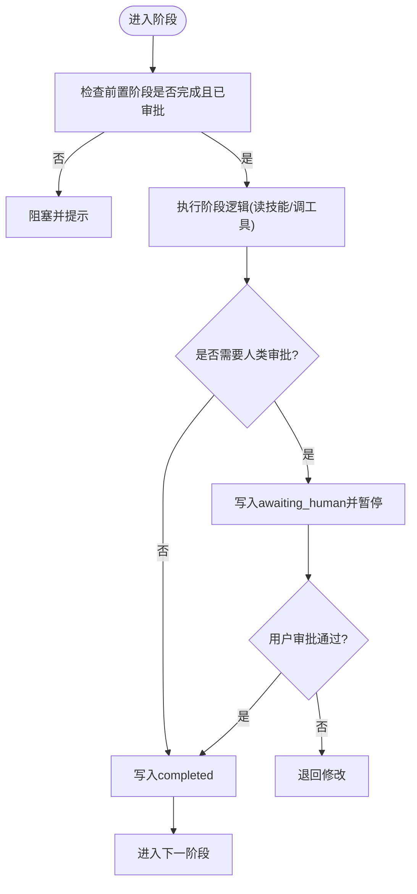
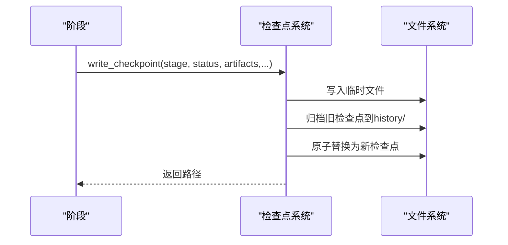
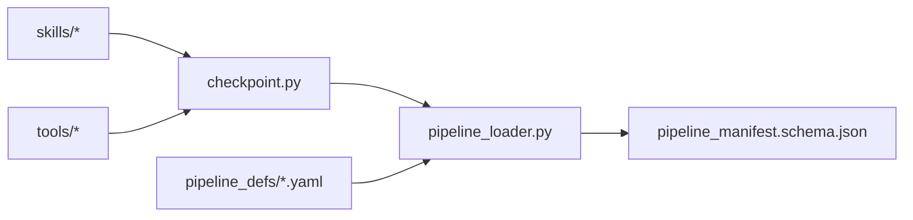

# 管道系统

<cite>
**本文引用的文件**
- [README.md](file://README.md)
- [pipeline_manifest.schema.json](file://schemas/pipelines/pipeline_manifest.schema.json)
- [pipeline_loader.py](file://lib/pipeline_loader.py)
- [checkpoint.py](file://lib/checkpoint.py)
- [animated-explainer.yaml](file://pipeline_defs/animated-explainer.yaml)
- [documentary-montage.yaml](file://pipeline_defs/documentary-montage.yaml)
- [cinematic.yaml](file://pipeline_defs/cinematic.yaml)
- [hybrid.yaml](file://pipeline_defs/hybrid.yaml)
- [talking-head.yaml](file://pipeline_defs/talking-head.yaml)
- [podcast-repurpose.yaml](file://pipeline_defs/podcast-repurpose.yaml)
- [checkpoint-protocol.md](file://skills/meta/checkpoint-protocol.md)
</cite>

## 目录
1. [简介](#简介)
2. [项目结构](#项目结构)
3. [核心组件](#核心组件)
4. [架构总览](#架构总览)
5. [详细组件分析](#详细组件分析)
6. [依赖关系分析](#依赖关系分析)
7. [性能与质量保证](#性能与质量保证)
8. [故障排查指南](#故障排查指南)
9. [结论](#结论)
10. [附录：自定义管道开发指南](#附录自定义管道开发指南)

## 简介
本技术文档面向OpenMontage的“管道系统”，聚焦以下目标：
- 解释管道定义文件的结构与语法（YAML清单规范）
- 深入分析预定义的10+种工作流（动画解释器、电影预告片、纪录片蒙太奇等）的实现原理与使用方法
- 说明管道执行引擎的工作机制（阶段管理、状态持久化、错误恢复）
- 提供自定义管道开发的完整指南（设计模式、最佳实践、测试方法）
- 解释管道间依赖关系与数据流转机制
- 包含性能优化与质量保证措施，并提供示例与模板

OpenMontage采用“代理优先”的架构：AI编码助手作为编排者，读取声明式管道清单与技能指令，调用工具完成生产，并通过检查点实现可恢复、可审计的执行。

## 项目结构
仓库围绕“声明式管道 + 技能指令 + 工具注册 + 质量门禁”组织：
- pipeline_defs：各管道的YAML清单，描述阶段、产物、工具、策略
- schemas：JSON Schema约束，校验清单与产物
- lib：核心基础设施（清单加载、检查点、路径等）
- skills：分层的技能指令（元技能、管道导演技能、创作技巧等）
- tools：工具注册与实现（视频、音频、图像、后期、分析等）
- backlot：本地看板，可视化运行状态
- tests：契约测试、QA集成测试、评估框架

图表来源
- [pipeline_loader.py:33-70](file://lib/pipeline_loader.py#L33-L70)
- [pipeline_manifest.schema.json:1-197](file://schemas/pipelines/pipeline_manifest.schema.json#L1-L197)
- [checkpoint.py:194-564](file://lib/checkpoint.py#L194-L564)

章节来源
- [README.md:450-475](file://README.md#L450-L475)

## 核心组件
- 管道清单加载器：负责加载并校验YAML清单，暴露阶段顺序、子阶段、所需工具、人类审批默认值等能力
- 检查点系统：负责项目初始化、阶段前置条件校验、人类审批门控、历史归档、决策日志合并、读写检查点
- 清单Schema：严格约束清单字段，确保阶段、产物、策略、扩展权限等一致
- 技能协议：指导Agent如何编写检查点、何时请求人类审批、如何处理部分进度与恢复

章节来源
- [pipeline_loader.py:39-162](file://lib/pipeline_loader.py#L39-L162)
- [checkpoint.py:198-564](file://lib/checkpoint.py#L198-L564)
- [pipeline_manifest.schema.json:76-197](file://schemas/pipelines/pipeline_manifest.schema.json#L76-L197)
- [checkpoint-protocol.md:1-100](file://skills/meta/checkpoint-protocol.md#L1-L100)

## 架构总览
OpenMontage的管道执行由“清单驱动 + 技能驱动 + 工具执行 + 检查点持久化”构成：
- Agent读取清单与技能，按阶段推进
- 每个阶段产出结构化产物，写入检查点
- 检查点强制前置阶段完成且通过人类审批（如配置）
- 渲染前后进行质量自检，失败则阻止发布

图表来源
- [pipeline_loader.py:39-162](file://lib/pipeline_loader.py#L39-L162)
- [checkpoint.py:422-564](file://lib/checkpoint.py#L422-L564)

## 详细组件分析

### 管道清单规范（YAML）
- 顶层字段：name、version、description、category、stability、default_checkpoint_policy
- orchestration：编排模式、预算、最大修订次数、超时等
- extensions：是否允许自定义脚本/样式/技能/工具
- required_skills：该管道必需的元技能或导演技能
- stages：阶段数组，每个阶段包含：
  - name、skill、required_artifacts_in、optional_artifacts_in、produces
  - required_tools、optional_tools、tools_available
  - checkpoint_required、human_approval_default
  - review_focus、success_criteria
  - sub_stages：可选的子阶段（如预览样本），支持condition激活

清单通过JSON Schema严格校验，确保一致性。

章节来源
- [pipeline_manifest.schema.json:1-197](file://schemas/pipelines/pipeline_manifest.schema.json#L1-L197)

### 预定义工作流概览
- 动画解释器（animated-explainer）：研究→提案→脚本→场景→资产→剪辑→合成→发布；强调研究先行、成本估算、人类审批
- 纪录片蒙太奇（documentary-montage）：检索优先，构建语料库，CLIP检索填充槽位，音乐同步与统一调色
- 电影预告（cinematic）：情绪导向，素材/生成混合，强调情感节奏、色彩一致性与音频动态
- 混合（hybrid）：源素材与设计/生成支撑层结合，强调平衡与可读性
- 口播（talking-head）：转录→剪辑→字幕→混音→合成
- 播客复用（podcast-repurpose）：从音频/视频播客生成多形态短视频与配套长视频

章节来源
- [animated-explainer.yaml:1-270](file://pipeline_defs/animated-explainer.yaml#L1-L270)
- [documentary-montage.yaml:1-179](file://pipeline_defs/documentary-montage.yaml#L1-L179)
- [cinematic.yaml:1-288](file://pipeline_defs/cinematic.yaml#L1-L288)
- [hybrid.yaml:1-228](file://pipeline_defs/hybrid.yaml#L1-L228)
- [talking-head.yaml:1-229](file://pipeline_defs/talking-head.yaml#L1-L229)
- [podcast-repurpose.yaml:1-213](file://pipeline_defs/podcast-repurpose.yaml#L1-L213)

### 阶段管理与执行流程
- 阶段顺序：清单声明的顺序即执行顺序；支持子阶段以“stage.sub_stage”形式展开
- 前置条件：后续阶段必须等待前置阶段“completed”且满足人类审批要求
- 人类审批门控：清单中human_approval_default为true的阶段，必须以awaiting_human呈现，经批准后再写completed
- 子阶段：如参考视频驱动的预览样本，可按条件激活

图表来源
- [checkpoint.py:284-346](file://lib/checkpoint.py#L284-L346)
- [checkpoint.py:422-564](file://lib/checkpoint.py#L422-L564)
- [pipeline_loader.py:125-149](file://lib/pipeline_loader.py#L125-L149)

章节来源
- [checkpoint.py:284-346](file://lib/checkpoint.py#L284-L346)
- [checkpoint.py:422-564](file://lib/checkpoint.py#L422-L564)
- [pipeline_loader.py:125-149](file://lib/pipeline_loader.py#L125-L149)

### 状态持久化与恢复
- 项目初始化：创建标准目录布局与project.json标记
- 检查点写入：原子写入（先临时文件后替换）、归档旧版本、合并决策日志
- 恢复机制：读取最新检查点，识别未完成阶段，支持in_progress心跳与部分进度
- 决策日志：跨阶段累积记录，便于审计与回放

图表来源
- [checkpoint.py:198-248](file://lib/checkpoint.py#L198-L248)
- [checkpoint.py:349-420](file://lib/checkpoint.py#L349-L420)
- [checkpoint.py:549-564](file://lib/checkpoint.py#L549-L564)

章节来源
- [checkpoint.py:198-248](file://lib/checkpoint.py#L198-L248)
- [checkpoint.py:349-420](file://lib/checkpoint.py#L349-L420)
- [checkpoint.py:549-564](file://lib/checkpoint.py#L549-L564)

### 错误恢复与治理
- 前置阶段校验：未完成的阶段无法推进
- 人类审批门控：禁止跳过审批直接写completed
- 风格/样式校验：无效样式播放列表将导致检查点校验失败
- 决策日志合并：贯穿全链路的审计追踪
- 子阶段条件：避免不必要的计算与资源消耗

章节来源
- [checkpoint.py:284-346](file://lib/checkpoint.py#L284-L346)
- [checkpoint.py:98-116](file://lib/checkpoint.py#L98-L116)
- [checkpoint.py:392-420](file://lib/checkpoint.py#L392-L420)

### 数据流转机制
- 阶段产物：每个阶段产生特定产物（research_brief、proposal_packet、script、scene_plan、asset_manifest、edit_decisions、render_report、publish_log）
- 依赖关系：后续阶段声明required_artifacts_in，确保上游产物存在
- 工具选择：阶段声明required_tools/optional_tools/tools_available，限制Agent可调用的工具集合
- 参考输入：某些管道支持参考视频分析，启用额外分析工具

章节来源
- [pipeline_loader.py:152-162](file://lib/pipeline_loader.py#L152-L162)
- [pipeline_manifest.schema.json:85-122](file://schemas/pipelines/pipeline_manifest.schema.json#L85-L122)

## 依赖关系分析
- 清单加载器依赖Schema进行校验，缓存清单与Schema以提升性能
- 检查点系统依赖清单获取阶段顺序与人类审批默认值
- 各管道清单通过required_skills引入导演技能与元技能
- 工具在阶段中声明可用性，Agent据此选择具体实现

图表来源
- [pipeline_loader.py:27-70](file://lib/pipeline_loader.py#L27-L70)
- [checkpoint.py:51-75](file://lib/checkpoint.py#L51-L75)

章节来源
- [pipeline_loader.py:27-70](file://lib/pipeline_loader.py#L27-L70)
- [checkpoint.py:51-75](file://lib/checkpoint.py#L51-L75)

## 性能与质量保证
- 性能优化
  - 清单与Schema缓存：减少重复解析与校验开销
  - 子阶段条件：按需激活预览/样本，降低不必要计算
  - 工具选择：阶段限定可用工具，减少搜索空间
  - 渲染前校验：提前发现不合规计划，避免浪费GPU时间
- 质量保证
  - 人类审批门控：关键创意节点必须人工确认
  - 前置阶段校验：保证流水线顺序正确
  - 产物Schema校验：确保数据结构一致
  - 渲染前后自检：ffprobe验证、帧采样、音频分析、承诺一致性检查
  - 决策日志：全程审计，便于回溯与复盘

章节来源
- [pipeline_loader.py:27-70](file://lib/pipeline_loader.py#L27-L70)
- [checkpoint.py:284-346](file://lib/checkpoint.py#L284-L346)
- [checkpoint.py:422-564](file://lib/checkpoint.py#L422-L564)
- [README.md:652-686](file://README.md#L652-L686)

## 故障排查指南
- 常见错误
  - 前置阶段未完成：检查点校验抛出前置违规异常
  - 人类审批缺失：门控违规，需先写awaiting_human并经批准再写completed
  - 无效样式播放列表：检查点校验失败，需修正样式名称
  - 清单字段非法：Schema校验失败，需修正YAML结构
- 定位方法
  - 查看最近检查点与历史归档，确认阶段状态与变更
  - 检查决策日志，了解供应商选择与降级原因
  - 使用Backlot看板观察阶段进度与卡点
- 恢复步骤
  - 修复上游产物或配置后，重新运行当前阶段
  - 对需要人类审批的阶段，先写awaiting_human，待批准后写completed

章节来源
- [checkpoint.py:284-346](file://lib/checkpoint.py#L284-L346)
- [checkpoint.py:349-420](file://lib/checkpoint.py#L349-L420)
- [checkpoint.py:567-634](file://lib/checkpoint.py#L567-L634)

## 结论
OpenMontage的管道系统以声明式清单为核心，配合技能指令与工具生态，实现了可恢复、可审计、可治理的视频生产流水线。通过严格的Schema校验、人类审批门控、前置阶段约束与渲染前后自检，系统在灵活性与可靠性之间取得平衡。用户可通过现有管道快速上手，也可基于模板与最佳实践定制专属工作流。

## 附录：自定义管道开发指南
- 设计模式
  - 阶段化：将复杂任务拆分为可独立验证的阶段
  - 产物契约：明确每个阶段的输入/输出产物，使用Schema约束
  - 工具边界：在阶段中声明required/optional/available工具，限制Agent行为
  - 人类审批：对关键创意节点设置人类审批，确保质量
- 最佳实践
  - 使用清单加载器的只读接口，避免运行时修改清单
  - 在阶段开始写入in_progress检查点，提升可观测性
  - 利用子阶段实现条件化流程（如预览样本）
  - 合并决策日志，保留供应商选择与降级原因
- 测试方法
  - 契约测试：验证清单与产物符合Schema
  - 单元/集成测试：模拟阶段执行与检查点写入
  - QA流程：端到端验证输出质量（分辨率、时长、音频、字幕）
- 示例与模板
  - 参考现有管道清单（如animated-explainer、documentary-montage）
  - 复用元技能（reviewer、checkpoint-protocol）与导演技能
  - 使用styles中的样式播放列表保持一致视觉语言

章节来源
- [pipeline_manifest.schema.json:76-197](file://schemas/pipelines/pipeline_manifest.schema.json#L76-L197)
- [checkpoint-protocol.md:1-100](file://skills/meta/checkpoint-protocol.md#L1-L100)
- [README.md:707-724](file://README.md#L707-L724)