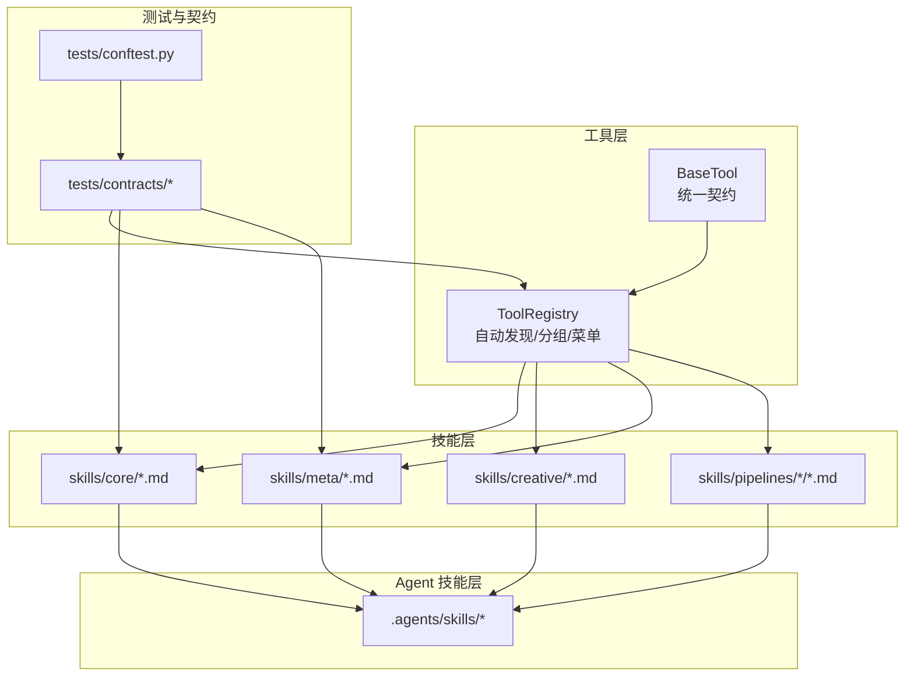
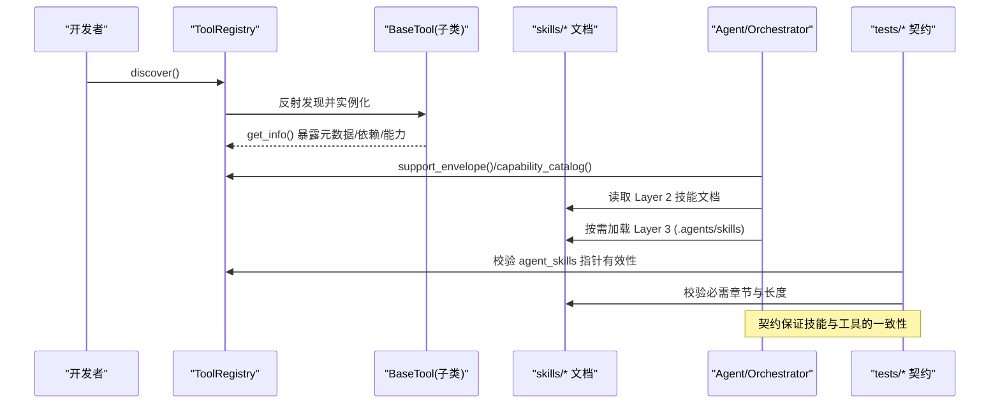
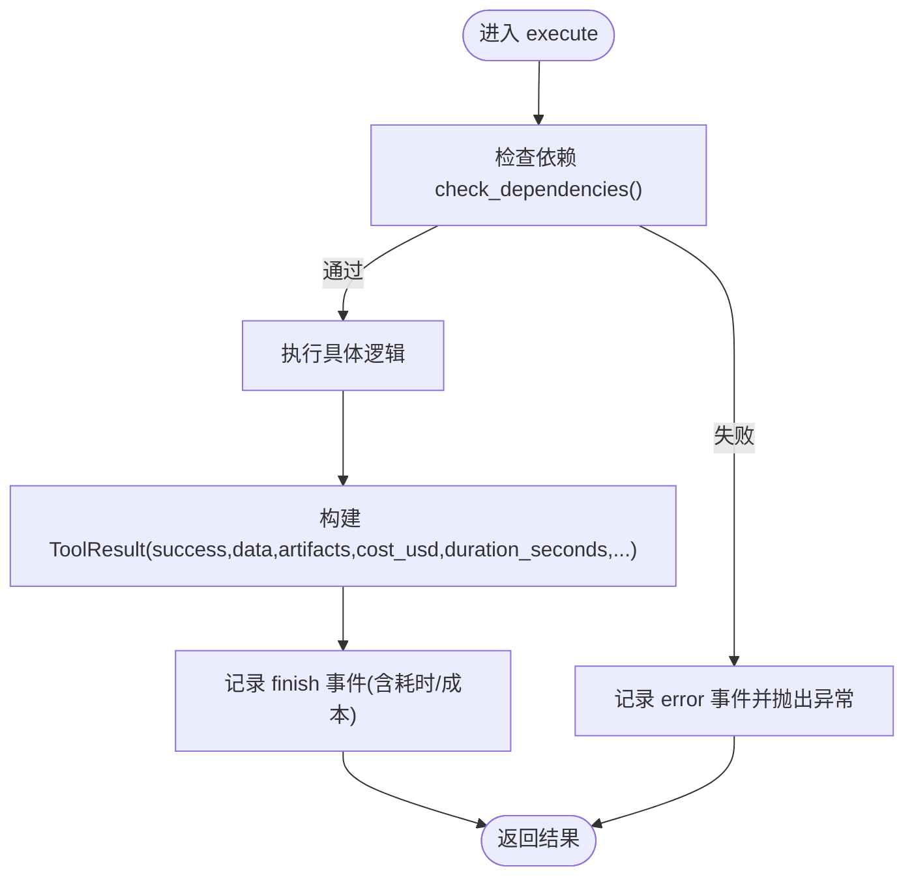
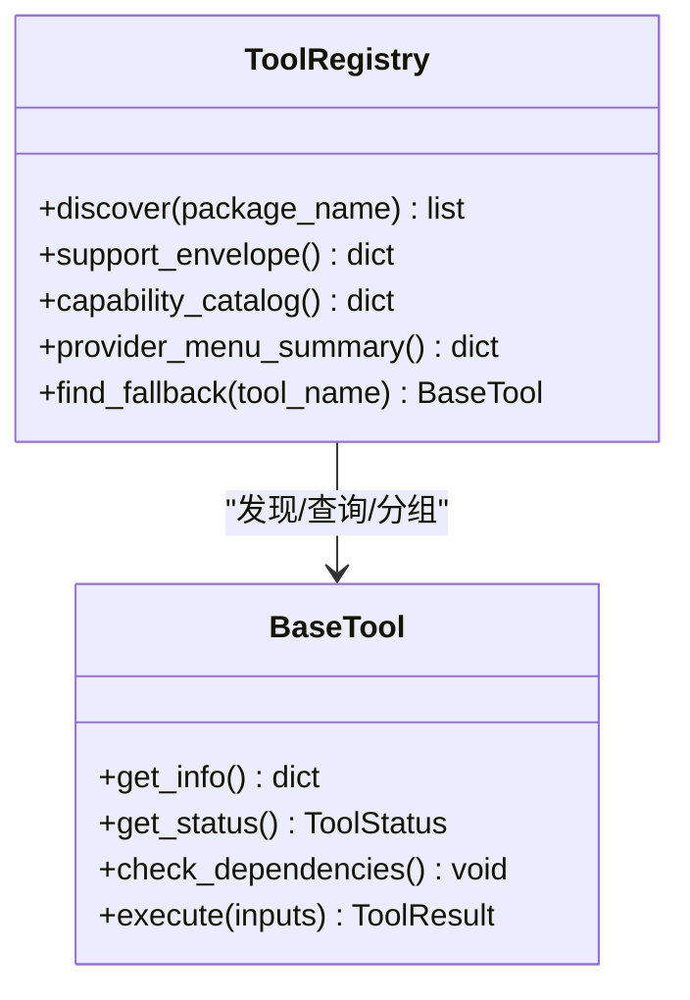
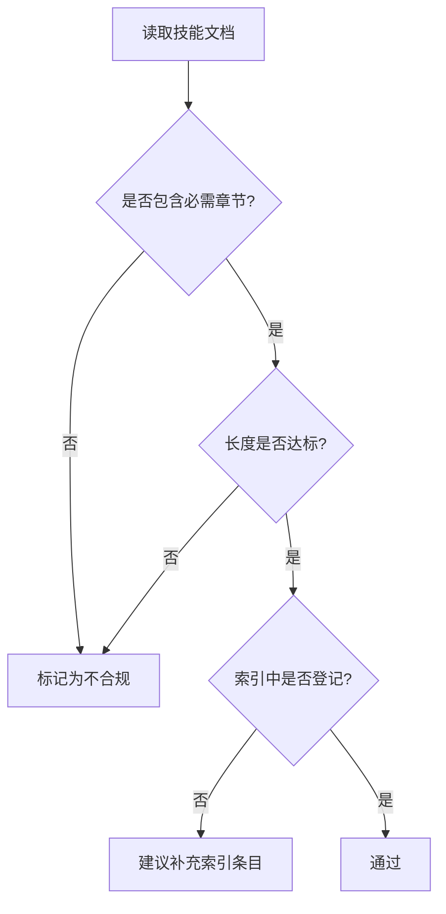
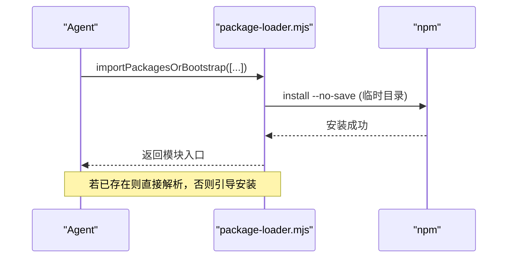
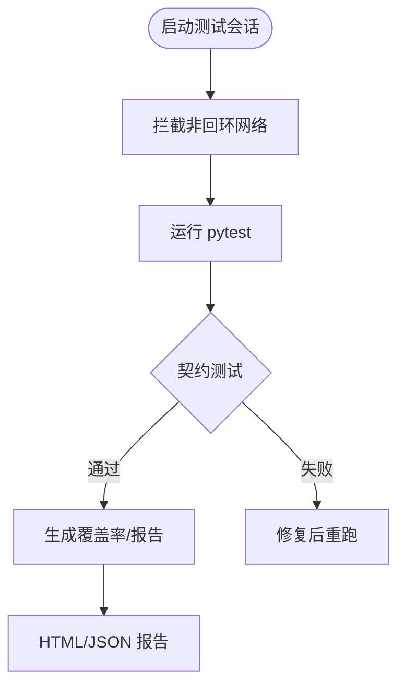
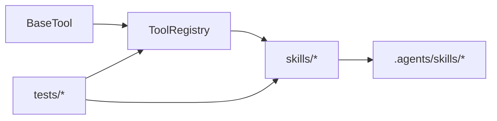

# 技能开发指南

<cite>
**本文引用的文件**
- [skills/INDEX.md](file://skills/INDEX.md)
- [tools/base_tool.py](file://tools/base_tool.py)
- [tools/tool_registry.py](file://tools/tool_registry.py)
- [skills/meta/skill-creator.md](file://skills/meta/skill-creator.md)
- [skills/core/ffmpeg.md](file://skills/core/ffmpeg.md)
- [tests/conftest.py](file://tests/conftest.py)
- [tests/contracts/test_agent_skill_pointers.py](file://tests/contracts/test_agent_skill_pointers.py)
- [tests/contracts/test_phase1_contracts.py](file://tests/contracts/test_phase1_contracts.py)
- [tests/contracts/test_phase3_contracts.py](file://tests/contracts/test_phase3_contracts.py)
- [tests/contracts/test_runtime_presentation_contract.py](file://tests/contracts/test_runtime_presentation_contract.py)
- [.agents/skills/hyperframes-core/references/data-attributes.md](file://.agents/skills/hyperframes-core/references/data-attributes.md)
- [.agents/skills/media-use/scripts/eval.mjs](file://.agents/skills/media-use/scripts/eval.mjs)
- [.agents/skills/remotion-to-hyperframes/assets/test-corpus/run.sh](file://.agents/skills/remotion-to-hyperframes/assets/test-corpus/run.sh)
</cite>

## 目录
1. [简介](#简介)
2. [项目结构](#项目结构)
3. [核心组件](#核心组件)
4. [架构总览](#架构总览)
5. [详细组件分析](#详细组件分析)
6. [依赖关系分析](#依赖关系分析)
7. [性能考量](#性能考量)
8. [故障排查指南](#故障排查指南)
9. [结论](#结论)
10. [附录](#附录)

## 简介
本指南面向希望为 OpenMontage 开发与维护“技能”的工程师与内容创作者。OpenMontage 的技能体系采用三层知识架构：
- 第一层（工具契约）：定义“有哪些工具、能做什么”，通过统一的基类与注册表进行发现与编排。
- 第二层（项目约定）：在 skills 目录下以 Markdown 形式沉淀“如何在 OpenMontage 中使用这些工具”的项目级规范。
- 第三层（通用技术知识）：在 .agents/skills 下提供与具体 API/框架相关的通用知识与最佳实践，按需加载。

本指南将围绕以下目标展开：
- 技能的定义规范：元数据声明、参数验证、执行逻辑、结果返回。
- 技能生命周期管理：安装、更新、卸载与依赖解析。
- 测试框架：模拟环境、断言库与覆盖率统计。
- 调试工具：日志记录、性能分析与错误追踪。
- 发布流程：向社区仓库发布的流程与规范。

## 项目结构
OpenMontage 的技能生态由“工具代码 + 技能文档 + 测试契约 + 运行时能力”共同构成。关键目录与职责如下：
- tools：工具实现与统一契约（BaseTool、ToolRegistry）。
- skills：项目级技能文档（core/creative/meta/pipelines），指导 Agent 如何组合工具完成生产任务。
- .agents/skills：第三方或内部通用技能包（Layer 3），包含 API 使用指南、脚本与参考。
- tests：契约与回归测试，确保技能、工具与运行时的正确性。
- schemas：JSON Schema 约束，用于校验产物与配置。

图表来源
- [tools/base_tool.py:227-397](file://tools/base_tool.py#L227-L397)
- [tools/tool_registry.py:55-220](file://tools/tool_registry.py#L55-L220)
- [skills/INDEX.md:7-31](file://skills/INDEX.md#L7-L31)

章节来源
- [skills/INDEX.md:7-31](file://skills/INDEX.md#L7-L31)
- [tools/base_tool.py:227-397](file://tools/base_tool.py#L227-L397)
- [tools/tool_registry.py:55-220](file://tools/tool_registry.py#L55-L220)

## 核心组件
本节聚焦技能的核心抽象与运行机制：工具的契约、注册与发现、以及技能文档的结构化要求。

- 工具契约（BaseTool）
  - 统一身份与元数据：name、version、tier、stability、runtime、execution_mode、determinism、resume_support、side_effects、agent_skills 等。
  - 依赖检查：check_dependencies 支持 cmd:/binary:/env:/python: 四类依赖，失败时抛出 DependencyError。
  - 执行与观测：execute 被自动包装为 Backlot 事件（start/finish/error），输出 ToolResult（success、data、artifacts、error、cost_usd、duration_seconds、seed、model）。
  - 成本与时长估算：estimate_cost、estimate_runtime；幂等键：idempotency_key。
  - CLI 辅助：run_command 封装子进程调用并统一错误处理。

- 工具注册表（ToolRegistry）
  - 自动发现：discover 遍历 tools 包，注册所有 BaseTool 子类实例。
  - 查询接口：get_by_capability/get_by_provider/get_by_status/provider_menu/capability_catalog/support_envelope 等。
  - 预检菜单：provider_menu_summary 聚合可用/不可用能力、setup_offers、runtime_warnings，供 Agent 在预检阶段呈现。

- 技能文档（skills/*）
  - 结构化模板：When to Use、Prerequisites、Process（步骤编号）、Self-Evaluate（评分量表）、Common Pitfalls。
  - 质量清单：Quality Checklist 作为可勾选的检查项。
  - 索引与分层：skills/INDEX.md 明确三层架构与 Layer 3 技能引用关系。

章节来源
- [tools/base_tool.py:63-139](file://tools/base_tool.py#L63-L139)
- [tools/base_tool.py:227-397](file://tools/base_tool.py#L227-L397)
- [tools/tool_registry.py:55-220](file://tools/tool_registry.py#L55-L220)
- [skills/meta/skill-creator.md:42-87](file://skills/meta/skill-creator.md#L42-L87)
- [skills/INDEX.md:7-31](file://skills/INDEX.md#L7-L31)

## 架构总览
下图展示了从“工具契约”到“技能文档”再到“Agent 技能层”的协作关系，以及测试契约对结构与行为的约束。

图表来源
- [tools/tool_registry.py:118-134](file://tools/tool_registry.py#L118-L134)
- [tools/base_tool.py:329-372](file://tools/base_tool.py#L329-L372)
- [tests/contracts/test_agent_skill_pointers.py:1-45](file://tests/contracts/test_agent_skill_pointers.py#L1-L45)
- [tests/contracts/test_phase1_contracts.py:350-362](file://tests/contracts/test_phase1_contracts.py#L350-L362)

## 详细组件分析

### 组件A：工具契约与执行流水线
- 设计要点
  - 所有工具继承 BaseTool，统一 execute(inputs) -> ToolResult。
  - 自动事件注入：execute 被包装，记录 start/finish/error，便于看板与审计。
  - 依赖检查前置：get_status/check_dependencies 在运行前验证环境。
  - 成本与时长估算：便于预算与调度。
  - 幂等键：基于 idempotency_key_fields 生成缓存键，避免重复执行。

- 数据流
  - 输入 inputs -> 依赖检查 -> 执行 execute -> 产出 ToolResult（含 cost_usd/duration_seconds/artifacts）。
  - 异常路径：捕获异常并写入 error 事件，同时向上抛出。

图表来源
- [tools/base_tool.py:148-224](file://tools/base_tool.py#L148-L224)
- [tools/base_tool.py:296-397](file://tools/base_tool.py#L296-L397)

章节来源
- [tools/base_tool.py:148-224](file://tools/base_tool.py#L148-L224)
- [tools/base_tool.py:296-397](file://tools/base_tool.py#L296-L397)

### 组件B：注册表与能力菜单
- 设计要点
  - discover 自动扫描 tools 包，注册所有非抽象 BaseTool 子类。
  - provider_menu_summary 聚合能力、setup_offers、runtime_warnings，供 Agent 预检展示。
  - capability_catalog/provider_menu 按能力/提供者分组，便于选择器路由。

- 使用场景
  - 预检：Agent 读取 provider_menu_summary，提示用户补齐缺失的环境变量或安装命令。
  - 路由：根据 capability 与 provider 选择最优工具（如 tts_selector、video_selector）。

图表来源
- [tools/tool_registry.py:55-220](file://tools/tool_registry.py#L55-L220)
- [tools/base_tool.py:296-372](file://tools/base_tool.py#L296-L372)

章节来源
- [tools/tool_registry.py:55-220](file://tools/tool_registry.py#L55-L220)

### 组件C：技能文档规范与质量门禁
- 规范要求
  - 每个技能必须包含 When to Use、Process/Protocol、Self-Evaluate、Common Pitfalls。
  - 质量清单 Quality Checklist 作为可勾选检查项。
  - 索引 skills/INDEX.md 维护三层架构与 Layer 3 引用。

- 自动化校验
  - tests/contracts 强制检查技能文件存在性与最低长度。
  - 强制要求章节标题（When to Use、Quality Checklist 等）。

图表来源
- [skills/meta/skill-creator.md:42-87](file://skills/meta/skill-creator.md#L42-L87)
- [tests/contracts/test_phase1_contracts.py:350-362](file://tests/contracts/test_phase1_contracts.py#L350-L362)
- [tests/contracts/test_phase3_contracts.py:830-866](file://tests/contracts/test_phase3_contracts.py#L830-L866)

章节来源
- [skills/meta/skill-creator.md:42-87](file://skills/meta/skill-creator.md#L42-L87)
- [tests/contracts/test_phase1_contracts.py:350-362](file://tests/contracts/test_phase1_contracts.py#L350-L362)
- [tests/contracts/test_phase3_contracts.py:830-866](file://tests/contracts/test_phase3_contracts.py#L830-L866)

### 组件D：Layer 3 技能与运行时依赖
- HyperFrames 示例
  - 通过 package-loader.mjs 在需要时临时安装依赖，避免污染宿主环境。
  - 提供 npx hyperframes 的正确包名指引，避免 404 陷阱。
  - 旧属性迁移：data-layer → data-track-index，data-end → data-duration。

- 安装与更新
  - 首次安装：npx hyperframes skills 安装技能包。
  - 升级：重新运行 init/skills 拉取最新集合。

图表来源
- [.agents/skills/hyperframes-animation/scripts/package-loader.mjs:14-39](file://.agents/skills/hyperframes-animation/scripts/package-loader.mjs#L14-L39)
- [.agents/skills/hyperframes-animation/scripts/package-loader.mjs:227-264](file://.agents/skills/hyperframes-animation/scripts/package-loader.mjs#L227-L264)
- [.agents/skills/hyperframes-core/references/data-attributes.md:61-69](file://.agents/skills/hyperframes-core/references/data-attributes.md#L61-L69)

章节来源
- [.agents/skills/hyperframes-core/references/data-attributes.md:61-69](file://.agents/skills/hyperframes-core/references/data-attributes.md#L61-L69)

### 组件E：测试框架与覆盖率
- 网络隔离
  - tests/conftest.py 在 socket 层拦截非回环连接，防止测试误调付费 API。
  - 通过 OPENMONTAGE_ALLOW_NETWORK=1 显式启用真实网络测试。

- 契约测试
  - 校验技能文件存在性、最低长度、必需章节。
  - 校验 agent_skills 指针指向真实 Layer 3 技能。
  - 校验运行时呈现规则（如双渲染引擎选项必须呈现）。

- 覆盖率与报告
  - media-use eval 生成 HTML 报告，统计资产引用覆盖度。
  - remotion-to-hyperframes 测试套件输出 pass/fail/skipped 汇总。

图表来源
- [tests/conftest.py:81-111](file://tests/conftest.py#L81-L111)
- [tests/contracts/test_agent_skill_pointers.py:1-45](file://tests/contracts/test_agent_skill_pointers.py#L1-L45)
- [.agents/skills/media-use/scripts/eval.mjs:169-186](file://.agents/skills/media-use/scripts/eval.mjs#L169-L186)
- [.agents/skills/remotion-to-hyperframes/assets/test-corpus/run.sh:222-249](file://.agents/skills/remotion-to-hyperframes/assets/test-corpus/run.sh#L222-L249)

章节来源
- [tests/conftest.py:81-111](file://tests/conftest.py#L81-L111)
- [tests/contracts/test_agent_skill_pointers.py:1-45](file://tests/contracts/test_agent_skill_pointers.py#L1-L45)
- [.agents/skills/media-use/scripts/eval.mjs:169-186](file://.agents/skills/media-use/scripts/eval.mjs#L169-L186)
- [.agents/skills/remotion-to-hyperframes/assets/test-corpus/run.sh:222-249](file://.agents/skills/remotion-to-hyperframes/assets/test-corpus/run.sh#L222-L249)

## 依赖关系分析
- 组件耦合
  - BaseTool 是所有工具的统一抽象，ToolRegistry 依赖 BaseTool 的 get_info/status/dependencies。
  - skills/* 文档通过 skills/INDEX.md 与 Layer 3 技能建立引用关系。
  - tests/* 契约反向约束 skills 与 tool_registry 的行为一致性。

- 外部依赖
  - npm 包（HyperFrames）通过临时安装方式引入，避免全局污染。
  - FFmpeg 等本地二进制通过 cmd:/binary: 依赖声明与 which 检测。

图表来源
- [tools/base_tool.py:227-397](file://tools/base_tool.py#L227-L397)
- [tools/tool_registry.py:55-220](file://tools/tool_registry.py#L55-L220)
- [skills/INDEX.md:7-31](file://skills/INDEX.md#L7-L31)

章节来源
- [tools/base_tool.py:227-397](file://tools/base_tool.py#L227-L397)
- [tools/tool_registry.py:55-220](file://tools/tool_registry.py#L55-L220)
- [skills/INDEX.md:7-31](file://skills/INDEX.md#L7-L31)

## 性能考量
- 工具执行
  - 使用 estimate_runtime 预估耗时，结合 backoff 重试策略提升鲁棒性。
  - 合理使用幂等键减少重复计算。

- 资源与网络
  - 通过 resource_profile 声明 CPU/RAM/VRAM/Disk/Network 需求，便于调度。
  - 测试阶段屏蔽外网，避免意外计费与不稳定因素。

- 渲染与转码
  - FFmpeg 链顺序影响最终质量与性能（字幕→人脸增强→调色→音频增强）。
  - 尽量使用无损复制（-c copy）避免重编码。

章节来源
- [tools/base_tool.py:120-139](file://tools/base_tool.py#L120-L139)
- [tools/base_tool.py:374-397](file://tools/base_tool.py#L374-L397)
- [skills/core/ffmpeg.md:29-82](file://skills/core/ffmpeg.md#L29-L82)

## 故障排查指南
- 依赖缺失
  - 现象：get_status 返回 unavailable，check_dependencies 抛出 DependencyError。
  - 处理：根据 install_instructions 安装命令或设置环境变量。

- 运行时警告
  - 现象：provider_menu_summary.runtime_warnings 列出 HyperFrames 等运行时问题。
  - 处理：按提示安装/更新对应包或修正环境变量。

- 测试失败
  - 网络拦截：确认是否误触付费 API，必要时设置 OPENMONTAGE_ALLOW_NETWORK=1。
  - 契约失败：检查技能文件是否存在、是否包含必需章节、长度是否达标。

- 日志与追踪
  - 利用 execute 包装的事件（start/finish/error）定位问题。
  - 查看 ToolResult.duration_seconds/cost_usd 评估性能与成本。

章节来源
- [tools/base_tool.py:296-372](file://tools/base_tool.py#L296-L372)
- [tools/tool_registry.py:316-471](file://tools/tool_registry.py#L316-L471)
- [tests/conftest.py:81-111](file://tests/conftest.py#L81-L111)

## 结论
OpenMontage 的技能体系通过“统一契约 + 注册发现 + 文档化规范 + 契约测试”形成闭环：
- 工具层面：BaseTool 提供一致的执行模型与观测点。
- 注册层面：ToolRegistry 自动发现并按能力/提供者分组，提供预检菜单。
- 技能层面：skills/* 沉淀项目级最佳实践，并与 Layer 3 技能联动。
- 测试层面：契约测试保障技能与工具的一致性与可用性。
遵循本指南，可高效开发、维护与发布高质量技能，并确保在生产环境中稳定运行。

## 附录

### 技能生命周期管理
- 安装
  - 工具依赖：通过 dependencies 声明（cmd:/binary:/env:/python:），check_dependencies 自动校验。
  - Layer 3 技能：按指引安装（如 npx hyperframes skills）。
- 更新
  - 重新运行初始化或技能安装命令以拉取最新版本。
- 卸载
  - 移除相关依赖与环境变量，清理临时安装目录（如 HyperFrames 临时 node_modules）。
- 依赖解析
  - 注册表在 discover 时加载 .env，确保 API Key 可用。
  - 运行时通过 provider_menu_summary 提示缺失项与修复建议。

章节来源
- [tools/base_tool.py:246-328](file://tools/base_tool.py#L246-L328)
- [tools/tool_registry.py:86-134](file://tools/tool_registry.py#L86-L134)
- [.agents/skills/hyperframes-cli/references/init-and-scaffold.md:45-52](file://.agents/skills/hyperframes-cli/references/init-and-scaffold.md#L45-L52)

### 技能发布到社区仓库的流程与规范
- 准备
  - 完善技能文档：When to Use、Process、Self-Evaluate、Common Pitfalls、Quality Checklist。
  - 更新索引：在 skills/INDEX.md 登记新技能。
  - 契约测试：确保 tests/contracts 全部通过。
- 提交
  - 提交 PR，附带变更说明与测试报告。
  - 若涉及 Layer 3 技能，确保 .agents/skills 下对应目录完整。
- 审核
  - 审查者依据 reviewer 技能进行质量门禁（CRITICAL/SUGGESTION/NITPICK）。
  - 关注运行时呈现规则（如双渲染引擎选项必须呈现）。
- 发布
  - 合并后更新版本标签，通知使用者安装/更新。

章节来源
- [skills/meta/skill-creator.md:89-104](file://skills/meta/skill-creator.md#L89-L104)
- [tests/contracts/test_runtime_presentation_contract.py:166-191](file://tests/contracts/test_runtime_presentation_contract.py#L166-L191)