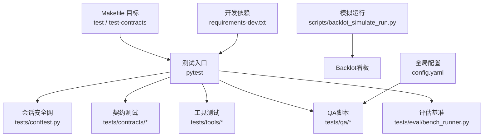
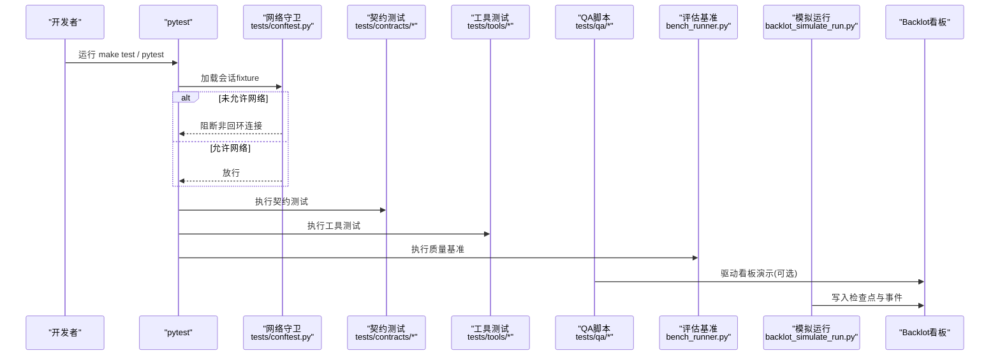
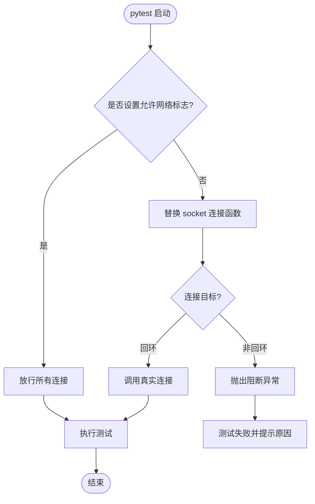
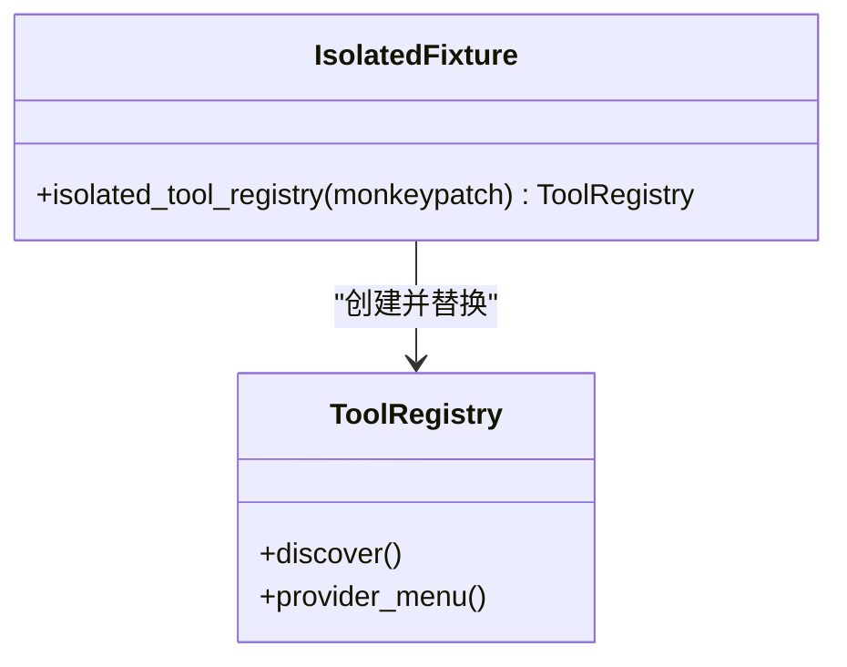
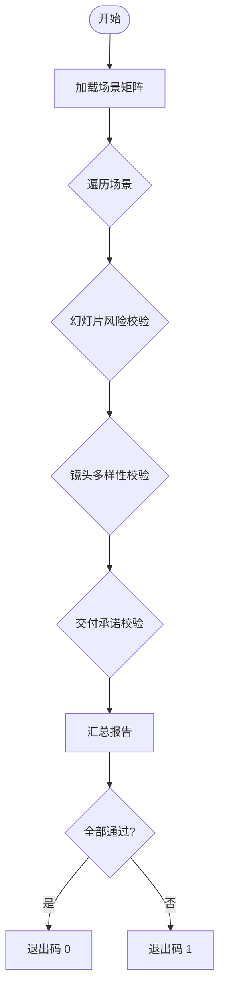
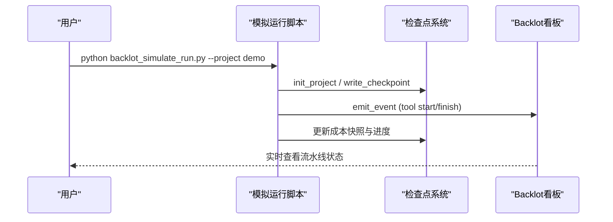
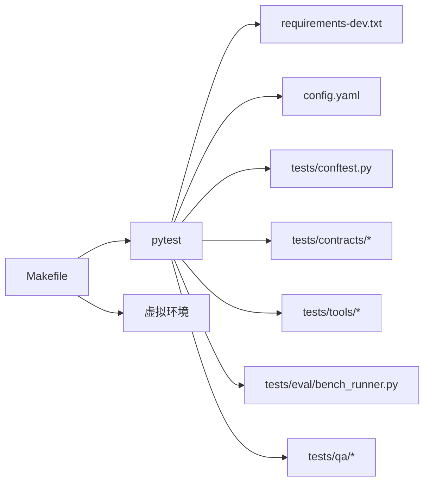

# 测试与调试

<cite>
**本文引用的文件**
- [tests/conftest.py](file://tests/conftest.py)
- [tests/test_network_guard.py](file://tests/test_network_guard.py)
- [Makefile](file://Makefile)
- [requirements-dev.txt](file://requirements-dev.txt)
- [config.yaml](file://config.yaml)
- [scripts/backlot_simulate_run.py](file://scripts/backlot_simulate_run.py)
- [tests/qa/QA_PLAN.md](file://tests/qa/QA_PLAN.md)
- [tests/eval/bench_runner.py](file://tests/eval/bench_runner.py)
- [tests/contracts/conftest.py](file://tests/contracts/conftest.py)
</cite>

## 目录
1. [简介](#简介)
2. [项目结构](#项目结构)
3. [核心组件](#核心组件)
4. [架构总览](#架构总览)
5. [详细组件分析](#详细组件分析)
6. [依赖关系分析](#依赖关系分析)
7. [性能考虑](#性能考虑)
8. [故障排查指南](#故障排查指南)
9. [结论](#结论)
10. [附录](#附录)

## 简介
本指南面向OpenMontage的管道测试与调试，覆盖单元测试、集成测试、端到端测试与性能测试策略；说明测试环境搭建（Mock服务、测试数据与配置管理）；讲解调试工具使用（日志分析、性能剖析、问题定位）；提供常见问题诊断与解决方案；并给出自动化测试与持续集成的集成建议。

## 项目结构
仓库将测试代码按职责分层组织：
- 根级会话级安全网：禁止测试期间发起真实网络请求，避免意外计费。
- 契约测试：校验工具与外部能力接口一致性。
- 工具层测试：针对音视频处理、图像生成、TTS等工具的单元与集成测试。
- QA脚本：以真实或半真实场景驱动质量验证流程。
- 评估基准：对视频生产质量约束进行批量回归验证。
- 模拟运行：驱动Backlot看板展示完整流水线状态流转。

图表来源
- [tests/conftest.py:81-111](file://tests/conftest.py#L81-L111)
- [Makefile:92-96](file://Makefile#L92-L96)
- [requirements-dev.txt:1-6](file://requirements-dev.txt#L1-L6)
- [config.yaml:1-34](file://config.yaml#L1-L34)

章节来源
- [tests/conftest.py:1-132](file://tests/conftest.py#L1-L132)
- [Makefile:92-96](file://Makefile#L92-L96)
- [requirements-dev.txt:1-6](file://requirements-dev.txt#L1-L6)
- [config.yaml:1-34](file://config.yaml#L1-L34)

## 核心组件
- 会话级网络守卫：在socket层拦截非回环地址连接，默认跳过标记为live_api的用例，防止测试误触付费API。
- 契约测试夹具：隔离ToolRegistry单例，确保契约测试互不干扰。
- 评估基准运行器：批量执行质量校验（幻灯片风险、镜头多样性、交付承诺），输出通过/失败与指标。
- QA计划与脚本：分阶段执行工具与组合流程，附带验收标准与已知风险。
- 模拟运行脚本：构造项目工件与检查点，驱动Backlot实时可视化流水线状态。

章节来源
- [tests/conftest.py:1-132](file://tests/conftest.py#L1-L132)
- [tests/contracts/conftest.py:1-16](file://tests/contracts/conftest.py#L1-L16)
- [tests/eval/bench_runner.py:1-492](file://tests/eval/bench_runner.py#L1-L492)
- [tests/qa/QA_PLAN.md:1-73](file://tests/qa/QA_PLAN.md#L1-L73)
- [scripts/backlot_simulate_run.py:1-162](file://scripts/backlot_simulate_run.py#L1-L162)

## 架构总览
下图展示了从测试入口到各层测试与辅助组件的调用关系，以及关键的安全与配置边界。

图表来源
- [tests/conftest.py:81-111](file://tests/conftest.py#L81-L111)
- [Makefile:92-96](file://Makefile#L92-L96)
- [scripts/backlot_simulate_run.py:75-151](file://scripts/backlot_simulate_run.py#L75-L151)

## 详细组件分析

### 网络守卫与会话安全网
- 作用：在pytest会话中拦截socket.connect/connect_ex/create_connection，仅允许回环地址；通过环境变量开关允许真实网络；自动跳过@live_api用例。
- 关键点：
  - 白名单包含localhost、127.x、::1、0.0.0.0及空字符串。
  - 通过pytest markers注册live_api并在收集阶段跳过。
  - 提供元测试验证防护有效性与回环可用性。

图表来源
- [tests/conftest.py:49-111](file://tests/conftest.py#L49-L111)
- [tests/test_network_guard.py:16-45](file://tests/test_network_guard.py#L16-L45)

章节来源
- [tests/conftest.py:1-132](file://tests/conftest.py#L1-L132)
- [tests/test_network_guard.py:1-77](file://tests/test_network_guard.py#L1-L77)

### 契约测试与隔离夹具
- 目的：保证工具注册表在测试间隔离，避免全局状态污染导致契约测试不稳定。
- 机制：通过monkeypatch替换模块级registry为测试内实例。

图表来源
- [tests/contracts/conftest.py:10-15](file://tests/contracts/conftest.py#L10-L15)

章节来源
- [tests/contracts/conftest.py:1-16](file://tests/contracts/conftest.py#L1-L16)

### 评估基准运行器（性能与质量回归）
- 功能：定义多组合成场景，分别对“幻灯片风险”、“镜头多样性”、“交付承诺”三类校验器进行批测，断言结果与预期等级一致。
- 特点：支持标签过滤、详细输出、退出码指示整体通过/失败。

图表来源
- [tests/eval/bench_runner.py:96-342](file://tests/eval/bench_runner.py#L96-L342)
- [tests/eval/bench_runner.py:359-436](file://tests/eval/bench_runner.py#L359-L436)
- [tests/eval/bench_runner.py:468-492](file://tests/eval/bench_runner.py#L468-L492)

章节来源
- [tests/eval/bench_runner.py:1-492](file://tests/eval/bench_runner.py#L1-L492)

### QA计划与端到端验证
- 内容：明确分阶段执行顺序（工具→组合→智能校验→端到端），列出验收标准与已知风险区域。
- 适用：需要人工复核输出的质量门禁，或在CI中结合金样对比。

章节来源
- [tests/qa/QA_PLAN.md:1-73](file://tests/qa/QA_PLAN.md#L1-L73)

### Backlot模拟运行与可视化调试
- 作用：通过写检查点与事件，驱动Backlot看板实时更新，便于观察流水线状态、成本快照与人工审批门控。
- 用法：命令行参数控制项目名、加速模式与清理。

图表来源
- [scripts/backlot_simulate_run.py:62-157](file://scripts/backlot_simulate_run.py#L62-L157)

章节来源
- [scripts/backlot_simulate_run.py:1-162](file://scripts/backlot_simulate_run.py#L1-L162)

## 依赖关系分析
- 测试框架与异步：pytest与pytest-asyncio用于编排与异步测试。
- HTTP客户端：httpx用于HTTP相关测试与Mock。
- 构建与运行：Makefile封装venv创建、依赖安装、测试执行与演示任务。
- 配置：config.yaml集中管理LLM、预算、检查点策略、输出格式与路径。

图表来源
- [Makefile:13-96](file://Makefile#L13-L96)
- [requirements-dev.txt:1-6](file://requirements-dev.txt#L1-L6)
- [config.yaml:1-34](file://config.yaml#L1-L34)

章节来源
- [Makefile:13-96](file://Makefile#L13-L96)
- [requirements-dev.txt:1-6](file://requirements-dev.txt#L1-L6)
- [config.yaml:1-34](file://config.yaml#L1-L34)

## 性能考虑
- 冷启动优化：Makefile在安装阶段预热HyperFrames npx缓存，减少首次渲染延迟。
- 基准回归：评估基准对质量约束进行快速回归，有助于发现性能退化导致的策略误判。
- 资源限制：通过config.yaml中的预算与检查点策略，限制昂贵操作并保留重试空间。

[本节为通用指导，无需特定文件引用]

## 故障排查指南
- 测试意外产生费用
  - 现象：测试尝试访问外部API被阻断或产生费用。
  - 排查：确认未设置允许网络标志；检查是否误用@live_api；查看网络守卫元测试是否通过。
  - 参考：[tests/test_network_guard.py:16-67](file://tests/test_network_guard.py#L16-L67)
- 本地服务不可达
  - 现象：本地服务器或ffmpeg RPC连接失败。
  - 排查：确认连接目标是回环地址；网络守卫仅阻断非回环。
  - 参考：[tests/test_network_guard.py:34-45](file://tests/test_network_guard.py#L34-L45)
- 契约测试互相污染
  - 现象：不同契约测试相互影响。
  - 排查：使用隔离夹具替换ToolRegistry。
  - 参考：[tests/contracts/conftest.py:10-15](file://tests/contracts/conftest.py#L10-L15)
- 看板状态不更新
  - 现象：Backlot看板无进展。
  - 排查：确认已调用init_project/write_checkpoint/emit_event；检查项目目录与路径。
  - 参考：[scripts/backlot_simulate_run.py:75-151](file://scripts/backlot_simulate_run.py#L75-L151)
- 端到端失败
  - 现象：QA脚本某阶段失败。
  - 排查：按QA计划分阶段复现；核对验收标准与已知风险；必要时降低并发或增加日志。
  - 参考：[tests/qa/QA_PLAN.md:41-73](file://tests/qa/QA_PLAN.md#L41-L73)

章节来源
- [tests/test_network_guard.py:16-67](file://tests/test_network_guard.py#L16-L67)
- [tests/contracts/conftest.py:10-15](file://tests/contracts/conftest.py#L10-L15)
- [scripts/backlot_simulate_run.py:75-151](file://scripts/backlot_simulate_run.py#L75-L151)
- [tests/qa/QA_PLAN.md:41-73](file://tests/qa/QA_PLAN.md#L41-L73)

## 结论
OpenMontage的测试体系以“零网络外联”为默认安全基线，配合契约测试、工具层测试、QA脚本与评估基准，形成从单元到端到端的完整质量保障。借助Makefile与配置管理，团队可快速搭建测试环境、执行回归与演示，并通过Backlot可视化调试流水线状态。建议在CI中启用网络守卫与契约测试，按需引入QA与基准作为质量门禁。

[本节为总结性内容，无需特定文件引用]

## 附录

### 测试环境与运行命令
- 安装开发依赖：make install-dev
- 运行全部测试：make test
- 运行契约测试：make test-contracts
- 预热HyperFrames：make hyperframes-warm
- 查看提供商菜单：make preflight

章节来源
- [Makefile:80-96](file://Makefile#L80-L96)
- [Makefile:103-110](file://Makefile#L103-L110)
- [Makefile:100-101](file://Makefile#L100-L101)

### 配置要点
- LLM与预算：在config.yaml中设置provider、模型、温度、令牌上限与预算模式。
- 检查点策略：选择guided/manual_all/auto_noncreative，指定存储目录。
- 输出格式：默认容器、编解码器、分辨率、帧率与CRF。
- 路径约定：pipeline/library/styles/skills/output目录。

章节来源
- [config.yaml:1-34](file://config.yaml#L1-L34)

### 自动化与持续集成建议
- CI步骤建议：
  - 创建虚拟环境并安装依赖。
  - 运行网络守卫元测试与契约测试。
  - 运行工具层测试子集（可按标签或并行）。
  - 可选：运行评估基准与QA脚本（需密钥时走分支条件）。
- 环境变量：
  - OPENMONTAGE_ALLOW_NETWORK=1 仅在受控环境下开启真实网络。
- 缓存与预热：
  - 缓存npx与pip包；预热HyperFrames以减少冷启动。

[本节为通用实践，无需特定文件引用]