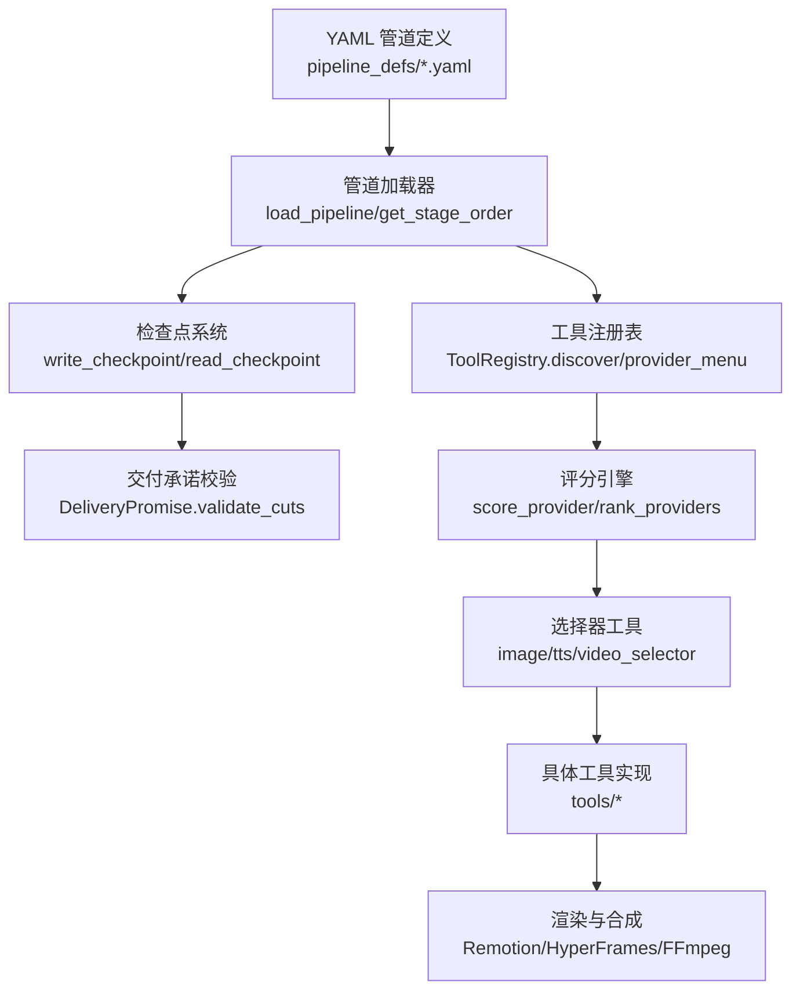
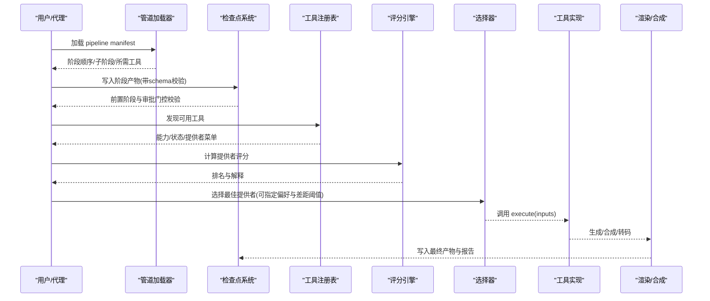
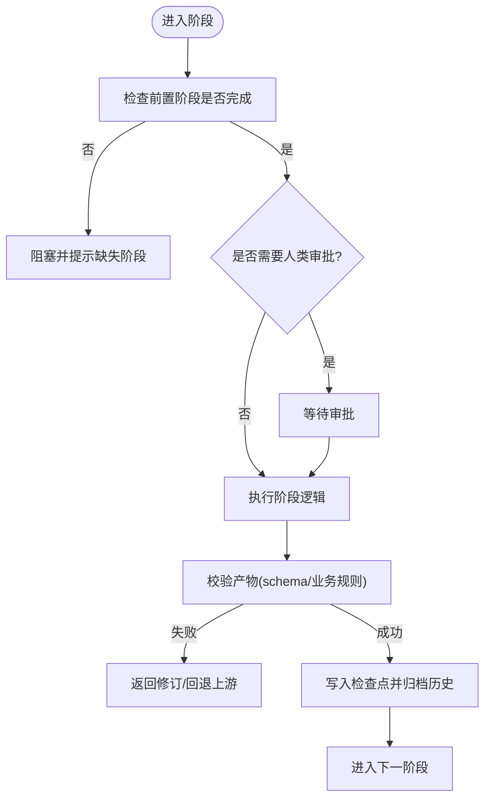
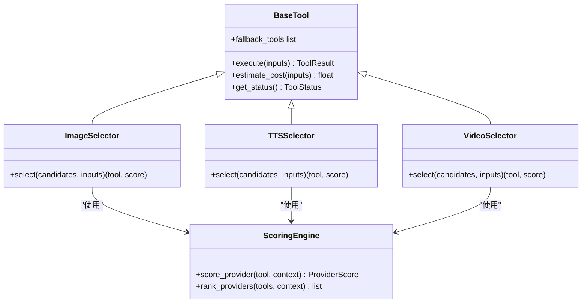
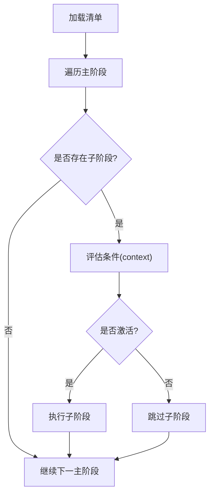
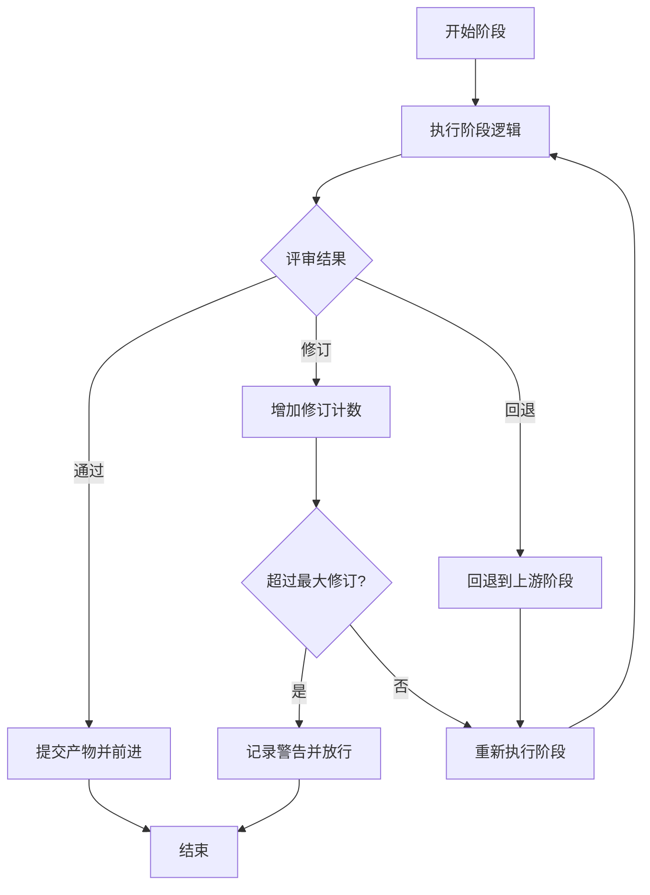
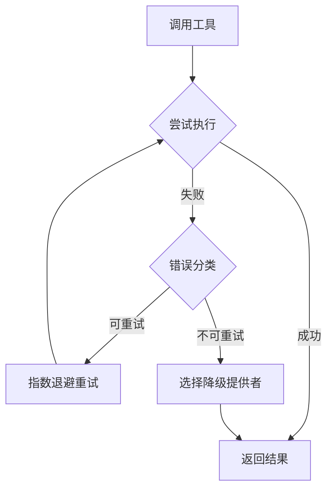
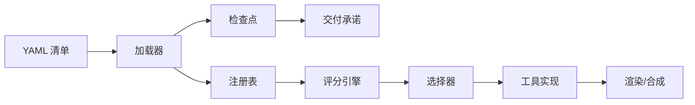

# 管道设计模式

<cite>
**本文引用的文件**
- [README.md](file://README.md)
- [pipeline_loader.py](file://lib/pipeline_loader.py)
- [checkpoint.py](file://lib/checkpoint.py)
- [delivery_promise.py](file://lib/delivery_promise.py)
- [scoring.py](file://lib/scoring.py)
- [base_tool.py](file://tools/base_tool.py)
- [tool_registry.py](file://tools/tool_registry.py)
- [cinematic.yaml](file://pipeline_defs/cinematic.yaml)
- [animated-explainer.yaml](file://pipeline_defs/animated-explainer.yaml)
- [image_selector.py](file://tools/graphics/image_selector.py)
- [tts_selector.py](file://tools/audio/tts_selector.py)
- [video_selector.py](file://tools/video/video_selector.py)
</cite>

## 目录
1. [简介](#简介)
2. [项目结构](#项目结构)
3. [核心组件](#核心组件)
4. [架构总览](#架构总览)
5. [详细组件分析](#详细组件分析)
6. [依赖关系分析](#依赖关系分析)
7. [性能考量](#性能考量)
8. [故障排查指南](#故障排查指南)
9. [结论](#结论)
10. [附录](#附录)

## 简介
本指南围绕“管道设计模式”在 OpenMontage 中的工程化落地，系统阐述串行处理、并行执行、条件分支与循环迭代等常见模式；总结阶段间数据传递的最佳实践（数据契约、格式转换、版本兼容）；给出错误处理模式（重试、降级、回滚）；并提供性能优化策略（缓存、批处理、资源复用）。同时对比设计原则与反模式，帮助读者在复杂媒体生产系统中构建可维护、可扩展、可审计的管道。

## 项目结构
OpenMontage 以“声明式管道 + 工具注册 + 评分选择 + 检查点治理”为核心：
- 管道定义：YAML 清单描述阶段顺序、所需工具、人类审批门控、子阶段与条件。
- 加载器：解析并校验 YAML，提供阶段顺序、子阶段过滤、能力扩展开关等。
- 检查点：持久化每阶段产物，强制前置阶段完成与人类审批，归档历史版本。
- 交付承诺：在提案阶段锁定“运动优先/素材优先/数据讲解”等承诺，并在后期验证是否被违背。
- 工具与选择器：统一工具契约、自动发现、状态报告；按任务上下文多维度评分选择最佳提供者。
- 编排与技能：通过“执行制片人”风格技能驱动各阶段执行、评审与回退。

**图表来源**
- [pipeline_loader.py:49-76](file://lib/pipeline_loader.py#L49-L76)
- [checkpoint.py:422-564](file://lib/checkpoint.py#L422-L564)
- [delivery_promise.py:113-193](file://lib/delivery_promise.py#L113-L193)
- [tool_registry.py:118-134](file://tools/tool_registry.py#L118-L134)
- [scoring.py:373-542](file://lib/scoring.py#L373-L542)
- [image_selector.py:349-375](file://tools/graphics/image_selector.py#L349-L375)
- [tts_selector.py:272-298](file://tools/audio/tts_selector.py#L272-L298)
- [video_selector.py:413-440](file://tools/video/video_selector.py#L413-L440)

**章节来源**
- [README.md:356-447](file://README.md#L356-L447)
- [README.md:450-486](file://README.md#L450-L486)

## 核心组件
- 管道加载器：负责读取 YAML、校验 schema、暴露阶段顺序与子阶段、收集所需工具、控制能力扩展。
- 检查点系统：写入/读取阶段产物，强制前置阶段完成与人类审批，归档历史，合并决策日志。
- 交付承诺：将高层意图转化为可量化的约束（如最小运动比例），在剪辑与合成阶段进行验证。
- 工具基类与注册表：统一工具契约、自动发现、能力与状态报告、回退查找。
- 评分引擎：基于任务上下文对候选提供者打分，输出可解释的排名。
- 选择器工具：封装评分与选择逻辑，支持偏好提供者与分数差距阈值。

**章节来源**
- [pipeline_loader.py:49-162](file://lib/pipeline_loader.py#L49-L162)
- [checkpoint.py:160-191](file://lib/checkpoint.py#L160-L191)
- [delivery_promise.py:82-193](file://lib/delivery_promise.py#L82-L193)
- [base_tool.py:227-408](file://tools/base_tool.py#L227-L408)
- [tool_registry.py:55-196](file://tools/tool_registry.py#L55-L196)
- [scoring.py:21-70](file://lib/scoring.py#L21-L70)

## 架构总览
OpenMontage 的管道由“声明式清单 + 执行技能 + 工具选择 + 检查点治理”构成。每个阶段产出结构化产物并通过 JSON Schema 校验；阶段推进受前置阶段与人类审批门控约束；交付承诺贯穿提案到合成，防止“静默降级”。

**图表来源**
- [pipeline_loader.py:125-149](file://lib/pipeline_loader.py#L125-L149)
- [checkpoint.py:422-564](file://lib/checkpoint.py#L422-L564)
- [tool_registry.py:118-134](file://tools/tool_registry.py#L118-L134)
- [scoring.py:533-542](file://lib/scoring.py#L533-L542)
- [image_selector.py:349-375](file://tools/graphics/image_selector.py#L349-L375)
- [video_selector.py:413-440](file://tools/video/video_selector.py#L413-L440)

## 详细组件分析

### 串行处理：阶段推进与门控
- 阶段顺序来自 YAML 清单，加载器提供稳定顺序；检查点强制前置阶段完成且必要时需人类批准。
- 每个阶段产出结构化 artifact，通过 schema 校验；未满足前置或审批要求时拒绝推进。
- 建议：将长耗时或高成本阶段拆分为可独立检查的子阶段，便于快速失败与定位问题。

**图表来源**
- [pipeline_loader.py:125-149](file://lib/pipeline_loader.py#L125-L149)
- [checkpoint.py:284-346](file://lib/checkpoint.py#L284-L346)
- [checkpoint.py:422-564](file://lib/checkpoint.py#L422-L564)

**章节来源**
- [checkpoint.py:284-346](file://lib/checkpoint.py#L284-L346)
- [checkpoint.py:422-564](file://lib/checkpoint.py#L422-L564)
- [pipeline_loader.py:125-149](file://lib/pipeline_loader.py#L125-L149)

### 并行执行：选择器与多提供者
- 选择器工具（图像/TTS/视频）通过评分引擎对多个提供者打分，按权重排序后选择最优或符合偏好的提供者。
- 视频选择器支持“偏好提供者+分数差距阈值”，避免盲目切换导致质量波动。
- 建议：对无依赖的生成任务（如多路素材检索、多模型采样）采用并发执行，结合预算与速率限制控制风险。

**图表来源**
- [base_tool.py:227-408](file://tools/base_tool.py#L227-L408)
- [scoring.py:373-542](file://lib/scoring.py#L373-L542)
- [image_selector.py:349-375](file://tools/graphics/image_selector.py#L349-L375)
- [tts_selector.py:272-298](file://tools/audio/tts_selector.py#L272-L298)
- [video_selector.py:413-440](file://tools/video/video_selector.py#L413-L440)

**章节来源**
- [scoring.py:373-542](file://lib/scoring.py#L373-L542)
- [image_selector.py:349-375](file://tools/graphics/image_selector.py#L349-L375)
- [tts_selector.py:272-298](file://tools/audio/tts_selector.py#L272-L298)
- [video_selector.py:413-440](file://tools/video/video_selector.py#L413-L440)

### 条件分支：子阶段与能力扩展
- 子阶段可通过条件表达式在运行时激活，用于预览、抽样或可选流程。
- 能力扩展（自定义脚本/样式/技能/工具）需在清单中显式开启，防止越权扩展。
- 建议：将高风险或实验性步骤放入子阶段，配合人类审批与回退策略。

**图表来源**
- [pipeline_loader.py:98-122](file://lib/pipeline_loader.py#L98-L122)
- [pipeline_loader.py:201-241](file://lib/pipeline_loader.py#L201-L241)

**章节来源**
- [pipeline_loader.py:98-122](file://lib/pipeline_loader.py#L98-L122)
- [pipeline_loader.py:201-241](file://lib/pipeline_loader.py#L201-L241)

### 循环迭代：修订与回退
- 执行制片人模式允许“修订”与“回退到上游阶段”，但限制最大次数以避免死循环。
- 检查点归档历史版本，支持回放与审计；当下游发现上游失效时可触发回退。
- 建议：为关键阶段设置修订上限与告警阈值，确保进度可控。

**图表来源**
- [checkpoint.py:349-386](file://lib/checkpoint.py#L349-L386)
- [README.md:374-383](file://README.md#L374-L383)

**章节来源**
- [checkpoint.py:349-386](file://lib/checkpoint.py#L349-L386)
- [README.md:374-383](file://README.md#L374-L383)

### 数据契约与版本兼容
- 所有产物遵循 JSON Schema 校验，确保跨阶段数据一致性。
- 检查点包含阶段、状态、时间戳、产物、人类审批标记等元信息，便于追溯。
- 建议：为新增字段提供向后兼容默认值；对破坏性变更采用版本迁移策略。

**章节来源**
- [checkpoint.py:160-191](file://lib/checkpoint.py#L160-L191)
- [checkpoint.py:422-564](file://lib/checkpoint.py#L422-L564)

### 错误处理模式
- 重试机制：工具基类支持重试策略配置；外部参考文档提供了指数退避与错误分类示例。
- 降级策略：选择器支持“偏好提供者+分数差距阈值”，在偏离过大时回退到次优提供者。
- 回滚方案：检查点归档历史版本，可在 UI 中回放与比较；必要时回退到上一个稳定检查点。

**图表来源**
- [base_tool.py:120-126](file://tools/base_tool.py#L120-L126)
- [video_selector.py:413-440](file://tools/video/video_selector.py#L413-L440)
- [.agents/skills/bfl-api/references/error-handling.md:148-197](file://.agents/skills/bfl-api/references/error-handling.md#L148-L197)

**章节来源**
- [base_tool.py:120-126](file://tools/base_tool.py#L120-L126)
- [video_selector.py:413-440](file://tools/video/video_selector.py#L413-L440)
- [.agents/skills/bfl-api/references/error-handling.md:148-197](file://.agents/skills/bfl-api/references/error-handling.md#L148-L197)

### 性能优化模式
- 缓存策略：管道清单加载使用 lru_cache；检查点读写幂等，避免重复解析与校验。
- 批处理：选择器批量评分与排序，减少多次网络往返；渲染阶段可合并音频/字幕/转码。
- 资源复用：工具注册表集中管理状态与能力；BaseTool 提供 idempotency_key 用于去重。
- 建议：对昂贵操作（如大模型推理、转码）引入缓存键与结果复用；对并发任务设置上限与超时。

**章节来源**
- [pipeline_loader.py:27-36](file://lib/pipeline_loader.py#L27-L36)
- [base_tool.py:384-391](file://tools/base_tool.py#L384-L391)
- [scoring.py:533-542](file://lib/scoring.py#L533-L542)

### 设计原则与反模式对比
- 原则
  - 明确契约：阶段产物与 schema 强一致，避免隐式约定。
  - 可观测性：检查点与决策日志完整记录，支持回放与审计。
  - 可回退：历史归档与回退机制保障运行安全。
  - 可解释选择：评分引擎输出可解释排名，避免黑盒决策。
- 反模式
  - 静默降级：违反交付承诺的降级应阻断并提示，而非无声替换。
  - 过度耦合：阶段间紧耦合导致难以替换与测试。
  - 无边界并发：无限并行引发资源耗尽与不稳定。
  - 缺少回退：无重试与降级导致单点故障放大。

**章节来源**
- [delivery_promise.py:1-9](file://lib/delivery_promise.py#L1-9)
- [delivery_promise.py:113-193](file://lib/delivery_promise.py#L113-L193)
- [checkpoint.py:349-386](file://lib/checkpoint.py#L349-L386)
- [scoring.py:533-542](file://lib/scoring.py#L533-L542)

## 依赖关系分析
- 管道清单依赖加载器解析阶段顺序与子阶段；加载器依赖 schema 校验。
- 检查点依赖加载器获取阶段列表与人类审批默认值；依赖 schema 校验产物。
- 选择器依赖注册表发现工具与评分引擎；评分引擎依赖工具元信息与上下文。
- 渲染阶段依赖编辑决策与资产清单，需遵守交付承诺。

**图表来源**
- [pipeline_loader.py:49-76](file://lib/pipeline_loader.py#L49-L76)
- [checkpoint.py:160-191](file://lib/checkpoint.py#L160-L191)
- [tool_registry.py:118-134](file://tools/tool_registry.py#L118-L134)
- [scoring.py:373-542](file://lib/scoring.py#L373-L542)

**章节来源**
- [pipeline_loader.py:49-76](file://lib/pipeline_loader.py#L49-L76)
- [checkpoint.py:160-191](file://lib/checkpoint.py#L160-L191)
- [tool_registry.py:118-134](file://tools/tool_registry.py#L118-L134)
- [scoring.py:373-542](file://lib/scoring.py#L373-L542)

## 性能考量
- 并发与限流：对无依赖任务采用并发执行，结合预算与速率限制；对高负载任务设置超时与重试上限。
- 缓存与幂等：利用 idempotency_key 与 lru_cache 减少重复计算；对网络请求与本地转码结果做缓存。
- 批处理：选择器批量评分与排序；渲染阶段合并音频/字幕/转码以减少 IO 开销。
- 资源复用：注册表集中管理工具状态；共享资源（如模型、编码器）尽量复用。

[本节为通用指导，不直接分析具体文件]

## 故障排查指南
- 前置阶段未完成：检查点会抛出前置违规错误；确认上游阶段已完成并通过人类审批。
- 人类审批缺失：若阶段需要审批，必须写入 awaiting_human 并经批准后写 completed。
- 产物 schema 校验失败：检查产物结构与必填字段；根据错误信息修正。
- 提供者不可用：查看注册表状态与依赖；补充环境变量或安装依赖后重试。
- 交付承诺被违反：在剪辑/合成阶段验证运动比例与类型；必要时调整计划或获得用户批准降级。

**章节来源**
- [checkpoint.py:284-346](file://lib/checkpoint.py#L284-L346)
- [checkpoint.py:422-564](file://lib/checkpoint.py#L422-L564)
- [delivery_promise.py:113-193](file://lib/delivery_promise.py#L113-L193)
- [tool_registry.py:161-196](file://tools/tool_registry.py#L161-L196)

## 结论
OpenMontage 将“声明式管道 + 工具选择 + 检查点治理 + 交付承诺”有机结合，实现了可解释、可回退、可扩展的视频生产流水线。通过串行推进、并行选择、条件分支与循环迭代，系统在保证质量与预算的同时，提供了强大的可观测性与容错能力。遵循本文的设计原则与最佳实践，可以在更复杂的场景中构建稳健的管道。

## 附录
- 典型管道清单示例：电影级、动画讲解型等，均定义了阶段顺序、工具与人类审批门控。
- 工具基类与注册表：统一契约、自动发现、能力报告与回退查找。
- 评分引擎：多维度加权评分，输出可解释排名，支持偏好提供者与差距阈值。

**章节来源**
- [cinematic.yaml:60-288](file://pipeline_defs/cinematic.yaml#L60-L288)
- [animated-explainer.yaml:61-270](file://pipeline_defs/animated-explainer.yaml#L61-L270)
- [base_tool.py:227-408](file://tools/base_tool.py#L227-L408)
- [tool_registry.py:55-196](file://tools/tool_registry.py#L55-L196)
- [scoring.py:373-542](file://lib/scoring.py#L373-L542)