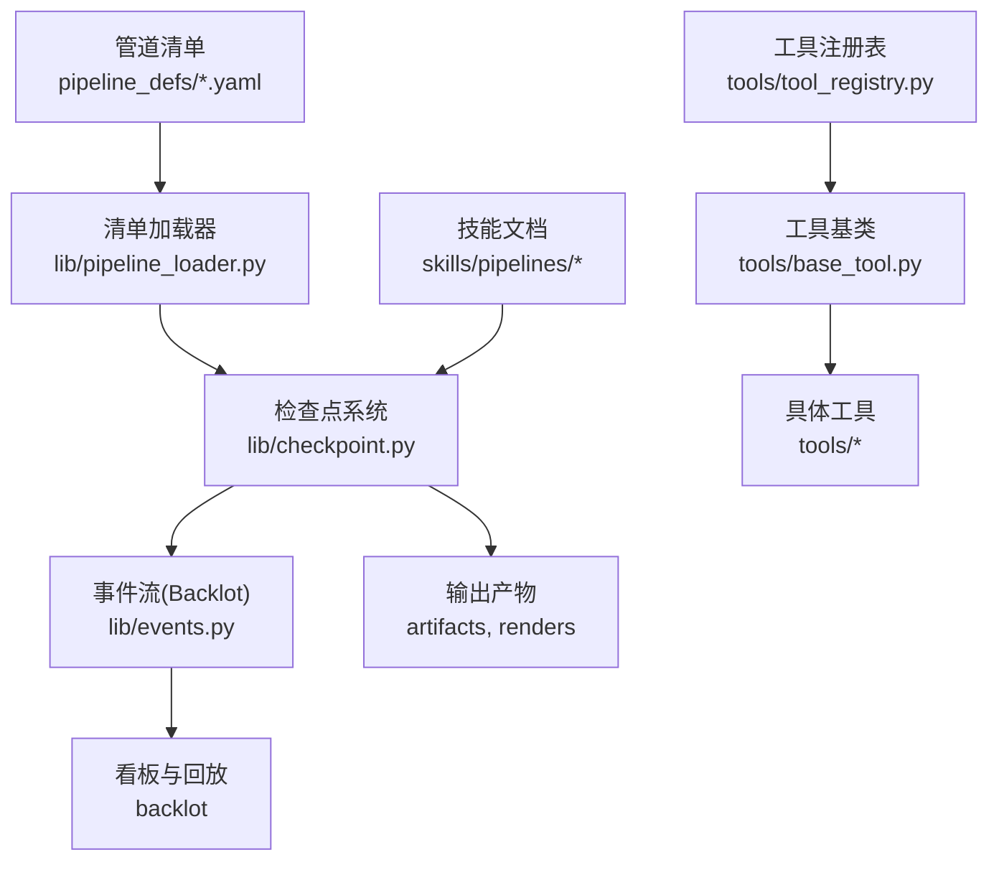
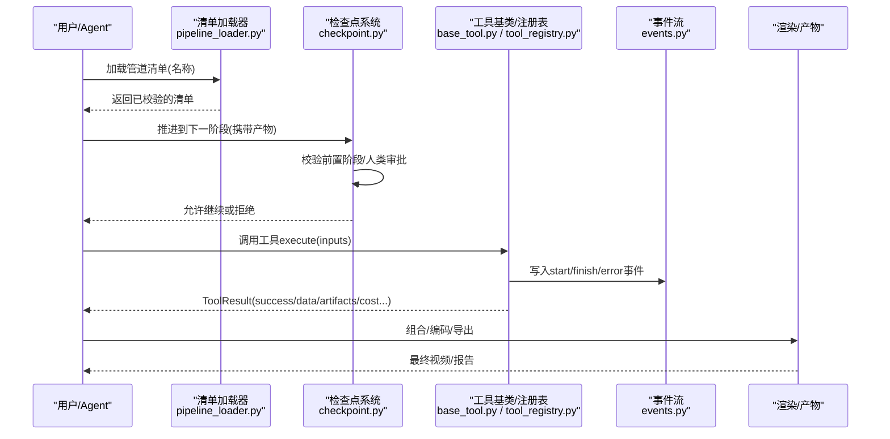
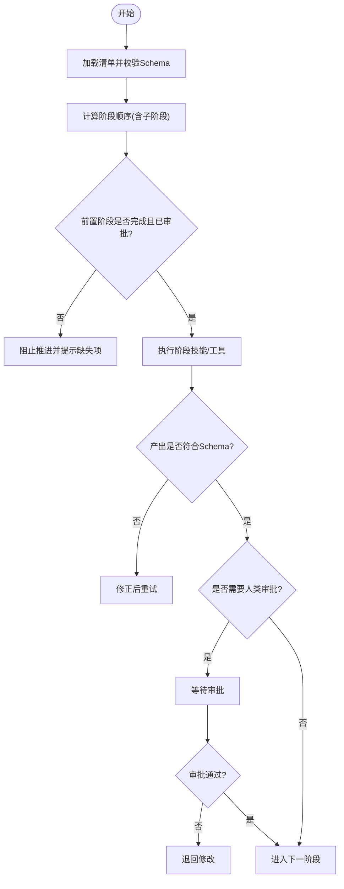
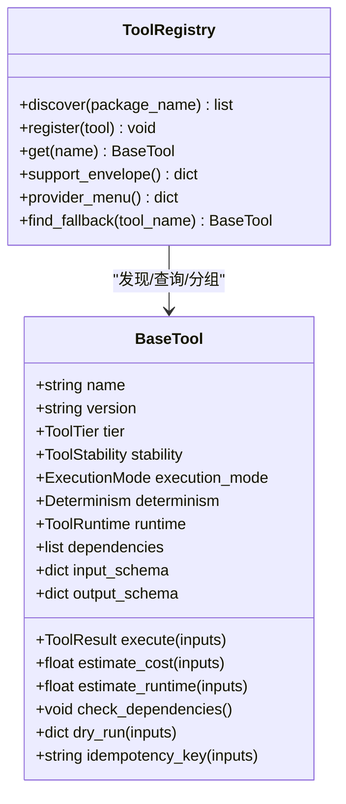
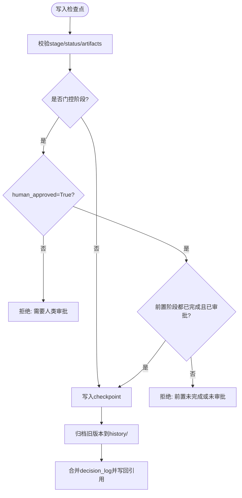
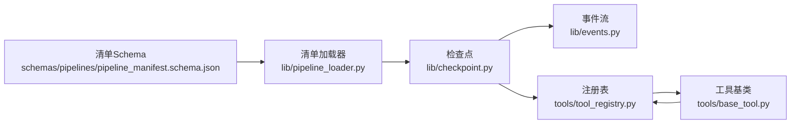

# 自定义管道开发

<cite>
**本文引用的文件**
- [README.md](file://README.md)
- [pipeline_loader.py](file://lib/pipeline_loader.py)
- [base_tool.py](file://tools/base_tool.py)
- [tool_registry.py](file://tools/tool_registry.py)
- [checkpoint.py](file://lib/checkpoint.py)
- [events.py](file://lib/events.py)
- [animation.yaml](file://pipeline_defs/animation.yaml)
- [pipeline_manifest.schema.json](file://schemas/pipelines/pipeline_manifest.schema.json)
- [idea-director.md](file://skills/pipelines/animation/idea-director.md)
- [conftest.py](file://tests/conftest.py)
- [test_base_tool_dependencies.py](file://tests/tools/test_base_tool_dependencies.py)
</cite>

## 目录
1. [简介](#简介)
2. [项目结构](#项目结构)
3. [核心组件](#核心组件)
4. [架构总览](#架构总览)
5. [详细组件分析](#详细组件分析)
6. [依赖关系分析](#依赖关系分析)
7. [性能与可观测性](#性能与可观测性)
8. [故障排查指南](#故障排查指南)
9. [结论](#结论)
10. [附录：模板与示例](#附录模板与示例)

## 简介
本指南面向希望基于 OpenMontage 构建“自定义视频生产管道”的开发者。内容覆盖：
- 管道设计最佳实践：阶段划分原则、数据流转设计、错误处理策略
- 技能开发规范：技能接口定义、参数验证、结果格式化
- 测试框架：单元测试、集成测试、端到端测试
- 调试工具：日志分析、性能监控、问题诊断
- 发布与版本管理：管道与技能的版本化、兼容性治理
- 模板与示例：可直接复用的 YAML 管道清单与阶段技能模板

OpenMontage 采用“声明式管道 + 指令型技能 + 注册表驱动的工具生态”，通过 JSON Schema 校验、检查点（Checkpoint）持久化、人类审批门控、以及事件流（Backlot）实现工程化的质量门禁与可审计的生产流程。

## 项目结构
仓库围绕“能力发现—编排—执行—验收—发布”的主线组织：
- 管道清单：在 pipeline_defs/*.yaml 中声明阶段、产物、工具集、审查焦点与人类审批策略
- 技能：在 skills/pipelines/* 中以 Markdown 形式描述每个阶段的执行方法、质量门槛与决策约束
- 工具与注册表：tools/* 提供具体能力，BaseTool 统一接口；tool_registry.py 自动发现并汇总能力包
- 基础设施：lib/pipeline_loader.py 加载并校验管道清单；lib/checkpoint.py 负责状态持久化与前置条件校验；lib/events.py 记录事件流用于 Backlot 看板
- 测试：tests/* 包含网络隔离、契约测试、工具单测等

图表来源
- [pipeline_loader.py:49-70](file://lib/pipeline_loader.py#L49-L70)
- [checkpoint.py:422-564](file://lib/checkpoint.py#L422-L564)
- [events.py:77-119](file://lib/events.py#L77-L119)
- [tool_registry.py:118-134](file://tools/tool_registry.py#L118-L134)
- [base_tool.py:227-397](file://tools/base_tool.py#L227-L397)

章节来源
- [README.md:450-475](file://README.md#L450-L475)

## 核心组件
- 管道清单加载与校验：读取 YAML 清单，按 schema 校验，暴露阶段顺序、子阶段、所需工具、扩展权限等
- 检查点与门控：每个阶段完成后写入 checkpoint，强制前置阶段完成与人类审批，支持归档历史与决策日志合并
- 工具基类与注册表：统一 execute/estimate_cost/dry_run/dependencies 等接口；自动发现 tools/* 下的工具并生成能力菜单
- 事件流：BaseTool.execute 被装饰器包裹，自动向 projects/<id>/events.jsonl 追加 start/finish/error 事件，供 Backlot 实时展示
- 技能与阶段导演：以 Markdown 指导 Agent 如何执行阶段，明确输入、工具、审查焦点与成功标准

章节来源
- [pipeline_loader.py:49-190](file://lib/pipeline_loader.py#L49-L190)
- [checkpoint.py:124-191](file://lib/checkpoint.py#L124-L191)
- [base_tool.py:148-236](file://tools/base_tool.py#L148-L236)
- [tool_registry.py:118-167](file://tools/tool_registry.py#L118-L167)
- [events.py:1-119](file://lib/events.py#L1-L119)

## 架构总览
下图展示了从“清单加载 → 阶段执行 → 检查点门控 → 事件上报 → 渲染产出”的完整链路。

图表来源
- [pipeline_loader.py:49-70](file://lib/pipeline_loader.py#L49-L70)
- [checkpoint.py:422-564](file://lib/checkpoint.py#L422-L564)
- [base_tool.py:148-236](file://tools/base_tool.py#L148-L236)
- [events.py:77-119](file://lib/events.py#L77-L119)

## 详细组件分析

### 管道清单与阶段划分
- 阶段划分原则
  - 将“研究→提案→脚本→场景计划→资产→剪辑→合成→发布”作为通用骨架，可按需增删（如参考输入分析、样本预览子阶段）
  - 每个阶段声明 skill、produces、required_artifacts_in、tools_available、review_focus、success_criteria、human_approval_default
  - 子阶段（sub_stages）用于可选步骤（例如参考视频分析的 sample 预览），可通过 condition 控制激活
- 数据流转设计
  - 上游阶段产出的 artifacts 成为下游 required_artifacts_in，形成强耦合的数据契约
  - 通过 get_stage_order/get_stage_sub_stages 获取严格顺序，避免乱序执行
- 错误处理策略
  - 清单不合法时抛出校验异常
  - 阶段未满足前置条件或人类审批缺失时，写入 checkpoint 会失败并提示具体原因
  - 扩展能力（custom_scripts/playbooks/skills/tools）默认关闭，需显式开启

图表来源
- [pipeline_loader.py:98-149](file://lib/pipeline_loader.py#L98-L149)
- [checkpoint.py:284-346](file://lib/checkpoint.py#L284-L346)
- [pipeline_manifest.schema.json:76-153](file://schemas/pipelines/pipeline_manifest.schema.json#L76-L153)

章节来源
- [animation.yaml:62-300](file://pipeline_defs/animation.yaml#L62-L300)
- [pipeline_manifest.schema.json:76-197](file://schemas/pipelines/pipeline_manifest.schema.json#L76-L197)
- [pipeline_loader.py:49-190](file://lib/pipeline_loader.py#L49-L190)
- [checkpoint.py:284-346](file://lib/checkpoint.py#L284-L346)

### 技能开发规范（Stage Director Skills）
- 技能职责
  - 明确何时使用本管道/阶段（When To Use）
  - 列出参考输入与上层知识（Layer 3 skills）
  - 规定执行流程、工具选择、复用策略、质量门控
  - 明确门控提醒（Gate Reminder），确保人类审批不被跳过
- 参数与结果
  - 输入来自上游 artifacts（如 research_brief、proposal_packet、script、scene_plan）
  - 输出为新的 artifacts（如 asset_manifest、edit_decisions、render_report、publish_log），必须符合对应 Schema
- 最佳实践
  - 优先使用 selector 工具（video_selector/tts_selector/image_selector），而非直接调用供应商工具
  - 在生成前阅读 Layer 3 技能，保证提示词与模型特性对齐
  - 对成本、时长、分辨率、平台规格进行预估与约束

章节来源
- [idea-director.md:1-83](file://skills/pipelines/animation/idea-director.md#L1-L83)
- [animation.yaml:169-223](file://pipeline_defs/animation.yaml#L169-L223)

### 工具接口与注册表
- BaseTool 统一契约
  - 身份与元信息：name/version/tier/stability/runtime/capabilities/best_for/not_good_for
  - 依赖与环境：dependencies/install_instructions/check_dependencies
  - 执行与估算：execute/estimate_cost/estimate_runtime/dry_run
  - 幂等与恢复：idempotency_key/resume_support
  - 副作用与回退：side_effects/fallback/fallback_tools
  - 可观测性：execute 自动注入事件上报（start/finish/error）
- 注册表能力
  - discover() 自动扫描 tools/* 并注册所有 BaseTool 子类
  - support_envelope()/provider_menu()/capability_catalog() 提供能力视图
  - find_fallback() 根据声明的回退链选择可用工具
  - provider_menu_summary() 生成面向用户的“能力菜单摘要”，便于预检与引导配置

图表来源
- [base_tool.py:110-397](file://tools/base_tool.py#L110-L397)
- [tool_registry.py:55-167](file://tools/tool_registry.py#L55-L167)

章节来源
- [base_tool.py:227-481](file://tools/base_tool.py#L227-L481)
- [tool_registry.py:118-493](file://tools/tool_registry.py#L118-L493)

### 检查点与人类审批门控
- 关键机制
  - write_checkpoint 会在写入前校验 stage/status/artifacts，并依据 manifest 的 human_approval_default 强制人类审批
  - _enforce_stage_prerequisites 检查前置阶段是否 completed 且已审批，否则抛出校验错误
  - 历史归档：覆盖前的 checkpoint 会被复制到 history/，保留审计轨迹
  - 决策日志合并：decision_log 会被聚合到项目级文件，并在 proposal/render 中引用
- 典型错误
  - 未满足前置阶段或人类审批即尝试标记 completed，将被拒绝
  - 未知 pipeline_type 会导致无法解析门控策略，应修正清单名称

图表来源
- [checkpoint.py:422-564](file://lib/checkpoint.py#L422-L564)
- [checkpoint.py:284-346](file://lib/checkpoint.py#L284-L346)

章节来源
- [checkpoint.py:124-191](file://lib/checkpoint.py#L124-L191)
- [checkpoint.py:422-564](file://lib/checkpoint.py#L422-L564)

### 事件流与调试
- BaseTool.execute 自动包装，向 projects/<id>/events.jsonl 追加事件，包含 tool、scene_id、depth、output_path、success、cost_usd、duration_s 等
- events.py 提供 emit_event/read_events，容错地读取并忽略损坏行
- 结合 Backlot 看板，可实时观察每步执行、耗时与成本，定位瓶颈与失败点

章节来源
- [base_tool.py:148-236](file://tools/base_tool.py#L148-L236)
- [events.py:1-119](file://lib/events.py#L1-L119)

## 依赖关系分析
- 清单加载器依赖 JSON Schema 校验，确保 YAML 结构正确
- 检查点依赖清单的阶段顺序与人类审批策略，同时依赖样式 Playbook 的有效性
- 工具注册表依赖 BaseTool 的统一接口，自动发现 tools/* 下所有工具
- 事件流依赖 BaseTool 的装饰器注入，零侵入地收集运行期指标

图表来源
- [pipeline_manifest.schema.json:1-197](file://schemas/pipelines/pipeline_manifest.schema.json#L1-L197)
- [pipeline_loader.py:49-70](file://lib/pipeline_loader.py#L49-L70)
- [checkpoint.py:422-564](file://lib/checkpoint.py#L422-L564)
- [base_tool.py:227-397](file://tools/base_tool.py#L227-L397)
- [tool_registry.py:118-167](file://tools/tool_registry.py#L118-L167)

章节来源
- [pipeline_loader.py:49-190](file://lib/pipeline_loader.py#L49-L190)
- [checkpoint.py:124-191](file://lib/checkpoint.py#L124-L191)
- [tool_registry.py:198-314](file://tools/tool_registry.py#L198-L314)

## 性能与可观测性
- 性能优化建议
  - 使用清单缓存：load_pipeline_readonly 使用 lru_cache，避免重复解析与校验
  - 合理设置 sub_stages 的 condition，减少不必要的执行路径
  - 在 assets 阶段优先复用 motif/template，降低重复生成成本
  - 使用 selector 工具路由到最优供应商，避免直调昂贵 API
- 可观测性
  - 事件流：通过 events.jsonl 统计工具调用次数、耗时、成本，识别热点与瓶颈
  - 检查点历史：history/ 保留每次覆盖前的状态，便于回溯与对比
  - 决策日志：decision_log.json 集中记录供应商选择、风格、预算等关键决策

章节来源
- [pipeline_loader.py:27-46](file://lib/pipeline_loader.py#L27-L46)
- [events.py:77-119](file://lib/events.py#L77-L119)
- [checkpoint.py:349-419](file://lib/checkpoint.py#L349-L419)

## 故障排查指南
- 常见错误与定位
  - 清单不合法：检查 pipeline_manifest.schema.json 字段与值域
  - 前置阶段未完成或未审批：查看 checkpoint 报错中的 incomplete/unapproved 列表
  - 工具不可用：通过 registry.provider_menu_summary() 查看 capabilities 与 setup_offers，补齐环境变量或安装依赖
  - 事件丢失：确认 BaseTool.execute 是否被调用，检查 events.jsonl 是否存在于 projects/<id>/
- 测试与断言
  - 网络保护：tests/conftest.py 默认阻断非本地网络，防止测试误调付费 API
  - 工具依赖单测：test_base_tool_dependencies.py 验证二进制/模块依赖检测与命令执行错误传播
  - 注册表契约：provider_menu_summary 的结构必须稳定，便于 Agent 消费

章节来源
- [checkpoint.py:284-346](file://lib/checkpoint.py#L284-L346)
- [conftest.py:1-132](file://tests/conftest.py#L1-L132)
- [test_base_tool_dependencies.py:1-53](file://tests/tools/test_base_tool_dependencies.py#L1-L53)

## 结论
OpenMontage 通过“清单驱动 + 技能指导 + 工具注册表 + 检查点门控 + 事件流”的组合，提供了可审计、可恢复、可扩展的视频生产管道体系。遵循本文的最佳实践，你可以：
- 清晰划分阶段、约束数据契约、强化人类审批
- 以统一接口快速接入新工具，并通过注册表获得能力视图
- 借助事件流与检查点历史进行调试与复盘
- 以 Schema 与清单保障稳定性，以测试与网络保护保障质量

## 附录：模板与示例
- 管道清单模板
  - 参考 animation.yaml 的 stages 定义，复制并替换为你的业务阶段
  - 为每个阶段填写 skill、produces、required_artifacts_in、tools_available、review_focus、success_criteria、human_approval_default
- 阶段技能模板
  - 参考 idea-director.md，补充 When To Use、Reference Inputs、Process、Quality Gate、Common Pitfalls、Gate Reminder
- 工具开发模板
  - 继承 BaseTool，实现 execute/estimate_cost/estimate_runtime/check_dependencies
  - 声明 dependencies、input_schema/output_schema、best_for/not_good_for、fallback/fallback_tools
  - 通过 tool_registry.discover() 自动注册，无需手动登记
- 测试模板
  - 单元测试：mock 外部依赖，断言 ToolResult.success 与 cost_usd/duration_seconds
  - 集成测试：使用 fixtures 构造最小项目目录，触发 write_checkpoint 与 read_checkpoint
  - 端到端测试：在 CI 中禁用网络，仅运行契约与静态校验；如需真实调用，使用 live_api 标记并显式启用

章节来源
- [animation.yaml:62-300](file://pipeline_defs/animation.yaml#L62-L300)
- [idea-director.md:1-83](file://skills/pipelines/animation/idea-director.md#L1-L83)
- [base_tool.py:227-481](file://tools/base_tool.py#L227-L481)
- [tool_registry.py:118-167](file://tools/tool_registry.py#L118-L167)
- [conftest.py:1-132](file://tests/conftest.py#L1-L132)