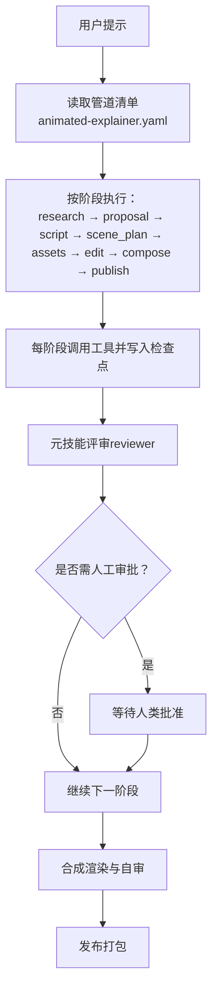
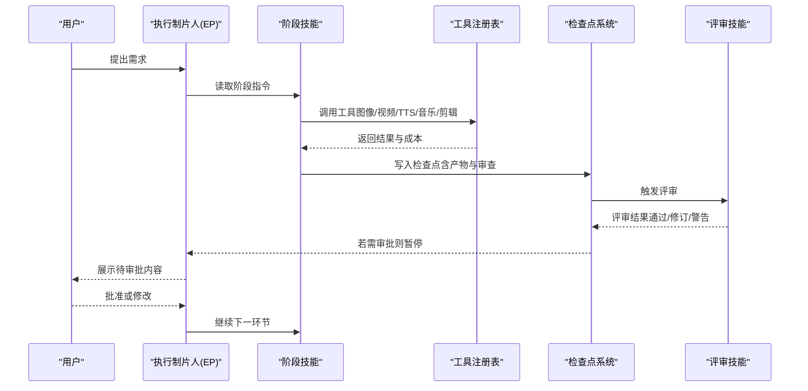
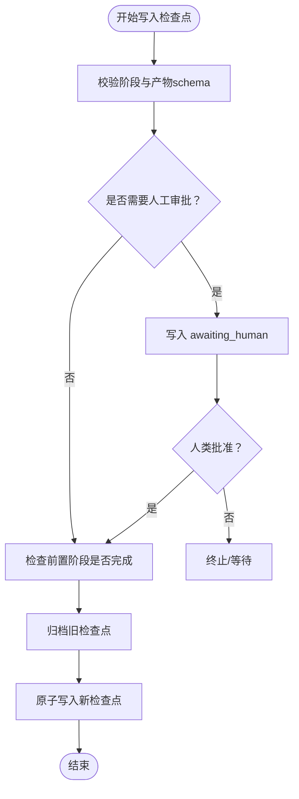
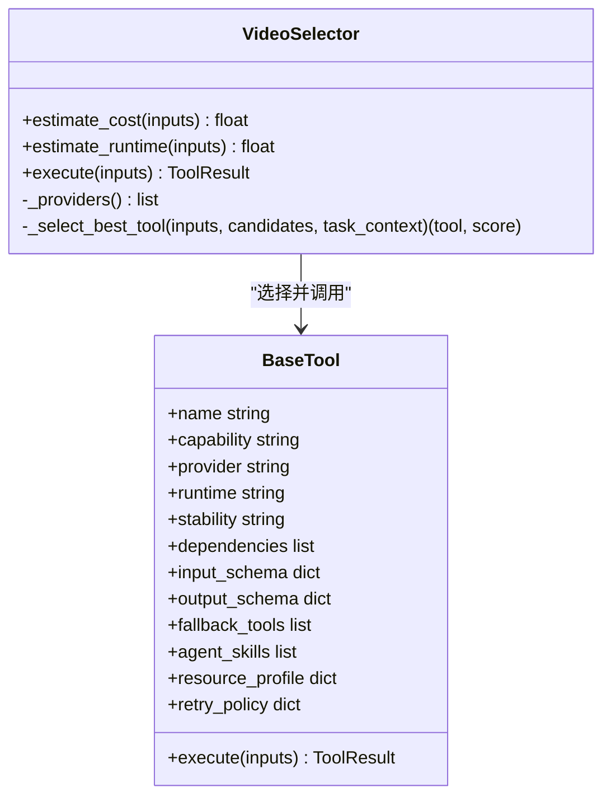
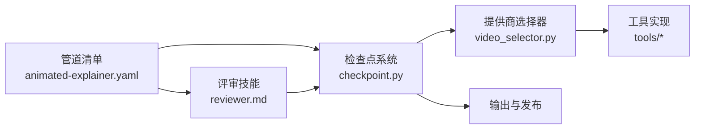

# 动画解释器管道

<cite>
**本文引用的文件**
- [README.md](file://README.md)
- [ARCHITECTURE.md](file://docs/ARCHITECTURE.md)
- [animated-explainer.yaml](file://pipeline_defs/animated-explainer.yaml)
- [checkpoint.py](file://lib/checkpoint.py)
- [config_model.py](file://lib/config_model.py)
- [video_selector.py](file://tools/video/video_selector.py)
- [reviewer.md](file://skills/meta/reviewer.md)
- [animation-runtime-selector.md](file://skills/meta/animation-runtime-selector.md)
- [hyperframes.md](file://skills/core/hyperframes.md)
</cite>

## 目录
1. [简介](#简介)
2. [项目结构](#项目结构)
3. [核心组件](#核心组件)
4. [架构总览](#架构总览)
5. [详细组件分析](#详细组件分析)
6. [依赖关系分析](#依赖关系分析)
7. [性能与成本优化](#性能与成本优化)
8. [故障排查指南](#故障排查指南)
9. [结论](#结论)
10. [附录](#附录)

## 简介
本文件面向“动画解释器管道”（Animated Explainer Pipeline）的完整使用文档，围绕研究优先理念展开：从前期调研、概念提案、脚本创作、场景规划、素材生成、编辑决策、合成渲染到发布打包的全流程说明。每个阶段均明确目标、输入输出、质量控制标准与人工审批点；并提供动画风格选择、技术选型与成本优化的最佳实践，辅以实际项目案例与常见问题解决方案。

该管道的核心理念是“先研究再生产”，在花费任何预算之前完成选题调研、多方案提案与成本估算，并在关键创意节点设置强制人工审批，确保最终产出既符合交付承诺又具备可审计的质量保障。

## 项目结构
OpenMontage 采用“清单 + 技能 + 工具”的分层组织方式：
- 管道清单（YAML）定义阶段顺序、产物、可用工具、审查重点与成功标准
- 技能（Markdown）指导智能体在每个阶段如何执行、如何自检、如何呈现给人类审批
- 工具（Python）提供具体能力（图像/视频/TTS/音乐/剪辑/合成等），并通过评分选择器自动择优

图表来源
- [animated-explainer.yaml:61-270](file://pipeline_defs/animated-explainer.yaml#L61-L270)
- [ARCHITECTURE.md:9-27](file://docs/ARCHITECTURE.md#L9-L27)

章节来源
- [README.md:356-444](file://README.md#L356-L444)
- [ARCHITECTURE.md:31-76](file://docs/ARCHITECTURE.md#L31-L76)

## 核心组件
- 管道清单：定义阶段、产物、工具、审查焦点与成功标准
- 检查点系统：持久化阶段状态、强制前置条件与人工审批门
- 元评审技能：对每个阶段产物进行 schema 校验、质量评估与合规性检查
- 提供商选择器：基于多维评分自动选择最优工具（视频/图像/TTS/音乐）
- 配置模型：统一加载运行时配置（预算、检查点策略、输出参数等）

章节来源
- [animated-explainer.yaml:61-270](file://pipeline_defs/animated-explainer.yaml#L61-L270)
- [checkpoint.py:243-564](file://lib/checkpoint.py#L243-L564)
- [reviewer.md:21-143](file://skills/meta/reviewer.md#L21-L143)
- [video_selector.py:294-440](file://tools/video/video_selector.py#L294-L440)
- [config_model.py:15-93](file://lib/config_model.py#L15-L93)

## 架构总览
OpenMontage 以“智能体编排”为核心：没有 Python 运行期编排器，LLM 编码助手作为控制面，读取清单与技能，调用工具，写入检查点，并在关键节点请求人类审批。

图表来源
- [ARCHITECTURE.md:9-27](file://docs/ARCHITECTURE.md#L9-L27)
- [checkpoint.py:422-564](file://lib/checkpoint.py#L422-L564)
- [reviewer.md:21-143](file://skills/meta/reviewer.md#L21-L143)

## 详细组件分析

### 阶段一：前期调研（research）
- 目标：建立主题知识图谱，收集数据点、受众问题、竞品与视觉参考，形成结构化研究简报
- 输入：主题/想法、可选参考视频
- 输出：research_brief（至少包含数据点、角度、引用来源）
- 质量控制：
  - 覆盖至少3个现有作品与3个不同视角
  - 数据点具体且可溯源，引用不少于5条
- 人工审批：默认关闭（不阻塞），但建议审阅以确保方向正确

章节来源
- [animated-explainer.yaml:64-81](file://pipeline_defs/animated-explainer.yaml#L64-L81)

### 阶段二：概念提案（proposal）
- 目标：基于研究提出多个差异化概念，给出制作计划、成本估算与渲染器/运行时选择
- 输入：research_brief
- 输出：proposal_packet（含 selected_concept、production_plan、cost_estimate、approval）
- 质量控制：
  - 概念之间结构/钩子/受众差异明显
  - 成本明细逐项列出，体现质量/成本权衡
  - 必须记录 render_runtime_selection 决策（Remotion vs HyperFrames）
- 人工审批：必须（human_approval_default=true）

章节来源
- [animated-explainer.yaml:82-115](file://pipeline_defs/animated-explainer.yaml#L82-L115)
- [animation-runtime-selector.md:54-72](file://skills/meta/animation-runtime-selector.md#L54-L72)

### 阶段三：脚本创作（script）
- 目标：将已批准的概念转化为动画节拍脚本，预留运动、调度与停顿空间
- 输入：proposal_packet（selected_concept）、可选 research_brief
- 输出：script（分段增强提示、发音指引、时长匹配）
- 质量控制：
  - 字数与目标时长匹配（±10%）
  - 增强提示密度合理（约每8-10秒一个）
  - 叙事弧线清晰（钩子→铺垫→推进→高潮→落点）
- 人工审批：必须

章节来源
- [animated-explainer.yaml:118-139](file://pipeline_defs/animated-explainer.yaml#L118-L139)

### 阶段四：场景规划（scene_plan）
- 目标：将脚本映射为可视化场景序列，确保类型多样、资产可行、遵循剧本风格
- 输入：script、可选 proposal_packet
- 输出：scene_plan（场景类型、描述、时长、所需资产）
- 质量控制：
  - 无空白覆盖，避免连续3+相同场景类型
  - 所有 required_asset 对应生产计划中的工具
  - 幻灯片风险评分（slideshow risk）达标
- 人工审批：必须

章节来源
- [animated-explainer.yaml:140-159](file://pipeline_defs/animated-explainer.yaml#L140-L159)
- [reviewer.md:177-200](file://skills/meta/reviewer.md#L177-L200)

### 阶段五：素材生成（assets）
- 目标：根据场景计划生成配音、图像/视频、数学动画、图表、代码片段、音乐等
- 输入：scene_plan、script、可选 proposal_packet
- 输出：asset_manifest（路径、来源工具、场景关联）
- 质量控制：
  - 所有文件存在，配音覆盖全部脚本段落
  - 音色与表演计划一致，风格一致性良好
  - 总成本不超过批准预算
- 人工审批：必须

章节来源
- [animated-explainer.yaml:160-197](file://pipeline_defs/animated-explainer.yaml#L160-L197)

### 阶段六：编辑决策（edit）
- 目标：制定时间线剪辑计划，启用字幕、配置音乐避让、保证时间线无缝衔接
- 输入：scene_plan、asset_manifest、可选 script
- 输出：edit_decisions（剪辑入出点、字幕样式、音乐参数）
- 质量控制：
  - 所有剪辑引用有效资产
  - 字幕启用且风格符合剧本
  - 无时间线空隙或重叠
- 人工审批：默认关闭（可由策略调整）

章节来源
- [animated-explainer.yaml:198-218](file://pipeline_defs/animated-explainer.yaml#L198-L218)

### 阶段七：合成渲染（compose）
- 目标：使用选定的渲染器（Remotion/HyperFrames/FFmpeg）合成最终视频，并进行自审
- 输入：edit_decisions、asset_manifest、可选 scene_plan
- 输出：render_report、final_review
- 质量控制：
  - 输出可播放、时长误差±5%
  - 音频清晰、旁白/音乐平衡
  - 严格禁止无声切换渲染器（治理违规）
  - 若选择 HyperFrames，必须先 lint/validate
- 人工审批：默认关闭（由自审把关）

章节来源
- [animated-explainer.yaml:219-250](file://pipeline_defs/animated-explainer.yaml#L219-L250)
- [hyperframes.md:188-228](file://skills/core/hyperframes.md#L188-L228)

### 阶段八：发布打包（publish）
- 目标：准备SEO元数据、章节标记、导出包结构
- 输入：render_report、final_review、可选 proposal_packet
- 输出：publish_log（平台发布条目）
- 质量控制：
  - SEO元数据完整且关键词丰富
  - 章节标记齐全
  - 导出包结构正确
- 人工审批：必须

章节来源
- [animated-explainer.yaml:251-270](file://pipeline_defs/animated-explainer.yaml#L251-L270)

### 检查点与人工审批门
- 检查点写入时强制验证：
  - 阶段合法性、产物 schema 校验
  - 前置阶段必须已完成且已通过必要审批
  - 若阶段需要人工审批，未获批准不得写为 completed
- 历史归档：每次覆盖前归档旧检查点，保留审计轨迹

图表来源
- [checkpoint.py:243-564](file://lib/checkpoint.py#L243-L564)

章节来源
- [checkpoint.py:243-564](file://lib/checkpoint.py#L243-L564)
- [reviewer.md:102-108](file://skills/meta/reviewer.md#L102-L108)

### 提供商选择与成本优化
- 选择器评分维度：任务契合度（30%）、输出质量（20%）、控制功能（15%）、可靠性（15%）、成本效益（10%）、延迟（5%）、连续性（5%）
- 支持显式偏好与分数差距阈值，避免盲目替换
- 预算治理：预估→锁定→结算，支持观察/警告/硬性上限模式，单动作审批阈值默认$0.50，总预算默认$10

图表来源
- [video_selector.py:294-440](file://tools/video/video_selector.py#L294-L440)
- [ARCHITECTURE.md:102-167](file://docs/ARCHITECTURE.md#L102-L167)

章节来源
- [README.md:664-688](file://README.md#L664-L688)
- [video_selector.py:294-440](file://tools/video/video_selector.py#L294-L440)
- [ARCHITECTURE.md:290-318](file://docs/ARCHITECTURE.md#L290-L318)

### 渲染器与运行时选择
- 提案阶段选择 render_runtime（Remotion 或 HyperFrames），并在决策日志中记录
- 编辑阶段携带 render_runtime 不变，合成阶段严格按此路由
- 若运行时不可用，必须上报而非静默替换；HyperFrames 需满足 Node.js≥22、FFmpeg、npx 等前置条件

章节来源
- [animation-runtime-selector.md:54-72](file://skills/meta/animation-runtime-selector.md#L54-L72)
- [hyperframes.md:188-228](file://skills/core/hyperframes.md#L188-L228)
- [ARCHITECTURE.md:448-475](file://docs/ARCHITECTURE.md#L448-L475)

## 依赖关系分析
- 管道清单驱动阶段顺序与产物契约
- 检查点系统约束阶段推进与审批流
- 评审技能贯穿各阶段，确保 schema、风格、质量与交付承诺一致
- 提供商选择器解耦具体实现，支持降级与回退
- 配置模型集中管理运行时参数与预算策略

图表来源
- [animated-explainer.yaml:61-270](file://pipeline_defs/animated-explainer.yaml#L61-L270)
- [checkpoint.py:243-564](file://lib/checkpoint.py#L243-L564)
- [reviewer.md:21-143](file://skills/meta/reviewer.md#L21-L143)
- [video_selector.py:294-440](file://tools/video/video_selector.py#L294-L440)

章节来源
- [ARCHITECTURE.md:170-241](file://docs/ARCHITECTURE.md#L170-L241)

## 性能与成本优化
- 供应商选择：利用评分器在多候选中择优，必要时设置 preferred_provider_gap 限制偏好替换范围
- 预算治理：
  - 预估阶段即显示成本，锁定资金后再执行
  - 开启 per-action approval 防止意外支出
  - 总预算 cap 保护整体开销
- 渲染器选择：
  - Remotion 适合数据驱动解释器、字幕与既有 React 场景栈
  - HyperFrames 适合动效密集型、HTML/GSAP 原生表达、网站转视频、注册块（数据图、纹理、着色器过渡）
- 资源复用：在动画模式中采用重复母题、布局系统与模板复用，减少重复生成成本
- 本地优先：优先使用免费/本地工具（Piper TTS、开源素材库、本地视频/图像模型）降低云成本

章节来源
- [README.md:282-305](file://README.md#L282-L305)
- [README.md:664-688](file://README.md#L664-L688)
- [ARCHITECTURE.md:448-475](file://docs/ARCHITECTURE.md#L448-L475)

## 故障排查指南
- 审批门被阻断：
  - 检查 manifest 中 human_approval_default 是否为 true
  - 确认检查点未跳过审批直接写 completed
- 运行时不可用：
  - HyperFrames 需 Node.js≥22、FFmpeg、npx；否则应上报而非静默替换
- 幻灯片风险过高：
  - 在 scene_plan/edit 阶段重新设计镜头语言，避免重复布局与弱意图
- 交付承诺违反：
  - 检查 motion-led 承诺下运动剪辑比例是否达标
  - 审核 final_review 的技术探针与视觉抽检
- 预算超支：
  - 检查 CostTracker 模式（observe/warn/cap）与单动作审批阈值
  - 核对 estimate/reserve/reconcile 流程是否完整

章节来源
- [checkpoint.py:243-564](file://lib/checkpoint.py#L243-L564)
- [reviewer.md:177-200](file://skills/meta/reviewer.md#L177-L200)
- [hyperframes.md:188-228](file://skills/core/hyperframes.md#L188-L228)
- [ARCHITECTURE.md:290-318](file://docs/ARCHITECTURE.md#L290-L318)

## 结论
动画解释器管道以“研究优先”和“质量门禁”为核心，通过清单化的阶段定义、严格的检查点与评审机制、以及智能化的提供商选择与预算治理，实现了从创意到成片的端到端自动化生产。配合 Remotion/HyperFrames 双渲染器与丰富的工具生态，既能高效产出教育类解释视频，也能支撑品牌与产品级高质量内容。建议在项目中坚持“先研究、再提案、后生产”的流程，充分利用人工审批与自审机制，确保最终交付物兼具创意质量与成本可控。

## 附录

### 实际项目案例
- “THE LAST BANANA”：6段 Kling v3 生成运动片段 + Google Chirp 旁白 + 免版税钢琴曲 + TikTok 级词级字幕 + Remotion 合成，总成本约 $1.33
- “Reimagine Your Universe”：5段生成运动场景 + 稀疏旁白 + Pixabay 配乐 + HyperFrames 定制合成，总成本约 $4
- “One Prompt Built This Complete 3D World”：纹理化 3D 资产 + 电影级布光 + 氛围音乐 + 计划相机路径，全程 OpenMontage 编排

章节来源
- [README.md:87-118](file://README.md#L87-L118)

### 常见问答
- 问：如何在零 API Key 情况下完成制作？
  - 答：使用 Piper TTS、Archive.org/NASA/Wikimedia 免费素材、Remotion/HyperFrames 本地渲染与 FFmpeg 后期，即可产出真实视频
- 问：何时选择 Remotion 还是 HyperFrames？
  - 答：数据驱动解释器、字幕与既有 React 场景栈选 Remotion；动效密集、HTML/GSAP 原生表达、网站转视频、注册块与可编辑 3D 世界选 HyperFrames
- 问：如何避免“动画PPT”？
  - 答：在 scene_plan/edit 阶段运行幻灯片风险评分，提升镜头意图与运动合理性，避免重复布局与过度文字卡片

章节来源
- [README.md:282-305](file://README.md#L282-L305)
- [reviewer.md:177-200](file://skills/meta/reviewer.md#L177-L200)