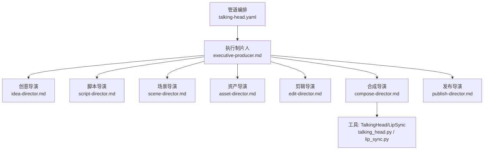
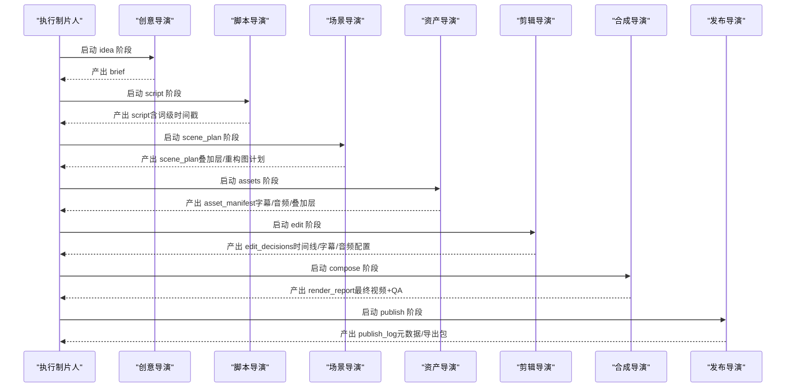
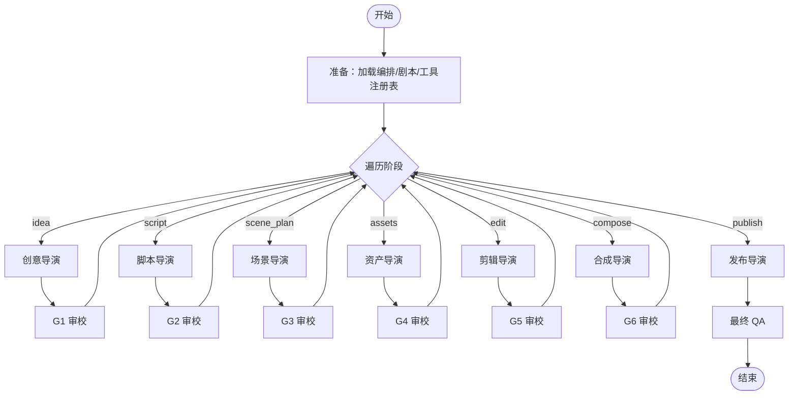
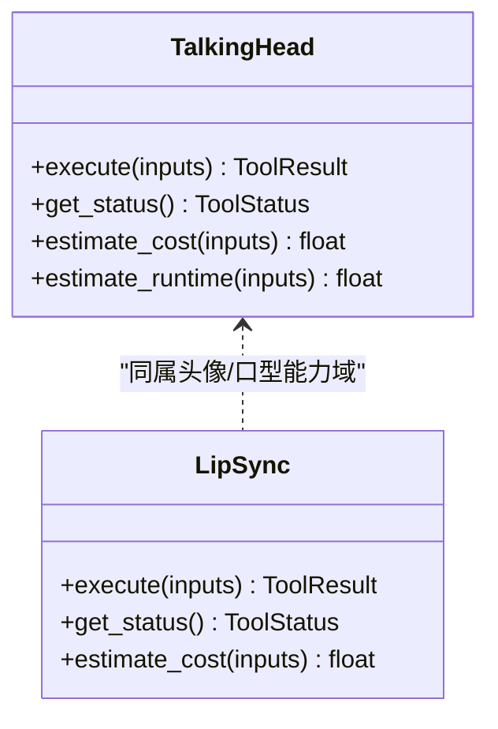
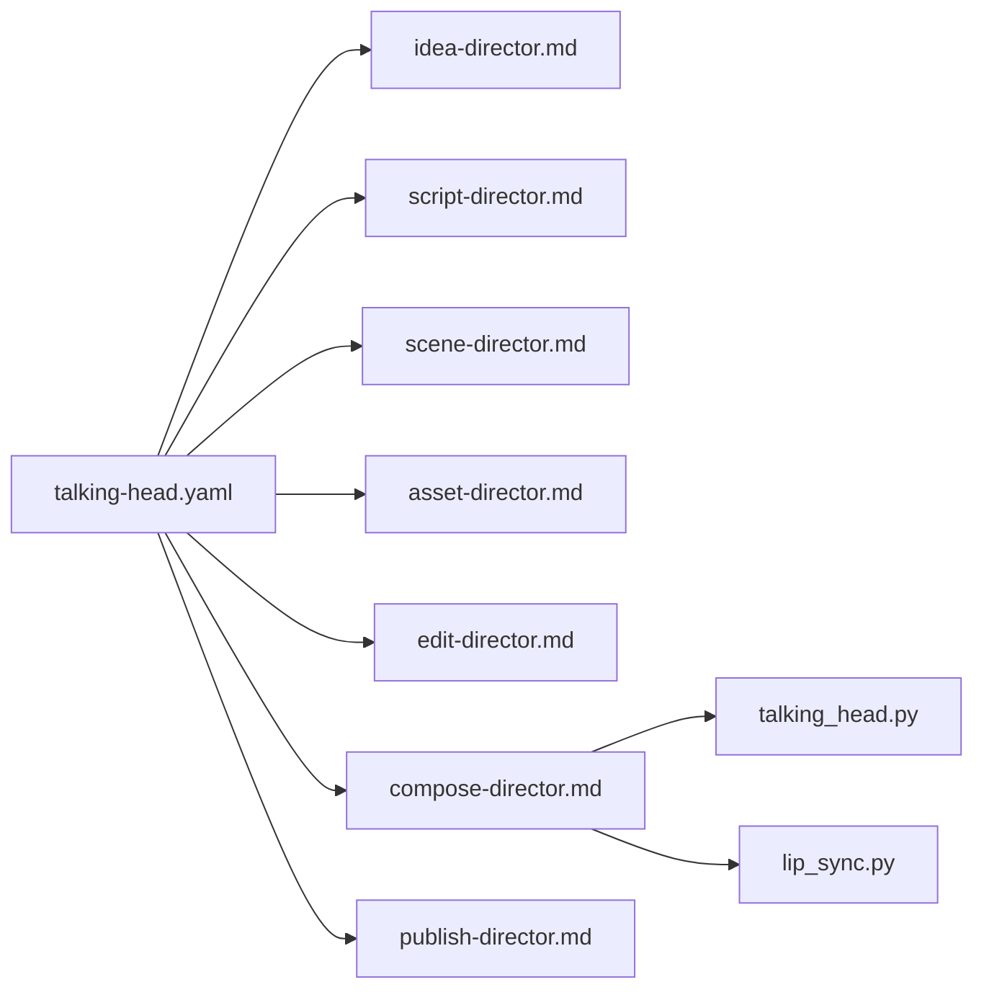

# 对话头管道

<cite>
**本文引用的文件**
- [talking-head.yaml](file://pipeline_defs/talking-head.yaml)
- [executive-producer.md](file://skills/pipelines/talking-head/executive-producer.md)
- [idea-director.md](file://skills/pipelines/talking-head/idea-director.md)
- [script-director.md](file://skills/pipelines/talking-head/script-director.md)
- [scene-director.md](file://skills/pipelines/talking-head/scene-director.md)
- [asset-director.md](file://skills/pipelines/talking-head/asset-director.md)
- [edit-director.md](file://skills/pipelines/talking-head/edit-director.md)
- [compose-director.md](file://skills/pipelines/talking-head/compose-director.md)
- [publish-director.md](file://skills/pipelines/talking-head/publish-director.md)
- [talking_head.py](file://tools/avatar/talking_head.py)
- [lip_sync.py](file://tools/avatar/lip_sync.py)
</cite>

## 目录
1. [简介](#简介)
2. [项目结构](#项目结构)
3. [核心组件](#核心组件)
4. [架构总览](#架构总览)
5. [详细组件分析](#详细组件分析)
6. [依赖关系分析](#依赖关系分析)
7. [性能与成本优化](#性能与成本优化)
8. [故障排查指南](#故障排查指南)
9. [结论](#结论)
10. [附录：场景最佳实践](#附录：场景最佳实践)

## 简介
本指南面向使用 OpenMontage 的“对话头管道”（Talking Head）进行 AI 驱动的人物对话视频制作。内容覆盖人物形象设定、语音合成、口型同步、背景设置与后期处理，并给出不同 AI 提供商的选择标准、音色配置与表情控制技巧；同时提供教育视频、产品介绍、新闻播报等应用场景的最佳实践，以及性能优化与成本控制建议。

## 项目结构
对话头管道以 YAML 编排定义为核心，串联多个导演技能（Director Skills），并通过工具层完成转录、字幕、音视频增强、渲染与发布。关键路径如下：
- 管道编排：pipeline_defs/talking-head.yaml
- 导演技能：skills/pipelines/talking-head/*
- 工具实现：tools/avatar/*（头像生成与口型同步）、tools/audio/*（TTS/音乐/混音）、tools/video/*（合成/转码/特效）

**图表来源**
- [talking-head.yaml:1-229](file://pipeline_defs/talking-head.yaml#L1-L229)
- [executive-producer.md:1-447](file://skills/pipelines/talking-head/executive-producer.md#L1-L447)
- [idea-director.md:1-75](file://skills/pipelines/talking-head/idea-director.md#L1-L75)
- [script-director.md:1-77](file://skills/pipelines/talking-head/script-director.md#L1-L77)
- [scene-director.md:1-253](file://skills/pipelines/talking-head/scene-director.md#L1-L253)
- [asset-director.md:1-218](file://skills/pipelines/talking-head/asset-director.md#L1-L218)
- [edit-director.md:1-77](file://skills/pipelines/talking-head/edit-director.md#L1-L77)
- [compose-director.md:1-478](file://skills/pipelines/talking-head/compose-director.md#L1-L478)
- [publish-director.md:1-62](file://skills/pipelines/talking-head/publish-director.md#L1-L62)
- [talking_head.py:1-259](file://tools/avatar/talking_head.py#L1-L259)
- [lip_sync.py:1-232](file://tools/avatar/lip_sync.py#L1-L232)

**章节来源**
- [talking-head.yaml:1-229](file://pipeline_defs/talking-head.yaml#L1-L229)

## 核心组件
- 执行制片人（Executive Producer）：维护全局状态、预算、审校门控、跨阶段校验与回退策略，确保字幕与语音对齐、音频质量与视觉一致性。
- 创意导演（Idea Director）：基于原始素材构建 Brief，锁定目标平台与时长，选择渲染运行时（Remotion 优先）。
- 脚本导演（Script Director）：使用 ASR 获取词级时间戳，按主题切分段落，产出结构化脚本。
- 场景导演（Scene Director）：分析画面（绿幕/蓝幕检测、人脸位置、光照），规划叠加层（图表、卡片、标题等）与重构图策略。
- 资产导演（Asset Director）：生成字幕、提取与降噪音频、选择背景音乐、生成叠加层资源与清单。
- 剪辑导演（Edit Director）：应用静音裁剪/变速、定义主片段、配置字幕与音频轨道。
- 合成导演（Compose Director）：执行增强链（人脸/眼部/调色/音频增强）、自动重构图、烧录逐字高亮字幕、绿幕合成、多段拼接、混音与最终编码。
- 发布导演（Publish Director）：生成元数据、缩略图概念与导出包。

**章节来源**
- [executive-producer.md:1-447](file://skills/pipelines/talking-head/executive-producer.md#L1-L447)
- [idea-director.md:1-75](file://skills/pipelines/talking-head/idea-director.md#L1-L75)
- [script-director.md:1-77](file://skills/pipelines/talking-head/script-director.md#L1-L77)
- [scene-director.md:1-253](file://skills/pipelines/talking-head/scene-director.md#L1-L253)
- [asset-director.md:1-218](file://skills/pipelines/talking-head/asset-director.md#L1-L218)
- [edit-director.md:1-77](file://skills/pipelines/talking-head/edit-director.md#L1-L77)
- [compose-director.md:1-478](file://skills/pipelines/talking-head/compose-director.md#L1-L478)
- [publish-director.md:1-62](file://skills/pipelines/talking-head/publish-director.md#L1-L62)

## 架构总览
对话头管道采用“串行编排 + 门控审校”的架构。执行制片人在每个阶段后执行严格的质量门禁，必要时将工作退回上游修正，避免错误传播。

**图表来源**
- [talking-head.yaml:42-229](file://pipeline_defs/talking-head.yaml#L42-L229)
- [executive-producer.md:92-192](file://skills/pipelines/talking-head/executive-producer.md#L92-L192)

## 详细组件分析

### 执行制片人（Executive Producer）
- 职责：维护累计状态（素材信息、预算、各阶段产物、ASR 词级片段、字幕偏移量、增强记录等），在每个阶段后进行跨阶段检查（如字幕同步、音频质量、画面完整性），支持“退回修正”和“发送回上游”机制。
- 关键规则：每阶段最多修订次数限制、最大退回次数、预算上限、超时保护；最终 QA 对字幕同步、音频响度、分辨率、时长等进行综合验证。

**图表来源**
- [executive-producer.md:92-192](file://skills/pipelines/talking-head/executive-producer.md#L92-L192)
- [executive-producer.md:194-361](file://skills/pipelines/talking-head/executive-producer.md#L194-L361)

**章节来源**
- [executive-producer.md:1-447](file://skills/pipelines/talking-head/executive-producer.md#L1-L447)

### 创意导演（Idea Director）
- 输入：原始视频素材
- 输出：Brief（标题、钩子、要点、基调、风格、目标平台、目标时长）
- 运行时约束：在对话头管道中优先使用 Remotion（TalkingHead + 逐字字幕），HyperFrames 暂不可用。

**章节来源**
- [idea-director.md:1-75](file://skills/pipelines/talking-head/idea-director.md#L1-L75)

### 脚本导演（Script Director）
- 输入：Brief + 原始视频
- 过程：ASR 词级转录 → 按主题/停顿切分 → 为每段添加增强提示与说话人备注 → 产出结构化脚本
- 关键点：词级时间戳是后续字幕与编辑的“唯一事实源”。

**章节来源**
- [script-director.md:1-77](file://skills/pipelines/talking-head/script-director.md#L1-L77)

### 场景导演（Scene Director）
- 输入：脚本 + Brief
- 过程：采样帧与直方图分析判断绿幕/蓝幕与光照；定位人脸安全区；提出叠加层方案（术语卡、统计卡、对比、图表、KPI、进度条、标题、引用、下三分之一等）；规划重构图与静音裁剪策略。
- 输出：scene_plan（基础场景 + 叠加层场景 + 增强链决策 + 预估时长）

**章节来源**
- [scene-director.md:1-253](file://skills/pipelines/talking-head/scene-director.md#L1-L253)

### 资产导演（Asset Director）
- 输入：scene_plan + script
- 过程：生成字幕（SRT/ASS，带词级时间）→ 提取与降噪音频 → 选择背景音乐（本地库或在线搜索）→ 生成叠加层资源（Remotion 组件 JSON 片段）→ 构建资产清单
- 关键点：先做“英雄场景样本”确认风格，再批量生成，避免方向性返工。

**章节来源**
- [asset-director.md:1-218](file://skills/pipelines/talking-head/asset-director.md#L1-L218)

### 剪辑导演（Edit Director）
- 输入：scene_plan + asset_manifest + script
- 过程：应用静音裁剪（remove/speed_up）→ 定义主片段（保留必要内容）→ 配置字幕样式与位置 → 配置音频轨道（人声/背景音乐/ducking）→ 规划增强叠加层的时间点
- 输出：edit_decisions（时间线、字幕、音频配置）

**章节来源**
- [edit-director.md:1-77](file://skills/pipelines/talking-head/edit-director.md#L1-L77)

### 合成导演（Compose Director）
- 输入：edit_decisions + asset_manifest
- 过程：
  - 预检：静音标记、ASR 低置信度词、常见误识纠正字典、绿幕标志
  - 增强链：人脸增强 → 眼部增强 → 调色 → 音频增强
  - 可选：变速、自动重构图（根据平台比例）
  - 字幕：优先 Remotion 逐字高亮字幕（失败时回退 FFmpeg ASS）
  - 叠加层：与字幕在同一 Remotion 通道内渲染
  - 绿幕合成：抠像 → 渲染动画背景 → 合成 → 烧字幕 → 混音
  - 多段拼接：video_stitch（过渡类型选择）
  - 混音：segmented_music 或 duck/full_mix
  - 最终编码：按平台媒体规格两遍编码，控制文件大小
  - 视觉 QA：抽样帧审查、probe 校验、音频电平检查
- 输出：render_report（路径、格式、分辨率、时长、文件大小、QA 结果）

**章节来源**
- [compose-director.md:1-478](file://skills/pipelines/talking-head/compose-director.md#L1-L478)

### 发布导演（Publish Director）
- 输入：render_report + brief
- 过程：生成平台元数据（标题、描述、标签、章节）、缩略图概念、导出包（视频+元数据+描述+章节+缩略图）
- 输出：publish_log

**章节来源**
- [publish-director.md:1-62](file://skills/pipelines/talking-head/publish-director.md#L1-L62)

### 头像生成与口型同步（工具层）
- TalkingHead：基于 SadTalker/MuseTalk 的“照片驱动说话”能力，支持表达式强度、静止模式、预处理方式等参数；用于从静态人像生成口型驱动视频。
- LipSync：基于 Wav2Lip/Wav2Lip-GAN 的口型同步，用于替换原声后的唇形匹配（本地 GPU 推理）。

**图表来源**
- [talking_head.py:29-105](file://tools/avatar/talking_head.py#L29-L105)
- [lip_sync.py:29-108](file://tools/avatar/lip_sync.py#L29-L108)

**章节来源**
- [talking_head.py:1-259](file://tools/avatar/talking_head.py#L1-L259)
- [lip_sync.py:1-232](file://tools/avatar/lip_sync.py#L1-L232)

## 依赖关系分析
- 编排到技能：talking-head.yaml 定义了阶段顺序、所需技能、可用工具与成功标准。
- 技能到工具：各导演技能通过工具注册表调用具体能力（transcriber、subtitle_gen、audio_mixer、video_compose、remotion_caption_burn、green_screen_processor、auto_reframe、silence_cutter、video_trimmer、visual_qa 等）。
- 工具到外部模型：TalkingHead/LipSync 依赖本地模型与命令行工具（SadTalker/Wav2Lip、ffmpeg）。

**图表来源**
- [talking-head.yaml:17-229](file://pipeline_defs/talking-head.yaml#L17-L229)
- [compose-director.md:1-478](file://skills/pipelines/talking-head/compose-director.md#L1-L478)
- [talking_head.py:1-259](file://tools/avatar/talking_head.py#L1-L259)
- [lip_sync.py:1-232](file://tools/avatar/lip_sync.py#L1-L232)

**章节来源**
- [talking-head.yaml:17-229](file://pipeline_defs/talking-head.yaml#L17-L229)

## 性能与成本优化
- 预算与限额：默认预算较低（主要为基础处理），每阶段最多修订次数与退回次数有限制，防止无限循环与超支。
- 渲染运行时：对话头管道优先 Remotion（TalkingHead + 逐字字幕），避免 HyperFrames 不兼容导致的返工。
- 字幕与时间轴：以词级时间戳为唯一事实源，减少字幕漂移；必要时构建纠正字典降低 ASR 误差。
- 增强链顺序：人脸增强 → 眼部增强 → 调色 → 音频增强；变速在增强之后、重构图之前；重构图后再烧字幕，保证字幕位置正确。
- 自动重构图：根据目标平台比例（竖屏/横屏/方形）自动跟踪人脸居中，避免裁切重要内容。
- 绿幕流程：先抠像 → 渲染动画背景 → 合成 → 烧字幕 → 混音，提升专业感。
- 最终编码：按平台规格两遍编码，控制文件大小与兼容性。
- 成本控制：优先本地工具（ffmpeg、Remotion、本地 TTS/音乐库），仅在必要时调用付费 API；对昂贵步骤（人脸/眼部增强、叠加层）进行必要性评估。

[本节为通用指导，无需特定文件引用]

## 故障排查指南
- 字幕不同步：检查 ASR 词级时间戳与字幕 cue 的偏移；若偏差超过阈值，退回资产阶段重新生成字幕或使用纠正字典。
- 音频问题：确认是否进行了降噪与响度归一化；背景音乐是否做了 ducking；最终编码是否符合目标响度。
- 画面问题：人脸增强过度或不自然；调色不一致；叠加层遮挡人脸；绿幕合成边缘伪影。
- 时长/分辨率不符：检查自动重构图与最终编码参数；确认 remotion_caption_burn 的帧数与尺寸来自实际探测。
- 工具不可用：确认环境变量与依赖安装（如 SADTALKER_PATH、WAV2LIP_PATH、ffmpeg）；查看工具状态返回。

**章节来源**
- [executive-producer.md:152-192](file://skills/pipelines/talking-head/executive-producer.md#L152-L192)
- [compose-director.md:26-64](file://skills/pipelines/talking-head/compose-director.md#L26-L64)
- [compose-director.md:154-187](file://skills/pipelines/talking-head/compose-director.md#L154-L187)
- [compose-director.md:275-333](file://skills/pipelines/talking-head/compose-director.md#L275-L333)
- [compose-director.md:391-457](file://skills/pipelines/talking-head/compose-director.md#L391-L457)
- [talking_head.py:111-125](file://tools/avatar/talking_head.py#L111-L125)
- [lip_sync.py:110-124](file://tools/avatar/lip_sync.py#L110-L124)

## 结论
对话头管道通过严格的阶段门控与跨阶段校验，确保从原始素材到最终成片的稳定性与可追溯性。以词级时间戳为核心的字幕与编辑链路，配合 Remotion 逐字高亮字幕与自动化增强链，能在教育、产品、新闻等多种场景中高效产出高质量对话头视频。结合本地优先的工具链与合理的预算/限额策略，可在保证质量的同时控制成本。

[本节为总结性内容，无需特定文件引用]

## 附录：场景最佳实践
- 教育视频
  - 重点：术语解释、数据可视化、步骤演示
  - 建议：叠加术语卡/统计卡/进度条；使用 bar_chart/line_chart/kpi_grid 展示数据；保持字幕清晰且位于底部；必要时使用自动重构图适配移动端。
- 产品介绍
  - 重点：卖点强调、对比展示、用户收益
  - 建议：使用 comparison/stat_card/callout 突出关键信息；背景音乐音量压低（ducking）；结尾加入 showcase card 汇总亮点。
- 新闻播报
  - 重点：权威感、节奏紧凑、信息密度高
  - 建议：hero_title/section_title 划分段落；lower_third 标注发言人身份；绿幕合成搭配动画背景；严格控制时长与文件大小。

[本节为通用指导，无需特定文件引用]