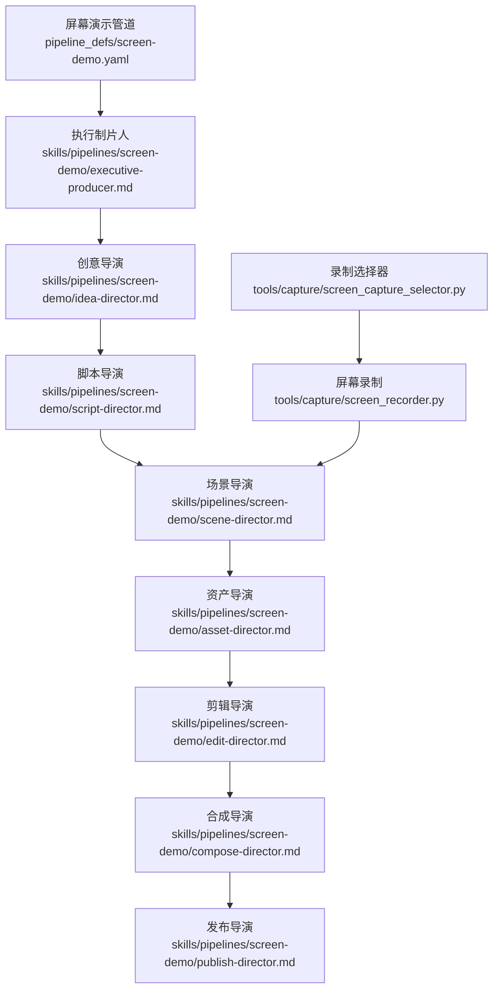
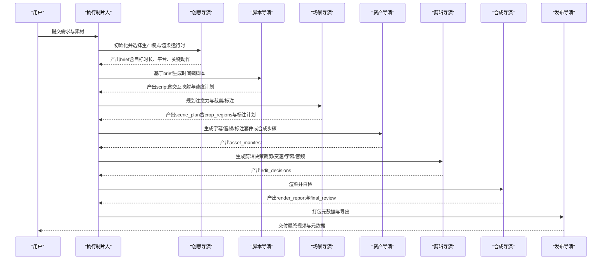
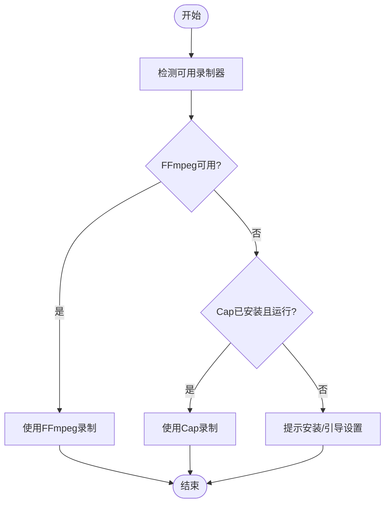
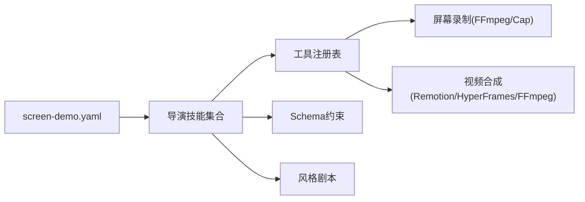

# 屏幕演示管道

<cite>
**本文引用的文件**
- [README.md](file://README.md)
- [screen-demo.yaml](file://pipeline_defs/screen-demo.yaml)
- [executive-producer.md](file://skills/pipelines/screen-demo/executive-producer.md)
- [idea-director.md](file://skills/pipelines/screen-demo/idea-director.md)
- [script-director.md](file://skills/pipelines/screen-demo/script-director.md)
- [scene-director.md](file://skills/pipelines/screen-demo/scene-director.md)
- [asset-director.md](file://skills/pipelines/screen-demo/asset-director.md)
- [edit-director.md](file://skills/pipelines/screen-demo/edit-director.md)
- [compose-director.md](file://skills/pipelines/screen-demo/compose-director.md)
- [publish-director.md](file://skills/pipelines/screen-demo/publish-director.md)
- [screen_recorder.py](file://tools/capture/screen_recorder.py)
- [screen_capture_selector.py](file://tools/capture/screen_capture_selector.py)
</cite>

## 目录
1. [简介](#简介)
2. [项目结构](#项目结构)
3. [核心组件](#核心组件)
4. [架构总览](#架构总览)
5. [详细组件分析](#详细组件分析)
6. [依赖关系分析](#依赖关系分析)
7. [性能与质量考量](#性能与质量考量)
8. [故障排查指南](#故障排查指南)
9. [结论](#结论)
10. [附录：最佳实践清单](#附录最佳实践清单)

## 简介
本手册面向“屏幕演示管道”，聚焦软件演示、产品教程与操作指导视频的制作流程。内容覆盖从脚本编写、镜头切换设计到用户体验优化的完整链路，包括屏幕录制、界面标注、鼠标动画、文字说明与专业配音。同时提供SaaS产品演示、内部培训视频与用户手册视频的最佳实践建议，帮助你在OpenMontage中高效产出高质量屏幕演示视频。

## 项目结构
屏幕演示管道由“编排定义 + 导演技能 + 采集工具”三部分构成：
- 编排定义：集中描述阶段、产物、评审关注点与成功标准。
- 导演技能：为每个阶段提供执行策略、质量门禁与常见陷阱提示。
- 采集工具：提供跨平台屏幕录制能力，并自动选择最优方案。

图表来源
- [screen-demo.yaml:1-247](file://pipeline_defs/screen-demo.yaml#L1-L247)
- [executive-producer.md:1-74](file://skills/pipelines/screen-demo/executive-producer.md#L1-L74)
- [idea-director.md:1-145](file://skills/pipelines/screen-demo/idea-director.md#L1-L145)
- [script-director.md:1-137](file://skills/pipelines/screen-demo/script-director.md#L1-L137)
- [scene-director.md:1-141](file://skills/pipelines/screen-demo/scene-director.md#L1-L141)
- [asset-director.md:1-176](file://skills/pipelines/screen-demo/asset-director.md#L1-L176)
- [edit-director.md:1-88](file://skills/pipelines/screen-demo/edit-director.md#L1-L88)
- [compose-director.md:1-200](file://skills/pipelines/screen-demo/compose-director.md#L1-L200)
- [publish-director.md:1-200](file://skills/pipelines/screen-demo/publish-director.md#L1-L200)
- [screen_recorder.py:1-395](file://tools/capture/screen_recorder.py#L1-L395)
- [screen_capture_selector.py:1-350](file://tools/capture/screen_capture_selector.py#L1-L350)

章节来源
- [screen-demo.yaml:1-247](file://pipeline_defs/screen-demo.yaml#L1-L247)
- [README.md:356-383](file://README.md#L356-L383)

## 核心组件
- 执行制片人（EP）：串联各阶段，维护累计状态与预算，设置跨阶段质量门禁，确保可读性、音频清晰度与节奏问题在昂贵合成前被拦截。
- 创意导演：确定生产模式（真实录制 vs 合成终端），锁定渲染运行时（Remotion/HyperFrames/FFmpeg），输出结构化brief。
- 脚本导演：将素材转化为时间戳驱动的操作脚本，建立交互映射与速度计划，保证旁白与可见动作同步。
- 场景导演：规划注意力移动，制定缩放裁剪策略、标注与遮罩计划，控制节奏与多画幅适配。
- 资产导演：生成字幕、清理音频、构建可复用标注套件；对合成终端模式生成步骤序列与旁白对齐。
- 剪辑导演：基于计划生成可执行的剪辑决策，明确裁剪关键帧、速度变化、字幕位置与音频处理。
- 合成导演：调用视频合成与混音工具完成最终渲染，进行自检与交付验证。
- 发布导演：整理元数据、章节标记与导出包，便于分发与检索。

章节来源
- [executive-producer.md:1-74](file://skills/pipelines/screen-demo/executive-producer.md#L1-L74)
- [idea-director.md:1-145](file://skills/pipelines/screen-demo/idea-director.md#L1-L145)
- [script-director.md:1-137](file://skills/pipelines/screen-demo/script-director.md#L1-L137)
- [scene-director.md:1-141](file://skills/pipelines/screen-demo/scene-director.md#L1-L141)
- [asset-director.md:1-176](file://skills/pipelines/screen-demo/asset-director.md#L1-L176)
- [edit-director.md:1-88](file://skills/pipelines/screen-demo/edit-director.md#L1-L88)
- [compose-director.md:1-200](file://skills/pipelines/screen-demo/compose-director.md#L1-L200)
- [publish-director.md:1-200](file://skills/pipelines/screen-demo/publish-director.md#L1-L200)

## 架构总览
屏幕演示管道的端到端流程如下：

图表来源
- [screen-demo.yaml:77-247](file://pipeline_defs/screen-demo.yaml#L77-L247)
- [executive-producer.md:32-74](file://skills/pipelines/screen-demo/executive-producer.md#L32-L74)

## 详细组件分析

### 录制与选择器：快速录制与专业录制
- FFmpeg录制器：跨平台原生录制，支持全屏/区域捕获、系统/麦克风音频，适合自动化流水线与快速录制。
- Cap录制器：具备摄像头画中画、光标高亮、内置编辑器等能力，适合追求专业效果的录制。
- 录制选择器：自动发现可用录制提供者，给出推荐与优劣对比，并在不可用时回退。

图表来源
- [screen_capture_selector.py:149-319](file://tools/capture/screen_capture_selector.py#L149-L319)
- [screen_recorder.py:176-253](file://tools/capture/screen_recorder.py#L176-L253)

章节来源
- [screen_capture_selector.py:1-350](file://tools/capture/screen_capture_selector.py#L1-L350)
- [screen_recorder.py:1-395](file://tools/capture/screen_recorder.py#L1-L395)

### 创意导演：生产模式与渲染运行时
- 生产模式：
  - real_capture：真实桌面/浏览器录屏，适合真实UI与不可预测行为。
  - synthetic_terminal：无录制，通过Remotion TerminalScene生成确定性终端动画，适合CLI/安装/配置流程。
- 渲染运行时：
  - real_capture：优先Remotion（叠加标注/字幕/转场），可选FFmpeg（纯拼接/裁剪）。
  - synthetic_terminal：仅Remotion。
  - synthetic_ui：Remotion或HyperFrames，需呈现两者并等待批准。
- 产出：schema有效的brief，包含目标时长、平台、关键动作、死区段、安全裁剪方向等。

章节来源
- [idea-director.md:1-145](file://skills/pipelines/screen-demo/idea-director.md#L1-L145)
- [screen-demo.yaml:22-41](file://pipeline_defs/screen-demo.yaml#L22-L41)

### 脚本导演：时间戳驱动的脚本与交互映射
- 根据旁白状态（有声/无声/部分）决定策略。
- 使用帧采样与转录工具建立交互映射：点击、输入、等待、结果时刻。
- 以“步骤”为单位组织脚本，每段说明“正在发生什么、为什么重要、如何标注/缩放/变速”。
- 明确速度计划：重要操作保持正常速度，重复/等待加速或裁剪。

章节来源
- [script-director.md:1-137](file://skills/pipelines/screen-demo/script-director.md#L1-L137)

### 场景导演：注意力与缩放裁剪策略
- 原则：只在需要时缩放，理解阶段保持稳定，重大步骤后重置到更广视角。
- 场景类型：屏幕录制、文本卡片、图示、过渡（谨慎使用）。
- 裁剪计划：记录section_id、起止时间、region、缩放级别、触发条件、过渡时长与理由。
- 标注克制：同一时刻不超过两个注意力提示，先于动作出现，动作后迅速移除。
- 多画幅适配：标注哪些片段可适配16:9/1:1/9:16，不能适配的明确说明。

章节来源
- [scene-director.md:1-141](file://skills/pipelines/screen-demo/scene-director.md#L1-L141)

### 资产导演：字幕、音频与标注套件
- 真实录制模式：生成字幕、清理音频、构建可复用标注套件（高亮框、箭头、步骤标签、按键徽章、模糊遮罩）。
- 合成终端模式：生成旁白与steps列表（命令/输出/暂停/提示），并通过时序校验确保对齐。
- 质量门禁：字幕存在且解析无误、音频时长匹配、标注套件覆盖计划、敏感信息遮蔽。

章节来源
- [asset-director.md:1-176](file://skills/pipelines/screen-demo/asset-director.md#L1-L176)

### 剪辑导演：可执行的剪辑决策
- 顺序：裁剪死区→变速→放置标注→设定字幕→音频处理→记录裁剪关键帧与备注。
- 规则：首秒内展示有用动作或结果；结果保持正常速度；避免过度运动；字幕与标注不冲突。
- 输出：schema有效的edit_decisions，包含cuts、overlays、subtitles、music、transitions及metadata细节。

章节来源
- [edit-director.md:1-88](file://skills/pipelines/screen-demo/edit-director.md#L1-L88)

### 合成与发布：渲染、自检与交付
- 合成：调用视频合成与混音工具，确保输出清晰、UI可读、音频干净；严格校验渲染运行时一致性。
- 发布：整理元数据、章节标记与导出包，便于分发与检索。

章节来源
- [screen-demo.yaml:194-247](file://pipeline_defs/screen-demo.yaml#L194-L247)
- [compose-director.md:1-200](file://skills/pipelines/screen-demo/compose-director.md#L1-L200)
- [publish-director.md:1-200](file://skills/pipelines/screen-demo/publish-director.md#L1-L200)

## 依赖关系分析
- 管道编排依赖导演技能与工具注册表；导演技能依赖schema约束与风格剧本。
- 录制阶段依赖FFmpeg/Cap；合成阶段依赖Remotion/HyperFrames/FFmpeg。
- 各阶段产物作为下游输入，形成严格的契约链。

图表来源
- [screen-demo.yaml:57-69](file://pipeline_defs/screen-demo.yaml#L57-L69)
- [screen_capture_selector.py:132-147](file://tools/capture/screen_capture_selector.py#L132-L147)

章节来源
- [screen-demo.yaml:57-69](file://pipeline_defs/screen-demo.yaml#L57-L69)
- [README.md:450-486](file://README.md#L450-L486)

## 性能与质量考量
- 节奏优化：识别并压缩安装、编译、加载等死区；重要结果保持正常速度。
- 可读性优先：缩放与标注仅在必要时使用，避免遮挡关键UI；字幕位置避开重要内容。
- 音频质量：去除键盘噪声与房间底噪，保留语音清晰度；必要时降低背景乐音量。
- 运行时一致性：合成阶段必须与提案一致，禁止静默切换渲染引擎。
- 质量门禁：每阶段均有人工审批与自动校验，失败即退回修订。

章节来源
- [executive-producer.md:9-20](file://skills/pipelines/screen-demo/executive-producer.md#L9-L20)
- [screen-demo.yaml:120-227](file://pipeline_defs/screen-demo.yaml#L120-L227)

## 故障排查指南
- 录制失败：检查FFmpeg是否安装、设备权限是否正确；若FFmpeg不可用，尝试Cap或手动录制后导入。
- 字幕错位：核对脚本时间戳与字幕时间轴；调整字幕区域以避免遮挡。
- 标注遮挡：重新规划标注位置与显示时长，确保不覆盖关键UI。
- 音频嘈杂：使用音频增强工具降噪与归一化；对加速段落降低无关噪音。
- 渲染失败：确认渲染运行时与提案一致；检查输出分辨率与编码参数；查看自检报告定位问题。

章节来源
- [screen_recorder.py:176-253](file://tools/capture/screen_recorder.py#L176-L253)
- [screen_capture_selector.py:280-319](file://tools/capture/screen_capture_selector.py#L280-L319)
- [screen-demo.yaml:194-227](file://pipeline_defs/screen-demo.yaml#L194-L227)

## 结论
屏幕演示管道通过“编排+导演+工具”的结构化方式，将脚本、镜头、标注、配音与合成整合为可重复、可审计的生产流程。借助严格的质量门禁与运行时治理，能够在不同模式下稳定产出高质量的软件演示、产品教程与操作指导视频。

## 附录：最佳实践清单
- 脚本编写
  - 以步骤为中心，明确“做什么、为什么、如何看”。
  - 为每个关键动作标注时间戳与处理方式（实时/加速/裁剪/高亮/缩放）。
  - 对无声素材提前规划字幕与标题卡，避免后期补救。
- 镜头切换设计
  - 只在必要时缩放；理解阶段保持稳定；重大步骤后重置到更广视角。
  - 标注克制：同一时刻不超过两个注意力提示；先现后动，动后即消。
  - 多画幅适配：提前评估16:9/1:1/9:16可行性，无法适配则单独制作。
- 用户体验优化
  - 首秒展示有用动作或结果；避免冗长开场。
  - 字幕与标注不冲突；敏感信息使用遮罩。
  - 音频清晰：降噪、归一化；加速段落降低无关噪音。
- SaaS产品演示
  - 聚焦单一工作流或功能；突出“aha”结果。
  - 使用步骤标签与按键徽章强化操作路径。
  - 对复杂流程拆分为章节，便于回放与检索。
- 内部培训视频
  - 以任务完成为导向；减少理论铺陈。
  - 对重复操作采用加速或裁剪；关键校验保持正常速度。
  - 提供配套字幕与步骤清单，便于离线学习。
- 用户手册视频
  - 以“问题-解决”为主线；每一步都对应可见结果。
  - 使用文本卡片总结要点；结尾提供下一步指引。
  - 导出包包含视频、字幕、截图与元数据，便于多渠道分发。