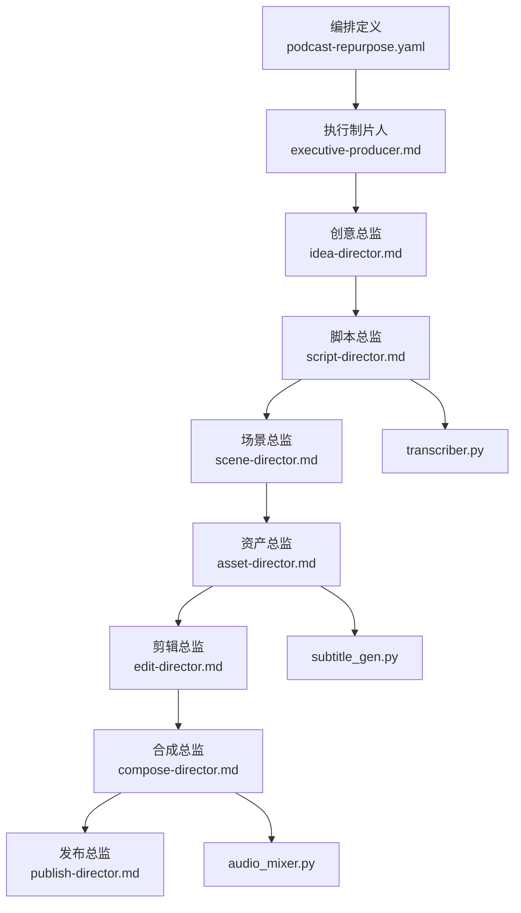
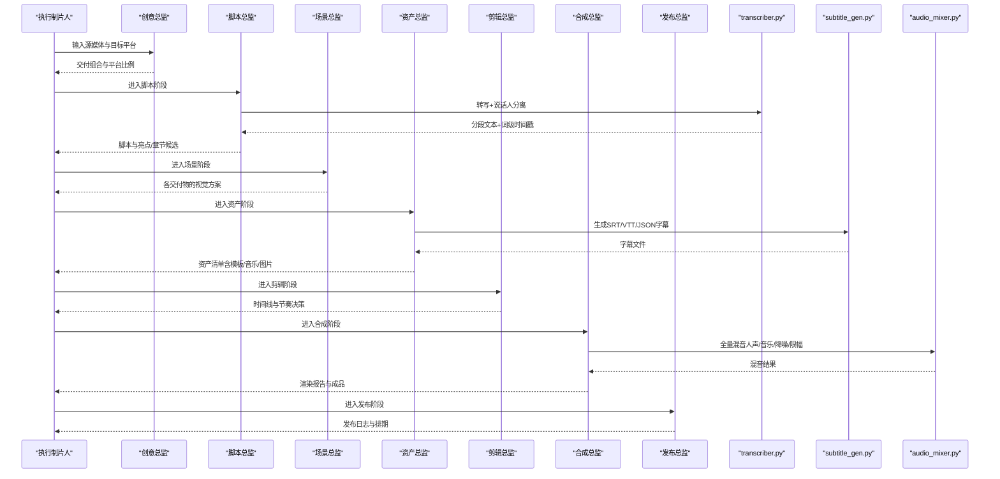
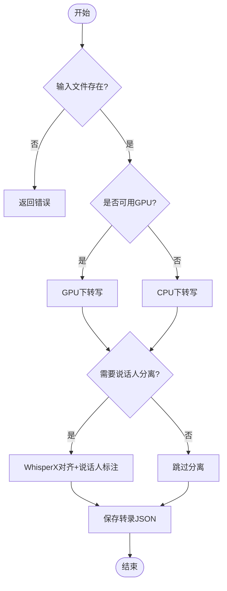
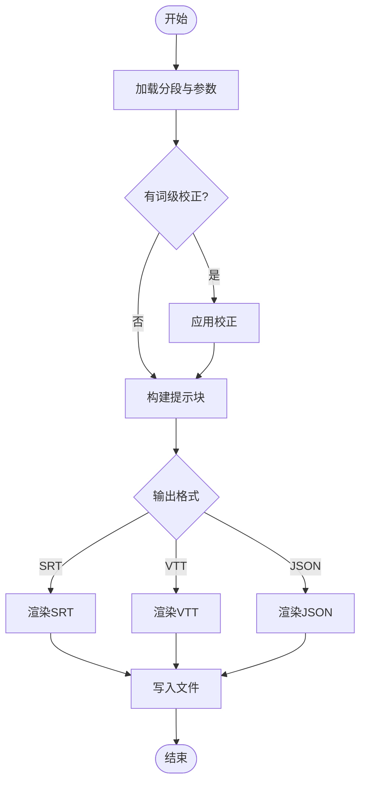
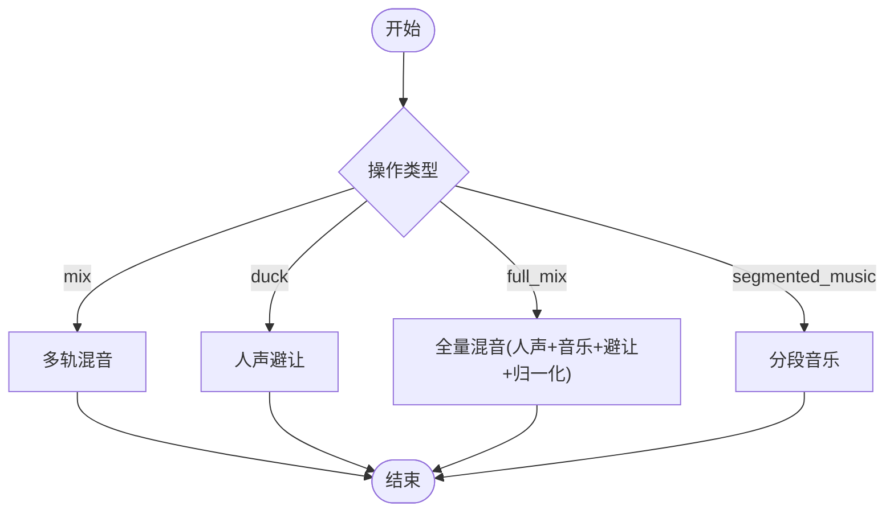
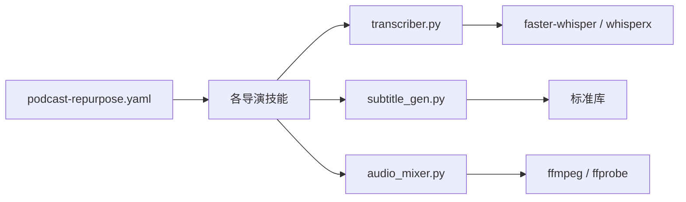

# 播客重制管道

<cite>
**本文引用的文件**
- [pipeline_defs/podcast-repurpose.yaml](file://pipeline_defs/podcast-repurpose.yaml)
- [skills/INDEX.md](file://skills/INDEX.md)
- [skills/pipelines/podcast-repurpose/executive-producer.md](file://skills/pipelines/podcast-repurpose/executive-producer.md)
- [skills/pipelines/podcast-repurpose/idea-director.md](file://skills/pipelines/podcast-repurpose/idea-director.md)
- [skills/pipelines/podcast-repurpose/script-director.md](file://skills/pipelines/podcast-repurpose/script-director.md)
- [skills/pipelines/podcast-repurpose/scene-director.md](file://skills/pipelines/podcast-repurpose/scene-director.md)
- [skills/pipelines/podcast-repurpose/asset-director.md](file://skills/pipelines/podcast-repurpose/asset-director.md)
- [skills/pipelines/podcast-repurpose/edit-director.md](file://skills/pipelines/podcast-repurpose/edit-director.md)
- [skills/pipelines/podcast-repurpose/compose-director.md](file://skills/pipelines/podcast-repurpose/compose-director.md)
- [skills/pipelines/podcast-repurpose/publish-director.md](file://skills/pipelines/podcast-repurpose/publish-director.md)
- [tools/analysis/transcriber.py](file://tools/analysis/transcriber.py)
- [tools/subtitle/subtitle_gen.py](file://tools/subtitle/subtitle_gen.py)
- [tools/audio/audio_mixer.py](file://tools/audio/audio_mixer.py)
</cite>

## 目录
1. [简介](#简介)
2. [项目结构](#项目结构)
3. [核心组件](#核心组件)
4. [架构总览](#架构总览)
5. [详细组件分析](#详细组件分析)
6. [依赖关系分析](#依赖关系分析)
7. [性能考量](#性能考量)
8. [故障排查指南](#故障排查指南)
9. [结论](#结论)
10. [附录](#附录)

## 简介
本指南面向需要将播客音频（或视频播客）高效转化为多平台可视内容的团队与个人，提供从“音频分析—关键片段提取—可视化生成—字幕制作—多平台适配”的端到端操作手册。基于仓库中的“播客重制管道”，通过七阶段串行编排与质量门禁，确保：
- 音频保真优先，不降级原始播客音质
- 精彩片段具备独立可理解性与强钩子
- 视觉呈现诚实、克制、可复用
- 输出物按平台规格标准化并附带发布元数据

## 项目结构
该管道由“编排定义 + 导演技能 + 工具链”构成：
- 编排定义：集中描述阶段、产物、工具、检查点与人类审批策略
- 导演技能：每个阶段一个“导演”负责产出与质量门禁
- 工具链：转录、字幕、混音、视频合成等可复用能力

图表来源
- [pipeline_defs/podcast-repurpose.yaml:1-213](file://pipeline_defs/podcast-repurpose.yaml#L1-L213)
- [skills/pipelines/podcast-repurpose/executive-producer.md:1-136](file://skills/pipelines/podcast-repurpose/executive-producer.md#L1-L136)
- [skills/pipelines/podcast-repurpose/idea-director.md:1-95](file://skills/pipelines/podcast-repurpose/idea-director.md#L1-L95)
- [skills/pipelines/podcast-repurpose/script-director.md:1-91](file://skills/pipelines/podcast-repurpose/script-director.md#L1-L91)
- [skills/pipelines/podcast-repurpose/scene-director.md:1-80](file://skills/pipelines/podcast-repurpose/scene-director.md#L1-L80)
- [skills/pipelines/podcast-repurpose/asset-director.md:1-115](file://skills/pipelines/podcast-repurpose/asset-director.md#L1-L115)
- [skills/pipelines/podcast-repurpose/edit-director.md:1-61](file://skills/pipelines/podcast-repurpose/edit-director.md#L1-L61)
- [skills/pipelines/podcast-repurpose/compose-director.md:1-72](file://skills/pipelines/podcast-repurpose/compose-director.md#L1-L72)
- [skills/pipelines/podcast-repurpose/publish-director.md:1-71](file://skills/pipelines/podcast-repurpose/publish-director.md#L1-L71)

章节来源
- [pipeline_defs/podcast-repurpose.yaml:1-213](file://pipeline_defs/podcast-repurpose.yaml#L1-L213)
- [skills/INDEX.md:202-213](file://skills/INDEX.md#L202-L213)

## 核心组件
- 执行制片人（EP）：串联七阶段，设置预算、时限、修订上限与跨阶段质量门禁
- 创意总监：识别源格式（纯音频/视频播客/混合），制定可落地的交付组合与平台比例
- 脚本总监：高质量转写、说话人分离、亮点排名、章节划分
- 场景总监：为每种交付物选择真实可用的视觉方案（说话人画面/字幕主导/引语卡片/音频波形）
- 资产总监：生成字幕、说话人卡、引语模板、可选主题图与音乐；先出“英雄片段”样例确认方向
- 剪辑总监：构建短片段时间线（前3秒钩子、即时字幕、清晰归属）、长片陪伴版保持轻触式视觉
- 合成总监：以音频保真优先进行渲染，按平台尺寸输出，校验字幕同步与品牌一致性
- 发布总监：为每段短视频附加回链到正片的元数据，规划发布顺序与平台文案

章节来源
- [skills/pipelines/podcast-repurpose/executive-producer.md:1-136](file://skills/pipelines/podcast-repurpose/executive-producer.md#L1-L136)
- [skills/pipelines/podcast-repurpose/idea-director.md:1-95](file://skills/pipelines/podcast-repurpose/idea-director.md#L1-L95)
- [skills/pipelines/podcast-repurpose/script-director.md:1-91](file://skills/pipelines/podcast-repurpose/script-director.md#L1-L91)
- [skills/pipelines/podcast-repurpose/scene-director.md:1-80](file://skills/pipelines/podcast-repurpose/scene-director.md#L1-L80)
- [skills/pipelines/podcast-repurpose/asset-director.md:1-115](file://skills/pipelines/podcast-repurpose/asset-director.md#L1-L115)
- [skills/pipelines/podcast-repurpose/edit-director.md:1-61](file://skills/pipelines/podcast-repurpose/edit-director.md#L1-L61)
- [skills/pipelines/podcast-repurpose/compose-director.md:1-72](file://skills/pipelines/podcast-repurpose/compose-director.md#L1-L72)
- [skills/pipelines/podcast-repurpose/publish-director.md:1-71](file://skills/pipelines/podcast-repurpose/publish-director.md#L1-L71)

## 架构总览
下图展示从输入到输出的完整流程，以及各阶段的关键产物与工具调用关系。

图表来源
- [pipeline_defs/podcast-repurpose.yaml:46-213](file://pipeline_defs/podcast-repurpose.yaml#L46-L213)
- [tools/analysis/transcriber.py:116-240](file://tools/analysis/transcriber.py#L116-L240)
- [tools/subtitle/subtitle_gen.py:82-129](file://tools/subtitle/subtitle_gen.py#L82-L129)
- [tools/audio/audio_mixer.py:257-278](file://tools/audio/audio_mixer.py#L257-L278)

## 详细组件分析

### 执行制片人（EP）
- 职责：设定预算与时限、管理修订与退回次数、在各阶段后执行质量门禁
- 关键门禁：源评估、转写质量、片段独立性、音频保真、多交付一致性、成品探测、发布元数据
- 常见陷阱：音频降级、片段依赖上下文、过度生产长片陪伴版、风格不一致

章节来源
- [skills/pipelines/podcast-repurpose/executive-producer.md:1-136](file://skills/pipelines/podcast-repurpose/executive-producer.md#L1-L136)

### 创意总监（Idea）
- 任务：识别源模式（纯音频/视频播客/混合）与对话形式（单人/访谈/小组/叙事）
- 产出：可实现的交付组合（短片段、引语素材、可选长片陪伴版）与平台比例（9:16/1:1/16:9）
- 约束：当前阶段仅允许 Remotion 或 FFmpeg 作为合成运行时；HyperFrames 暂不可用

章节来源
- [skills/pipelines/podcast-repurpose/idea-director.md:1-95](file://skills/pipelines/podcast-repurpose/idea-director.md#L1-L95)

### 脚本总监（Script）
- 任务：高质量转写、说话人分离、亮点排名、章节划分
- 要点：弱音频先增强；说话人映射必须可靠；亮点需满足独立可读性、钩子强度、归属置信度与平台匹配
- 产出：结构化脚本与丰富元数据（说话人映射、章节候选、亮点集合）

章节来源
- [skills/pipelines/podcast-repurpose/script-director.md:1-91](file://skills/pipelines/podcast-repurpose/script-director.md#L1-L91)

### 场景总监（Scene）
- 任务：为每种交付物选择真实可用的视觉方案
- 原则：优先使用真实源视频；纯音频采用字幕/引语/波形；品牌资源有限时保持简单可复用
- 产出：场景家族（说话人画面/文本卡片/生成图/图表/转场）与布局规则

章节来源
- [skills/pipelines/podcast-repurpose/scene-director.md:1-80](file://skills/pipelines/podcast-repurpose/scene-director.md#L1-L80)

### 资产总监（Asset）
- 任务：生成字幕、说话人卡、引语模板、可选主题图与音乐
- 流程：先产出“英雄片段”样张确认方向，再批量生成；模板优先于重复造轮子
- 产出：资产清单（字幕、说话人资产、引语卡片、主题图、音乐）

章节来源
- [skills/pipelines/podcast-repurpose/asset-director.md:1-115](file://skills/pipelines/podcast-repurpose/asset-director.md#L1-L115)

### 剪辑总监（Edit）
- 任务：构建短片段时间线与长片陪伴版结构
- 要点：前3秒钩子、即时字幕、清晰归属；引语留足阅读时间；长片陪伴版保持轻触式视觉
- 产出：时间线、引语停留时长、说话人切换标记、章节窗口

章节来源
- [skills/pipelines/podcast-repurpose/edit-director.md:1-61](file://skills/pipelines/podcast-repurpose/edit-director.md#L1-L61)

### 合成总监（Compose）
- 任务：以音频保真优先进行渲染，按平台尺寸输出，校验字幕同步与品牌一致性
- 运行时：Remotion 或 FFmpeg；禁止静默切换到 HyperFrames
- 优先级：短片段 > 引语片段 > 长片陪伴版
- 产出：渲染报告（交付组、音频备注、字幕检查、失败项）

章节来源
- [skills/pipelines/podcast-repurpose/compose-director.md:1-72](file://skills/pipelines/podcast-repurpose/compose-director.md#L1-L72)

### 发布总监（Publish）
- 任务：为每段短视频附加回链到正片的元数据，规划发布顺序与平台文案
- 要点：节目名、集数/标题、嘉宾标签、正片目的地；不同平台差异化文案
- 产出：发布日志（正片引用、嘉宾标签、发布计划、片段到正片映射）

章节来源
- [skills/pipelines/podcast-repurpose/publish-director.md:1-71](file://skills/pipelines/podcast-repurpose/publish-director.md#L1-L71)

### 关键算法与处理逻辑

#### 转写与说话人分离（Transcriber）
- 能力：词级时间戳、语言检测、可选说话人分离（WhisperX）
- 设备自适应：优先尝试GPU，失败自动回退CPU；记录回退原因
- 输出：分段、词级时间戳、语言、时长、模型与设备信息

图表来源
- [tools/analysis/transcriber.py:116-240](file://tools/analysis/transcriber.py#L116-L240)
- [tools/analysis/transcriber.py:242-280](file://tools/analysis/transcriber.py#L242-L280)

章节来源
- [tools/analysis/transcriber.py:1-280](file://tools/analysis/transcriber.py#L1-L280)

#### 字幕生成（SubtitleGen）
- 能力：将词级时间戳转为 SRT/VTT/JSON；支持逐词高亮与卡拉OK样式
- 校正：支持词级错词替换，保留标点
- 分组：按最大字数与每行字符限制切分提示块

图表来源
- [tools/subtitle/subtitle_gen.py:82-129](file://tools/subtitle/subtitle_gen.py#L82-L129)
- [tools/subtitle/subtitle_gen.py:131-166](file://tools/subtitle/subtitle_gen.py#L131-L166)
- [tools/subtitle/subtitle_gen.py:168-227](file://tools/subtitle/subtitle_gen.py#L168-L227)
- [tools/subtitle/subtitle_gen.py:229-336](file://tools/subtitle/subtitle_gen.py#L229-L336)

章节来源
- [tools/subtitle/subtitle_gen.py:1-336](file://tools/subtitle/subtitle_gen.py#L1-L336)

#### 音频混音（AudioMixer）
- 能力：多轨混音、人声避让（ducking）、分段音乐、归一化、目标时长控制
- 推荐：在合成阶段使用“全量混音”一次性完成人声层叠、音乐避让与归一化

图表来源
- [tools/audio/audio_mixer.py:257-278](file://tools/audio/audio_mixer.py#L257-L278)
- [tools/audio/audio_mixer.py:479-505](file://tools/audio/audio_mixer.py#L479-L505)

章节来源
- [tools/audio/audio_mixer.py:255-505](file://tools/audio/audio_mixer.py#L255-L505)

## 依赖关系分析
- 编排层：yaml 定义阶段、产物、工具与人类审批策略
- 技能层：每个导演技能明确输入/输出、工具依赖与质量门禁
- 工具层：transcriber、subtitle_gen、audio_mixer 等为核心能力
- 外部依赖：ffmpeg/ffprobe（音视频处理）、faster-whisper/whisperx（转写与说话人分离）

图表来源
- [pipeline_defs/podcast-repurpose.yaml:1-213](file://pipeline_defs/podcast-repurpose.yaml#L1-L213)
- [tools/analysis/transcriber.py:39-45](file://tools/analysis/transcriber.py#L39-L45)
- [tools/subtitle/subtitle_gen.py:36-39](file://tools/subtitle/subtitle_gen.py#L36-L39)
- [tools/audio/audio_mixer.py:457-467](file://tools/audio/audio_mixer.py#L457-L467)

章节来源
- [pipeline_defs/podcast-repurpose.yaml:1-213](file://pipeline_defs/podcast-repurpose.yaml#L1-L213)

## 性能考量
- 转写性能：CPU默认int8推理，GPU可用时自动切换；必要时回退CPU保证确定性
- 字幕生成：纯Python实现，低内存占用，适合批量处理
- 音频混音：单滤镜图完成混音/避让/归一化，减少中间文件与重编码损耗
- 渲染优先级：先短片段后长片，保障最快产出可发布内容
- 预算与时限：EP统一管控修订次数、退回次数与总耗时

[本节为通用指导，无需特定文件引用]

## 故障排查指南
- 转写失败或无GPU：检查依赖安装与环境变量；查看工具返回的“设备/计算类型/回退原因”
- 说话人分离不可用：确认 WhisperX 与相关令牌配置；若失败将回退到无分离结果
- 字幕不同步：核对词级时间戳与平台播放器；必要时调整每行字符与每提示块字数
- 音频音量异常：使用“全量混音”开启人声避让与归一化；验证目标时长与尾段能量
- 渲染失败：确认运行时为 Remotion 或 FFmpeg；检查平台分辨率与比例；核对字幕与品牌元素位置

章节来源
- [tools/analysis/transcriber.py:116-240](file://tools/analysis/transcriber.py#L116-L240)
- [tools/subtitle/subtitle_gen.py:82-129](file://tools/subtitle/subtitle_gen.py#L82-L129)
- [tools/audio/audio_mixer.py:257-278](file://tools/audio/audio_mixer.py#L257-L278)

## 结论
本管道以“音频保真优先、片段独立可理解、视觉诚实克制”为核心原则，通过七阶段串行编排与严格的质量门禁，将播客内容系统性地转化为多平台可视资产。借助可靠的转写、字幕与混音工具链，配合模板化资产与平台化输出，可实现高效的播客推广、知识分享与内容营销闭环。

[本节为总结，无需特定文件引用]

## 附录

### 最佳实践清单
- 源评估先行：明确源模式与对话形式，避免超现实承诺
- 转写质量优先：弱音频先增强，说话人分离务必可靠
- 亮点筛选严格：只选能独立成立的强钩子片段
- 视觉方案真实：优先使用源视频，纯音频保持简洁可读
- 资产模板化：说话人卡、引语卡、结尾卡复用
- 剪辑节奏快：前3秒钩子、即时字幕、清晰归属
- 渲染保真：避免不必要重编码，音乐避让与归一化
- 发布回链：每段短视频指向正片，平台文案差异化

[本节为通用指导，无需特定文件引用]