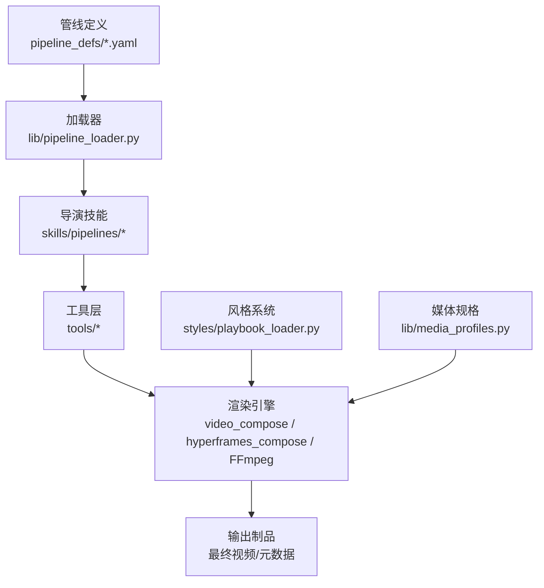
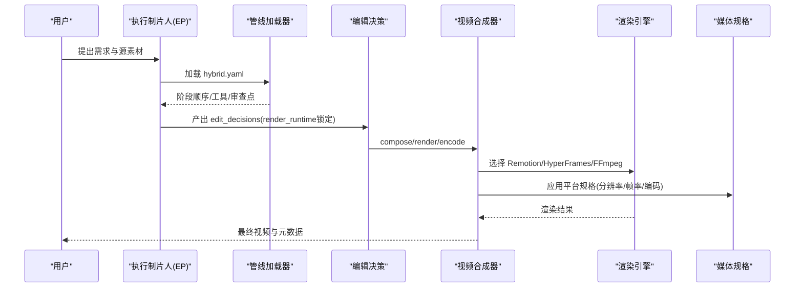
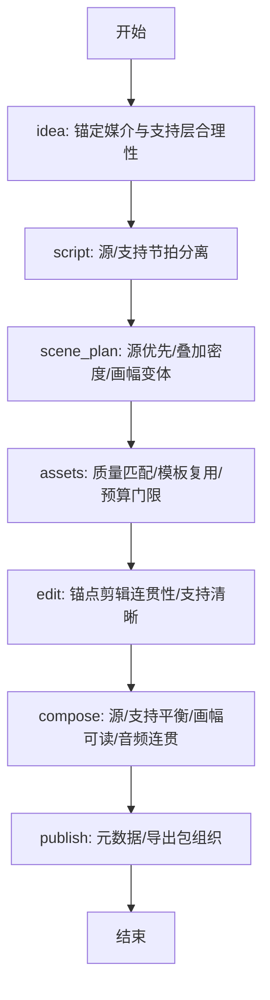
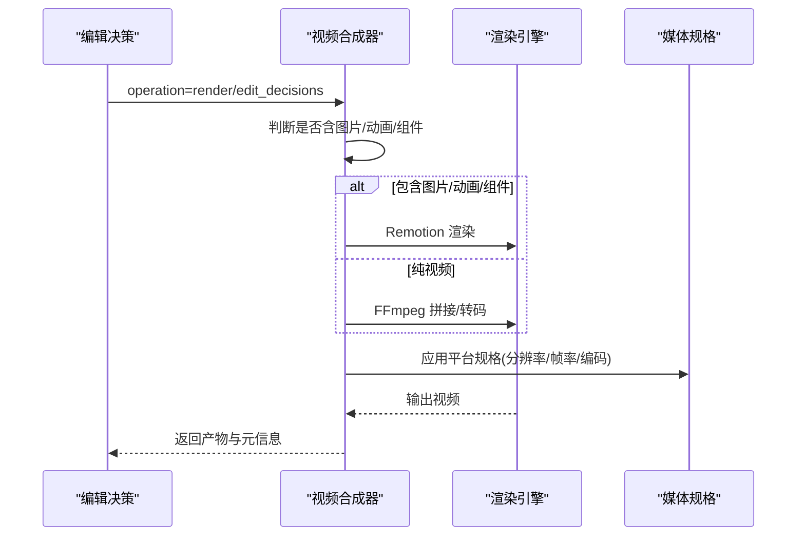
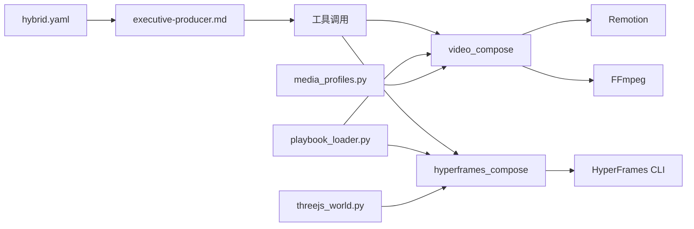

# 混合媒体管道

<cite>
**本文引用的文件**
- [README.md](file://README.md)
- [pipeline_defs/hybrid.yaml](file://pipeline_defs/hybrid.yaml)
- [lib/pipeline_loader.py](file://lib/pipeline_loader.py)
- [lib/media_profiles.py](file://lib/media_profiles.py)
- [tools/video/video_compose.py](file://tools/video/video_compose.py)
- [tools/video/hyperframes_compose.py](file://tools/video/hyperframes_compose.py)
- [skills/pipelines/hybrid/executive-producer.md](file://skills/pipelines/hybrid/executive-producer.md)
- [styles/playbook_loader.py](file://styles/playbook_loader.py)
- [tools/graphics/threejs_world.py](file://tools/graphics/threejs_world.py)
</cite>

## 目录
1. [简介](#简介)
2. [项目结构](#项目结构)
3. [核心组件](#核心组件)
4. [架构总览](#架构总览)
5. [详细组件分析](#详细组件分析)
6. [依赖关系分析](#依赖关系分析)
7. [性能与优化](#性能与优化)
8. [故障排查指南](#故障排查指南)
9. [结论](#结论)
10. [附录：最佳实践](#附录最佳实践)

## 简介
本手册面向需要构建“文本、图像、视频、3D”等多模态内容融合的企业级制作团队，提供基于 OpenMontage 的混合媒体管道使用指南。重点覆盖：
- 跨媒体内容协调：以“源素材为主、生成/设计支持为辅”的混合策略，确保叙事连贯与视觉统一
- 统一视觉风格：通过样式剧本（playbook）驱动色彩、排版、动效与可访问性校验
- 动态转场设计：Remotion/HyperFrames/FFmpeg 多运行时协同，实现高质量转场与合成
- 沉浸式体验构建：Three.js 世界生成与 HyperFrames 工作区编排，打造可编辑的三维空间与镜头路径
- 技术挑战与优化：编码一致性、音频流处理、渲染时延、预算治理与质量门禁
- 场景化最佳实践：企业宣传片、教育内容与创意广告的生产流程与注意事项

## 项目结构
OpenMontage 采用“管线定义 + 技能指令 + 工具注册”的分层架构：
- 管线定义：YAML 描述阶段、工具、审查点与产出物
- 技能指令：Markdown 指导 AI Agent 如何执行每个阶段
- 工具层：视频/音频/图形/增强/分析等能力封装为可注册工具
- 风格系统：Playbook 管理视觉语言、可访问性与输出规格
- 渲染引擎：Remotion（React）、HyperFrames（HTML/CSS/GSAP）、FFmpeg（底层编解码）

图表来源
- [pipeline_defs/hybrid.yaml:1-228](file://pipeline_defs/hybrid.yaml#L1-L228)
- [lib/pipeline_loader.py:1-241](file://lib/pipeline_loader.py#L1-L241)
- [tools/video/video_compose.py:1-800](file://tools/video/video_compose.py#L1-L800)
- [tools/video/hyperframes_compose.py:1-200](file://tools/video/hyperframes_compose.py#L1-L200)
- [styles/playbook_loader.py:1-800](file://styles/playbook_loader.py#L1-L800)
- [lib/media_profiles.py:1-166](file://lib/media_profiles.py#L1-L166)

章节来源
- [README.md:356-475](file://README.md#L356-L475)
- [pipeline_defs/hybrid.yaml:1-228](file://pipeline_defs/hybrid.yaml#L1-L228)

## 核心组件
- 混合管线（Hybrid Pipeline）：以“源素材+支持层”为核心，强调源主导、支持不喧宾夺主，贯穿 idea→script→scene_plan→assets→edit→compose→publish 全流程
- 管线加载器：负责读取并校验 YAML 管线清单，提供阶段顺序、所需工具、扩展权限等能力
- 视频合成器：根据 edit_decisions 选择 Remotion/HyperFrames/FFmpeg 进行剪辑、字幕烧录、转场、编码与导出
- 媒体规格：平台化分辨率、帧率、编码参数与约束（时长/大小），用于统一输出
- 风格系统：颜色对比度、色盲安全、字体层级与可访问性校验，保障视觉一致性与包容性
- 3D 世界生成：语义化 Three.js 世界构建，输出可编辑工作区与诊断报告，配合 HyperFrames 渲染

章节来源
- [pipeline_defs/hybrid.yaml:12-228](file://pipeline_defs/hybrid.yaml#L12-L228)
- [lib/pipeline_loader.py:49-162](file://lib/pipeline_loader.py#L49-L162)
- [tools/video/video_compose.py:1-800](file://tools/video/video_compose.py#L1-L800)
- [lib/media_profiles.py:22-166](file://lib/media_profiles.py#L22-L166)
- [styles/playbook_loader.py:37-800](file://styles/playbook_loader.py#L37-L800)
- [tools/graphics/threejs_world.py:1-200](file://tools/graphics/threejs_world.py#L1-L200)

## 架构总览
混合媒体管道的总体流程如下：
- 输入：用户意图、源素材、风格偏好、平台目标
- 编排：EP（执行制片人）按阶段推进，设置质量门禁与预算控制
- 创作：脚本与分镜明确“源/支持”职责边界；资产阶段生成或选取支持层
- 编辑：锚点剪辑先于支持层，保证叙事连贯
- 合成：根据 render_runtime 路由到 Remotion/HyperFrames/FFmpeg，完成转场、字幕、混音与编码
- 发布：输出多规格成品与元数据，归档决策日志

图表来源
- [pipeline_defs/hybrid.yaml:46-228](file://pipeline_defs/hybrid.yaml#L46-L228)
- [lib/pipeline_loader.py:125-162](file://lib/pipeline_loader.py#L125-L162)
- [tools/video/video_compose.py:1-800](file://tools/video/video_compose.py#L1-L800)
- [lib/media_profiles.py:133-166](file://lib/media_profiles.py#L133-L166)

## 详细组件分析

### 混合管线（Hybrid Pipeline）
- 阶段划分：idea/script/scene_plan/assets/edit/compose/publish，每阶段有明确的输入/产出、可用工具、人类审批默认值与审查焦点
- 关键约束：
  - 源/支持平衡：支持层不得喧宾夺主，叠加层并发数建议不超过2
  - 平台可读性：不同画幅下文字与叠加层需保持可读
  - 渲染运行时锁定：proposal 阶段确定 render_runtime，禁止静默替换
- 质量门禁：从 idea 到 publish 共7个检查点，最终交付前再次验证源/支持平衡与音频连贯性

图表来源
- [pipeline_defs/hybrid.yaml:46-228](file://pipeline_defs/hybrid.yaml#L46-L228)
- [skills/pipelines/hybrid/executive-producer.md:46-130](file://skills/pipelines/hybrid/executive-producer.md#L46-L130)

章节来源
- [pipeline_defs/hybrid.yaml:46-228](file://pipeline_defs/hybrid.yaml#L46-L228)
- [skills/pipelines/hybrid/executive-producer.md:1-130](file://skills/pipelines/hybrid/executive-producer.md#L1-L130)

### 管线加载器（Pipeline Loader）
- 功能：加载并校验 pipeline manifest，提供阶段顺序、子阶段过滤、必需工具集合、人类审批默认值、扩展权限检查
- 关键点：
  - 缓存机制：避免重复解析与校验
  - 条件子阶段：可按上下文激活/停用
  - 扩展限制：custom_scripts/custom_playbooks/custom_skills/custom_tools 需显式允许

章节来源
- [lib/pipeline_loader.py:27-77](file://lib/pipeline_loader.py#L27-L77)
- [lib/pipeline_loader.py:98-162](file://lib/pipeline_loader.py#L98-L162)
- [lib/pipeline_loader.py:201-241](file://lib/pipeline_loader.py#L201-L241)

### 视频合成器（Video Compose）
- 运行时路由：依据 edit_decisions.render_runtime 选择 Remotion/HyperFrames/FFmpeg，且不允许静默切换
- 能力：
  - compose：纯视频片段拼接、字幕烧录、音频混入
  - render：自动识别图片/动画/组件场景，路由到 Remotion
  - remotion_render：React 场景渲染
  - overlay/encode：叠加与重编码
- 细节要点：
  - 片段标准化：统一分辨率/帧率/像素格式，避免 concat 失败
  - 无音频流处理：检测并注入静音轨道，保证拼接一致性
  - 字幕样式优先级：显式 > edit_decisions > playbook > 默认
  - 平台规格：支持 profile 名称映射到 FFmpeg 输出参数

图表来源
- [tools/video/video_compose.py:1-800](file://tools/video/video_compose.py#L1-L800)
- [lib/media_profiles.py:133-166](file://lib/media_profiles.py#L133-L166)

章节来源
- [tools/video/video_compose.py:1-800](file://tools/video/video_compose.py#L1-L800)
- [lib/media_profiles.py:1-166](file://lib/media_profiles.py#L1-L166)

### HyperFrames 合成器
- 定位：HTML/CSS/GSAP 驱动的动效与网站转视频，适合 kinetic typography、产品宣传、UI 演示、注册块驱动场景
- 能力：渲染、lint、validate、inspect、check、doctor、scaffold_workspace、add_block
- 与 Remotion 的关系：Phase 1 中字幕逐字燃烧、头像/口型同步仍由 Remotion 承担；HyperFrames 专注 HTML/CSS/GSAP 优势领域

章节来源
- [tools/video/hyperframes_compose.py:1-200](file://tools/video/hyperframes_compose.py#L1-L200)

### 媒体规格（Media Profiles）
- 内置平台规格：YouTube 横屏/4K/Shorts、Instagram Reels/Feed、TikTok、LinkedIn、Cinematic、通用 HD
- 输出参数：分辨率、宽高比、帧率、编码器、音频编码器、CRF、像素格式、最大时长/文件大小
- 用途：在 compose/encode 阶段统一输出，确保平台兼容与体积可控

章节来源
- [lib/media_profiles.py:22-166](file://lib/media_profiles.py#L22-L166)

### 风格系统（Playbook）
- 颜色与可访问性：WCAG 对比度计算、色盲安全检测、叠加层文本背景校验
- 字体层级：类型比例、权重差异、最小字号建议
- 作用：在合成与渲染阶段驱动 CSS/样式桥接，保证跨媒体视觉一致性与包容性

章节来源
- [styles/playbook_loader.py:37-800](file://styles/playbook_loader.py#L37-L800)

### 3D 世界生成（Three.js World）
- 能力：语义区域规划、程序化高度场、地标放置、相机飞行路径、诊断报告、生产保真门禁
- 输出：可编辑的 HyperFrames/Three.js 工作区与诊断 JSON，最终由 video_compose/hyperframes_compose 渲染
- 适用：无需付费 API 即可构建可编辑的三维世界与镜头路径，适合沉浸式展示与品牌世界构建

章节来源
- [tools/graphics/threejs_world.py:1-200](file://tools/graphics/threejs_world.py#L1-L200)

## 依赖关系分析
- 管线与技能：hybrid.yaml 声明 required_skills，EP 技能串联各阶段
- 工具与运行时：video_compose 依赖 FFmpeg/Remotion/HyperFrames；hyperframes_compose 依赖 Node.js 22+/npx/FFmpeg
- 风格与规格：playbook 影响字幕样式与视觉；media_profiles 决定输出参数
- 3D 与合成：threejs_world 输出工作区，交由 hyperframes_compose/video_compose 渲染

图表来源
- [pipeline_defs/hybrid.yaml:26-37](file://pipeline_defs/hybrid.yaml#L26-L37)
- [skills/pipelines/hybrid/executive-producer.md:1-130](file://skills/pipelines/hybrid/executive-producer.md#L1-L130)
- [tools/video/video_compose.py:1-800](file://tools/video/video_compose.py#L1-L800)
- [tools/video/hyperframes_compose.py:1-200](file://tools/video/hyperframes_compose.py#L1-L200)
- [styles/playbook_loader.py:1-800](file://styles/playbook_loader.py#L1-L800)
- [lib/media_profiles.py:1-166](file://lib/media_profiles.py#L1-L166)
- [tools/graphics/threejs_world.py:1-200](file://tools/graphics/threejs_world.py#L1-L200)

章节来源
- [pipeline_defs/hybrid.yaml:26-37](file://pipeline_defs/hybrid.yaml#L26-L37)
- [tools/video/video_compose.py:234-335](file://tools/video/video_compose.py#L234-L335)
- [tools/video/hyperframes_compose.py:62-105](file://tools/video/hyperframes_compose.py#L62-L105)

## 性能与优化
- 片段标准化与无损拼接：对视频片段统一分辨率/帧率/像素格式，再使用 concat-copy 提升效率
- 无音频流处理：检测并注入静音轨道，避免 ffprobe/ffmpeg 报错导致流水线中断
- 渲染超时与资源：Remotion 支持超时配置；HyperFrames 要求 Node 22+ 与 npx；FFmpeg 需 PATH 可解析
- 平台规格裁剪：按需选择 profile，减少不必要的重编码与体积膨胀
- 预算治理：提案阶段估算成本，执行阶段记录实际花费，超阈值暂停确认

章节来源
- [tools/video/video_compose.py:364-634](file://tools/video/video_compose.py#L364-L634)
- [tools/video/video_compose.py:234-335](file://tools/video/video_compose.py#L234-L335)
- [lib/media_profiles.py:133-166](file://lib/media_profiles.py#L133-L166)
- [README.md:652-686](file://README.md#L652-L686)

## 故障排查指南
- 运行时不可用：
  - Remotion：检查 npx、remotion-composer 与 node_modules 是否存在
  - HyperFrames：检查 Node 22+、npx、FFmpeg 与 npm 包可用性
  - FFmpeg：确保 PATH 可解析
- 拼接失败：
  - 片段不一致导致 concat 报错：确保统一分辨率/帧率/像素格式
  - 无音频流：检测并注入静音轨道
- 字幕问题：
  - 样式优先级：显式 > edit_decisions > playbook > 默认
  - 路径转义：Windows 路径需正确转义
- 画幅与可读性：
  - 竖屏/方屏下叠加层与文字需保持可读，必要时调整布局与字号
- 预算与治理：
  - 超预算阈值暂停确认；禁止静默切换渲染运行时

章节来源
- [tools/video/video_compose.py:234-335](file://tools/video/video_compose.py#L234-L335)
- [tools/video/video_compose.py:364-701](file://tools/video/video_compose.py#L364-L701)
- [tools/video/hyperframes_compose.py:62-105](file://tools/video/hyperframes_compose.py#L62-L105)
- [README.md:652-686](file://README.md#L652-L686)

## 结论
OpenMontage 的混合媒体管道以“源素材为主、生成/设计支持为辅”的策略，结合多渲染引擎与严格的风格/规格/治理体系，能够稳定地生产企业宣传片、教育内容与创意广告。通过 EP 阶段化编排、质量门禁与预算控制，既能保证创意自由度，又能确保工程化质量与可追溯性。

## 附录：最佳实践

### 企业宣传片
- 源素材：品牌实拍/产品演示为主，支持层用于信息强化与品牌元素叠加
- 风格：clean-professional 或 premium-minimalist，确保专业感与品牌一致性
- 转场：Remotion 复杂转场 + FFmpeg 精准拼接；注意画幅适配与字幕可读性
- 3D：Three.js 世界用于品牌空间展示，HyperFrames 渲染工作区

### 教育内容
- 源素材：讲解视频/屏幕录制为主，支持层用于图表、标注与术语解释
- 风格：minimalist-diagram，突出信息层次与可读性
- 字幕：逐字燃烧与词级时间戳，便于学习节奏控制
- 平台：YouTube 横屏/4K 与 Shorts/Reels 多规格输出

### 创意广告
- 源素材：AI 生成图像/短视频为主，支持层用于品牌标识与文案强化
- 风格：flat-motion-graphics，强调动感与节奏
- 转场：GSAP 动效与 HyperFrames 注册块，快速迭代与可视化预览
- 预算：提案阶段估算成本，执行阶段记录花费，避免超支

章节来源
- [pipeline_defs/hybrid.yaml:38-44](file://pipeline_defs/hybrid.yaml#L38-L44)
- [styles/playbook_loader.py:37-800](file://styles/playbook_loader.py#L37-L800)
- [tools/video/video_compose.py:1-800](file://tools/video/video_compose.py#L1-L800)
- [tools/video/hyperframes_compose.py:1-200](file://tools/video/hyperframes_compose.py#L1-L200)
- [tools/graphics/threejs_world.py:1-200](file://tools/graphics/threejs_world.py#L1-L200)