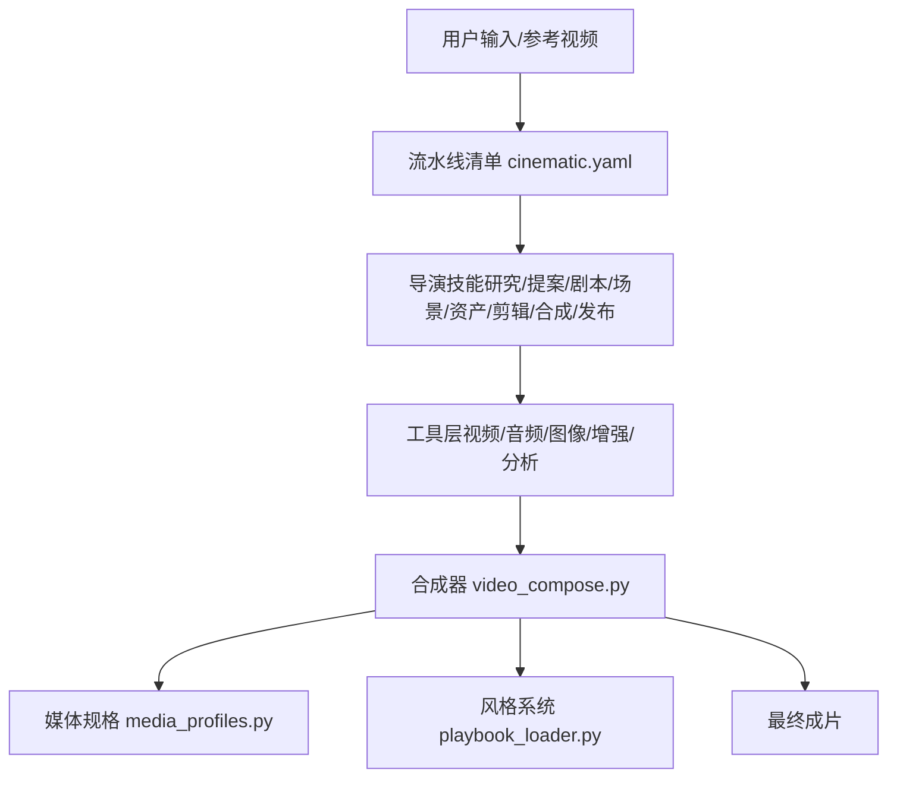
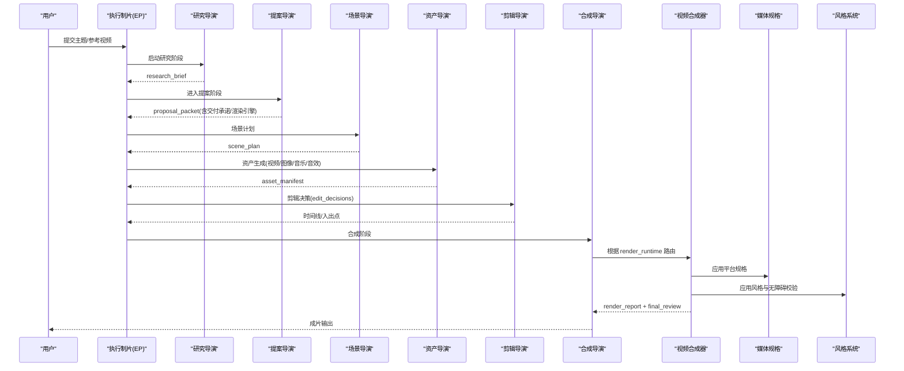
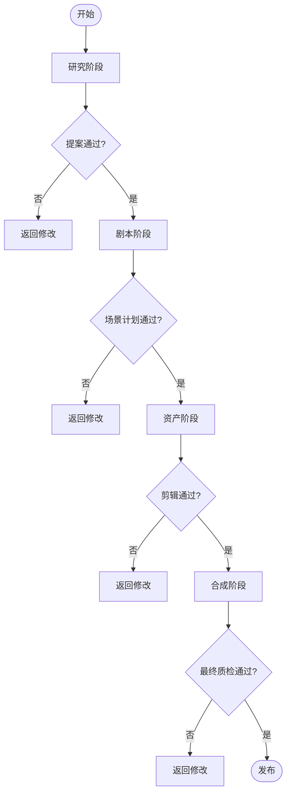
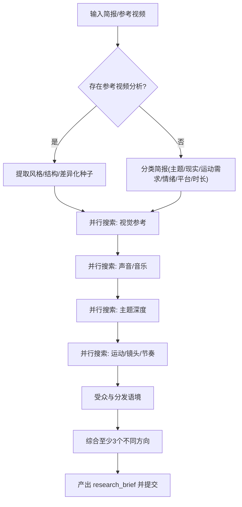
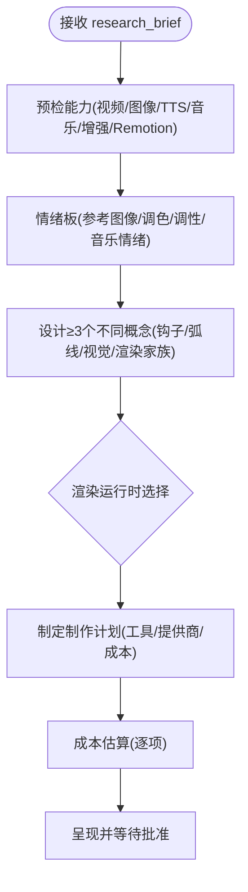
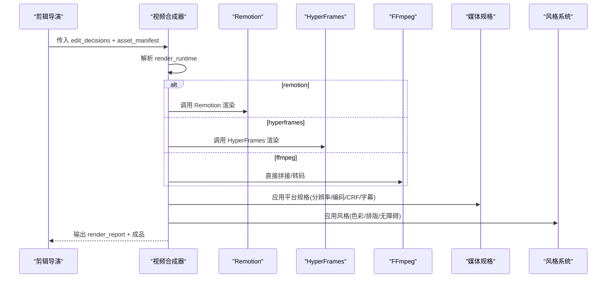
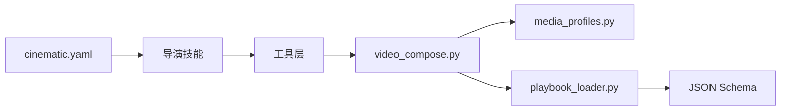

# 电影预告片管道

<cite>
**本文引用的文件**
- [README.md](file://README.md)
- [PROJECT_CONTEXT.md](file://PROJECT_CONTEXT.md)
- [ARCHITECTURE.md](file://docs/ARCHITECTURE.md)
- [cinematic.yaml](file://pipeline_defs/cinematic.yaml)
- [executive-producer.md](file://skills/pipelines/cinematic/executive-producer.md)
- [research-director.md](file://skills/pipelines/cinematic/research-director.md)
- [proposal-director.md](file://skills/pipelines/cinematic/proposal-director.md)
- [video_compose.py](file://tools/video/video_compose.py)
- [media_profiles.py](file://lib/media_profiles.py)
- [playbook_loader.py](file://styles/playbook_loader.py)
- [clean-professional.yaml](file://styles/clean-professional.yaml)
- [brief.schema.json](file://schemas/artifacts/brief.schema.json)
</cite>

## 目录
1. [简介](#简介)
2. [项目结构](#项目结构)
3. [核心组件](#核心组件)
4. [架构总览](#架构总览)
5. [详细组件分析](#详细组件分析)
6. [依赖关系分析](#依赖关系分析)
7. [性能与成本考量](#性能与成本考量)
8. [故障排查指南](#故障排查指南)
9. [结论](#结论)
10. [附录：专业术语与最佳实践](#附录专业术语与最佳实践)

## 简介
本指南面向需要制作“电影级”预告片的团队与创作者，基于 OpenMontage 的“电影（Cinematic）”流水线，系统化讲解从创意构思、视觉风格设计、分镜规划、高质量素材生成、专业剪辑到特效合成的全流程。同时覆盖叙事结构、节奏控制、情感营造技巧、质量门槛与成本控制策略，并给出可落地的行业最佳实践与术语解释。

OpenMontage 采用“指令驱动 + 智能体编排”的方式：YAML 清单定义阶段与工具，Markdown 技能指导执行，Python 提供工具与持久化；所有创意与技术决策由智能体读取技能后调用工具完成，并在关键节点设置人类审批门。

**章节来源**
- [README.md:73-120](file://README.md#L73-L120)
- [PROJECT_CONTEXT.md:9-19](file://PROJECT_CONTEXT.md#L9-L19)

## 项目结构
围绕电影预告片生产，仓库的关键组织如下：
- 流水线定义：pipeline_defs/cinematic.yaml 定义了研究、提案、剧本、场景计划、资产、剪辑、合成、发布的完整阶段与检查点策略。
- 导演技能：skills/pipelines/cinematic/* 为每个阶段提供“如何执行”的详细指引，包括情绪弧线、交付承诺、渲染引擎选择等。
- 合成与输出：tools/video/video_compose.py 负责根据 edit_decisions 中的 render_runtime 路由到 Remotion、HyperFrames 或 FFmpeg；lib/media_profiles.py 提供平台化输出规格。
- 风格系统：styles/*.yaml 与 styles/playbook_loader.py 统一色彩、排版、动效与无障碍校验，确保成片风格一致且可读。
- 契约与校验：schemas/artifacts/* 对产出物进行 JSON Schema 校验，保证跨阶段数据一致性。

**图表来源**
- [cinematic.yaml:60-288](file://pipeline_defs/cinematic.yaml#L60-L288)
- [video_compose.py:1-29](file://tools/video/video_compose.py#L1-L29)
- [media_profiles.py:14-119](file://lib/media_profiles.py#L14-L119)
- [playbook_loader.py:37-64](file://styles/playbook_loader.py#L37-L64)

**章节来源**
- [cinematic.yaml:1-59](file://pipeline_defs/cinematic.yaml#L1-L59)
- [PROJECT_CONTEXT.md:33-87](file://PROJECT_CONTEXT.md#L33-L87)

## 核心组件
- 电影流水线（Cinematic Pipeline）
  - 阶段：研究 → 提案 → 剧本 → 场景计划 → 资产 → 剪辑 → 合成 → 发布
  - 关键治理：交付承诺（是否必须运动画面）、渲染引擎锁定、预算与审批门
- 智能体执行协议（Executive Producer）
  - 串行推进各阶段，每阶段执行 PREPARE → SPAWN DIRECTOR → REVIEW → GATE DECISION
  - 跨阶段检查：情绪弧线、颜色一致性、音频动态、镜头语言、预算阈值
- 合成器（Video Compose）
  - 依据 edit_decisions.render_runtime 路由至 Remotion/HyperFrames/FFmpeg
  - 禁止静默切换引擎；若 motion_required 被违反，需上报而非降级
- 媒体规格（Media Profiles）
  - YouTube/TikTok/Instagram/LinkedIn/Cinematic 等平台预设分辨率、帧率、编码、CRF、字幕格式
- 风格系统（Playbooks）
  - 色彩、排版、动效、无障碍校验（WCAG 对比度、色盲安全、字体层级）
- 契约与校验（Schemas）
  - brief、script、scene_plan、asset_manifest、edit_decisions、render_report、publish_log 等 JSON Schema 校验

**章节来源**
- [cinematic.yaml:60-288](file://pipeline_defs/cinematic.yaml#L60-L288)
- [executive-producer.md:50-173](file://skills/pipelines/cinematic/executive-producer.md#L50-L173)
- [video_compose.py:1-29](file://tools/video/video_compose.py#L1-L29)
- [media_profiles.py:40-119](file://lib/media_profiles.py#L40-L119)
- [playbook_loader.py:210-396](file://styles/playbook_loader.py#L210-L396)
- [brief.schema.json:1-49](file://schemas/artifacts/brief.schema.json#L1-L49)

## 架构总览
OpenMontage 的“指令驱动 + 智能体编排”在电影预告片管线中体现为：
- 智能体读取 cinematic.yaml 的阶段顺序与可用工具
- 按导演技能逐步执行，产出结构化工件并通过 Schema 校验
- 在提案阶段锁定渲染引擎与交付承诺，避免后期降级
- 合成阶段严格遵循所选引擎，必要时回退需经人工审批
- 输出前运行自检（ffprobe、帧采样、音频分析），通过后发布

**图表来源**
- [cinematic.yaml:60-288](file://pipeline_defs/cinematic.yaml#L60-L288)
- [video_compose.py:1-29](file://tools/video/video_compose.py#L1-L29)
- [media_profiles.py:40-119](file://lib/media_profiles.py#L40-L119)
- [playbook_loader.py:37-64](file://styles/playbook_loader.py#L37-L64)

**章节来源**
- [ARCHITECTURE.md:9-27](file://docs/ARCHITECTURE.md#L9-L27)
- [PROJECT_CONTEXT.md:43-57](file://PROJECT_CONTEXT.md#L43-L57)

## 详细组件分析

### 执行制片（Executive Producer）
- 职责：串联各阶段，维护累计状态（情绪弧线、交付承诺、渲染家族、调色目标、英雄时刻、音乐节拍图）
- 质量门：研究→提案→剧本→场景→资产→剪辑→合成→发布，每步均有明确检查项与失败处理
- 限制：最大修订次数、发送回次数、总预算、总耗时

**图表来源**
- [executive-producer.md:50-173](file://skills/pipelines/cinematic/executive-producer.md#L50-L173)

**章节来源**
- [executive-producer.md:50-173](file://skills/pipelines/cinematic/executive-producer.md#L50-L173)

### 研究导演（Research Director）
- 目标：以真实参考、情绪语言、声音设计与运动先例为基础，支撑后续创意方向
- 流程：参考视频上下文识别 → 分类简报 → 视觉参考挖掘 → 声音与音乐景观 → 主题深度 → 运动与镜头语言 → 受众与分发 → 角度综合 → 书目整理 → 提交 research_brief
- 约束：搜索数量、时间上限、零付费工具

**图表来源**
- [research-director.md:21-190](file://skills/pipelines/cinematic/research-director.md#L21-L190)

**章节来源**
- [research-director.md:21-190](file://skills/pipelines/cinematic/research-director.md#L21-L190)

### 提案导演（Proposal Director）
- 目标：将研究转化为可评审的提案，包含概念选项、交付承诺、渲染引擎选择、音乐方案与成本估算
- 关键规则：
  - 必须呈现两种渲染运行时（Remotion/HyperFrames）供选择，记录决策日志
  - 若 delivery_promise.motion_required=true，禁止静默降级为静态演示
  - 建议先做“情绪板”快速对齐调性，再展开概念
- 产出：proposal_packet（含 concept_options、delivery_promise、production_plan、cost_estimate）

**图表来源**
- [proposal-director.md:9-38](file://skills/pipelines/cinematic/proposal-director.md#L9-L38)
- [proposal-director.md:109-120](file://skills/pipelines/cinematic/proposal-director.md#L109-L120)
- [proposal-director.md:122-188](file://skills/pipelines/cinematic/proposal-director.md#L122-L188)
- [proposal-director.md:226-273](file://skills/pipelines/cinematic/proposal-director.md#L226-L273)

**章节来源**
- [proposal-director.md:9-38](file://skills/pipelines/cinematic/proposal-director.md#L9-L38)
- [proposal-director.md:109-120](file://skills/pipelines/cinematic/proposal-director.md#L109-L120)
- [proposal-director.md:122-188](file://skills/pipelines/cinematic/proposal-director.md#L122-L188)
- [proposal-director.md:226-273](file://skills/pipelines/cinematic/proposal-director.md#L226-L273)

### 视频合成器（Video Compose）
- 功能：compose/render/remotion_render/burn_subtitles/overlay/encode
- 路由：依据 edit_decisions.render_runtime 选择 Remotion/HyperFrames/FFmpeg
- 治理：禁止静默切换；当 motion_required 被违反时，需上报而非降级
- 集成：结合媒体规格与风格系统进行编码与样式应用

**图表来源**
- [video_compose.py:1-29](file://tools/video/video_compose.py#L1-L29)
- [media_profiles.py:40-119](file://lib/media_profiles.py#L40-L119)
- [playbook_loader.py:37-64](file://styles/playbook_loader.py#L37-L64)

**章节来源**
- [video_compose.py:1-29](file://tools/video/video_compose.py#L1-L29)

### 媒体规格（Media Profiles）
- 内置多平台规格：YouTube 横屏/4K/Shorts、Instagram Reels/Feed、TikTok、LinkedIn、Cinematic 超宽屏
- 参数：分辨率、宽高比、帧率、编码、音频编码、CRF、像素格式、字幕格式、文件大小/时长限制
- 用途：合成阶段统一输出，确保平台兼容性与画质

**章节来源**
- [media_profiles.py:40-119](file://lib/media_profiles.py#L40-L119)

### 风格系统（Playbooks）
- 加载与校验：load_playbook(name) 读取 YAML 并校验 schema
- 设计智能：对比度计算（WCAG 2.1）、色盲安全检测、字体层级校验、无障碍最小字号
- 示例：clean-professional.yaml 定义品牌化配色、排版、动效与质量规则

**章节来源**
- [playbook_loader.py:37-64](file://styles/playbook_loader.py#L37-L64)
- [playbook_loader.py:210-396](file://styles/playbook_loader.py#L210-L396)
- [clean-professional.yaml:1-105](file://styles/clean-professional.yaml#L1-L105)

## 依赖关系分析
- 流水线依赖导演技能与工具注册表；导演技能依赖具体工具（视频/音频/图像/增强/分析）
- 合成器依赖媒体规格与风格系统；风格系统依赖 schema 校验
- 提案阶段锁定渲染引擎与交付承诺，影响后续合成与质检

**图表来源**
- [cinematic.yaml:60-288](file://pipeline_defs/cinematic.yaml#L60-L288)
- [video_compose.py:1-29](file://tools/video/video_compose.py#L1-L29)
- [media_profiles.py:40-119](file://lib/media_profiles.py#L40-L119)
- [playbook_loader.py:37-64](file://styles/playbook_loader.py#L37-L64)

**章节来源**
- [PROJECT_CONTEXT.md:33-87](file://PROJECT_CONTEXT.md#L33-L87)

## 性能与成本考量
- 渲染引擎选择
  - Remotion：适合视频主导的预告片、过渡栈丰富、支持词级字幕与 TalkingHead
  - HyperFrames：适合动效密集型、HTML/GSAP 驱动的标题序列与品牌短片
  - FFmpeg：仅用于简单拼接/转码，不替代复杂合成
- 平台规格优化
  - 选择合适的 Media Profile（分辨率/帧率/编码/CRF）平衡画质与体积
  - 字幕格式与嵌入策略影响最终体积与兼容性
- 风格与无障碍
  - 使用 Playbook 统一视觉语言，减少返工
  - WCAG 对比度与色盲安全提升可访问性，降低后期修正成本
- 预算治理
  - 提案阶段明确成本估算与单项审批阈值
  - 合成阶段避免静默降级导致的质量损失与额外成本

**章节来源**
- [proposal-director.md:9-38](file://skills/pipelines/cinematic/proposal-director.md#L9-L38)
- [media_profiles.py:40-119](file://lib/media_profiles.py#L40-L119)
- [playbook_loader.py:210-396](file://styles/playbook_loader.py#L210-L396)

## 故障排查指南
- 常见错误与定位
  - 渲染引擎不可用：video_compose 会返回结构化阻塞信息，需提示用户重新选择而非静默替换
  - 交付承诺违规：若 motion_required=true 但输出退化为准静态演示，需在质检阶段拦截
  - 风格不一致：检查 Playbook 是否生效、色彩/排版是否符合规范
  - 平台不兼容：核对 Media Profile 的分辨率/编码/字幕格式
- 自检步骤
  - 使用 ffprobe 验证时长、分辨率、编码
  - 抽取关键帧检查黑场/叠加层
  - 音频分析：对白清晰度、音乐平衡、峰值与响度
  - 字幕检查：是否存在、时间轴是否匹配
- 回滚与重试
  - 利用 Checkpoint 恢复最近成功阶段
  - 针对失败工具链启用 fallback 或更换提供商（需经审批）

**章节来源**
- [video_compose.py:1-29](file://tools/video/video_compose.py#L1-L29)
- [executive-producer.md:150-173](file://skills/pipelines/cinematic/executive-producer.md#L150-L173)

## 结论
OpenMontage 的电影预告片管道以“指令驱动 + 智能体编排”为核心，通过严谨的阶段划分、明确的交付承诺与渲染引擎锁定、平台化输出规格与风格系统，实现了从创意到成品的可控、可审计、可扩展的生产流程。配合预算治理与质量门禁，能够在保证电影级品质的同时有效控制成本与风险。

[本节未直接分析具体文件]

## 附录：专业术语与最佳实践
- 交付承诺（Delivery Promise）：明确是否必须运动画面、来源模式、调性模式、质量底线与可选回退
- 渲染引擎（Render Runtime）：Remotion/HyperFrames/FFmpeg，需在提案阶段锁定并记录决策日志
- 情绪弧线（Emotional Arc）：如紧张→揭示、惊奇→规模、亲密→回报等，决定节奏与高潮位置
- 英雄时刻（Hero Moments）：关键揭示/高潮帧，需提前定义并确保资源到位
- 媒体规格（Media Profile）：平台化的分辨率、编码、CRF、字幕格式等参数集合
- 风格系统（Playbook）：色彩、排版、动效与无障碍规则的集中管理
- 最佳实践
  - 提案阶段务必呈现两种渲染引擎并记录选择理由
  - 若 motion_required=true，严禁静默降级为静态演示
  - 使用 Playbook 统一视觉语言并进行无障碍校验
  - 合成前进行自检（ffprobe、帧采样、音频分析）
  - 预算治理：预估→预留→结算，设置单项审批阈值与总预算上限

**章节来源**
- [proposal-director.md:9-38](file://skills/pipelines/cinematic/proposal-director.md#L9-L38)
- [media_profiles.py:40-119](file://lib/media_profiles.py#L40-L119)
- [playbook_loader.py:210-396](file://styles/playbook_loader.py#L210-L396)
- [brief.schema.json:1-49](file://schemas/artifacts/brief.schema.json#L1-L49)