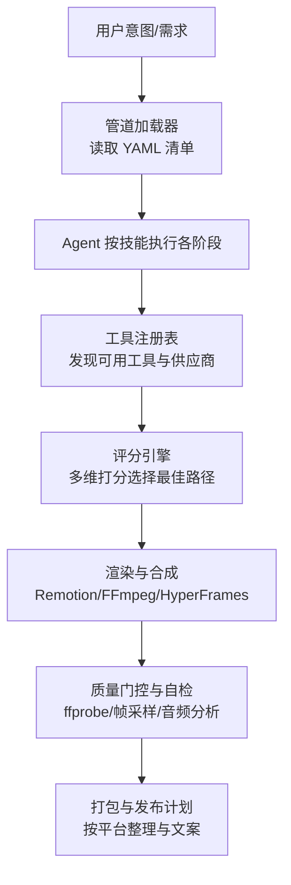
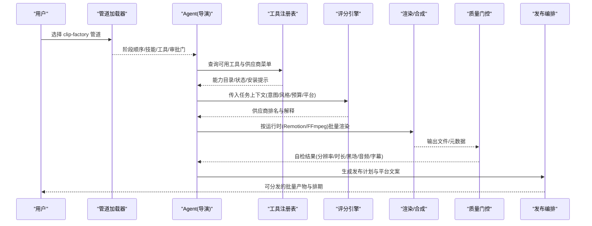
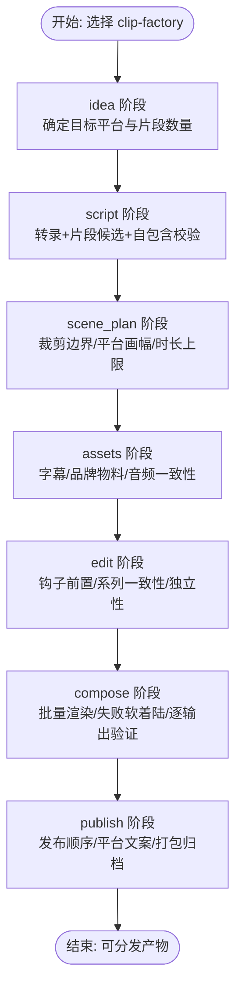

# 短视频工厂管道

<cite>
**本文引用的文件**
- [README.md](file://README.md)
- [PROJECT_CONTEXT.md](file://PROJECT_CONTEXT.md)
- [config.yaml](file://config.yaml)
- [clip-factory.yaml](file://pipeline_defs/clip-factory.yaml)
- [pipeline_loader.py](file://lib/pipeline_loader.py)
- [tool_registry.py](file://tools/tool_registry.py)
- [scoring.py](file://lib/scoring.py)
- [executive-producer.md](file://skills/pipelines/clip-factory/executive-producer.md)
- [compose-director.md](file://skills/pipelines/clip-factory/compose-director.md)
- [publish-director.md](file://skills/pipelines/clip-factory/publish-director.md)
- [idea-director.md](file://skills/pipelines/clip-factory/idea-director.md)
</cite>

## 目录
1. [简介](#简介)
2. [项目结构](#项目结构)
3. [核心组件](#核心组件)
4. [架构总览](#架构总览)
5. [详细组件分析](#详细组件分析)
6. [依赖关系分析](#依赖关系分析)
7. [性能与规模化建议](#性能与规模化建议)
8. [故障排查指南](#故障排查指南)
9. [结论](#结论)
10. [附录](#附录)

## 简介
本指南面向“短视频工厂”的批量生产，聚焦以 OpenMontage 为基座的端到端自动化流水线：从模板化内容创作、批量素材处理、标准化质量控制到高效发布管理。我们将围绕 clip-factory（短视频切片工厂）这一典型流水线，解释如何把长视频或直播回放等源内容，批量化产出多条独立、可发布的短视频，并满足多平台规格与算法偏好。同时结合系统内置的质量门控、评分选型与预算治理，确保在大规模生产中稳定、可控、可审计。

## 项目结构
OpenMontage 采用“指令驱动 + 工具注册 + 管道声明”的分层设计：
- 管道定义：YAML 清单描述阶段、技能、工具、质量检查点与审批门
- 技能体系：Markdown 指令教会 AI Agent 如何执行每个阶段
- 工具注册：自动发现 Python 工具，提供能力目录与供应商菜单
- 配置与约束：全局配置控制输出格式、预算、检查点策略等

**图示来源**
- [pipeline_loader.py:49-70](file://lib/pipeline_loader.py#L49-L70)
- [tool_registry.py:118-134](file://tools/tool_registry.py#L118-L134)
- [scoring.py:373-542](file://lib/scoring.py#L373-L542)
- [clip-factory.yaml:45-207](file://pipeline_defs/clip-factory.yaml#L45-L207)

**章节来源**
- [README.md:356-444](file://README.md#L356-L444)
- [PROJECT_CONTEXT.md:9-57](file://PROJECT_CONTEXT.md#L9-L57)
- [config.yaml:1-34](file://config.yaml#L1-L34)

## 核心组件
- 管道加载器：负责加载并校验 pipeline YAML，提取阶段顺序、所需工具、人类审批默认值等
- 工具注册表：扫描 tools 包，汇总能力、状态、供应商菜单，供 Agent 预检与调度
- 评分引擎：基于任务契合度、输出质量、可控性、可靠性、成本效率、延迟、连续性等多维权重，对候选供应商进行排序
- 质量门控：贯穿全流程的检查点与自检，包括交付承诺、幻灯片风险、前后审验、预算阈值等
- 渲染与合成：根据 edit_decisions 选择的运行时（Remotion/FFmpeg/HyperFrames）完成字幕烧录、混音、转码
- 发布编排：按平台整理导出物、标题与文案，形成可执行的发布计划

**章节来源**
- [pipeline_loader.py:125-182](file://lib/pipeline_loader.py#L125-L182)
- [tool_registry.py:249-314](file://tools/tool_registry.py#L249-L314)
- [scoring.py:21-70](file://lib/scoring.py#L21-L70)
- [README.md:652-686](file://README.md#L652-L686)

## 架构总览
OpenMontage 的“AI 代理即编排器”，Python 仅提供工具与持久化。Agent 读取管道清单与阶段技能，调用工具，自我审查，写入检查点，并在关键创意节点请求人工批准。clip-factory 是典型的“一源多片”批量流水线，覆盖从脚本转录、片段规划、资产准备、剪辑决策到批量渲染与发布的完整链路。

**图示来源**
- [clip-factory.yaml:45-207](file://pipeline_defs/clip-factory.yaml#L45-L207)
- [tool_registry.py:249-314](file://tools/tool_registry.py#L249-L314)
- [scoring.py:373-542](file://lib/scoring.py#L373-L542)
- [compose-director.md:7-14](file://skills/pipelines/clip-factory/compose-director.md#L7-L14)

## 详细组件分析

### 管道清单与阶段编排（clip-factory）
- 目标：将长视频/直播/访谈等内容切分为 N 条独立的短视频，适配多平台分发
- 阶段：idea → script → scene_plan → assets → edit → compose → publish
- 关键特性：
  - 每阶段可配置人类审批门与检查点策略
  - 明确所需/可选工具集，便于预检与资源规划
  - 通过 review_focus 与 success_criteria 固化质量标准

**图示来源**
- [clip-factory.yaml:45-207](file://pipeline_defs/clip-factory.yaml#L45-L207)

**章节来源**
- [clip-factory.yaml:45-207](file://pipeline_defs/clip-factory.yaml#L45-L207)

### 执行制片人（Executive Producer）与质量门
- 职责：串联七阶段串行执行，设置各阶段检查点与质量门
- 关键检查项：
  - 转录完整性与片段候选数
  - 片段边界干净、平台画幅规划合理
  - 批次一致性（字幕偏移、品牌物料、音频归一化）
  - 钩子位置（前 2-3 秒）、字幕样式一致、编辑独立性
  - 批量渲染成功、平台规格达标、无黑场/伪影
  - 预算门限告警（如 90% 阈值）

**章节来源**
- [executive-producer.md:57-105](file://skills/pipelines/clip-factory/executive-producer.md#L57-L105)

### 想法导演（Idea Director）与批次策略
- 关注点：先质量后数量；避免假设所有源都能垂直裁剪；避免把片段视为可互换
- 审批门：该阶段默认需要人类批准，通过后记录检查点并结束本轮

**章节来源**
- [idea-director.md:99-114](file://skills/pipelines/clip-factory/idea-director.md#L99-L114)

### 合成导演（Compose Director）与批量渲染
- 运行时约束：clip-factory 当前仅允许 Remotion 或 FFmpeg（HyperFrames 因字幕烧录对齐问题暂不支持）
- 批量原则：
  - 每个输出作为独立作业命名与追踪
  - 共享可复用资源（混音、字幕样式、叠加物料、调色）
  - 失败软着陆：单个失败不阻塞其余导出
  - 逐输出验证：时长、分辨率/画幅、首帧非黑、钩子到位、字幕正确、音频存在且一致
  - 使用渲染报告元数据记录 job_index、failed_jobs、shared_intermediates、platform_groupings

**章节来源**
- [compose-director.md:7-14](file://skills/pipelines/clip-factory/compose-director.md#L7-L14)
- [compose-director.md:24-64](file://skills/pipelines/clip-factory/compose-director.md#L24-L64)

### 发布导演（Publish Director）与分发编排
- 发布顺序：按评分与强度优先，而非时间顺序
- 平台文案：针对不同平台定制语气与包装
- 打包规范：按平台分组，附带可直接粘贴的文案资产
- 元数据：保存 clip_catalog、posting_order、platform_copy_map、schedule_notes
- 质量门：最强片段先行、字幕平台化、导出文件夹开箱即用、批次目录清晰链接排名/路径/发布意图

**章节来源**
- [publish-director.md:15-55](file://skills/pipelines/clip-factory/publish-director.md#L15-L55)
- [publish-director.md:64-69](file://skills/pipelines/clip-factory/publish-director.md#L64-L69)

### 供应商选择与评分引擎
- 维度：任务契合度、输出质量、可控性、可靠性、成本效率、延迟、连续性
- 加权计算：不同维度赋予权重，得到综合得分并排序
- 上下文归一化：将松散的任务描述（意图/风格/平台/预算/是否需运动/是否需参考条件/图像编辑等）转换为评分器可读的结构
- 实用效果：避免“首个可用即选”的朴素策略，使每次供应商选择可解释、可审计

**章节来源**
- [scoring.py:21-70](file://lib/scoring.py#L21-L70)
- [scoring.py:297-359](file://lib/scoring.py#L297-L359)
- [scoring.py:373-542](file://lib/scoring.py#L373-L542)

### 工具注册与能力菜单
- 自动发现：扫描 tools 包，注册 BaseTool 子类实例
- 能力目录：按能力/供应商/层级/状态聚合，生成 provider_menu 与 support_envelope
- 预检提示：识别可通过环境变量快速启用的能力，降低上手门槛
- 运行时警告：显式暴露 HyperFrames 等运行时的解析失败原因

**章节来源**
- [tool_registry.py:118-134](file://tools/tool_registry.py#L118-L134)
- [tool_registry.py:249-314](file://tools/tool_registry.py#L249-L314)
- [tool_registry.py:316-471](file://tools/tool_registry.py#L316-L471)

### 管道加载与阶段访问
- 清单加载：读取 YAML 并通过 JSON Schema 校验
- 阶段顺序：支持主阶段与子阶段展开，便于 Agent 理解细粒度流程
- 人类审批门：集中读取 human_approval_default，统一用于门控与看板展示
- 扩展权限：限制自定义脚本/样式/技能/工具的启用范围，保障安全与合规

**章节来源**
- [pipeline_loader.py:49-70](file://lib/pipeline_loader.py#L49-L70)
- [pipeline_loader.py:125-182](file://lib/pipeline_loader.py#L125-L182)
- [pipeline_loader.py:201-241](file://lib/pipeline_loader.py#L201-L241)

## 依赖关系分析
- 管道清单依赖：阶段→技能→工具→运行时（Remotion/FFmpeg/HyperFrames）
- 运行时选择：由 edit_decisions 锁定，compose 阶段强制校验（clip-factory 当前不允许 HyperFrames）
- 质量门控依赖：ffprobe、帧采样、音频分析、交付承诺校验
- 预算治理：estimate/reserve/reconcile 三段式，支持观察/警告/硬封顶模式
- 供应商选择依赖：工具信息（best_for/supports/tier/stability）、任务上下文、历史成功率/延迟/质量分数

**图示来源**
- [clip-factory.yaml:45-207](file://pipeline_defs/clip-factory.yaml#L45-L207)
- [pipeline_loader.py:49-70](file://lib/pipeline_loader.py#L49-L70)
- [tool_registry.py:249-314](file://tools/tool_registry.py#L249-L314)
- [scoring.py:373-542](file://lib/scoring.py#L373-L542)

**章节来源**
- [README.md:652-686](file://README.md#L652-L686)
- [config.yaml:9-14](file://config.yaml#L9-L14)

## 性能与规模化建议
- 并行渲染：将每个 clip×平台视为独立作业，尽量并发执行，失败软着陆不阻塞整体
- 资源共享：复用混音、字幕样式、叠加物料与调色，减少重复计算
- 供应商降级：当首选供应商不可用或超预算时，依据评分引擎自动回退至次优路径
- 预算治理：开启 cap 模式并设置单动作审批阈值，防止意外超支
- 运行时优化：clip-factory 固定使用 Remotion/FFmpeg，避免不必要的运行时切换开销
- 缓存与去重：对相同中间产物（如字幕、品牌物料）建立索引，避免重复生成

[本节为通用指导，无需特定文件引用]

## 故障排查指南
- 运行时不可用：若 edit_decisions 指定了当前流水线不支持的运行时（例如 clip-factory 使用 HyperFrames），应回到 idea 阶段重新选择并记录拒绝原因
- 渲染失败：查看 render_report 中的 failed_jobs 与平台分组，定位具体 clip 与平台变体
- 质量门失败：检查 ffprobe 校验、首帧黑场、音频静音/削波、字幕缺失等问题
- 预算告警：当接近阈值（如 90%）时，调整片段数量或供应商组合
- 供应商不可用：通过 provider_menu 查看未配置项，按安装提示补齐环境变量或依赖

**章节来源**
- [compose-director.md:7-14](file://skills/pipelines/clip-factory/compose-director.md#L7-L14)
- [compose-director.md:37-64](file://skills/pipelines/clip-factory/compose-director.md#L37-L64)
- [README.md:652-686](file://README.md#L652-L686)

## 结论
借助 OpenMontage 的指令驱动与工具生态，clip-factory 提供了从“一源多片”到“多平台分发”的完整批量生产闭环。通过严格的阶段质量门、供应商评分与预算治理，可在大规模短视频生产中实现稳定、可控、可审计的自动化流水线。配合平台化的发布编排与文案定制，能够高效支撑社交媒体营销、品牌宣传与病毒式传播的内容生产目标。

[本节为总结性内容，无需特定文件引用]

## 附录
- 平台输出规格：YouTube 横屏/Shorts、Instagram Reels/Feed、TikTok、LinkedIn、电影宽屏等
- 风格剧本：clean-professional、flat-motion-graphics、minimalist-diagram 等
- 供应链集成：视频/图像/TTS/音乐/增强/分析/字幕/合成等工具族

**章节来源**
- [README.md:621-649](file://README.md#L621-L649)