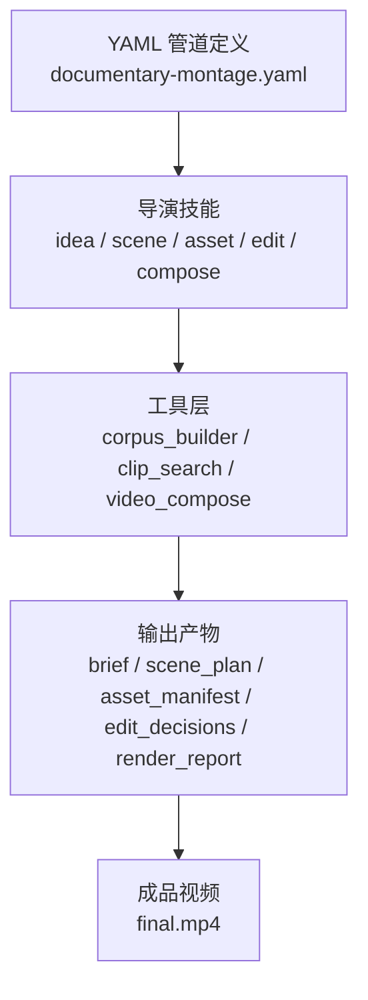
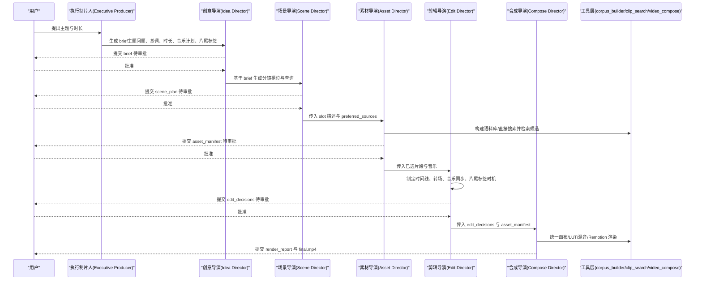
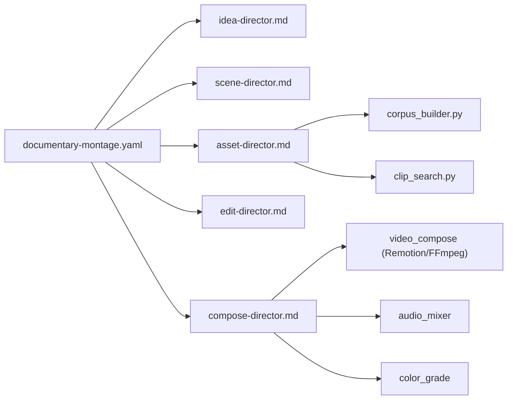

# 纪录片蒙太奇管道

<cite>
**本文引用的文件**
- [README.md](file://README.md)
- [documentary-montage.yaml](file://pipeline_defs/documentary-montage.yaml)
- [executive-producer.md](file://skills/pipelines/documentary-montage/executive-producer.md)
- [idea-director.md](file://skills/pipelines/documentary-montage/idea-director.md)
- [scene-director.md](file://skills/pipelines/documentary-montage/scene-director.md)
- [asset-director.md](file://skills/pipelines/documentary-montage/asset-director.md)
- [edit-director.md](file://skills/pipelines/documentary-montage/edit-director.md)
- [compose-director.md](file://skills/pipelines/documentary-montage/compose-director.md)
- [corpus_builder.py](file://tools/video/corpus_builder.py)
- [clip_search.py](file://tools/video/clip_search.py)
- [source_media_review.py](file://lib/source_media_review.py)
</cite>

## 目录
1. [简介](#简介)
2. [项目结构](#项目结构)
3. [核心组件](#核心组件)
4. [架构总览](#架构总览)
5. [详细组件分析](#详细组件分析)
6. [依赖关系分析](#依赖关系分析)
7. [性能与质量保障](#性能与质量保障)
8. [故障排查指南](#故障排查指南)
9. [结论](#结论)
10. [附录：操作清单与最佳实践](#附录操作清单与最佳实践)

## 简介
本手册面向“纪录片蒙太奇”生产流程，聚焦事实核查、多源素材整合、叙事结构设计、历史资料处理与现代视觉效果融合。该管道以“检索优先”为核心：从免费与开放档案（Pexels、Archive.org、NASA、Wikimedia、Unsplash 等）构建可检索的素材语料库，通过语义检索为每个叙事槽位挑选真实影像，再按节奏、音乐同步与统一调色完成最终合成。系统内置版权合规与来源溯源字段，确保每段素材可追溯；同时提供严格的审核门控与后渲染自检，保证成片质量与合规性。

## 项目结构
OpenMontage 采用“管道定义 + 导演技能 + 工具注册表”的分层组织方式。纪录片蒙太奇管道由 YAML 清单定义阶段、产物与审核要点；各阶段由 Markdown 技能文件指导 AI Agent 如何执行；底层工具负责搜索、检索、剪辑与合成。

图表来源
- [documentary-montage.yaml:1-179](file://pipeline_defs/documentary-montage.yaml#L1-L179)
- [corpus_builder.py:1-200](file://tools/video/corpus_builder.py#L1-L200)
- [clip_search.py:1-200](file://tools/video/clip_search.py#L1-L200)

章节来源
- [README.md:356-475](file://README.md#L356-L475)
- [documentary-montage.yaml:1-179](file://pipeline_defs/documentary-montage.yaml#L1-L179)

## 核心组件
- 管道编排与阶段契约：YAML 清单定义了 idea → scene_plan → assets → edit → compose 五个阶段，每个阶段产出特定工件并设置人类审批门控与成功标准。
- 导演技能：每个阶段有对应的 Markdown 技能，明确输入、过程、质量门与常见陷阱，指导 Agent 做出符合纪录片美学的决策。
- 检索与素材管理：corpus_builder 将多源素材下载、缩略图提取、CLIP 嵌入与索引；clip_search 提供文本到片段排序、相似集合、多样性去重与溯源查询。
- 编辑与合成：edit_director 制定时间线、转场、音乐同步与片尾标签策略；compose_director 负责统一画布、统一 LUT 调色、音频混音与 Remotion/FFmpeg 渲染。
- 来源审查与合规：source_media_review 对用户上传媒体进行技术探测与风险提示；资产清单强制记录 provider、original_url、license 等元数据，支撑版权合规。

章节来源
- [documentary-montage.yaml:45-179](file://pipeline_defs/documentary-montage.yaml#L45-L179)
- [executive-producer.md:1-90](file://skills/pipelines/documentary-montage/executive-producer.md#L1-L90)
- [corpus_builder.py:1-200](file://tools/video/corpus_builder.py#L1-L200)
- [clip_search.py:1-200](file://tools/video/clip_search.py#L1-L200)
- [source_media_review.py:1-120](file://lib/source_media_review.py#L1-L120)

## 架构总览
纪录片蒙太奇管道的端到端流程如下：

图表来源
- [documentary-montage.yaml:45-179](file://pipeline_defs/documentary-montage.yaml#L45-L179)
- [idea-director.md:10-156](file://skills/pipelines/documentary-montage/idea-director.md#L10-L156)
- [scene-director.md:39-170](file://skills/pipelines/documentary-montage/scene-director.md#L39-L170)
- [asset-director.md:8-49](file://skills/pipelines/documentary-montage/asset-director.md#L8-L49)
- [edit-director.md:23-40](file://skills/pipelines/documentary-montage/edit-director.md#L23-L40)
- [compose-director.md:12-31](file://skills/pipelines/documentary-montage/compose-director.md#L12-L31)

## 详细组件分析

### 执行制片人（Executive Producer）
- 职责：识别需求是否适合纪录片蒙太奇；确立“检索优先、真实素材、无旁白默认”的跨阶段规则；强调节奏即信息、并列产生意义。
- 关键约束：禁止随意生成片段；旁白需用户明确同意；语料库必须先行构建；拒绝低分或风格不符的片段。

章节来源
- [executive-producer.md:1-90](file://skills/pipelines/documentary-montage/executive-producer.md#L1-L90)

### 创意导演（Idea Director）
- 职责：将用户意图提炼为“单一主题问题”，确定基调、时长与形状；强制音乐计划与片尾标签计划；锁定渲染运行时（Remotion）。
- 产出：brief（含主题问题、基调、时长、形状、允许来源、音乐计划、片尾标签计划、时代混合偏好、目标平台）。

章节来源
- [idea-director.md:10-156](file://skills/pipelines/documentary-montage/idea-director.md#L10-L156)
- [documentary-montage.yaml:46-65](file://pipeline_defs/documentary-montage.yaml#L46-L65)

### 场景导演（Scene Director）
- 职责：把主题问题拆解为具体可检索的槽位；为每个槽位写出名词+形容词的描述与 2-3 条短查询；根据 era_mix 选择首选来源；标记英雄槽位；控制总时长。
- 产出：scene_plan（scenes[] 与 metadata.slots[]），后者携带检索所需字段。

章节来源
- [scene-director.md:39-170](file://skills/pipelines/documentary-montage/scene-director.md#L39-L170)
- [scene-director.md:206-282](file://skills/pipelines/documentary-montage/scene-director.md#L206-L282)
- [documentary-montage.yaml:66-85](file://pipeline_defs/documentary-montage.yaml#L66-L85)

### 素材导演（Asset Director）
- 职责：两种路径——标准路径（corpus_builder + clip_search）与快速路径（direct_clip_search）；构建语料库、检索、多样性去重、记录被拒片段原因；执行音乐计划；输出带完整溯源的 asset_manifest。
- 关键规则：先建语料再挑选；语料库只增不减；按槽位挑选且避免重复；儿童内容走 Pixabay 奇幻风格；严格遵循音乐计划不擅自替换。

章节来源
- [asset-director.md:8-49](file://skills/pipelines/documentary-montage/asset-director.md#L8-L49)
- [asset-director.md:117-183](file://skills/pipelines/documentary-montage/asset-director.md#L117-L183)
- [asset-director.md:186-343](file://skills/pipelines/documentary-montage/asset-director.md#L186-L343)
- [asset-director.md:364-449](file://skills/pipelines/documentary-montage/asset-director.md#L364-L449)
- [corpus_builder.py:1-200](file://tools/video/corpus_builder.py#L1-L200)
- [clip_search.py:1-200](file://tools/video/clip_search.py#L1-L200)

### 剪辑导演（Edit Director）
- 职责：制定时间线、入出点、转场、音乐同步、片尾标签时机；保持基调一致性；控制相邻镜头多样性；输出 edit_decisions。
- 关键规则：依据基调设定基础/最小/最大持留；英雄槽位最长；硬切为主、少量溶解；音乐是节拍网格而非后期点缀；片尾标签在 overlay 模式下计算 offset 与结尾淡出对齐。

章节来源
- [edit-director.md:23-40](file://skills/pipelines/documentary-montage/edit-director.md#L23-L40)
- [edit-director.md:59-121](file://skills/pipelines/documentary-montage/edit-director.md#L59-L121)
- [edit-director.md:122-179](file://skills/pipelines/documentary-montage/edit-director.md#L122-L179)
- [edit-director.md:181-253](file://skills/pipelines/documentary-montage/edit-director.md#L181-L253)
- [edit-director.md:254-331](file://skills/pipelines/documentary-montage/edit-director.md#L254-L331)

### 合成导演（Compose Director）
- 职责：统一画布与比例、应用统一 LUT、一次混音、Remotion 渲染片尾标签（overlay/concat）、输出 render_report。
- 关键规则：强制 Remotion 运行时；统一 LUT 不可省略；音乐默认必需（除非用户明确放弃）；片尾标签必须渲染（除非用户明确放弃）；完成后进行 ffprobe 验证与首尾帧检查。

章节来源
- [compose-director.md:12-31](file://skills/pipelines/documentary-montage/compose-director.md#L12-L31)
- [compose-director.md:69-129](file://skills/pipelines/documentary-montage/compose-director.md#L69-L129)
- [compose-director.md:130-152](file://skills/pipelines/documentary-montage/compose-director.md#L130-L152)
- [compose-director.md:153-257](file://skills/pipelines/documentary-montage/compose-director.md#L153-L257)
- [compose-director.md:258-341](file://skills/pipelines/documentary-montage/compose-director.md#L258-L341)

### 素材来源管理与版权合规
- 来源路由：scene director 根据 era_mix 为每个槽位指定首选来源（现代/复古/任意），并在 asset director 阶段严格执行。
- 溯源字段：asset_manifest 中每条素材必须包含 provider、original_url、license 等元数据，便于后续发布与合规审计。
- 来源审查：若用户提供自有媒体，source_media_review 会进行技术探测与质量风险标注，辅助规划与规避隐患。

章节来源
- [scene-director.md:140-170](file://skills/pipelines/documentary-montage/scene-director.md#L140-L170)
- [asset-director.md:383-449](file://skills/pipelines/documentary-montage/asset-director.md#L383-L449)
- [source_media_review.py:1-120](file://lib/source_media_review.py#L1-L120)
- [source_media_review.py:215-331](file://lib/source_media_review.py#L215-L331)

### 事实核查与内容真实性验证机制
- 研究阶段：管道强调“研究优先”，在脚本前进行网络检索，形成结构化研究简报，确保内容与当前事实一致。
- 素材真实性：纪录片蒙太奇坚持使用真实素材（非生成画面），并通过 CLIP 相似度与人工判断双重筛选，避免“幻觉式”匹配。
- 审核门控：每个阶段均设 human_approval_default，未获批准不得进入下一阶段；pre-compose 与 post-render 自检进一步保障质量。

章节来源
- [README.md:374-404](file://README.md#L374-L404)
- [documentary-montage.yaml:46-179](file://pipeline_defs/documentary-montage.yaml#L46-L179)
- [executive-producer.md:26-79](file://skills/pipelines/documentary-montage/executive-producer.md#L26-L79)

### 叙事结构与节奏控制
- 形状与节拍：根据 duration_seconds 与 shape（list/before-after/three-act/single-image expansion）推导槽位数与持留时长。
- 基调与持留：elegiac/reverent/dreamlike/wry/urgent 对应不同平均持留；英雄槽位更长，过渡更短。
- 音乐同步：切点在强拍或静音窗口前后；尾部淡出让最后画面呼吸；必要时使用 L-cut 衔接环境声。
- 转场词汇：最多四种（cut/dissolve/fade_to_black/fade_in/out），避免花哨特效破坏纪录片基调。

章节来源
- [scene-director.md:39-59](file://skills/pipelines/documentary-montage/scene-director.md#L39-L59)
- [edit-director.md:59-121](file://skills/pipelines/documentary-montage/edit-director.md#L59-L121)
- [edit-director.md:122-179](file://skills/pipelines/documentary-montage/edit-director.md#L122-L179)
- [edit-director.md:354-371](file://skills/pipelines/documentary-montage/edit-director.md#L354-L371)

### 历史资料处理与现代视觉效果融合
- 历史资料：archive_org、nara、loc、pond5_pd 等来源用于复古/历史质感；vintage 时代混合时优先这些来源并按时代词汇改写查询。
- 现代效果：统一 LUT 调色使不同年代素材视觉一致；Remotion 片尾标签叠加（ProRes 4444 alpha）实现电影感收尾；必要时 2.35:1 画幅营造影院感。

章节来源
- [scene-director.md:140-170](file://skills/pipelines/documentary-montage/scene-director.md#L140-L170)
- [compose-director.md:111-129](file://skills/pipelines/documentary-montage/compose-director.md#L111-L129)
- [compose-director.md:173-217](file://skills/pipelines/documentary-montage/compose-director.md#L173-L217)

### 真实项目案例与制作经验分享
- “How Salt Made History”：结合真实影像、原创旁白与手绘动效，展示历史主题的蒙太奇剪辑能力。
- “A Minute in the Rain”：90 秒 elegiac 列表结构，15 个槽位、英雄时刻、静音窗口与 L-cut 的实操示例。
- 经验要点：语料库要大于预期；并列产生意义；不要为“薄”而加旁白；音乐是节拍网格；片尾标签承载论点。

章节来源
- [README.md:111-115](file://README.md#L111-L115)
- [edit-director.md:354-371](file://skills/pipelines/documentary-montage/edit-director.md#L354-L371)
- [executive-producer.md:26-79](file://skills/pipelines/documentary-montage/executive-producer.md#L26-L79)

## 依赖关系分析

图表来源
- [documentary-montage.yaml:45-179](file://pipeline_defs/documentary-montage.yaml#L45-L179)
- [corpus_builder.py:1-200](file://tools/video/corpus_builder.py#L1-L200)
- [clip_search.py:1-200](file://tools/video/clip_search.py#L1-L200)

章节来源
- [documentary-montage.yaml:45-179](file://pipeline_defs/documentary-montage.yaml#L45-L179)

## 性能与质量保障
- 语料库规模：建议 8-12x 槽位数量，避免检索空间过小导致匹配差。
- 检索阈值：CLIP 分数 ≥0.30 强匹配；0.22-0.30 需人工判断；<0.22 应扩大语料库而非强行选用。
- 多样性去重：使用 clip_search.diversify 防止相邻镜头重复。
- 预合成校验：delivery promise、slideshow risk、renderer family 校验，避免浪费渲染资源。
- 后渲染自检：ffprobe 验证、帧采样、音频电平分析、字幕检查、首尾帧确认。

章节来源
- [asset-director.md:233-249](file://skills/pipelines/documentary-montage/asset-director.md#L233-L249)
- [asset-director.md:302-343](file://skills/pipelines/documentary-montage/asset-director.md#L302-L343)
- [README.md:652-686](file://README.md#L652-L686)

## 故障排查指南
- 检索弱匹配：检查 corpus stats（行数、来源分布、平均运动分数）；重写查询；仅对薄弱槽位追加语料；必要时回退到 direct_clip_search。
- 音乐缺失：若 brief 未显式 opt-out，compose 阶段发现无音乐属合同违规，需中止并提示用户。
- 片尾标签失败：overlay 模式需确认 alpha 通道与图像格式；concat 模式需确认拼接顺序与编码一致。
- 渲染失败：检查路径解析、容器格式（Archive.org 可能为 Matroska），必要时先用 video_trimmer 标准化；内存/超时错误可分段渲染后拼接。
- 来源问题：若首选来源不可用，需在 idea 阶段暴露并让用户决定；不得静默降级。

章节来源
- [asset-director.md:250-343](file://skills/pipelines/documentary-montage/asset-director.md#L250-L343)
- [compose-director.md:142-152](file://skills/pipelines/documentary-montage/compose-director.md#L142-L152)
- [compose-director.md:368-384](file://skills/pipelines/documentary-montage/compose-director.md#L368-L384)

## 结论
纪录片蒙太奇管道以“检索优先、真实素材、严谨审核”为核心，贯穿事实核查、版权合规、叙事结构与节奏控制。通过语料库构建、CLIP 检索、编辑与合成阶段的严格门控，系统能在低成本下产出高质量纪录片级作品。建议在项目中充分利用其审核门控与质量自检，确保每一处创作决策可追溯、可审计、可复现。

## 附录：操作清单与最佳实践
- 启动前准备
  - 安装 Python、FFmpeg、Node.js；配置必要 API Key（可选）；运行 make setup。
  - 明确主题、时长、基调、是否旁白、是否音乐、目标平台。
- 阶段执行要点
  - Idea：锁定 Remotion；明确音乐计划与片尾标签计划；给出单一主题问题。
  - Scene：写出可检索的描述与短查询；按 era_mix 选择来源；标记英雄槽位；控制总时长。
  - Asset：先建语料库再挑选；记录被拒原因；执行音乐计划；输出带溯源的 manifest。
  - Edit：依据基调设定持留；硬切为主；音乐同步；片尾标签时机；相邻多样性。
  - Compose：统一画布与 LUT；Remotion 渲染片尾标签；一次混音；ffprobe 验证。
- 合规与事实核查
  - 所有素材保留 provider/original_url/license。
  - 研究阶段进行网络检索并形成结构化简报。
  - 任何重大变更（旁白、音乐替换、时长拉伸）需用户审批。
- 常见问题速查
  - 检索弱：扩大语料库、重写查询、仅针对薄弱槽位追加。
  - 音乐缺失：检查 brief 是否 opt-out；否则中止并提示。
  - 片尾标签异常：检查 alpha 通道与图像格式；确认 overlay/concat 模式。
  - 渲染失败：标准化容器格式；分段渲染；检查路径解析。

章节来源
- [README.md:180-216](file://README.md#L180-L216)
- [documentary-montage.yaml:45-179](file://pipeline_defs/documentary-montage.yaml#L45-L179)
- [compose-director.md:258-341](file://skills/pipelines/documentary-montage/compose-director.md#L258-L341)