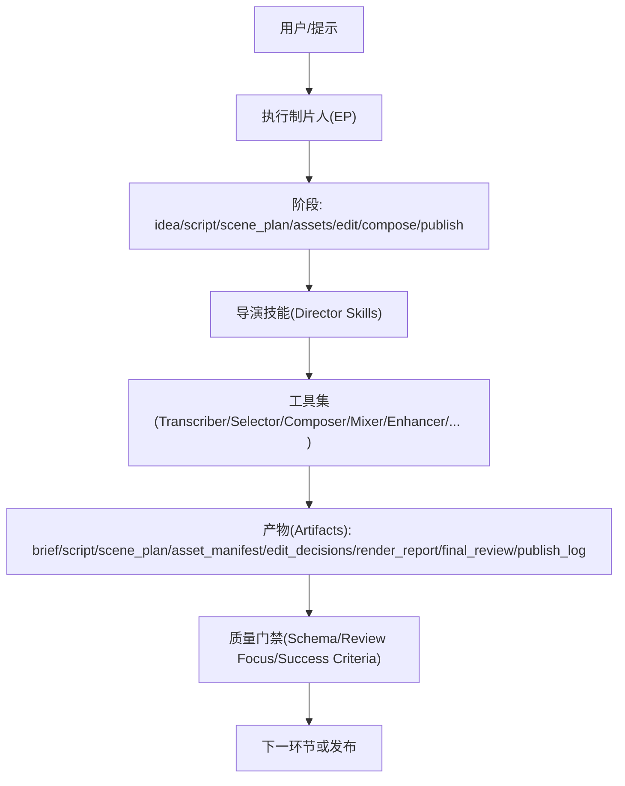
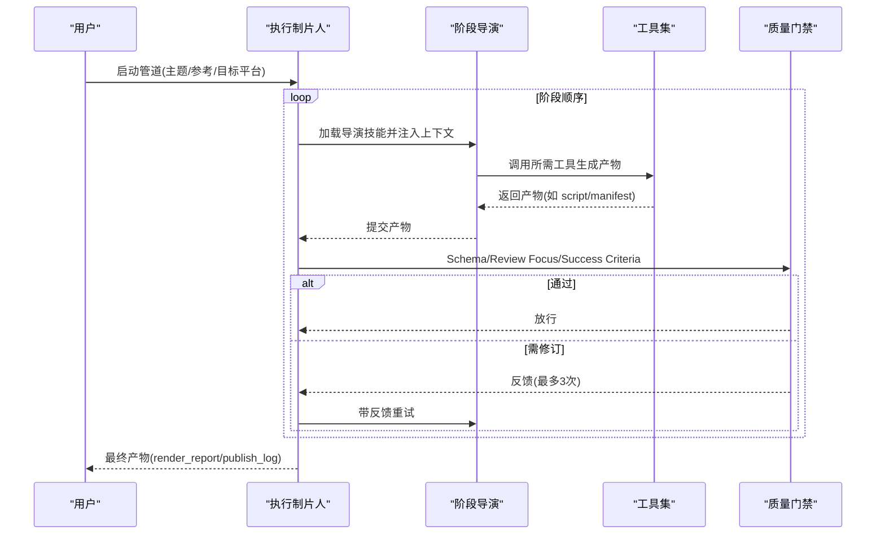
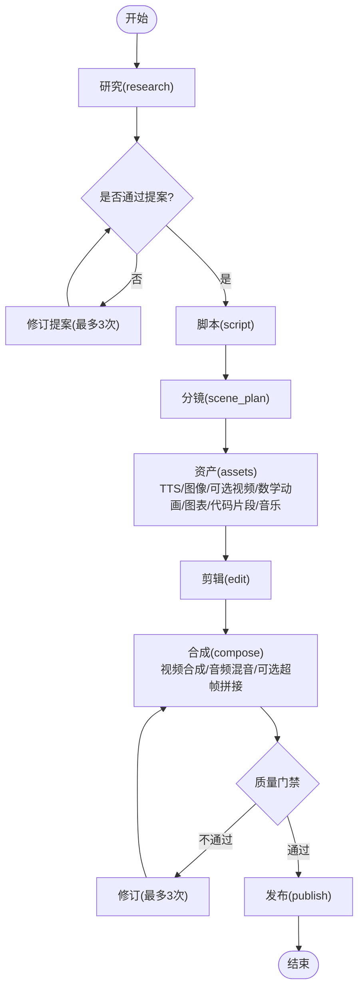
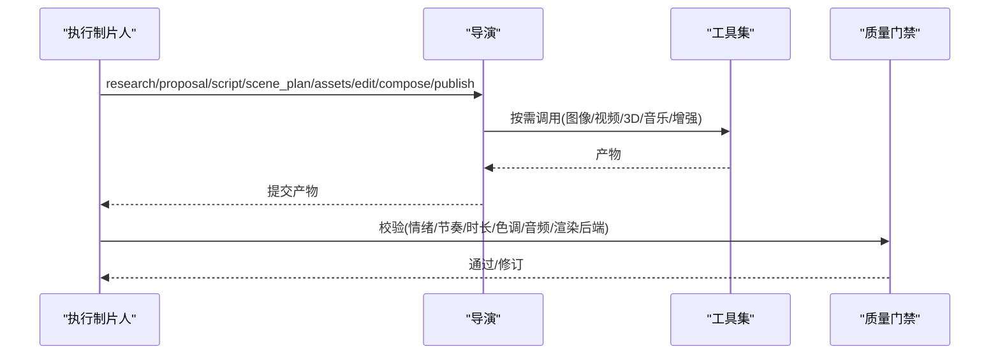
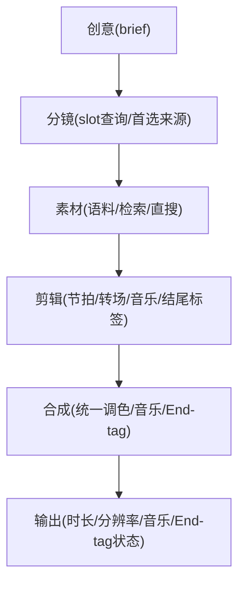
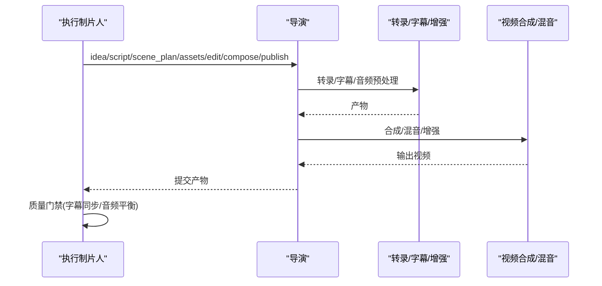
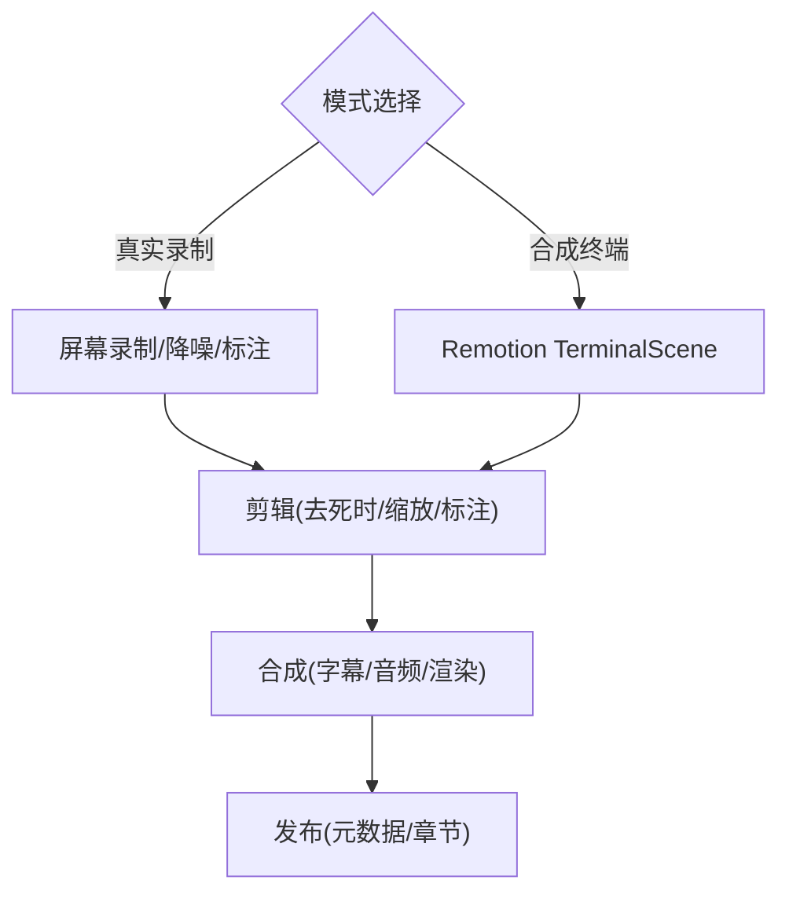
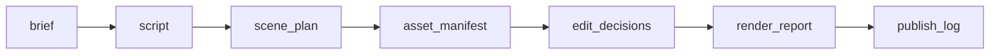

# 预定义工作流

<cite>
**本文引用的文件**
- [animated-explainer.yaml](file://pipeline_defs/animated-explainer.yaml)
- [animation.yaml](file://pipeline_defs/animation.yaml)
- [cinematic.yaml](file://pipeline_defs/cinematic.yaml)
- [documentary-montage.yaml](file://pipeline_defs/documentary-montage.yaml)
- [talking-head.yaml](file://pipeline_defs/talking-head.yaml)
- [screen-demo.yaml](file://pipeline_defs/screen-demo.yaml)
- [podcast-repurpose.yaml](file://pipeline_defs/podcast-repurpose.yaml)
- [clip-factory.yaml](file://pipeline_defs/clip-factory.yaml)
- [avatar-spokesperson.yaml](file://pipeline_defs/avatar-spokesperson.yaml)
- [localization-dub.yaml](file://pipeline_defs/localization-dub.yaml)
- [hybrid.yaml](file://pipeline_defs/hybrid.yaml)
- [executive-producer.md（动画）](file://skills/pipelines/animation/executive-producer.md)
- [executive-producer.md（屏幕演示）](file://skills/pipelines/screen-demo/executive-producer.md)
- [executive-producer.md（对话头）](file://skills/pipelines/talking-head/executive-producer.md)
</cite>

## 目录
1. [简介](#简介)
2. [项目结构](#项目结构)
3. [核心组件](#核心组件)
4. [架构总览](#架构总览)
5. [详细组件分析](#详细组件分析)
6. [依赖关系分析](#依赖关系分析)
7. [性能与质量考量](#性能与质量考量)
8. [故障排查指南](#故障排查指南)
9. [结论](#结论)
10. [附录：管道选择建议与最佳实践](#附录：管道选择建议与最佳实践)

## 简介
本指南面向使用 OpenMontage 的创作者与工程师，系统化介绍其内置预定义工作流（管道），覆盖 10+ 种管道的功能特点、适用场景、执行流程、阶段设计、工具选择策略与质量控制机制。重点解析动画解释器、电影预告片、纪录片蒙太奇、对话头、屏幕演示、播客重制等核心工作流的端到端执行路径，并提供参数配置、自定义调整与性能优化建议，帮助在不同业务场景中快速选型并稳定产出高质量视频。

## 项目结构
OpenMontage 将“管道”以声明式 YAML 定义在 pipeline_defs 目录下，每个 YAML 描述一个完整的生产流水线：名称、版本、类别、稳定性、编排策略、所需技能、兼容风格包、阶段序列、各阶段的输入/输出产物、可用工具、检查点与人工审批策略、评审关注点与成功标准等。运行时由“执行制片人（Executive Producer, EP）”按阶段串行调度，结合导演技能（director skills）完成具体任务，并通过 schema 校验与跨阶段一致性检查进行质量门禁。

图表来源
- [executive-producer.md（动画）](file://skills/pipelines/animation/executive-producer.md)
- [executive-producer.md（屏幕演示）](file://skills/pipelines/screen-demo/executive-producer.md)
- [executive-producer.md（对话头）](file://skills/pipelines/talking-head/executive-producer.md)

章节来源
- [README.md:125-176](file://README.md#L125-L176)

## 核心组件
- 管道定义（YAML）：声明式描述生产流程、阶段、产物、工具、审批与质量标准。
- 执行制片人（EP）：负责阶段编排、上下文注入、评审与放行、修订与回退控制。
- 导演技能（Director Skills）：每个阶段的具体执行逻辑，产出对应产物。
- 工具集：转录、素材选择、合成、混音、增强、字幕、转场、渲染等。
- 产物（Artifacts）：brief、script、scene_plan、asset_manifest、edit_decisions、render_report、final_review、publish_log 等，贯穿全链路。
- 质量门禁：schema 校验、review_focus 检查、success_criteria 判定、跨阶段一致性（如 render_runtime 锁定）。

章节来源
- [executive-producer.md（动画）:116-156](file://skills/pipelines/animation/executive-producer.md#L116-L156)
- [executive-producer.md（屏幕演示）:76-102](file://skills/pipelines/screen-demo/executive-producer.md#L76-L102)
- [executive-producer.md（对话头）:103-150](file://skills/pipelines/talking-head/executive-producer.md#L103-L150)

## 架构总览
所有管道遵循统一的“阶段化 + 产物驱动 + 质量门禁”的架构。EP 在每个阶段加载对应导演技能，注入上下文（预算、风格锚点、前序产物），运行后执行 schema 校验与 review_focus/success_criteria 检查，决定 PASS/REVISE/SEND_BACK。关键治理点包括：
- render_runtime 锁定：提案阶段选定渲染后端（Remotion/HyperFrames/FFmpeg），后续不得静默替换。
- 成本与时长约束：预算默认值、每阶段最大修订次数、最长墙钟时间。
- 可定制性：允许自定义脚本、风格包、技能与工具扩展（部分管道限制自定义工具）。

图表来源
- [executive-producer.md（动画）:116-156](file://skills/pipelines/animation/executive-producer.md#L116-L156)
- [executive-producer.md（屏幕演示）:76-102](file://skills/pipelines/screen-demo/executive-producer.md#L76-L102)
- [executive-producer.md（对话头）:103-150](file://skills/pipelines/talking-head/executive-producer.md#L103-L150)

## 详细组件分析

### 动画解释器（Animated Explainer）
- 目标与适用场景：从主题/想法自动生成讲解视频，包含旁白、画面与音乐；支持参考视频输入，先研究再提案，经用户批准后再生产。
- 阶段设计：research → proposal(sample可选) → script → scene_plan → assets → edit → compose → publish。
- 工具选择策略：资产阶段强制 tts_selector/image_selector，可选 video_selector/math_animate/diagram_gen/code_snippet/music_gen；合成阶段必须 video_compose/audio_mixer，可选 hyperframes_compose/video_stitch。
- 质量控制：proposal 阶段需 itemized cost_estimate 与 approved status；compose 阶段要求 duration ±5%、音频平衡、render_runtime 与提案一致，HyperFrames 需 lint+validate。
- 执行要点：预算默认 $2，每阶段最多 3 次修订，最长 20 分钟墙钟时间。

图表来源
- [animated-explainer.yaml:61-270](file://pipeline_defs/animated-explainer.yaml#L61-L270)

章节来源
- [animated-explainer.yaml:1-270](file://pipeline_defs/animated-explainer.yaml#L1-L270)

### 电影预告片（Cinematic）
- 目标与适用场景：情绪驱动的预告片、品牌片、蒙太奇、短剧剪辑；适合已有素材或图片，可补充生成视觉填补空白。
- 阶段设计：research → proposal(sample可选) → script → scene_plan → assets → edit → compose → publish。
- 工具选择策略：资产阶段可选字幕/音频增强/图像与视频选择/3D世界/音乐；合成阶段必须 video_compose/audio_mixer，可选视频拼接/裁剪/调色/音频增强。
- 质量控制：提案需明确情感弧线与交付承诺；compose 阶段强调情绪节奏、色彩一致性与音频动态，且 render_runtime 必须与提案一致。
- 执行要点：预算默认 $2，最长 12 分钟墙钟时间。

图表来源
- [cinematic.yaml:60-288](file://pipeline_defs/cinematic.yaml#L60-L288)

章节来源
- [cinematic.yaml:1-288](file://pipeline_defs/cinematic.yaml#L1-L288)

### 纪录片蒙太奇（Documentary Montage）
- 目标与适用场景：检索优先的主题蒙太奇，基于真实素材库（Pexels、Archive.org、NASA、Wikimedia、Unsplash）构建语料，用 CLIP 检索填充槽位，按叙事节拍剪辑并统一调色与音乐。
- 阶段设计：idea → scene_plan → assets → edit → compose。
- 工具选择策略：资产阶段支持 fast path（direct_clip_search）与 standard path（corpus_builder + clip_search），可选 music_gen；合成阶段必须 video_compose，可选 audio_mixer/color_grade/video_trimmer/video_stitch。
- 质量控制：idea 阶段需明确主题问题、基调、时长与音乐/结尾标签计划；assets 阶段要求每个槽位唯一选取、来源与许可清晰；compose 阶段强制 Remotion 渲染家族用于 end-tag 叠加/拼接，且音乐混合为必填（除非显式豁免）。
- 执行要点：预算默认 $1，最长 60 分钟墙钟时间。

图表来源
- [documentary-montage.yaml:45-179](file://pipeline_defs/documentary-montage.yaml#L45-L179)

章节来源
- [documentary-montage.yaml:1-179](file://pipeline_defs/documentary-montage.yaml#L1-L179)

### 对话头（Talking Head）
- 目标与适用场景：对真人讲话原始素材进行转录、剪辑决策、字幕生成、音频混音与最终合成。
- 阶段设计：idea → script → scene_plan → assets → edit → compose → publish。
- 工具选择策略：脚本阶段必须 transcriber；资产阶段必须 subtitle_gen，可选 audio_mixer/image_selector；合成阶段必须 video_compose/audio_mixer，可选 face/eye 增强、调色、自动重构图、Remotion 逐字字幕、展示卡、视频拼接、视觉质检。
- 质量控制：script 阶段需保证转录准确性与时戳对齐；compose 阶段确保字幕同步、音频清晰平衡。
- 执行要点：预算默认 $0.50，每阶段最多 3 次修订。

图表来源
- [talking-head.yaml:42-229](file://pipeline_defs/talking-head.yaml#L42-L229)

章节来源
- [talking-head.yaml:1-229](file://pipeline_defs/talking-head.yaml#L1-L229)

### 屏幕演示（Screen Demo）
- 目标与适用场景：屏幕录制演示，两种模式：
  - 真实录制：捕获桌面/浏览器会话，生成带标注、缩放裁剪、字幕与降噪的演示视频。
  - 合成终端：Remotion TerminalScene，确定性终端动画，适合 CLI/安装流程演示，隐私安全、像素级精确。
- 阶段设计：idea → script → scene_plan → assets → edit → compose → publish。
- 工具选择策略：脚本阶段必须 transcriber；资产阶段可选字幕/TTS/图像/图表/音频增强；合成阶段必须 video_compose/audio_mixer，可选视频裁剪/音频增强；推荐 remotion（TerminalScene）或 hyperframes（HTML/GSAP UI）。
- 质量控制：compose 阶段要求输出可读、UI 文本清晰、音频干净，且 render_runtime 与提案一致。
- 执行要点：预算默认 $1，最长 10 分钟墙钟时间。

图表来源
- [screen-demo.yaml:1-247](file://pipeline_defs/screen-demo.yaml#L1-L247)

章节来源
- [screen-demo.yaml:1-247](file://pipeline_defs/screen-demo.yaml#L1-L247)

### 播客重制（Podcast Repurpose）
- 目标与适用场景：将播客音频（或视频播客）转化为可视化内容：音频波形/字幕短视频、金句社交素材、可选整集伴生视频。
- 阶段设计：idea → script → scene_plan → assets → edit → compose → publish。
- 工具选择策略：脚本阶段必须 transcriber，可选音频增强；资产阶段必须 subtitle_gen，可选图像/图表/音乐/音频增强；合成阶段必须 video_compose/audio_mixer，可选视频裁剪/音频增强。
- 质量控制：确保音频质量保留、波形/动效符合布局、多交付物一致性。
- 执行要点：预算默认 $1，最长 12 分钟墙钟时间。

章节来源
- [podcast-repurpose.yaml:1-213](file://pipeline_defs/podcast-repurpose.yaml#L1-L213)

### 多片段工厂（Clip Factory）
- 目标与适用场景：从长内容（研讨会、直播、演讲、访谈）批量提取多条短视频，适配社交媒体分发。
- 阶段设计：idea → script → scene_plan → assets → edit → compose → publish。
- 工具选择策略：脚本阶段必须 transcriber，可选场景检测；资产阶段必须 subtitle_gen，可选音频增强；合成阶段必须 video_compose/video_trimmer/audio_mixer，可选音频增强/调色。
- 质量控制：每条片段独立自洽、钩子在前 2-3 秒、字幕样式一致、音频水平一致。
- 执行要点：预算默认 $1，最长 12 分钟墙钟时间。

章节来源
- [clip-factory.yaml:1-207](file://pipeline_defs/clip-factory.yaml#L1-L207)

### 虚拟发言人（Avatar Spokesperson）
- 目标与适用场景：数字发言人主导的视频（内部更新、入职培训、销售介绍、短脚本讲解），支持口型同步与简单图形叠加。
- 阶段设计：idea → script → scene_plan → assets → edit → compose → publish。
- 工具选择策略：资产阶段可选 talking_head/lip_sync/tts_selector/subtitle_gen/image_selector/audio_enhance/video_selector；合成阶段必须 video_compose/audio_mixer，可选视频拼接/音频增强。
- 质量控制：确保口型/嘴部时序可接受、字幕排版整洁、音频聚焦发言人。
- 执行要点：预算默认 $2，最长 12 分钟墙钟时间。

章节来源
- [avatar-spokesperson.yaml:1-207](file://pipeline_defs/avatar-spokesperson.yaml#L1-L207)

### 本地化配音（Localization Dub）
- 目标与适用场景：基于现有源视频，制作翻译字幕、配音与可选口型同步的多语言版本。
- 阶段设计：idea → script → scene_plan → assets → edit → compose → publish。
- 工具选择策略：脚本阶段必须 transcriber；资产阶段必须 tts_selector/subtitle_gen，可选 lip_sync/audio_enhance；合成阶段必须 video_compose/audio_mixer，可选视频裁剪/音频增强。
- 质量控制：保持源结构、CTA/法律文案可翻译、语言变体组织一致、版本标签清晰。
- 执行要点：预算默认 $3，最长 15 分钟墙钟时间。

章节来源
- [localization-dub.yaml:1-208](file://pipeline_defs/localization-dub.yaml#L1-L208)

### 混合媒体（Hybrid）
- 目标与适用场景：将源素材与设计/生成支持素材组合（采访+图表、产品镜头+叠加、屏幕录制+伴生图形、蒙太奇+插入）。
- 阶段设计：idea → script → scene_plan → assets → edit → compose → publish。
- 工具选择策略：脚本阶段可选转录/场景检测/音频增强；资产阶段可选字幕/TTS/图像/视频/图表/代码片段/音乐/音频增强；合成阶段必须 video_compose/audio_mixer，可选视频拼接/裁剪/调色/音频增强。
- 质量控制：源与支持层平衡、可读性、音频连贯；通常推荐 remotion 以便源视频与 React 支持叠加一次合成。
- 执行要点：预算默认 $2，最长 12 分钟墙钟时间。

章节来源
- [hybrid.yaml:1-228](file://pipeline_defs/hybrid.yaml#L1-L228)

### 动画（Animation）
- 目标与适用场景：动效优先（图形动效、图解讲解、动态排版、数学可视化、Three.js 世界、风格化插画序列）；支持参考视频输入，先研究再提案，经批准后再生产。
- 阶段设计：research → proposal(sample可选) → script → scene_plan → assets → edit → compose → publish。
- 工具选择策略：资产阶段可选 TTS/图像/视频/数学动画/图表/代码片段/3D世界/音乐；合成阶段必须 video_compose/audio_mixer，可选 hyperframes_compose/video_stitch。
- 质量控制：提案需明确动画模式与复用策略、音频架构、提供商对比与 render_runtime 选择；compose 阶段要求文本/图表锐利、运动时序保留、时长 ±5%，且 HyperFrames 必须通过 lint+validate。
- 执行要点：预算默认 $2，最长 15 分钟墙钟时间。

章节来源
- [animation.yaml:1-300](file://pipeline_defs/animation.yaml#L1-L300)

## 依赖关系分析
- 阶段依赖：每个阶段依赖前一阶段的产物（如 script 依赖 brief，scene_plan 依赖 script，assets 依赖 scene_plan 与 script 等）。
- 工具依赖：不同阶段声明 required_tools/optional_tools/tools_available，限制能力边界与风险暴露面。
- 渲染后端依赖：多个管道在 compose 阶段强调 render_runtime 锁定（remotion/hyperframes/ffmpeg），禁止静默替换，保障一致性。
- 外部服务依赖：转录、TTS、图像/视频生成、音乐生成、3D 资产、调色、字幕等工具可能依赖第三方 API 或本地模型。

图表来源
- [talking-head.yaml:42-229](file://pipeline_defs/talking-head.yaml#L42-L229)
- [screen-demo.yaml:77-247](file://pipeline_defs/screen-demo.yaml#L77-L247)
- [podcast-repurpose.yaml:46-213](file://pipeline_defs/podcast-repurpose.yaml#L46-L213)

章节来源
- [talking-head.yaml:42-229](file://pipeline_defs/talking-head.yaml#L42-L229)
- [screen-demo.yaml:77-247](file://pipeline_defs/screen-demo.yaml#L77-L247)
- [podcast-repurpose.yaml:46-213](file://pipeline_defs/podcast-repurpose.yaml#L46-L213)

## 性能与质量考量
- 成本控制：
  - 合理设置预算默认值与每阶段最大修订次数，避免无限循环。
  - 资产阶段优先选择 selector 工具（video_selector/tts_selector/image_selector），减少直接调用供应商的成本波动。
  - 延长片段时长（如 10s 优于 5s）以降低 API 调用次数与成本。
- 渲染效率：
  - 根据内容类型选择合适渲染后端：remotion 适合视频主导与 React 叠加；hyperframes 适合 HTML/GSAP 动效；ffmpeg 适合简单拼接。
  - 对 hyperframes 渲染，务必在执行前通过 lint+validate，避免失败重渲染。
- 质量门禁：
  - 严格遵循 review_focus 与 success_criteria，确保时长、分辨率、音频平衡、字幕同步、色彩统一等指标达标。
  - 对 motion-led 承诺禁止静默降级到纯音频或静态画面。
- 资源管理：
  - 合理使用缓存与复用模板（motifs/templates），降低重复生成成本。
  - 对长时任务（如纪录片蒙太奇）设置更长墙钟时间上限，避免超时中断。

[本节提供通用指导，无需特定文件引用]

## 故障排查指南
- 常见错误与定位：
  - 产物缺失或路径无效：检查 asset_manifest 中文件是否存在，确认资产阶段工具是否成功执行。
  - 字幕不同步：回溯至 script 阶段，核对转录时间戳与语音对齐情况，必要时重新转录或手动修正。
  - 渲染失败：确认 render_runtime 与提案一致；若使用 hyperframes，确保已通过 lint+validate；若使用 remotion，检查组件与资源可用性。
  - 音频问题：检查 audio_mixer 配置（ducking、目标响度）、音频增强步骤是否启用。
- 调试方法：
  - 查看 Backlot 看板，追踪阶段状态与产物生成日志。
  - 逐步回退到最近通过的阶段，缩小问题范围。
  - 针对工具调用，检查环境变量与密钥配置（如 TTS/图像/视频生成 API）。

章节来源
- [executive-producer.md（动画）:116-156](file://skills/pipelines/animation/executive-producer.md#L116-L156)
- [executive-producer.md（屏幕演示）:76-102](file://skills/pipelines/screen-demo/executive-producer.md#L76-L102)
- [executive-producer.md（对话头）:103-150](file://skills/pipelines/talking-head/executive-producer.md#L103-L150)

## 结论
OpenMontage 的预定义工作流以声明式管道为核心，通过执行制片人与导演技能的协作，实现从创意到发布的标准化、可审计、可定制的视频生产流程。不同管道在阶段设计、工具选择与质量控制上各有侧重，但均遵循统一的治理原则（如 render_runtime 锁定、预算与时长约束、schema 校验与评审焦点）。在实际业务中，应根据内容类型、平台目标与资源条件选择合适的管道，并结合最佳实践进行参数调优与性能优化。

[本节总结性内容，无需特定文件引用]

## 附录：管道选择建议与最佳实践
- 选择建议：
  - 讲解类内容：动画解释器（结构化、研究先行、成本透明）。
  - 情绪/品牌向：电影预告片（情感弧线、色彩与音频动态控制）。
  - 纪实/资料整合：纪录片蒙太奇（检索优先、真实素材、统一调色与音乐）。
  - 真人讲解：对话头（转录精准、字幕同步、增强可选）。
  - 软件/CLI 演示：屏幕演示（真实录制或合成终端，注重可读性与节奏）。
  - 播客衍生：播客重制（多交付物、音频质量保留、可视化增强）。
  - 批量短视频：多片段工厂（钩子前置、风格一致、平台适配）。
  - 数字发言人：虚拟发言人（口型同步、简洁图形、聚焦发言人）。
  - 多语言发布：本地化配音（字幕/配音/口型同步、版本管理）。
  - 混合媒体：混合管道（源与支持层平衡、可读性与音频连贯）。
- 最佳实践：
  - 在提案阶段明确 render_runtime、音频架构与提供商对比，记录决策日志。
  - 资产阶段优先使用 selector 工具，最大化复用模板与 motif。
  - 合成阶段严格执行质量门禁，确保时长、分辨率、音频与字幕达标。
  - 对 hyperframes 渲染，执行前必须通过 lint+validate。
  - 对长时任务设置合适的墙钟时间上限，避免超时中断。
  - 利用 Backlot 看板进行可视化监控与审批，提升透明度与可控性。

[本节提供通用指导，无需特定文件引用]