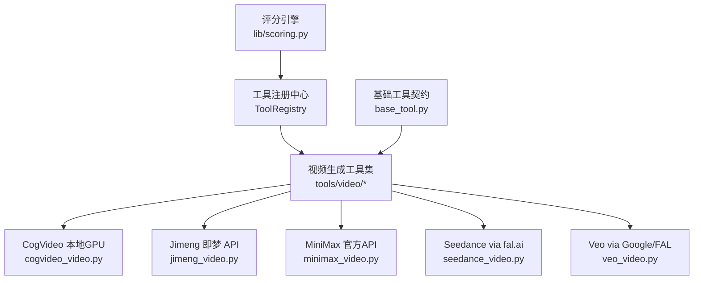
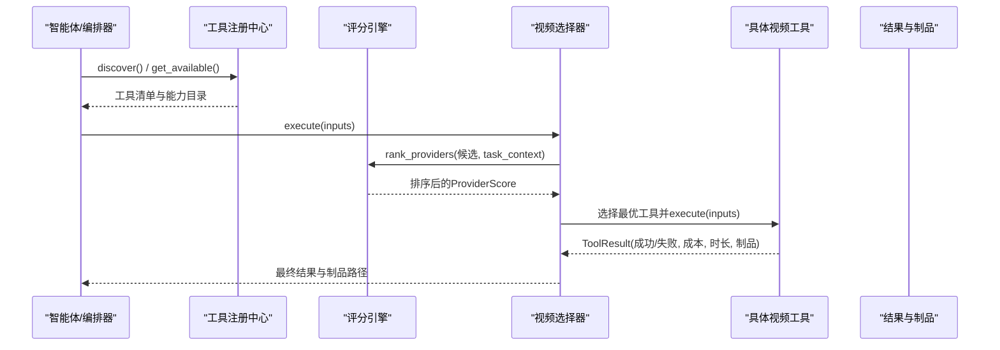
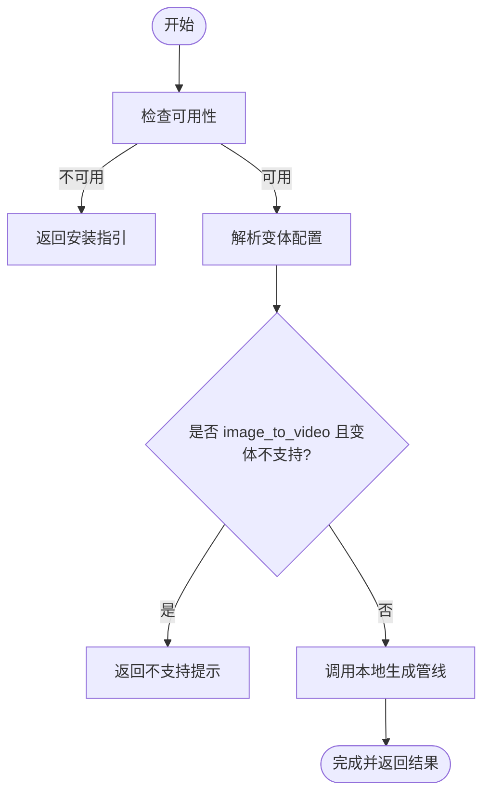
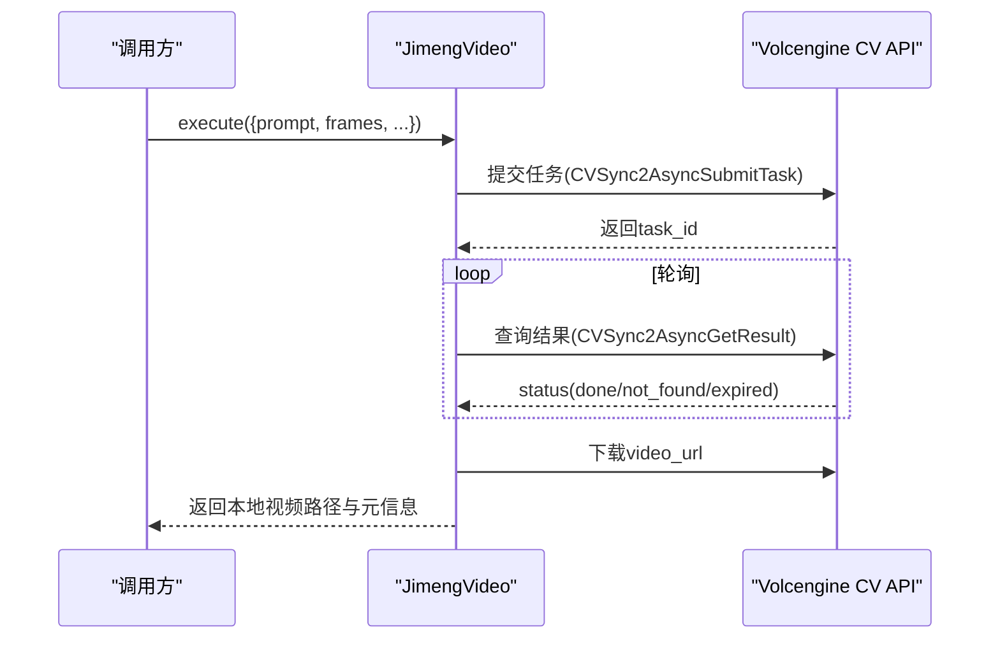
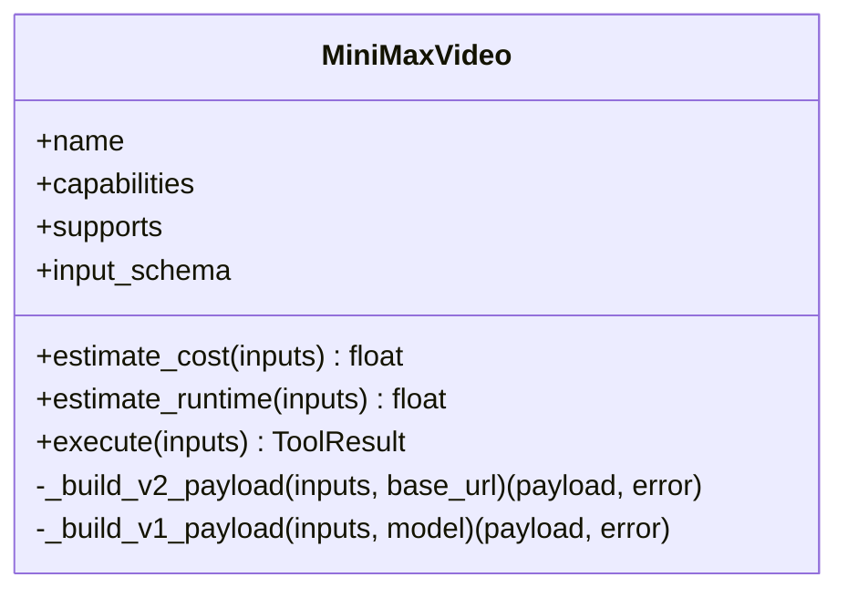
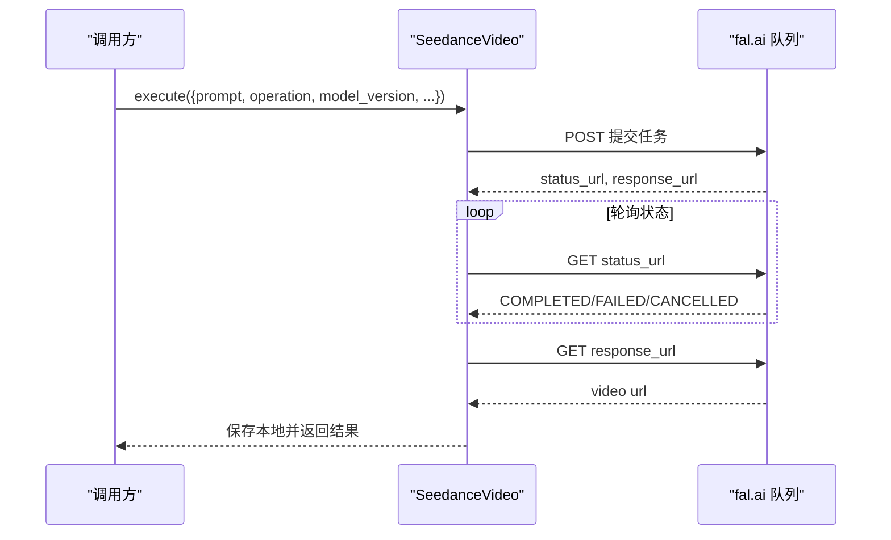
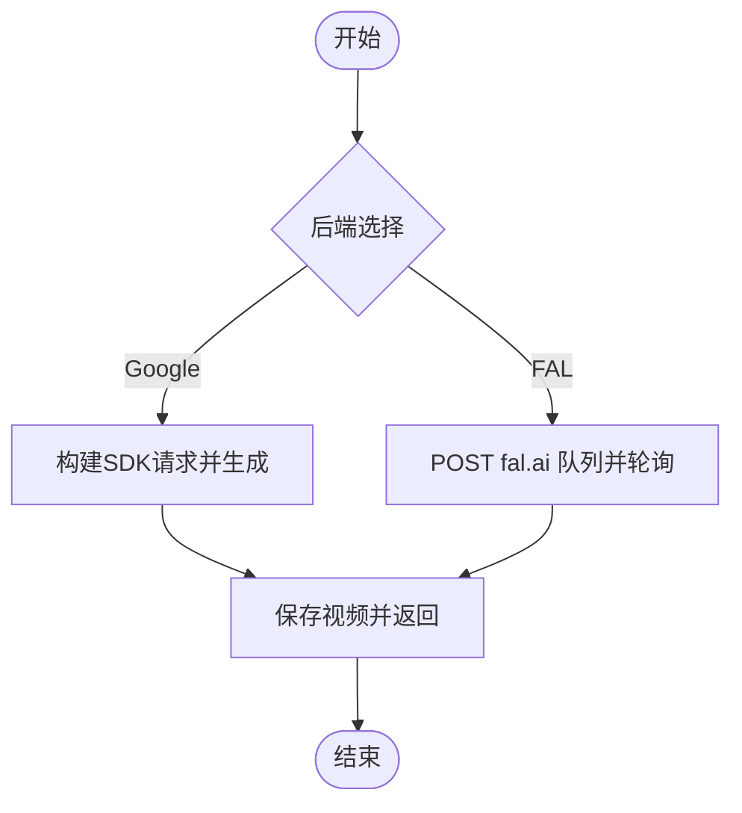
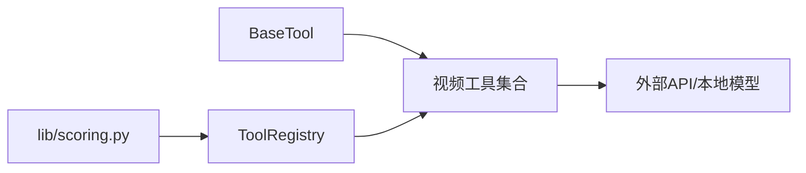

# 专业视频工具

<cite>
**本文引用的文件**
- [README.md](file://README.md)
- [PROVIDERS.md](file://docs/PROVIDERS.md)
- [base_tool.py](file://tools/base_tool.py)
- [tool_registry.py](file://tools/tool_registry.py)
- [scoring.py](file://lib/scoring.py)
- [cogvideo_video.py](file://tools/video/cogvideo_video.py)
- [jimeng_video.py](file://tools/video/jimeng_video.py)
- [minimax_video.py](file://tools/video/minimax_video.py)
- [seedance_video.py](file://tools/video/seedance_video.py)
- [veo_video.py](file://tools/video/veo_video.py)
</cite>

## 目录
1. [简介](#简介)
2. [项目结构](#项目结构)
3. [核心组件](#核心组件)
4. [架构总览](#架构总览)
5. [详细组件分析](#详细组件分析)
6. [依赖关系分析](#依赖关系分析)
7. [性能与成本优化](#性能与成本优化)
8. [故障排查指南](#故障排查指南)
9. [结论](#结论)
10. [附录：参数与最佳实践速查](#附录参数与最佳实践速查)

## 简介
本技术文档聚焦 OpenMontage 对 CogVideo、Jimeng（即梦）、MiniMax、Seedance、Veo 等专业视频生成工具的集成实现，系统阐述各工具的独特能力、关键参数、使用场景与高级控制选项；并给出性能优化、成本控制与质量保证的最佳实践。同时提供面向动画制作、特效合成、虚拟拍摄等垂直领域的组合工作流建议，以及调试技巧与可复现的调用路径说明。

OpenMontage 通过统一的工具契约、评分选择器与注册中心，将多厂商视频模型接入同一编排层，使智能体在“任务契合度、输出质量、可控性、可靠性、成本效率、延迟、连续性”七个维度上自动择优，并在执行前后进行严格的自检与审计。

**章节来源**
- [README.md:489-518](file://README.md#L489-L518)
- [README.md:664-688](file://README.md#L664-L688)

## 项目结构
OpenMontage 的视频能力集中在 tools/video 下，每个提供商对应一个工具类，统一继承 BaseTool，并通过 ToolRegistry 自动发现与注册。lib/scoring.py 提供评分引擎，用于在运行时按上下文选择最优提供商。

**图表来源**
- [tool_registry.py:118-134](file://tools/tool_registry.py#L118-L134)
- [base_tool.py:227-372](file://tools/base_tool.py#L227-L372)
- [cogvideo_video.py:22-75](file://tools/video/cogvideo_video.py#L22-L75)
- [jimeng_video.py:49-157](file://tools/video/jimeng_video.py#L49-L157)
- [minimax_video.py:58-247](file://tools/video/minimax_video.py#L58-L247)
- [seedance_video.py:28-204](file://tools/video/seedance_video.py#L28-L204)
- [veo_video.py:33-169](file://tools/video/veo_video.py#L33-L169)

**章节来源**
- [README.md:450-475](file://README.md#L450-L475)
- [tool_registry.py:118-134](file://tools/tool_registry.py#L118-L134)

## 核心组件
- 基础工具契约：BaseTool 定义工具元数据、资源需求、重试策略、成本/时长估算、状态检查、执行封装与事件埋点，所有视频工具均遵循该契约。
- 工具注册中心：ToolRegistry 负责扫描 tools 包、注册工具实例、查询可用性与能力目录，并提供 provider_menu 与 support_envelope 等概览接口。
- 评分引擎：lib/scoring.py 将任务上下文标准化，基于七维权重计算 ProviderScore，支持“电影级”特性加分、参考条件偏好、预算约束等策略。

这些组件共同确保：新增工具无需改动编排逻辑即可被自动发现、评估与调用；每次选择都有可解释的打分依据与审计记录。

**章节来源**
- [base_tool.py:227-372](file://tools/base_tool.py#L227-L372)
- [tool_registry.py:55-134](file://tools/tool_registry.py#L55-L134)
- [scoring.py:21-70](file://lib/scoring.py#L21-L70)
- [scoring.py:373-530](file://lib/scoring.py#L373-L530)

## 架构总览
下图展示从“任务输入”到“提供商选择”再到“具体工具执行”的端到端流程，涵盖评分、降级与结果回传。

**图表来源**
- [tool_registry.py:118-134](file://tools/tool_registry.py#L118-L134)
- [scoring.py:533-542](file://lib/scoring.py#L533-L542)
- [base_tool.py:148-224](file://tools/base_tool.py#L148-L224)

## 详细组件分析

### CogVideo（本地 GPU）
- 定位与能力：本地 GPU 视频生成，支持文本到视频与图像到视频（取决于变体），适合低显存实验与明确需要 CogVideo 家族的路径。
- 关键参数：prompt、operation、model_variant（如 cogvideo-5b）、reference_image_url/path、width/height、num_frames、num_inference_steps、enable_model_offload、seed、output_path。
- 运行特征：同步执行、随机性、本地 GPU 运行；资源需求包含 CPU/内存/显存/磁盘；无网络要求。
- 错误处理：若未安装或不可用，返回安装指引；当选择的变体不支持 image_to_video 时快速失败并提示。
- 成本与时长：成本估计为 0；时长根据变体速度估算。

**图表来源**
- [cogvideo_video.py:77-139](file://tools/video/cogvideo_video.py#L77-L139)

**章节来源**
- [cogvideo_video.py:22-75](file://tools/video/cogvideo_video.py#L22-L75)
- [cogvideo_video.py:77-139](file://tools/video/cogvideo_video.py#L77-L139)

### Jimeng 即梦（Volcengine 直连）
- 定位与能力：通过 Volcengine 视觉 API 直接调用即梦 3.0 Pro，支持文本到视频与图像到视频，中文提示理解良好，支持帧数与画幅配置。
- 关键参数：prompt、operation、image_url、frames（121=5s，241=10s）、aspect_ratio、seed、poll_interval_seconds、timeout_seconds、output_path。
- 认证与流程：HMAC-SHA256 V4 签名；提交任务 → 轮询结果 → 下载视频 URL。
- 错误处理：鉴权缺失、任务状态异常、超时等均会返回明确错误；日志中自动脱敏密钥。
- 成本与时长：按秒估算成本；预估时长随帧数线性增长。

**图表来源**
- [jimeng_video.py:212-323](file://tools/video/jimeng_video.py#L212-L323)
- [jimeng_video.py:325-406](file://tools/video/jimeng_video.py#L325-L406)

**章节来源**
- [jimeng_video.py:49-157](file://tools/video/jimeng_video.py#L49-L157)
- [jimeng_video.py:176-210](file://tools/video/jimeng_video.py#L176-L210)
- [jimeng_video.py:212-323](file://tools/video/jimeng_video.py#L212-L323)
- [jimeng_video.py:325-406](file://tools/video/jimeng_video.py#L325-L406)

### MiniMax（官方直连）
- 定位与能力：官方 MiniMax-H3（v2）与旧版 v1 模型，支持文本到视频、图像到视频、首尾帧插值与多模态参考（图/视/音）。
- 关键参数：prompt、operation、model、first_frame_image/last_frame_image/end_image_url/image_url、reference_*_urls、duration（4–15）、resolution（H3 固定 2K）、ratio/aspect_ratio、callback_url、aigc_watermark（大陆）、poll_interval_seconds、timeout_seconds、output_path。
- 路由与区域：支持 global 与 cn 区域，可通过环境变量覆盖 base_url。
- 错误处理：v1/v2 不同响应结构；超时保留 task_id 以便恢复；失败时返回结构化错误。
- 成本与时长：H3 按秒与额外参考图计费；Fast 模型更短耗时与更低成本。

**图表来源**
- [minimax_video.py:58-247](file://tools/video/minimax_video.py#L58-L247)
- [minimax_video.py:323-422](file://tools/video/minimax_video.py#L323-L422)
- [minimax_video.py:424-454](file://tools/video/minimax_video.py#L424-L454)
- [minimax_video.py:456-664](file://tools/video/minimax_video.py#L456-L664)

**章节来源**
- [minimax_video.py:58-247](file://tools/video/minimax_video.py#L58-L247)
- [minimax_video.py:271-295](file://tools/video/minimax_video.py#L271-L295)
- [minimax_video.py:456-664](file://tools/video/minimax_video.py#L456-L664)

### Seedance（fal.ai）
- 定位与能力：通过 fal.ai 访问 ByteDance Seedance 2.0/2.5，支持文本到视频、图像到视频与多参考（图/视/音），具备原生音频、导演级镜头控制、多镜头单生成、引用对话口型同步等高级能力。
- 关键参数：prompt、operation、model_variant（standard/fast）、model_version（2.0/2.5）、duration（auto 或 4–30）、aspect_ratio、resolution、generate_audio、image_url/path、end_image_url、reference_image_urls/paths、reference_video_urls、reference_audio_urls、seed、output_path。
- 限制与校验：2.5 无 fast 端点；2.5 支持最多 30 图/10 视/10 音参考；上传本地图片至 fal.ai 存储。
- 成本与时长：2.5 按秒计价；标准模式较慢但质量更高。

**图表来源**
- [seedance_video.py:237-403](file://tools/video/seedance_video.py#L237-L403)

**章节来源**
- [seedance_video.py:28-204](file://tools/video/seedance_video.py#L28-L204)
- [seedance_video.py:214-235](file://tools/video/seedance_video.py#L214-L235)
- [seedance_video.py:237-403](file://tools/video/seedance_video.py#L237-L403)

### Veo（Google/FAL）
- 定位与能力：Google Veo 3.1，支持文本到视频、图像到视频、参考到视频与首尾帧插值；可选 Google GenAI 或 fal.ai 后端；支持原生音频、环境声、对话生成。
- 关键参数：prompt、backend（auto/google/fal）、operation、model_variant、duration（如 8s）、aspect_ratio、generate_audio、resolution（720p/1080p/4k）、negative_prompt、seed、auto_fix、safety_tolerance、image_url/path、reference_image_urls/paths、first/last frame 相关字段、output_path。
- 后端选择：优先检测 Google 凭据，否则回退到 FAL；Google 端对分辨率/操作有 8 秒强制约束（可 auto_fix）。
- 成本与时长：Google 端按秒计价；FAL 端按 variant/resolution/audio 组合计价；fast 变体更快。

**图表来源**
- [veo_video.py:263-280](file://tools/video/veo_video.py#L263-L280)
- [veo_video.py:282-543](file://tools/video/veo_video.py#L282-L543)
- [veo_video.py:545-723](file://tools/video/veo_video.py#L545-L723)

**章节来源**
- [veo_video.py:33-169](file://tools/video/veo_video.py#L33-L169)
- [veo_video.py:187-239](file://tools/video/veo_video.py#L187-L239)
- [veo_video.py:263-280](file://tools/video/veo_video.py#L263-L280)
- [veo_video.py:282-543](file://tools/video/veo_video.py#L282-L543)
- [veo_video.py:545-723](file://tools/video/veo_video.py#L545-L723)

## 依赖关系分析
- 工具契约与注册：所有视频工具继承 BaseTool，由 ToolRegistry 自动发现与注册，暴露 capability/provider/status 等信息。
- 评分与选择：视频选择器调用 lib/scoring.py 的 score_provider/rank_providers，结合任务上下文（意图、风格关键词、预算、是否需运动、是否需参考条件等）对候选工具打分并择优。
- 外部依赖：各工具声明 dependencies（如环境变量），get_status 检查可用性；部分工具依赖第三方库（如 requests、google-genai、PIL）。

**图表来源**
- [base_tool.py:227-372](file://tools/base_tool.py#L227-L372)
- [tool_registry.py:118-134](file://tools/tool_registry.py#L118-L134)
- [scoring.py:373-530](file://lib/scoring.py#L373-L530)

**章节来源**
- [base_tool.py:227-372](file://tools/base_tool.py#L227-L372)
- [tool_registry.py:118-134](file://tools/tool_registry.py#L118-L134)
- [scoring.py:373-530](file://lib/scoring.py#L373-L530)

## 性能与成本优化
- 提供商选择策略
  - 利用评分引擎的七维加权，优先选择任务契合度高、质量稳定、可控性强且成本合理的工具。
  - 对“电影级”需求（cinematic/trailer/teaser）启用 premium 特性加分（原生音频、多镜头、镜头控制、口型同步）。
- 成本控制
  - 使用 estimate_cost 在执行前预估成本；设置预算上限与审批阈值，避免意外账单。
  - 合理选择模型版本与分辨率：例如 Seedance 2.5 高质量但成本高；Veo 的 fast 变体更快更省。
  - 本地方案（CogVideo）零成本但受限于硬件与质量目标。
- 性能调优
  - 调整 poll_interval 与 timeout，平衡等待时间与失败恢复。
  - 对于长耗时任务，采用异步轮询与断点恢复（如 MiniMax 超时仍保留 task_id）。
  - 合理使用参考输入（图像/视频/音频）提升一致性，减少重复生成次数。
- 质量保证
  - 执行后 probe_output 验证视频格式与基本属性；结合 Backlot 的预/后审机制，避免无效产出。
  - 对关键步骤开启重试策略（rate_limit/timeout），提高鲁棒性。

**章节来源**
- [scoring.py:373-530](file://lib/scoring.py#L373-L530)
- [README.md:664-688](file://README.md#L664-L688)
- [jimeng_video.py:135-157](file://tools/video/jimeng_video.py#L135-L157)
- [minimax_video.py:216-247](file://tools/video/minimax_video.py#L216-L247)
- [seedance_video.py:187-204](file://tools/video/seedance_video.py#L187-L204)
- [veo_video.py:158-169](file://tools/video/veo_video.py#L158-L169)

## 故障排查指南
- 鉴权与环境变量
  - Jimeng：确认 VOLC_ACCESSKEY/VOLC_SECRETKEY 已设置；错误消息会自动脱敏。
  - MiniMax：确认 MINIMAX_API_KEY 与区域设置；大陆账号使用 cn 或自定义 base_url。
  - Veo：至少配置 GOOGLE_API_KEY/GEMINI_API_KEY 或 FAL_KEY；未配置则返回安装指引。
  - CogVideo：本地 GPU 未就绪或未安装时，返回安装说明。
- 常见错误
  - 参数不合法：如 Jimeng frames 必须为 121/241；MiniMax duration 必须在 4–15；Veo 在特定分辨率/操作下强制 8 秒。
  - 超时与失败：轮询超时返回 task_id 便于后续查询；失败时记录 provider/model/api_version 便于定位。
  - 网络问题：requests 超时或 HTTP 错误，建议在重试策略内处理。
- 调试技巧
  - 使用 dry_run 获取预估成本与时长，提前规避超支。
  - 通过 ToolRegistry.provider_menu_summary 查看当前可用能力与缺失项。
  - 借助 Backlot 的事件埋点观察 execute 的开始/结束/错误与耗时。

**章节来源**
- [jimeng_video.py:159-174](file://tools/video/jimeng_video.py#L159-L174)
- [jimeng_video.py:377-406](file://tools/video/jimeng_video.py#L377-L406)
- [minimax_video.py:249-265](file://tools/video/minimax_video.py#L249-L265)
- [minimax_video.py:499-515](file://tools/video/minimax_video.py#L499-L515)
- [veo_video.py:171-185](file://tools/video/veo_video.py#L171-L185)
- [veo_video.py:334-351](file://tools/video/veo_video.py#L334-L351)
- [base_tool.py:399-407](file://tools/base_tool.py#L399-L407)
- [tool_registry.py:316-471](file://tools/tool_registry.py#L316-L471)

## 结论
OpenMontage 以统一工具契约、自动注册与评分选择为核心，将 CogVideo、Jimeng、MiniMax、Seedance、Veo 等多源视频能力无缝整合。通过严谨的参数校验、成本预估、重试与超时控制、以及前后置质检，既满足高质量视频生成的专业需求，又兼顾成本与稳定性。开发者可据此快速搭建跨厂商的视频生产流水线，并在动画、特效合成、虚拟拍摄等场景中灵活组合多种工具，获得一致、可审计、可复现的高质量产出。

## 附录：参数与最佳实践速查
- 通用参数
  - prompt：视频描述（各提供商字符限制不同）
  - operation：text_to_video / image_to_video / reference_to_video / first_last_frame_to_video
  - output_path：输出视频路径
  - seed：随机种子（可复现实验）
- 提供商要点
  - CogVideo：注意变体 i2v 能力；本地 GPU 资源需求较高。
  - Jimeng：frames 仅支持 121/241；中文提示友好；注意 V4 签名与轮询。
  - MiniMax：H3 固定 2K；duration 4–15；支持首尾帧与多模态参考。
  - Seedance：2.5 无 fast；参考输入上限严格；原生音频与多镜头能力强。
  - Veo：Google 端 1080p/4K 或 reference 操作强制 8 秒；FAL 端可按 variant/resolution/audio 优化成本。
- 最佳实践
  - 先用 dry_run 预估成本与时长，再决定执行。
  - 对关键场景使用参考输入（图像/视频/音频）提升一致性。
  - 设置合理 poll_interval 与 timeout，避免长时间阻塞。
  - 结合评分引擎与预算控制，动态选择最合适的提供商。
  - 执行后验证输出，必要时触发重试或降级到备选工具。

**章节来源**
- [cogvideo_video.py:52-75](file://tools/video/cogvideo_video.py#L52-L75)
- [jimeng_video.py:83-133](file://tools/video/jimeng_video.py#L83-L133)
- [minimax_video.py:107-214](file://tools/video/minimax_video.py#L107-L214)
- [seedance_video.py:75-185](file://tools/video/seedance_video.py#L75-L185)
- [veo_video.py:78-156](file://tools/video/veo_video.py#L78-L156)
- [base_tool.py:399-407](file://tools/base_tool.py#L399-L407)
- [scoring.py:495-519](file://lib/scoring.py#L495-L519)