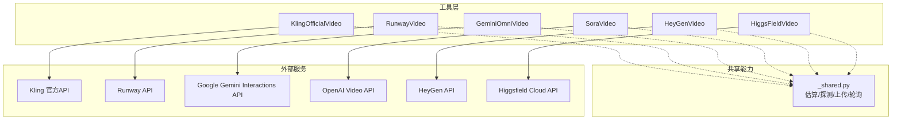
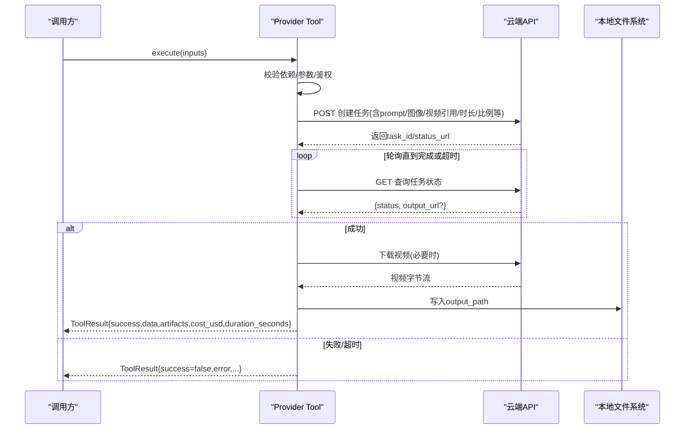
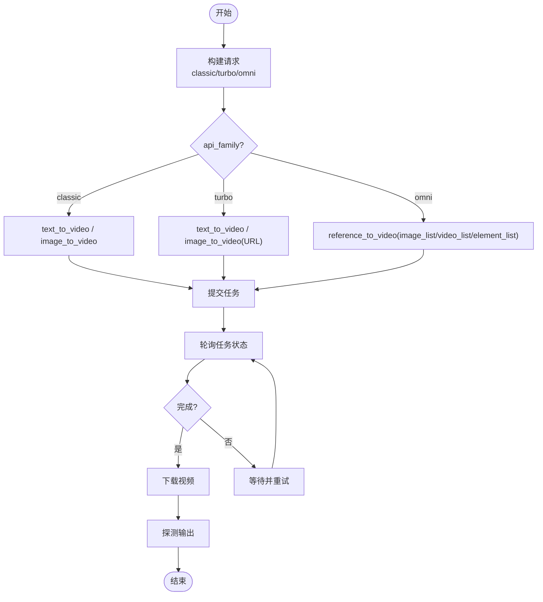
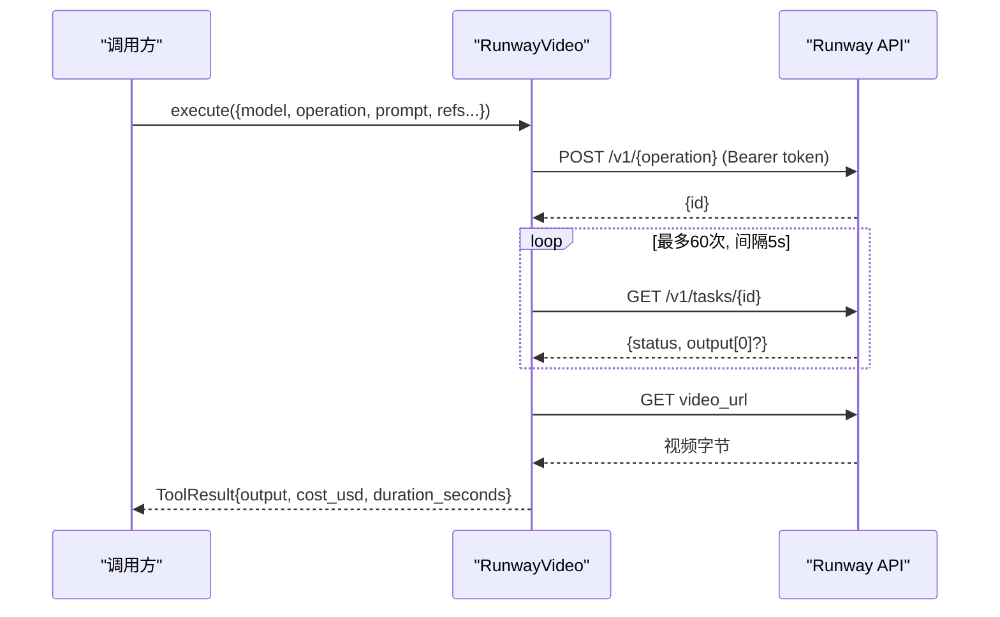
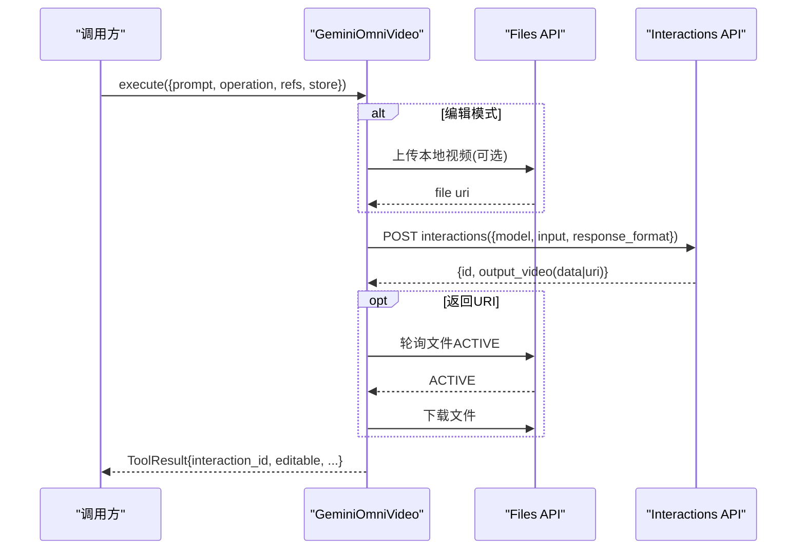
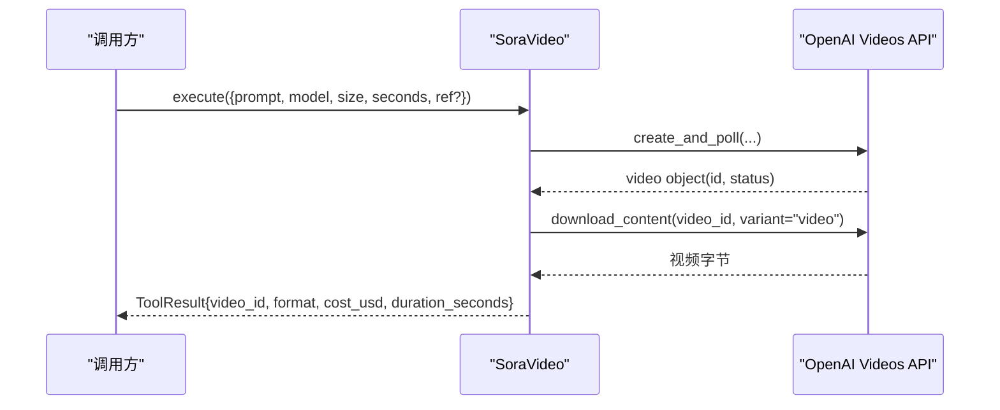
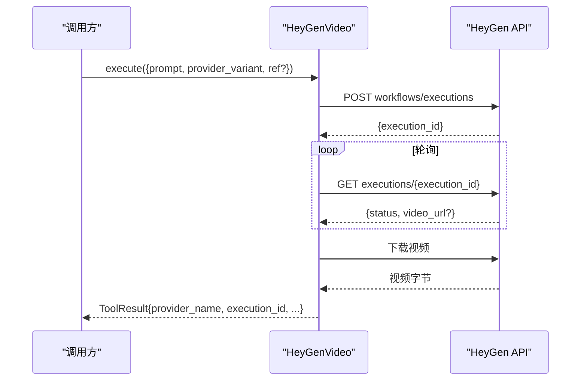
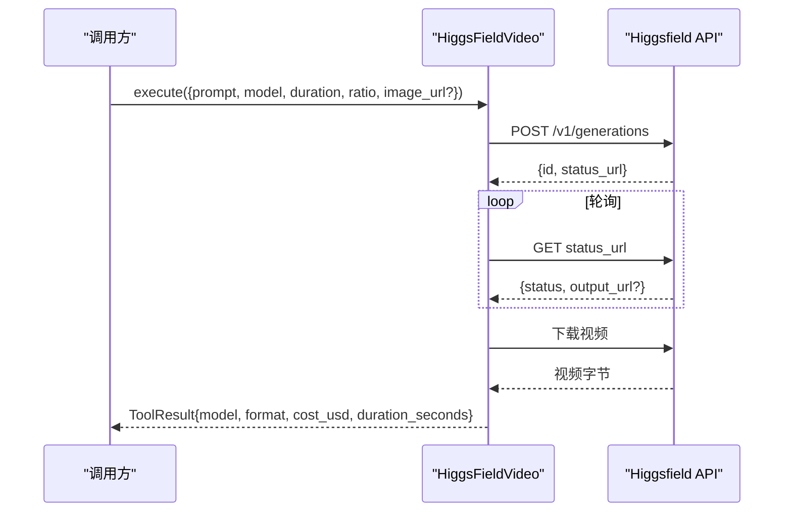
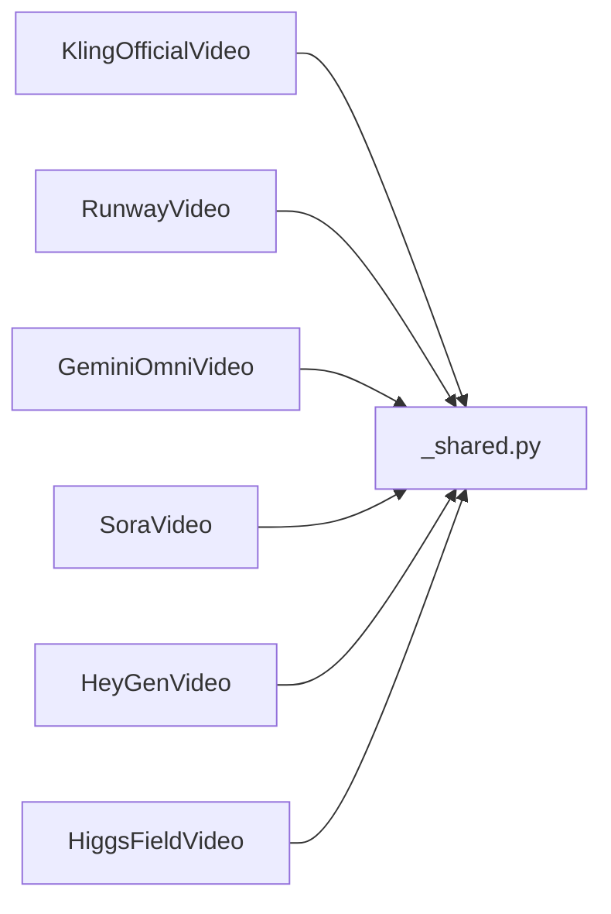

# 云端视频生成提供商

<cite>
**本文引用的文件**
- [tools/video/kling_official_video.py](file://tools/video/kling_official_video.py)
- [tools/video/runway_video.py](file://tools/video/runway_video.py)
- [tools/video/gemini_omni_video.py](file://tools/video/gemini_omni_video.py)
- [tools/video/sora_video.py](file://tools/video/sora_video.py)
- [tools/video/heygen_video.py](file://tools/video/heygen_video.py)
- [tools/video/higgsfield_video.py](file://tools/video/higgsfield_video.py)
- [tools/video/_shared.py](file://tools/video/_shared.py)
- [docs/PROVIDERS.md](file://docs/PROVIDERS.md)
</cite>

## 目录
1. [简介](#简介)
2. [项目结构](#项目结构)
3. [核心组件](#核心组件)
4. [架构总览](#架构总览)
5. [详细组件分析](#详细组件分析)
6. [依赖关系分析](#依赖关系分析)
7. [性能与成本对比](#性能与成本对比)
8. [故障排查指南](#故障排查指南)
9. [结论](#结论)
10. [附录：配置与环境变量](#附录配置与环境变量)

## 简介
本技术文档聚焦 OpenMontage 对主流云端视频生成服务的集成实现，覆盖 Kling、Runway、Google Gemini Omni、Sora、HeyGen、HiggsField 等提供商。文档从系统架构、组件职责、数据流、错误处理、重试机制、超时与资源管理等方面展开，并给出各提供商的 API 设计、认证方式、参数约束、响应处理以及最佳实践建议。同时提供文本转视频、图像转视频、参考视频生成等不同模式的使用说明与代码级调用流程示意。

## 项目结构
OpenMontage 将每个云端视频提供商封装为独立的工具类（BaseTool 子类），统一暴露输入输出契约、重试策略、成本估算、运行时估计与结果探测能力。共享逻辑集中在 tools/video/_shared.py，用于通用能力如本地模型路由、质量/速度估算、输出探测、图片上传等。

图表来源
- [tools/video/kling_official_video.py:45-178](file://tools/video/kling_official_video.py#L45-L178)
- [tools/video/runway_video.py:80-210](file://tools/video/runway_video.py#L80-L210)
- [tools/video/gemini_omni_video.py:49-174](file://tools/video/gemini_omni_video.py#L49-L174)
- [tools/video/sora_video.py:35-123](file://tools/video/sora_video.py#L35-L123)
- [tools/video/heygen_video.py:24-93](file://tools/video/heygen_video.py#L24-L93)
- [tools/video/higgsfield_video.py:33-122](file://tools/video/higgsfield_video.py#L33-L122)
- [tools/video/_shared.py:312-328](file://tools/video/_shared.py#L312-L328)

章节来源
- [tools/video/kling_official_video.py:45-178](file://tools/video/kling_official_video.py#L45-L178)
- [tools/video/_shared.py:312-328](file://tools/video/_shared.py#L312-L328)

## 核心组件
- 统一工具基座：所有提供商均继承 BaseTool，声明 name/version/tier/capability/provider/stability/execution_mode/determinism/runtime、dependencies/install_instructions、capabilities/supports/best_for/not_good_for/fallback_tools、input_schema、resource_profile、retry_policy、idempotency_key_fields、side_effects、user_visible_verification 等元信息，便于编排器调度与治理。
- 成本与运行时间估算：estimate_cost / estimate_runtime 提供预算与排队预估；部分提供商使用固定单价×时长或按分辨率/模式调整。
- 执行流程：execute 负责鉴权、构建请求、提交任务、轮询状态、下载输出、探测媒体属性、返回 ToolResult。
- 错误与重试：通过 retry_policy 指定可重试错误码/消息；超时由 timeout_seconds/poll_interval 控制；异常被捕获并包装为失败结果。
- 输出探测：probe_output 借助 ffprobe 获取时长、分辨率、编码等信息，统一写入结果。

章节来源
- [tools/video/kling_official_video.py:45-178](file://tools/video/kling_official_video.py#L45-L178)
- [tools/video/runway_video.py:80-210](file://tools/video/runway_video.py#L80-L210)
- [tools/video/gemini_omni_video.py:49-174](file://tools/video/gemini_omni_video.py#L49-L174)
- [tools/video/sora_video.py:35-123](file://tools/video/sora_video.py#L35-L123)
- [tools/video/heygen_video.py:24-93](file://tools/video/heygen_video.py#L24-L93)
- [tools/video/higgsfield_video.py:33-122](file://tools/video/higgsfield_video.py#L33-L122)
- [tools/video/_shared.py:758-796](file://tools/video/_shared.py#L758-L796)

## 架构总览
下图展示典型“提交-轮询-下载”异步工作流在各提供商中的共性模式，以及 OpenMontage 如何统一封装。

图表来源
- [tools/video/runway_video.py:394-454](file://tools/video/runway_video.py#L394-L454)
- [tools/video/higgsfield_video.py:199-242](file://tools/video/higgsfield_video.py#L199-L242)
- [tools/video/gemini_omni_video.py:342-431](file://tools/video/gemini_omni_video.py#L342-L431)
- [tools/video/sora_video.py:141-211](file://tools/video/sora_video.py#L141-L211)
- [tools/video/kling_official_video.py:216-287](file://tools/video/kling_official_video.py#L216-L287)

## 详细组件分析

### Kling 官方视频（kling_official_video）
- 能力与模式
  - 支持 text_to_video、image_to_video、reference_to_video（含 Omni 多模态引用）。
  - api_family 可选 classic/turbo/omni；omni 支持 image_list/video_list/element_list 等多引用组合。
- 认证与端点
  - 依赖环境变量 KLING_API_KEY，可选 KLING_API_BASE_URL。
  - Classic/Turbo/Omni 分别走不同路径与协议，内部通过 client.create_* 与 poll_* 抽象。
- 参数要点
  - prompt 必填；duration/aspect_ratio/resolution/mode/sound/negative_prompt/cfg_scale/camera_control 等。
  - Turbo 的 image_to_video 要求 URL，不支持静默上传本地路径。
  - Omni 的 reference_to_video 必须包含至少一种引用（image_list/video_list/element_list 或单图URL）。
- 成本与超时
  - estimate_cost 基于 duration、mode、api_family、sound、Omni 引用数量加权估算。
  - 默认超时 900s，poll_interval 默认 5s；可重试错误码包括 1302/1303/5000/5001/5002。
- 输出与探测
  - 下载视频到 output_path，probe_output 获取时长/分辨率/编码等。

图表来源
- [tools/video/kling_official_video.py:289-433](file://tools/video/kling_official_video.py#L289-L433)
- [tools/video/kling_official_video.py:595-622](file://tools/video/kling_official_video.py#L595-L622)

章节来源
- [tools/video/kling_official_video.py:45-178](file://tools/video/kling_official_video.py#L45-L178)
- [tools/video/kling_official_video.py:216-287](file://tools/video/kling_official_video.py#L216-L287)
- [tools/video/kling_official_video.py:289-433](file://tools/video/kling_official_video.py#L289-L433)
- [tools/video/kling_official_video.py:595-622](file://tools/video/kling_official_video.py#L595-L622)

### Runway 视频（runway_video）
- 能力与模型
  - 支持 text_to_video、image_to_video、video_to_video。
  - 内置模型枚举：seedance2_5、gemini_omni_flash、hailuo3、seedance2/fast/mini、gen4.5/gen4_turbo。
- 认证与端点
  - 读取 RUNWAY_API_KEY 或 RUNWAYML_API_SECRET；端点 https://api.dev.runwayml.com/v1/{operation}。
- 参数要点
  - seedance2_5：ratio 需匹配分辨率映射表；duration 4-30s；可传 references/referenceVideos/referenceAudio。
  - gemini_omni_flash：仅 16:9/9:16；duration 3-10s；video_to_video 仅接受图像引用。
  - hailuo3：resolution 支持 768P/2K；duration 5-15s。
- 成本与超时
  - 按模型单价×duration 估算；轮询最多约 5 分钟；可重试 rate_limit/timeout/THROTTLED。
- 输出与探测
  - 下载视频至 output_path，probe_output 补充元信息。

图表来源
- [tools/video/runway_video.py:394-454](file://tools/video/runway_video.py#L394-L454)

章节来源
- [tools/video/runway_video.py:80-210](file://tools/video/runway_video.py#L80-L210)
- [tools/video/runway_video.py:223-237](file://tools/video/runway_video.py#L223-L237)
- [tools/video/runway_video.py:239-454](file://tools/video/runway_video.py#L239-L454)

### Google Gemini Omni 视频（gemini_omni_video）
- 能力与特性
  - 支持 text_to_video、image_to_video、reference_to_video、edit_video（对话式编辑）。
  - 唯一具备“会话式编辑”能力的提供商：通过 previous_interaction_id 增量修改已生成片段。
- 认证与端点
  - 使用 GOOGLE_API_KEY 或 GEMINI_API_KEY；端点 generativelanguage.googleapis.com/v1beta/interactions。
  - 支持 Files API 上传本地视频作为编辑输入。
- 参数要点
  - aspect_ratio 仅 16:9/9:16；duration 提示 3-10s（实际长度由模型决定）。
  - edit_video 需要 previous_interaction_id 或 input_video_path。
- 成本与超时
  - 按 ~$0.10/秒估算；轮询最长 900s；可重试 rate_limit/timeout。
- 输出与探测
  - 直接写入 output_path；若返回 URI 则先轮询 ACTIVE 再下载。

图表来源
- [tools/video/gemini_omni_video.py:220-280](file://tools/video/gemini_omni_video.py#L220-L280)
- [tools/video/gemini_omni_video.py:314-340](file://tools/video/gemini_omni_video.py#L314-L340)
- [tools/video/gemini_omni_video.py:342-431](file://tools/video/gemini_omni_video.py#L342-L431)

章节来源
- [tools/video/gemini_omni_video.py:49-174](file://tools/video/gemini_omni_video.py#L49-L174)
- [tools/video/gemini_omni_video.py:220-280](file://tools/video/gemini_omni_video.py#L220-L280)
- [tools/video/gemini_omni_video.py:314-340](file://tools/video/gemini_omni_video.py#L314-L340)
- [tools/video/gemini_omni_video.py:342-431](file://tools/video/gemini_omni_video.py#L342-L431)

### OpenAI Sora 视频（sora_video）
- 能力与模型
  - 支持 text_to_video、image_to_video；模型 sora-2/sora-2-pro；尺寸受模型限制。
- 认证与端点
  - 依赖 OPENAI_API_KEY 与 openai SDK（>=2.44.0）；使用 videos.create_and_poll。
- 参数要点
  - seconds 仅 4/8/12；size 根据模型与 aspect_ratio 选择；image_to_video 需提供 input_reference_path。
- 成本与超时
  - 估算 0.50*(seconds/4)；estimate_runtime 按 120s*(seconds/4)。
- 输出与探测
  - 下载内容写入 output_path；兼容多种返回类型。

图表来源
- [tools/video/sora_video.py:141-211](file://tools/video/sora_video.py#L141-L211)

章节来源
- [tools/video/sora_video.py:35-123](file://tools/video/sora_video.py#L35-L123)
- [tools/video/sora_video.py:141-211](file://tools/video/sora_video.py#L141-L211)

### HeyGen 视频（heygen_video）
- 能力与路由
  - 通过 HEYGEN_PROVIDERS 矩阵路由到 VEO/Kling/Sora/Runway/Seedance 等后端；统一入口 heygen_video。
- 认证与端点
  - 依赖 HEYGEN_API_KEY；调用 workflows/executions 并提交 GenerateVideoNode。
- 参数要点
  - provider_variant 选择具体后端；支持 image_to_video（自动上传本地图片到 HeyGen 或 fal.ai 存储）。
- 成本与超时
  - 基于 quality 估算成本；基于 speed 估算运行时间；轮询最多 600s。
- 输出与探测
  - 下载视频到 output_path；返回 execution_id 与 provider_name。

图表来源
- [tools/video/heygen_video.py:95-116](file://tools/video/heygen_video.py#L95-L116)
- [tools/video/_shared.py:485-665](file://tools/video/_shared.py#L485-L665)

章节来源
- [tools/video/heygen_video.py:24-93](file://tools/video/heygen_video.py#L24-L93)
- [tools/video/_shared.py:485-665](file://tools/video/_shared.py#L485-L665)

### HiggsField 视频（higgsfield_video）
- 能力与模型
  - 多模型编排（Seedance 2.0、Kling 3.0、Veo 3.1、Sora 2、WAN 2.5、Soul Cinema）；默认 seedance_2.0。
- 认证与端点
  - 支持 HIGGSFIELD_API_KEY + HIGGSFIELD_API_SECRET，或合并键 HIGGSFIELD_KEY=apikey:secret。
  - 端点 platform.higgsfield.ai/v1/generations。
- 参数要点
  - duration 5/10/15；aspect_ratio 16:9/9:16/1:1/21:9；image_to_video 需 image_url。
- 成本与超时
  - 按模型基础成本×(duration/5)估算；轮询最多约 6 分钟。
- 输出与探测
  - 下载视频到 output_path；probe_output 补充元信息。

图表来源
- [tools/video/higgsfield_video.py:166-242](file://tools/video/higgsfield_video.py#L166-L242)

章节来源
- [tools/video/higgsfield_video.py:33-122](file://tools/video/higgsfield_video.py#L33-L122)
- [tools/video/higgsfield_video.py:141-164](file://tools/video/higgsfield_video.py#L141-L164)
- [tools/video/higgsfield_video.py:166-242](file://tools/video/higgsfield_video.py#L166-L242)

## 依赖关系分析
- 工具间耦合度低：每个 Provider Tool 独立对接各自 API，通过统一的 BaseTool 契约与 _shared 工具函数解耦。
- 共享依赖
  - 重试策略、成本/运行时间估算、输出探测、图片上传、本地模型路由等集中在 _shared.py。
  - 某些 Provider 复用 _shared 的轮询与上传能力（如 HeyGen）。
- 外部依赖
  - 网络访问必需；部分 Provider 依赖特定 SDK（如 OpenAI Videos API）。
  - 可选依赖：ffprobe 用于 probe_output；diffusers/torch 用于本地生成（非本文重点）。

图表来源
- [tools/video/_shared.py:312-328](file://tools/video/_shared.py#L312-L328)
- [tools/video/_shared.py:485-665](file://tools/video/_shared.py#L485-L665)
- [tools/video/_shared.py:758-796](file://tools/video/_shared.py#L758-L796)

章节来源
- [tools/video/_shared.py:312-328](file://tools/video/_shared.py#L312-L328)
- [tools/video/_shared.py:485-665](file://tools/video/_shared.py#L485-L665)
- [tools/video/_shared.py:758-796](file://tools/video/_shared.py#L758-L796)

## 性能与成本对比
- 成本估算方法
  - 按秒计费：Runway（按模型单价×duration）、Gemini Omni（~$0.10/秒）、Sora（占位估算 0.50*(seconds/4)）、HiggsField（按模型基础成本×(duration/5)）、Kling（Classic/Turbo/Omni 不同基数+模式/引用加权）。
  - 按质量等级：HeyGen 通过 quality 映射估算成本。
- 运行时间估算
  - Runway/Gemini Omni/Sora/HiggsField/Kling 均提供 estimate_runtime，通常几十到数百秒不等。
  - 轮询上限：Runway 约 5 分钟；HiggsField 约 6 分钟；Gemini Omni 最长 900 秒；Kling 默认 900 秒。
- 限制与约束
  - 时长限制：Gemini Omni 3-10s；Runway 各模型不同；Sora 仅 4/8/12s；HiggsField 5/10/15s；Kling 支持 5s 起且可按模型/模式扩展。
  - 分辨率/比例：各模型有严格映射（如 Seedance 2.5 的 ratio 表、Gemini Omni 仅 16:9/9:16）。
  - 引用输入：Turbo image_to_video 需 URL；Omni 需 image_list/video_list/element_list；Sora image_to_video 需本地参考图 Data URI。
- 最佳实践
  - 优先选择满足时长/比例/引用约束的最小可用模型以降低成本。
  - 对高成本模型（如 Omni、Seedance 2.5）谨慎设置 duration 与 resolution。
  - 使用 fallback_tools 在失败时自动降级到其他提供商。

章节来源
- [tools/video/runway_video.py:223-237](file://tools/video/runway_video.py#L223-L237)
- [tools/video/gemini_omni_video.py:200-204](file://tools/video/gemini_omni_video.py#L200-L204)
- [tools/video/sora_video.py:132-139](file://tools/video/sora_video.py#L132-L139)
- [tools/video/higgsfield_video.py:141-164](file://tools/video/higgsfield_video.py#L141-L164)
- [tools/video/kling_official_video.py:179-200](file://tools/video/kling_official_video.py#L179-L200)
- [tools/video/_shared.py:312-328](file://tools/video/_shared.py#L312-L328)

## 故障排查指南
- 常见错误与定位
  - 缺少 API Key：各 Provider 在 get_status/execute 中检查环境变量，未设置时返回 UNAVAILABLE 或明确错误。
  - 参数不合法：如 Gemini Omni 的 duration 范围、Runway 的 ratio 映射、Kling Turbo 的 image_to_video URL 要求、HiggsField 的 duration 枚举。
  - 网络/超时：轮询超时后返回失败；可通过增大 timeout_seconds/poll_interval 或降低并发缓解。
  - 速率限制：Runway 与 Gemini Omni 支持 rate_limit 重试；Kling 支持特定错误码重试。
- 重试与回退
  - 各 Provider 定义 retry_policy 的可重试错误集合；建议在编排层结合 fallback_tools 进行自动降级。
- 输出验证
  - 使用 probe_output 检查输出文件的时长、分辨率、编码；若 ffprobe 不可用，仅返回文件大小。
- 调试建议
  - 开启 include_account_usage（Kling）以辅助诊断账户用量。
  - 记录 task_id、remote_outputs、cost_estimate_confidence 以便追踪。

章节来源
- [tools/video/kling_official_video.py:138-142](file://tools/video/kling_official_video.py#L138-L142)
- [tools/video/runway_video.py:206-208](file://tools/video/runway_video.py#L206-L208)
- [tools/video/gemini_omni_video.py:168-169](file://tools/video/gemini_omni_video.py#L168-L169)
- [tools/video/sora_video.py:120-121](file://tools/video/sora_video.py#L120-L121)
- [tools/video/higgsfield_video.py:119-120](file://tools/video/higgsfield_video.py#L119-L120)
- [tools/video/_shared.py:758-796](file://tools/video/_shared.py#L758-L796)

## 结论
OpenMontage 通过统一的工具抽象与共享能力，将多个云端视频生成提供商整合为一致可调用的接口。各 Provider 在认证、参数、成本与超时方面各有差异，但都遵循“提交-轮询-下载-探测”的标准流程。生产环境中建议：
- 明确业务对时长、分辨率、引用类型的约束，选择最合适的模型与提供商。
- 合理设置重试与超时，避免频繁失败导致资源浪费。
- 利用 fallback_tools 与成本估算，平衡质量与预算。
- 关注各提供商的限制与定价变化，定期复核配置与估算策略。

## 附录：配置与环境变量
- 关键环境变量
  - KLING_API_KEY、KLING_API_BASE_URL（Kling 官方）
  - RUNWAY_API_KEY 或 RUNWAYML_API_SECRET（Runway）
  - GOOGLE_API_KEY 或 GEMINI_API_KEY（Gemini Omni）
  - OPENAI_API_KEY（Sora）
  - HEYGEN_API_KEY（HeyGen）
  - HIGGSFIELD_API_KEY、HIGGSFIELD_API_SECRET 或 HIGGSFIELD_KEY（HiggsField）
- 其他
  - 可选 ffprobe 用于输出探测。
  - 可选 diffusers/torch 用于本地视频生成（非本文重点）。

章节来源
- [docs/PROVIDERS.md:29-81](file://docs/PROVIDERS.md#L29-L81)