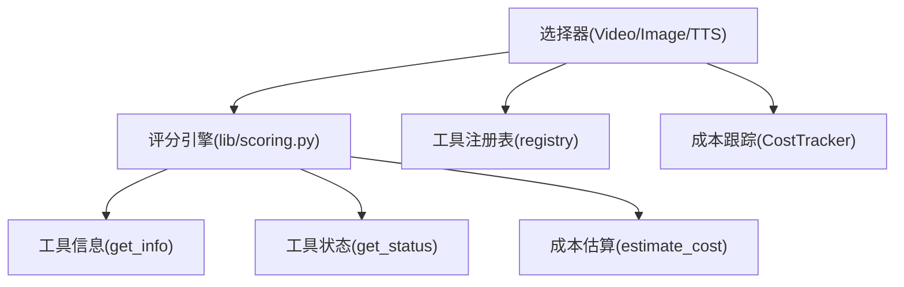
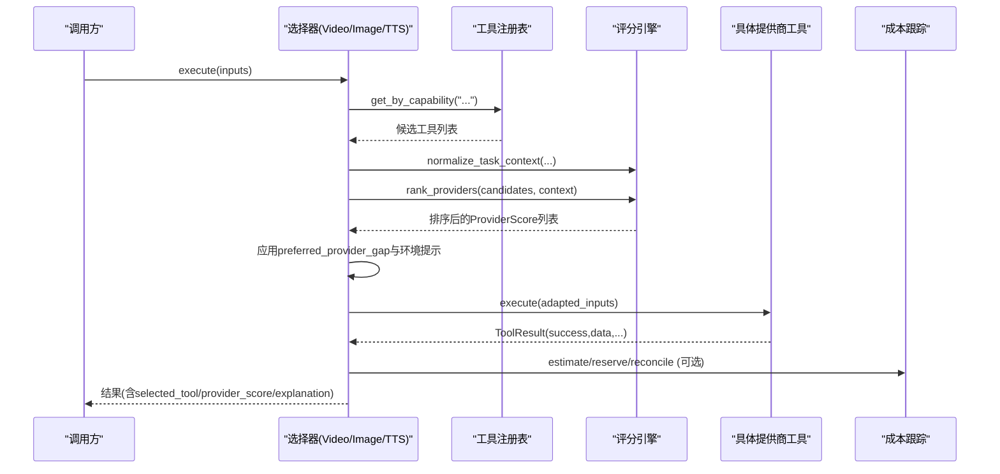
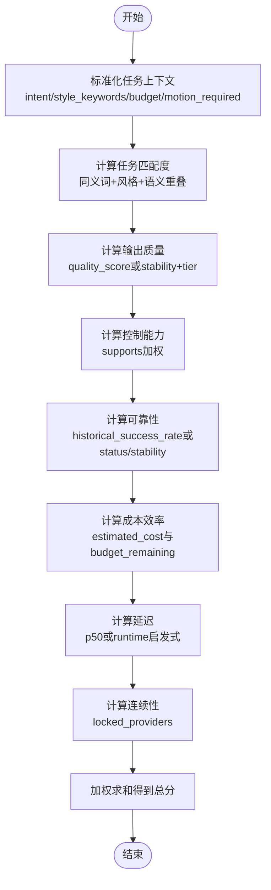
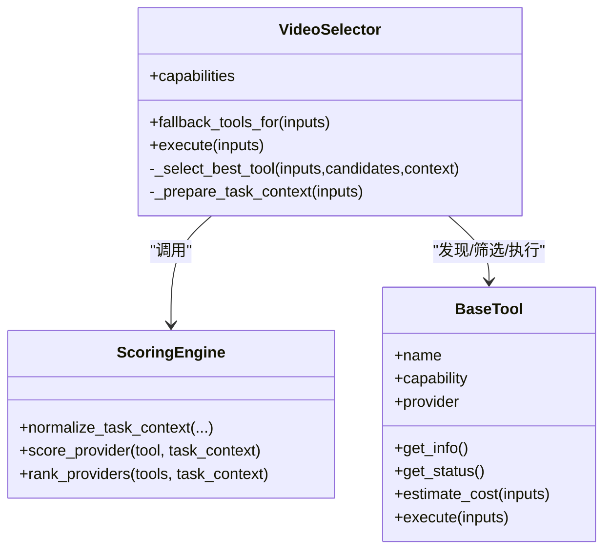
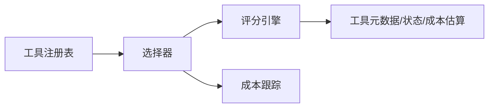
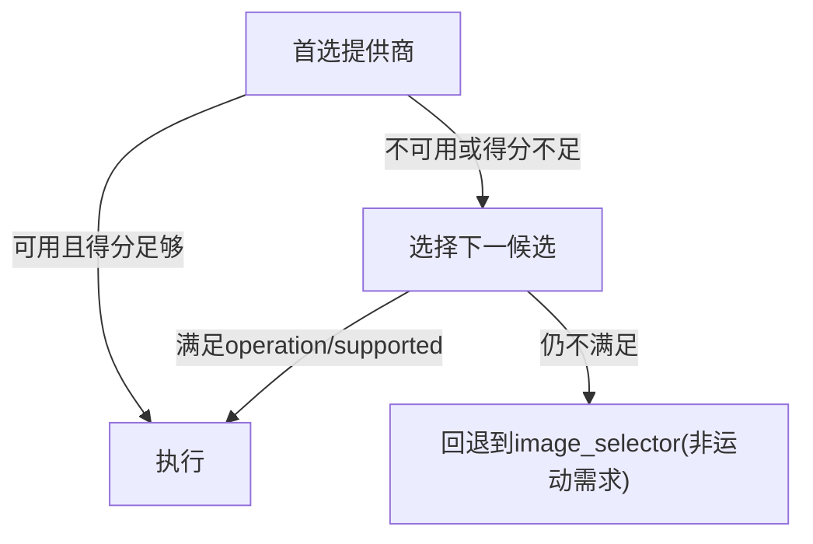
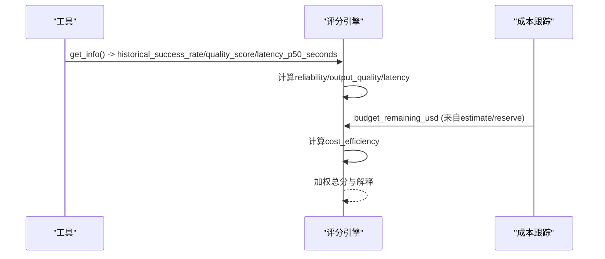

# 智能提供商选择算法

<cite>
**本文引用的文件**
- [lib/scoring.py](file://lib/scoring.py)
- [tools/video/video_selector.py](file://tools/video/video_selector.py)
- [tools/graphics/image_selector.py](file://tools/graphics/image_selector.py)
- [tools/audio/tts_selector.py](file://tools/audio/tts_selector.py)
- [tools/base_tool.py](file://tools/base_tool.py)
- [tools/tool_registry.py](file://tools/tool_registry.py)
- [tools/cost_tracker.py](file://tools/cost_tracker.py)
- [README.md](file://README.md)
- [tests/tools/test_scoring.py](file://tests/tools/test_scoring.py)
- [tests/tools/test_video_selector_routing.py](file://tests/tools/test_video_selector_routing.py)
</cite>

## 目录
1. [简介](#简介)
2. [项目结构](#项目结构)
3. [核心组件](#核心组件)
4. [架构总览](#架构总览)
5. [详细组件分析](#详细组件分析)
6. [依赖关系分析](#依赖关系分析)
7. [性能与可扩展性](#性能与可扩展性)
8. [故障转移、负载均衡与降级策略](#故障转移负载均衡与降级策略)
9. [自定义评分规则开发指南](#自定义评分规则开发指南)
10. [历史数据与实时反馈优化](#历史数据与实时反馈优化)
11. [排错指南](#排错指南)
12. [结论](#结论)

## 简介
本技术文档系统性阐述 OpenMontage 的“智能提供商选择算法”。该算法基于七个维度对候选提供商进行加权评分：任务匹配度、输出质量、控制能力、可靠性、成本效率、延迟、连续性。通过统一的评分引擎与多路选择器（视频、图像、语音等），系统能够在运行时自动发现可用提供商，结合任务上下文、预算约束与历史表现，做出可解释、可审计的选择决策，并支持用户偏好、环境提示与动态权重调整。

## 项目结构
OpenMontage 将“评分引擎”与“能力级选择器”解耦：
- 评分引擎位于 lib/scoring.py，提供 ProviderScore、ProductionPathScore、score_provider、rank_providers、normalize_task_context 等核心函数。
- 选择器位于 tools/{video,image,audio}/*_selector.py，负责按能力族（如 video_generation）自动发现候选工具，调用评分引擎排序，并在必要时执行或返回排名结果。
- 基础工具契约与状态枚举在 tools/base_tool.py；工具注册与能力查询在 tools/tool_registry.py。
- 成本与预算治理在 tools/cost_tracker.py，为评分中的成本效率维度提供输入。

**图表来源**
- [tools/video/video_selector.py:248-306](file://tools/video/video_selector.py#L248-L306)
- [lib/scoring.py:373-542](file://lib/scoring.py#L373-L542)
- [tools/tool_registry.py:118-182](file://tools/tool_registry.py#L118-L182)
- [tools/cost_tracker.py:40-98](file://tools/cost_tracker.py#L40-L98)

**章节来源**
- [tools/video/video_selector.py:1-568](file://tools/video/video_selector.py#L1-L568)
- [lib/scoring.py:1-557](file://lib/scoring.py#L1-L557)
- [tools/tool_registry.py:1-200](file://tools/tool_registry.py#L1-L200)
- [tools/cost_tracker.py:1-524](file://tools/cost_tracker.py#L1-L524)

## 核心组件
- ProviderScore：封装单个提供商在七维度的得分与加权总分，并提供人类可读的解释。
- ProductionPathScore：封装整条生产路径的综合评分（交付适配、质量适配、能力置信、回退完整性、预算适配、速度适配、可控性、一致性适配）。
- score_provider：根据任务上下文计算各维度分数，包含语义同义词扩展、风格关键词匹配、运动需求惩罚、参考条件增强、影视级特性加分等。
- rank_providers：对候选工具列表打分并降序排序。
- normalize_task_context：将松散的 brief/prompt/needs 标准化为评分器期望的结构化上下文。
- 选择器（VideoSelector、ImageSelector、TTSSelector）：按能力族发现候选、过滤操作、调用评分引擎、尊重用户偏好与环境提示、执行或返回排名。

**章节来源**
- [lib/scoring.py:21-107](file://lib/scoring.py#L21-L107)
- [lib/scoring.py:205-542](file://lib/scoring.py#L205-L542)
- [tools/video/video_selector.py:15-568](file://tools/video/video_selector.py#L15-L568)
- [tools/graphics/image_selector.py:218-375](file://tools/graphics/image_selector.py#L218-L375)
- [tools/audio/tts_selector.py:272-298](file://tools/audio/tts_selector.py#L272-L298)

## 架构总览
下图展示了从选择器到评分引擎再到具体工具的完整流程，包括任务上下文标准化、候选过滤、评分排序、偏好与环境提示处理、以及最终执行与结果回填。

**图表来源**
- [tools/video/video_selector.py:308-366](file://tools/video/video_selector.py#L308-L366)
- [lib/scoring.py:297-542](file://lib/scoring.py#L297-L542)
- [tools/tool_registry.py:153-167](file://tools/tool_registry.py#L153-L167)
- [tools/cost_tracker.py:101-171](file://tools/cost_tracker.py#L101-L171)

## 详细组件分析

### 七维加权评分机制
- 任务匹配度（task_fit，权重 0.30）：基于 best_for 与意图/风格的语义重叠，使用同义词簇与真实分词器，避免标点干扰；对“需要运动但仅图像”的任务施加重罚；对“偏好生成视觉”的素材库型提供商降权；对“参考条件/图像编辑”需求给予增强；对“影视级”视频任务的多项高级特性（原生音频、多镜头、镜头控制、口型同步、电影级质量）给予额外加分。
- 输出质量（output_quality，权重 0.20）：优先采用 measured quality_score，否则基于稳定性与 tier 映射，并对生产级 generate-tier 微调提升。
- 控制能力（control，权重 0.15）：依据 supports 字典中各项能力的存在与否加权求和，强调 ControlNet、参考图、风格迁移、修复等强创意控制能力。
- 可靠性（reliability，权重 0.15）：优先使用 historical_success_rate，否则基于 ToolStatus 与 stability 基线（production > beta/experimental）。
- 成本效率（cost_efficiency，权重 0.10）：结合 estimated_cost 与剩余预算 ratio，免费或低成本高回报者得分更高；无预算信息时按绝对成本启发式打分。
- 延迟（latency，权重 0.05）：优先使用 measured p50 延迟分段映射（<=1s=1.0，>60s=0.2），否则按 runtime（local/local_gpu/hybrid/api）启发式打分。
- 连续性（continuity，权重 0.05）：若与已锁定提供商一致则高分，否则中等分，无上下文时中性分。

加权总分 = Σ(维度得分 × 权重)。

**图表来源**
- [lib/scoring.py:205-542](file://lib/scoring.py#L205-L542)

**章节来源**
- [lib/scoring.py:21-107](file://lib/scoring.py#L21-L107)
- [lib/scoring.py:205-542](file://lib/scoring.py#L205-L542)

### 选择器与路由逻辑
- VideoSelector：自动发现 video_generation 能力的所有工具，按 operation 过滤（text_to_video、image_to_video、reference_to_video、video_edit），支持 rank 模式返回评分而不执行；在执行前适配输入键（如 query/prompt）、上传参考图、注入 selected_tool/provider_score/explanation 与 alternatives_considered。
- ImageSelector/TTSSelector：同样调用 normalize_task_context 与 rank_providers，支持 user preference routing 与 allowed_providers 过滤。
- 偏好与环境提示：当 preferred_provider != "auto" 且其最佳得分不低于 top 得分减去 configurable gap（默认 0.15），则尊重偏好；同时可从环境变量 VIDEO_GEN_LOCAL_MODEL 推断本地模型偏好。

**图表来源**
- [tools/video/video_selector.py:15-568](file://tools/video/video_selector.py#L15-L568)
- [lib/scoring.py:297-542](file://lib/scoring.py#L297-L542)
- [tools/base_tool.py:110-200](file://tools/base_tool.py#L110-L200)

**章节来源**
- [tools/video/video_selector.py:248-568](file://tools/video/video_selector.py#L248-L568)
- [tools/graphics/image_selector.py:218-375](file://tools/graphics/image_selector.py#L218-L375)
- [tools/audio/tts_selector.py:272-298](file://tools/audio/tts_selector.py#L272-L298)

### 提供商能力检测与健康监控
- 工具注册表支持 discover、get_by_capability、get_by_status、support_envelope 等能力汇总。
- 每个工具实现 get_status()，返回 available/unavailable/degraded；选择器据此过滤候选与回退。
- 部分工具（如 hyperframes_compose）通过 CLI doctor 探测后端可用性，避免误报。

**章节来源**
- [tools/tool_registry.py:118-200](file://tools/tool_registry.py#L118-L200)
- [tools/base_tool.py:73-90](file://tools/base_tool.py#L73-L90)
- [tools/video/hyperframes_compose.py:319-355](file://tools/video/hyperframes_compose.py#L319-L355)

### 成本与预算治理
- CostTracker 提供 estimate/reserve/reconcile/refund 生命周期，支持 observe/warn/cap 三种模式，单动作审批阈值与新增付费工具审批。
- 评分中的 cost_efficiency 维度直接利用 estimated_cost 与 budget_remaining_usd，使选择器倾向更经济的方案。

**章节来源**
- [tools/cost_tracker.py:40-171](file://tools/cost_tracker.py#L40-L171)
- [lib/scoring.py:259-283](file://lib/scoring.py#L259-L283)

## 依赖关系分析
- 选择器依赖工具注册表以发现候选，依赖评分引擎进行排序，依赖具体工具执行。
- 评分引擎依赖工具元数据（best_for、supports、stability、tier、runtime、latency_p50_seconds、quality_score、historical_success_rate）与成本估算。
- 成本跟踪与评分耦合于 cost_efficiency 维度，影响最终选择。

**图表来源**
- [tools/tool_registry.py:118-182](file://tools/tool_registry.py#L118-L182)
- [lib/scoring.py:373-542](file://lib/scoring.py#L373-L542)
- [tools/cost_tracker.py:101-171](file://tools/cost_tracker.py#L101-L171)

**章节来源**
- [tools/tool_registry.py:1-200](file://tools/tool_registry.py#L1-L200)
- [lib/scoring.py:373-542](file://lib/scoring.py#L373-L542)

## 性能与可扩展性
- 时间复杂度：对 n 个候选工具，评分引擎对每个工具进行一次 score_provider，整体 O(n)，排序 O(n log n)。
- 空间复杂度：存储每个 ProviderScore，O(n)。
- 可扩展点：
  - 新增维度或权重：修改 ProviderScore.weighted_score 及 explain 排序。
  - 新增语义同义词簇：扩展 _SYNONYM_CLUSTERS。
  - 新增控制能力权重：扩展 control_features。
  - 新增任务信号：在 score_provider 中增加分支（如新的 supports 字段或 intent 关键词）。
  - 选择器层：在 _filter_candidates 中增加 operation 或 model 过滤逻辑。

[本节为通用指导，不直接分析具体文件]

## 故障转移、负载均衡与降级策略
- 故障转移：选择器在 fallback_tools_for 中根据 operation 决定是否允许 image_selector 作为降级；对于需要运动的 operation，禁止回退到仅图像工具。
- 负载均衡：通过 rank_providers 对候选进行多维度评分排序，自然地将流量导向当前最优提供商；preferred_provider_gap 允许在一定范围内保留用户偏好，避免频繁切换。
- 降级策略：当首选不可用或得分过低，选择器会按 ranking 顺序选择下一个可用的 selectable provider；支持 custom_workflow 的提供商可在模型就绪之外继续提供服务。

**图表来源**
- [tools/video/video_selector.py:264-278](file://tools/video/video_selector.py#L264-L278)
- [tools/video/video_selector.py:413-440](file://tools/video/video_selector.py#L413-L440)

**章节来源**
- [tools/video/video_selector.py:264-278](file://tools/video/video_selector.py#L264-L278)
- [tools/video/video_selector.py:413-440](file://tools/video/video_selector.py#L413-L440)

## 自定义评分规则开发指南
- 新增维度或调整权重：
  - 在 ProviderScore 中添加新字段，并在 weighted_score 中赋予权重。
  - 更新 explain 方法以展示新维度的贡献。
- 增强任务匹配度：
  - 扩展 _SYNONYM_CLUSTERS 添加领域术语。
  - 在 _compute_task_fit 中增加新的语义信号或风格关键词。
- 增强控制能力评估：
  - 在 _compute_control 的 control_features 中加入新的 supports 字段及其权重。
- 成本效率策略：
  - 在 _compute_cost_efficiency 中调整预算比率阈值或启发式分段。
- 延迟映射：
  - 在 latency 分支中调整 p50 分段阈值或 runtime 启发式。
- 连续性策略：
  - 在 _compute_continuity 中引入更多上下文（如团队/项目锁定）。
- 选择器集成：
  - 在 _filter_candidates 中增加 operation/model 过滤。
  - 在 _select_best_tool 中调整 preferred_provider_gap 或环境提示映射。

示例配置路径（供参考）：
- 权重与维度定义：[lib/scoring.py:21-107](file://lib/scoring.py#L21-L107)
- 任务匹配与风格增强：[lib/scoring.py:205-232](file://lib/scoring.py#L205-L232)
- 控制能力加权：[lib/scoring.py:234-257](file://lib/scoring.py#L234-L257)
- 成本效率策略：[lib/scoring.py:259-283](file://lib/scoring.py#L259-L283)
- 延迟映射：[lib/scoring.py:424-446](file://lib/scoring.py#L424-L446)
- 连续性策略：[lib/scoring.py:285-295](file://lib/scoring.py#L285-L295)
- 选择器过滤与偏好：[tools/video/video_selector.py:484-568](file://tools/video/video_selector.py#L484-L568)

**章节来源**
- [lib/scoring.py:21-107](file://lib/scoring.py#L21-L107)
- [lib/scoring.py:205-542](file://lib/scoring.py#L205-L542)
- [tools/video/video_selector.py:484-568](file://tools/video/video_selector.py#L484-L568)

## 历史数据与实时反馈优化
- 历史成功率：工具可通过 info.historical_success_rate 提供历史成功率，直接影响 reliability 维度。
- 质量评分：info.quality_score 可直接用于 output_quality，减少启发式偏差。
- 延迟测量：info.latency_p50_seconds 提供实测中位延迟，用于更精确的 latency 打分。
- 成本与预算：CostTracker 的 estimate/reserve/reconcile 提供实际花费与预算剩余，驱动 cost_efficiency 与后续选择。
- 决策审计：选择器返回 selection_reason、provider_score、alternatives_considered，便于事后分析与调优。

**图表来源**
- [lib/scoring.py:400-466](file://lib/scoring.py#L400-L466)
- [tools/cost_tracker.py:101-171](file://tools/cost_tracker.py#L101-L171)

**章节来源**
- [lib/scoring.py:400-466](file://lib/scoring.py#L400-L466)
- [tools/cost_tracker.py:101-171](file://tools/cost_tracker.py#L101-L171)

## 排错指南
- 令牌与标点问题：确保意图与 best_for 的分词正确，测试覆盖标点剥离与同义词匹配。
- 偏好被忽略：检查 preferred_provider_gap 是否过小导致偏好被 top 覆盖；确认所选 provider 在 rankings 中存在且可 select。
- 运动需求误判：对于 image_to_video/reference_to_video/video_edit，确保不会回退到 image_selector。
- 成本超支：在 warn/cap 模式下，reserve 可能抛出 BudgetExceededError 或 ApprovalRequiredError，需调整预算或审批。
- 健康状态误报：某些工具需 CLI doctor 探测，避免仅凭包解析判断可用。

**章节来源**
- [tests/tools/test_scoring.py:35-47](file://tests/tools/test_scoring.py#L35-L47)
- [tests/tools/test_video_selector_routing.py:179-211](file://tests/tools/test_video_selector_routing.py#L179-L211)
- [tools/cost_tracker.py:117-171](file://tools/cost_tracker.py#L117-L171)

## 结论
OpenMontage 的智能提供商选择算法通过七维加权评分与统一的选择器框架，实现了可解释、可审计、可扩展的提供商路由。它结合历史数据、实时反馈与预算治理，在保证质量与可靠性的同时兼顾成本与延迟，并通过灵活的自定义规则与降级策略适应多样化场景。建议在生产环境中持续收集 quality_score、historical_success_rate、latency_p50_seconds 等指标，定期校准权重与阈值，以获得更稳健的选择效果。