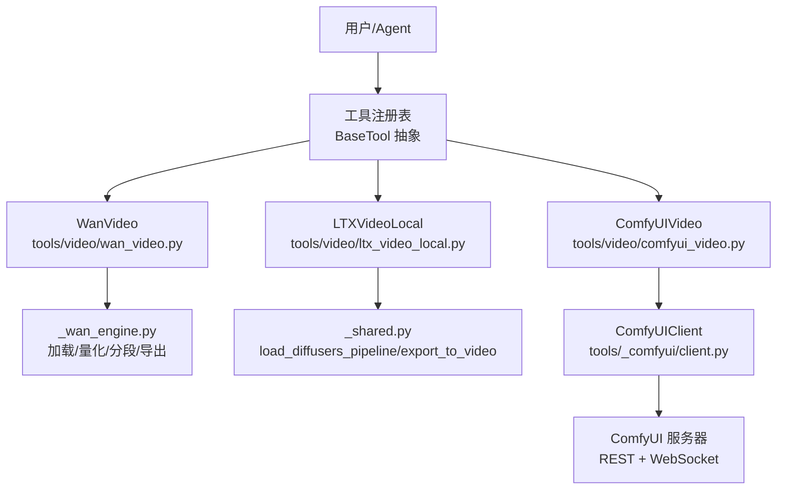
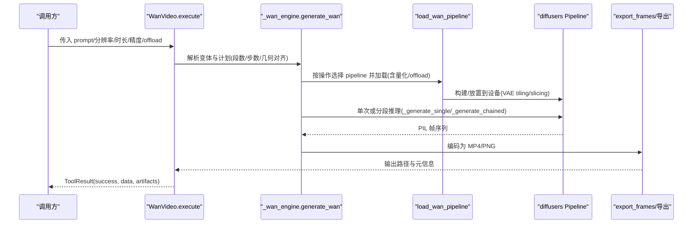
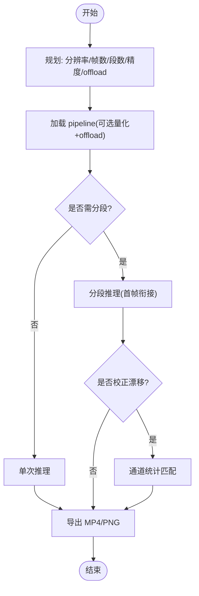
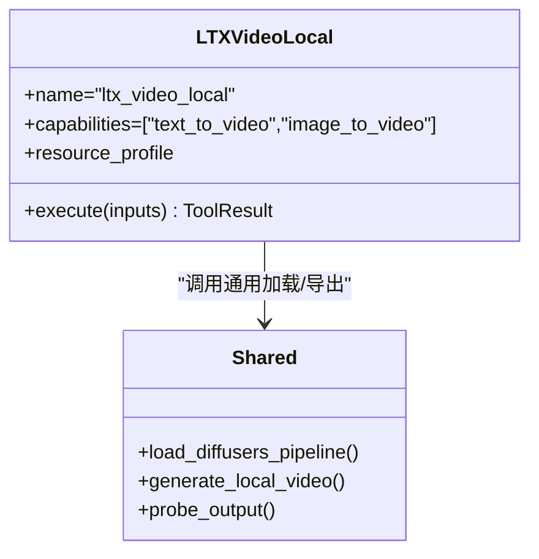
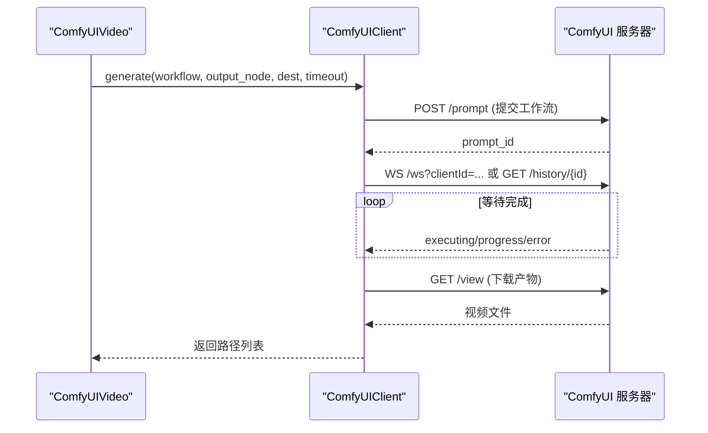
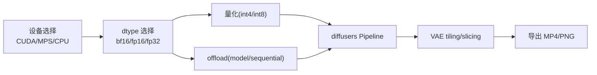

# 本地视频生成模型

<cite>
**本文引用的文件**
- [README.md](file://README.md)
- [PROVIDERS.md](file://docs/PROVIDERS.md)
- [requirements-gpu.txt](file://requirements-gpu.txt)
- [tools/video/wan_video.py](file://tools/video/wan_video.py)
- [tools/video/ltx_video_local.py](file://tools/video/ltx_video_local.py)
- [tools/video/comfyui_video.py](file://tools/video/comfyui_video.py)
- [tools/_comfyui/client.py](file://tools/_comfyui/client.py)
- [tools/video/_wan_engine.py](file://tools/video/_wan_engine.py)
- [tools/video/_shared.py](file://tools/video/_shared.py)
</cite>

## 目录
1. [简介](#简介)
2. [项目结构](#项目结构)
3. [核心组件](#核心组件)
4. [架构总览](#架构总览)
5. [详细组件分析](#详细组件分析)
6. [依赖关系分析](#依赖关系分析)
7. [性能与显存优化](#性能与显存优化)
8. [部署指南（GPU/CPU）](#部署指南gpucpu)
9. [故障排除](#故障排除)
10. [结论](#结论)
11. [附录：使用示例与基准建议](#附录使用示例与基准建议)

## 简介
本技术文档聚焦 OpenMontage 的本地视频生成能力，覆盖三大路径：
- 本地直跑模型：WanVideo（Wan 2.x）、LTX Video Local（LTX-2）
- ComfyUI 工作流：通过本地或远程 ComfyUI 服务器执行 WAN 2.2 14B 等模型，支持内置工作流与自定义工作流
- 统一工具层：以 BaseTool 抽象暴露输入输出、资源需求、估计耗时、重试策略与状态查询

目标读者包括需要在 GPU/CPU 环境下部署、调优并稳定运行本地视频生成的工程师与创作者。

## 项目结构
OpenMontage 将“工具”与“编排知识”解耦：
- tools/video：各视频生成工具的封装（Wan、LTX、ComfyUI 等）
- tools/_comfyui：ComfyUI REST/WebSocket 客户端与工作流补丁
- tools/video/_shared.py：共享配置（变体元数据、设备选择、通用加载与导出）
- docs/PROVIDERS.md：环境配置与环境变量汇总
- requirements-gpu.txt：GPU 推理所需 PyTorch 等依赖

**图表来源**
- [tools/video/wan_video.py:49-167](file://tools/video/wan_video.py#L49-L167)
- [tools/video/ltx_video_local.py:22-75](file://tools/video/ltx_video_local.py#L22-L75)
- [tools/video/comfyui_video.py:94-153](file://tools/video/comfyui_video.py#L94-L153)
- [tools/video/_wan_engine.py:179-272](file://tools/video/_wan_engine.py#L179-L272)
- [tools/video/_shared.py:249-372](file://tools/video/_shared.py#L249-L372)
- [tools/_comfyui/client.py:35-105](file://tools/_comfyui/client.py#L35-L105)

**章节来源**
- [README.md:180-278](file://README.md#L180-L278)
- [docs/PROVIDERS.md:29-81](file://docs/PROVIDERS.md#L29-L81)

## 核心组件
- WanVideo：面向 Wan 2.x 的本地视频生成工具，支持 T2V/I2V/V2V/首尾帧插值/T2I，长片段自动分段拼接，提供精度与 offload 自适应
- LTXVideoLocal：基于 diffusers 的 LTX-2 本地推理，支持 T2V/I2V，默认参数与导出流程封装
- ComfyUIVideo：通过 ComfyUI 服务器执行内置或自定义工作流，支持 WAN 2.2 14B 4-step LoRA 加速、Partner Node 托管节点、超时恢复与进度日志

关键共性：
- 统一的 ToolResult/ToolStatus/ResourceProfile/RetryPolicy
- 可配置的 estimate_runtime、estimate_cost、idempotency_key_fields
- 明确的 fallback 链与 agent_skills 指引

**章节来源**
- [tools/video/wan_video.py:49-167](file://tools/video/wan_video.py#L49-L167)
- [tools/video/ltx_video_local.py:22-75](file://tools/video/ltx_video_local.py#L22-L75)
- [tools/video/comfyui_video.py:94-153](file://tools/video/comfyui_video.py#L94-L153)

## 架构总览

**图表来源**
- [tools/video/wan_video.py:230-244](file://tools/video/wan_video.py#L230-L244)
- [tools/video/_wan_engine.py:477-671](file://tools/video/_wan_engine.py#L477-L671)
- [tools/video/_wan_engine.py:179-272](file://tools/video/_wan_engine.py#L179-L272)

## 详细组件分析

### WanVideo（Wan 2.x 本地）
- 能力矩阵：T2V、I2V、V2V、首尾帧插值、T2I；长片段通过“上一段最后一帧”进行图像到视频的链式拼接
- 几何与时间对齐：VAE 时序压缩与空间压缩约束，自动 snap 帧数与分辨率
- 精度与 offload：auto 模式下根据可见 VRAM 选择 bf16/int8/int4；offload_mode 支持 model/sequential/auto
- 分段与漂移校正：plan_segments 计算段数；correct_drift 对颜色/对比度做通道统计匹配
- 错误处理：OOM 时给出降分辨率、切换 offload/精度的提示

**图表来源**
- [tools/video/_wan_engine.py:61-94](file://tools/video/_wan_engine.py#L61-L94)
- [tools/video/_wan_engine.py:112-150](file://tools/video/_wan_engine.py#L112-L150)
- [tools/video/_wan_engine.py:382-410](file://tools/video/_wan_engine.py#L382-L410)
- [tools/video/_wan_engine.py:477-671](file://tools/video/_wan_engine.py#L477-L671)

**章节来源**
- [tools/video/wan_video.py:93-167](file://tools/video/wan_video.py#L93-L167)
- [tools/video/_wan_engine.py:179-272](file://tools/video/_wan_engine.py#L179-L272)
- [tools/video/_wan_engine.py:477-671](file://tools/video/_wan_engine.py#L477-L671)
- [tools/video/_wan_engine.py:928-947](file://tools/video/_wan_engine.py#L928-L947)

### LTX Video Local（LTX-2 本地）
- 基于 diffusers 的 LTXPipeline，支持 T2V/I2V
- 自动设备选择（CUDA > MPS > CPU），启用 attention_slicing、VAE tiling/slicing
- 统一导出：frames → export_to_video(fps)
- 资源与运行时估计：固定 speed→runtime 映射

**图表来源**
- [tools/video/ltx_video_local.py:22-75](file://tools/video/ltx_video_local.py#L22-L75)
- [tools/video/_shared.py:330-372](file://tools/video/_shared.py#L330-L372)
- [tools/video/_shared.py:399-482](file://tools/video/_shared.py#L399-L482)

**章节来源**
- [tools/video/ltx_video_local.py:52-75](file://tools/video/ltx_video_local.py#L52-L75)
- [tools/video/_shared.py:249-372](file://tools/video/_shared.py#L249-L372)
- [tools/video/_shared.py:399-482](file://tools/video/_shared.py#L399-L482)

### ComfyUIVideo（本地/远程 ComfyUI）
- 内置工作流：WAN 2.2 14B T2V/I2V（LightX2V 4-step LoRA）
- 自定义工作流：支持 workflow_json/workflow_path + output_node
- Partner Node：Gemini Omni Flash、Seedance 2.5、MiniMax H3（托管节点，需网络与积分）
- 健壮等待：WebSocket 优先，失败回退 REST 轮询；支持 resume_prompt_id 恢复
- 进度与诊断：节流打印 step 进度；operation_statuses 检查缺失模型

**图表来源**
- [tools/video/comfyui_video.py:411-590](file://tools/video/comfyui_video.py#L411-L590)
- [tools/_comfyui/client.py:178-235](file://tools/_comfyui/client.py#L178-L235)
- [tools/_comfyui/client.py:246-370](file://tools/_comfyui/client.py#L246-L370)
- [tools/_comfyui/client.py:411-475](file://tools/_comfyui/client.py#L411-L475)

**章节来源**
- [tools/video/comfyui_video.py:155-275](file://tools/video/comfyui_video.py#L155-L275)
- [tools/video/comfyui_video.py:411-590](file://tools/video/comfyui_video.py#L411-L590)
- [tools/_comfyui/client.py:35-105](file://tools/_comfyui/client.py#L35-L105)
- [tools/_comfyui/client.py:411-475](file://tools/_comfyui/client.py#L411-L475)

## 依赖关系分析
- 设备与后端：get_torch_device 优先 CUDA，其次 MPS，最后 CPU；不同设备决定 dtype（bf16/float16/float32）
- 量化与 offload：BitsAndBytesConfig 用于 int4/int8；enable_model_cpu_offload/enable_sequential_cpu_offload
- VAE 优化：enable_tiling/enable_slicing 降低解码峰值内存
- ComfyUI 通信：requests + websocket-client（可选），REST 轮询作为兜底
- 环境变量：VIDEO_GEN_LOCAL_ENABLED、COMFYUI_SERVER_URL、COMFYUI_VIDEO_SERVER_URL 等

**图表来源**
- [tools/video/_shared.py:249-372](file://tools/video/_shared.py#L249-L372)
- [tools/video/_wan_engine.py:112-163](file://tools/video/_wan_engine.py#L112-L163)
- [tools/video/_wan_engine.py:245-272](file://tools/video/_wan_engine.py#L245-L272)
- [tools/_comfyui/client.py:45-105](file://tools/_comfyui/client.py#L45-L105)

**章节来源**
- [tools/video/_shared.py:249-372](file://tools/video/_shared.py#L249-L372)
- [tools/video/_wan_engine.py:112-163](file://tools/video/_wan_engine.py#L112-L163)
- [tools/_comfyui/client.py:45-105](file://tools/_comfyui/client.py#L45-L105)

## 性能与显存优化
- 精度自适应：auto 模式依据可见 VRAM 与模型参数量选择 bf16/int8/int4
- offload 模式：model 保持整模块驻留（更快但显存占用高）；sequential 逐子模块流式加载（PCIe 带宽换显存）
- 几何对齐：snap_frames/snap_dimension 避免无效裁剪与 OOM
- VAE 解码优化：tiling/slicing 显著降低长片段解码峰值
- 分段与漂移控制：长片段分段生成，必要时进行颜色/对比度重校准
- ComfyUI 等待策略：WebSocket 实时事件优先，失败回退 REST 轮询；支持 resume_prompt_id 续接
- 资源估算：estimate_runtime 基于步骤、像素、offload 模式与模型加载开销

**章节来源**
- [tools/video/_wan_engine.py:61-94](file://tools/video/_wan_engine.py#L61-L94)
- [tools/video/_wan_engine.py:112-163](file://tools/video/_wan_engine.py#L112-L163)
- [tools/video/_wan_engine.py:245-272](file://tools/video/_wan_engine.py#L245-L272)
- [tools/video/_wan_engine.py:382-410](file://tools/video/_wan_engine.py#L382-L410)
- [tools/video/wan_video.py:214-228](file://tools/video/wan_video.py#L214-L228)
- [tools/_comfyui/client.py:246-370](file://tools/_comfyui/client.py#L246-L370)

## 部署指南（GPU/CPU）
- 基础依赖
  - Python 3.10+、FFmpeg、Node.js（用于 Remotion/HyperFrames）
  - GPU 推理额外安装 torch/torchaudio/torchvision
- 启用本地视频生成
  - 设置环境变量 VIDEO_GEN_LOCAL_ENABLED=true
  - 选择模型：VIDEO_GEN_LOCAL_MODEL=wan2.2-ti2v-5b | wan2.1-1.3b | wan2.1-14b | hunyuan-1.5 | ltx2-local | cogvideo-5b
- ComfyUI 路径
  - 启动 ComfyUI 服务，设置 COMFYUI_SERVER_URL（或 COMFYUI_VIDEO_SERVER_URL 专用实例）
  - 内置工作流需要对应模型权重；缺失时会返回 missing_models_payload 与下载提示
- 设备与精度
  - CUDA：优先 bf16，否则 fp16；MPS：fp16；CPU：fp32
  - 低显存场景：开启 sequential offload 或降低分辨率/帧数
- 版本更新与缓存
  - 模型权重由 diffusers/huggingface_hub 管理，首次运行自动下载；后续复用缓存
  - 如需清理，可使用 free_wan_pipelines 释放缓存并触发 gc

**章节来源**
- [README.md:180-278](file://README.md#L180-L278)
- [docs/PROVIDERS.md:29-81](file://docs/PROVIDERS.md#L29-L81)
- [requirements-gpu.txt:1-6](file://requirements-gpu.txt#L1-L6)
- [tools/video/_shared.py:282-309](file://tools/video/_shared.py#L282-L309)
- [tools/video/_wan_engine.py:166-177](file://tools/video/_wan_engine.py#L166-L177)
- [tools/video/comfyui_video.py:107-116](file://tools/video/comfyui_video.py#L107-L116)

## 故障排除
- 本地不可用
  - 未设置 VIDEO_GEN_LOCAL_ENABLED 或未安装 diffusers/torch
  - 解决：按 local_install_instructions 安装并启用
- ComfyUI 不可达
  - 未启动服务或 URL 错误
  - 解决：设置 COMFYUI_SERVER_URL/COMFYUI_VIDEO_SERVER_URL，确认 /system_stats 可达
- 缺少模型
  - 内置工作流依赖特定权重；会返回 missing_models_payload 与下载链接
  - 解决：按提示放置模型文件或重新拉取
- 超时与中断
  - ComfyUI 任务可能仍在服务端运行
  - 解决：使用 resume_prompt_id 续接等待，或增大 timeout_seconds
- OOM 与质量下降
  - 降低分辨率/帧数、切换到 sequential offload、降低精度（int8/int4）
  - 参考 _oom_aware_error 的建议字段

**章节来源**
- [tools/video/_shared.py:282-309](file://tools/video/_shared.py#L282-L309)
- [tools/video/comfyui_video.py:455-489](file://tools/video/comfyui_video.py#L455-L489)
- [tools/_comfyui/client.py:199-235](file://tools/_comfyui/client.py#L199-L235)
- [tools/_comfyui/client.py:411-475](file://tools/_comfyui/client.py#L411-L475)
- [tools/video/_wan_engine.py:928-947](file://tools/video/_wan_engine.py#L928-L947)

## 结论
OpenMontage 在本地视频生成方面提供了多模型、多路径的统一接入：
- WanVideo 适合高质量与长片段的本地生成，具备精细的精度/offload/几何对齐与分段拼接
- LTX Video Local 提供轻量化的 LTX-2 本地路径，便于快速集成与导出
- ComfyUIVideo 兼容社区生态，支持内置与自定义工作流，以及托管 Partner Node
三者均遵循一致的 Tool 契约，便于 Agent/流水线编排与治理。

## 附录：使用示例与基准建议
- 最小可用（无 API Key）
  - 安装依赖并启用本地视频生成，选择 wan2.2-ti2v-5b 或 ltx2-local
  - 使用 text_to_video 生成短片段，验证导出与播放
- 低显存 GPU（8–12GB）
  - 使用 sequential offload、int8/int4、降低分辨率与帧数
  - 长片段采用分段生成，并开启 correct_drift
- ComfyUI 路径
  - 准备内置工作流所需模型；若缺失，按 missing_models_payload 提示下载
  - 使用 resume_prompt_id 应对超时；合理设置 timeout_seconds
- 基准测试建议
  - 固定 prompt/seed，记录 estimate_runtime 与实际 duration_seconds
  - 对比不同精度/offload/分辨率下的吞吐与显存峰值
  - 对 ComfyUI 路径，比较 WebSocket 与 REST 轮询的延迟差异

**章节来源**
- [tools/video/wan_video.py:214-228](file://tools/video/wan_video.py#L214-L228)
- [tools/video/ltx_video_local.py:83-84](file://tools/video/ltx_video_local.py#L83-L84)
- [tools/video/_shared.py:322-327](file://tools/video/_shared.py#L322-L327)
- [tools/video/comfyui_video.py:405-409](file://tools/video/comfyui_video.py#L405-L409)
- [tools/_comfyui/client.py:411-475](file://tools/_comfyui/client.py#L411-L475)