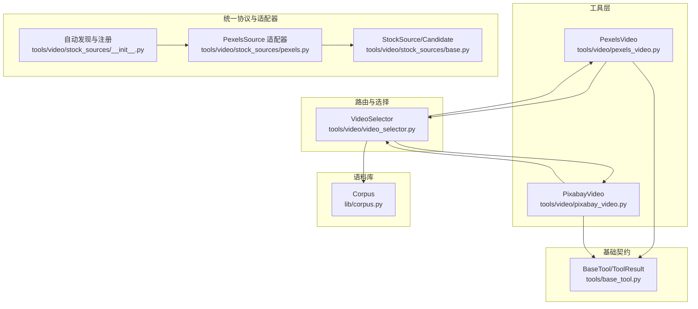
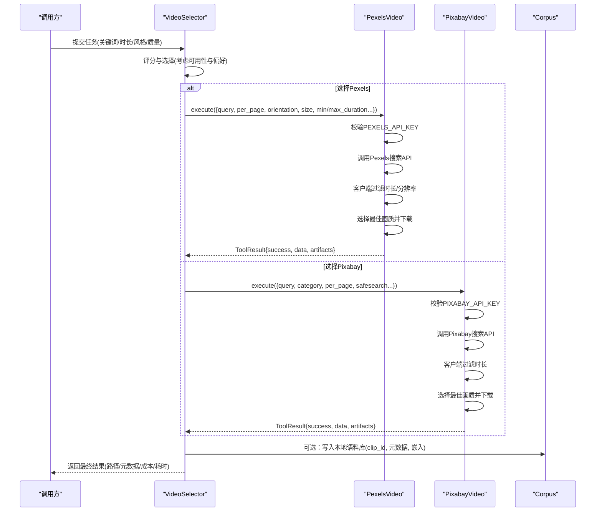
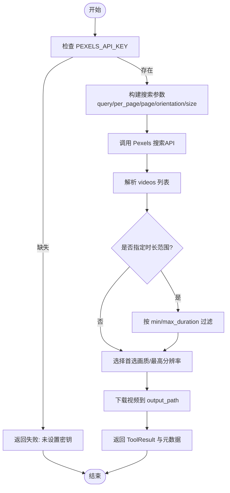
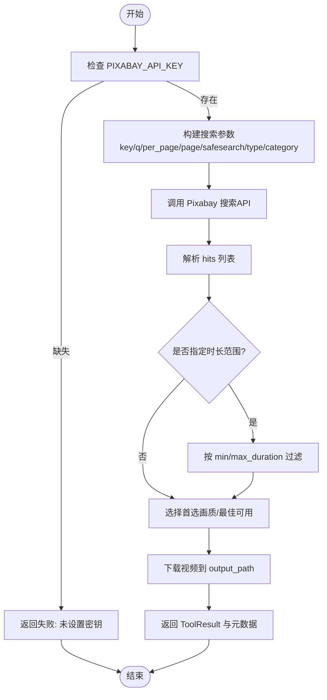
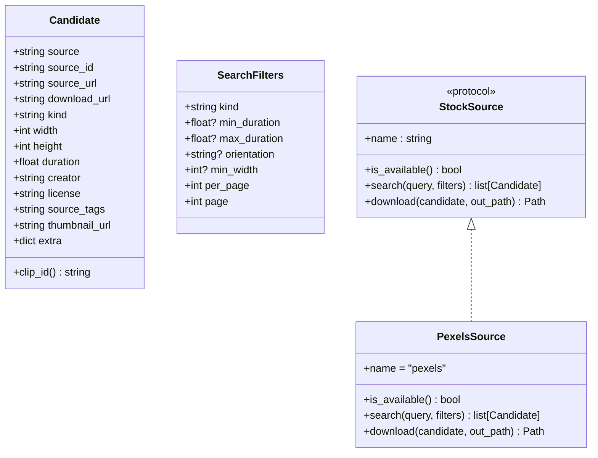
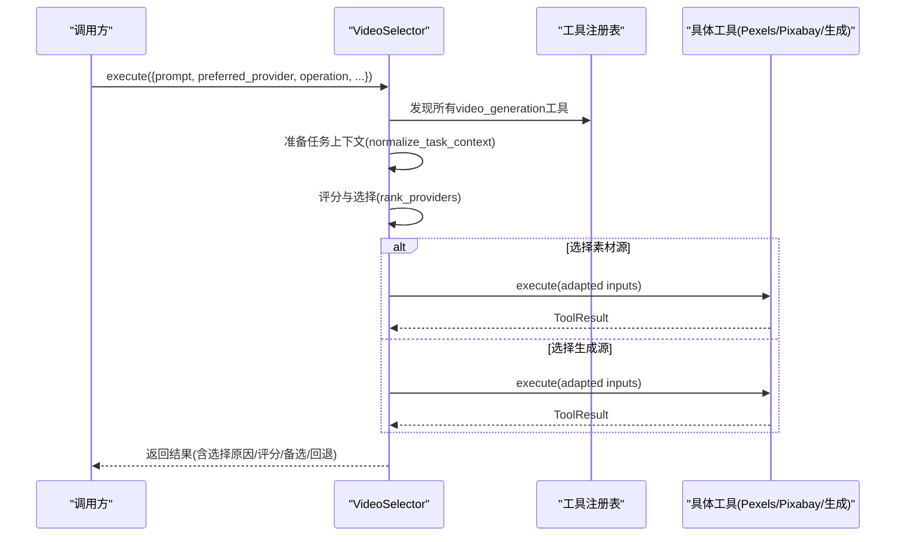
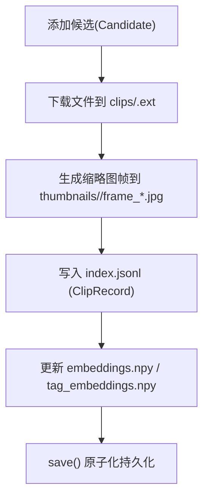
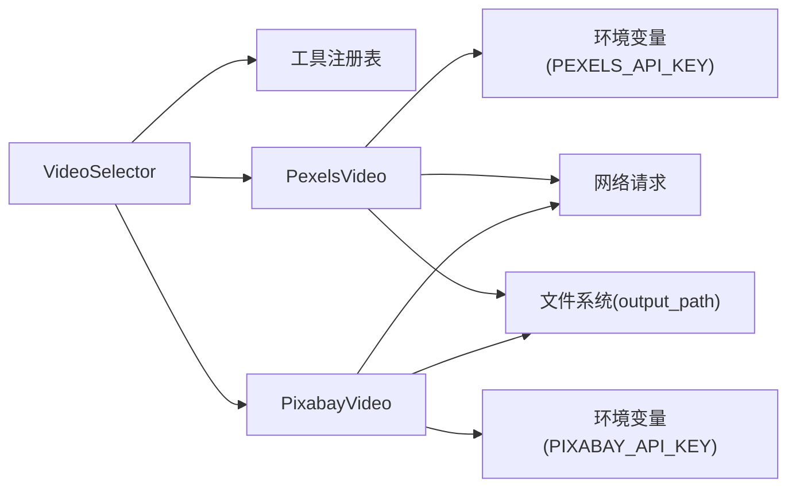

# 素材视频源集成

<cite>
**本文引用的文件**
- [tools/video/pexels_video.py](file://tools/video/pexels_video.py)
- [tools/video/pixabay_video.py](file://tools/video/pixabay_video.py)
- [tools/video/stock_sources/base.py](file://tools/video/stock_sources/base.py)
- [tools/video/stock_sources/__init__.py](file://tools/video/stock_sources/__init__.py)
- [tools/video/stock_sources/pexels.py](file://tools/video/stock_sources/pexels.py)
- [tools/video/video_selector.py](file://tools/video/video_selector.py)
- [lib/corpus.py](file://lib/corpus.py)
- [tools/base_tool.py](file://tools/base_tool.py)
</cite>

## 目录
1. [简介](#简介)
2. [项目结构](#项目结构)
3. [核心组件](#核心组件)
4. [架构总览](#架构总览)
5. [详细组件分析](#详细组件分析)
6. [依赖关系分析](#依赖关系分析)
7. [性能与限流](#性能与限流)
8. [故障排查指南](#故障排查指南)
9. [结论](#结论)
10. [附录：扩展新素材源](#附录：扩展新素材源)

## 简介
本技术文档面向OpenMontage的“素材视频源集成”，聚焦Pexels、Pixabay等免费素材视频平台的API集成实现，覆盖搜索、筛选、下载与版权元数据管理全流程。文档解释多平台统一接口的抽象设计与适配器模式，说明API密钥配置、请求限流与错误处理细节，并给出视频元数据提取、质量评估与格式转换的实践要点。最后提供按关键词、风格、时长等条件智能获取合适视频素材的使用示例与最佳实践。

## 项目结构
围绕素材视频源的核心代码主要分布在以下位置：
- 工具层（独立可执行工具）：tools/video/pexels_video.py、tools/video/pixabay_video.py
- 统一协议与适配器注册：tools/video/stock_sources/base.py、tools/video/stock_sources/__init__.py、tools/video/stock_sources/pexels.py
- 路由与选择器：tools/video/video_selector.py
- 本地语料库与检索：lib/corpus.py
- 基础工具契约与运行时：tools/base_tool.py

图表来源
- [tools/video/pexels_video.py:24-99](file://tools/video/pexels_video.py#L24-L99)
- [tools/video/pixabay_video.py:24-107](file://tools/video/pixabay_video.py#L24-L107)
- [tools/video/stock_sources/base.py:43-141](file://tools/video/stock_sources/base.py#L43-L141)
- [tools/video/stock_sources/__init__.py:39-92](file://tools/video/stock_sources/__init__.py#L39-L92)
- [tools/video/stock_sources/pexels.py:30-97](file://tools/video/stock_sources/pexels.py#L30-L97)
- [tools/video/video_selector.py:15-40](file://tools/video/video_selector.py#L15-L40)
- [lib/corpus.py:73-125](file://lib/corpus.py#L73-L125)
- [tools/base_tool.py:63-139](file://tools/base_tool.py#L63-L139)

章节来源
- [tools/video/pexels_video.py:24-99](file://tools/video/pexels_video.py#L24-L99)
- [tools/video/pixabay_video.py:24-107](file://tools/video/pixabay_video.py#L24-L107)
- [tools/video/stock_sources/base.py:43-141](file://tools/video/stock_sources/base.py#L43-L141)
- [tools/video/stock_sources/__init__.py:39-92](file://tools/video/stock_sources/__init__.py#L39-L92)
- [tools/video/stock_sources/pexels.py:30-97](file://tools/video/stock_sources/pexels.py#L30-L97)
- [tools/video/video_selector.py:15-40](file://tools/video/video_selector.py#L15-L40)
- [lib/corpus.py:73-125](file://lib/corpus.py#L73-L125)
- [tools/base_tool.py:63-139](file://tools/base_tool.py#L63-L139)

## 核心组件
- PexelsVideo/PixabayVideo：独立的“SOURCE”级工具，封装各自平台的搜索、筛选、下载与结果返回，遵循统一的ToolResult结构与重试策略。
- StockSource协议与Candidate/SearchFilters：定义统一的搜索与下载接口，屏蔽各平台差异，便于批量并行采集与后续检索。
- VideoSelector：能力级路由器，根据任务上下文与评分机制选择具体提供者（包括生成类与素材类），并对输入键进行适配（如prompt→query）。
- Corpus：本地语料库，负责将候选素材持久化到clips与缩略图目录，维护索引与向量嵌入，支持离线相似度检索。
- BaseTool/ToolResult：统一工具契约，包含状态、资源画像、重试策略、幂等键字段、副作用声明等。

章节来源
- [tools/video/pexels_video.py:24-99](file://tools/video/pexels_video.py#L24-L99)
- [tools/video/pixabay_video.py:24-107](file://tools/video/pixabay_video.py#L24-L107)
- [tools/video/stock_sources/base.py:43-141](file://tools/video/stock_sources/base.py#L43-L141)
- [tools/video/video_selector.py:15-40](file://tools/video/video_selector.py#L15-L40)
- [lib/corpus.py:73-125](file://lib/corpus.py#L73-L125)
- [tools/base_tool.py:63-139](file://tools/base_tool.py#L63-L139)

## 架构总览
整体流程分为三层：
- 接入层：PexelsVideo/PixabayVideo作为独立工具暴露search_video/download_video能力；同时stock_sources提供统一协议适配器用于批量构建本地语料库。
- 路由层：VideoSelector根据任务上下文、用户偏好与环境提示，选择最合适的提供者（含素材源或生成源），并做输入键适配与回退策略。
- 存储与检索层：Corpus将下载的素材与元数据写入本地，形成可离线检索的语料库，支撑后续相似性查询与去重。

图表来源
- [tools/video/video_selector.py:308-366](file://tools/video/video_selector.py#L308-L366)
- [tools/video/pexels_video.py:109-213](file://tools/video/pexels_video.py#L109-L213)
- [tools/video/pixabay_video.py:117-222](file://tools/video/pixabay_video.py#L117-L222)
- [lib/corpus.py:130-181](file://lib/corpus.py#L130-L181)

## 详细组件分析

### PexelsVideo 工具
- 能力与约束
  - 能力：search_video、download_video、stock_video
  - 支持：方向过滤、尺寸过滤、免费商用
  - 资源画像：CPU=1核、内存256MB、无需显存、需网络
  - 重试策略：最多2次，针对rate_limit与timeout
  - 幂等键字段：query、orientation、size、page
- 关键流程
  - 读取环境变量PEXELS_API_KEY，缺失则直接失败
  - 构造搜索参数（query、per_page、page、orientation、size）
  - 调用Pexels搜索API，解析videos列表
  - 客户端按min/max_duration过滤
  - 从video_files中选择preferred_quality（hd/sd）或最高分辨率
  - 下载视频至output_path，返回ToolResult（包含provider、video_id、duration、宽高、fps、quality、license、pexels_url等）

图表来源
- [tools/video/pexels_video.py:109-213](file://tools/video/pexels_video.py#L109-L213)

章节来源
- [tools/video/pexels_video.py:24-99](file://tools/video/pexels_video.py#L24-L99)
- [tools/video/pexels_video.py:109-213](file://tools/video/pexels_video.py#L109-L213)

### PixabayVideo 工具
- 能力与约束
  - 能力：search_video、download_video、stock_video
  - 支持：视频类型过滤、分类过滤、编辑精选、免费商用
  - 资源画像：CPU=1核、内存256MB、无需显存、需网络
  - 重试策略：最多2次，针对rate_limit与timeout
  - 幂等键字段：query、video_type、category、page
- 关键流程
  - 读取环境变量PIXABAY_API_KEY，缺失则直接失败
  - 构造搜索参数（key、q、per_page[3-200]、page、safesearch、video_type、category、editors_choice）
  - 调用Pixabay搜索API，解析hits列表
  - 客户端按min/max_duration过滤
  - 从videos中按preferred_quality选择（large/medium/small/tiny），否则回退到最佳可用
  - 立即下载（URL可能过期），保存至output_path，返回ToolResult（包含provider、video_id、tags、duration、宽高、license、page_url等）

图表来源
- [tools/video/pixabay_video.py:117-222](file://tools/video/pixabay_video.py#L117-L222)

章节来源
- [tools/video/pixabay_video.py:24-107](file://tools/video/pixabay_video.py#L24-L107)
- [tools/video/pixabay_video.py:117-222](file://tools/video/pixabay_video.py#L117-L222)

### 统一协议与适配器（StockSource/Candidate）
- Candidate：标准化单条搜索结果，包含source/source_id/source_url/download_url/kind/宽高/时长/创作者/许可/标签/缩略图/额外字段
- SearchFilters：搜索过滤器，包含kind/min-max duration/orientation/min_width/per_page/page
- StockSource协议：要求name/is_available/search/download方法，确保所有素材源一致
- 自动发现与注册：通过__init__.py扫描模块，收集所有满足协议的适配器，提供all_sources/available_sources/catalog/summary/get_source等能力

图表来源
- [tools/video/stock_sources/base.py:43-141](file://tools/video/stock_sources/base.py#L43-L141)
- [tools/video/stock_sources/pexels.py:30-97](file://tools/video/stock_sources/pexels.py#L30-L97)

章节来源
- [tools/video/stock_sources/base.py:43-141](file://tools/video/stock_sources/base.py#L43-L141)
- [tools/video/stock_sources/__init__.py:39-92](file://tools/video/stock_sources/__init__.py#L39-L92)
- [tools/video/stock_sources/pexels.py:30-97](file://tools/video/stock_sources/pexels.py#L30-L97)

### 视频选择器（VideoSelector）
- 作用：在多种视频提供者之间进行路由与选择，包括素材源与生成源
- 能力：text_to_video、image_to_video、reference_to_video、video_edit、stock_video、provider_selection、search_video、download_video
- 选择逻辑：
  - 自动发现所有具备video_generation能力的工具
  - 基于任务上下文与评分机制选择最优提供者
  - 支持preferred_provider与gap阈值控制
  - 对输入键进行适配（如prompt→query）
  - 为运动必需操作禁用图片工具回退
- 输出：包含selected_tool、selected_provider、selection_reason、provider_score、alternatives_considered、fallback_tools等

图表来源
- [tools/video/video_selector.py:248-366](file://tools/video/video_selector.py#L248-L366)
- [tools/video/video_selector.py:368-440](file://tools/video/video_selector.py#L368-L440)

章节来源
- [tools/video/video_selector.py:15-40](file://tools/video/video_selector.py#L15-L40)
- [tools/video/video_selector.py:308-366](file://tools/video/video_selector.py#L308-L366)
- [tools/video/video_selector.py:368-440](file://tools/video/video_selector.py#L368-L440)

### 本地语料库（Corpus）
- 职责：将候选素材持久化为本地文件与索引，支持离线检索与相似度计算
- 结构：clips/存放素材、thumbnails/存放缩略图帧、index.jsonl记录元数据、embeddings.npy与tag_embeddings.npy存储向量
- 操作：load/save/add/rank_by_text/knn等，保证append-only与行对齐一致性

图表来源
- [lib/corpus.py:73-125](file://lib/corpus.py#L73-L125)
- [lib/corpus.py:130-181](file://lib/corpus.py#L130-L181)

章节来源
- [lib/corpus.py:73-125](file://lib/corpus.py#L73-L125)
- [lib/corpus.py:130-181](file://lib/corpus.py#L130-L181)

## 依赖关系分析
- 工具间耦合
  - VideoSelector依赖工具注册表与评分模块，动态发现并选择具体提供者
  - PexelsVideo/PixabayVideo依赖requests与os环境变量，遵循BaseTool契约
  - stock_sources适配器依赖base协议，被__init__.py自动发现
- 外部依赖
  - Pexels API：需要PEXELS_API_KEY
  - Pixabay API：需要PIXABAY_API_KEY
  - 网络：下载视频需要稳定网络
- 潜在循环依赖
  - 无直接循环依赖；适配器与选择器解耦，通过统一协议与注册机制协作

图表来源
- [tools/video/video_selector.py:248-366](file://tools/video/video_selector.py#L248-L366)
- [tools/video/pexels_video.py:109-213](file://tools/video/pexels_video.py#L109-L213)
- [tools/video/pixabay_video.py:117-222](file://tools/video/pixabay_video.py#L117-L222)

章节来源
- [tools/video/video_selector.py:248-366](file://tools/video/video_selector.py#L248-L366)
- [tools/video/pexels_video.py:109-213](file://tools/video/pexels_video.py#L109-L213)
- [tools/video/pixabay_video.py:117-222](file://tools/video/pixabay_video.py#L117-L222)

## 性能与限流
- 请求限流
  - PexelsVideo/PixabayVideo均配置RetryPolicy(max_retries=2, retryable_errors=["rate_limit", "timeout"])，应对临时限流与超时
  - per_page限制：Pexels最大80，Pixabay限制在3-200之间，避免服务端拒绝
- 下载优化
  - PexelsSource.download使用流式下载(iter_content)，降低大文件内存占用
  - PixabayVideo直接下载（URL可能过期），建议尽快缓存
- 资源画像
  - 两个工具均为轻量CPU+内存需求，无需GPU，适合并发批量采集
- 建议
  - 合理设置per_page与page，结合客户端时长过滤减少无效下载
  - 在网络不稳定时启用重试与退避策略
  - 对高频查询结果进行本地缓存（由上层corpus或调用方实现）

章节来源
- [tools/video/pexels_video.py:93-99](file://tools/video/pexels_video.py#L93-L99)
- [tools/video/pixabay_video.py:101-107](file://tools/video/pixabay_video.py#L101-L107)
- [tools/video/stock_sources/pexels.py:71-97](file://tools/video/stock_sources/pexels.py#L71-L97)

## 故障排查指南
- 常见错误
  - 未设置API密钥：PexelsVideo/PixabayVideo会直接返回失败，提示安装说明
  - 无搜索结果：返回失败并附带total_results，便于调试
  - 无可用下载链接：当视频文件或画质不可用时返回失败
- 排查步骤
  - 检查环境变量PEXELS_API_KEY/PIXABAY_API_KEY是否正确设置
  - 验证搜索参数（query、per_page、page、orientation、size、category等）是否符合平台限制
  - 查看返回的data字段中的total_results与results_returned，确认过滤逻辑
  - 检查网络连通性与超时设置（默认30s搜索、120s下载）
- 日志与事件
  - BaseTool.execute包装器会记录start/error事件，便于定位问题

章节来源
- [tools/video/pexels_video.py:109-115](file://tools/video/pexels_video.py#L109-L115)
- [tools/video/pixabay_video.py:117-123](file://tools/video/pixabay_video.py#L117-L123)
- [tools/base_tool.py:148-200](file://tools/base_tool.py#L148-L200)

## 结论
OpenMontage通过统一协议与适配器模式，将Pexels、Pixabay等免费素材视频平台无缝集成到同一工作流中。VideoSelector提供智能路由与回退，Corpus实现本地语料库与离线检索，配合重试策略与资源画像，确保高可用与可扩展性。开发者可按需扩展新的素材源，只需实现StockSource协议并在stock_sources目录下注册即可。

## 附录：扩展新素材源
- 步骤
  1. 在tools/video/stock_sources下新建<name>.py，实现StockSource协议（name/is_available/search/download）
  2. 将API响应标准化为Candidate对象，填充必要字段（source/source_id/source_url/download_url/kind/宽高/时长/创作者/许可/标签/缩略图/额外字段）
  3. 提供稳定的name属性与可选的display_name/install_instructions/supports/priority
  4. 通过__init__.py的自动发现机制，新适配器将被纳入all_sources/available_sources
- 注意事项
  - is_available应仅做非网络检查（如环境变量是否存在）
  - search应抛出网络异常，由上层捕获并记录
  - download应为阻塞式下载，不实现缓存（由上层决定）
  - 保持幂等与稳定性，避免破坏已有语料库索引

章节来源
- [tools/video/stock_sources/base.py:23-35](file://tools/video/stock_sources/base.py#L23-L35)
- [tools/video/stock_sources/base.py:102-141](file://tools/video/stock_sources/base.py#L102-L141)
- [tools/video/stock_sources/__init__.py:39-92](file://tools/video/stock_sources/__init__.py#L39-L92)