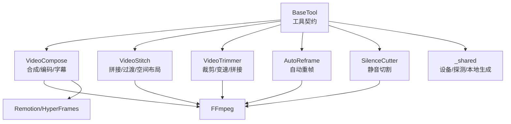
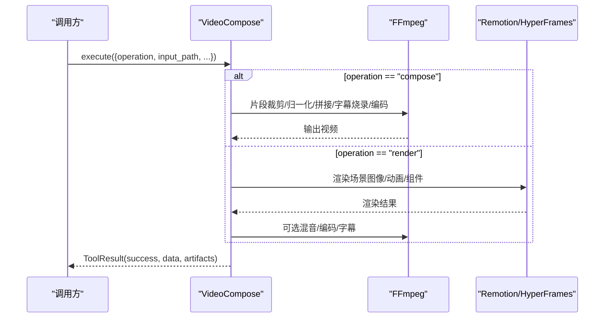
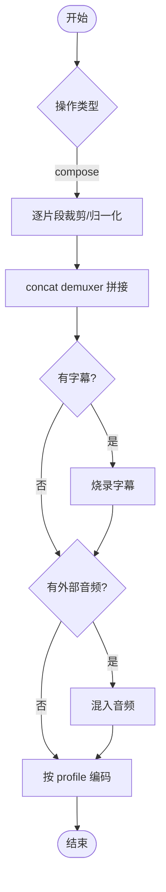
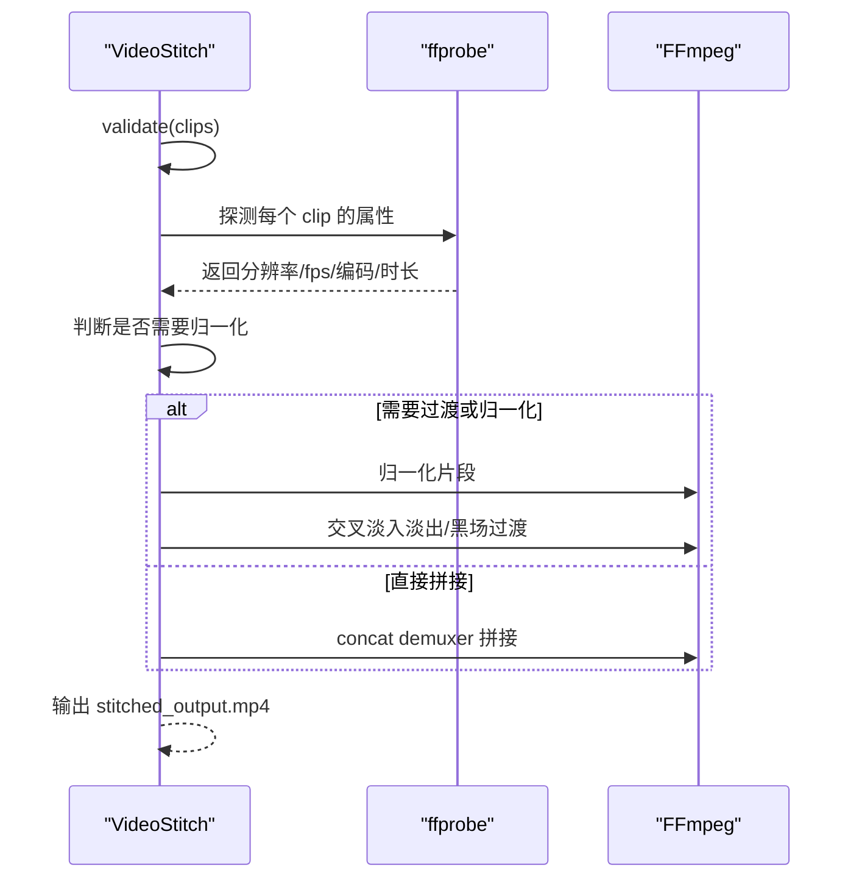
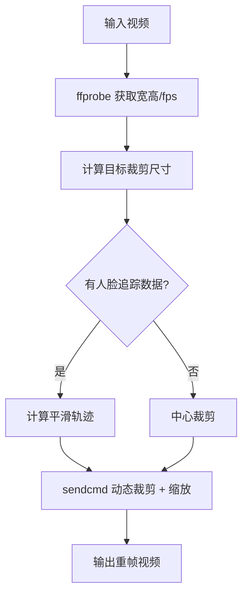
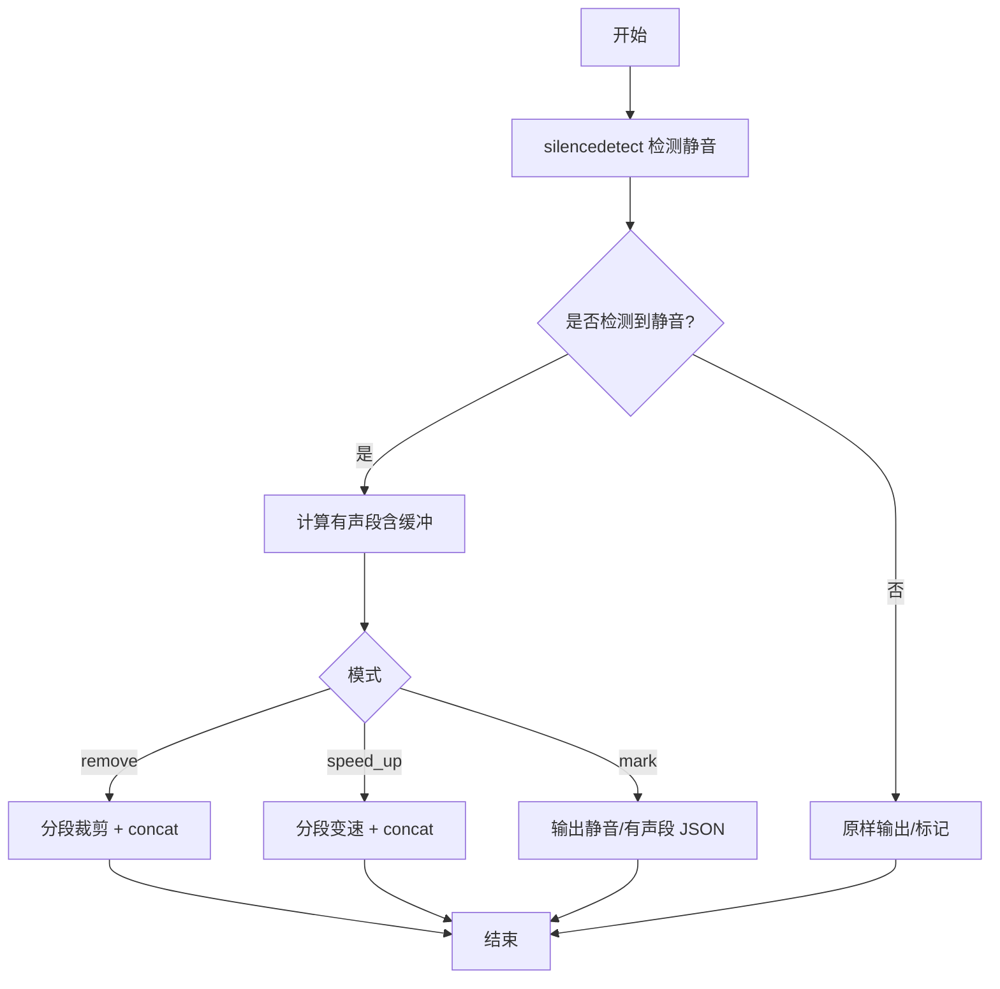
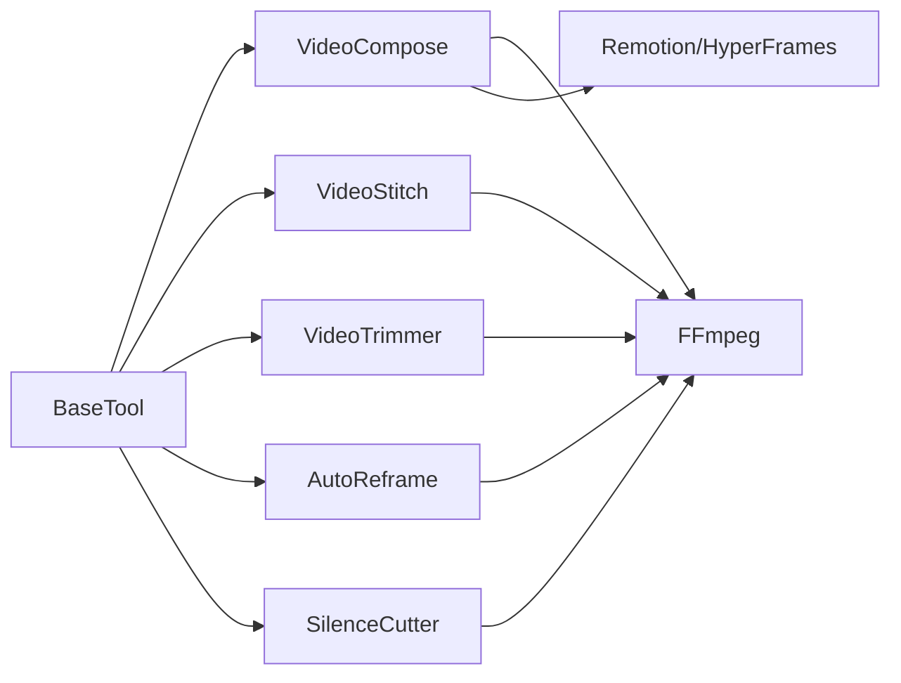

# 视频处理与编辑工具

<cite>
**本文引用的文件**
- [README.md](file://README.md)
- [base_tool.py](file://tools/base_tool.py)
- [video_compose.py](file://tools/video/video_compose.py)
- [video_stitch.py](file://tools/video/video_stitch.py)
- [auto_reframe.py](file://tools/video/auto_reframe.py)
- [silence_cutter.py](file://tools/video/silence_cutter.py)
- [video_trimmer.py](file://tools/video/video_trimmer.py)
- [_shared.py](file://tools/video/_shared.py)
- [ffmpeg.md](file://skills/core/ffmpeg.md)
</cite>

## 目录
1. [简介](#简介)
2. [项目结构](#项目结构)
3. [核心组件](#核心组件)
4. [架构总览](#架构总览)
5. [详细组件分析](#详细组件分析)
6. [依赖关系分析](#依赖关系分析)
7. [性能考虑](#性能考虑)
8. [故障排查指南](#故障排查指南)
9. [结论](#结论)
10. [附录](#附录)

## 简介
本技术文档面向 OpenMontage 的视频处理与编辑能力，聚焦以下目标：
- 视频合成、拼接、裁剪、自动重帧、静音切割等核心功能的技术实现
- FFmpeg 集成原理、编解码器配置与性能优化技巧
- 视频格式转换、分辨率调整、码率控制、滤镜应用细节
- 批量与并行处理、内存优化的最佳实践
- 错误处理、进度跟踪与日志记录方案
- 构建复杂视频处理流水线的实践方法

OpenMontage 以“工具即能力”的方式组织视频处理能力，所有视频相关工具统一继承自基础工具基类，提供一致的输入输出契约、依赖检查、资源画像、重试策略与可恢复性。底层大量使用 FFmpeg 完成转码、滤镜、拼接、字幕烧录、音频混音等操作；同时支持 Remotion/HyperFrames 作为高级渲染后端进行更复杂的场景合成与动画。

**章节来源**
- [README.md:180-215](file://README.md#L180-L215)
- [README.md:450-475](file://README.md#L450-L475)

## 项目结构
OpenMontage 将视频能力集中在 tools/video 目录下，每个工具对应一个独立的 Python 模块，遵循统一的 BaseTool 契约。关键目录与职责如下：
- tools/base_tool.py：定义工具契约、执行包装、命令运行、错误封装、状态与资源画像
- tools/video/video_compose.py：视频合成与编码（FFmpeg + Remotion/HyperFrames）
- tools/video/video_stitch.py：多片段拼接、过渡、空间布局
- tools/video/video_trimmer.py：裁剪、变速、片段拼接
- tools/video/auto_reframe.py：基于人脸追踪的自动重帧（横转竖等）
- tools/video/silence_cutter.py：静音检测与跳切/加速
- tools/video/_shared.py：通用辅助（设备选择、本地生成、探测输出等）
- skills/core/ffmpeg.md：FFmpeg 技能与推荐工作流

**图表来源**
- [base_tool.py:227-372](file://tools/base_tool.py#L227-L372)
- [video_compose.py:58-78](file://tools/video/video_compose.py#L58-L78)
- [video_stitch.py:29-57](file://tools/video/video_stitch.py#L29-L57)
- [video_trimmer.py:28-47](file://tools/video/video_trimmer.py#L28-L47)
- [auto_reframe.py:44-67](file://tools/video/auto_reframe.py#L44-L67)
- [silence_cutter.py:34-53](file://tools/video/silence_cutter.py#L34-L53)
- [_shared.py:249-372](file://tools/video/_shared.py#L249-L372)

**章节来源**
- [base_tool.py:227-372](file://tools/base_tool.py#L227-L372)
- [ffmpeg.md:1-40](file://skills/core/ffmpeg.md#L1-L40)

## 核心组件
本节概述各视频工具的职责与关键能力：
- VideoCompose：负责最终合成与编码，支持 compose/render/remotion_render/burn_subtitles/overlay/encode；可路由到 Remotion/HyperFrames 或纯 FFmpeg 路径
- VideoStitch：多片段顺序拼接，支持 cut/crossfade/fade-through-black 过渡，以及 side_by_side/vertical_stack/picture_in_picture 空间布局
- VideoTrimmer：精确裁剪、变速、片段拼接，默认尽量无损（copy）
- AutoReframe：根据目标宽高比计算裁剪区域，支持静态居中裁剪与动态人脸追踪裁剪
- SilenceCutter：基于 silencedetect 检测静音段，支持 remove/speed_up/mark 三种模式
- _shared：设备选择（CUDA/MPS/CPU）、本地模型加载、输出探测（ffprobe）等通用能力

这些工具均声明 dependencies、capabilities、resource_profile、retry_policy、resume_support、idempotency_key_fields 等元信息，便于编排器调度与治理。

**章节来源**
- [video_compose.py:58-232](file://tools/video/video_compose.py#L58-L232)
- [video_stitch.py:29-146](file://tools/video/video_stitch.py#L29-L146)
- [video_trimmer.py:28-84](file://tools/video/video_trimmer.py#L28-L84)
- [auto_reframe.py:44-129](file://tools/video/auto_reframe.py#L44-L129)
- [silence_cutter.py:34-109](file://tools/video/silence_cutter.py#L34-L109)
- [_shared.py:249-372](file://tools/video/_shared.py#L249-L372)

## 架构总览
OpenMontage 的视频处理架构围绕“工具契约 + FFmpeg + 可选渲染后端”展开：
- 工具层：每个工具暴露 execute(inputs) -> ToolResult，并自带依赖检查、重试、幂等键、资源画像
- 执行层：BaseTool.run_command 统一封装 subprocess 调用，Windows 下解析 .cmd/.bat，UTF-8 解码 stderr/stdout，异常转换为 ToolCommandError
- 后端层：FFmpeg 用于转码、滤镜、拼接、字幕烧录、音频混音；Remotion/HyperFrames 用于复杂场景合成与动画
- 治理层：通过 get_info/dry_run/estimate_cost/estimate_runtime 暴露能力与成本/时长估计，配合流程治理（如运行时锁定、失败不静默降级）

**图表来源**
- [video_compose.py:337-360](file://tools/video/video_compose.py#L337-L360)
- [video_compose.py:438-714](file://tools/video/video_compose.py#L438-L714)
- [base_tool.py:411-453](file://tools/base_tool.py#L411-L453)

**章节来源**
- [base_tool.py:227-453](file://tools/base_tool.py#L227-L453)
- [video_compose.py:337-714](file://tools/video/video_compose.py#L337-L714)

## 详细组件分析

### VideoCompose（视频合成与编码）
- 能力：compose（低层拼接+字幕+音频）、render（高层自动路由）、remotion_render（显式 Remotion）、burn_subtitles（烧字幕）、overlay（叠加）、encode（重新编码）
- 运行时选择：根据 edit_decisions.render_runtime 锁定 Remotion/HyperFrames/FFmpeg；禁止静默切换
- 关键实现要点：
  - 片段裁剪与归一化：对每个 cut 使用 -ss/-t 精准截取，统一分辨率、像素格式、帧率，确保 concat-copy 安全
  - 无音频流处理：先探测是否有音频流，若无则注入静音 AAC 轨道，保证后续 concat 一致性
  - 字幕样式：从 inputs/edit_decisions/playbook 分层解析，构建 ASS 样式字符串
  - 编码参数：codec/crf/preset/profile，必要时触发重编码（含缩放/帧率变化）
  - 外部音频复用：原子替换已渲染视频的音频轨
  - 最终自检：HyperFrames/Remotion 路径均执行 final_review（ffprobe、帧采样、音频分析、承诺校验）

**图表来源**
- [video_compose.py:438-714](file://tools/video/video_compose.py#L438-L714)

**章节来源**
- [video_compose.py:58-232](file://tools/video/video_compose.py#L58-L232)
- [video_compose.py:337-714](file://tools/video/video_compose.py#L337-L714)
- [video_compose.py:1843-1882](file://tools/video/video_compose.py#L1843-L1882)

### VideoStitch（多片段拼接与过渡）
- 能力：validate（兼容性检查）、stitch（顺序拼接）、preview_stitch（低分辨率预览）、spatial（侧边/上下堆叠/PiP）
- 过渡类型：cut、crossfade、fade-through-black；N 片段时链式 xfade 滤镜
- 关键点：
  - 兼容性检查：分辨率、fps、视频/音频编码、采样率、声道数
  - 自动归一化：当 clips 属性不一致且 auto_normalize=true 时，统一为目标分辨率/fps/编码
  - 音频保障：crossfade/fade 需要每段都有音频流，否则注入静音
  - 预览模式：降低分辨率与质量快速预览

**图表来源**
- [video_stitch.py:314-399](file://tools/video/video_stitch.py#L314-L399)
- [video_stitch.py:481-583](file://tools/video/video_stitch.py#L481-L583)
- [video_stitch.py:609-735](file://tools/video/video_stitch.py#L609-L735)

**章节来源**
- [video_stitch.py:29-146](file://tools/video/video_stitch.py#L29-L146)
- [video_stitch.py:314-735](file://tools/video/video_stitch.py#L314-L735)

### VideoTrimmer（裁剪、变速、拼接）
- 能力：cut（按时间裁剪）、speed（变速）、concat（多段拼接）
- 特点：默认尽可能无损（-c copy），变速时使用 setpts/atempo 链
- 适用场景：快速剪辑、节奏调整、批量拼接

**章节来源**
- [video_trimmer.py:28-84](file://tools/video/video_trimmer.py#L28-L84)
- [video_trimmer.py:105-180](file://tools/video/video_trimmer.py#L105-L180)
- [video_trimmer.py:182-271](file://tools/video/video_trimmer.py#L182-L271)

### AutoReframe（自动重帧）
- 能力：aspect_ratio_conversion、face_tracked_crop、smart_reframe、center_crop
- 流程：
  - 读取源视频宽高与 fps
  - 计算目标裁剪尺寸（匹配目标宽高比）
  - 获取人脸追踪数据（内置 FaceTracker 或外部 JSON）
  - 若人脸稳定则静态居中裁剪；否则动态计算 per-frame 裁剪坐标
  - 使用 FFmpeg crop/scale 或 sendcmd 动态更新裁剪位置
- 预设：portrait/square/landscape/cinematic/vertical_4_5

**图表来源**
- [auto_reframe.py:131-219](file://tools/video/auto_reframe.py#L131-L219)
- [auto_reframe.py:300-401](file://tools/video/auto_reframe.py#L300-L401)
- [auto_reframe.py:412-525](file://tools/video/auto_reframe.py#L412-L525)

**章节来源**
- [auto_reframe.py:44-129](file://tools/video/auto_reframe.py#L44-L129)
- [auto_reframe.py:131-525](file://tools/video/auto_reframe.py#L131-L525)

### SilenceCutter（静音切割）
- 能力：silence_detection、jump_cut、silence_removal、silence_speedup
- 模式：
  - remove：删除静音段，生成跳切
  - speed_up：静音段加速播放（atempo 链）
  - mark：仅输出静音/有声段 JSON，供人工审核
- 实现：使用 FFmpeg silencedetect 过滤，解析 start/end/duration，计算有声段，再分别渲染

**图表来源**
- [silence_cutter.py:111-218](file://tools/video/silence_cutter.py#L111-L218)
- [silence_cutter.py:220-296](file://tools/video/silence_cutter.py#L220-L296)
- [silence_cutter.py:298-482](file://tools/video/silence_cutter.py#L298-L482)

**章节来源**
- [silence_cutter.py:34-109](file://tools/video/silence_cutter.py#L34-L109)
- [silence_cutter.py:111-482](file://tools/video/silence_cutter.py#L111-L482)

### _shared（通用辅助）
- 设备选择：优先 CUDA > MPS > CPU，适配不同硬件
- 本地生成：加载 diffusers pipeline，启用 attention slicing/vae tiling/slicing 降低显存
- 输出探测：调用 ffprobe 提取时长、分辨率、编码等信息
- 云端生成：HeyGen/LTX Modal 等 API 的上传、轮询、下载与封装

**章节来源**
- [_shared.py:249-372](file://tools/video/_shared.py#L249-L372)
- [_shared.py:485-796](file://tools/video/_shared.py#L485-L796)

## 依赖关系分析
- BaseTool 是所有视频工具的基类，提供：
  - 依赖检查（cmd/env/python 模块）
  - 命令执行封装（run_command）
  - 错误封装（ToolCommandError）
  - 资源画像（ResourceProfile）
  - 重试策略（RetryPolicy）
  - 幂等键（idempotency_key）
  - 执行包装（Backlot 事件发射）
- 视频工具依赖 FFmpeg/ffprobe；部分工具额外依赖 MediaPipe/OpenCV（AutoReframe）
- 渲染后端：Remotion/HyperFrames 由 VideoCompose 在 render 阶段选择，受治理约束不可静默切换

**图表来源**
- [base_tool.py:227-453](file://tools/base_tool.py#L227-L453)
- [video_compose.py:58-78](file://tools/video/video_compose.py#L58-L78)
- [video_stitch.py:29-57](file://tools/video/video_stitch.py#L29-L57)
- [video_trimmer.py:28-47](file://tools/video/video_trimmer.py#L28-L47)
- [auto_reframe.py:44-67](file://tools/video/auto_reframe.py#L44-L67)
- [silence_cutter.py:34-53](file://tools/video/silence_cutter.py#L34-L53)

**章节来源**
- [base_tool.py:227-453](file://tools/base_tool.py#L227-L453)

## 性能考虑
- 编码参数调优：
  - CRF 控制质量与体积（常见 18-28，越低质量越高体积越大）
  - preset 影响编码速度（ultrafast/fast/medium/slower/slower2/slow）
  - 两遍编码（two_pass_encode）可用于更精细的码率控制（在 VideoCompose options 中可用）
- 片段归一化：
  - 统一分辨率、像素格式（yuv420p）、帧率（30fps）以确保 concat-copy 安全
  - 无音频流时注入静音 AAC，避免跨平台兼容问题
- 滤镜链优化：
  - 尽量合并 filter（如 scale+pad+setsar+fps）减少中间态
  - atempo 链拆分极端变速（限制 0.5-100）
- 内存与显存：
  - 本地生成启用 attention_slicing/vae_tiling/slicing 降低显存占用
  - 设备选择优先 CUDA/MPS，CPU 回退
- 批处理与并行：
  - 多个独立片段可并行执行 FFmpeg 任务（注意磁盘 IO 与 CPU 上限）
  - 使用临时目录隔离中间产物，及时清理

[本节为通用指导，无需特定文件引用]

## 故障排查指南
- 依赖缺失：
  - FFmpeg/ffprobe 未安装：检查 PATH 或按 install_instructions 安装
  - Node.js/npx 缺失：Remotion/HyperFrames 渲染需要
  - MediaPipe/OpenCV 缺失：AutoReframe 人脸追踪会回退到中心裁剪
- 常见错误：
  - 片段属性不一致导致 concat 失败：启用 auto_normalize 或手动归一化
  - 无音频流导致 acrossfade 失败：确保每段有音频（工具已自动注入静音）
  - 字幕路径或样式错误：检查路径转义与 ASS 样式格式
  - 运行时静默切换被拒绝：遵循治理规则，显式审批后再切换
- 调试建议：
  - 使用 dry_run 预检（VideoStitch 支持）
  - 查看 run_command 的 stderr/stdout 详情（ToolCommandError.detail）
  - 启用 final_review 自检（视频质量、音频电平、字幕存在性）

**章节来源**
- [base_tool.py:296-327](file://tools/base_tool.py#L296-L327)
- [base_tool.py:411-453](file://tools/base_tool.py#L411-L453)
- [video_stitch.py:481-583](file://tools/video/video_stitch.py#L481-L583)
- [video_compose.py:1843-1882](file://tools/video/video_compose.py#L1843-L1882)

## 结论
OpenMontage 的视频处理体系以统一工具契约为基础，结合 FFmpeg 的强大能力与 Remotion/HyperFrames 的高级渲染，提供了从基础剪辑到复杂合成的完整流水线。通过严格的依赖检查、资源画像、重试与幂等机制，以及运行时治理与最终自检，确保了生产级稳定性与可审计性。对于大规模处理，建议采用并行执行、片段归一化、滤镜链合并与合理的编码参数，以获得最佳性能与质量平衡。

[本节为总结，无需特定文件引用]

## 附录
- FFmpeg 技能与工作流：参考 skills/core/ffmpeg.md 中的增强链顺序与工具组合建议
- 平台输出配置：可在 VideoCompose 中使用 profile 指定分辨率与帧率（如 YouTube/TikTok/Instagram）
- 实际示例路径：
  - 合成与编码：tools/video/video_compose.py
  - 拼接与过渡：tools/video/video_stitch.py
  - 裁剪与变速：tools/video/video_trimmer.py
  - 自动重帧：tools/video/auto_reframe.py
  - 静音切割：tools/video/silence_cutter.py
  - 通用辅助：tools/video/_shared.py

**章节来源**
- [ffmpeg.md:1-40](file://skills/core/ffmpeg.md#L1-L40)
- [video_compose.py:58-232](file://tools/video/video_compose.py#L58-L232)
- [video_stitch.py:29-146](file://tools/video/video_stitch.py#L29-L146)
- [video_trimmer.py:28-84](file://tools/video/video_trimmer.py#L28-L84)
- [auto_reframe.py:44-129](file://tools/video/auto_reframe.py#L44-L129)
- [silence_cutter.py:34-109](file://tools/video/silence_cutter.py#L34-L109)
- [_shared.py:249-372](file://tools/video/_shared.py#L249-L372)