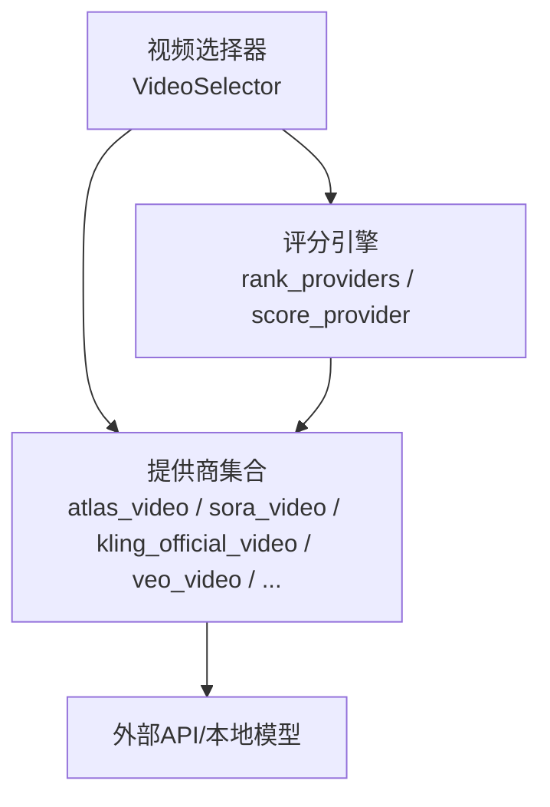
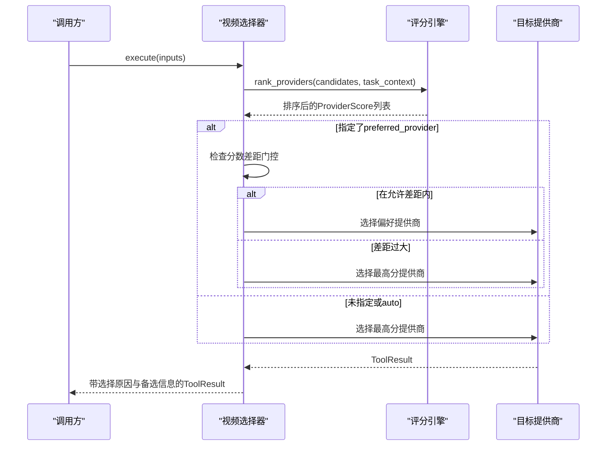
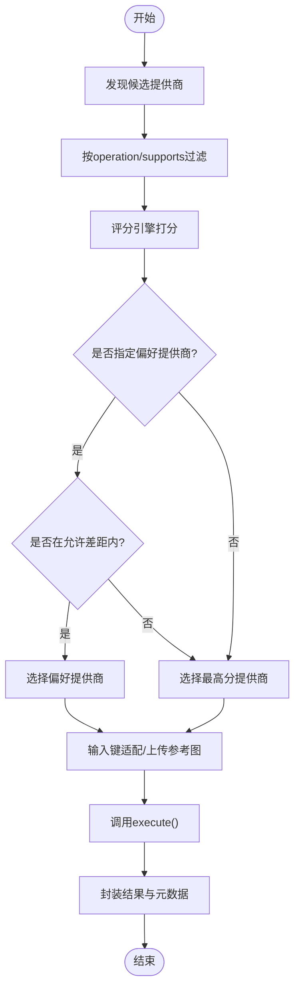
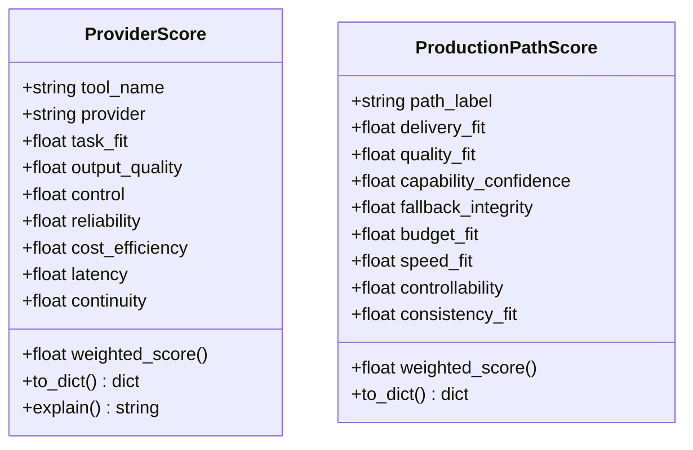
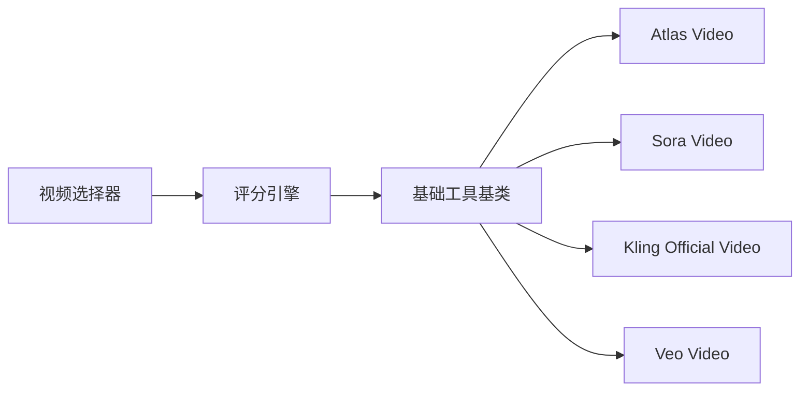

# 视频生成

<cite>
**本文引用的文件**
- [tools/video/video_selector.py](file://tools/video/video_selector.py)
- [lib/scoring.py](file://lib/scoring.py)
- [tools/base_tool.py](file://tools/base_tool.py)
- [tools/video/atlas_video.py](file://tools/video/atlas_video.py)
- [tools/video/sora_video.py](file://tools/video/sora_video.py)
- [tools/video/kling_official_video.py](file://tools/video/kling_official_video.py)
- [tools/video/veo_video.py](file://tools/video/veo_video.py)
- [tests/tools/test_video_selector_routing.py](file://tests/tools/test_video_selector_routing.py)
</cite>

## 目录
1. [简介](#简介)
2. [项目结构](#项目结构)
3. [核心组件](#核心组件)
4. [架构总览](#架构总览)
5. [详细组件分析](#详细组件分析)
6. [依赖关系分析](#依赖关系分析)
7. [性能与成本考量](#性能与成本考量)
8. [故障排查指南](#故障排查指南)
9. [结论](#结论)
10. [附录：使用示例与最佳实践](#附录使用示例与最佳实践)

## 简介
本技术文档面向OpenMontage的视频生成模块，系统性说明如何统一接入20+视频生成提供商（云端API与本地模型），并提供文本转视频、图像转视频、参考视频生成等模式的统一接口。文档重点阐述智能提供商选择算法（基于任务匹配度、输出质量、控制能力、可靠性、成本效率、延迟、连续性七个维度的加权评分），并给出各提供商的性能对比、价格分析与最佳实践建议。同时覆盖错误处理与重试机制的实现细节，帮助开发者正确调用与优化视频生成功能。

## 项目结构
视频生成能力由“选择器 + 评分引擎 + 具体提供商实现”三层构成：
- 选择器：负责发现可用提供商、过滤候选、执行评分与路由。
- 评分引擎：将任务上下文标准化，计算七维度加权得分并排序。
- 提供商实现：每个提供商一个工具类，声明能力、支持项、成本估算、重试策略等。

**图表来源**
- [tools/video/video_selector.py:15-45](file://tools/video/video_selector.py#L15-L45)
- [lib/scoring.py:373-542](file://lib/scoring.py#L373-L542)
- [tools/video/atlas_video.py:49-89](file://tools/video/atlas_video.py#L49-L89)
- [tools/video/sora_video.py:35-68](file://tools/video/sora_video.py#L35-L68)
- [tools/video/kling_official_video.py:45-78](file://tools/video/kling_official_video.py#L45-L78)
- [tools/video/veo_video.py:187-225](file://tools/video/veo_video.py#L187-L225)

**章节来源**
- [tools/video/video_selector.py:1-246](file://tools/video/video_selector.py#L1-L246)
- [lib/scoring.py:1-112](file://lib/scoring.py#L1-L112)

## 核心组件
- 视频选择器（VideoSelector）
  - 自动发现具备“video_generation”能力的工具，按输入操作类型过滤候选，执行评分并选择最优提供商。
  - 支持用户偏好提供商的“分数差距门控”，避免选择到明显更差的提供商。
  - 提供“rank”模式返回评分明细，便于调试与审计。
- 评分引擎（scoring）
  - 将任务上下文标准化（意图、风格关键词、预算、是否需运动、是否需参考条件等）。
  - 计算七维度得分并加权汇总，支持语义同义词扩展、库存素材惩罚、电影级特性加分等。
- 基础工具基类（BaseTool）
  - 统一工具契约：状态、资源画像、重试策略、幂等键字段、副作用描述等。
  - 所有视频提供商均继承该基类，保证一致的行为与可观测性。

**章节来源**
- [tools/video/video_selector.py:15-246](file://tools/video/video_selector.py#L15-L246)
- [lib/scoring.py:21-71](file://lib/scoring.py#L21-L71)
- [tools/base_tool.py:110-139](file://tools/base_tool.py#L110-L139)

## 架构总览
下图展示从请求到最终选择的完整流程，包括候选过滤、评分、偏好门控与结果回传。

**图表来源**
- [tools/video/video_selector.py:308-440](file://tools/video/video_selector.py#L308-L440)
- [lib/scoring.py:533-542](file://lib/scoring.py#L533-L542)

## 详细组件分析

### 视频选择器（VideoSelector）
- 自动发现与过滤
  - 通过注册表获取所有具备“video_generation”能力的工具，排除自身。
  - 根据operation（text_to_video/image_to_video/reference_to_video/video_edit）与supports/input_schema进行精确过滤。
  - 对自定义ComfyUI工作流，仅路由到支持custom_workflow且后端可达的工具。
- 评分与选择
  - 调用评分引擎对候选进行七维度加权评分。
  - 若传入preferred_provider，仅在“分数差距门控”范围内生效；否则直接取最高分。
- 输入适配
  - 将stock工具的“query”与生成工具的“prompt”做兼容转换。
  - 对image_to_video的本地reference_image_path，自动上传为URL以适配需要URL的提供商。
- 结果增强
  - 返回selected_tool、selected_provider、selection_reason、provider_score、alternatives_considered、fallback_tools等元信息。

**图表来源**
- [tools/video/video_selector.py:248-568](file://tools/video/video_selector.py#L248-L568)

**章节来源**
- [tools/video/video_selector.py:248-568](file://tools/video/video_selector.py#L248-L568)
- [tests/tools/test_video_selector_routing.py:143-211](file://tests/tools/test_video_selector_routing.py#L143-L211)

### 评分引擎（scoring）
- 任务上下文标准化
  - 合并intent/style/brief/goal/platform/needs/prompt，构建style_keywords。
  - 推断asset_type、motion_required、prefers_generated_visuals、wants_reference_conditioning、wants_image_editing等标志。
- 七维度评分
  - 任务匹配度（task_fit）：基于best_for与意图/风格的语义重叠，含同义词簇扩展。
  - 输出质量（output_quality）：优先使用质量分，否则按稳定性与层级估算。
  - 控制能力（control）：依据supports中的控制特征加权。
  - 可靠性（reliability）：历史成功率或可用性状态映射。
  - 成本效率（cost_efficiency）：结合估计成本与剩余预算。
  - 延迟（latency）：历史p50或运行时类别启发式。
  - 连续性（continuity）：与已锁定提供商的一致性。
- 特殊规则
  - 库存素材对生成视觉任务的降权。
  - 参考条件需求对支持reference_to_video/multiple_reference_images的任务加分。
  - 电影级特性（原生音频、多镜头、镜头控制、口型同步、电影质量）对cinematic意图加分。

**图表来源**
- [lib/scoring.py:21-108](file://lib/scoring.py#L21-L108)

**章节来源**
- [lib/scoring.py:205-530](file://lib/scoring.py#L205-L530)

### 提供商实现要点

#### Atlas Cloud（atlas_video）
- 能力：text_to_video、image_to_video、reference_to_video、video_edit；支持first/last frame、混合媒体参考、原生音频、自定义时长、比例、多模型网关。
- 成本估算：按所选模型的每秒单价×时长。
- 重试策略：最多2次，针对rate_limit/timeout。
- 幂等键：prompt/model/operation/duration/aspect_ratio。

**章节来源**
- [tools/video/atlas_video.py:49-145](file://tools/video/atlas_video.py#L49-L145)
- [tools/video/atlas_video.py:171-185](file://tools/video/atlas_video.py#L171-L185)

#### OpenAI Sora（sora_video）
- 能力：text_to_video、image_to_video；原生音频、镜头控制、短视频广告场景。
- 成本估算：按秒数线性估算（占位）。
- 重试策略：最多1次，针对rate_limit/timeout。
- 幂等键：prompt/model/size/seconds。

**章节来源**
- [tools/video/sora_video.py:35-123](file://tools/video/sora_video.py#L35-L123)
- [tools/video/sora_video.py:132-139](file://tools/video/sora_video.py#L132-L139)

#### Kling Official（kling_official_video）
- 能力：text_to_video、image_to_video、reference_to_video；支持negative_prompt、比例、多种分辨率与时长、多镜头与元素列表。
- 成本估算：按api_family、mode、resolution、sound、omni参考数量与多提示词数量综合计算。
- 重试策略：最多2次，针对特定错误码。
- 幂等键：涵盖prompt、negative_prompt、operation、model、duration、aspect_ratio、resolution、mode、sound、camera_control、各类参考与多镜头参数。

**章节来源**
- [tools/video/kling_official_video.py:45-177](file://tools/video/kling_official_video.py#L45-L177)
- [tools/video/kling_official_video.py:179-200](file://tools/video/kling_official_video.py#L179-L200)

#### Veo（veo_video）
- 成本估算：Google后端按秒计费；FAL后端按variant/resolution/generate_audio细分。
- 支持多后端自动选择（google/fal/auto）。

**章节来源**
- [tools/video/veo_video.py:187-225](file://tools/video/veo_video.py#L187-L225)

## 依赖关系分析
- 选择器依赖评分引擎与注册表，动态发现并筛选提供商。
- 评分引擎依赖工具元信息（best_for、supports、stability、tier、runtime、latency_p50_seconds、quality_score等）与任务上下文。
- 提供商依赖各自的外部SDK/环境密钥（如OPENAI_API_KEY、ATLASCLOUD_API_KEY、KLING_API_KEY等），并通过BaseTool声明资源与重试策略。

**图表来源**
- [tools/base_tool.py:110-139](file://tools/base_tool.py#L110-L139)
- [tools/video/video_selector.py:248-253](file://tools/video/video_selector.py#L248-L253)
- [lib/scoring.py:373-530](file://lib/scoring.py#L373-L530)

**章节来源**
- [tools/base_tool.py:110-139](file://tools/base_tool.py#L110-L139)
- [tools/video/video_selector.py:248-568](file://tools/video/video_selector.py#L248-L568)
- [lib/scoring.py:373-530](file://lib/scoring.py#L373-L530)

## 性能与成本考量
- 性能
  - 选择器会调用estimate_runtime进行预估，并结合评分引擎的latency维度（历史p50或运行时类别）进行权衡。
  - 对于长时任务（如视频生成），建议在调用层设置合理超时与轮询间隔。
- 成本
  - 各提供商提供estimate_cost方法，评分引擎据此计算cost_efficiency。
  - 当存在预算限制时，评分引擎会优先选择性价比更高的提供商。
- 最佳实践
  - 明确任务意图与风格关键词，有助于提升task_fit与控制能力评分。
  - 对需要参考条件的任务，确保提供正确的reference_image_urls/reference_video_urls等，以获得额外加分。
  - 对电影级内容，优先选择具备原生音频、多镜头、镜头控制、口型同步等特性的提供商。

[本节为通用指导，不直接分析具体文件]

## 故障排查指南
- 常见问题定位
  - 无可用提供商：检查get_status与注册表发现逻辑，确认API密钥与环境变量配置。
  - 偏好提供商被忽略：检查preferred_provider_gap阈值与评分差距，必要时调宽阈值。
  - 输入键不匹配：选择器会自动将stock工具的query转换为prompt；如需image_url，请确保reference_image_path可上传。
- 重试与错误处理
  - 各提供商通过RetryPolicy定义最大重试次数与可重试错误类型（如rate_limit、timeout或特定错误码）。
  - 选择器在执行失败时会返回ToolResult.success=False与error信息，便于上层捕获与重试。
- 调试技巧
  - 使用operation="rank"获取评分明细与解释，辅助定位为何某提供商未被选中。
  - 查看返回的provider_score与alternatives_considered，了解备选方案。

**章节来源**
- [tools/video/video_selector.py:308-366](file://tools/video/video_selector.py#L308-L366)
- [tools/base_tool.py:120-139](file://tools/base_tool.py#L120-L139)
- [tools/video/kling_official_video.py:138-142](file://tools/video/kling_official_video.py#L138-L142)
- [tools/video/sora_video.py:120-123](file://tools/video/sora_video.py#L120-L123)
- [tools/video/atlas_video.py:141-145](file://tools/video/atlas_video.py#L141-L145)

## 结论
OpenMontage的视频生成模块通过统一的视频选择器与评分引擎，实现了跨20+提供商的智能路由与可解释选择。七维度加权评分兼顾任务匹配、质量、控制、可靠性、成本、延迟与连续性，既满足自动化生产需求，又保留人工偏好与约束空间。各提供商遵循一致的基类契约，便于扩展与维护。结合重试策略与详尽的调试输出，开发者可高效集成与优化视频生成功能。

[本节为总结，不直接分析具体文件]

## 附录：使用示例与最佳实践
- 文本转视频
  - 通过选择器传入prompt与可选的aspect_ratio/duration，自动选择最优提供商。
  - 使用operation="rank"查看评分明细，验证选择合理性。
- 图像转视频
  - 传入reference_image_path或reference_image_url，选择器会自动适配需要URL的提供商。
  - 对需要首尾帧的场景，可使用last_image_url/last_image_path。
- 参考视频生成
  - 传入reference_video_urls/reference_video_paths或mixed_media references，评分引擎会对支持reference_to_video的提供商加分。
- 偏好与约束
  - preferred_provider：在允许差距内生效，可通过preferred_provider_gap调整宽容度。
  - allowed_providers：限定候选范围，便于合规或成本控制。
- 成本与性能
  - 结合estimate_cost与estimate_runtime进行预算与时间规划。
  - 对高价值任务，优先选择具备电影级特性的提供商。

[本节为通用指导，不直接分析具体文件]