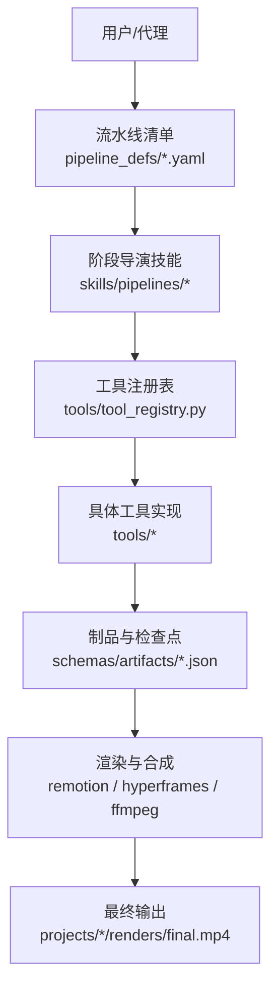
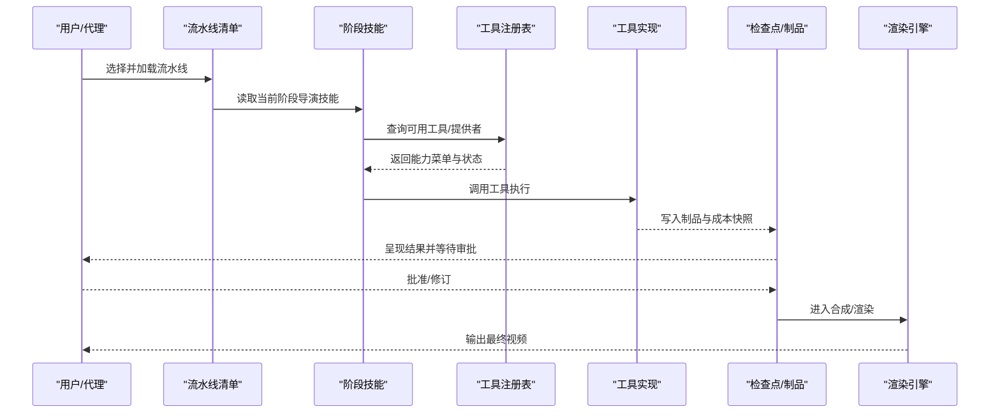
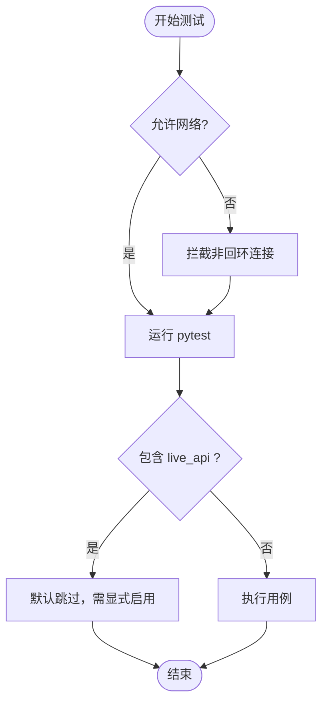
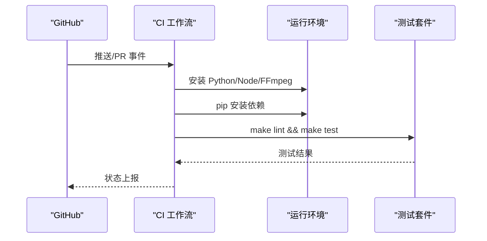
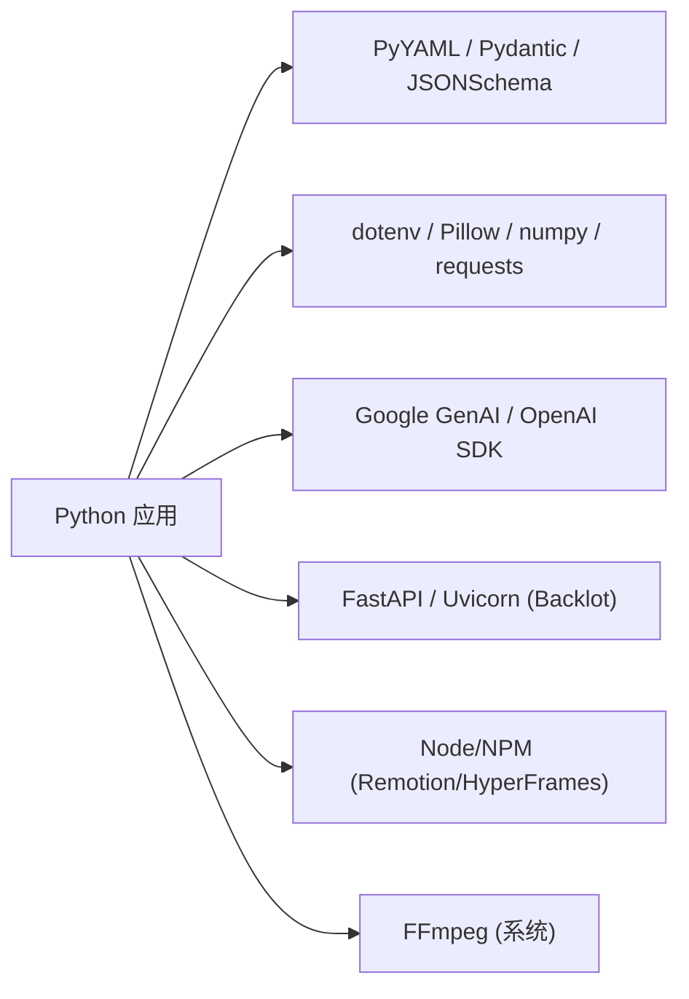

# 贡献指南

<cite>
**本文引用的文件**
- [CONTRIBUTING.md](file://CONTRIBUTING.md)
- [README.md](file://README.md)
- [Makefile](file://Makefile)
- [requirements.txt](file://requirements.txt)
- [requirements-dev.txt](file://requirements-dev.txt)
- [setup.py](file://setup.py)
- [AGENT_GUIDE.md](file://AGENT_GUIDE.md)
- [PROJECT_CONTEXT.md](file://PROJECT_CONTEXT.md)
- [docs/PR_REVIEW_GUIDE.md](file://docs/PR_REVIEW_GUIDE.md)
- [.github/workflows/ci.yml](file://.github/workflows/ci.yml)
- [tests/conftest.py](file://tests/conftest.py)
- [tools/base_tool.py](file://tools/base_tool.py)
</cite>

## 目录
1. [简介](#简介)
2. [项目结构](#项目结构)
3. [核心组件](#核心组件)
4. [架构总览](#架构总览)
5. [详细组件分析](#详细组件分析)
6. [依赖关系分析](#依赖关系分析)
7. [性能与资源考量](#性能与资源考量)
8. [故障排查指南](#故障排查指南)
9. [结论](#结论)
10. [附录](#附录)

## 简介
本指南面向希望为 OpenMontage 贡献代码、文档和技能的开发者。内容涵盖开发环境搭建（Python/Node/FFmpeg）、IDE 与调试建议、测试策略与执行方式、代码规范与风格、新功能开发流程（工具/管道/技能）、文档维护流程、社区参与与行为准则，以及持续集成配置说明。目标是让不同背景的贡献者都能高效、安全地参与协作。

## 项目结构
OpenMontage 采用“指令驱动 + 工具注册”的架构：Python 提供可执行工具与持久化能力，编排、创意决策、审查与阶段流转由 YAML 清单与 Markdown 技能文件驱动。仓库关键目录职责如下：
- tools：生产工具集合（视频、音频、图像、增强、分析、字幕等）
- pipeline_defs：流水线声明式清单（YAML）
- skills：分层的技能与创作知识（按管道、创意、核心、元技能组织）
- schemas：契约校验用的 JSON Schema（制品、流水线、样式、工具）
- styles：视觉风格剧本（YAML）
- remotion-composer：Remotion 渲染引擎前端工程
- lib：核心基础设施（配置、检查点、流水线加载器、媒体规格等）
- tests：合同测试、QA 集成测试、评估脚本
- backlot：本地可视化看板服务
- scripts：辅助脚本（演示、模拟运行、截图等）

图表来源
- [PROJECT_CONTEXT.md:9-57](file://PROJECT_CONTEXT.md#L9-L57)
- [README.md:450-475](file://README.md#L450-L475)

章节来源
- [PROJECT_CONTEXT.md:9-57](file://PROJECT_CONTEXT.md#L9-L57)
- [README.md:450-475](file://README.md#L450-L475)

## 核心组件
- 工具基类与契约：所有工具继承统一基类，提供发现、执行、成本估算、健康状态报告等一致接口。
- 工具注册与选择器：通过注册表自动发现可用工具；能力级选择器（TTS、图像、视频）将请求路由到具体提供者。
- 流水线与阶段：每个流水线由 YAML 清单定义阶段顺序、可用工具、审查焦点、成功标准、是否需人工审批等；每阶段有对应的导演技能指导如何执行。
- 制品与契约：各阶段产出标准化 JSON 制品，受 JSON Schema 约束，确保跨阶段一致性。
- 渲染与合成：根据决策选择 Remotion、HyperFrames 或 FFmpeg 进行合成与编码。
- 检查点与审计：阶段推进使用检查点记录进度、成本快照与决策日志，支持恢复与人类审批门控。

章节来源
- [tools/base_tool.py:1-140](file://tools/base_tool.py#L1-L140)
- [AGENT_GUIDE.md:49-80](file://AGENT_GUIDE.md#L49-L80)
- [PROJECT_CONTEXT.md:43-57](file://PROJECT_CONTEXT.md#L43-L57)
- [README.md:652-686](file://README.md#L652-L686)

## 架构总览
OpenMontage 的控制面是“代理 + 指令”，Python 负责工具与持久化。典型调用链：
- 代理读取流水线清单 → 读取阶段导演技能 → 调用工具 → 自我审查 → 写入检查点 → 呈现给人类审批 → 进入下一阶段。

图表来源
- [AGENT_GUIDE.md:70-80](file://AGENT_GUIDE.md#L70-L80)
- [PROJECT_CONTEXT.md:9-19](file://PROJECT_CONTEXT.md#L9-L19)

## 详细组件分析

### 开发环境与 IDE 配置
- 基础依赖
  - Python 3.10+
  - Node.js 18+（Remotion/HyperFrames 需要）
  - FFmpeg（系统级安装）
- 一键安装
  - 使用 Makefile 提供的 setup 目标完成虚拟环境创建、Python 依赖安装、Remotion composer 安装、离线 TTS（Piper）安装、HyperFrames 缓存预热、.env 初始化。
- 可选 GPU 加速
  - 使用 install-gpu 目标安装 GPU 相关依赖，并在 .env 中启用本地视频生成模型。
- IDE 建议
  - Python：使用 venv/conda 激活环境；在 IDE 中选择对应解释器；开启 py_compile/lint。
  - Node：在 remotion-composer 目录下执行 npm install；确保 npx 可用。
  - 环境变量：从 .env.example 复制为 .env，按需填入 API Key。

章节来源
- [README.md:180-216](file://README.md#L180-L216)
- [Makefile:52-88](file://Makefile#L52-L88)
- [Makefile:100-111](file://Makefile#L100-L111)

### 调试与诊断
- 预检能力菜单：运行 provider_menu_summary 查看已配置/未配置能力、运行时警告与快速设置项。
- HyperFrames 诊断：使用 hyperframes-doctor 检查 Node/FFmpeg/npx/hyperframes 可用性。
- 事件追踪：工具 execute 被包装后向 Backlot 写入 start/error/finish 事件，便于看板实时观察。

章节来源
- [AGENT_GUIDE.md:263-303](file://AGENT_GUIDE.md#L263-L303)
- [Makefile:100-111](file://Makefile#L100-L111)
- [tools/base_tool.py:148-200](file://tools/base_tool.py#L148-L200)

### 测试策略与用例编写规范
- 测试类型
  - 合同测试：校验流水线清单、制品 Schema、工具契约等。
  - 工具测试：针对具体工具的输入/输出、错误路径、边界条件。
  - QA 集成测试：对工具输出进行质量验证。
  - 端到端测试：完整流水线或关键路径的回归验证。
- 网络隔离
  - 默认禁止测试中发起非回环网络请求，避免意外产生费用；如需真实 API 调用，需显式标记并通过环境变量启用。
- 执行命令
  - 全部测试：make test
  - 仅合同测试：make test-contracts
  - 自定义运行：pytest tests/... 配合 -m 标记筛选

图表来源
- [tests/conftest.py:1-27](file://tests/conftest.py#L1-L27)
- [tests/conftest.py:81-132](file://tests/conftest.py#L81-L132)

章节来源
- [Makefile:90-96](file://Makefile#L90-L96)
- [tests/conftest.py:1-27](file://tests/conftest.py#L1-L27)
- [tests/conftest.py:81-132](file://tests/conftest.py#L81-L132)

### 代码规范与风格指南
- Python
  - 所有工具必须继承 BaseTool，遵循统一的 ToolContract（name/version/tier/capability/provider/runtime/stability/dependencies/install_instructions/input_schema/output_schema/supports/best_for/not_good_for/resource_profile/retry_policy/fallback/fallback_tools/agent_skills/user_visible_verification/estimate_cost/estimate_runtime/execute）。
  - 工具命名约定：类名 PascalCase 且不带 “Tool” 后缀。
  - 工具调用统一通过 .execute(params_dict)，返回 ToolResult。
- TypeScript/JavaScript（Remotion 前端）
  - 保持 LF 行尾（.gitattributes），避免跨平台差异。
  - 遵循现有组件结构与类型定义，新增场景类型需配套契约与测试。
- 文档
  - 更新 README、docs、技能文件时，需与实际行为保持一致；变更应附带测试或验证步骤。
  - 提供清晰的安装、配置、限制说明，区分免费/付费、本地/云端、在线/离线。

章节来源
- [tools/base_tool.py:63-140](file://tools/base_tool.py#L63-L140)
- [AGENT_GUIDE.md:485-500](file://AGENT_GUIDE.md#L485-L500)
- [.gitattributes:1-51](file://.gitattributes#L1-L51)

### 新功能开发指南
- 新增工具
  - 在合适的 tools 子目录创建 Python 文件，继承 BaseTool，实现 execute 并填写契约字段。
  - 通过注册表自动发现，无需手动注册；必要时添加 JSON Schema 描述 I/O。
  - 若需要提示技巧，关联 Layer 3 技能文件。
- 新增流水线
  - 在 pipeline_defs 下创建 YAML 清单，定义阶段、技能、工具、审查焦点、成功标准、是否需人工审批等。
  - 在 skills/pipelines/<pipeline> 下创建各阶段导演技能。
  - 添加合同测试覆盖清单与制品 Schema。
- 新增技能
  - 在 skills 下按类别组织；Layer 3 技能放在 .agents/skills 下，供工具 agent_skills 字段引用。

章节来源
- [README.md:707-724](file://README.md#L707-L724)
- [PROJECT_CONTEXT.md:106-126](file://PROJECT_CONTEXT.md#L106-L126)
- [AGENT_GUIDE.md:429-512](file://AGENT_GUIDE.md#L429-L512)

### 文档更新与维护流程
- 同步原则
  - 任何影响用户可见行为的变更（提供者、安装说明、能力菜单、渲染路径、成本/配额）都应同步更新 docs/PROVIDERS.md、README 与相关技能文件。
- 审查要点
  - 文档不得夸大能力或承诺无法保证的行为；明确限制与前提条件。
  - 变更需与实现一致，并提供复现或验证方法。

章节来源
- [docs/PR_REVIEW_GUIDE.md:292-305](file://docs/PR_REVIEW_GUIDE.md#L292-L305)
- [README.md:707-724](file://README.md#L707-L724)

### 社区参与与行为准则
- 贡献许可
  - 无需 CLA 或额外协议；提交 PR 即确认有权贡献，且贡献以 AGPLv3 许可发布。
- 沟通渠道
  - 使用 GitHub Discussions 分享作品、提出想法、提问；Issues 用于缺陷与功能请求。
- 行为准则
  - 保持专注、尊重、透明；避免无关噪音；关注安全、隐私与供应链风险。

章节来源
- [CONTRIBUTING.md:1-8](file://CONTRIBUTING.md#L1-L8)
- [README.md:726-743](file://README.md#L726-L743)

### 持续集成与自动化测试
- CI 触发
  - 对 main 分支 push 与 pull_request 事件触发。
- 作业内容
  - 安装 Python 与系统依赖（ffmpeg），安装开发依赖，运行 lint 冒烟检查与测试套件。
- 并发控制
  - 使用 concurrency 组取消进行中任务，减少队列拥堵。

图表来源
- [.github/workflows/ci.yml:1-47](file://.github/workflows/ci.yml#L1-L47)

章节来源
- [.github/workflows/ci.yml:1-47](file://.github/workflows/ci.yml#L1-L47)

## 依赖关系分析
- 运行时依赖
  - Python：pyyaml、pydantic、jsonschema、python-dotenv、Pillow、numpy、requests、google-auth、google-genai、openai 等。
  - Node：Remotion/HyperFrames 通过 npm/npx 管理。
  - 系统：FFmpeg。
- 包管理与安装
  - requirements.txt 定义核心依赖；requirements-dev.txt 扩展测试依赖；setup.py 声明包元数据与最小依赖集。
- 版本与兼容性
  - Python >= 3.10；Node >= 18（Remotion）/ >= 22（HyperFrames）；FFmpeg 为必需系统组件。

图表来源
- [requirements.txt:1-17](file://requirements.txt#L1-L17)
- [requirements-dev.txt:1-6](file://requirements-dev.txt#L1-L6)
- [setup.py:1-20](file://setup.py#L1-L20)

章节来源
- [requirements.txt:1-17](file://requirements.txt#L1-L17)
- [requirements-dev.txt:1-6](file://requirements-dev.txt#L1-L6)
- [setup.py:1-20](file://setup.py#L1-L20)

## 性能与资源考量
- 渲染引擎选择
  - Remotion：适合数据驱动的动画与模板化场景；HyperFrames：适合 HTML/CSS/GSAP 驱动的动效与品牌素材；FFmpeg：用于剪辑、拼接、字幕烧录与编码。
- 资源预估
  - 工具声明 resource_profile（CPU/RAM/VRAM/Disk/Network），结合 estimate_cost/estimate_runtime 进行预算治理。
- 本地与云端
  - 优先利用本地免费能力（如 Piper TTS、FFmpeg），必要时再调用云端 API；注意模型下载与缓存行为。
- 性能优化建议
  - 复用模型与运行时状态；避免重复下载；合理采样与批处理；使用缓存（npx 缓存、模型缓存）。

章节来源
- [README.md:607-617](file://README.md#L607-L617)
- [tools/base_tool.py:110-140](file://tools/base_tool.py#L110-L140)
- [Makefile:64-68](file://Makefile#L64-L68)

## 故障排查指南
- 常见环境问题
  - Python 版本不匹配：确保 3.10+；使用 ensure-venv 目标检测并创建环境。
  - Node/FFmpeg 缺失：安装 Node 与 FFmpeg；使用 hyperframes-doctor 诊断。
  - API Key 未配置：从 .env.example 复制为 .env 并填写密钥；可通过 provider_menu_summary 查看哪些能力已解锁。
- 测试失败
  - 网络阻断：默认禁止非回环网络；如需真实 API，设置 OPENMONTAGE_ALLOW_NETWORK=1 并显式标记 live_api。
  - 依赖缺失：重新安装依赖；清理 __pycache__ 与 pyc 文件。
- 渲染失败
  - 检查 render_runtime 决策与可用性；确认 Remotion/HyperFrames/FFmpeg 就绪；查看渲染报告与 ffprobe 输出。

章节来源
- [Makefile:13-48](file://Makefile#L13-L48)
- [Makefile:100-111](file://Makefile#L100-L111)
- [tests/conftest.py:1-27](file://tests/conftest.py#L1-L27)
- [tests/conftest.py:81-132](file://tests/conftest.py#L81-L132)

## 结论
OpenMontage 以“指令驱动 + 工具注册”为核心，强调可审计、可恢复、可组合的视频生产流水线。贡献者应遵循契约与技能体系，围绕工具、流水线与技能进行扩展，并通过测试与文档保障质量与可维护性。借助 CI 与本地诊断工具，可以高效定位问题并持续改进。

## 附录
- 快速命令参考
  - 安装与准备：make setup / make install / make install-gpu
  - 测试：make test / make test-contracts
  - 诊断：make hyperframes-doctor / python -c "from tools.tool_registry import registry; ... provider_menu_summary()"
  - 演示：make demo / make demo-list
- 常用路径
  - 流水线清单：pipeline_defs/*.yaml
  - 阶段技能：skills/pipelines/<pipeline>/<stage>-director.md
  - 制品 Schema：schemas/artifacts/*.json
  - 风格剧本：styles/*.yaml
  - 工具实现：tools/*
  - 测试：tests/*

章节来源
- [Makefile:52-127](file://Makefile#L52-L127)
- [PROJECT_CONTEXT.md:59-87](file://PROJECT_CONTEXT.md#L59-L87)
- [README.md:746-755](file://README.md#L746-L755)