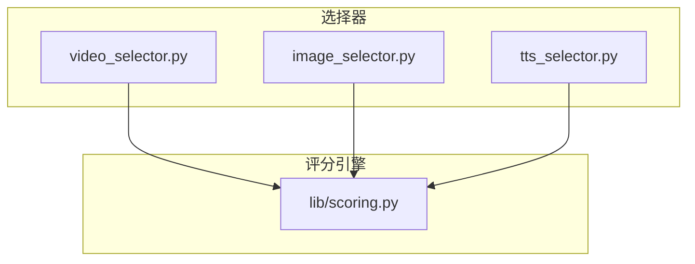
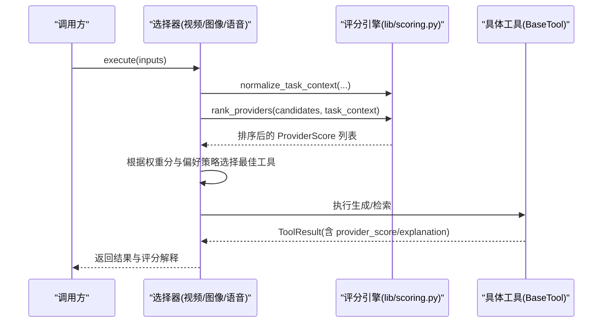
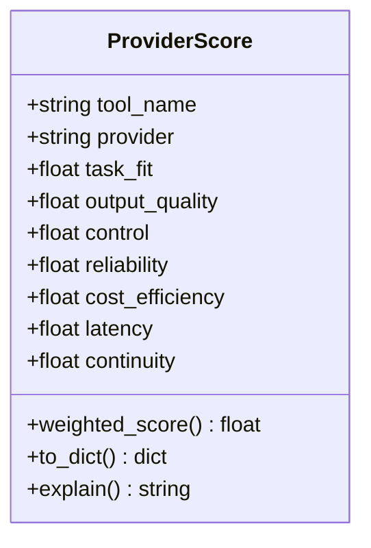
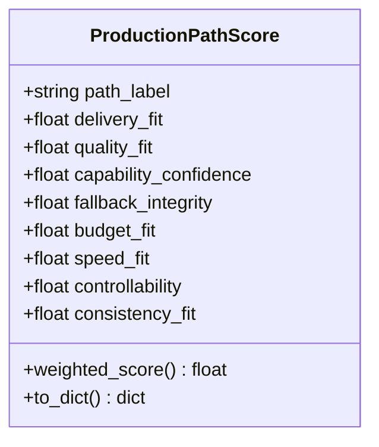
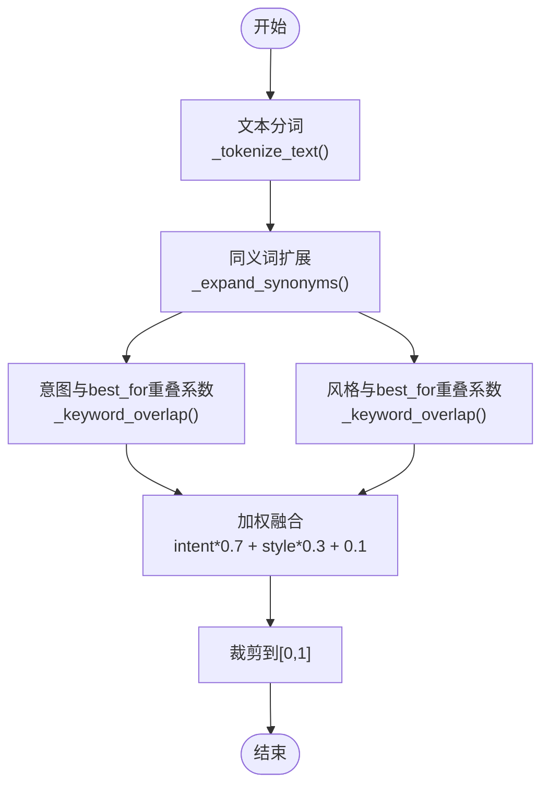
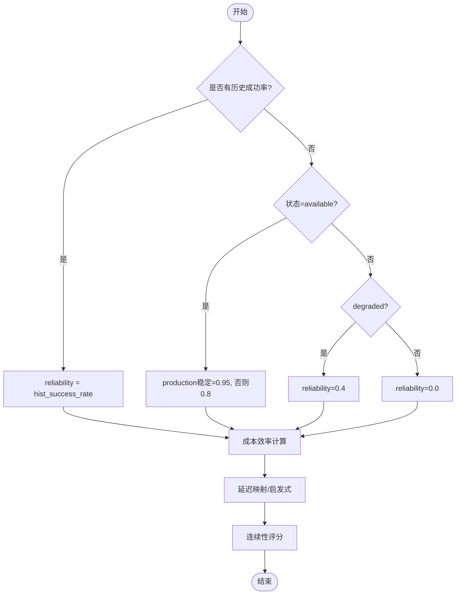
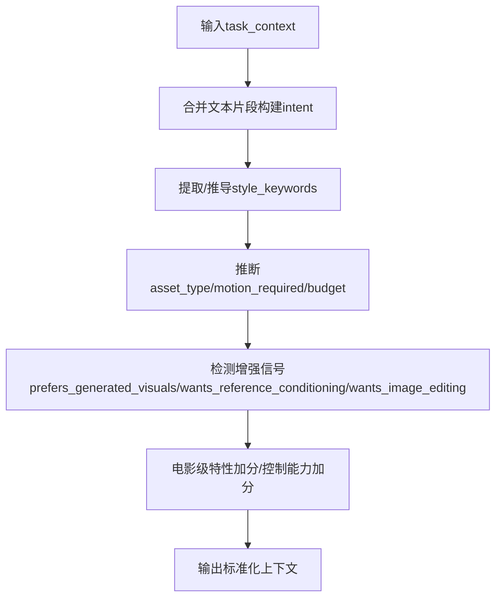
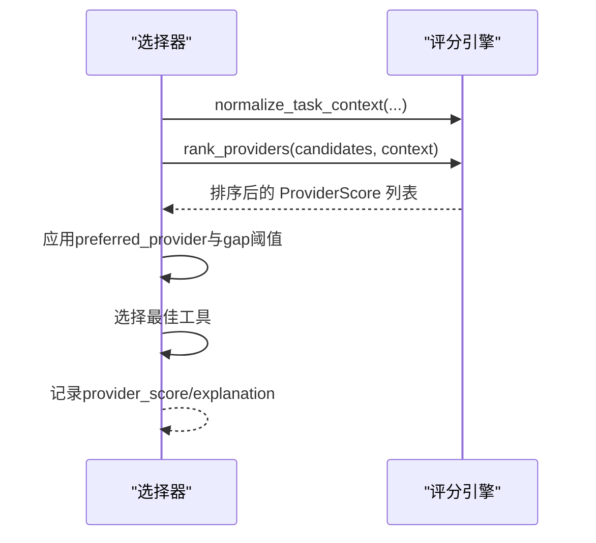
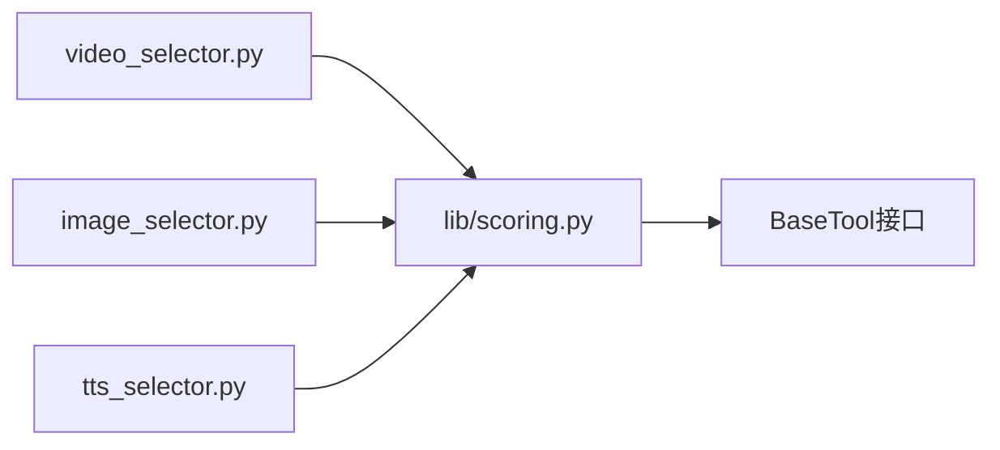

# 评分系统

<cite>
**本文引用的文件**
- [lib/scoring.py](file://lib/scoring.py)
- [tools/video/video_selector.py](file://tools/video/video_selector.py)
- [tools/graphics/image_selector.py](file://tools/graphics/image_selector.py)
- [tools/audio/tts_selector.py](file://tools/audio/tts_selector.py)
- [tests/tools/test_scoring.py](file://tests/tools/test_scoring.py)
- [README.md](file://README.md)
</cite>

## 目录
1. [简介](#简介)
2. [项目结构](#项目结构)
3. [核心组件](#核心组件)
4. [架构总览](#架构总览)
5. [详细组件分析](#详细组件分析)
6. [依赖关系分析](#依赖关系分析)
7. [性能考量](#性能考量)
8. [故障排查指南](#故障排查指南)
9. [结论](#结论)
10. [附录](#附录)

## 简介
本技术文档聚焦 OpenMontage 的评分系统，系统性解释多维度评分算法的实现原理与使用方式。评分系统为每个提供商（Provider）和整条生产路径（Production Path）提供可解释、可审计的多维打分，覆盖任务匹配度、输出质量、控制能力、可靠性、成本效率、延迟、连续性等维度，并通过加权汇总得到最终得分，驱动提供商选择与管道评估决策。

## 项目结构
评分系统的核心实现位于 lib/scoring.py，被视频、图像、语音等多类工具的选择器统一调用；选择器负责将输入上下文标准化后交给评分引擎进行排序与选择，并在执行结果中附带评分解释与备选方案信息。

图表来源
- [tools/video/video_selector.py:300-499](file://tools/video/video_selector.py#L300-L499)
- [tools/graphics/image_selector.py:218-241](file://tools/graphics/image_selector.py#L218-L241)
- [tools/audio/tts_selector.py:272-298](file://tools/audio/tts_selector.py#L272-L298)
- [lib/scoring.py:1-557](file://lib/scoring.py#L1-L557)

章节来源
- [lib/scoring.py:1-557](file://lib/scoring.py#L1-L557)
- [tools/video/video_selector.py:300-499](file://tools/video/video_selector.py#L300-L499)
- [tools/graphics/image_selector.py:218-241](file://tools/graphics/image_selector.py#L218-L241)
- [tools/audio/tts_selector.py:272-298](file://tools/audio/tts_selector.py#L272-L298)

## 核心组件
- ProviderScore：对单个提供商在特定任务上下文下的多维评分与加权总分，支持解释与序列化。
- ProductionPathScore：对整条生产路径的综合评分，用于管道级评估与比较。
- 评分函数族：关键词重叠、同义词扩展、语义匹配、控制能力、成本效率、延迟、连续性等计算逻辑。
- 上下文归一化：normalize_task_context，将松散的意图、风格、平台等信息归一化为评分器期望的结构。
- 排名与格式化：rank_providers、format_ranking，输出按加权分数降序排列的结果及可读文本。

章节来源
- [lib/scoring.py:21-107](file://lib/scoring.py#L21-L107)
- [lib/scoring.py:114-232](file://lib/scoring.py#L114-L232)
- [lib/scoring.py:234-295](file://lib/scoring.py#L234-L295)
- [lib/scoring.py:297-359](file://lib/scoring.py#L297-L359)
- [lib/scoring.py:373-543](file://lib/scoring.py#L373-L543)
- [lib/scoring.py:545-557](file://lib/scoring.py#L545-L557)

## 架构总览
评分系统通过“选择器 -> 评分引擎”的解耦设计，使不同媒体类型（视频、图像、音频）共享同一套评分规则，同时允许各选择器注入领域特定的上下文与约束。

图表来源
- [tools/video/video_selector.py:300-499](file://tools/video/video_selector.py#L300-L499)
- [tools/graphics/image_selector.py:218-241](file://tools/graphics/image_selector.py#L218-L241)
- [tools/audio/tts_selector.py:272-298](file://tools/audio/tts_selector.py#L272-L298)
- [lib/scoring.py:297-543](file://lib/scoring.py#L297-L543)

## 详细组件分析

### ProviderScore 数据模型与加权机制
- 字段定义：包含 tool_name、provider 以及七个评分维度（任务匹配度、输出质量、控制能力、可靠性、成本效率、延迟、连续性），取值范围均为 0-1。
- 加权总分：按固定权重线性加权，突出任务匹配度（30%）、输出质量（20%）、控制能力（15%）、可靠性（15%），其余维度依次递减。
- 解释与序列化：提供 explain() 输出人类可读的说明，to_dict() 输出结构化字典便于日志与可视化。

图表来源
- [lib/scoring.py:21-70](file://lib/scoring.py#L21-L70)

章节来源
- [lib/scoring.py:21-70](file://lib/scoring.py#L21-L70)

### ProductionPathScore 数据模型与加权机制
- 字段定义：涵盖交付适配性、质量适配性、能力置信度、回退完整性、预算适配性、速度适配性、可控性、一致性适配性等八个维度。
- 加权总分：按固定权重线性加权，强调交付适配性（25%）、质量适配性（20%）、能力置信度（15%）。
- 用途：用于整条生产路径的横向对比与择优。

图表来源
- [lib/scoring.py:77-107](file://lib/scoring.py#L77-L107)

章节来源
- [lib/scoring.py:77-107](file://lib/scoring.py#L77-L107)

### 关键词重叠、同义词扩展与语义匹配
- 关键词重叠：采用重叠系数 |A ∩ B| / min(|A|, |B|)，避免 Jaccard 对宽泛描述的不利惩罚，更贴合“意图是否被工具能力覆盖”的评估目标。
- 同义词扩展：内置多组同义簇（如 cinematic/film/movie 等），当任一词出现时自动扩展整簇，提升语义匹配鲁棒性。
- 语义匹配：结合意图与风格关键词，分别计算与工具 best_for 的重叠度并加权融合，辅以基础偏移保证未知能力的合理基线。
- 文本分词：基于正则提取字母数字片段，忽略标点干扰，确保“cinematic.”与“cinematic”等价。

图表来源
- [lib/scoring.py:114-131](file://lib/scoring.py#L114-L131)
- [lib/scoring.py:134-202](file://lib/scoring.py#L134-L202)
- [lib/scoring.py:205-232](file://lib/scoring.py#L205-L232)

章节来源
- [lib/scoring.py:114-232](file://lib/scoring.py#L114-L232)
- [tests/tools/test_scoring.py:35-47](file://tests/tools/test_scoring.py#L35-L47)

### 控制能力、成本效率、延迟、连续性计算
- 控制能力：依据 supports 字典中的特性存在与否，赋予不同创意影响权重（如 controlnet、reference_image 更高），归一化后得到 0-1 分数。
- 成本效率：考虑估计成本与剩余预算，免费或远低于预算时高分，超预算则零分；无预算信息时使用绝对成本启发式。
- 延迟：优先使用历史 p50 延迟映射到 0-1 分段评分；否则按运行时类型（本地/混合/API）给出启发式分数。
- 连续性：若已锁定提供商集合非空，则相同提供商高分、不同提供商较低分，以维持风格一致性。

图表来源
- [lib/scoring.py:234-295](file://lib/scoring.py#L234-L295)
- [lib/scoring.py:400-451](file://lib/scoring.py#L400-L451)

章节来源
- [lib/scoring.py:234-295](file://lib/scoring.py#L234-L295)
- [lib/scoring.py:400-451](file://lib/scoring.py#L400-L451)

### 任务上下文归一化与增强信号
- 归一化：合并 intent/style/brief/goal/platform/needs/prompt 等文本片段，构造统一的 intent 与 style_keywords；推断 asset_type、motion_required、budget_remaining_usd 等关键键。
- 增强信号：识别“偏好生成视觉”“需要参考条件”“需要图像编辑”等信号，据此对任务匹配度与控制能力加分或惩罚。
- 电影级奖励：当视频任务带有 cinematic/trailer 等信号且提供商具备多项高级特性（原生音频、多镜头、摄影机控制、口型同步、电影级质量）时，给予额外加分。

图表来源
- [lib/scoring.py:297-359](file://lib/scoring.py#L297-L359)
- [lib/scoring.py:477-519](file://lib/scoring.py#L477-L519)

章节来源
- [lib/scoring.py:297-359](file://lib/scoring.py#L297-L359)
- [lib/scoring.py:477-519](file://lib/scoring.py#L477-L519)

### 提供商选择流程与配置选项
- 选择流程：选择器收集候选工具，调用 normalize_task_context 与 rank_providers，得到按 weighted_score 降序的 ProviderScore 列表；再结合 preferred_provider 与 gap 阈值决定是否尊重用户偏好。
- 配置选项：
  - preferred_provider：指定首选提供商（默认 auto）。
  - preferred_provider_gap：允许的首选提供商与最高分的差距阈值（可调）。
  - allowed_providers：限制候选提供商集合。
  - model：精确模型过滤。
  - operation/target_operation：操作模式（如 text_to_video、image_to_video、rank）。
- 结果输出：执行结果中包含 selected_tool、selected_provider、selection_reason、provider_score、alternatives_considered、fallback_tools 等字段，便于审计与可视化。

图表来源
- [tools/video/video_selector.py:300-499](file://tools/video/video_selector.py#L300-L499)
- [tools/graphics/image_selector.py:218-241](file://tools/graphics/image_selector.py#L218-L241)
- [tools/audio/tts_selector.py:272-298](file://tools/audio/tts_selector.py#L272-L298)

章节来源
- [tools/video/video_selector.py:300-499](file://tools/video/video_selector.py#L300-L499)
- [tools/graphics/image_selector.py:218-241](file://tools/graphics/image_selector.py#L218-L241)
- [tools/audio/tts_selector.py:272-298](file://tools/audio/tts_selector.py#L272-L298)

### 评分结果的解释格式与可视化方法
- 解释文本：ProviderScore.explain() 输出工具名、提供商与加权总分，并列出贡献最大的三个维度及其权重。
- 结构化输出：ProviderScore.to_dict() 提供完整字段与 weighted_score，便于写入日志、数据库或前端展示。
- 排名格式化：format_ranking() 生成前 N 名的可读文本，适合控制台或报告展示。
- 选择器集成：选择器在执行结果中附加 provider_score 与 explanation，并可输出 alternatives_considered 与 fallback_tools，便于构建可视化面板。

章节来源
- [lib/scoring.py:52-70](file://lib/scoring.py#L52-L70)
- [lib/scoring.py:104-107](file://lib/scoring.py#L104-L107)
- [lib/scoring.py:545-557](file://lib/scoring.py#L545-L557)
- [tools/video/video_selector.py:352-366](file://tools/video/video_selector.py#L352-L366)

## 依赖关系分析
- 选择器依赖评分引擎：视频、图像、语音选择器均导入并使用 lib.scoring 的 rank_providers、normalize_task_context 等接口。
- 评分引擎内部耦合：ProviderScore 与 ProductionPathScore 作为核心数据结构；评分函数之间通过参数传递与组合形成流水线。
- 外部依赖：BaseTool 的 get_info/get_status/estimate_cost 等接口为评分提供运行时与能力信息。

图表来源
- [tools/video/video_selector.py:300-499](file://tools/video/video_selector.py#L300-L499)
- [tools/graphics/image_selector.py:218-241](file://tools/graphics/image_selector.py#L218-L241)
- [tools/audio/tts_selector.py:272-298](file://tools/audio/tts_selector.py#L272-L298)
- [lib/scoring.py:373-543](file://lib/scoring.py#L373-L543)

章节来源
- [lib/scoring.py:373-543](file://lib/scoring.py#L373-L543)

## 性能考量
- 文本处理开销：分词与同义词扩展为轻量操作，复杂度与词数线性相关；建议批量处理以减少重复计算。
- 评分函数分支：控制能力、成本效率、延迟等计算为常数时间分支，整体评分复杂度 O(N)（N 为候选工具数）。
- 缓存建议：对于频繁调用的任务上下文，可对归一化结果与部分中间特征做缓存，避免重复计算。
- 资源占用：评分过程不涉及重型模型推理，主要 CPU 开销来自字符串处理与字典查找。

## 故障排查指南
- 令牌化异常：确保意图与风格文本包含有效字母数字片段；测试用例验证了标点剥离与版本号保留。
- 电影级奖励未生效：检查 intent/style_keywords 是否包含 cinematic/trailer 等信号，并确保提供商 supports 具备至少三项高级特性。
- 成本效率为零：确认 estimated_cost 与 budget_remaining_usd 传入正确；超预算会直接得零分。
- 偏好提供商未选择：检查 preferred_provider_gap 阈值是否过窄；若首选提供商分数低于最高分超过阈值，将被拒绝。
- 选择器返回空结果：确认 candidates 过滤逻辑（allowed_providers、model、operation）是否正确；必要时启用 rank 模式查看排序结果。

章节来源
- [tests/tools/test_scoring.py:35-47](file://tests/tools/test_scoring.py#L35-L47)
- [tools/video/video_selector.py:413-440](file://tools/video/video_selector.py#L413-L440)
- [lib/scoring.py:259-282](file://lib/scoring.py#L259-L282)
- [lib/scoring.py:500-519](file://lib/scoring.py#L500-L519)

## 结论
OpenMontage 的评分系统通过严谨的多维打分与可解释的加权机制，实现了从“可用即选”到“最优选择”的转变。其关键词重叠、同义词扩展与语义匹配增强了意图理解能力；控制能力、成本效率、延迟、连续性等维度覆盖了实际生产中的关键约束。选择器与评分引擎的解耦设计使得系统具备良好的可扩展性与可维护性，并为审计与可视化提供了丰富数据。

## 附录

### 使用示例（代码片段路径）
- 视频提供商选择与评分：
  - [tools/video/video_selector.py:300-499](file://tools/video/video_selector.py#L300-L499)
- 图像提供商选择与评分：
  - [tools/graphics/image_selector.py:218-241](file://tools/graphics/image_selector.py#L218-L241)
- 语音提供商选择与评分：
  - [tools/audio/tts_selector.py:272-298](file://tools/audio/tts_selector.py#L272-L298)
- 评分引擎核心接口：
  - [lib/scoring.py:297-543](file://lib/scoring.py#L297-L543)
- 单元测试与断言：
  - [tests/tools/test_scoring.py:35-47](file://tests/tools/test_scoring.py#L35-L47)

### 配置与调优指南
- 调整权重：如需改变维度重要性，可在 ProviderScore.weighted_score 与 ProductionPathScore.weighted_score 中修改权重分配，但需评估对排序的影响。
- 自定义同义词簇：在 _SYNONYM_CLUSTERS 中添加领域术语簇，以提升语义匹配精度。
- 控制能力权重：在 _compute_control 中调整 features 与 weights，反映业务对控制特性的重视程度。
- 成本效率阈值：在 _compute_cost_efficiency 中调整 ratio 阈值与分数映射，适应不同预算策略。
- 延迟映射：在 score_provider 中调整 measured_p50 的分段阈值，匹配实际服务 SLA。
- 偏好选择策略：在视频选择器中调整 preferred_provider_gap，平衡用户偏好与全局最优。

章节来源
- [lib/scoring.py:36-45](file://lib/scoring.py#L36-L45)
- [lib/scoring.py:92-102](file://lib/scoring.py#L92-L102)
- [lib/scoring.py:134-148](file://lib/scoring.py#L134-L148)
- [lib/scoring.py:241-256](file://lib/scoring.py#L241-L256)
- [lib/scoring.py:259-282](file://lib/scoring.py#L259-L282)
- [lib/scoring.py:424-445](file://lib/scoring.py#L424-L445)
- [tools/video/video_selector.py:413-440](file://tools/video/video_selector.py#L413-L440)

### 评分结果解释与可视化
- 解释文本：使用 ProviderScore.explain() 获取人类可读说明。
- 结构化数据：使用 ProviderScore.to_dict() 获取 JSON 结构，便于前端渲染。
- 排名展示：使用 format_ranking() 输出前 N 名结果。
- 选择器输出：在 ToolResult.data 中读取 provider_score、explanation、alternatives_considered、fallback_tools 等字段，构建可视化面板。

章节来源
- [lib/scoring.py:52-70](file://lib/scoring.py#L52-L70)
- [lib/scoring.py:104-107](file://lib/scoring.py#L104-L107)
- [lib/scoring.py:545-557](file://lib/scoring.py#L545-L557)
- [tools/video/video_selector.py:352-366](file://tools/video/video_selector.py#L352-L366)