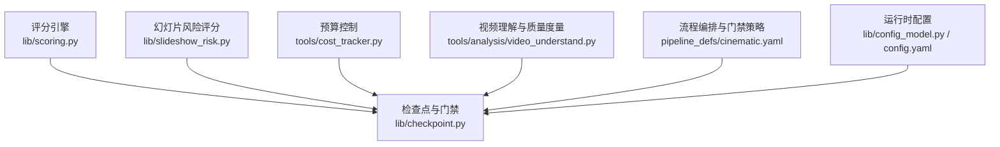
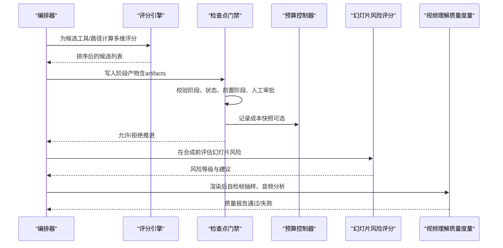
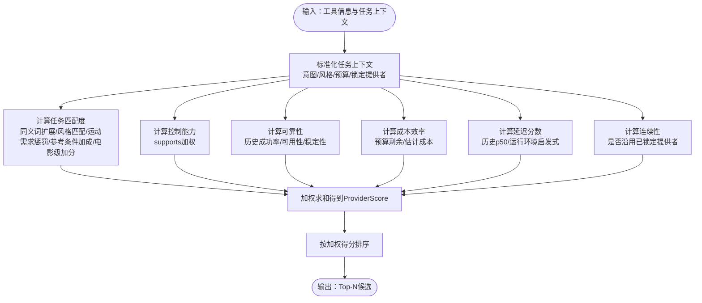
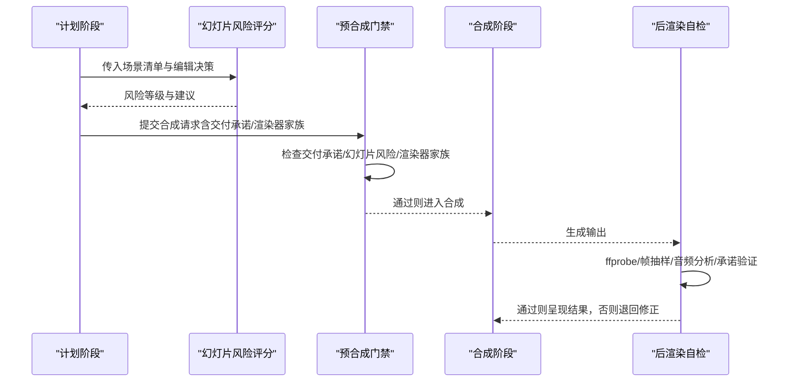
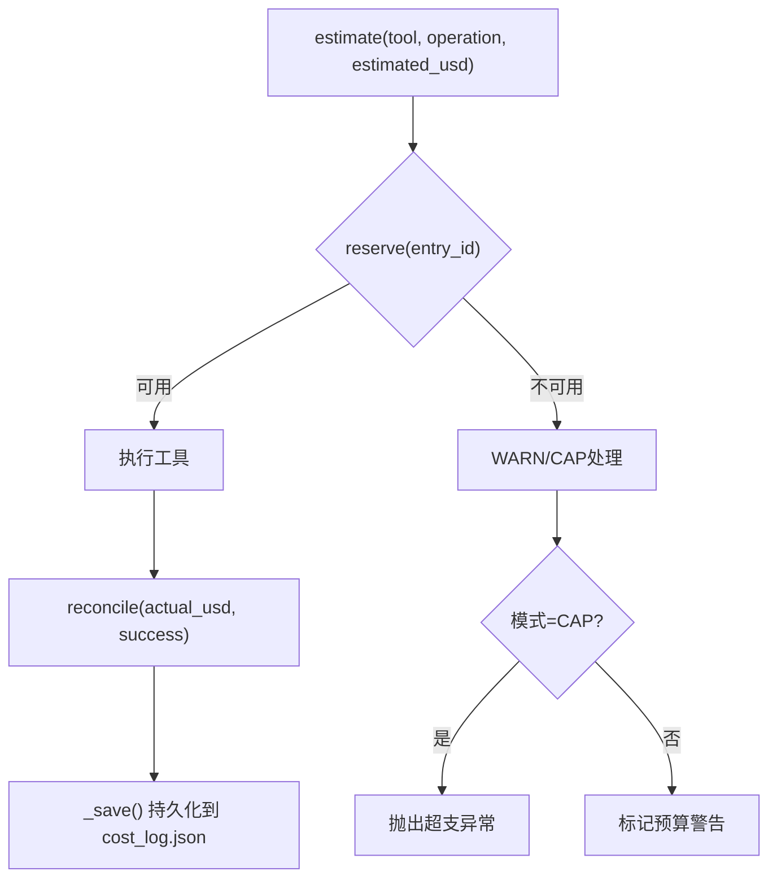
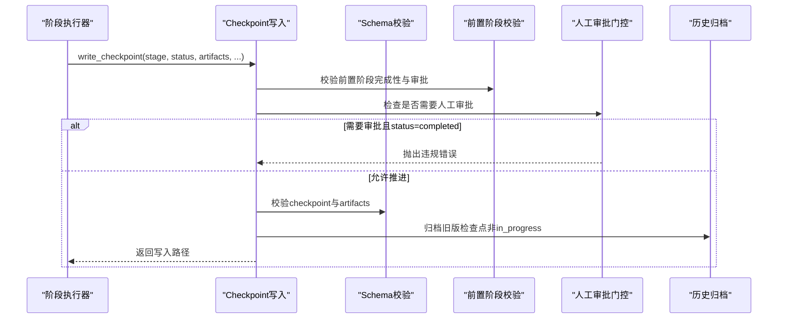
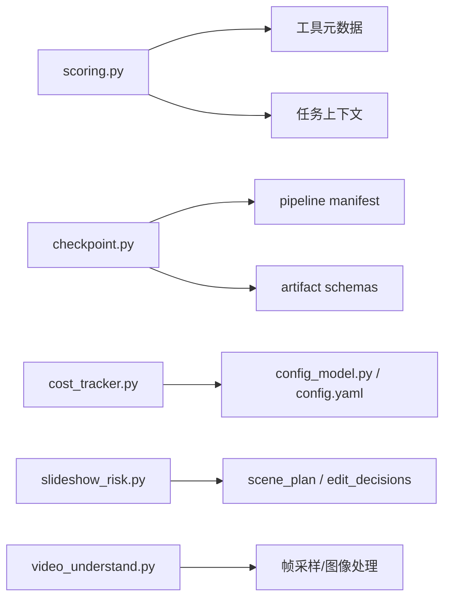

# 质量治理

<cite>
**本文引用的文件**
- [scoring.py](file://lib/scoring.py)
- [checkpoint.py](file://lib/checkpoint.py)
- [slideshow_risk.py](file://lib/slideshow_risk.py)
- [cost_tracker.py](file://tools/cost_tracker.py)
- [config_model.py](file://lib/config_model.py)
- [config.yaml](file://config.yaml)
- [cinematic.yaml](file://pipeline_defs/cinematic.yaml)
- [video_understand.py](file://tools/analysis/video_understand.py)
- [README.md](file://README.md)
- [checkpoint-protocol.md](file://skills/meta/checkpoint-protocol.md)
</cite>

## 目录
1. [简介](#简介)
2. [项目结构](#项目结构)
3. [核心组件](#核心组件)
4. [架构总览](#架构总览)
5. [详细组件分析](#详细组件分析)
6. [依赖关系分析](#依赖关系分析)
7. [性能考量](#性能考量)
8. [故障排查指南](#故障排查指南)
9. [结论](#结论)
10. [附录：配置与调优](#附录配置与调优)

## 简介
本技术文档聚焦 OpenMontage 的质量治理体系，覆盖以下关键能力：
- 多维度评分算法（任务匹配度、输出质量、控制能力、可靠性、成本效率、延迟、连续性）的计算方法与权重分配。
- 质量门禁机制：预合成验证、后渲染自检、幻灯片风险评估等。
- 预算控制系统：成本估算、预算预留、实际支出追踪与模式控制。
- 检查点协议：状态持久化、版本管理、审计追踪与人工审批门控。
- 质量指标量化方法与评估标准。
- 质量问题的自动检测与修复策略。
- 完整配置指南与调优建议。

## 项目结构
OpenMontage 将质量治理相关能力分布在多个模块中：
- 评分引擎：lib/scoring.py
- 检查点与门禁：lib/checkpoint.py
- 幻灯片风险评分：lib/slideshow_risk.py
- 预算控制：tools/cost_tracker.py
- 运行时配置：lib/config_model.py, config.yaml
- 视频理解与质量度量：tools/analysis/video_understand.py
- 流程编排与门禁策略：pipeline_defs/*.yaml（以 cinematic.yaml 为例）
- 用户文档与协议说明：README.md, skills/meta/checkpoint-protocol.md

图表来源
- [scoring.py:1-557](file://lib/scoring.py#L1-L557)
- [checkpoint.py:1-634](file://lib/checkpoint.py#L1-L634)
- [slideshow_risk.py:1-256](file://lib/slideshow_risk.py#L1-L256)
- [cost_tracker.py:1-524](file://tools/cost_tracker.py#L1-L524)
- [config_model.py:1-93](file://lib/config_model.py#L1-L93)
- [config.yaml:1-34](file://config.yaml#L1-L34)
- [cinematic.yaml:1-288](file://pipeline_defs/cinematic.yaml#L1-L288)

章节来源
- [scoring.py:1-557](file://lib/scoring.py#L1-L557)
- [checkpoint.py:1-634](file://lib/checkpoint.py#L1-L634)
- [slideshow_risk.py:1-256](file://lib/slideshow_risk.py#L1-L256)
- [cost_tracker.py:1-524](file://tools/cost_tracker.py#L1-L524)
- [config_model.py:1-93](file://lib/config_model.py#L1-L93)
- [config.yaml:1-34](file://config.yaml#L1-L34)
- [cinematic.yaml:1-288](file://pipeline_defs/cinematic.yaml#L1-L288)

## 核心组件
- 多维度评分器：对每个候选工具/生产路径进行加权评分，支持语义同义词扩展、风格关键词匹配、运动需求惩罚、参考条件增强、电影级特性加分等。
- 检查点协议：阶段产物校验、前置阶段完成性校验、人工审批门控、历史归档与决策日志合并。
- 幻灯片风险评分：从重复、装饰性视觉、弱运动、弱镜头意图、排版过度依赖、未支持的“电影级”声明六个维度评估产出是否像“动画PPT”。
- 预算控制：估算、预留、批准阈值、超支模式（观察/警告/封顶）、实际支出对账与持久化。
- 视频理解质量度量：基于帧采样与图像指标（模糊、亮度、对比度）进行快速质量评估，作为后渲染自检的一部分。

章节来源
- [scoring.py:1-557](file://lib/scoring.py#L1-L557)
- [checkpoint.py:1-634](file://lib/checkpoint.py#L1-L634)
- [slideshow_risk.py:1-256](file://lib/slideshow_risk.py#L1-L256)
- [cost_tracker.py:1-524](file://tools/cost_tracker.py#L1-L524)
- [video_understand.py:331-392](file://tools/analysis/video_understand.py#L331-L392)

## 架构总览
质量治理贯穿“计划—资产—编辑—合成—发布”全流程，通过检查点与门禁在关键节点拦截问题，并通过评分与预算控制优化资源使用。

图表来源
- [scoring.py:373-542](file://lib/scoring.py#L373-L542)
- [checkpoint.py:422-564](file://lib/checkpoint.py#L422-L564)
- [slideshow_risk.py:26-87](file://lib/slideshow_risk.py#L26-L87)
- [cost_tracker.py:101-179](file://tools/cost_tracker.py#L101-L179)
- [video_understand.py:343-388](file://tools/analysis/video_understand.py#L343-L388)

## 详细组件分析

### 多维度评分算法
- 七维评分与权重
  - 任务匹配度（task_fit）权重 0.30
  - 输出质量（output_quality）权重 0.20
  - 控制能力（control）权重 0.15
  - 可靠性（reliability）权重 0.15
  - 成本效率（cost_efficiency）权重 0.10
  - 延迟（latency）权重 0.05
  - 连续性（continuity）权重 0.05
- 计算方法要点
  - 任务匹配度：基于 best_for 与意图/风格的语义重叠，支持同义词簇扩展；对“需要运动但仅图像能力”的任务施加重罚；对“参考条件/图像编辑”场景提供加成；对“电影级”任务给予具备原生音频、多镜头、镜头控制、口型同步等特性的提供者额外加分。
  - 输出质量：优先使用历史质量分数，否则按稳定性与层级映射。
  - 控制能力：根据 supports 字段中的能力项加权求和并归一化。
  - 可靠性：优先历史成功率，否则按可用性状态与稳定性级别推断。
  - 成本效率：结合预算剩余与估计成本，或无预算信息时按绝对成本启发式打分。
  - 延迟：优先历史 p50 延迟映射到 0-1 分数，否则按运行环境启发式。
  - 连续性：若已锁定提供者则高分，否则中等分。
- 生产路径评分：交付适配、质量适配、能力置信度、回退完整性、预算适配、速度适配、可控性、一致性适配，加权得出路径得分。

图表来源
- [scoring.py:205-231](file://lib/scoring.py#L205-L231)
- [scoring.py:234-256](file://lib/scoring.py#L234-L256)
- [scoring.py:259-294](file://lib/scoring.py#L259-L294)
- [scoring.py:373-530](file://lib/scoring.py#L373-L530)
- [scoring.py:533-542](file://lib/scoring.py#L533-L542)

章节来源
- [scoring.py:21-70](file://lib/scoring.py#L21-L70)
- [scoring.py:77-107](file://lib/scoring.py#L77-L107)
- [scoring.py:114-202](file://lib/scoring.py#L114-L202)
- [scoring.py:205-294](file://lib/scoring.py#L205-L294)
- [scoring.py:297-359](file://lib/scoring.py#L297-L359)
- [scoring.py:373-542](file://lib/scoring.py#L373-L542)

### 质量门禁机制
- 预合成验证
  - 在 compose 阶段之前，检查交付承诺是否被违反（例如“动效主导”的视频却大量静态图）、幻灯片风险是否临界、渲染器家族是否缺失。
- 后渲染自检
  - 使用 ffprobe 校验输出、抽取关键帧检查黑帧与叠加层异常、分析音频静音与削波、验证交付承诺与字幕存在性。
- 幻灯片风险评估
  - 六维度评分（重复、装饰性视觉、弱运动、弱镜头意图、排版过度依赖、未支持的“电影级”声明），低于阈值可阻止进入合成阶段。

图表来源
- [README.md:656-662](file://README.md#L656-L662)
- [slideshow_risk.py:26-87](file://lib/slideshow_risk.py#L26-L87)
- [cinematic.yaml:229-267](file://pipeline_defs/cinematic.yaml#L229-L267)

章节来源
- [README.md:656-662](file://README.md#L656-L662)
- [slideshow_risk.py:90-256](file://lib/slideshow_risk.py#L90-L256)
- [cinematic.yaml:229-267](file://pipeline_defs/cinematic.yaml#L229-L267)

### 预算控制系统
- 成本估算
  - 基于参考视频分析与目标时长，估算场景数、画面/视频片段数量、旁白字数、音乐成本，并给出低/高区间与置信度。
- 预算预留
  - 在执行前预留估计成本；超过可用预算时在 CAP 模式下抛出异常，在 WARN 模式下标记警告。
- 实际支出追踪
  - 执行完成后对账，更新实际花费并释放预留；支持退款取消预留。
- 模式控制
  - 三种模式：OBSERVE（仅观察）、WARN（警告）、CAP（封顶）。单动作审批阈值与新付费工具首次使用需审批。

图表来源
- [cost_tracker.py:101-179](file://tools/cost_tracker.py#L101-L179)
- [cost_tracker.py:183-398](file://tools/cost_tracker.py#L183-L398)
- [cost_tracker.py:487-508](file://tools/cost_tracker.py#L487-L508)

章节来源
- [cost_tracker.py:1-524](file://tools/cost_tracker.py#L1-L524)
- [config_model.py:16-46](file://lib/config_model.py#L16-L46)
- [config.yaml:9-14](file://config.yaml#L9-L14)

### 检查点协议
- 状态持久化
  - 每个阶段完成后写入 checkpoint_{stage}.json，包含阶段、状态、时间戳、产物、策略、人工审批标志等。
- 版本管理与审计追踪
  - 覆盖非 in_progress 的已完成/待审检查点会被归档至 history/，保留完整运行记录；合并决策日志到项目级 decision_log.json。
- 前置阶段校验
  - 推进到 awaiting_human/completed 时，强制要求前置阶段已完成且必要的人工审批已通过。
- 人工审批门控
  - 当 manifest 或调用方要求人工审批时，禁止直接写入 completed；必须写 awaiting_human，等待用户批准后重新写入 completed 并设置 human_approved=True。

图表来源
- [checkpoint.py:124-191](file://lib/checkpoint.py#L124-L191)
- [checkpoint.py:251-346](file://lib/checkpoint.py#L251-L346)
- [checkpoint.py:349-419](file://lib/checkpoint.py#L349-L419)
- [checkpoint.py:422-564](file://lib/checkpoint.py#L422-L564)

章节来源
- [checkpoint.py:1-634](file://lib/checkpoint.py#L1-L634)
- [checkpoint-protocol.md:110-167](file://skills/meta/checkpoint-protocol.md#L110-L167)

### 质量指标的量化方法与评估标准
- 技术质量指标（后渲染自检）
  - 模糊度：拉普拉斯方差（低值表示模糊）
  - 亮度：像素均值（过低/过高判定过曝/欠曝）
  - 对比度：像素标准差（过低判定低对比）
  - 阈值建议：blur_score > 100，亮度 50-200，对比度 > 30
- 内容质量指标（幻灯片风险）
  - 重复度、装饰性视觉占比、弱运动比例、弱镜头意图覆盖率、文本卡片占比、电影级声明支撑度
  - 综合平均 < 2.0 强，< 3.0 可接受，< 4.0 需修订，≥ 4.0 失败
- 供应商选择质量指标（评分引擎）
  - 七维加权得分用于排序候选工具/路径，确保选择可解释且符合任务上下文

章节来源
- [video_understand.py:343-388](file://tools/analysis/video_understand.py#L343-L388)
- [slideshow_risk.py:26-87](file://lib/slideshow_risk.py#L26-L87)
- [scoring.py:21-70](file://lib/scoring.py#L21-L70)

### 质量问题的自动检测与修复策略
- 自动检测
  - 预合成：交付承诺冲突、幻灯片风险临界、渲染器家族缺失
  - 后渲染：ffprobe 失败、黑帧/叠加异常、音频静音/削波、承诺未兑现、字幕缺失
  - 供应商选择：不满足运动需求、缺乏参考条件、非生成类素材用于生成任务
- 修复策略
  - 退回上游阶段修订（如 assets/edit/scene_plan）
  - 调整供应商选择（依据评分引擎推荐）
  - 降低复杂度或替换渲染器家族
  - 增加预算预留或调整模式（warn/cap）以避免超支

章节来源
- [README.md:656-662](file://README.md#L656-L662)
- [scoring.py:467-519](file://lib/scoring.py#L467-L519)
- [cost_tracker.py:117-179](file://tools/cost_tracker.py#L117-L179)

## 依赖关系分析
- 评分引擎依赖工具元数据（best_for、supports、stability、tier、latency_p50、quality_score）与任务上下文（intent、style_keywords、budget_remaining_usd、locked_providers、motion_required、asset_type）。
- 检查点依赖 pipeline manifest 的阶段顺序与人工审批默认策略，以及 artifact schema 校验。
- 预算控制依赖配置模型（BudgetMode、阈值）与 cost_log.json 持久化。
- 幻灯片风险评分依赖 scene_plan 与 edit_decisions 的结构化字段。
- 视频理解质量度量依赖帧采样与图像处理库（numpy/scipy/PIL）。

图表来源
- [scoring.py:373-530](file://lib/scoring.py#L373-L530)
- [checkpoint.py:51-75](file://lib/checkpoint.py#L51-L75)
- [checkpoint.py:124-191](file://lib/checkpoint.py#L124-L191)
- [cost_tracker.py:18-57](file://tools/cost_tracker.py#L18-L57)
- [slideshow_risk.py:26-87](file://lib/slideshow_risk.py#L26-L87)
- [video_understand.py:331-392](file://tools/analysis/video_understand.py#L331-L392)

章节来源
- [scoring.py:373-530](file://lib/scoring.py#L373-L530)
- [checkpoint.py:51-191](file://lib/checkpoint.py#L51-L191)
- [cost_tracker.py:18-57](file://tools/cost_tracker.py#L18-L57)
- [slideshow_risk.py:26-87](file://lib/slideshow_risk.py#L26-L87)
- [video_understand.py:331-392](file://tools/analysis/video_understand.py#L331-L392)

## 性能考量
- 评分引擎
  - 使用集合重叠与同义词扩展减少字符串匹配开销；对高频操作（tokenize、expand_synonyms）保持常数级复杂度。
  - 延迟与可靠性评分优先使用历史统计，避免运行时昂贵测量。
- 检查点
  - 原子写入（临时文件 + replace）避免部分写入损坏；历史归档仅在必要时触发。
- 预算控制
  - 估算阶段采用参考分析与最小场景数保护，避免线性缩放导致的低估；重试缓冲与范围估计提升鲁棒性。
- 质量度量
  - 帧抽样策略（开始/中间/结束）平衡精度与性能；仅对关键帧进行图像指标计算。

[本节为通用指导，不直接分析具体文件]

## 故障排查指南
- 检查点写入失败
  - 常见原因：无效阶段、状态非法、artifacts 不符合 schema、前置阶段未完成或未获审批。
  - 处理：查看 checkpoint 校验错误信息，确认阶段顺序与审批标志。
- 预算超支
  - 现象：CAP 模式抛出超支异常；WARN 模式标记预算警告。
  - 处理：提高预算、降低单次动作阈值、启用审批流程或切换到 OBSERVE 模式调试。
- 幻灯片风险失败
  - 现象：平均风险 ≥ 4.0 被判定为 fail。
  - 处理：增加镜头意图、减少文本卡片占比、引入多样化场景类型与运动设计。
- 后渲染自检失败
  - 现象：ffprobe 失败、黑帧/叠加异常、音频静音/削波。
  - 处理：检查编码参数、音轨混音、叠加层透明度与分辨率匹配。

章节来源
- [checkpoint.py:124-191](file://lib/checkpoint.py#L124-L191)
- [checkpoint.py:251-346](file://lib/checkpoint.py#L251-L346)
- [cost_tracker.py:117-179](file://tools/cost_tracker.py#L117-L179)
- [slideshow_risk.py:26-87](file://lib/slideshow_risk.py#L26-L87)
- [README.md:656-662](file://README.md#L656-L662)

## 结论
OpenMontage 的质量治理体系通过“评分—门禁—预算—检查点—度量”的闭环，确保在创意与工程之间取得平衡。多维度评分提供可解释的工具选择；质量门禁在关键节点拦截风险；预算控制防止资源滥用；检查点协议保障过程可追溯与可恢复；质量度量提供客观的验收标准。结合配置与调优，可在不同业务场景下灵活落地。

[本节为总结性内容，不直接分析具体文件]

## 附录：配置与调优
- 全局配置（config.yaml）
  - LLM 提供商与模型、温度、最大 token
  - 预算模式（observe/warn/cap）、总额、预留比例、单动作审批阈值、新付费工具首次使用审批
  - 检查点策略（guided/manual_all/auto_noncreative）、存储目录
  - 输出格式、编解码器、分辨率、帧率、CRF
  - 路径配置（pipeline/library/styles/skills/output）
- 流程编排（pipeline_defs/cinematic.yaml）
  - 各阶段的 skill、产物、工具集、人工审批默认策略、审查重点与成功标准
  - 子阶段（如 sample）的条件与工具限制
- 调优建议
  - 评分权重：根据业务侧重调整 task_fit、output_quality、control 等权重；对“电影级”任务强化 premium features 加分。
  - 预算阈值：根据项目规模调整 total_usd 与 single_action_approval_usd；高风险项目建议使用 CAP 模式。
  - 检查点策略：教育类可使用 guided，严格合规项目使用 manual_all。
  - 质量阈值：根据平台与受众调整 blur/brightness/contrast 阈值；幻灯片风险阈值可根据内容类型微调。

章节来源
- [config.yaml:1-34](file://config.yaml#L1-L34)
- [config_model.py:16-93](file://lib/config_model.py#L16-L93)
- [cinematic.yaml:1-288](file://pipeline_defs/cinematic.yaml#L1-L288)