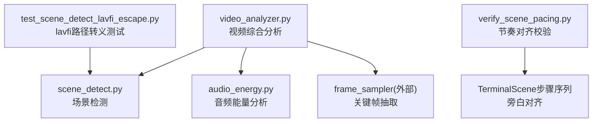
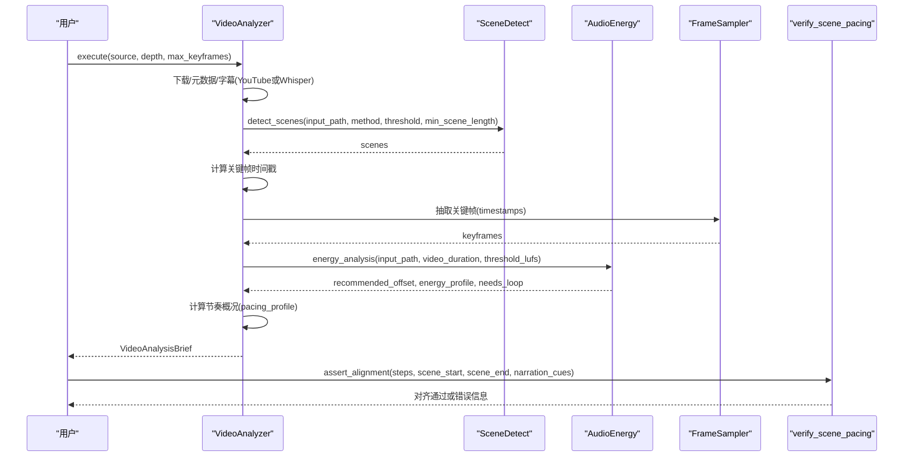
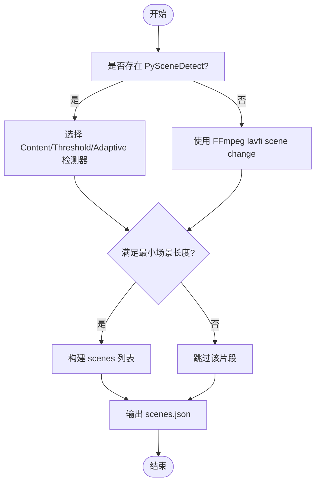
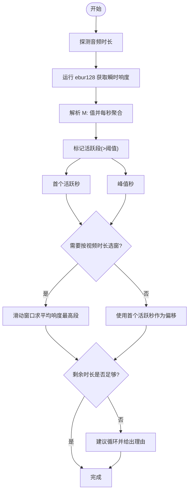
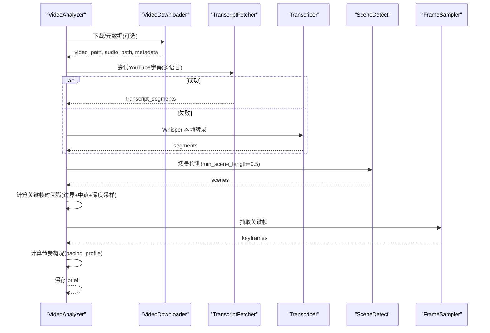
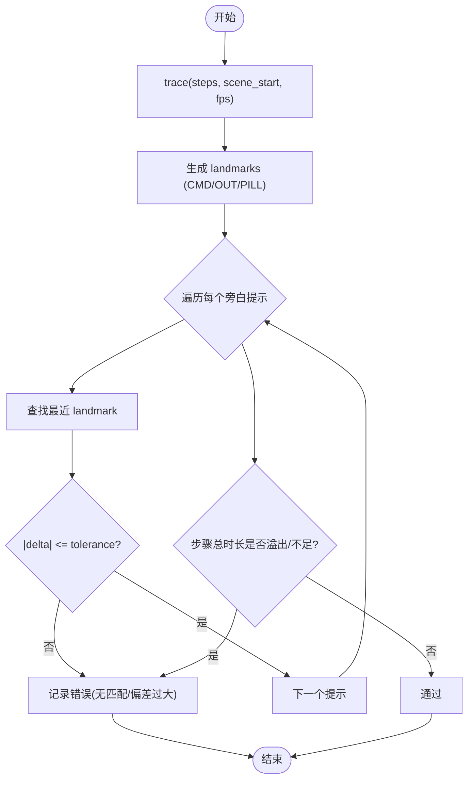
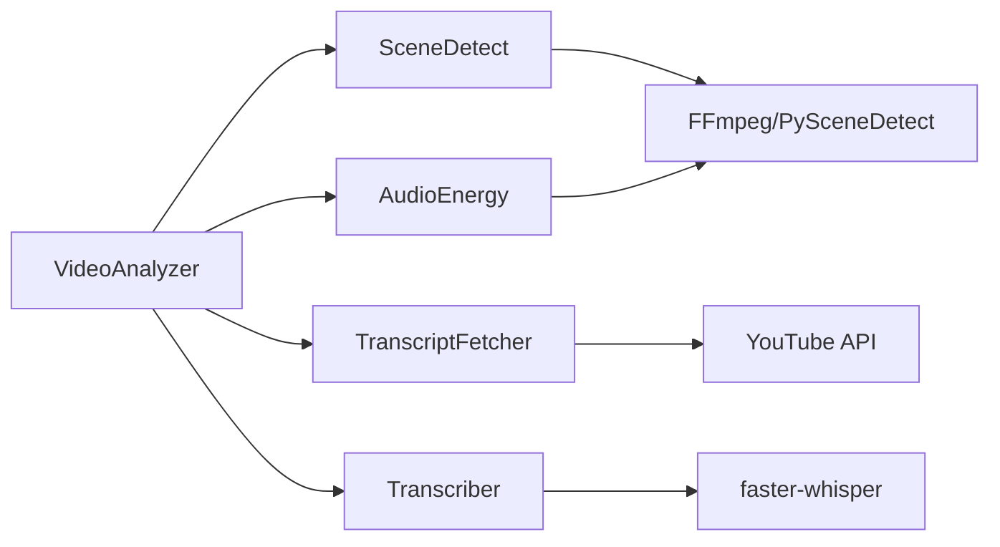

# 场景节奏验证

<cite>
**本文引用的文件**
- [lib/verify_scene_pacing.py](file://lib/verify_scene_pacing.py)
- [tools/analysis/scene_detect.py](file://tools/analysis/scene_detect.py)
- [tools/analysis/audio_energy.py](file://tools/analysis/audio_energy.py)
- [tools/analysis/video_analyzer.py](file://tools/analysis/video_analyzer.py)
- [tests/tools/test_scene_detect_lavfi_escape.py](file://tests/tools/test_scene_detect_lavfi_escape.py)
</cite>

## 目录
1. [简介](#简介)
2. [项目结构](#项目结构)
3. [核心组件](#核心组件)
4. [架构总览](#架构总览)
5. [详细组件分析](#详细组件分析)
6. [依赖关系分析](#依赖关系分析)
7. [性能考量](#性能考量)
8. [故障排查指南](#故障排查指南)
9. [结论](#结论)
10. [附录](#附录)

## 简介
本技术文档围绕 OpenMontage 的“场景节奏验证系统”展开，聚焦视频时间轴分析算法与质量控制规则。内容涵盖：
- 场景边界检测、时长分布分析与节奏模式识别
- 节奏验证规则（最小/最大场景时长、转场间隔检查等）
- 时间轴数据处理流程（音频能量分析、视觉变化检测、场景分割算法）
- 配置参数与自定义规则开发指南
- 验证结果报告与修复建议生成机制
- 性能优化与批量处理能力

该系统的目标是确保最终成片在叙事节奏、镜头切换频率和视听能量上符合预期标准，从而提升观看体验与制作效率。

## 项目结构
与场景节奏验证直接相关的代码主要分布在以下模块：
- 场景检测工具：基于 PySceneDetect 或 FFmpeg 的场景边界检测
- 音频能量分析：通过 ebur128 计算瞬时响度并定位音乐活跃段
- 视频综合分析：编排下载、字幕、场景检测、关键帧抽取与节奏统计
- 节奏对齐校验：将步骤序列与旁白提示进行时间对齐校验
- 安全与测试：对 FFmpeg lavfi 路径转义的安全测试

图表来源
- [tools/analysis/video_analyzer.py:149-400](file://tools/analysis/video_analyzer.py#L149-L400)
- [tools/analysis/scene_detect.py:86-117](file://tools/analysis/scene_detect.py#L86-L117)
- [tools/analysis/audio_energy.py:107-303](file://tools/analysis/audio_energy.py#L107-L303)
- [lib/verify_scene_pacing.py:59-131](file://lib/verify_scene_pacing.py#L59-L131)
- [tests/tools/test_scene_detect_lavfi_escape.py:13-28](file://tests/tools/test_scene_detect_lavfi_escape.py#L13-L28)

章节来源
- [tools/analysis/video_analyzer.py:149-400](file://tools/analysis/video_analyzer.py#L149-L400)
- [tools/analysis/scene_detect.py:86-117](file://tools/analysis/scene_detect.py#L86-L117)
- [tools/analysis/audio_energy.py:107-303](file://tools/analysis/audio_energy.py#L107-L303)
- [lib/verify_scene_pacing.py:59-131](file://lib/verify_scene_pacing.py#L59-L131)
- [tests/tools/test_scene_detect_lavfi_escape.py:13-28](file://tests/tools/test_scene_detect_lavfi_escape.py#L13-L28)

## 核心组件
- 场景检测器（SceneDetect）
  - 能力：detect_scenes、detect_content_changes、detect_threshold
  - 输入：input_path、method、threshold、min_scene_length_seconds、output_path
  - 输出：scenes（含 index、start_seconds、end_seconds、duration_seconds）、方法、耗时
- 音频能量分析器（AudioEnergy）
  - 能力：find_music_offset、energy_profile、best_window、loop_recommendation
  - 输入：input_path、video_duration_seconds、energy_threshold_lufs
  - 输出：推荐偏移、能量曲线、是否需循环及原因
- 视频综合分析器（VideoAnalyzer）
  - 能力：analyze_reference_video、extract_structure、extract_style、extract_transcript
  - 输入：source、analysis_depth、max_keyframes、output_dir
  - 输出：VideoAnalysisBrief（结构分析、节奏概况、关键帧等）
- 节奏对齐校验（verify_scene_pacing）
  - 能力：step_duration、trace、assert_alignment
  - 输入：steps、scene_start、scene_end、narration_cues、tolerance、fps
  - 输出：对齐错误列表或断言失败

章节来源
- [tools/analysis/scene_detect.py:43-74](file://tools/analysis/scene_detect.py#L43-L74)
- [tools/analysis/audio_energy.py:57-97](file://tools/analysis/audio_energy.py#L57-L97)
- [tools/analysis/video_analyzer.py:54-125](file://tools/analysis/video_analyzer.py#L54-L125)
- [lib/verify_scene_pacing.py:33-49](file://lib/verify_scene_pacing.py#L33-L49)

## 架构总览
整体处理流程如下：
- 输入源（本地文件或URL）经 VideoAnalyzer 统一入口
- 可选下载与元数据获取；YouTube 优先尝试字幕API，否则回退到 Whisper 转录
- 调用 SceneDetect 进行场景边界检测，得到 scenes 列表
- 根据 scenes 计算关键帧时间戳，抽样提取代表性画面
- 使用 AudioEnergy 分析音频能量，确定最佳播放偏移与是否需要循环
- 汇总结构分析（场景数、平均/最短/最长时长、每分钟切镜次数、节奏风格分类）
- 可选：使用 verify_scene_pacing 对 TerminalScene 的步骤序列与旁白提示进行时间对齐校验

图表来源
- [tools/analysis/video_analyzer.py:149-400](file://tools/analysis/video_analyzer.py#L149-L400)
- [tools/analysis/scene_detect.py:86-117](file://tools/analysis/scene_detect.py#L86-L117)
- [tools/analysis/audio_energy.py:107-303](file://tools/analysis/audio_energy.py#L107-L303)
- [lib/verify_scene_pacing.py:59-131](file://lib/verify_scene_pacing.py#L59-L131)

## 详细组件分析

### 场景检测器（SceneDetect）
- 实现要点
  - 优先使用 PySceneDetect（ContentDetector/ThresholdDetector/AdaptiveDetector），支持最小场景长度过滤
  - 回退方案使用 FFmpeg lavfi scene change filter，包含路径转义与安全校验
  - 输出标准化 scenes JSON，便于后续节奏统计与可视化
- 关键参数
  - method：content/threshold/adaptive
  - threshold：方法相关阈值
  - min_scene_length_seconds：最小场景时长（秒）
- 安全与健壮性
  - 对 lavfi movie=... 路径中的特殊字符进行转义，拒绝单引号以防止注入
  - 提供简单回退策略以应对复杂环境

图表来源
- [tools/analysis/scene_detect.py:119-165](file://tools/analysis/scene_detect.py#L119-L165)
- [tools/analysis/scene_detect.py:181-231](file://tools/analysis/scene_detect.py#L181-L231)
- [tools/analysis/scene_detect.py:233-277](file://tools/analysis/scene_detect.py#L233-L277)

章节来源
- [tools/analysis/scene_detect.py:86-117](file://tools/analysis/scene_detect.py#L86-L117)
- [tools/analysis/scene_detect.py:119-165](file://tools/analysis/scene_detect.py#L119-L165)
- [tools/analysis/scene_detect.py:181-231](file://tools/analysis/scene_detect.py#L181-L231)
- [tests/tools/test_scene_detect_lavfi_escape.py:13-28](file://tests/tools/test_scene_detect_lavfi_escape.py#L13-L28)

### 音频能量分析器（AudioEnergy）
- 实现要点
  - 使用 ffmpeg ebur128 过滤器提取每100ms的瞬时响度（M:）
  - 按秒聚合为能量曲线，标记“活跃”段（超过阈值 LUFS）
  - 自动寻找首个活跃秒、峰值秒，并根据视频时长推荐最佳窗口与偏移
  - 若可用时长不足，给出循环建议
- 关键参数
  - energy_threshold_lufs：判定“活跃”的响度阈值（默认 -40）
  - video_duration_seconds：用于窗口搜索与循环判断
- 输出
  - recommended_offset_seconds、offset_reason、needs_loop、loop_info、energy_profile

图表来源
- [tools/analysis/audio_energy.py:121-200](file://tools/analysis/audio_energy.py#L121-L200)
- [tools/analysis/audio_energy.py:202-297](file://tools/analysis/audio_energy.py#L202-L297)

章节来源
- [tools/analysis/audio_energy.py:107-303](file://tools/analysis/audio_energy.py#L107-L303)

### 视频综合分析器（VideoAnalyzer）
- 实现要点
  - 统一入口：支持本地文件与URL（YouTube/Shorts/Instagram/TikTok等）
  - 字幕获取：优先 YouTubeTranscriptApi，失败则回退 Whisper 本地转录
  - 场景检测：调用 SceneDetect，设置最小场景长度（如 0.5s）
  - 关键帧抽取：基于场景边界与中点，深度模式下增加内部分样
  - 节奏统计：计算平均/最短/最长场景时长、每分钟切镜次数、节奏风格分类
- 关键参数
  - analysis_depth：transcript_only / standard / deep
  - max_keyframes：最大关键帧数量
  - output_dir：输出目录
- 输出
  - VideoAnalysisBrief（结构分析、节奏概况、关键帧、运动类型等）

图表来源
- [tools/analysis/video_analyzer.py:149-400](file://tools/analysis/video_analyzer.py#L149-L400)
- [tools/analysis/video_analyzer.py:602-632](file://tools/analysis/video_analyzer.py#L602-L632)
- [tools/analysis/video_analyzer.py:643-654](file://tools/analysis/video_analyzer.py#L643-L654)

章节来源
- [tools/analysis/video_analyzer.py:149-400](file://tools/analysis/video_analyzer.py#L149-L400)
- [tools/analysis/video_analyzer.py:602-632](file://tools/analysis/video_analyzer.py#L602-L632)
- [tools/analysis/video_analyzer.py:643-654](file://tools/analysis/video_analyzer.py#L643-L654)

### 节奏对齐校验（verify_scene_pacing）
- 实现要点
  - step_duration：按步骤类型（cmd/out/pause/pill）计算可见事件持续时间
  - trace：遍历步骤生成时间地标（landmarks），用于对齐检查
  - assert_alignment：校验每个旁白提示是否在容差范围内有对应视觉事件，并检查溢出/填充不足
- 关键参数
  - scene_start、scene_end：场景起止时间
  - narration_cues：旁白提示的时间与描述
  - tolerance：容差（秒）
  - fps：帧率（影响打字/显示动画时长）
- 输出
  - 通过或 AssertionError（包含具体错误信息）

图表来源
- [lib/verify_scene_pacing.py:33-49](file://lib/verify_scene_pacing.py#L33-L49)
- [lib/verify_scene_pacing.py:59-80](file://lib/verify_scene_pacing.py#L59-L80)
- [lib/verify_scene_pacing.py:83-131](file://lib/verify_scene_pacing.py#L83-L131)

章节来源
- [lib/verify_scene_pacing.py:33-49](file://lib/verify_scene_pacing.py#L33-L49)
- [lib/verify_scene_pacing.py:59-80](file://lib/verify_scene_pacing.py#L59-L80)
- [lib/verify_scene_pacing.py:83-131](file://lib/verify_scene_pacing.py#L83-L131)

## 依赖关系分析
- 内部依赖
  - VideoAnalyzer 依赖 SceneDetect、FrameSampler（外部）、TranscriptFetcher、Transcriber
  - SceneDetect 依赖 PySceneDetect 或 FFmpeg（lavfi）
  - AudioEnergy 依赖 FFmpeg（ebur128）
  - verify_scene_pacing 独立于媒体处理，专注于步骤序列与旁白对齐
- 外部依赖
  - FFmpeg/ffprobe：场景检测、音频能量分析、元数据读取
  - PySceneDetect：高质量场景边界检测
  - YouTubeTranscriptApi：快速字幕获取
  - faster-whisper：本地语音转文本
- 潜在耦合
  - VideoAnalyzer 对多种工具组合编排，需注意异常回退与幂等键字段
  - SceneDetect 的路径转义逻辑需严格测试以避免命令注入

图表来源
- [tools/analysis/video_analyzer.py:149-400](file://tools/analysis/video_analyzer.py#L149-L400)
- [tools/analysis/scene_detect.py:86-117](file://tools/analysis/scene_detect.py#L86-L117)
- [tools/analysis/audio_energy.py:107-303](file://tools/analysis/audio_energy.py#L107-L303)

章节来源
- [tools/analysis/video_analyzer.py:149-400](file://tools/analysis/video_analyzer.py#L149-L400)
- [tools/analysis/scene_detect.py:86-117](file://tools/analysis/scene_detect.py#L86-L117)
- [tools/analysis/audio_energy.py:107-303](file://tools/analysis/audio_energy.py#L107-L303)

## 性能考量
- 场景检测
  - 优先使用 PySceneDetect，减少命令行开销；设置合理的最小场景长度避免过细分割
  - FFmpeg 回退时注意超时与日志解析成本
- 音频能量分析
  - ebur128 输出密集（100ms粒度），按秒聚合降低内存与CPU压力
  - 大文件分析时建议限制范围或分片处理
- 关键帧抽取
  - 基于场景边界与中点抽样，深度模式增加内部分样但需控制 max_keyframes
- 批量处理
  - 利用幂等键字段（如 input_path、method、threshold）缓存中间结果
  - 并行化不同视频的独立分析任务，避免共享状态竞争

[本节提供通用指导，不直接分析具体文件]

## 故障排查指南
- 场景检测失败
  - 检查 FFmpeg/PySceneDetect 安装与环境变量
  - 调整 method 与 threshold；增大 min_scene_length_seconds 以减少误报
  - 查看 lavfi 路径转义是否正确（单引号不支持）
- 音频能量分析失败
  - 确认 ffmpeg/ffprobe 可执行且 PATH 正确
  - 若 ebur128 超时，检查音频格式与文件大小
- 视频综合分析失败
  - URL 下载失败时回退到本地文件；字幕获取失败时启用 Whisper
  - 关键帧抽取失败时降低 max_keyframes 或改用 count-based 策略
- 节奏对齐校验失败
  - 检查 steps 的 holdSeconds/typeSpeed/fps 设置是否与渲染一致
  - 调整 tolerance 或修正 narration_cues 时间点

章节来源
- [tools/analysis/scene_detect.py:167-179](file://tools/analysis/scene_detect.py#L167-L179)
- [tools/analysis/audio_energy.py:121-176](file://tools/analysis/audio_energy.py#L121-L176)
- [tools/analysis/video_analyzer.py:257-363](file://tools/analysis/video_analyzer.py#L257-L363)
- [lib/verify_scene_pacing.py:83-131](file://lib/verify_scene_pacing.py#L83-L131)

## 结论
OpenMontage 的场景节奏验证系统通过模块化设计实现了从媒体解析、场景分割、音频能量分析到节奏校验的完整闭环。借助可配置的阈值与最小场景长度，系统能够适应不同风格的视频内容；同时，结合 VideoAnalyzer 的节奏概况与 verify_scene_pacing 的对齐校验，可在制作早期发现节奏问题并提供修复建议。未来可进一步扩展自定义规则引擎与可视化报告，以提升团队协作与自动化质量保障能力。

[本节总结性内容，不直接分析具体文件]

## 附录

### 节奏验证规则与配置参数
- 最小场景时长：min_scene_length_seconds（秒），用于过滤过短片段
- 最大场景时长：可通过 post-processing 对 scenes 进行合并或裁剪
- 转场间隔检查：基于 pacing_profile 的 cuts_per_minute 与节奏风格分类
- 音频能量阈值：energy_threshold_lufs（LUFS），控制“活跃”判定
- 对齐容差：tolerance（秒），控制旁白与视觉事件的匹配宽松度
- 帧率：fps，影响打字/显示动画时长计算

章节来源
- [tools/analysis/scene_detect.py:49-74](file://tools/analysis/scene_detect.py#L49-L74)
- [tools/analysis/audio_energy.py:69-97](file://tools/analysis/audio_energy.py#L69-L97)
- [lib/verify_scene_pacing.py:83-131](file://lib/verify_scene_pacing.py#L83-L131)

### 自定义规则开发指南
- 新增节奏规则
  - 在 VideoAnalyzer 的节奏统计中添加新指标（如段落内切镜密度）
  - 在 verify_scene_pacing 中扩展 assert_alignment 的校验逻辑
- 扩展场景检测
  - 在 SceneDetect 中注册新的 detector 或后处理规则（如合并相邻短场景）
- 音频能量规则
  - 在 AudioEnergy 中增加多阈值分段与区域评分

[本节提供通用指导，不直接分析具体文件]

### 报告与修复建议
- VideoAnalysisBrief 包含结构分析、节奏概况、关键帧与运动类型
- 当节奏校验失败时，返回具体错误信息（如“步骤溢出场景”“旁白无匹配视觉”）
- 修复建议示例：
  - 调整 holdSeconds 或 typeSpeed 以匹配场景时长
  - 增加 pause 步骤以填补空白
  - 调整 min_scene_length_seconds 或 threshold 以优化场景分割

章节来源
- [tools/analysis/video_analyzer.py:165-182](file://tools/analysis/video_analyzer.py#L165-L182)
- [lib/verify_scene_pacing.py:97-131](file://lib/verify_scene_pacing.py#L97-L131)