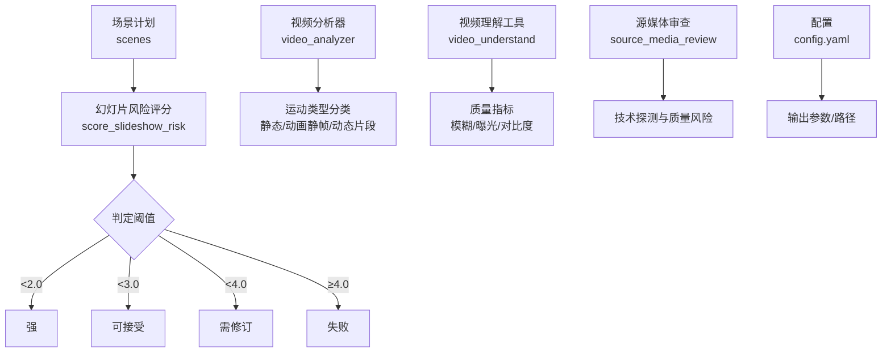
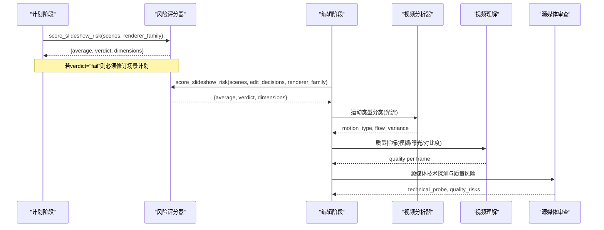
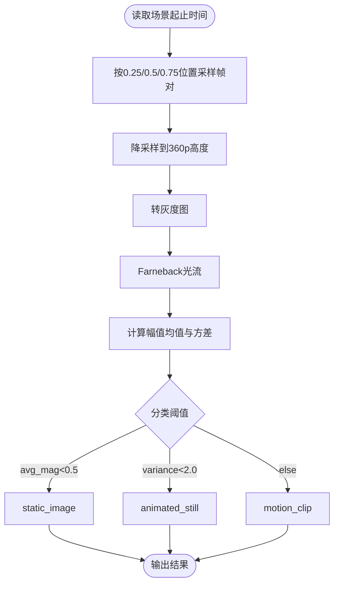
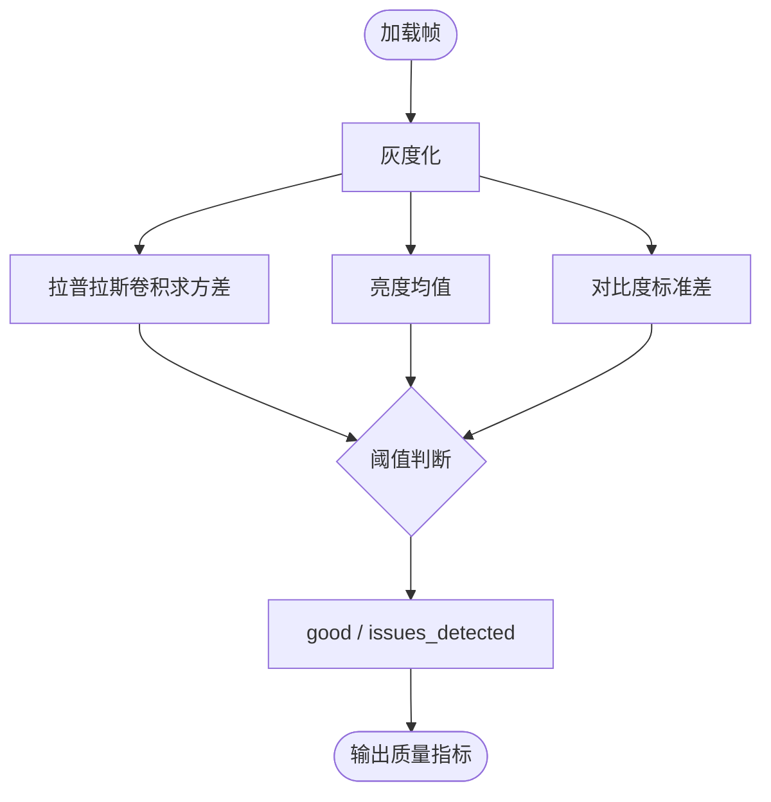
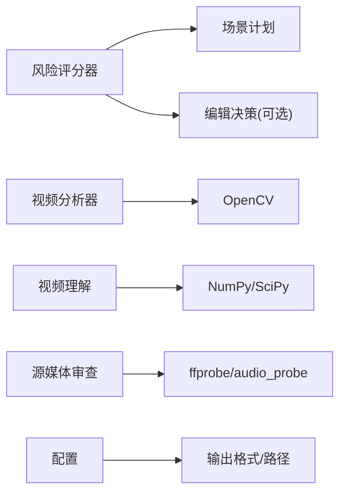

# 幻灯片风险评估

<cite>
**本文引用的文件**
- [lib/slideshow_risk.py](file://lib/slideshow_risk.py)
- [tools/analysis/video_analyzer.py](file://tools/analysis/video_analyzer.py)
- [tools/analysis/video_understand.py](file://tools/analysis/video_understand.py)
- [lib/source_media_review.py](file://lib/source_media_review.py)
- [tests/tools/test_scoring.py](file://tests/tools/test_scoring.py)
- [tests/eval/bench_runner.py](file://tests/eval/bench_runner.py)
- [config.yaml](file://config.yaml)
- [skills/meta/reviewer.md](file://skills/meta/reviewer.md)
</cite>

## 目录
1. [简介](#简介)
2. [项目结构](#项目结构)
3. [核心组件](#核心组件)
4. [架构总览](#架构总览)
5. [详细组件分析](#详细组件分析)
6. [依赖关系分析](#依赖关系分析)
7. [性能考量](#性能考量)
8. [故障排查指南](#故障排查指南)
9. [结论](#结论)
10. [附录](#附录)

## 简介
本技术文档面向OpenMontage中的“幻灯片风险评估”子系统，聚焦于视频内容质量评估算法与风险评分模型。系统通过多维度指标（重复性、装饰性视觉、弱运动、弱镜头意图、过度依赖排版、未支持的“电影感”宣称）对视频计划进行打分，并结合运行时信息给出“强/可接受/需修订/失败”的判定。同时，文档说明帧间差异分析、色彩变化检测、运动估计等评估指标的计算方式，提供配置选项与自定义规则方法，解释输出格式与质量报告生成机制，并给出误报处理与性能优化策略。

## 项目结构
围绕幻灯片风险评估的相关代码主要分布在以下位置：
- 风险评分主逻辑：lib/slideshow_risk.py
- 视频运动分析与质量评估：tools/analysis/video_analyzer.py、tools/analysis/video_understand.py
- 源媒体审查与基础质量风险：lib/source_media_review.py
- 测试与基准验证：tests/tools/test_scoring.py、tests/eval/bench_runner.py
- 全局配置：config.yaml
- 评审流程指引：skills/meta/reviewer.md

图表来源
- [lib/slideshow_risk.py:26-87](file://lib/slideshow_risk.py#L26-L87)
- [tools/analysis/video_analyzer.py:700-799](file://tools/analysis/video_analyzer.py#L700-L799)
- [tools/analysis/video_understand.py:343-388](file://tools/analysis/video_understand.py#L343-L388)
- [lib/source_media_review.py:41-117](file://lib/source_media_review.py#L41-L117)
- [config.yaml:20-33](file://config.yaml#L20-L33)

章节来源
- [lib/slideshow_risk.py:26-87](file://lib/slideshow_risk.py#L26-L87)
- [tools/analysis/video_analyzer.py:700-799](file://tools/analysis/video_analyzer.py#L700-L799)
- [tools/analysis/video_understand.py:343-388](file://tools/analysis/video_understand.py#L343-L388)
- [lib/source_media_review.py:41-117](file://lib/source_media_review.py#L41-L117)
- [config.yaml:20-33](file://config.yaml#L20-L33)

## 核心组件
- 幻灯片风险评分器：基于场景计划的多维度打分，输出平均分数与判定等级，并提供各维度原因说明。
- 视频运动分析器：使用光流法对片段内运动进行采样与分类，区分静态图像、动画静帧与动态片段。
- 视频理解质量评估：基于像素级指标（模糊、亮度、对比度）识别质量问题。
- 源媒体审查：统一探测用户素材的技术属性与质量风险，为后续规划提供约束。
- 测试与基准：覆盖评分器行为与阈值匹配，确保回归稳定性。

章节来源
- [lib/slideshow_risk.py:26-87](file://lib/slideshow_risk.py#L26-L87)
- [tools/analysis/video_analyzer.py:700-799](file://tools/analysis/video_analyzer.py#L700-L799)
- [tools/analysis/video_understand.py:343-388](file://tools/analysis/video_understand.py#L343-L388)
- [lib/source_media_review.py:215-331](file://lib/source_media_review.py#L215-L331)
- [tests/eval/bench_runner.py:362-387](file://tests/eval/bench_runner.py#L362-L387)

## 架构总览
幻灯片风险评估由“计划层”和“执行层”两部分组成：
- 计划层：在场景计划阶段计算风险分数，依据阈值决定是否需要修订或终止进入合成阶段。
- 执行层：在编辑/合成阶段结合edit_decisions与渲染器家族信息，再次评估风险，确保编辑未恶化质量。

图表来源
- [lib/slideshow_risk.py:26-87](file://lib/slideshow_risk.py#L26-L87)
- [tools/analysis/video_analyzer.py:700-799](file://tools/analysis/video_analyzer.py#L700-L799)
- [tools/analysis/video_understand.py:343-388](file://tools/analysis/video_understand.py#L343-L388)
- [lib/source_media_review.py:215-331](file://lib/source_media_review.py#L215-L331)

## 详细组件分析

### 幻灯片风险评分器
- 输入：场景列表scenes、可选编辑决策edit_decisions、渲染器家族renderer_family、渲染运行时render_runtime。
- 维度与计分：
  - repetition：场景类型重复、描述相似、景别重复。
  - decorative_visuals：无信息角色/叙事角色/镜头意图的场景比例。
  - weak_motion：存在运动但缺乏镜头意图的比例。
  - weak_shot_intent：缺少镜头意图的场景比例。
  - typography_overreliance：文本/统计卡占比过高。
  - unsupported_cinematic_claims：声称“电影感”但缺少英雄时刻、运动、灯光等结构支撑。
- 判定阈值：
  - <2.0：强
  - <3.0：可接受
  - <4.0：需修订
  - ≥4.0：失败
- 输出：包含average、verdict、dimensions（每个维度的score与reason）、render_runtime。

```mermaid
flowchart TD
Start(["开始"]) --> CheckScenes{"是否有场景?"}
CheckScenes --> |否| ReturnFail["返回失败(平均=5.0)"]
CheckScenes --> |是| ComputeDims["计算6个维度分数"]
ComputeDims --> Avg["计算平均分"]
Avg --> Threshold{"阈值判断"}
Threshold --> |<2.0| Strong["强"]
Threshold --> |<3.0| Acceptable["可接受"]
Threshold --> |<4.0| Revise["需修订"]
Threshold --> |≥4.0| Fail["失败"]
Strong --> End(["结束"])
Acceptable --> End
Revise --> End
Fail --> End
```

图表来源
- [lib/slideshow_risk.py:26-87](file://lib/slideshow_risk.py#L26-L87)

章节来源
- [lib/slideshow_risk.py:90-256](file://lib/slideshow_risk.py#L90-L256)

### 视频运动分析（帧间差异与运动估计）
- 方法：对每个场景片段按时间采样多对帧，降采样至360p高度以提升速度，转换为灰度图后使用Farneback光流计算运动场，统计幅值均值与方差以分类运动类型。
- 分类阈值（针对360p、0.4秒间隔调优）：
  - static_image：平均幅值<0.5
  - animated_still：平均方差<2.0（均匀运动，如平移/缩放）
  - motion_clip：否则为动态片段
- 输出：motion_type与flow_variance，用于判断是否存在真实运动或仅为静态图像的动画化。

图表来源
- [tools/analysis/video_analyzer.py:700-799](file://tools/analysis/video_analyzer.py#L700-L799)

章节来源
- [tools/analysis/video_analyzer.py:700-799](file://tools/analysis/video_analyzer.py#L700-L799)

### 视频理解质量评估（色彩变化与像素级指标）
- 方法：加载提取帧，计算拉普拉斯方差检测模糊；计算亮度均值与对比度标准差；根据阈值标记质量问题（模糊、欠曝、过曝、低对比）。
- 输出：每帧的质量标签与问题列表，以及分辨率等信息。

图表来源
- [tools/analysis/video_understand.py:343-388](file://tools/analysis/video_understand.py#L343-L388)

章节来源
- [tools/analysis/video_understand.py:343-388](file://tools/analysis/video_understand.py#L343-L388)

### 源媒体审查（基础质量风险与可用性推断）
- 功能：统一探测视频/音频/图片的技术属性（时长、分辨率、编码、声道、比特率等），抽样代表性帧，尝试转录摘要，并生成质量风险清单与可用性推断。
- 风险示例：低分辨率、单声道音频、极短片段等。
- 输出：technical_probe、quality_risks、representative_frames、transcript_summary、content_summary、usable_for。

章节来源
- [lib/source_media_review.py:41-117](file://lib/source_media_review.py#L41-L117)
- [lib/source_media_review.py:215-331](file://lib/source_media_review.py#L215-L331)

### 测试与基准验证
- 基准运行：在评测脚本中调用风险评分器，比较预期与实际的verdict，记录分数与错误信息。
- 回归测试：验证分词器与“电影感”加分逻辑对标点符号的鲁棒性。

章节来源
- [tests/eval/bench_runner.py:362-387](file://tests/eval/bench_runner.py#L362-L387)
- [tests/tools/test_scoring.py:35-48](file://tests/tools/test_scoring.py#L35-L48)

## 依赖关系分析
- 风险评分器依赖场景计划数据与可选编辑决策，不直接依赖外部库，保持轻量与可移植性。
- 视频分析器依赖OpenCV进行光流计算，并对高分辨率视频进行降采样以降低计算成本。
- 视频理解质量评估依赖NumPy/SciPy进行像素级图像处理。
- 源媒体审查依赖ffprobe或工具注册表中的audio_probe，以及frame_sampler进行抽样。
- 配置项影响输出格式与路径，间接影响最终报告与产物组织。

图表来源
- [lib/slideshow_risk.py:26-87](file://lib/slideshow_risk.py#L26-L87)
- [tools/analysis/video_analyzer.py:700-799](file://tools/analysis/video_analyzer.py#L700-L799)
- [tools/analysis/video_understand.py:343-388](file://tools/analysis/video_understand.py#L343-L388)
- [lib/source_media_review.py:41-117](file://lib/source_media_review.py#L41-L117)
- [config.yaml:20-33](file://config.yaml#L20-L33)

章节来源
- [lib/slideshow_risk.py:26-87](file://lib/slideshow_risk.py#L26-L87)
- [tools/analysis/video_analyzer.py:700-799](file://tools/analysis/video_analyzer.py#L700-L799)
- [tools/analysis/video_understand.py:343-388](file://tools/analysis/video_understand.py#L343-L388)
- [lib/source_media_review.py:41-117](file://lib/source_media_review.py#L41-L117)
- [config.yaml:20-33](file://config.yaml#L20-L33)

## 性能考量
- 降采样与采样策略：视频分析器将帧降采样至360p高度，并在片段内按固定间隔采样帧对，显著降低光流计算开销。
- 阈值调优：运动分类阈值针对360p与0.4秒间隔调优，避免误判；可根据实际内容调整gap与阈值。
- 质量评估轻量化：像素级指标无需VLM，适合批量快速筛查。
- 配置输出：默认输出格式与编解码参数可通过配置文件调整，平衡质量与体积。

[本节为通用指导，不直接分析具体文件]

## 故障排查指南
- 风险评分异常：
  - 检查scenes是否为空；为空时直接返回失败。
  - 核对维度原因说明，定位重复性过高或缺失镜头意图等问题。
- 运动分类不准确：
  - 确认帧采样时间与间隔是否合理；必要时增大gap或调整阈值。
  - 检查OpenCV安装与可用性以及帧读取是否成功。
- 质量评估误报：
  - 调整模糊、曝光、对比度阈值；关注拉普拉斯方差与像素统计的合理性。
- 源媒体探测失败：
  - 优先使用工具注册表中的audio_probe；若不可用，回退到ffprobe命令。
  - 检查文件路径与权限，确保抽样帧写入目录可写。

章节来源
- [lib/slideshow_risk.py:53-59](file://lib/slideshow_risk.py#L53-L59)
- [tools/analysis/video_analyzer.py:700-799](file://tools/analysis/video_analyzer.py#L700-L799)
- [tools/analysis/video_understand.py:343-388](file://tools/analysis/video_understand.py#L343-L388)
- [lib/source_media_review.py:41-117](file://lib/source_media_review.py#L41-L117)

## 结论
OpenMontage的幻灯片风险评估系统通过多维度的计划层评分与执行层的视频分析，有效识别“幻灯片式”内容的风险，保障最终视频具备足够的叙事意图与视觉多样性。结合源媒体审查与质量评估，系统能够在早期发现潜在问题并提供改进建议。通过合理的阈值与性能优化策略，系统在准确性与效率之间取得良好平衡。

[本节为总结，不直接分析具体文件]

## 附录

### 评估指标与计算方法
- 帧间差异分析：使用Farneback光流计算运动场，统计幅值均值与方差进行分类。
- 色彩变化检测：通过灰度图的拉普拉斯方差检测模糊，亮度均值与对比度标准差识别曝光与对比度问题。
- 运动估计：降采样与采样策略提升性能，阈值针对特定分辨率与间隔调优。

章节来源
- [tools/analysis/video_analyzer.py:700-799](file://tools/analysis/video_analyzer.py#L700-L799)
- [tools/analysis/video_understand.py:343-388](file://tools/analysis/video_understand.py#L343-L388)

### 风险评分模型与阈值
- 维度：重复性、装饰性视觉、弱运动、弱镜头意图、过度依赖排版、未支持的“电影感”宣称。
- 阈值：平均分数<2.0为强，<3.0为可接受，<4.0为需修订，≥4.0为失败。
- 运行时信息：支持传入渲染器家族与运行时，便于在“电影感”维度进行校验。

章节来源
- [lib/slideshow_risk.py:26-87](file://lib/slideshow_risk.py#L26-L87)
- [lib/slideshow_risk.py:90-256](file://lib/slideshow_risk.py#L90-L256)

### 配置选项与自定义规则
- 全局配置：输出格式、编解码器、分辨率、帧率、CRF等。
- 预算与检查点：控制成本与进度保存策略。
- 自定义规则：可在风险评分器中扩展维度与阈值，或在视频分析器中调整运动分类阈值与采样策略。

章节来源
- [config.yaml:1-33](file://config.yaml#L1-L33)

### 评估结果输出与质量报告
- 风险评分输出：包含average、verdict、dimensions（score与reason）、render_runtime。
- 质量报告：视频理解模块输出每帧质量指标与问题列表；源媒体审查输出技术探测与质量风险。
- 集成流程：在场景计划与编辑阶段分别调用风险评分器，结合视频分析与源媒体审查生成综合报告。

章节来源
- [lib/slideshow_risk.py:26-87](file://lib/slideshow_risk.py#L26-L87)
- [tools/analysis/video_understand.py:343-388](file://tools/analysis/video_understand.py#L343-L388)
- [lib/source_media_review.py:215-331](file://lib/source_media_review.py#L215-L331)

### 误报处理与性能优化策略
- 误报处理：
  - 调整运动分类阈值与采样间隔，减少静态图像被误判为动画静帧。
  - 在质量评估中放宽或收紧阈值，避免将轻微噪声判定为质量问题。
- 性能优化：
  - 降采样与采样策略已在视频分析器中实现。
  - 使用工具注册表加速探测，避免重复调用外部命令。
  - 合理设置输出参数，平衡质量与体积。

章节来源
- [tools/analysis/video_analyzer.py:700-799](file://tools/analysis/video_analyzer.py#L700-L799)
- [tools/analysis/video_understand.py:343-388](file://tools/analysis/video_understand.py#L343-L388)
- [lib/source_media_review.py:41-117](file://lib/source_media_review.py#L41-L117)

### 评审流程与最佳实践
- 在场景计划阶段运行风险评分，若结果为“失败”必须修订。
- 在编辑阶段重新评估，确保编辑未使风险升高。
- 针对各维度得分≥3.0的情况提出具体改进建议。

章节来源
- [skills/meta/reviewer.md:177-203](file://skills/meta/reviewer.md#L177-L203)