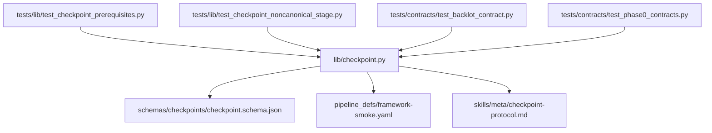
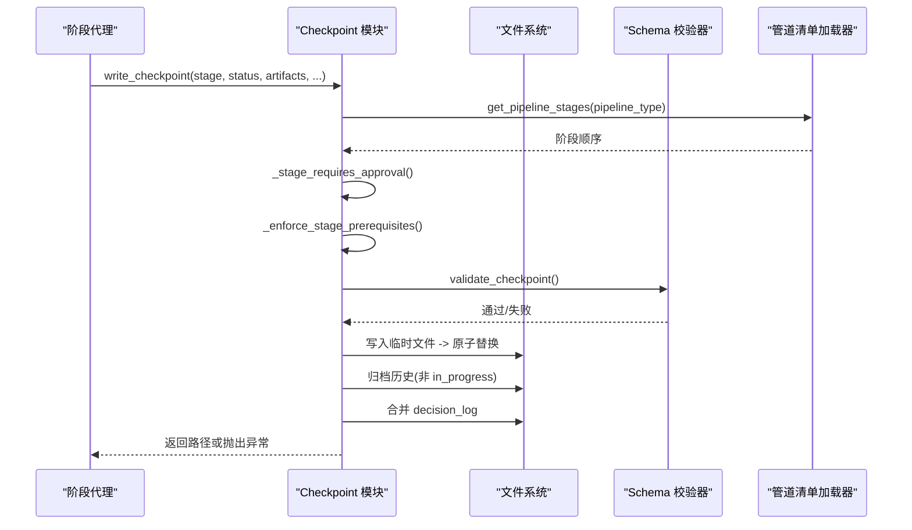
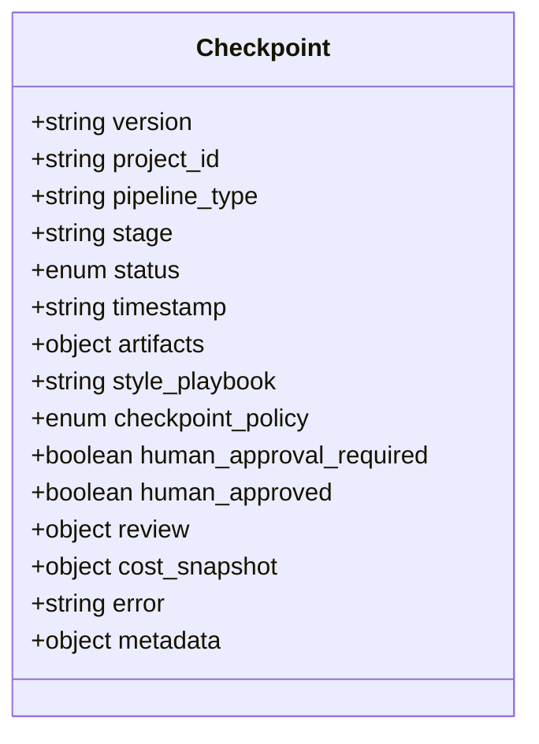
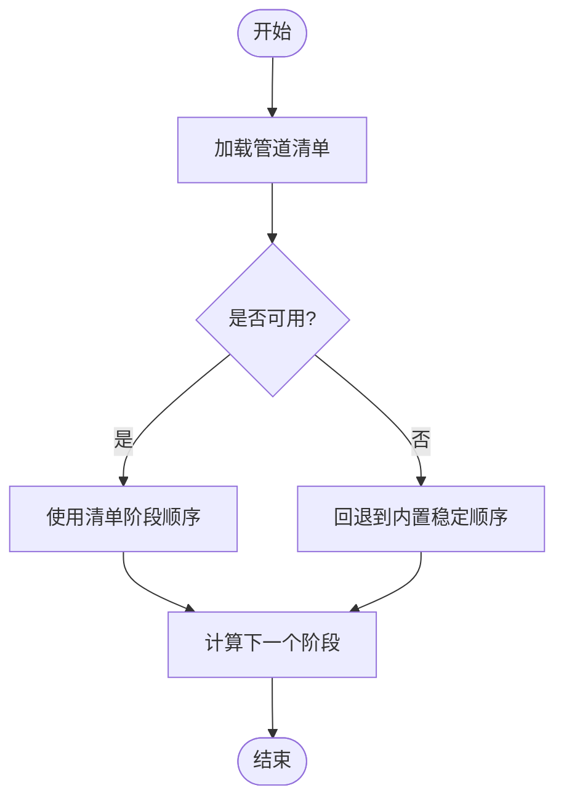
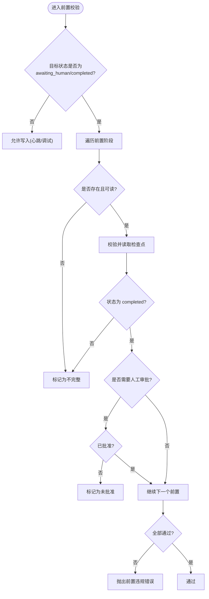
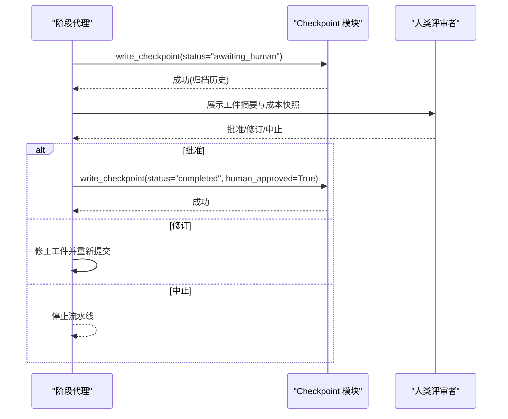
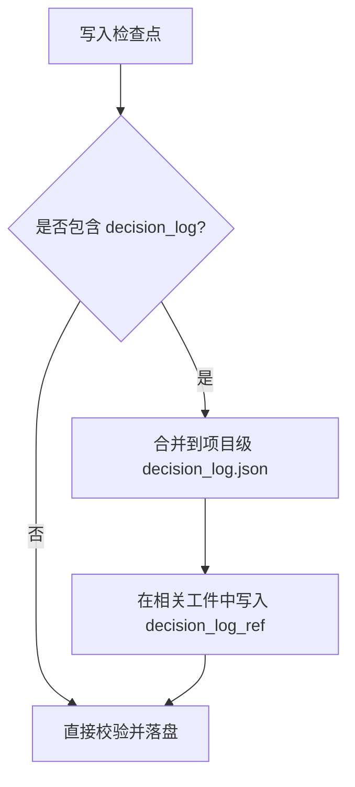
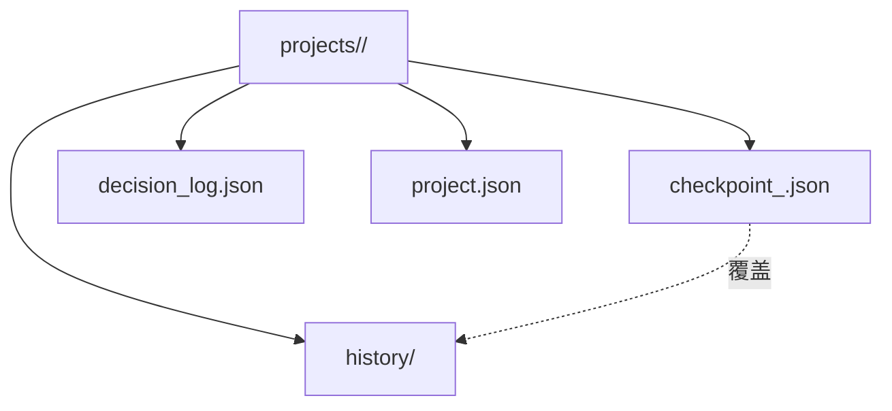
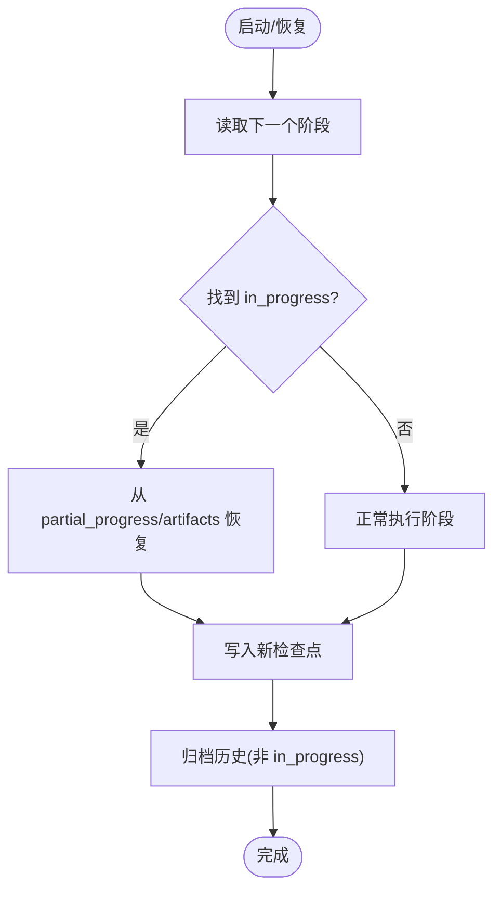
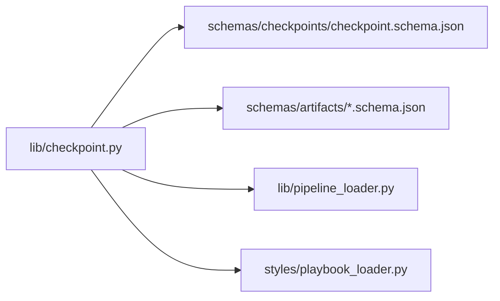

# 检查点协议

<cite>
**本文引用的文件**
- [lib/checkpoint.py](file://lib/checkpoint.py)
- [schemas/checkpoints/checkpoint.schema.json](file://schemas/checkpoints/checkpoint.schema.json)
- [pipeline_defs/framework-smoke.yaml](file://pipeline_defs/framework-smoke.yaml)
- [skills/meta/checkpoint-protocol.md](file://skills/meta/checkpoint-protocol.md)
- [tests/lib/test_checkpoint_prerequisites.py](file://tests/lib/test_checkpoint_prerequisites.py)
- [tests/lib/test_checkpoint_noncanonical_stage.py](file://tests/lib/test_checkpoint_noncanonical_stage.py)
- [tests/contracts/test_backlot_contract.py](file://tests/contracts/test_backlot_contract.py)
- [tests/contracts/test_phase0_contracts.py](file://tests/contracts/test_phase0_contracts.py)
</cite>

## 目录
1. [简介](#简介)
2. [项目结构](#项目结构)
3. [核心组件](#核心组件)
4. [架构总览](#架构总览)
5. [详细组件分析](#详细组件分析)
6. [依赖关系分析](#依赖关系分析)
7. [性能与可靠性](#性能与可靠性)
8. [故障排查指南](#故障排查指南)
9. [结论](#结论)
10. [附录](#附录)

## 简介
本技术文档系统性阐述 OpenMontage 的检查点协议，覆盖管道状态持久化、阶段前置条件验证、人工审批流程、工件引用与校验、历史归档、决策日志合并、错误处理与恢复策略等。该协议通过在每个阶段完成后写入结构化检查点，实现可恢复、可审计、可回滚的流水线执行。

## 项目结构
检查点协议的核心由以下部分组成：
- 运行时实现：lib/checkpoint.py
- 数据契约：schemas/checkpoints/checkpoint.schema.json
- 管道配置：pipeline_defs/*.yaml（示例 framework-smoke.yaml）
- 使用规范：skills/meta/checkpoint-protocol.md
- 测试用例：tests/lib/* 与 tests/contracts/*

图表来源
- [lib/checkpoint.py:1-634](file://lib/checkpoint.py#L1-L634)
- [schemas/checkpoints/checkpoint.schema.json:1-47](file://schemas/checkpoints/checkpoint.schema.json#L1-L47)
- [pipeline_defs/framework-smoke.yaml:1-26](file://pipeline_defs/framework-smoke.yaml#L1-L26)
- [skills/meta/checkpoint-protocol.md:1-247](file://skills/meta/checkpoint-protocol.md#L1-L247)
- [tests/lib/test_checkpoint_prerequisites.py:1-153](file://tests/lib/test_checkpoint_prerequisites.py#L1-L153)
- [tests/lib/test_checkpoint_noncanonical_stage.py:1-63](file://tests/lib/test_checkpoint_noncanonical_stage.py#L1-L63)
- [tests/contracts/test_backlot_contract.py:106-129](file://tests/contracts/test_backlot_contract.py#L106-L129)
- [tests/contracts/test_phase0_contracts.py:288-325](file://tests/contracts/test_phase0_contracts.py#L288-L325)

章节来源
- [lib/checkpoint.py:1-634](file://lib/checkpoint.py#L1-L634)
- [schemas/checkpoints/checkpoint.schema.json:1-47](file://schemas/checkpoints/checkpoint.schema.json#L1-L47)
- [pipeline_defs/framework-smoke.yaml:1-26](file://pipeline_defs/framework-smoke.yaml#L1-L26)
- [skills/meta/checkpoint-protocol.md:1-247](file://skills/meta/checkpoint-protocol.md#L1-L247)
- [tests/lib/test_checkpoint_prerequisites.py:1-153](file://tests/lib/test_checkpoint_prerequisites.py#L1-L153)
- [tests/lib/test_checkpoint_noncanonical_stage.py:1-63](file://tests/lib/test_checkpoint_noncanonical_stage.py#L1-L63)
- [tests/contracts/test_backlot_contract.py:106-129](file://tests/contracts/test_backlot_contract.py#L106-L129)
- [tests/contracts/test_phase0_contracts.py:288-325](file://tests/contracts/test_phase0_contracts.py#L288-L325)

## 核心组件
- 检查点读写与生命周期管理：write_checkpoint、read_checkpoint、get_latest_checkpoint、get_next_stage、get_completed_stages
- 项目初始化与标记：init_project
- 阶段前置条件验证：_enforce_stage_prerequisites
- 人工审批门控：_stage_requires_approval 与写时强制校验
- 工件校验：validate_checkpoint + 各工件 schema 校验
- 历史归档：_archive_superseded_checkpoint
- 决策日志合并：_merge_decision_log
- 风格策略校验：_validate_style_playbook

章节来源
- [lib/checkpoint.py:194-634](file://lib/checkpoint.py#L194-L634)
- [schemas/checkpoints/checkpoint.schema.json:1-47](file://schemas/checkpoints/checkpoint.schema.json#L1-L47)

## 架构总览
检查点协议围绕“每个阶段完成即落盘”的原则，结合管道清单中的阶段顺序与审批策略，形成强一致的状态机推进机制。写入前进行前置条件与审批门控校验；写入后自动归档旧版本并合并决策日志；读取时进行 schema 与业务规则校验，确保一致性。

图表来源
- [lib/checkpoint.py:422-564](file://lib/checkpoint.py#L422-L564)
- [lib/checkpoint.py:284-347](file://lib/checkpoint.py#L284-L347)
- [lib/checkpoint.py:251-282](file://lib/checkpoint.py#L251-L282)
- [lib/checkpoint.py:160-192](file://lib/checkpoint.py#L160-L192)
- [lib/checkpoint.py:349-386](file://lib/checkpoint.py#L349-L386)
- [lib/checkpoint.py:392-420](file://lib/checkpoint.py#L392-L420)

## 详细组件分析

### 检查点数据结构与版本管理
- 字段包括：version、project_id、pipeline_type、stage、status、timestamp、artifacts、style_playbook、checkpoint_policy、human_approval_required、human_approved、review、cost_snapshot、error、metadata
- 版本固定为字符串常量，便于未来演进兼容
- 时间戳采用 UTC ISO 格式，用于排序与审计
- 工件映射支持任意键值，但受 schema 约束

图表来源
- [schemas/checkpoints/checkpoint.schema.json:1-47](file://schemas/checkpoints/checkpoint.schema.json#L1-L47)
- [lib/checkpoint.py:504-526](file://lib/checkpoint.py#L504-L526)

章节来源
- [schemas/checkpoints/checkpoint.schema.json:1-47](file://schemas/checkpoints/checkpoint.schema.json#L1-L47)
- [lib/checkpoint.py:504-526](file://lib/checkpoint.py#L504-L526)

### 阶段信息与顺序控制
- 阶段顺序来源于管道清单（manifest），若不可用则回退到内置的稳定顺序
- 获取下一阶段、已完成阶段列表均基于清单顺序，避免不同管道的阶段错位
- 非标准阶段（仅存在于 manifest）不会因缺少“规范工件映射”而崩溃

图表来源
- [lib/checkpoint.py:51-76](file://lib/checkpoint.py#L51-L76)
- [lib/checkpoint.py:602-634](file://lib/checkpoint.py#L602-L634)
- [tests/lib/test_checkpoint_noncanonical_stage.py:39-54](file://tests/lib/test_checkpoint_noncanonical_stage.py#L39-L54)

章节来源
- [lib/checkpoint.py:51-76](file://lib/checkpoint.py#L51-L76)
- [lib/checkpoint.py:602-634](file://lib/checkpoint.py#L602-L634)
- [tests/lib/test_checkpoint_noncanonical_stage.py:1-63](file://tests/lib/test_checkpoint_noncanonical_stage.py#L1-L63)

### 前置条件验证机制
- 在将阶段推进至 awaiting_human 或 completed 时，严格检查所有前置阶段：
  - 必须存在且可解析
  - 必须为 completed 状态
  - 若前置阶段需要人工审批，则必须已标记 human_approved
- 对不完整或损坏的前置检查点视为未完成，阻止后续推进
- 允许 in_progress 心跳写入以支持长任务断点续跑

图表来源
- [lib/checkpoint.py:284-347](file://lib/checkpoint.py#L284-L347)
- [tests/lib/test_checkpoint_prerequisites.py:29-122](file://tests/lib/test_checkpoint_prerequisites.py#L29-L122)

章节来源
- [lib/checkpoint.py:284-347](file://lib/checkpoint.py#L284-L347)
- [tests/lib/test_checkpoint_prerequisites.py:1-153](file://tests/lib/test_checkpoint_prerequisites.py#L1-L153)

### 人工审批流程与策略
- 审批策略来源：管道清单中阶段的 human_approval_default；调用方可更严格但不能放宽
- 写时强制：若阶段被标记为需审批，写入 completed 时必须同时设置 human_approved=True，否则抛出门控违规错误
- 典型流程：
  - 阶段完成 → 写入 awaiting_human → 呈现摘要 → 等待用户响应
  - 用户批准 → 重写 completed + human_approved=True → 进入下一阶段
  - 用户要求修订 → 重新生成并再次提交
  - 用户中止 → 终止流水线

图表来源
- [lib/checkpoint.py:251-282](file://lib/checkpoint.py#L251-L282)
- [lib/checkpoint.py:467-495](file://lib/checkpoint.py#L467-L495)
- [skills/meta/checkpoint-protocol.md:102-168](file://skills/meta/checkpoint-protocol.md#L102-L168)

章节来源
- [lib/checkpoint.py:251-282](file://lib/checkpoint.py#L251-L282)
- [lib/checkpoint.py:467-495](file://lib/checkpoint.py#L467-L495)
- [skills/meta/checkpoint-protocol.md:102-168](file://skills/meta/checkpoint-protocol.md#L102-L168)

### 工件引用与校验
- 每个阶段可能产出“规范工件”，在状态为 completed 或 awaiting_human 时必须包含对应工件
- 工件名称需在已知集合内，并通过各自的 schema 校验
- 对于仅在 manifest 中声明的非规范阶段，若无规范工件映射，不强制要求工件
- 决策日志合并：当 artifacts 中包含 decision_log 时，将其合并到项目级 decision_log.json，并在 proposal_packet/render_report 中写入引用

图表来源
- [lib/checkpoint.py:124-158](file://lib/checkpoint.py#L124-L158)
- [lib/checkpoint.py:392-420](file://lib/checkpoint.py#L392-L420)
- [lib/checkpoint.py:527-547](file://lib/checkpoint.py#L527-L547)

章节来源
- [lib/checkpoint.py:124-158](file://lib/checkpoint.py#L124-L158)
- [lib/checkpoint.py:392-420](file://lib/checkpoint.py#L392-L420)
- [lib/checkpoint.py:527-547](file://lib/checkpoint.py#L527-L547)

### 存储结构与历史归档
- 项目工作区：pipeline_dir/project_id/
  - checkpoint_<stage>.json：当前阶段检查点
  - history/checkpoint_<stage>_<timestamp>.json：历史归档（非 in_progress）
  - decision_log.json：项目级决策日志
  - project.json：项目标记（Backlot 看板识别）
- 归档策略：覆盖前复制旧版到 history，保留完整运行记录；in_progress 心跳不归档
- 原子写入：先写临时文件，再原子替换，防止部分写入导致损坏

图表来源
- [lib/checkpoint.py:194-248](file://lib/checkpoint.py#L194-L248)
- [lib/checkpoint.py:349-386](file://lib/checkpoint.py#L349-L386)
- [lib/checkpoint.py:549-564](file://lib/checkpoint.py#L549-L564)
- [tests/contracts/test_backlot_contract.py:106-129](file://tests/contracts/test_backlot_contract.py#L106-L129)

章节来源
- [lib/checkpoint.py:194-248](file://lib/checkpoint.py#L194-L248)
- [lib/checkpoint.py:349-386](file://lib/checkpoint.py#L349-L386)
- [lib/checkpoint.py:549-564](file://lib/checkpoint.py#L549-L564)
- [tests/contracts/test_backlot_contract.py:106-129](file://tests/contracts/test_backlot_contract.py#L106-L129)

### 错误处理、完整性与恢复
- 错误类型：CheckpointValidationError（结构/工件/前置/门控违规）、常规 ValueError（非法阶段名）
- 完整性保障：
  - 写前：schema 校验、工件校验、前置校验、门控校验
  - 写时：临时文件 + 原子替换
  - 读后：再次校验
- 恢复策略：
  - 读取 next_stage 决定起点
  - 若存在 in_progress，从 partial_progress 或 artifacts 中恢复上下文
  - 历史归档支持重放与审计

图表来源
- [lib/checkpoint.py:567-634](file://lib/checkpoint.py#L567-L634)
- [skills/meta/checkpoint-protocol.md:74-100](file://skills/meta/checkpoint-protocol.md#L74-L100)
- [tests/contracts/test_phase0_contracts.py:288-325](file://tests/contracts/test_phase0_contracts.py#L288-L325)

章节来源
- [lib/checkpoint.py:567-634](file://lib/checkpoint.py#L567-L634)
- [skills/meta/checkpoint-protocol.md:74-100](file://skills/meta/checkpoint-protocol.md#L74-L100)
- [tests/contracts/test_phase0_contracts.py:288-325](file://tests/contracts/test_phase0_contracts.py#L288-L325)

## 依赖关系分析
- 外部依赖：
  - jsonschema：检查点结构校验
  - 管道清单加载器：获取阶段顺序与审批默认策略
  - 工件 schema：各产物结构的强约束
- 内部耦合：
  - checkpoint.py 与 schemas 强绑定（结构契约）
  - 与 pipeline_loader 松耦合（失败降级为内置顺序）
  - 与 styles.playbook_loader 弱耦合（风格策略校验）

图表来源
- [lib/checkpoint.py:15-18](file://lib/checkpoint.py#L15-L18)
- [lib/checkpoint.py:70-76](file://lib/checkpoint.py#L70-L76)
- [lib/checkpoint.py:98-116](file://lib/checkpoint.py#L98-L116)

章节来源
- [lib/checkpoint.py:15-18](file://lib/checkpoint.py#L15-L18)
- [lib/checkpoint.py:70-76](file://lib/checkpoint.py#L70-L76)
- [lib/checkpoint.py:98-116](file://lib/checkpoint.py#L98-L116)

## 性能与可靠性
- 原子写入：临时文件 + os.replace，避免部分写入导致的损坏
- 归档策略：仅归档非 in_progress 的历史，减少 I/O 开销
- 降级策略：清单加载失败时回退到内置顺序，保证运行连续性
- 缓存：schema 加载使用 lru_cache，减少重复 IO
- 建议：
  - 长阶段频繁写入 in_progress 心跳以提升可观测性
  - 合理拆分大工件，避免单次写入过大影响性能
  - 定期清理 history 中过旧归档，控制磁盘占用

[本节提供通用指导，无需特定文件引用]

## 故障排查指南
- 常见错误与定位：
  - 前置违规：检查前置阶段是否存在、是否 completed、是否已批准
  - 门控违规：确认阶段是否需人工审批，以及写入 completed 时是否设置 human_approved=True
  - 工件校验失败：核对工件 schema 必填字段与类型
  - 风格策略无效：确认 style_playbook 名称正确且可加载
- 诊断步骤：
  - 查看当前检查点与历史归档，确认状态流转
  - 检查 project.json 中的 pipeline_type 与 style_playbook
  - 读取 decision_log.json 了解决策轨迹
- 参考测试用例：
  - 前置条件与门控行为
  - 非规范阶段兼容性
  - 历史归档与覆盖行为

章节来源
- [tests/lib/test_checkpoint_prerequisites.py:29-153](file://tests/lib/test_checkpoint_prerequisites.py#L29-L153)
- [tests/lib/test_checkpoint_noncanonical_stage.py:39-63](file://tests/lib/test_checkpoint_noncanonical_stage.py#L39-L63)
- [tests/contracts/test_backlot_contract.py:106-129](file://tests/contracts/test_backlot_contract.py#L106-L129)

## 结论
OpenMontage 的检查点协议通过严格的 schema 校验、前置条件验证、人工审批门控、历史归档与决策日志合并，构建了高可靠、可审计、可恢复的管道状态管理机制。配合清晰的阶段顺序与工件契约，使得复杂媒体生产流程具备工程化的可控性与可维护性。

[本节为总结性内容，无需特定文件引用]

## 附录
- 关键函数与用途速查：
  - init_project：初始化项目工作区与标记文件
  - write_checkpoint：写入阶段检查点（含校验、归档、日志合并）
  - read_checkpoint / get_latest_checkpoint：读取检查点
  - get_next_stage / get_completed_stages：进度推进与状态查询
  - validate_checkpoint：结构与工件校验
  - _enforce_stage_prerequisites：前置条件验证
  - _stage_requires_approval：审批策略读取
  - _archive_superseded_checkpoint：历史归档
  - _merge_decision_log：决策日志合并

章节来源
- [lib/checkpoint.py:194-634](file://lib/checkpoint.py#L194-L634)
- [skills/meta/checkpoint-protocol.md:1-247](file://skills/meta/checkpoint-protocol.md#L1-L247)