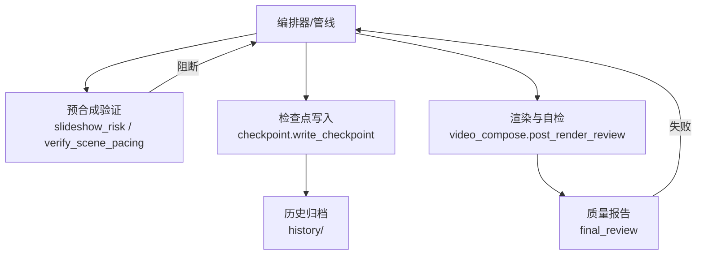
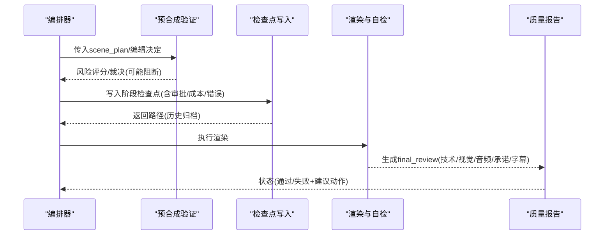
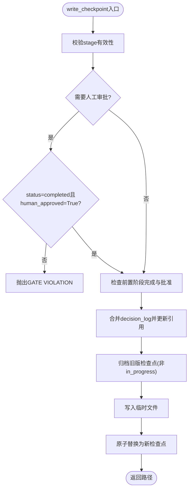
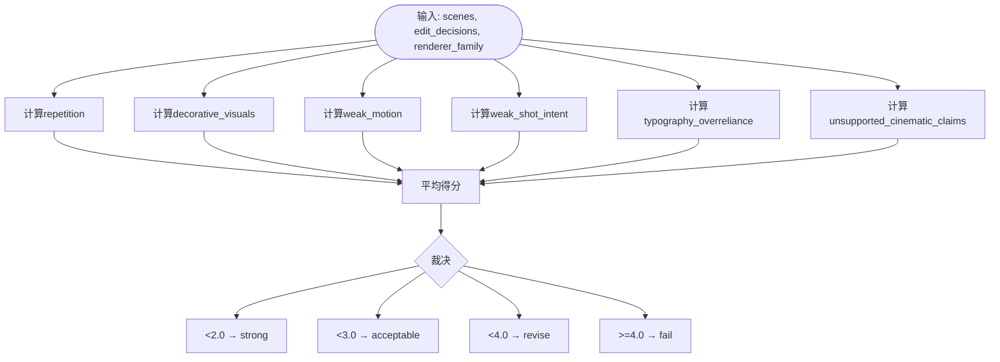
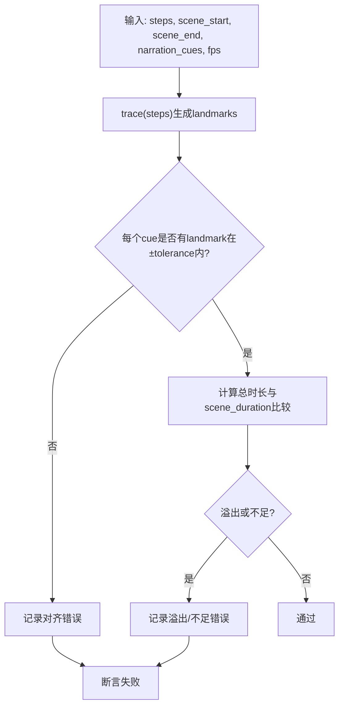
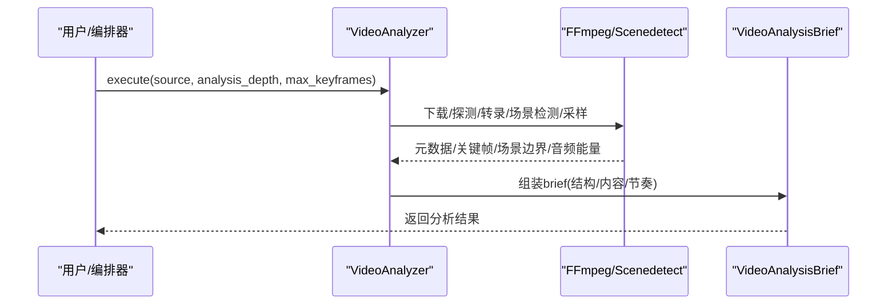
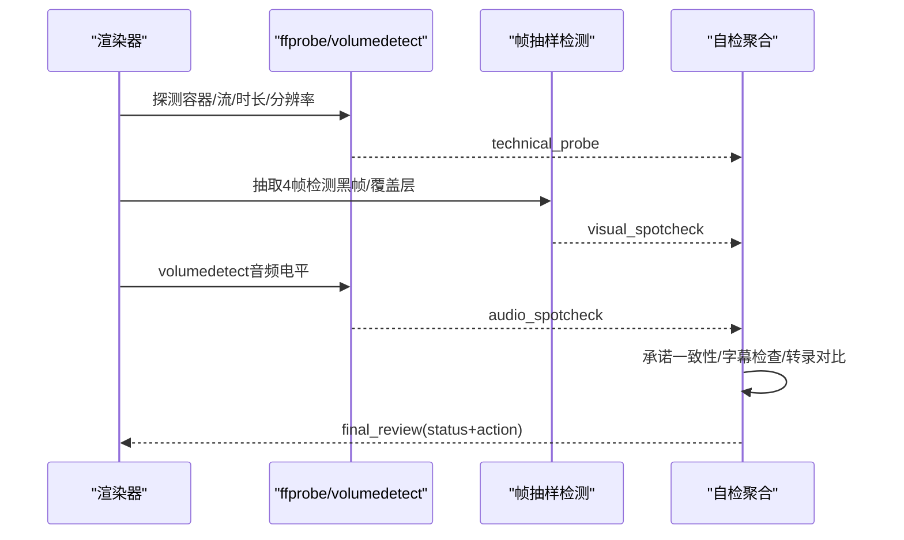
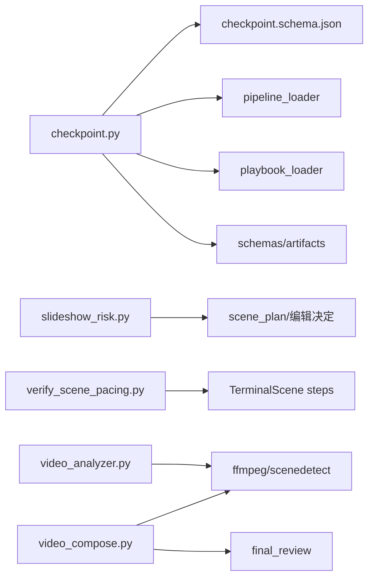

# 质量门禁

<cite>
**本文引用的文件**
- [lib/checkpoint.py](file://lib/checkpoint.py)
- [schemas/checkpoints/checkpoint.schema.json](file://schemas/checkpoints/checkpoint.schema.json)
- [lib/verify_scene_pacing.py](file://lib/verify_scene_pacing.py)
- [lib/slideshow_risk.py](file://lib/slideshow_risk.py)
- [tools/analysis/video_analyzer.py](file://tools/analysis/video_analyzer.py)
- [tools/video/video_compose.py](file://tools/video/video_compose.py)
- [config.yaml](file://config.yaml)
- [README.md](file://README.md)
</cite>

## 目录
1. [简介](#简介)
2. [项目结构](#项目结构)
3. [核心组件](#核心组件)
4. [架构总览](#架构总览)
5. [详细组件分析](#详细组件分析)
6. [依赖关系分析](#依赖关系分析)
7. [性能考量](#性能考量)
8. [故障排查指南](#故障排查指南)
9. [结论](#结论)
10. [附录](#附录)

## 简介
本技术文档面向OpenMontage的质量门禁系统，聚焦以下能力：
- 预合成验证：在渲染前拦截不合规计划（如交付承诺违背、幻灯片风险过高、渲染器缺失等）。
- 后渲染自检：对输出进行ffprobe校验、黑帧与覆盖层检测、音频电平分析、字幕检查、承诺一致性核验。
- 幻灯片风险评估：从重复性、装饰性视觉、弱运动、弱镜头意图、过度依赖排版、未支持的“电影化”声明六个维度评分并给出裁决。
- 检查点协议：状态持久化、版本管理、审计追踪、前置阶段强制审批、归档历史。
- 场景节奏验证：时间轴分析、转场检测、内容密度评估，确保画面与旁白对齐。
- 阈值配置与自定义规则：提供可配置的阈值与扩展点。
- 自动检测与修复策略：基于检查结果生成建议动作（重渲染、退回上游、修正参数等）。
- 质量报告与指标监控：结构化报告输出与关键指标汇总。

## 项目结构
质量门禁相关代码主要分布在以下位置：
- 检查点与治理：lib/checkpoint.py 与 schemas/checkpoints/checkpoint.schema.json
- 预合成质量：lib/slideshow_risk.py（幻灯片风险）、lib/verify_scene_pacing.py（节奏对齐）
- 视频分析与自检：tools/analysis/video_analyzer.py（参考视频分析）、tools/video/video_compose.py（渲染后自检）
- 全局配置：config.yaml（检查点策略、输出规格等）
- 高层说明：README.md（质量门禁概述）

图表来源
- [lib/checkpoint.py:422-564](file://lib/checkpoint.py#L422-L564)
- [lib/slideshow_risk.py:26-87](file://lib/slideshow_risk.py#L26-L87)
- [lib/verify_scene_pacing.py:83-131](file://lib/verify_scene_pacing.py#L83-L131)
- [tools/video/video_compose.py:2356-2696](file://tools/video/video_compose.py#L2356-L2696)

章节来源
- [README.md:656-662](file://README.md#L656-L662)

## 核心组件
- 检查点协议（Checkpoint Protocol）：负责阶段状态持久化、版本控制、审批门控、前置阶段校验、决策日志合并与历史归档。
- 幻灯片风险评估（Slideshow Risk Scorer）：对场景计划进行六维打分，输出平均得分与裁决（strong/acceptable/revise/fail）。
- 场景节奏验证（Scene Pacing Verifier）：将步骤时间轴与旁白提示对齐，检测溢出或不足，保证叙事与画面同步。
- 视频分析工具（Video Analyzer）：对参考视频进行结构、风格、转场、节奏等分析，为规划与质检提供数据基础。
- 渲染后自检（Post-render Self-review）：调用ffprobe、音频分析、抽样帧检测、承诺一致性检查，生成最终审查报告。

章节来源
- [lib/checkpoint.py:160-191](file://lib/checkpoint.py#L160-L191)
- [lib/checkpoint.py:284-346](file://lib/checkpoint.py#L284-L346)
- [lib/checkpoint.py:422-564](file://lib/checkpoint.py#L422-L564)
- [lib/slideshow_risk.py:26-87](file://lib/slideshow_risk.py#L26-L87)
- [lib/verify_scene_pacing.py:33-80](file://lib/verify_scene_pacing.py#L33-L80)
- [lib/verify_scene_pacing.py:83-131](file://lib/verify_scene_pacing.py#L83-L131)
- [tools/analysis/video_analyzer.py:149-182](file://tools/analysis/video_analyzer.py#L149-L182)
- [tools/video/video_compose.py:2356-2696](file://tools/video/video_compose.py#L2356-L2696)

## 架构总览
质量门禁贯穿“计划—渲染—发布”全链路：
- 计划阶段：通过幻灯片风险评分与节奏验证，阻止低质量计划进入渲染。
- 渲染阶段：执行自检，若失败则拒绝呈现并建议修复动作。
- 治理阶段：检查点记录每个阶段的审批、成本快照、错误信息，支持回溯与审计。

图表来源
- [lib/checkpoint.py:422-564](file://lib/checkpoint.py#L422-L564)
- [lib/slideshow_risk.py:26-87](file://lib/slideshow_risk.py#L26-L87)
- [tools/video/video_compose.py:2356-2696](file://tools/video/video_compose.py#L2356-L2696)

## 详细组件分析

### 检查点协议（Checkpoint Protocol）
- 功能要点
  - 阶段合法性校验：根据pipeline_type解析有效阶段列表，拒绝非法stage。
  - 前置阶段强制：仅允许在全部前置阶段完成且必要时已获批的情况下推进到awaiting_human/completed。
  - 审批门控：若manifest或调用方要求人工审批，则completed必须附带human_approved=True，否则抛出错误。
  - 历史归档：覆盖非in_progress的检查点时，复制到history目录保留版本轨迹。
  - 决策日志合并：将decision_log合并到项目级文件，并在proposal_packet/render_report中引用。
  - 样式播放清单校验：写入时校验style_playbook是否可加载。
- 数据结构与约束
  - 使用JSON Schema定义checkpoint结构，包含version、project_id、pipeline_type、stage、status、timestamp、artifacts、review、cost_snapshot、error、metadata等字段。
  - status枚举限制为completed/failed/awaiting_human/in_progress；checkpoint_policy限定guided/manual_all/auto_noncreative。
- 复杂度与性能
  - 写操作采用临时文件+原子替换，避免部分写入导致损坏。
  - 历史归档为拷贝而非移动，兼容Windows下文件被占用的情况。
  - 读取与验证使用lru_cache缓存schema，减少IO开销。

图表来源
- [lib/checkpoint.py:422-564](file://lib/checkpoint.py#L422-L564)
- [lib/checkpoint.py:284-346](file://lib/checkpoint.py#L284-L346)
- [schemas/checkpoints/checkpoint.schema.json:1-47](file://schemas/checkpoints/checkpoint.schema.json#L1-L47)

章节来源
- [lib/checkpoint.py:160-191](file://lib/checkpoint.py#L160-L191)
- [lib/checkpoint.py:251-281](file://lib/checkpoint.py#L251-L281)
- [lib/checkpoint.py:284-346](file://lib/checkpoint.py#L284-L346)
- [lib/checkpoint.py:349-386](file://lib/checkpoint.py#L349-L386)
- [lib/checkpoint.py:392-419](file://lib/checkpoint.py#L392-L419)
- [lib/checkpoint.py:422-564](file://lib/checkpoint.py#L422-L564)
- [schemas/checkpoints/checkpoint.schema.json:1-47](file://schemas/checkpoints/checkpoint.schema.json#L1-L47)

### 幻灯片风险评估（Slideshow Risk Scorer）
- 维度与评分
  - repetition：场景类型、描述相似度、镜头尺寸重复度。
  - decorative_visuals：缺乏信息角色/叙事角色/镜头意图的场景比例。
  - weak_motion：存在运动但无镜头意图的比例。
  - weak_shot_intent：缺少shot_intent的场景比例。
  - typography_overreliance：文本/统计卡片类场景占比。
  - unsupported_cinematic_claims：声称“电影化”但缺乏英雄时刻、运动、灯光等结构支撑。
- 裁决阈值
  - <2.0 strong；<3.0 acceptable；<4.0 revise；>=4.0 fail（不应进入compose）。
- 集成点
  - 作为预合成验证的一部分，结合交付承诺（delivery promise）与渲染器家族（renderer_family）共同决定是否放行。

图表来源
- [lib/slideshow_risk.py:26-87](file://lib/slideshow_risk.py#L26-L87)
- [lib/slideshow_risk.py:90-256](file://lib/slideshow_risk.py#L90-L256)

章节来源
- [lib/slideshow_risk.py:26-87](file://lib/slideshow_risk.py#L26-L87)
- [lib/slideshow_risk.py:90-256](file://lib/slideshow_risk.py#L90-L256)

### 场景节奏验证（Scene Pacing Verifier）
- 算法要点
  - step_duration：按步骤类型（cmd/out/pause/pill）与fps计算每步时长，精确到帧。
  - trace：遍历steps生成可见事件的时间地标（landmarks），用于与旁白提示对齐。
  - assert_alignment：校验每个旁白提示是否在tolerance秒内匹配到画面地标；同时检查总时长是否溢出或不足。
- 适用场景
  - TerminalScene等基于步骤的可视化场景，确保旁白与命令/输出显示严格同步。

图表来源
- [lib/verify_scene_pacing.py:33-80](file://lib/verify_scene_pacing.py#L33-L80)
- [lib/verify_scene_pacing.py:83-131](file://lib/verify_scene_pacing.py#L83-L131)

章节来源
- [lib/verify_scene_pacing.py:33-80](file://lib/verify_scene_pacing.py#L33-L80)
- [lib/verify_scene_pacing.py:83-131](file://lib/verify_scene_pacing.py#L83-L131)

### 视频分析与转场检测（Video Analyzer）
- 能力范围
  - 下载与元数据获取、转录、场景检测、关键帧提取、音频能量分析。
  - 输出结构化VideoAnalysisBrief，包含结构分析（场景数、场景列表、节奏画像）与内容摘要。
- 节奏分类
  - 依据场景时长均值划分节奏风格（slow_contemplative/steady_educational/dynamic_social/rapid_fire）。
- 用途
  - 为规划阶段提供客观数据，辅助制定剪辑与转场策略，并为后续质量门禁提供输入。

图表来源
- [tools/analysis/video_analyzer.py:149-182](file://tools/analysis/video_analyzer.py#L149-L182)
- [tools/analysis/video_analyzer.py:625-659](file://tools/analysis/video_analyzer.py#L625-L659)

章节来源
- [tools/analysis/video_analyzer.py:149-182](file://tools/analysis/video_analyzer.py#L149-L182)
- [tools/analysis/video_analyzer.py:625-659](file://tools/analysis/video_analyzer.py#L625-L659)

### 渲染后自检（Post-render Self-review）
- 检查项
  - 容器与流合法性（ffprobe）、分辨率与码率、目标时长漂移。
  - 视觉抽检：抽取4个时间点帧，检测黑帧与覆盖层异常。
  - 音频抽检：volumedetect分析静音与削波，判断混音可懂度。
  - 承诺一致性：对比交付承诺与实际输出。
  - 字幕检查：确认字幕存在性与基本正确性。
  - 转录对比：可选地对比输出与预期转录。
- 输出
  - final_review包含status、checks、issues_found、recommended_action（如re_render、send-back等）。

图表来源
- [tools/video/video_compose.py:2356-2696](file://tools/video/video_compose.py#L2356-L2696)

章节来源
- [tools/video/video_compose.py:2356-2696](file://tools/video/video_compose.py#L2356-L2696)

## 依赖关系分析
- 模块耦合
  - checkpoint.py依赖pipeline_loader（解析manifest阶段顺序与审批默认值）、styles.playbook_loader（样式播放清单校验）、schemas.artifacts（产物Schema校验）。
  - slideshow_risk.py与verify_scene_pacing.py为纯函数式模块，低耦合，便于单元测试与复用。
  - video_analyzer.py依赖外部工具（ffmpeg、scenedetect、yt-dlp等），以本地方式运行，零API密钥。
  - video_compose.py在渲染后调用ffprobe与ffmpeg进行自检，产出结构化报告。
- 外部依赖
  - JSON Schema验证（jsonschema）。
  - 文件系统操作（Path、shutil、os.replace）。
  - 音视频处理（ffmpeg、ffprobe）。

图表来源
- [lib/checkpoint.py:160-191](file://lib/checkpoint.py#L160-L191)
- [lib/checkpoint.py:251-281](file://lib/checkpoint.py#L251-L281)
- [lib/slideshow_risk.py:26-87](file://lib/slideshow_risk.py#L26-L87)
- [lib/verify_scene_pacing.py:83-131](file://lib/verify_scene_pacing.py#L83-L131)
- [tools/analysis/video_analyzer.py:149-182](file://tools/analysis/video_analyzer.py#L149-L182)
- [tools/video/video_compose.py:2356-2696](file://tools/video/video_compose.py#L2356-L2696)

章节来源
- [lib/checkpoint.py:160-191](file://lib/checkpoint.py#L160-L191)
- [lib/checkpoint.py:251-281](file://lib/checkpoint.py#L251-L281)
- [lib/slideshow_risk.py:26-87](file://lib/slideshow_risk.py#L26-L87)
- [lib/verify_scene_pacing.py:83-131](file://lib/verify_scene_pacing.py#L83-L131)
- [tools/analysis/video_analyzer.py:149-182](file://tools/analysis/video_analyzer.py#L149-L182)
- [tools/video/video_compose.py:2356-2696](file://tools/video/video_compose.py#L2356-L2696)

## 性能考量
- 检查点写入
  - 临时文件+原子替换避免部分写入损坏。
  - 历史归档为拷贝，容忍Windows文件占用导致的移动失败。
  - schema缓存减少重复IO。
- 视频分析
  - 关键帧数量可控（max_keyframes），避免过大内存占用。
  - 场景检测与转录按需启用（analysis_depth），平衡深度与耗时。
- 自检
  - ffprobe与volumedetect为轻量级探针，超时保护（timeout=60s）防止阻塞。
  - 帧抽样固定为4个时间点，降低I/O压力。

[本节为通用指导，无需特定文件引用]

## 故障排查指南
- 常见错误与定位
  - GATE VIOLATION：在需要人工审批的阶段直接写入completed且未设置human_approved=True。需改为awaiting_human，待审批后再写completed并设置human_approved=True。
  - PREREQUISITE VIOLUTION：前置阶段未完成或未获批。需补齐前置阶段并完成审批。
  - 未知或无效style_playbook：检查styles目录是否存在对应播放清单，或修正名称。
  - ffprobe不可用：确保安装ffmpeg并将可执行文件加入PATH。
  - 音频问题：检查volumedetect输出的mean_volume与max_volume，识别静音或削波。
  - 时长漂移：对比target_duration与实际duration，调整剪辑或转场。
- 建议动作
  - re_render：输出容器/流或音频不合格时重新渲染。
  - send-back：计划或资产不满足质量要求时退回上游阶段修正。
  - revise：调整阈值或规则（如幻灯片风险阈值、节奏容差）。

章节来源
- [lib/checkpoint.py:467-494](file://lib/checkpoint.py#L467-L494)
- [lib/checkpoint.py:284-346](file://lib/checkpoint.py#L284-L346)
- [tools/video/video_compose.py:2356-2696](file://tools/video/video_compose.py#L2356-L2696)

## 结论
OpenMontage的质量门禁体系以检查点协议为核心，贯穿计划、渲染与发布全流程。通过预合成验证（幻灯片风险、节奏对齐）与后渲染自检（容器/流、视觉/音频、承诺一致性），系统能在早期拦截低质量计划，并在渲染后确保输出符合标准。检查点协议提供强一致的状态管理与审计追踪，支持人类审批与历史回溯。配合可配置的阈值与可扩展的规则，质量门禁既能保障稳定性，又具备灵活适配不同管线与风格的能力。

[本节为总结性内容，无需特定文件引用]

## 附录

### 质量阈值配置与自定义规则
- 全局配置（config.yaml）
  - checkpoint.policy：guided | manual_all | auto_noncreative，控制检查点策略。
  - output.*：默认格式、编码、分辨率、帧率、CRF等，影响自检阈值（如分辨率过低告警）。
- 幻灯片风险阈值
  - 当前实现使用固定阈值（<2.0 strong, <3.0 acceptable, <4.0 revise, >=4.0 fail）。可在score_slideshow_risk中调整判定分支以定制阈值。
- 节奏验证容差
  - assert_alignment的tolerance参数控制旁白与画面的对齐容差（默认1.0秒），可按内容类型调优。
- 自定义规则扩展点
  - 在pre-compose阶段增加新的检查函数，组合slideshow_risk与verify_scene_pacing的结果，形成复合裁决。
  - 在post-render自检中扩展visual/audio/promises子检查，新增指标并纳入final_review。

章节来源
- [config.yaml:1-34](file://config.yaml#L1-L34)
- [lib/slideshow_risk.py:73-87](file://lib/slideshow_risk.py#L73-L87)
- [lib/verify_scene_pacing.py:83-131](file://lib/verify_scene_pacing.py#L83-L131)

### 质量报告生成与指标监控
- 报告结构
  - final_review包含technical_probe、visual_spotcheck、audio_spotcheck、promise_preservation、subtitle_check、transcript_comparison等子项，以及issues_found与recommended_action。
- 指标监控
  - 技术层面：容器合法性、分辨率、时长漂移、音频电平（mean/max volume）。
  - 视觉层面：黑帧比例、覆盖层异常。
  - 承诺层面：实际输出与交付承诺的一致性。
  - 字幕层面：是否存在与基本正确性。
- 输出与集成
  - 报告可作为artifact写入检查点，供Backlot板展示与审计。
  - 结合decision_log与cost_snapshot，形成完整的治理闭环。

章节来源
- [tools/video/video_compose.py:2671-2696](file://tools/video/video_compose.py#L2671-L2696)
- [lib/checkpoint.py:518-531](file://lib/checkpoint.py#L518-L531)