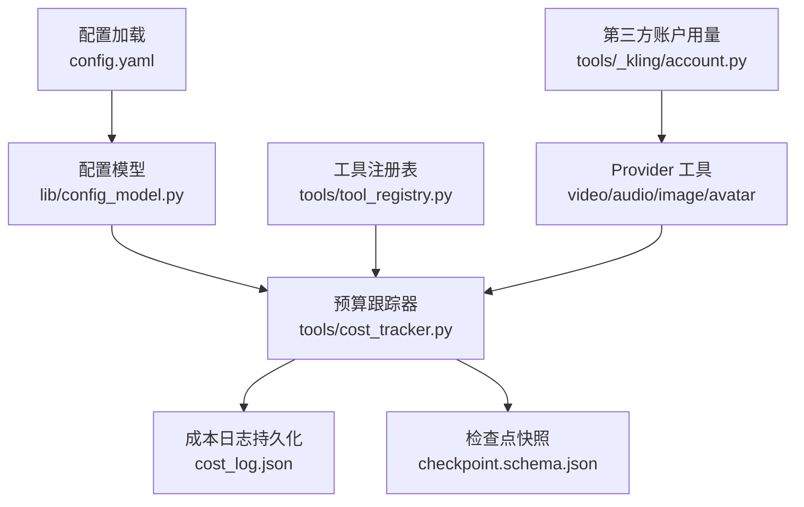
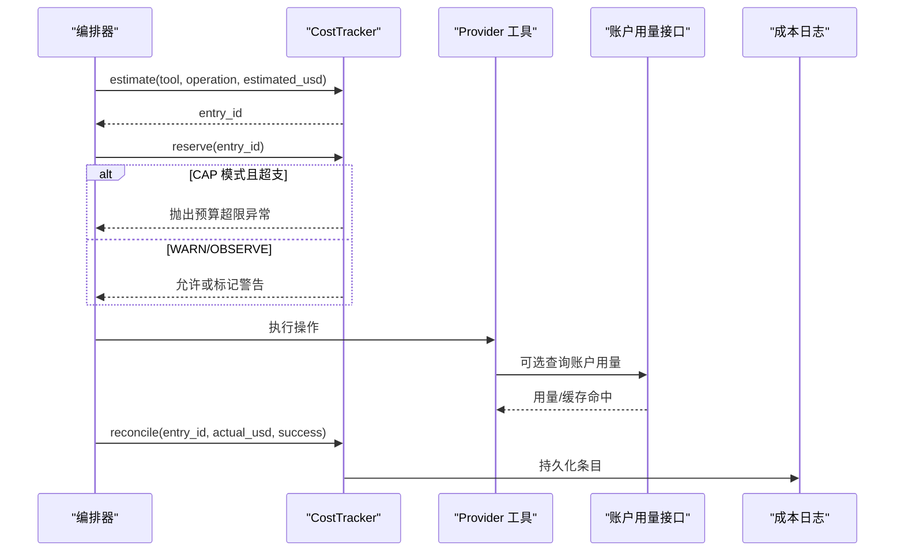
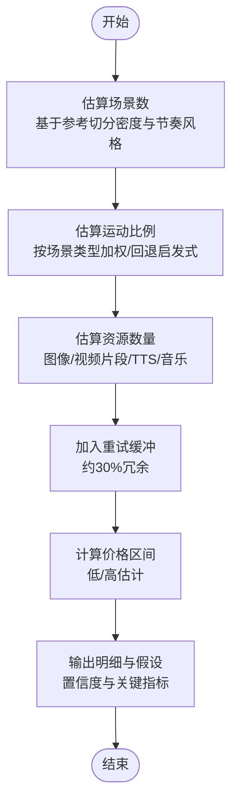
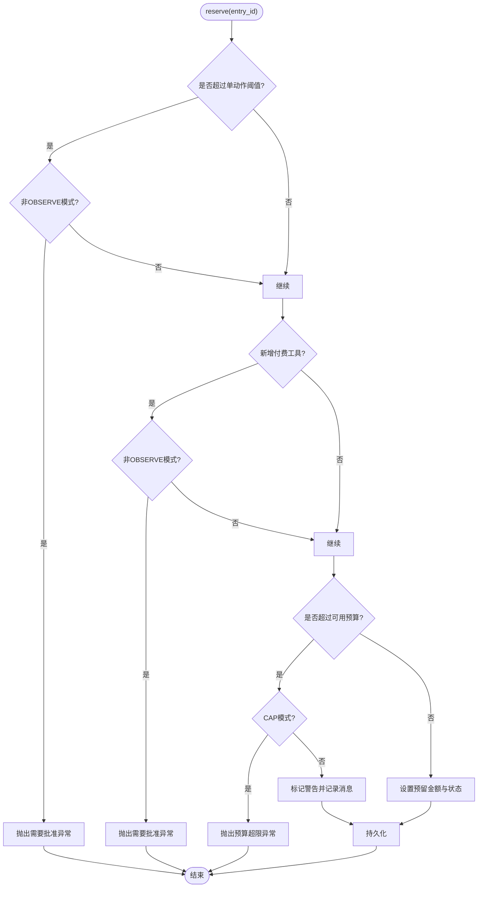
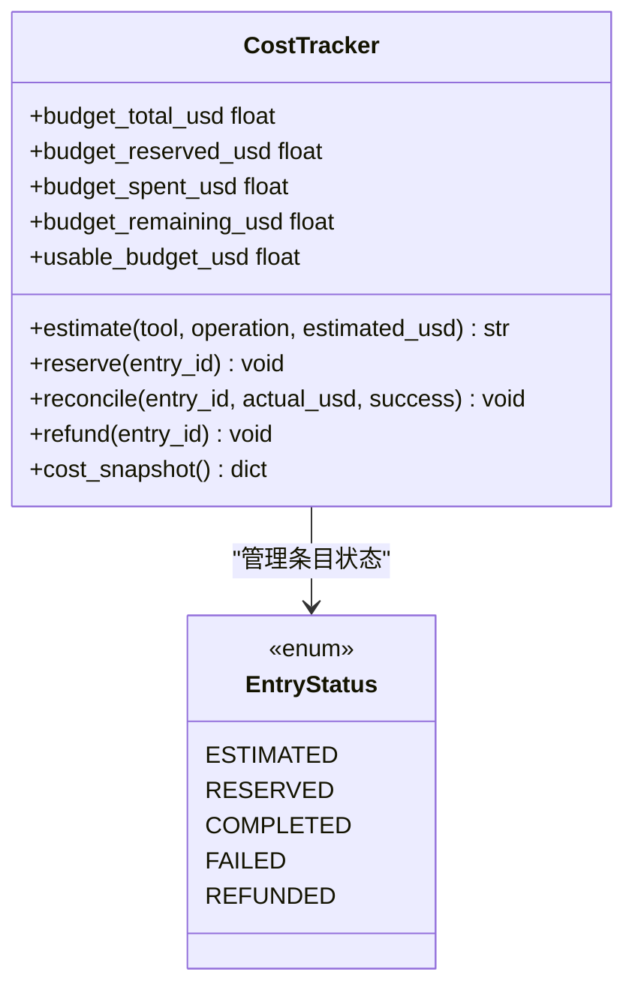
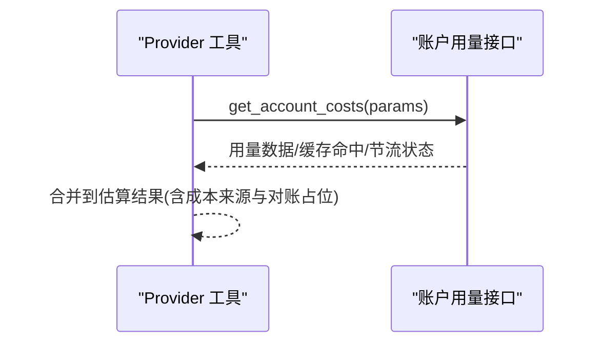
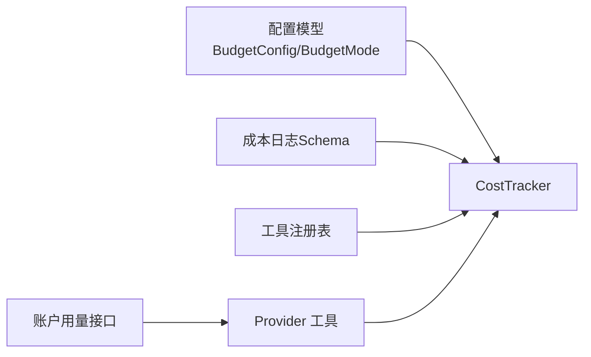

# 预算控制

<cite>
**本文引用的文件**
- [tools/cost_tracker.py](file://tools/cost_tracker.py)
- [lib/config_model.py](file://lib/config_model.py)
- [config.yaml](file://config.yaml)
- [schemas/artifacts/cost_log.schema.json](file://schemas/artifacts/cost_log.schema.json)
- [schemas/checkpoints/checkpoint.schema.json](file://schemas/checkpoints/checkpoint.schema.json)
- [tools/tool_registry.py](file://tools/tool_registry.py)
- [tests/contracts/test_phase0_contracts.py](file://tests/contracts/test_phase0_contracts.py)
- [tests/tools/test_cost_tracker_governance.py](file://tests/tools/test_cost_tracker_governance.py)
- [tools/video/kling_official_video.py](file://tools/video/kling_official_video.py)
- [tools/audio/kling_tts.py](file://tools/audio/kling_tts.py)
- [tools/avatar/kling_avatar.py](file://tools/avatar/kling_avatar.py)
- [tools/graphics/kling_official_image.py](file://tools/graphics/kling_official_image.py)
- [tools/_kling/account.py](file://tools/_kling/account.py)
</cite>

## 目录
1. [简介](#简介)
2. [项目结构](#项目结构)
3. [核心组件](#核心组件)
4. [架构总览](#架构总览)
5. [详细组件分析](#详细组件分析)
6. [依赖关系分析](#依赖关系分析)
7. [性能考虑](#性能考虑)
8. [故障排查指南](#故障排查指南)
9. [结论](#结论)
10. [附录](#附录)

## 简介
本技术文档聚焦 OpenMontage 的预算控制系统，系统围绕“估算—预留—对账”的主线，提供全局与项目级的预算治理、实时超支预警、以及实际支出追踪。成本模型覆盖 API 调用成本、本地计算资源消耗（通过工具资源画像）与第三方服务费用（含账户用量上下文）。预算控制支持观察、警告与硬性封顶三种模式，并具备单动作审批与新增付费工具审批机制。持久化采用 JSON 日志，并与检查点快照中的成本摘要集成，便于报表生成与审计。

## 项目结构
预算控制相关代码主要分布在以下位置：
- 预算跟踪核心：tools/cost_tracker.py
- 配置模型与枚举：lib/config_model.py
- 全局配置：config.yaml
- 成本日志数据契约：schemas/artifacts/cost_log.schema.json
- 检查点快照中的成本摘要字段：schemas/checkpoints/checkpoint.schema.json
- 工具注册与能力发现：tools/tool_registry.py
- 第三方服务账户用量与成本估算辅助：tools/_kling/account.py 及多个 provider 工具类
- 行为验证测试：tests/contracts/test_phase0_contracts.py、tests/tools/test_cost_tracker_governance.py

图表来源
- [config.yaml:9-14](file://config.yaml#L9-L14)
- [lib/config_model.py:16-41](file://lib/config_model.py#L16-L41)
- [tools/cost_tracker.py:40-97](file://tools/cost_tracker.py#L40-L97)
- [schemas/artifacts/cost_log.schema.json:1-35](file://schemas/artifacts/cost_log.schema.json#L1-L35)
- [schemas/checkpoints/checkpoint.schema.json:31-46](file://schemas/checkpoints/checkpoint.schema.json#L31-L46)
- [tools/tool_registry.py:55-176](file://tools/tool_registry.py#L55-L176)
- [tools/_kling/account.py:72-107](file://tools/_kling/account.py#L72-L107)

章节来源
- [config.yaml:9-14](file://config.yaml#L9-L14)
- [lib/config_model.py:16-41](file://lib/config_model.py#L16-L41)
- [tools/cost_tracker.py:40-97](file://tools/cost_tracker.py#L40-L97)
- [schemas/artifacts/cost_log.schema.json:1-35](file://schemas/artifacts/cost_log.schema.json#L1-L35)
- [schemas/checkpoints/checkpoint.schema.json:31-46](file://schemas/checkpoints/checkpoint.schema.json#L31-L46)
- [tools/tool_registry.py:55-176](file://tools/tool_registry.py#L55-L176)
- [tools/_kling/account.py:72-107](file://tools/_kling/account.py#L72-L107)

## 核心组件
- 预算跟踪器 CostTracker：实现估算、预留、对账、退款、参考驱动估算、持久化等核心能力。
- 配置模型 BudgetConfig/BudgetMode：定义预算模式、总额、预留比例、单动作审批阈值、新增付费工具审批开关。
- 成本日志 Schema：规范 cost_log.json 的结构，确保条目状态机与数值约束一致。
- 检查点快照成本摘要：在 checkpoint 中记录 total_spent_usd、total_reserved_usd、budget_remaining_usd，用于阶段级成本快照。
- 工具注册表 ToolRegistry：负责工具发现、能力报告、资源画像（如 VRAM、网络需求），为成本估算提供上下文。
- 第三方账户用量：provider 工具通过 get_account_costs 获取账户维度用量，辅助估算与对账。

章节来源
- [tools/cost_tracker.py:40-180](file://tools/cost_tracker.py#L40-L180)
- [lib/config_model.py:16-41](file://lib/config_model.py#L16-L41)
- [schemas/artifacts/cost_log.schema.json:1-35](file://schemas/artifacts/cost_log.schema.json#L1-L35)
- [schemas/checkpoints/checkpoint.schema.json:31-46](file://schemas/checkpoints/checkpoint.schema.json#L31-L46)
- [tools/tool_registry.py:55-176](file://tools/tool_registry.py#L55-L176)
- [tools/_kling/account.py:72-107](file://tools/_kling/account.py#L72-L107)

## 架构总览
预算控制贯穿“预检—执行—结算”全链路：
- 预检阶段：工具通过注册表暴露能力与资源画像；CostTracker 根据视频分析简报与工具计划进行参考驱动估算，生成明细项与置信度。
- 执行阶段：在 reserve 时进行可用性校验、单动作审批、新增付费工具审批与可用预算检查；CAP 模式下超支直接阻断，WARN 模式标记警告。
- 结算阶段：reconcile 将实际花费写入条目并释放预留；refund 取消预留；所有变更持久化到 cost_log.json。
- 监控与报表：通过 cost_snapshot 与 checkpoint 的成本摘要输出当前预算状态；provider 工具可返回账户用量上下文以增强估算准确性。

图表来源
- [tools/cost_tracker.py:101-180](file://tools/cost_tracker.py#L101-L180)
- [tools/_kling/account.py:72-107](file://tools/_kling/account.py#L72-L107)
- [schemas/artifacts/cost_log.schema.json:1-35](file://schemas/artifacts/cost_log.schema.json#L1-L35)

## 详细组件分析

### 成本估算算法（参考驱动）
- 输入：视频分析简报（结构分析、节奏风格、场景列表、旁白转录）、目标时长、工具计划（各资产类型的工具与单价）。
- 场景数估算：基于参考视频的切分密度与节奏风格的最小值策略，避免线性缩放导致画面单调。
- 运动比例估算：按场景视觉类型加权计算运动比例，未知类型回退到节奏/来源类型启发式。
- 资源数量估算：图像、视频片段、TTS 字数、音乐曲目等，结合重试缓冲（约 30%）与覆盖率（片段时长限制）。
- 输出：分项明细、总价、价格区间、样本成本、置信度、假设说明、关键指标（场景/图像/片段/字数/运动比/切分频率）。

图表来源
- [tools/cost_tracker.py:183-398](file://tools/cost_tracker.py#L183-L398)
- [tools/cost_tracker.py:400-483](file://tools/cost_tracker.py#L400-L483)

章节来源
- [tools/cost_tracker.py:183-483](file://tools/cost_tracker.py#L183-L483)

### 预算预留与治理
- 单动作审批：当预估成本超过单动作阈值时，在非 OBSERVE 模式下要求人工批准。
- 新增付费工具审批：首次使用付费工具需批准（可配置）。
- 可用预算检查：预留金额不得超过可用预算（总额减去已花费与预留，再扣除预留保留比例）。
- 模式差异：
  - CAP：超支直接抛出预算超限异常，阻止执行。
  - WARN：超支标记警告并记录消息，允许继续。
  - OBSERVE：仅记录不干预。
- 持久化：每次状态变更写入 cost_log.json，支持跨进程重启恢复。

图表来源
- [tools/cost_tracker.py:117-158](file://tools/cost_tracker.py#L117-L158)
- [lib/config_model.py:16-41](file://lib/config_model.py#L16-L41)

章节来源
- [tools/cost_tracker.py:117-180](file://tools/cost_tracker.py#L117-L180)
- [lib/config_model.py:16-41](file://lib/config_model.py#L16-L41)
- [tests/contracts/test_phase0_contracts.py:475-506](file://tests/contracts/test_phase0_contracts.py#L475-L506)
- [tests/tools/test_cost_tracker_governance.py:15-56](file://tests/tools/test_cost_tracker_governance.py#L15-L56)

### 实际支出追踪与报表
- 条目状态机：estimated → reserved → completed/failed/refunded。
- 对账 reconcile：写入实际花费，释放预留，更新已花费合计。
- 快照与报表：
  - cost_snapshot：汇总 total_spent_usd、total_reserved_usd、budget_remaining_usd。
  - checkpoint 快照：包含 cost_snapshot 字段，便于阶段级成本概览。
  - cost_log.json：完整条目历史，支持审计与报表生成。

图表来源
- [tools/cost_tracker.py:22-97](file://tools/cost_tracker.py#L22-L97)
- [schemas/artifacts/cost_log.schema.json:1-35](file://schemas/artifacts/cost_log.schema.json#L1-L35)
- [schemas/checkpoints/checkpoint.schema.json:31-46](file://schemas/checkpoints/checkpoint.schema.json#L31-L46)

章节来源
- [tools/cost_tracker.py:22-97](file://tools/cost_tracker.py#L22-L97)
- [schemas/artifacts/cost_log.schema.json:1-35](file://schemas/artifacts/cost_log.schema.json#L1-L35)
- [schemas/checkpoints/checkpoint.schema.json:31-46](file://schemas/checkpoints/checkpoint.schema.json#L31-L46)

### 第三方服务费用与账户用量
- 多 provider 工具（视频、音频、图像、头像）在估算阶段可选择性拉取账户用量上下文，提升估算准确度。
- 账户用量接口具备缓存与节流保护，按 API 身份与作用域键控，避免重复请求。
- 错误处理：若拉取失败，返回错误信息并保持估算流程继续。

图表来源
- [tools/video/kling_official_video.py:649-688](file://tools/video/kling_official_video.py#L649-L688)
- [tools/audio/kling_tts.py:324-340](file://tools/audio/kling_tts.py#L324-L340)
- [tools/avatar/kling_avatar.py:326-342](file://tools/avatar/kling_avatar.py#L326-L342)
- [tools/graphics/kling_official_image.py:433-449](file://tools/graphics/kling_official_image.py#L433-L449)
- [tools/_kling/account.py:72-107](file://tools/_kling/account.py#L72-L107)

章节来源
- [tools/video/kling_official_video.py:649-688](file://tools/video/kling_official_video.py#L649-L688)
- [tools/audio/kling_tts.py:324-340](file://tools/audio/kling_tts.py#L324-L340)
- [tools/avatar/kling_avatar.py:326-342](file://tools/avatar/kling_avatar.py#L326-L342)
- [tools/graphics/kling_official_image.py:433-449](file://tools/graphics/kling_official_image.py#L433-L449)
- [tools/_kling/account.py:72-107](file://tools/_kling/account.py#L72-L107)

### 工具级成本限制与资源画像
- 工具注册表提供资源画像（VRAM、网络需求）与能力分组，供编排器在预检时评估资源与成本影响。
- 可通过 provider_menu_summary 快速了解各能力的可用性与安装提示，间接影响成本路径选择。

章节来源
- [tools/tool_registry.py:55-176](file://tools/tool_registry.py#L55-L176)
- [tools/tool_registry.py:249-471](file://tools/tool_registry.py#L249-L471)

## 依赖关系分析
- CostTracker 依赖配置模型 BudgetMode 与 BudgetConfig，读取全局预算策略。
- 成本日志遵循 schema 约束，保证条目结构与状态机一致性。
- Provider 工具通过账户用量接口增强估算，同时受缓存与节流保护。
- 工具注册表为编排器提供能力与资源画像，间接影响成本路径与预算决策。

图表来源
- [lib/config_model.py:16-41](file://lib/config_model.py#L16-L41)
- [schemas/artifacts/cost_log.schema.json:1-35](file://schemas/artifacts/cost_log.schema.json#L1-L35)
- [tools/tool_registry.py:55-176](file://tools/tool_registry.py#L55-L176)
- [tools/_kling/account.py:72-107](file://tools/_kling/account.py#L72-L107)

章节来源
- [lib/config_model.py:16-41](file://lib/config_model.py#L16-L41)
- [schemas/artifacts/cost_log.schema.json:1-35](file://schemas/artifacts/cost_log.schema.json#L1-L35)
- [tools/tool_registry.py:55-176](file://tools/tool_registry.py#L55-L176)
- [tools/_kling/account.py:72-107](file://tools/_kling/account.py#L72-L107)

## 性能考虑
- 账户用量缓存：get_account_costs 按参数与 API 身份作用域缓存，减少重复请求与节流触发。
- 估算优化：参考驱动估算引入重试缓冲与覆盖率计算，避免过度生成与浪费。
- 持久化频率：每次状态变更写入日志，建议在高并发场景下批量化或异步落盘以降低 I/O 压力。
- 资源画像：利用工具注册表的资源画像（VRAM、网络）在预检阶段规避昂贵路径。

章节来源
- [tools/_kling/account.py:72-107](file://tools/_kling/account.py#L72-L107)
- [tools/cost_tracker.py:183-398](file://tools/cost_tracker.py#L183-L398)
- [tools/tool_registry.py:476-488](file://tools/tool_registry.py#L476-L488)

## 故障排查指南
- 预算超限：CAP 模式下 reserve 抛出预算超限异常，检查可用预算、预留比例与单动作阈值。
- 需要批准：单动作阈值或新增付费工具未获批准时抛出相应异常，确认审批流程或切换至 OBSERVE 模式调试。
- 账户用量拉取失败：provider 工具返回 account_usage_error，检查网络、鉴权与节流状态。
- 日志不一致：核对 cost_log.json 条目状态机与数值约束是否符合 schema。

章节来源
- [tools/cost_tracker.py:117-180](file://tools/cost_tracker.py#L117-L180)
- [tools/video/kling_official_video.py:649-688](file://tools/video/kling_official_video.py#L649-L688)
- [schemas/artifacts/cost_log.schema.json:1-35](file://schemas/artifacts/cost_log.schema.json#L1-L35)

## 结论
OpenMontage 的预算控制系统以 CostTracker 为核心，结合配置模型、工具注册表与第三方账户用量接口，实现了从估算、预留到对账的全链路成本控制。通过多模式治理（观察/警告/封顶）、审批机制与持久化日志，系统在保障创作灵活性的同时提供了严格的预算约束与可审计性。配合检查点快照与报表，可实现项目级与工具级的精细化成本管理。

## 附录

### 预算配置指南
- 全局预算设置（config.yaml）：
  - mode：observe | warn | cap
  - total_usd：预算总额
  - reserve_pct：预留保留比例
  - single_action_approval_usd：单动作审批阈值
  - require_approval_for_new_paid_tool：是否要求新增付费工具审批
- 项目级预算控制：通过 CostTracker 实例化参数注入预算策略，并在编排器中统一调度。
- 工具级成本限制：借助工具注册表的资源画像与能力分组，在预检阶段选择更经济的 provider 或降级路径。

章节来源
- [config.yaml:9-14](file://config.yaml#L9-L14)
- [lib/config_model.py:16-41](file://lib/config_model.py#L16-L41)
- [tools/tool_registry.py:249-471](file://tools/tool_registry.py#L249-L471)

### 最佳实践
- 预检优先：在编排器启动时调用工具注册表的能力报告，结合预算策略选择合适路径。
- 合理预留：根据任务复杂度调整 reserve_pct，平衡重试与清理空间。
- 审批策略：生产环境启用单动作审批与新增付费工具审批，开发调试可使用 observe 模式。
- 持续对账：每个工具执行后及时 reconcile，确保预算与实际一致。
- 报表审计：定期导出 cost_log.json 并结合 checkpoint 快照生成报表，识别高成本环节。

章节来源
- [tools/cost_tracker.py:101-180](file://tools/cost_tracker.py#L101-L180)
- [schemas/checkpoints/checkpoint.schema.json:31-46](file://schemas/checkpoints/checkpoint.schema.json#L31-L46)
- [tools/tool_registry.py:55-176](file://tools/tool_registry.py#L55-L176)