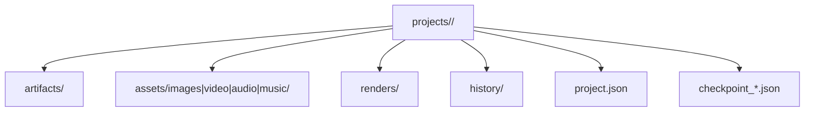
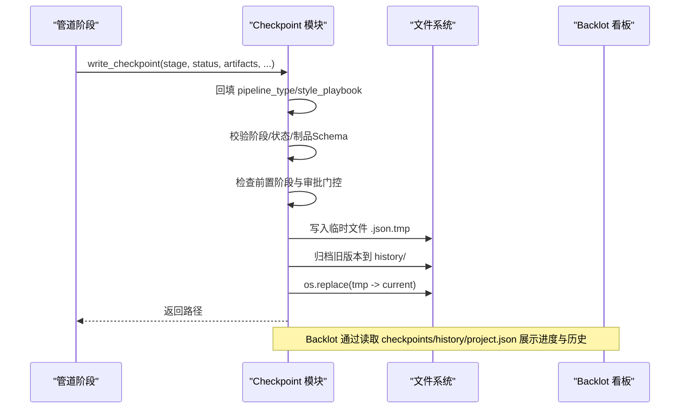
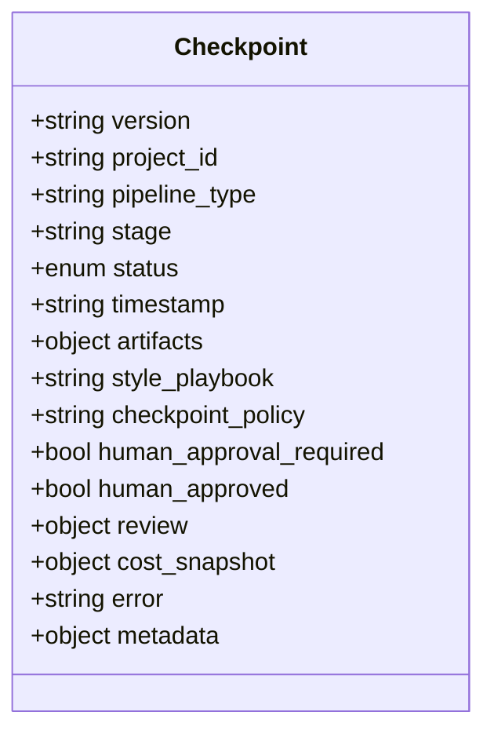
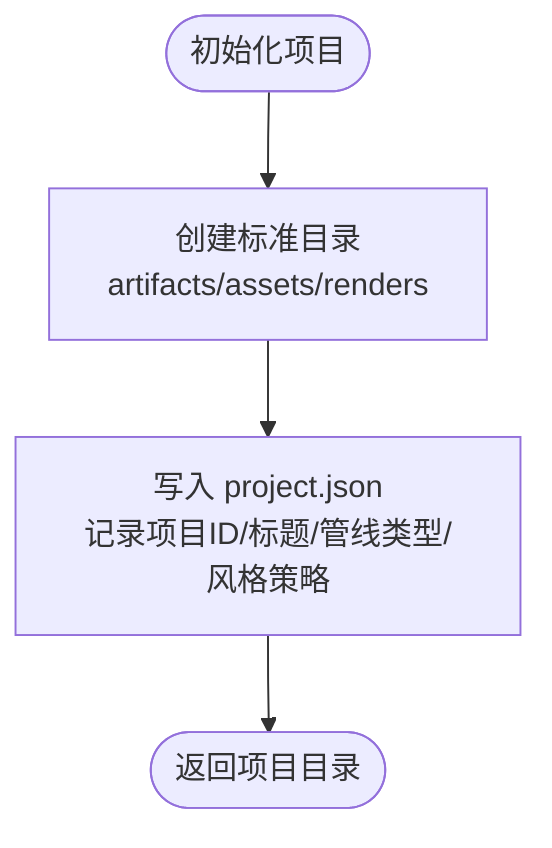
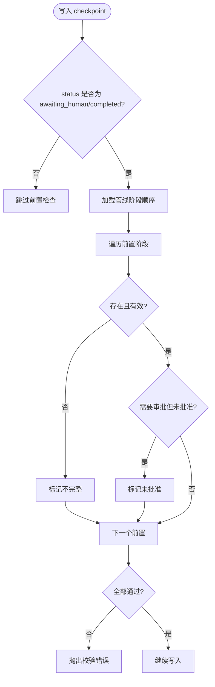
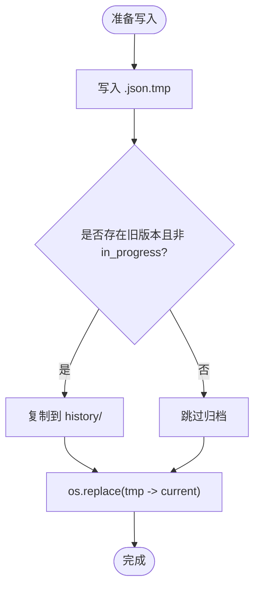
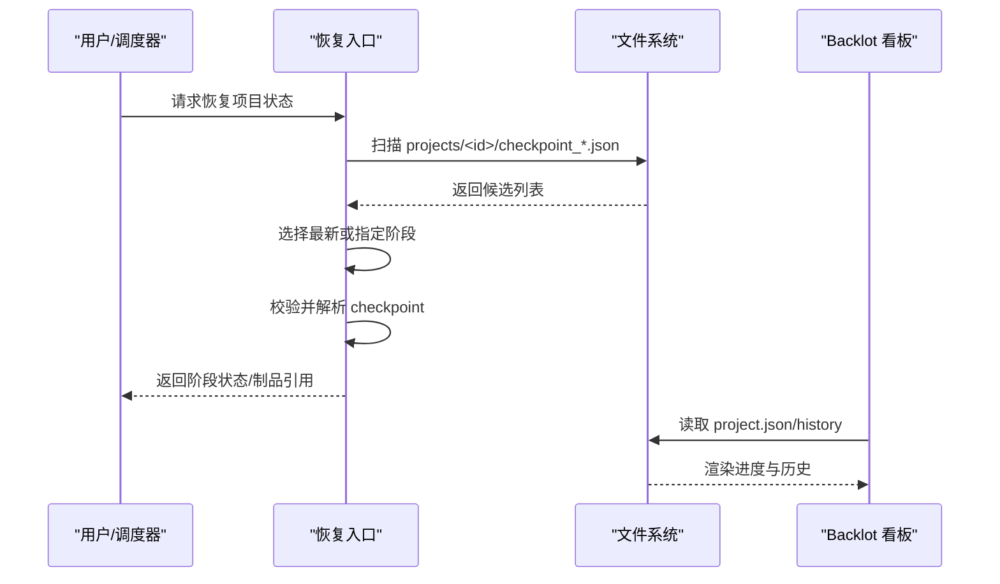
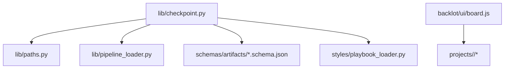

# 备份与恢复

<cite>
**本文引用的文件**
- [lib/checkpoint.py](file://lib/checkpoint.py)
- [schemas/checkpoints/checkpoint.schema.json](file://schemas/checkpoints/checkpoint.schema.json)
- [lib/paths.py](file://lib/paths.py)
- [config.yaml](file://config.yaml)
- [skills/meta/checkpoint-protocol.md](file://skills/meta/checkpoint-protocol.md)
- [scripts/atelier_snapshots.py](file://scripts/atelier_snapshots.py)
- [scripts/wan_disk_cleanup.sh](file://scripts/wan_disk_cleanup.sh)
- [tools/video/clip_cache.py](file://tools/video/clip_cache.py)
- [backlot/ui/board.js](file://backlot/ui/board.js)
</cite>

## 目录
1. [简介](#简介)
2. [项目结构](#项目结构)
3. [核心组件](#核心组件)
4. [架构总览](#架构总览)
5. [详细组件分析](#详细组件分析)
6. [依赖关系分析](#依赖关系分析)
7. [性能考虑](#性能考虑)
8. [故障排查指南](#故障排查指南)
9. [结论](#结论)
10. [附录](#附录)

## 简介
本文件为 OpenMontage 的备份与恢复策略文档，聚焦于：
- 数据备份方案：项目文件、媒体资产、配置信息等的备份范围与策略。
- 检查点机制：checkpoint 协议、状态保存、历史归档、恢复流程。
- 自动化备份脚本与定时任务建议：基于仓库现有脚本与约定路径的落地方案。
- 灾难恢复流程：数据恢复、服务重启、一致性验证步骤。
- 备份存储方案：本地、云存储、异地备份等实践建议。
- 安全性与业务连续性：在长时运行、中断恢复、权限与审计方面的保障。

## 项目结构
OpenMontage 将“项目工作区”统一置于可配置的根目录下，默认位于仓库内的 projects 目录；每个项目包含 artifacts、assets（images/video/audio/music）、renders、history、以及项目标记 project.json。检查点以 checkpoint_<stage>.json 形式按阶段落盘，并支持历史归档。

图表来源
- [lib/checkpoint.py:194-248](file://lib/checkpoint.py#L194-L248)
- [lib/paths.py:13-17](file://lib/paths.py#L13-L17)

章节来源
- [lib/paths.py:1-18](file://lib/paths.py#L1-L18)
- [lib/checkpoint.py:194-248](file://lib/checkpoint.py#L194-L248)

## 核心组件
- 检查点写入与校验：write_checkpoint、validate_checkpoint、_archive_superseded_checkpoint。
- 项目初始化与布局：init_project，创建标准目录结构与 project.json 标记。
- 阶段前置条件与审批门控：_enforce_stage_prerequisites、_stage_requires_approval。
- 读取与进度查询：read_checkpoint、get_latest_checkpoint、get_completed_stages、get_next_stage。
- 路径与配置：PROJECTS_DIR、config.yaml 中的 checkpoint.policy 与 storage_dir。

章节来源
- [lib/checkpoint.py:159-192](file://lib/checkpoint.py#L159-L192)
- [lib/checkpoint.py:251-347](file://lib/checkpoint.py#L251-L347)
- [lib/checkpoint.py:422-564](file://lib/checkpoint.py#L422-L564)
- [lib/checkpoint.py:567-634](file://lib/checkpoint.py#L567-L634)
- [config.yaml:16-19](file://config.yaml#L16-L19)

## 架构总览
OpenMontage 的检查点系统围绕“每阶段一次快照 + 历史归档 + 门控校验”构建。管道各阶段完成后调用 write_checkpoint，内部完成：
- 元数据回填与风格策略校验
- 阶段前置条件与人类审批门控检查
- 决策日志合并与引用注入
- JSON Schema 校验
- 原子写入（临时文件 + replace）与历史归档
- 返回写入路径供上层使用

图表来源
- [lib/checkpoint.py:422-564](file://lib/checkpoint.py#L422-L564)
- [backlot/ui/board.js:921-934](file://backlot/ui/board.js#L921-L934)

## 详细组件分析

### 检查点协议与数据结构
- 必需字段：version、project_id、pipeline_type、stage、status、timestamp、artifacts。
- 状态枚举：completed、failed、awaiting_human、in_progress。
- 可选字段：style_playbook、checkpoint_policy、human_approval_required/approved、review、cost_snapshot、error、metadata。
- 制品校验：artifacts 中已知名称需通过对应 schema 校验。

图表来源
- [schemas/checkpoints/checkpoint.schema.json:1-47](file://schemas/checkpoints/checkpoint.schema.json#L1-L47)

章节来源
- [schemas/checkpoints/checkpoint.schema.json:1-47](file://schemas/checkpoints/checkpoint.schema.json#L1-L47)
- [lib/checkpoint.py:159-192](file://lib/checkpoint.py#L159-L192)

### 项目初始化与目录布局
- init_project 会创建 artifacts、assets/images|video|audio|music、renders 等子目录，并写入 project.json 作为看板识别的项目标记。
- 该函数幂等执行，保留首次 created_at，并合并其他字段。

图表来源
- [lib/checkpoint.py:198-248](file://lib/checkpoint.py#L198-L248)

章节来源
- [lib/checkpoint.py:198-248](file://lib/checkpoint.py#L198-L248)

### 阶段前置条件与审批门控
- 当状态为 awaiting_human 或 completed 时，会检查所有前置阶段是否已完成且满足审批要求。
- 若某阶段在管线清单中要求人工审批，则不能直接写 completed，必须写 awaiting_human 并在用户批准后再次写入 completed 且 human_approved=True。

图表来源
- [lib/checkpoint.py:284-347](file://lib/checkpoint.py#L284-L347)
- [lib/checkpoint.py:467-502](file://lib/checkpoint.py#L467-L502)

章节来源
- [lib/checkpoint.py:251-347](file://lib/checkpoint.py#L251-L347)
- [lib/checkpoint.py:467-502](file://lib/checkpoint.py#L467-L502)

### 历史归档与原子写入
- 覆盖当前 checkpoint 前，会将非 in_progress 的历史版本复制到 history/ 目录，保留阶段版本与门控审计轨迹。
- 写入采用临时文件 + os.replace 的原子替换，避免部分写入导致损坏。

图表来源
- [lib/checkpoint.py:349-386](file://lib/checkpoint.py#L349-L386)
- [lib/checkpoint.py:549-564](file://lib/checkpoint.py#L549-L564)

章节来源
- [lib/checkpoint.py:349-386](file://lib/checkpoint.py#L349-L386)
- [lib/checkpoint.py:549-564](file://lib/checkpoint.py#L549-L564)

### 恢复流程与进度查询
- read_checkpoint：读取指定阶段的最新 checkpoint 并校验。
- get_latest_checkpoint：按文件修改时间取最近的一个 checkpoint。
- get_completed_stages/get_next_stage：根据已完成的 checkpoint 计算下一步。
- Backlot 看板通过读取 checkpoints/history 与项目标记进行可视化呈现。

图表来源
- [lib/checkpoint.py:567-634](file://lib/checkpoint.py#L567-L634)
- [backlot/ui/board.js:921-934](file://backlot/ui/board.js#L921-L934)

章节来源
- [lib/checkpoint.py:567-634](file://lib/checkpoint.py#L567-L634)
- [backlot/ui/board.js:921-934](file://backlot/ui/board.js#L921-L934)

### 媒体资产与缓存
- 媒体资产存放于 assets 子目录，供后续 compose/render 使用。
- clip_cache 提供缓存层，支持硬链接优先、LRU 淘汰、并发锁保护，提升重复处理效率。

图表来源
- [lib/checkpoint.py:218-226](file://lib/checkpoint.py#L218-L226)
- [tools/video/clip_cache.py:28-49](file://tools/video/clip_cache.py#L28-L49)

章节来源
- [lib/checkpoint.py:218-226](file://lib/checkpoint.py#L218-L226)
- [tools/video/clip_cache.py:28-49](file://tools/video/clip_cache.py#L28-L49)

### 快照与演示辅助
- atelier_snapshots 用于在资源门处生成场景缩略图，便于审阅与回看。
- 该脚本读取 scene_plan/edit_decisions，调用 Remotion 渲染单帧，输出到 snapshots 目录。

章节来源
- [scripts/atelier_snapshots.py:1-122](file://scripts/atelier_snapshots.py#L1-L122)

## 依赖关系分析
- 检查点模块依赖：
  - 路径定义：PROJECTS_DIR（可通过环境变量覆盖）。
  - 管线清单：通过 pipeline_loader 获取阶段顺序与审批默认值。
  - 制品 Schema：通过 schemas/artifacts 校验。
  - 风格策略：styles.playbook_loader 校验风格策略有效性。
- 看板依赖：
  - 读取 project.json 与 checkpoints/history 展示状态与历史。

图表来源
- [lib/checkpoint.py:18-23](file://lib/checkpoint.py#L18-L23)
- [lib/checkpoint.py:69-75](file://lib/checkpoint.py#L69-L75)
- [lib/checkpoint.py:98-116](file://lib/checkpoint.py#L98-L116)
- [lib/paths.py:13-17](file://lib/paths.py#L13-L17)
- [backlot/ui/board.js:921-934](file://backlot/ui/board.js#L921-L934)

章节来源
- [lib/checkpoint.py:18-23](file://lib/checkpoint.py#L18-L23)
- [lib/checkpoint.py:69-75](file://lib/checkpoint.py#L69-L75)
- [lib/checkpoint.py:98-116](file://lib/checkpoint.py#L98-L116)
- [lib/paths.py:13-17](file://lib/paths.py#L13-L17)
- [backlot/ui/board.js:921-934](file://backlot/ui/board.js#L921-L934)

## 性能考虑
- 原子写入与历史归档：
  - 临时文件 + replace 避免部分写入导致的损坏。
  - 仅归档非 in_progress 的版本，减少冗余。
- 缓存与硬链接：
  - clip_cache 在同一文件系统上使用硬链接，跨盘自动回退 copy，降低 I/O 成本。
  - LRU 淘汰控制缓存大小，避免磁盘膨胀。
- 并发安全：
  - 缓存层使用文件锁序列化并发访问，超时保护。
- 磁盘清理：
  - wan_disk_cleanup.sh 提供模型权重、虚拟环境、包缓存的清理能力，便于释放空间。

章节来源
- [lib/checkpoint.py:349-386](file://lib/checkpoint.py#L349-L386)
- [lib/checkpoint.py:549-564](file://lib/checkpoint.py#L549-L564)
- [tools/video/clip_cache.py:28-49](file://tools/video/clip_cache.py#L28-L49)
- [scripts/wan_disk_cleanup.sh:1-116](file://scripts/wan_disk_cleanup.sh#L1-L116)

## 故障排查指南
- 常见错误与定位：
  - 阶段无效或制品 Schema 不匹配：write_checkpoint 会抛出校验错误，检查 stage 是否在管线清单内，artifacts 是否符合 schema。
  - 前置阶段未完成或未审批：遇到 PREREQUISITE VIOLATION 错误，检查前置阶段 checkpoint 状态与 human_approved 标志。
  - 风格策略不可用：CheckpointValidationError 提示未知或无效 style_playbook，核对 styles 目录可用清单。
- 恢复与验证：
  - 使用 read_checkpoint/get_latest_checkpoint 读取最新状态，确认 status 与 artifacts 引用。
  - 通过 Backlot 看板查看 stages 的 history_entries 与事件流，确认一致性与时间线。
- 磁盘与缓存问题：
  - 使用 wan_disk_cleanup.sh 清理大体积缓存与模型权重，必要时重建虚拟环境。
  - 检查 clip_cache 的锁与 LRU 行为，确保并发写入不被阻塞。

章节来源
- [lib/checkpoint.py:159-192](file://lib/checkpoint.py#L159-L192)
- [lib/checkpoint.py:284-347](file://lib/checkpoint.py#L284-L347)
- [backlot/ui/board.js:921-934](file://backlot/ui/board.js#L921-L934)
- [scripts/wan_disk_cleanup.sh:1-116](file://scripts/wan_disk_cleanup.sh#L1-L116)

## 结论
OpenMontage 的检查点系统提供了稳健的状态持久化、历史归档与门控校验能力，结合标准化的项目目录布局与看板可视化，为备份与恢复提供了坚实基础。生产环境中应：
- 定期备份 projects 目录（含 artifacts、assets、renders、history、project.json 与所有 checkpoint_*）。
- 将配置与管线清单纳入版本管理（如 config.yaml、pipeline_defs）。
- 利用历史归档与看板进行一致性验证与审计。
- 结合外部存储（本地/NAS/云对象存储）实现异地容灾与长期保留。
- 通过脚本与定时任务实现自动化备份与清理，保障业务连续性与资源健康。

## 附录

### 备份范围与策略
- 必备项：
  - projects/<project_id>/artifacts/*（阶段产物与决策日志）
  - projects/<project_id>/assets/*（媒体素材）
  - projects/<project_id>/renders/*（最终输出）
  - projects/<project_id>/history/*（检查点历史）
  - projects/<project_id>/project.json（项目标记）
  - 所有 checkpoint_*.json（阶段快照）
- 配置与清单：
  - config.yaml（全局配置）
  - pipeline_defs/*.yaml（管线定义）
  - styles/*（风格策略）
- 频率建议：
  - 每次阶段完成（write_checkpoint）后触发增量备份。
  - 每日全量备份，保留至少 N 个版本（依据 RPO/RTO）。

### 检查点协议要点
- 状态流转：in_progress → awaiting_human → completed（或 failed）。
- 门控规则：需要人工审批的阶段必须先写 awaiting_human，再在批准后写 completed 且 human_approved=True。
- 历史归档：覆盖前将非 in_progress 版本复制到 history/，保留审计轨迹。
- 原子写入：临时文件 + replace，避免损坏。

### 自动化备份脚本与定时任务
- 基于仓库现有脚本：
  - scripts/wan_disk_cleanup.sh：清理模型权重、虚拟环境与包缓存，释放磁盘空间。
  - scripts/atelier_snapshots.py：在资源门处生成场景快照，便于审阅与回溯。
- 建议的定时任务（示例思路，具体实现由运维决定）：
  - 每小时增量备份 projects 目录至本地/NAS。
  - 每日全量备份并上传至云对象存储（如 S3/OSS），开启版本控制与生命周期策略。
  - 每周校验备份完整性（读取 checkpoint 与 project.json 做基本校验）。
  - 定期运行 wan_disk_cleanup.sh 清理无用缓存，防止磁盘爆满。

### 灾难恢复流程
- 数据恢复：
  - 从备份中恢复 projects 目录与配置文件。
  - 确保 history/ 与 checkpoint_*.json 完整，以便回放与审计。
- 服务重启：
  - 启动 Backlot 看板，确认项目标记与阶段状态正确显示。
  - 使用 get_next_stage 确定下一步阶段，必要时从 in_progress 恢复。
- 一致性验证：
  - 校验 project.json 与 checkpoint 的 pipeline_type、project_id 一致。
  - 检查前置阶段是否均 completed 且满足审批要求。
  - 通过看板历史条目与事件流验证时间线与状态一致性。

### 备份存储方案
- 本地存储：
  - 使用 NAS/RAID 阵列，设置 RAID 级别与监控告警。
  - 启用文件系统级快照（如 ZFS/Btrfs）提高恢复速度。
- 云存储：
  - 使用对象存储（S3/OSS/COS）开启版本控制与跨区域复制。
  - 对敏感数据启用加密（服务端/客户端加密）。
- 异地备份：
  - 至少一个异地站点，遵循 3-2-1 原则（3 份副本、2 种介质、1 份异地）。
  - 定期演练恢复流程，验证 RTO/RPO。

### 安全性与业务连续性
- 权限控制：
  - 限制对 projects 与配置目录的写权限，最小权限原则。
  - 备份传输使用 TLS，密钥与凭据集中管理。
- 审计与合规：
  - 保留 history/ 与 decision_log.json，满足审计需求。
  - 对关键操作（审批、发布）进行日志记录与告警。
- 高可用：
  - 多副本与异地容灾，避免单点故障。
  - 监控磁盘、缓存与网络异常，及时告警与自愈。