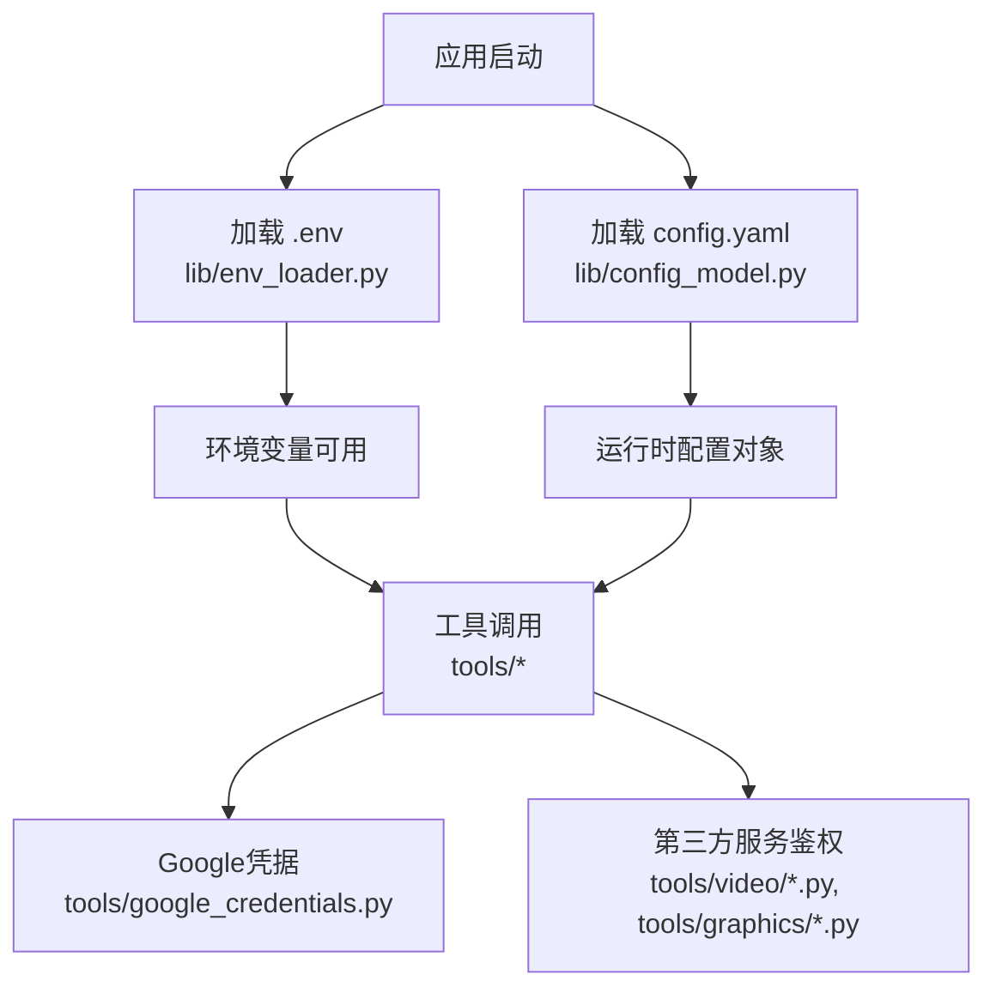
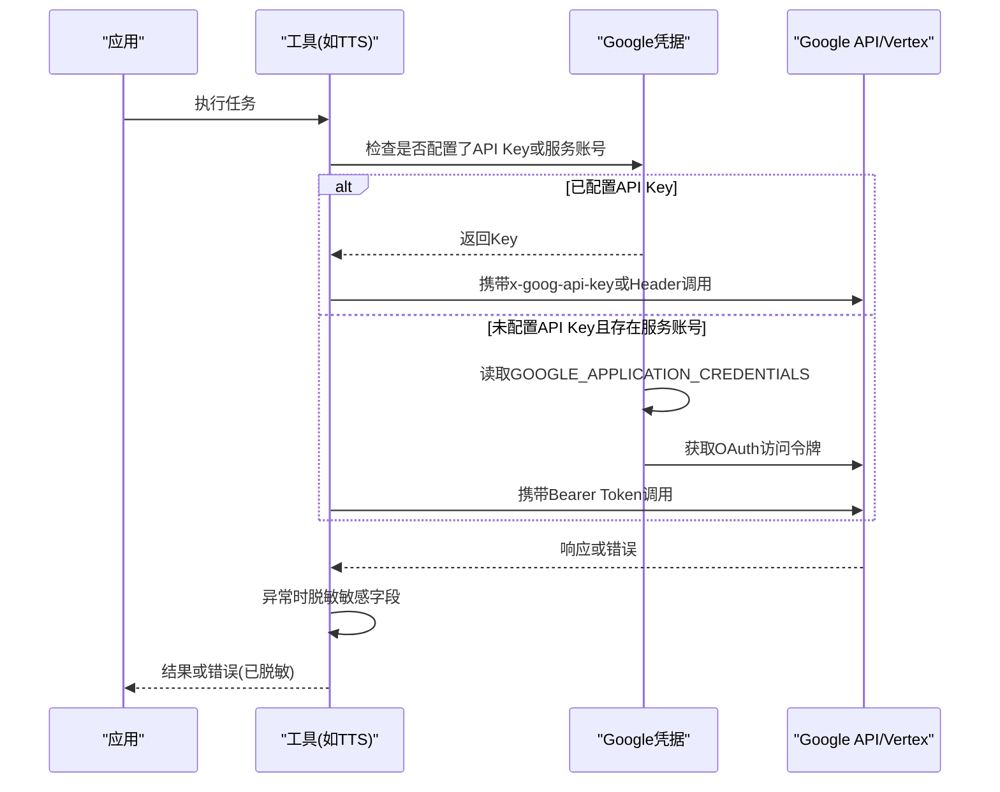
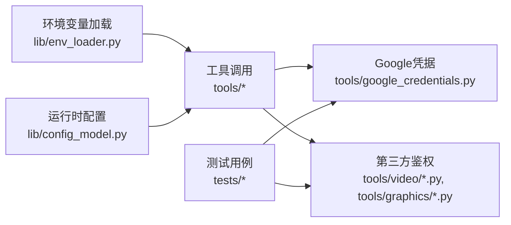

# API密钥管理

<cite>
**本文引用的文件**
- [lib/env_loader.py](file://lib/env_loader.py)
- [tools/google_credentials.py](file://tools/google_credentials.py)
- [tools/audio/google_tts.py](file://tools/audio/google_tts.py)
- [tests/tools/test_google_tts_scoped_key.py](file://tests/tools/test_google_tts_scoped_key.py)
- [tests/contracts/test_phase3_contracts.py](file://tests/contracts/test_phase3_contracts.py)
- [tests/contracts/test_kling_official_core.py](file://tests/contracts/test_kling_official_core.py)
- [tests/contracts/test_env_example.py](file://tests/contracts/test_env_example.py)
- [config.yaml](file://config.yaml)
- [lib/config_model.py](file://lib/config_model.py)
- [tools/video/jimeng_video.py](file://tools/video/jimeng_video.py)
- [tools/graphics/hunyuan_image.py](file://tools/graphics/hunyuan_image.py)
- [tools/video/hunyuan_cloud_video.py](file://tools/video/hunyuan_cloud_video.py)
- [tools/video/seedance_ark.py](file://tools/video/seedance_ark.py)
</cite>

## 目录
1. [简介](#简介)
2. [项目结构](#项目结构)
3. [核心组件](#核心组件)
4. [架构总览](#架构总览)
5. [详细组件分析](#详细组件分析)
6. [依赖关系分析](#依赖关系分析)
7. [性能考虑](#性能考虑)
8. [故障排查指南](#故障排查指南)
9. [结论](#结论)
10. [附录](#附录)

## 简介
本指南聚焦于OpenMontage中API密钥与凭据的安全配置与管理，覆盖环境变量注入、配置文件加载、Google Cloud凭据（服务账号与API Key）双通道认证、第三方服务鉴权头构造、密钥轮换策略、泄露应急响应、常见错误排查与性能优化建议。文档以代码为依据，提供可追溯的源码路径与图示，帮助不同技术背景的读者安全地集成各类AI服务提供商。

## 项目结构
OpenMontage将“环境加载”和“运行时配置”解耦：
- 环境变量加载：通过统一入口从项目根目录加载.env并暴露读取接口。
- 运行时配置：通过YAML模型加载全局配置项（如LLM、预算、输出等），与环境变量配合使用。
- 提供商认证：各工具模块按自身协议构造请求头或客户端实例；Google相关能力集中在共享凭据模块中。

**图表来源**
- [lib/env_loader.py:15-34](file://lib/env_loader.py#L15-L34)
- [lib/config_model.py:74-85](file://lib/config_model.py#L74-L85)
- [tools/google_credentials.py:22-77](file://tools/google_credentials.py#L22-L77)

**章节来源**
- [lib/env_loader.py:1-35](file://lib/env_loader.py#L1-L35)
- [lib/config_model.py:1-93](file://lib/config_model.py#L1-L93)
- [config.yaml:1-34](file://config.yaml#L1-L34)

## 核心组件
- 环境变量加载器：负责从项目根目录加载.env并提供安全的取值接口，避免硬编码敏感信息。
- Google凭据管理器：统一处理Google API Key与Vertex AI服务账号两种模式，支持位置与项目ID解析、访问令牌获取。
- 工具层鉴权：各工具在发起请求前注入正确的鉴权头或客户端参数，并在异常时进行敏感信息脱敏。

**章节来源**
- [lib/env_loader.py:15-34](file://lib/env_loader.py#L15-L34)
- [tools/google_credentials.py:22-141](file://tools/google_credentials.py#L22-L141)
- [tools/audio/google_tts.py:189-219](file://tools/audio/google_tts.py#L189-L219)

## 架构总览
下图展示一次典型AI能力调用的认证流程：工具优先尝试API Key，若未配置则回退到服务账号OAuth；所有异常消息均对密钥进行脱敏，确保日志安全。

**图表来源**
- [tools/google_credentials.py:32-77](file://tools/google_credentials.py#L32-L77)
- [tools/google_credentials.py:94-141](file://tools/google_credentials.py#L94-L141)
- [tools/audio/google_tts.py:189-219](file://tools/audio/google_tts.py#L189-L219)

## 详细组件分析

### 环境变量与配置加载
- 环境变量加载：从项目根目录加载.env，提供get/require两类读取方式，便于在工具中按需校验必填项。
- 运行时配置：基于Pydantic模型加载config.yaml，提供类型化访问与默认值，便于扩展与校验。

实践要点
- 将敏感键放入.env，并确保.gitignore排除本地.env。
- 使用require_env强制缺失时报错，避免静默失败。
- 通过config.yaml集中管理非敏感运行参数（如输出格式、预算策略等）。

**章节来源**
- [lib/env_loader.py:15-34](file://lib/env_loader.py#L15-L34)
- [lib/config_model.py:74-93](file://lib/config_model.py#L74-L93)
- [config.yaml:1-34](file://config.yaml#L1-L34)

### Google Cloud凭据管理
- 双通道认证：优先使用API Key；若无API Key且存在服务账号JSON，则通过google-auth获取OAuth访问令牌。
- 位置与项目解析：支持显式设置Vertex区域与项目ID，空白值视为未设置，默认区域为us-central1。
- 客户端初始化：根据环境变量决定使用GenAI API Key还是Vertex模式，并透传HTTP选项。

最佳实践
- 生产环境推荐使用服务账号+最小权限角色，结合IAM控制访问范围。
- 通过环境变量切换模式（例如启用/禁用Vertex），便于多环境部署。
- 仅在必要时授予cloud-platform等宽泛scope，遵循最小权限原则。

**章节来源**
- [tools/google_credentials.py:22-77](file://tools/google_credentials.py#L22-L77)
- [tools/google_credentials.py:80-141](file://tools/google_credentials.py#L80-L141)
- [tests/contracts/test_phase3_contracts.py:45-79](file://tests/contracts/test_phase3_contracts.py#L45-L79)

### 第三方服务认证与密钥注入
- TTS（Google）：优先使用专用TTS Key；若未配置则回退至服务账号。请求头使用x-goog-api-key，错误信息会脱敏。
- Kling官方：通过Authorization: Bearer注入密钥，测试验证了头部构造。
- 火山引擎（Jimeng）：使用HMAC签名构造Authorization头，并对VOLC_SECRETKEY/VOLC_ACCESSKEY进行脱敏。
- 腾讯TokenHub（Hunyuan）：对TENCENT_TOKENHUB_API_KEY进行脱敏，统一错误处理。
- Seedance Ark：对URL中的查询参数与Authorization Bearer进行脱敏，防止日志泄露。

注意
- 每个工具的鉴权方式可能不同（Header、Query、签名），需严格遵循其规范。
- 所有异常路径都应进行敏感信息脱敏，避免日志泄露。

**章节来源**
- [tools/audio/google_tts.py:189-219](file://tools/audio/google_tts.py#L189-L219)
- [tests/tools/test_google_tts_scoped_key.py:1-36](file://tests/tools/test_google_tts_scoped_key.py#L1-L36)
- [tests/contracts/test_kling_official_core.py:318-347](file://tests/contracts/test_kling_official_core.py#L318-L347)
- [tools/video/jimeng_video.py:369-405](file://tools/video/jimeng_video.py#L369-L405)
- [tools/graphics/hunyuan_image.py:521-551](file://tools/graphics/hunyuan_image.py#L521-L551)
- [tools/video/hunyuan_cloud_video.py:508-530](file://tools/video/hunyuan_cloud_video.py#L508-L530)
- [tools/video/seedance_ark.py:1438-1473](file://tools/video/seedance_ark.py#L1438-L1473)

### 密钥轮换策略
- 分环境隔离：通过不同环境的.env或CI/CD Secret注入不同密钥，避免共享。
- 短生命周期令牌：优先使用OAuth访问令牌（服务账号），减少长期密钥暴露风险。
- 灰度切换：在新密钥生效前保留旧密钥一段时间，逐步迁移流量。
- 自动化轮换：在CI/CD中定期生成新密钥，更新Secret后触发滚动重启。
- 审计与告警：记录密钥使用指标与失败率，出现异常升高时自动告警。

说明
- 上述策略为通用安全实践，结合本项目的环境变量与服务账号机制落地。

[本节为通用指导，不直接分析具体文件]

### 密钥泄露应急响应
- 立即停用：在对应平台吊销泄露的密钥或撤销服务账号权限。
- 快速替换：用新密钥替换环境变量或Secret，触发服务重启。
- 影响评估：检查日志与监控，确认是否存在异常调用或数据外泄。
- 溯源复盘：定位泄露来源（日志、仓库、终端、备份等），修复漏洞。
- 加固措施：开启最小权限、限制IP白名单、启用MFA、加强审计。

说明
- 本项目已在多处实现敏感信息脱敏，降低日志泄露风险。

**章节来源**
- [tools/audio/google_tts.py:189-219](file://tools/audio/google_tts.py#L189-L219)
- [tools/video/jimeng_video.py:377-384](file://tools/video/jimeng_video.py#L377-L384)
- [tools/graphics/hunyuan_image.py:529-537](file://tools/graphics/hunyuan_image.py#L529-L537)
- [tools/video/seedance_ark.py:1438-1473](file://tools/video/seedance_ark.py#L1438-L1473)

### 常见配置错误排查
- 缺少必需环境变量：使用require_env会在缺失时报错，便于快速定位。
- .env.example误填：测试保证示例文件中不包含真实凭据，避免误提交。
- Google凭据未生效：检查GOOGLE_APPLICATION_CREDENTIALS路径是否存在；确认GOOGLE_GENAI_USE_VERTEXAI开关是否正确。
- 第三方服务鉴权头错误：核对各工具使用的Header或签名方式，参考对应测试断言。

**章节来源**
- [lib/env_loader.py:24-34](file://lib/env_loader.py#L24-L34)
- [tests/contracts/test_env_example.py:9-19](file://tests/contracts/test_env_example.py#L9-L19)
- [tools/google_credentials.py:32-77](file://tools/google_credentials.py#L32-L77)
- [tests/contracts/test_kling_official_core.py:318-347](file://tests/contracts/test_kling_official_core.py#L318-L347)

### 性能优化建议
- 延迟导入可选依赖：Google凭据模块延迟导入google-auth，避免无服务账号场景下的额外开销。
- 合理超时：Google长任务使用统一的超时常量，避免阻塞。
- 缓存访问令牌：服务账号获取的访问令牌可复用，减少频繁刷新带来的延迟。
- 最小化网络重试：在工具层控制重试次数与退避策略，避免雪崩。

**章节来源**
- [tools/google_credentials.py:8-11](file://tools/google_credentials.py#L8-L11)
- [tools/google_credentials.py:27-29](file://tools/google_credentials.py#L27-L29)
- [tools/google_credentials.py:94-141](file://tools/google_credentials.py#L94-L141)

## 依赖关系分析
- 环境变量与配置：env_loader与config_model分别负责环境与YAML配置，二者共同构成运行时上下文。
- 工具与凭据：工具模块依赖google_credentials进行Google认证；其他工具按各自协议构造鉴权头。
- 测试保障：测试用例验证了密钥注入、头部构造、错误脱敏等行为，确保行为稳定。

**图表来源**
- [lib/env_loader.py:15-34](file://lib/env_loader.py#L15-L34)
- [lib/config_model.py:74-93](file://lib/config_model.py#L74-L93)
- [tools/google_credentials.py:22-141](file://tools/google_credentials.py#L22-L141)
- [tools/video/jimeng_video.py:369-405](file://tools/video/jimeng_video.py#L369-L405)
- [tools/graphics/hunyuan_image.py:521-551](file://tools/graphics/hunyuan_image.py#L521-L551)

**章节来源**
- [lib/env_loader.py:1-35](file://lib/env_loader.py#L1-L35)
- [lib/config_model.py:1-93](file://lib/config_model.py#L1-L93)
- [tools/google_credentials.py:1-142](file://tools/google_credentials.py#L1-L142)
- [tools/video/jimeng_video.py:369-405](file://tools/video/jimeng_video.py#L369-L405)
- [tools/graphics/hunyuan_image.py:521-551](file://tools/graphics/hunyuan_image.py#L521-L551)

## 性能考虑
- 使用服务账号时，合理设置HTTP超时与重试策略，避免长任务阻塞。
- 在高频调用场景下，复用访问令牌与连接池，减少握手成本。
- 对第三方服务的限流与配额进行监控，及时扩容或降级。

[本节为通用指导，不直接分析具体文件]

## 故障排查指南
- 现象：TTS失败并提示缺少凭据
  - 检查是否设置了GOOGLE_TTS_API_KEY或未配置服务账号。
  - 查看错误消息是否包含脱敏标记，确认未泄露密钥。
- 现象：Kling调用报认证失败
  - 确认KLING_API_KEY已正确注入，Authorization头为Bearer格式。
- 现象：Google Vertex调用区域或项目错误
  - 检查GOOGLE_CLOUD_LOCATION与GOOGLE_CLOUD_PROJECT/GCLOUD_PROJECT。
- 现象：第三方签名错误
  - 核对签名算法、AccessKey/SecretKey与时间戳，确认未过期。

**章节来源**
- [tests/tools/test_google_tts_scoped_key.py:1-36](file://tests/tools/test_google_tts_scoped_key.py#L1-L36)
- [tests/contracts/test_kling_official_core.py:318-347](file://tests/contracts/test_kling_official_core.py#L318-L347)
- [tools/google_credentials.py:22-77](file://tools/google_credentials.py#L22-L77)
- [tools/video/jimeng_video.py:369-405](file://tools/video/jimeng_video.py#L369-L405)

## 结论
OpenMontage通过统一的环境变量加载、类型化的运行时配置以及集中的Google凭据管理，实现了安全、可扩展的密钥管理体系。各工具按自身协议注入鉴权信息，并在异常路径中进行敏感信息脱敏。结合密钥轮换、泄露应急与性能优化策略，可在多环境中稳定、安全地集成各类AI服务提供商。

[本节为总结性内容，不直接分析具体文件]

## 附录
- 环境变量清单（示例）：建议在.env中维护各服务密钥，并通过CI/CD注入到运行环境。
- 配置项清单：config.yaml用于管理非敏感运行参数，便于版本化管理。
- 测试用例：利用测试断言验证密钥注入、头部构造与错误脱敏的正确性。

**章节来源**
- [tests/contracts/test_env_example.py:9-19](file://tests/contracts/test_env_example.py#L9-L19)
- [config.yaml:1-34](file://config.yaml#L1-L34)