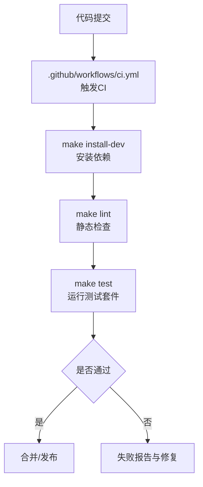
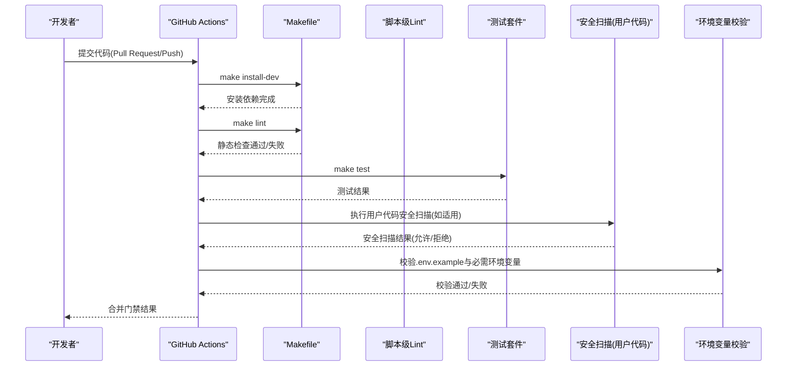
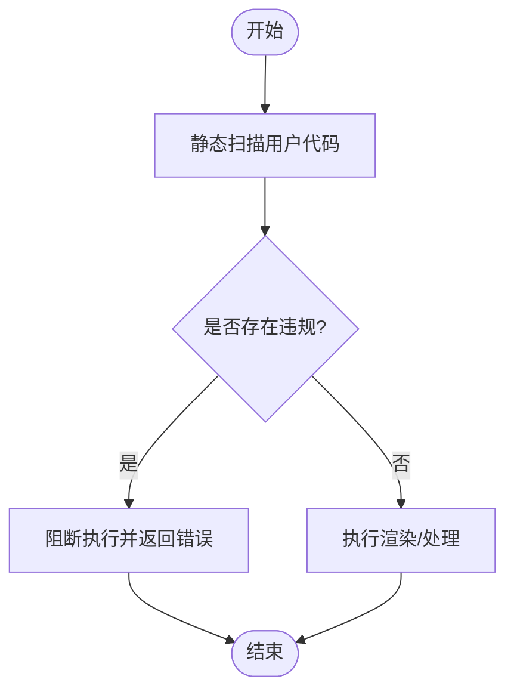
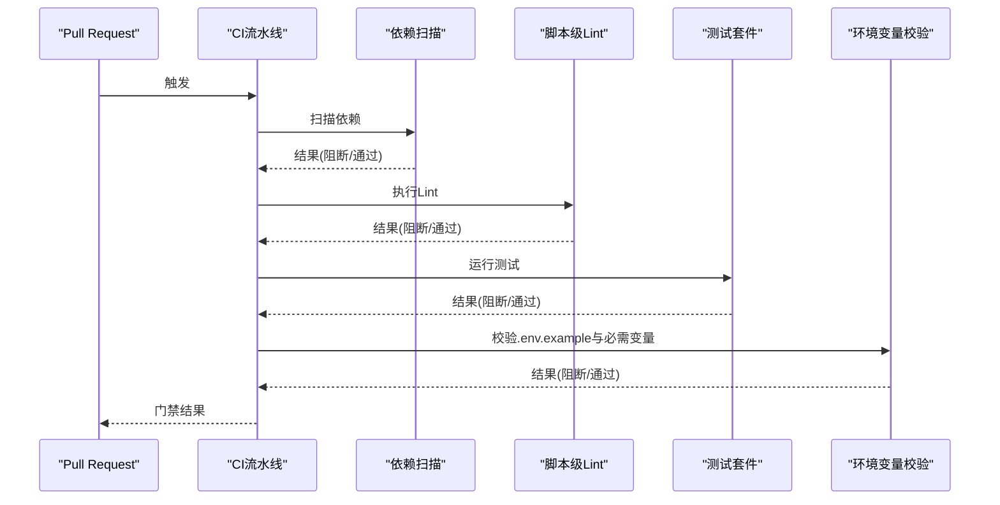
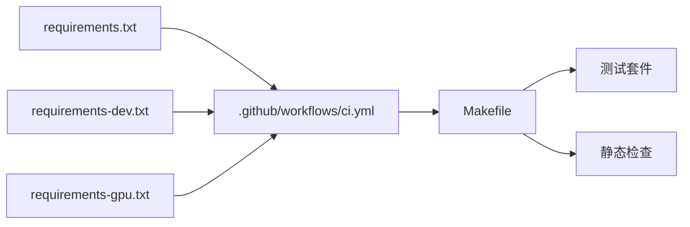

# 安全扫描与修复

<cite>
**本文引用的文件**
- [.github/workflows/ci.yml](file://.github/workflows/ci.yml)
- [Makefile](file://Makefile)
- [requirements.txt](file://requirements.txt)
- [requirements-dev.txt](file://requirements-dev.txt)
- [requirements-gpu.txt](file://requirements-gpu.txt)
- [tests/tools/test_math_animate_safety.py](file://tests/tools/test_math_animate_safety.py)
- [tools/graphics/math_animate.py](file://tools/graphics/math_animate.py)
- [tests/contracts/test_env_example.py](file://tests/contracts/test_env_example.py)
- [scripts/kling_official_animated_explainer_e2e.py](file://scripts/kling_official_animated_explainer_e2e.py)
- [docs/PR_REVIEW_GUIDE.md](file://docs/PR_REVIEW_GUIDE.md)
- [.agents/skills/remotion-to-hyperframes/scripts/lint_source.py](file://.agents/skills/remotion-to-hyperframes/scripts/lint_source.py)
</cite>

## 目录
1. [简介](#简介)
2. [项目结构](#项目结构)
3. [核心组件](#核心组件)
4. [架构总览](#架构总览)
5. [详细组件分析](#详细组件分析)
6. [依赖关系分析](#依赖关系分析)
7. [性能考虑](#性能考虑)
8. [故障排查指南](#故障排查指南)
9. [结论](#结论)
10. [附录](#附录)

## 简介
本文件面向OpenMontage的安全扫描与漏洞修复流程，覆盖以下方面：
- 依赖包安全扫描（Python依赖、第三方库）
- 代码安全审计（静态检查、规则化Lint、危险调用拦截）
- 容器镜像扫描（建议方案）
- CI/CD流水线中的安全检查、自动化漏洞检测与安全补丁管理
- 常见安全漏洞识别、修复策略与安全测试用例
- 安全合规检查、第三方组件风险评估与持续安全监控方案

本项目已具备CI流水线、基础Lint与测试、以及针对用户输入代码执行的安全扫描能力。本文在此基础上给出可落地的完整安全流程与增强建议。

## 项目结构
与“安全扫描与修复”直接相关的工程要素包括：
- CI流水线：在Pull Request和Push到main时触发验证任务
- 构建与测试入口：通过Makefile统一安装、测试、Lint
- 依赖清单：定义运行时、开发时与GPU相关依赖
- 安全测试：对用户提供的场景代码进行静态扫描，阻止危险导入与调用
- 环境配置校验：确保示例环境变量不包含注释伪装成凭据
- 脚本级安全校验：对技能脚本进行规则化Lint并输出结构化结果

**图示来源**
- [.github/workflows/ci.yml:1-47](file://.github/workflows/ci.yml#L1-L47)
- [Makefile:92-126](file://Makefile#L92-L126)

**章节来源**
- [.github/workflows/ci.yml:1-47](file://.github/workflows/ci.yml#L1-L47)
- [Makefile:92-126](file://Makefile#L92-L126)

## 核心组件
- CI流水线（GitHub Actions）
  - 在PR与main分支推送时运行验证任务，包含Python环境准备、系统依赖安装、依赖安装、Lint与测试
- 构建与测试（Makefile）
  - 提供统一的install、test、lint等目标，便于本地与CI一致执行
- 依赖管理（requirements*.txt）
  - 明确运行时、开发与GPU依赖版本范围，为后续依赖扫描提供基线
- 代码安全审计
  - 基于规则的脚本级Lint（技能脚本），支持阻塞级别与警告级别
  - 用户输入代码执行前进行静态扫描，阻止危险导入与调用
- 环境配置校验
  - 保证.env.example中不会将注释误解析为凭据
- 外部脚本安全控制
  - 对需要API密钥的端到端脚本，在未配置时阻断执行并生成报告

**章节来源**
- [.github/workflows/ci.yml:18-47](file://.github/workflows/ci.yml#L18-L47)
- [Makefile:92-126](file://Makefile#L92-L126)
- [requirements.txt:1-17](file://requirements.txt#L1-L17)
- [requirements-dev.txt:1-6](file://requirements-dev.txt#L1-L6)
- [requirements-gpu.txt:1-6](file://requirements-gpu.txt#L1-L6)
- [.agents/skills/remotion-to-hyperframes/scripts/lint_source.py:274-310](file://.agents/skills/remotion-to-hyperframes/scripts/lint_source.py#L274-L310)
- [tests/tools/test_math_animate_safety.py:1-191](file://tests/tools/test_math_animate_safety.py#L1-L191)
- [tests/contracts/test_env_example.py:1-19](file://tests/contracts/test_env_example.py#L1-L19)
- [scripts/kling_official_animated_explainer_e2e.py:722-731](file://scripts/kling_official_animated_explainer_e2e.py#L722-L731)

## 架构总览
下图展示从代码提交到安全门禁的端到端流程，涵盖依赖安装、静态检查、测试、以及关键安全点（如用户代码扫描与环境变量校验）。

**图示来源**
- [.github/workflows/ci.yml:18-47](file://.github/workflows/ci.yml#L18-L47)
- [Makefile:92-126](file://Makefile#L92-L126)
- [.agents/skills/remotion-to-hyperframes/scripts/lint_source.py:274-310](file://.agents/skills/remotion-to-hyperframes/scripts/lint_source.py#L274-L310)
- [tests/tools/test_math_animate_safety.py:145-191](file://tests/tools/test_math_animate_safety.py#L145-L191)
- [tests/contracts/test_env_example.py:9-19](file://tests/contracts/test_env_example.py#L9-L19)
- [scripts/kling_official_animated_explainer_e2e.py:722-731](file://scripts/kling_official_animated_explainer_e2e.py#L722-L731)

## 详细组件分析

### 依赖包安全扫描
现状与建议：
- 当前仓库未内置依赖漏洞扫描步骤。建议在CI中增加依赖扫描阶段，使用工具如pip-audit或Safety，结合requirements*.txt作为基线。
- 建议将扫描结果以制品形式上传，并在PR中显示摘要；对高危漏洞设置为阻断。
- 对于GPU依赖（requirements-gpu.txt），同样纳入扫描范围。

实施要点：
- 在CI中添加独立job或步骤，安装依赖后执行扫描
- 将扫描阈值配置为“严重及以上阻断”，并记录报告
- 定期更新依赖基线与扫描规则

**章节来源**
- [requirements.txt:1-17](file://requirements.txt#L1-L17)
- [requirements-dev.txt:1-6](file://requirements-dev.txt#L1-L6)
- [requirements-gpu.txt:1-6](file://requirements-gpu.txt#L1-L6)
- [.github/workflows/ci.yml:18-47](file://.github/workflows/ci.yml#L18-L47)

### 代码安全审计
现有能力：
- 脚本级Lint：对技能脚本进行规则化检查，输出阻塞与警告级别发现项，支持JSON输出以便集成
- 用户代码安全扫描：在执行用户提供的场景代码前进行静态扫描，阻止危险导入与调用（如os、subprocess、socket、urllib、requests等），并阻止反射绕过（dunder属性访问、getattr、__builtins__等）

实现要点：
- 将脚本级Lint纳入CI，失败则阻断合并
- 对用户代码执行路径强制启用安全扫描，默认不允许绕过；如需豁免需显式开关并记录审计日志
- 维护规则集，定期评审新增风险模式

**图示来源**
- [tests/tools/test_math_animate_safety.py:145-191](file://tests/tools/test_math_animate_safety.py#L145-L191)
- [tools/graphics/math_animate.py](file://tools/graphics/math_animate.py)

**章节来源**
- [.agents/skills/remotion-to-hyperframes/scripts/lint_source.py:274-310](file://.agents/skills/remotion-to-hyperframes/scripts/lint_source.py#L274-L310)
- [tests/tools/test_math_animate_safety.py:1-191](file://tests/tools/test_math_animate_safety.py#L1-L191)
- [tools/graphics/math_animate.py](file://tools/graphics/math_animate.py)

### 容器镜像扫描
现状与建议：
- 仓库未包含Dockerfile或镜像构建步骤。建议在发布制品前引入镜像构建与扫描流程。
- 建议使用轻量基础镜像（如alpine/python-slim），最小化攻击面
- 在CI中构建镜像并执行镜像层扫描（如Trivy、Snyk Container），阻断高危漏洞

实施要点：
- 在CI中添加镜像构建job，拉取依赖并打包应用
- 执行镜像扫描，设置阻断阈值
- 将扫描报告归档，供审计与回溯

[本节为概念性建议，不直接映射具体源码文件]

### CI/CD流水线中的安全检查
现状：
- CI在PR与main推送时运行Python环境准备、依赖安装、Lint与测试
- 尚未包含依赖漏洞扫描与镜像扫描

增强建议：
- 在CI中增加依赖扫描步骤（pip-audit/Safety）
- 增加脚本级Lint失败阻断
- 增加用户代码安全扫描失败阻断
- 增加环境变量校验失败阻断
- 可选：增加镜像扫描步骤（若存在镜像构建）

**图示来源**
- [.github/workflows/ci.yml:18-47](file://.github/workflows/ci.yml#L18-L47)
- [Makefile:92-126](file://Makefile#L92-L126)
- [tests/contracts/test_env_example.py:9-19](file://tests/contracts/test_env_example.py#L9-L19)
- [scripts/kling_official_animated_explainer_e2e.py:722-731](file://scripts/kling_official_animated_explainer_e2e.py#L722-L731)

**章节来源**
- [.github/workflows/ci.yml:18-47](file://.github/workflows/ci.yml#L18-L47)
- [Makefile:92-126](file://Makefile#L92-L126)

### 自动化漏洞检测与安全补丁管理
自动化检测：
- 依赖扫描：在CI中自动执行，阻断高危漏洞
- 脚本级Lint：规则化检查，输出阻塞与警告
- 用户代码安全扫描：执行前静态分析，阻止危险行为
- 环境变量校验：防止示例文件中注释被误解析为凭据

补丁管理：
- 依赖升级：定期评估并升级依赖至安全版本，保持requirements*.txt同步
- 规则更新：维护脚本级Lint规则集，及时纳入新风险模式
- 安全公告响应：建立快速响应流程，对CVE影响范围进行评估与修复

**章节来源**
- [requirements.txt:1-17](file://requirements.txt#L1-L17)
- [requirements-dev.txt:1-6](file://requirements-dev.txt#L1-L6)
- [requirements-gpu.txt:1-6](file://requirements-gpu.txt#L1-L6)
- [.agents/skills/remotion-to-hyperframes/scripts/lint_source.py:274-310](file://.agents/skills/remotion-to-hyperframes/scripts/lint_source.py#L274-L310)
- [tests/tools/test_math_animate_safety.py:1-191](file://tests/tools/test_math_animate_safety.py#L1-L191)
- [tests/contracts/test_env_example.py:9-19](file://tests/contracts/test_env_example.py#L9-L19)

### 常见安全漏洞识别与修复策略
常见漏洞类型：
- 依赖漏洞：已知CVE的第三方库
- 代码注入：执行用户输入代码导致系统命令执行或敏感信息泄露
- 反射绕过：通过dunder属性、getattr、__builtins__等方式绕过限制
- 凭据泄露：环境变量或配置文件包含敏感信息

修复策略：
- 依赖漏洞：升级依赖至安全版本，必要时替换不可维护的库
- 代码注入：执行前静态扫描，默认拒绝危险导入与调用；如需豁免需显式开关并记录审计
- 反射绕过：在扫描规则中禁止dunder属性访问与反射调用
- 凭据泄露：严格校验.env.example，确保无注释伪装成凭据；在生产环境中使用安全的密钥管理方案

**章节来源**
- [tests/tools/test_math_animate_safety.py:33-122](file://tests/tools/test_math_animate_safety.py#L33-L122)
- [tests/contracts/test_env_example.py:9-19](file://tests/contracts/test_env_example.py#L9-L19)

### 安全测试用例
现有测试覆盖：
- 用户代码安全扫描：验证安全场景通过、危险导入与调用被阻断、反射绕过被阻止
- 环境变量校验：确保.env.example中注释不会被解析为凭据
- 外部脚本安全控制：缺少必需环境变量时阻断执行并生成报告

扩展建议：
- 增加依赖扫描失败的测试用例（模拟高危依赖）
- 增加镜像扫描失败的测试用例（模拟镜像层漏洞）
- 增加规则集更新的回归测试，确保新风险模式被正确捕获

**章节来源**
- [tests/tools/test_math_animate_safety.py:1-191](file://tests/tools/test_math_animate_safety.py#L1-L191)
- [tests/contracts/test_env_example.py:9-19](file://tests/contracts/test_env_example.py#L9-L19)
- [scripts/kling_official_animated_explainer_e2e.py:722-731](file://scripts/kling_official_animated_explainer_e2e.py#L722-L731)

### 安全合规检查
建议实践：
- 制定安全基线：定义允许的依赖版本范围、禁止的危险函数与模块
- 代码审查指南：在PR审查中包含安全检查项，参考公共语言描述安全问题
- 审计日志：记录安全扫描结果与决策，支持回溯与合规审计

**章节来源**
- [docs/PR_REVIEW_GUIDE.md:434-484](file://docs/PR_REVIEW_GUIDE.md#L434-L484)

### 第三方组件风险评估
评估维度：
- 依赖活跃度与维护状态
- 已知漏洞数量与严重程度
- 许可证合规性
- 供应链风险（上游依赖链）

实施方式：
- 在CI中集成依赖风险评估工具，定期生成报告
- 对高风险组件制定替代或升级计划
- 记录评估结果与决策依据

**章节来源**
- [requirements.txt:1-17](file://requirements.txt#L1-L17)
- [requirements-dev.txt:1-6](file://requirements-dev.txt#L1-L6)
- [requirements-gpu.txt:1-6](file://requirements-gpu.txt#L1-L6)

### 持续安全监控方案
建议方案：
- 定期依赖扫描：每周或每次依赖变更时执行
- 规则集更新：根据最新威胁情报更新脚本级Lint规则
- 安全告警：对高危漏洞与规则违规发出告警
- 持续改进：根据事故与演练结果优化流程

[本节为概念性建议，不直接映射具体源码文件]

## 依赖关系分析
依赖清单与CI流水线的关系如下：

**图示来源**
- [requirements.txt:1-17](file://requirements.txt#L1-L17)
- [requirements-dev.txt:1-6](file://requirements-dev.txt#L1-L6)
- [requirements-gpu.txt:1-6](file://requirements-gpu.txt#L1-L6)
- [.github/workflows/ci.yml:18-47](file://.github/workflows/ci.yml#L18-L47)
- [Makefile:92-126](file://Makefile#L92-L126)

**章节来源**
- [requirements.txt:1-17](file://requirements.txt#L1-L17)
- [requirements-dev.txt:1-6](file://requirements-dev.txt#L1-L6)
- [requirements-gpu.txt:1-6](file://requirements-gpu.txt#L1-L6)
- [.github/workflows/ci.yml:18-47](file://.github/workflows/ci.yml#L18-L47)
- [Makefile:92-126](file://Makefile#L92-L126)

## 性能考虑
- 依赖扫描应在缓存依赖后进行，减少重复下载与扫描时间
- 脚本级Lint应增量执行，仅对变更文件进行检查
- 用户代码安全扫描应避免不必要的解析开销，采用高效的模式匹配
- 镜像扫描可在并行作业中执行，缩短整体流水线时长

[本节为通用性能建议，不直接映射具体源码文件]

## 故障排查指南
常见问题与处理：
- 依赖扫描失败：检查依赖版本与已知漏洞数据库，优先升级至安全版本
- 脚本级Lint失败：根据规则提示修复代码，避免危险模式
- 用户代码安全扫描失败：修改用户代码以避免危险导入与调用，或申请豁免并记录审计
- 环境变量校验失败：修正.env.example格式，确保注释不被解析为凭据
- 外部脚本阻断：补充必需的环境变量或切换到dry_run模式

**章节来源**
- [.agents/skills/remotion-to-hyperframes/scripts/lint_source.py:274-310](file://.agents/skills/remotion-to-hyperframes/scripts/lint_source.py#L274-L310)
- [tests/tools/test_math_animate_safety.py:145-191](file://tests/tools/test_math_animate_safety.py#L145-L191)
- [tests/contracts/test_env_example.py:9-19](file://tests/contracts/test_env_example.py#L9-L19)
- [scripts/kling_official_animated_explainer_e2e.py:722-731](file://scripts/kling_official_animated_explainer_e2e.py#L722-L731)

## 结论
OpenMontage已具备基础的CI流水线、静态检查与用户代码安全扫描能力。通过引入依赖漏洞扫描、镜像扫描与完善的规则集管理，可进一步提升安全性与合规性。建议在CI中逐步增强安全门禁，形成从代码提交到发布的闭环安全流程。

[本节为总结性内容，不直接映射具体源码文件]

## 附录
- 建议工具清单：
  - 依赖扫描：pip-audit、Safety
  - 镜像扫描：Trivy、Snyk Container
  - 脚本级Lint：自定义规则集（已在仓库中实现）
  - 环境变量校验：现有测试用例可扩展
- 参考文档：
  - PR审查指南中的安全审查语言与实践

[本节为补充信息，不直接映射具体源码文件]