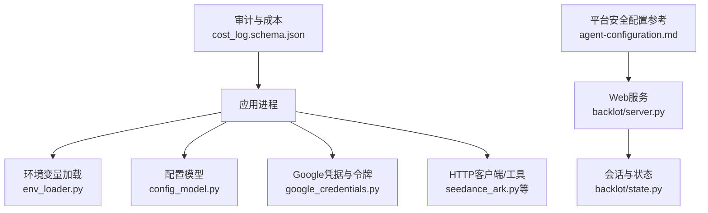
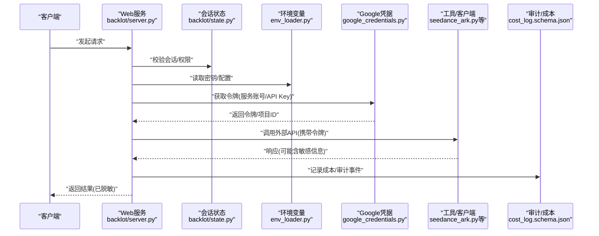
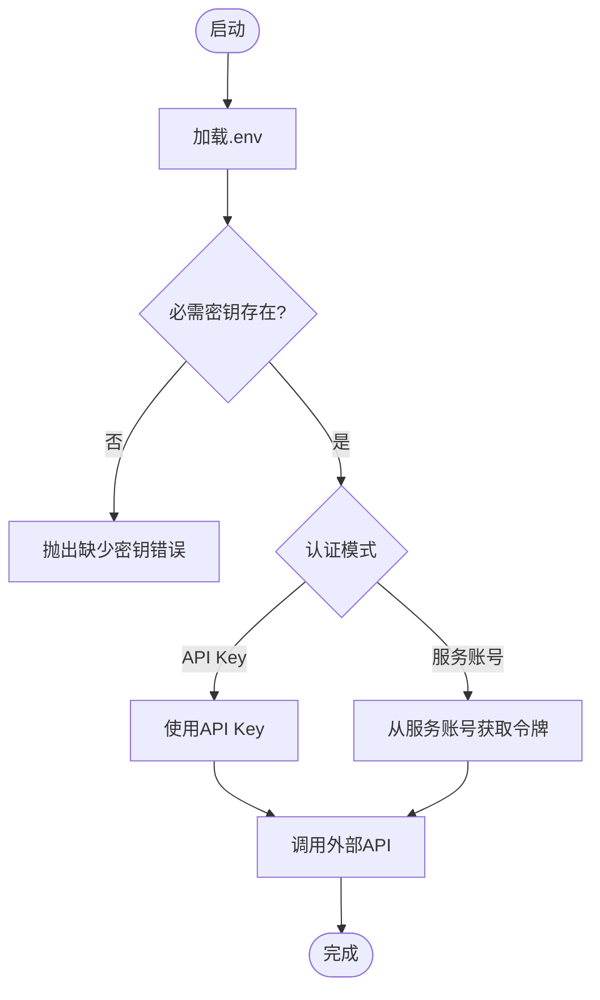
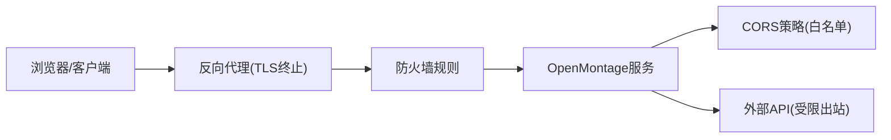
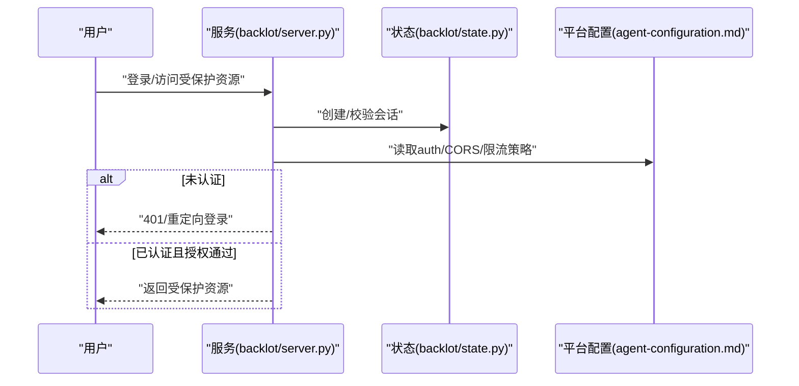
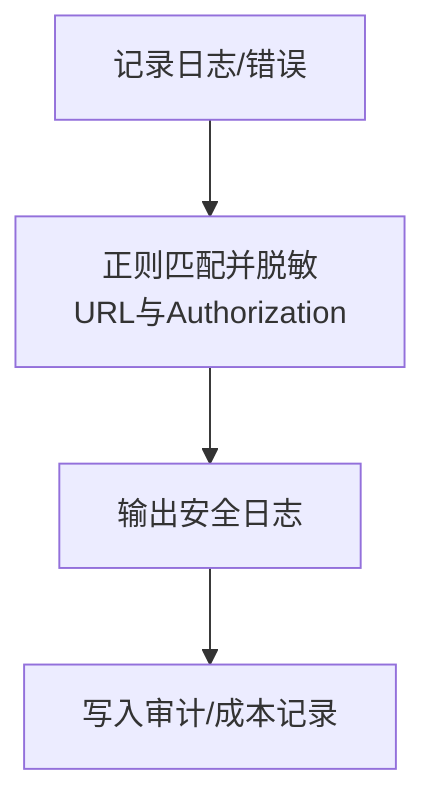
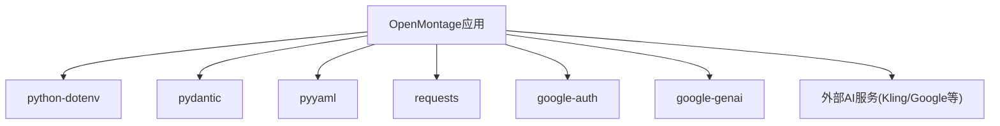

# 安全部署

<cite>
**本文引用的文件**
- [lib/env_loader.py](file://lib/env_loader.py)
- [lib/config_model.py](file://lib/config_model.py)
- [tools/google_credentials.py](file://tools/google_credentials.py)
- [tests/contracts/test_env_example.py](file://tests/contracts/test_env_example.py)
- [tests/tools/test_google_tts_scoped_key.py](file://tests/tools/test_google_tts_scoped_key.py)
- [tests/contracts/test_kling_official_core.py](file://tests/contracts/test_kling_official_core.py)
- [tools/video/seedance_ark.py](file://tools/video/seedance_ark.py)
- [backlot/server.py](file://backlot/server.py)
- [backlot/state.py](file://backlot/state.py)
- [schemas/artifacts/cost_log.schema.json](file://schemas/artifacts/cost_log.schema.json)
- [.agents/skills/agents/references/agent-configuration.md](file://.agents/skills/agents/references/agent-configuration.md)
</cite>

## 目录
1. [简介](#简介)
2. [项目结构](#项目结构)
3. [核心组件](#核心组件)
4. [架构总览](#架构总览)
5. [详细组件分析](#详细组件分析)
6. [依赖关系分析](#依赖关系分析)
7. [性能与安全权衡](#性能与安全权衡)
8. [故障排查指南](#故障排查指南)
9. [结论](#结论)
10. [附录：环境变量与密钥清单](#附录环境变量与密钥清单)

## 简介
本指南面向OpenMontage的生产部署，聚焦以下安全主题：
- API密钥管理与加密存储（环境变量、密钥轮换、最小权限）
- 网络安全配置（HTTPS、防火墙、CORS）
- 身份认证与授权（用户管理、权限控制、会话管理）
- 数据安全保护（传输加密、敏感信息脱敏、审计日志）
- 漏洞扫描与修复流程
- 合规性与可观测性

本指南基于仓库中的实际实现与测试用例进行说明，确保建议可落地。

## 项目结构
OpenMontage的安全相关能力分布在如下位置：
- 环境变量加载与配置模型：lib/env_loader.py、lib/config_model.py
- 第三方服务鉴权与令牌获取：tools/google_credentials.py
- 敏感信息脱敏与错误处理：tools/video/seedance_ark.py
- 服务端入口与会话状态：backlot/server.py、backlot/state.py
- 成本与审计数据模型：schemas/artifacts/cost_log.schema.json
- 平台级安全配置参考：.agents/skills/agents/references/agent-configuration.md
- 环境示例与校验：tests/contracts/test_env_example.py
- 各供应商密钥注入与头部传递验证：tests/tools/test_google_tts_scoped_key.py、tests/contracts/test_kling_official_core.py

**图示来源**
- [lib/env_loader.py:15-35](file://lib/env_loader.py#L15-L35)
- [lib/config_model.py:65-93](file://lib/config_model.py#L65-L93)
- [tools/google_credentials.py:32-91](file://tools/google_credentials.py#L32-L91)
- [tools/video/seedance_ark.py:1438-1473](file://tools/video/seedance_ark.py#L1438-L1473)
- [backlot/server.py](file://backlot/server.py)
- [backlot/state.py](file://backlot/state.py)
- [schemas/artifacts/cost_log.schema.json:1-35](file://schemas/artifacts/cost_log.schema.json#L1-L35)
- [.agents/skills/agents/references/agent-configuration.md:228-275](file://.agents/skills/agents/references/agent-configuration.md#L228-L275)

**章节来源**
- [lib/env_loader.py:15-35](file://lib/env_loader.py#L15-L35)
- [lib/config_model.py:65-93](file://lib/config_model.py#L65-L93)
- [tools/google_credentials.py:32-91](file://tools/google_credentials.py#L32-L91)
- [tools/video/seedance_ark.py:1438-1473](file://tools/video/seedance_ark.py#L1438-L1473)
- [backlot/server.py](file://backlot/server.py)
- [backlot/state.py](file://backlot/state.py)
- [schemas/artifacts/cost_log.schema.json:1-35](file://schemas/artifacts/cost_log.schema.json#L1-L35)
- [.agents/skills/agents/references/agent-configuration.md:228-275](file://.agents/skills/agents/references/agent-configuration.md#L228-L275)

## 核心组件
- 环境变量加载器：提供读取.env、获取必需/可选环境变量的能力，用于集中管理密钥与运行时配置。
- 配置模型：以Pydantic模型定义运行时配置项，支持从YAML加载并解析路径等。
- Google凭据模块：统一处理API Key与服务账号两种认证模式，负责令牌获取与项目ID解析。
- 敏感信息脱敏：在日志或错误消息中自动对URL查询参数和Authorization头进行脱敏。
- Web服务与会话：提供后端服务入口与状态管理，结合平台安全配置可实现访问控制与限流。
- 审计与成本：通过JSON Schema定义成本日志结构，便于追踪资源使用与费用。

**章节来源**
- [lib/env_loader.py:15-35](file://lib/env_loader.py#L15-L35)
- [lib/config_model.py:65-93](file://lib/config_model.py#L65-L93)
- [tools/google_credentials.py:32-91](file://tools/google_credentials.py#L32-L91)
- [tools/video/seedance_ark.py:1438-1473](file://tools/video/seedance_ark.py#L1438-L1473)
- [backlot/server.py](file://backlot/server.py)
- [backlot/state.py](file://backlot/state.py)
- [schemas/artifacts/cost_log.schema.json:1-35](file://schemas/artifacts/cost_log.schema.json#L1-L35)

## 架构总览
下图展示请求从进入Web服务到调用外部AI服务的整体链路，以及安全控制点（认证、授权、脱敏、审计）。

**图示来源**
- [backlot/server.py](file://backlot/server.py)
- [backlot/state.py](file://backlot/state.py)
- [lib/env_loader.py:15-35](file://lib/env_loader.py#L15-L35)
- [tools/google_credentials.py:32-91](file://tools/google_credentials.py#L32-L91)
- [tools/video/seedance_ark.py:1438-1473](file://tools/video/seedance_ark.py#L1438-L1473)
- [schemas/artifacts/cost_log.schema.json:1-35](file://schemas/artifacts/cost_log.schema.json#L1-L35)

## 详细组件分析

### API密钥管理与加密存储
- 环境变量加载
  - 通过加载.env文件并提供get_env/require_env方法，集中管理密钥。
  - 要求关键密钥必须设置，缺失时抛出明确错误，避免静默降级。
- 第三方服务认证
  - Google服务支持API Key与服务账号两种模式；服务账号模式下通过GOOGLE_APPLICATION_CREDENTIALS指向的JSON文件获取访问令牌。
  - 其他供应商（如Kling）通过环境变量注入API Key，并在请求头中作为Bearer Token发送。
- 密钥轮换与最小权限
  - 建议使用短期有效的服务账号令牌，定期轮换密钥文件与环境变量。
  - 为不同用途创建独立密钥（例如TTS专用Key），降低泄露影响面。
- 环境示例校验
  - 通过测试保证.env.example不包含注释误解析为凭证，防止误提交。

**图示来源**
- [lib/env_loader.py:15-35](file://lib/env_loader.py#L15-L35)
- [tools/google_credentials.py:32-91](file://tools/google_credentials.py#L32-L91)
- [tests/contracts/test_kling_official_core.py:97-112](file://tests/contracts/test_kling_official_core.py#L97-L112)
- [tests/tools/test_google_tts_scoped_key.py:15-36](file://tests/tools/test_google_tts_scoped_key.py#L15-L36)

**章节来源**
- [lib/env_loader.py:15-35](file://lib/env_loader.py#L15-L35)
- [tools/google_credentials.py:32-91](file://tools/google_credentials.py#L32-L91)
- [tests/contracts/test_env_example.py:9-19](file://tests/contracts/test_env_example.py#L9-L19)
- [tests/contracts/test_kling_official_core.py:97-112](file://tests/contracts/test_kling_official_core.py#L97-L112)
- [tests/tools/test_google_tts_scoped_key.py:15-36](file://tests/tools/test_google_tts_scoped_key.py#L15-L36)

### 网络安全配置（HTTPS、防火墙、CORS）
- HTTPS
  - 建议在反向代理（如Nginx/Traefik）终止TLS，仅允许HTTPS流量进入服务。
  - 强制重定向HTTP到HTTPS，启用HSTS与强密码套件。
- 防火墙
  - 仅开放必要端口（如443），限制源IP白名单（管理面板、CI/CD）。
  - 出站访问仅允许必要的第三方API域名/IP段。
- CORS
  - 根据平台配置参考，可通过allowlist限制允许的Origin，避免跨站脚本滥用。
  - 在生产环境关闭调试模式，严格限定前端域名。

[本节为通用安全实践说明，不直接分析具体代码文件]

### 身份认证与授权机制
- 会话管理
  - 在服务端维护会话状态，校验登录态与权限后再执行业务操作。
- 访问控制
  - 结合平台配置中的auth字段，启用认证与来源白名单。
  - 对写操作实施细粒度授权检查（如仅允许本人修改自身资料）。
- 令牌与密钥
  - 对外部服务调用使用短期令牌（服务账号）或最小权限API Key。
  - 禁止将密钥暴露给前端；如需前端调用，应通过后端签发一次性令牌。

**图示来源**
- [backlot/server.py](file://backlot/server.py)
- [backlot/state.py](file://backlot/state.py)
- [.agents/skills/agents/references/agent-configuration.md:228-275](file://.agents/skills/agents/references/agent-configuration.md#L228-L275)

**章节来源**
- [backlot/server.py](file://backlot/server.py)
- [backlot/state.py](file://backlot/state.py)
- [.agents/skills/agents/references/agent-configuration.md:228-275](file://.agents/skills/agents/references/agent-configuration.md#L228-L275)

### 数据安全保护措施
- 传输加密
  - 所有外部API调用均通过HTTPS；必要时启用证书校验与双向TLS（mTLS）。
- 敏感信息脱敏
  - 在日志与错误消息中对URL查询参数与Authorization头进行脱敏，避免密钥泄露。
- 审计日志
  - 使用成本日志Schema记录操作、状态与时间戳，便于追溯与计费核对。

**图示来源**
- [tools/video/seedance_ark.py:1438-1473](file://tools/video/seedance_ark.py#L1438-L1473)
- [schemas/artifacts/cost_log.schema.json:1-35](file://schemas/artifacts/cost_log.schema.json#L1-L35)

**章节来源**
- [tools/video/seedance_ark.py:1438-1473](file://tools/video/seedance_ark.py#L1438-L1473)
- [schemas/artifacts/cost_log.schema.json:1-35](file://schemas/artifacts/cost_log.schema.json#L1-L35)

### 安全漏洞扫描与修复流程
- 依赖扫描
  - 在CI中加入依赖漏洞扫描（如pip-audit、npm audit），阻断高危依赖合并。
- 代码扫描
  - 引入静态分析与安全扫描（如Semgrep、Bandit），检测硬编码密钥、弱加密等。
- 容器镜像扫描
  - 对构建镜像进行CVE扫描，及时更新基础镜像与依赖。
- 修复闭环
  - 将扫描结果纳入工单系统，设定SLA与责任人，复测通过后发布。

[本节为通用流程建议，不直接分析具体代码文件]

### 部署环境安全性与合规性
- 最小化运行账户
  - 以非root用户运行服务，限制文件系统读写范围。
- 配置隔离
  - 生产与开发环境分离，密钥由密钥管理服务（如Vault、云KMS）注入。
- 数据保留与隐私
  - 制定日志保留策略，对个人信息进行脱敏或匿名化。
- 合规检查
  - 依据行业标准（如ISO27001、SOC2）进行差距评估与整改。

[本节为通用合规建议，不直接分析具体代码文件]

## 依赖关系分析
OpenMontage的安全相关依赖包括：
- Python标准库与第三方库（dotenv、pydantic、yaml、requests等）
- Google SDK（google-auth、google-genai）用于服务账号认证
- 外部AI服务（Kling、Google TTS等）通过环境变量注入密钥

**图示来源**
- [lib/env_loader.py:15-35](file://lib/env_loader.py#L15-L35)
- [lib/config_model.py:65-93](file://lib/config_model.py#L65-L93)
- [tools/google_credentials.py:32-91](file://tools/google_credentials.py#L32-L91)
- [tests/tools/test_google_tts_scoped_key.py:15-36](file://tests/tools/test_google_tts_scoped_key.py#L15-L36)
- [tests/contracts/test_kling_official_core.py:97-112](file://tests/contracts/test_kling_official_core.py#L97-L112)

**章节来源**
- [lib/env_loader.py:15-35](file://lib/env_loader.py#L15-L35)
- [lib/config_model.py:65-93](file://lib/config_model.py#L65-L93)
- [tools/google_credentials.py:32-91](file://tools/google_credentials.py#L32-L91)
- [tests/tools/test_google_tts_scoped_key.py:15-36](file://tests/tools/test_google_tts_scoped_key.py#L15-L36)
- [tests/contracts/test_kling_official_core.py:97-112](file://tests/contracts/test_kling_official_core.py#L97-L112)

## 性能与安全权衡
- 认证开销
  - 服务账号令牌刷新与网络往返会增加延迟；建议缓存短期令牌并设置合理过期时间。
- 日志脱敏
  - 正则匹配与替换带来CPU开销；可对高频路径进行采样或异步处理。
- 限流与并发
  - 通过平台配置的call_limits限制并发与日配额，避免资源耗尽与滥用。

[本节为通用性能讨论，不直接分析具体代码文件]

## 故障排查指南
- 缺少必需环境变量
  - 现象：启动时报错提示缺少某密钥。
  - 处理：检查.env是否加载成功，确认必需键已设置。
- 第三方服务认证失败
  - 现象：调用外部API返回401/403。
  - 处理：核对API Key或服务账号文件路径与权限；查看错误消息是否包含敏感信息（应已脱敏）。
- 日志泄露风险
  - 现象：日志中出现URL查询参数或Authorization头。
  - 处理：确认脱敏逻辑生效；检查自定义日志路径是否绕过脱敏。

**章节来源**
- [lib/env_loader.py:24-35](file://lib/env_loader.py#L24-L35)
- [tools/google_credentials.py:94-141](file://tools/google_credentials.py#L94-L141)
- [tools/video/seedance_ark.py:1438-1473](file://tools/video/seedance_ark.py#L1438-L1473)

## 结论
OpenMontage在密钥管理、认证授权、数据传输与脱敏方面具备良好基础。生产部署应结合反向代理、防火墙与平台安全配置，形成纵深防御。通过严格的依赖扫描、审计日志与合规检查，持续提升安全性与可运维性。

## 附录：环境变量与密钥清单
- 环境变量加载与必需键
  - 使用require_env确保关键密钥存在，缺失时立即报错。
- Google服务
  - GOOGLE_API_KEY/GEMINI_API_KEY：API Key模式
  - GOOGLE_APPLICATION_CREDENTIALS：服务账号JSON文件路径
  - GOOGLE_CLOUD_LOCATION/PROJECT：Vertex区域与项目ID
- 第三方供应商
  - KLING_API_KEY/KLING_API_BASE_URL：Kling服务密钥与基地址
- 审计与成本
  - 成本日志遵循cost_log.schema.json结构，记录操作、状态与时间戳

**章节来源**
- [lib/env_loader.py:24-35](file://lib/env_loader.py#L24-L35)
- [tools/google_credentials.py:22-91](file://tools/google_credentials.py#L22-L91)
- [tests/contracts/test_kling_official_core.py:115-120](file://tests/contracts/test_kling_official_core.py#L115-L120)
- [schemas/artifacts/cost_log.schema.json:1-35](file://schemas/artifacts/cost_log.schema.json#L1-L35)