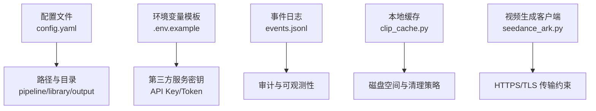
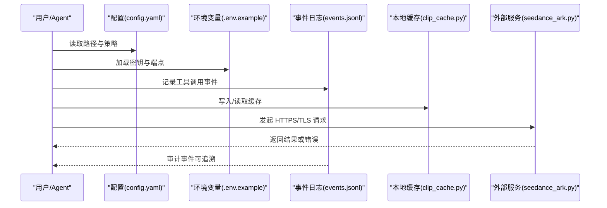
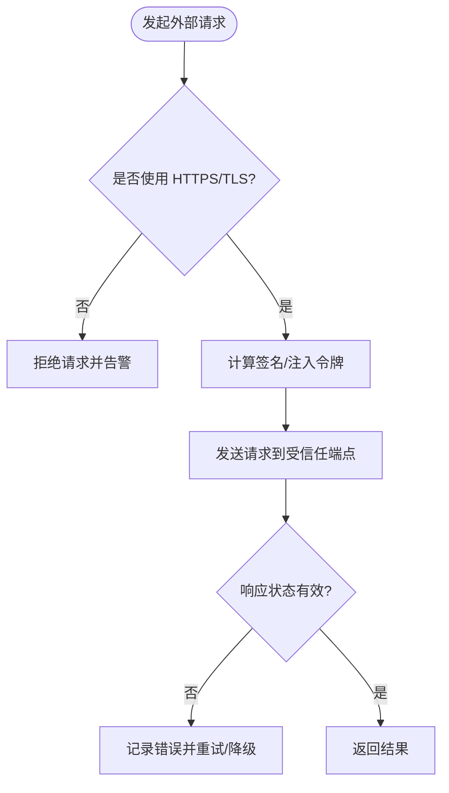
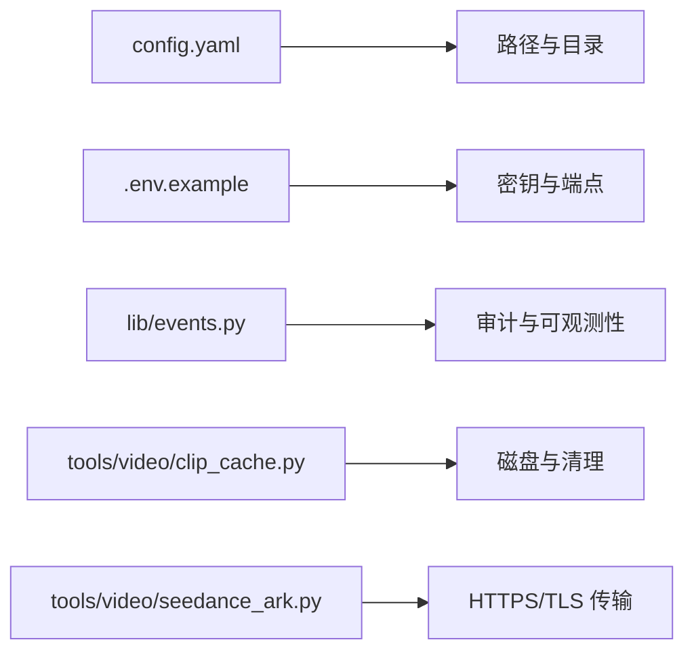

# 数据安全保护

<cite>
**本文引用的文件**
- [config.yaml](file://config.yaml)
- [.env.example](file://.env.example)
- [lib/events.py](file://lib/events.py)
- [tools/video/clip_cache.py](file://tools/video/clip_cache.py)
- [tests/contracts/test_env_example.py](file://tests/contracts/test_env_example.py)
- [tools/video/seedance_ark.py](file://tools/video/seedance_ark.py)
</cite>

## 目录
1. [简介](#简介)
2. [项目结构](#项目结构)
3. [核心组件](#核心组件)
4. [架构总览](#架构总览)
5. [详细组件分析](#详细组件分析)
6. [依赖关系分析](#依赖关系分析)
7. [性能考虑](#性能考虑)
8. [故障排查指南](#故障排查指南)
9. [结论](#结论)
10. [附录](#附录)

## 简介
本文件聚焦 OpenMontage 的数据安全保护措施，围绕以下主题展开：数据传输加密（HTTPS/TLS）、静态数据加密、敏感信息脱敏处理；数据库安全配置、文件存储安全与备份数据加密；数据访问审计、操作日志记录与数据完整性校验；隐私合规要求（含 GDPR 数据处理）与数据生命周期管理。文档基于仓库现有实现进行梳理，并给出可操作的落地建议与最佳实践。

## 项目结构
OpenMontage 的安全相关能力主要分布在以下位置：
- 全局配置与路径定义：用于控制输出、检查点、库与技能等目录，便于集中管理与隔离。
- 环境变量模板：集中声明第三方服务密钥与环境变量，避免硬编码泄露。
- 事件日志：以追加式 JSONL 记录工具调用事件，支撑审计与可观测性。
- 缓存与临时文件：本地缓存目录与清理策略，降低敏感数据驻留风险。
- 外部 API 集成：对 HTTPS/TLS 的使用约束与签名/令牌使用规范。

**图示来源**
- [config.yaml:1-34](file://config.yaml#L1-L34)
- [.env.example:1-135](file://.env.example#L1-L135)
- [lib/events.py:1-43](file://lib/events.py#L1-L43)
- [tools/video/clip_cache.py:51-93](file://tools/video/clip_cache.py#L51-L93)
- [tools/video/seedance_ark.py:733](file://tools/video/seedance_ark.py#L733)

**章节来源**
- [config.yaml:1-34](file://config.yaml#L1-L34)
- [.env.example:1-135](file://.env.example#L1-L135)
- [lib/events.py:1-43](file://lib/events.py#L1-L43)
- [tools/video/clip_cache.py:51-93](file://tools/video/clip_cache.py#L51-L93)
- [tools/video/seedance_ark.py:733](file://tools/video/seedance_ark.py#L733)

## 核心组件
- 配置与路径管理：通过全局配置集中管理输出格式、检查点策略与目录结构，为后续加密与隔离提供基础。
- 环境变量与密钥管理：统一在 .env.example 中声明所有第三方密钥，配合测试用例确保示例不携带真实凭据。
- 事件审计日志：以 append-only 的 JSONL 形式记录工具执行事件，支持按项目维度追踪。
- 本地缓存与清理：限制缓存大小与最小可用阈值，减少敏感数据长期驻留。
- 外部 API 传输约束：强调对外部服务的 HTTPS/TLS 与签名/令牌使用，避免明文传输。

**章节来源**
- [config.yaml:1-34](file://config.yaml#L1-L34)
- [.env.example:1-135](file://.env.example#L1-L135)
- [lib/events.py:1-43](file://lib/events.py#L1-L43)
- [tools/video/clip_cache.py:51-93](file://tools/video/clip_cache.py#L51-L93)
- [tools/video/seedance_ark.py:733](file://tools/video/seedance_ark.py#L733)

## 架构总览
下图展示 OpenMontage 在数据安全方面的关键交互：配置驱动路径与策略，环境变量承载密钥，事件日志记录操作轨迹，缓存模块管理临时数据，外部 API 通过 HTTPS/TLS 传输。

**图示来源**
- [config.yaml:1-34](file://config.yaml#L1-L34)
- [.env.example:1-135](file://.env.example#L1-L135)
- [lib/events.py:1-43](file://lib/events.py#L1-L43)
- [tools/video/clip_cache.py:51-93](file://tools/video/clip_cache.py#L51-L93)
- [tools/video/seedance_ark.py:733](file://tools/video/seedance_ark.py#L733)

## 详细组件分析

### 数据传输加密（HTTPS/TLS）
- 强制 HTTPS/TLS：对外部视频生成与媒体服务的调用需使用 HTTPS 端点，避免明文传输。代码中对公开/签名 URL 的要求体现了对传输安全的约束。
- 令牌与签名：部分服务采用 HMAC-SHA256 V4 签名或 Bearer Token，需在服务端生成一次性令牌并安全传递，禁止将密钥暴露给前端。
- 端点白名单与区域选择：通过环境变量指定区域或自定义端点，确保连接至受信任的服务地址。

**图示来源**
- [tools/video/seedance_ark.py:733](file://tools/video/seedance_ark.py#L733)
- [.env.example:85-106](file://.env.example#L85-L106)

**章节来源**
- [tools/video/seedance_ark.py:733](file://tools/video/seedance_ark.py#L733)
- [.env.example:85-106](file://.env.example#L85-L106)

### 静态数据加密
- 检查点与中间产物：检查点策略由配置项控制，建议将 pipeline 与 library 目录置于受控文件系统或加密卷上，防止未授权访问。
- 输出与样式目录：输出目录与样式目录应遵循最小权限原则，仅允许必要进程读写。
- 建议：在生产环境启用磁盘级加密（如 LUKS、BitLocker），并对敏感中间文件进行应用层加密后再落盘。

**章节来源**
- [config.yaml:16-34](file://config.yaml#L16-L34)

### 敏感信息脱敏处理
- 环境变量模板：.env.example 仅包含占位符与说明，不包含真实密钥；测试用例确保复制后不会误带入注释中的“假凭据”。
- 日志脱敏：事件日志应避免记录完整密钥或令牌片段；如需记录上下文，应对敏感字段进行掩码或哈希化。
- 建议：在日志框架中增加敏感字段过滤规则，并在 CI 中加入扫描规则，防止意外提交密钥。

**章节来源**
- [.env.example:1-135](file://.env.example#L1-L135)
- [tests/contracts/test_env_example.py:1-19](file://tests/contracts/test_env_example.py#L1-L19)
- [lib/events.py:1-43](file://lib/events.py#L1-L43)

### 数据库安全配置
- 当前仓库未内置数据库持久化；若引入数据库，建议：
  - 使用强密码与最小权限账户；
  - 启用连接加密（TLS）；
  - 对敏感列进行加密或脱敏；
  - 定期轮换凭证并限制网络访问范围。

[本节为通用指导，不直接分析具体文件]

### 文件存储安全
- 本地缓存：clip_cache.py 定义了默认缓存目录与容量上限，并设置最小可用字节阈值，避免无效下载占用空间。
- 临时文件：建议在运行期使用临时目录，并在任务结束后清理；对大体积媒体文件实施访问控制与配额。
- 建议：结合操作系统权限与文件系统 ACL，限制缓存与输出目录的读写主体。

**章节来源**
- [tools/video/clip_cache.py:51-93](file://tools/video/clip_cache.py#L51-L93)

### 备份数据加密
- 建议：对 pipeline、library、output 目录进行定期备份，并使用独立密钥进行加密（如 gpg、KMS）。
- 恢复演练：定期进行恢复验证，确保备份可用且解密流程正确。
- 传输安全：备份上传至远端时，使用 HTTPS/TLS 并限制访问 IP 与身份认证。

[本节为通用指导，不直接分析具体文件]

### 数据访问审计与操作日志
- 事件日志：lib/events.py 提供 append-only 的事件记录机制，按项目维度归集，便于回溯与审计。
- 日志安全：确保事件日志不可篡改，并限制访问权限；对敏感上下文进行脱敏。
- 建议：接入集中式日志平台，建立告警与检索能力。

**章节来源**
- [lib/events.py:1-43](file://lib/events.py#L1-L43)

### 数据完整性校验
- 建议：对下载的媒体文件与模型权重进行哈希校验（如 SHA-256），并与可信源比对，防止篡改。
- 传输层：依赖 HTTPS/TLS 保证传输完整性；对关键资源在落盘后进行二次校验。
- 建议：在流水线中加入完整性校验步骤，失败则阻断后续处理。

[本节为通用指导，不直接分析具体文件]

### 隐私合规（GDPR）与数据生命周期管理
- 数据最小化：仅收集与处理必要的媒体元数据与日志；对非必要字段进行脱敏。
- 保留期限：设定 pipeline、library、output 与缓存的生命周期策略，到期自动清理。
- 用户权利：支持导出与删除用户相关数据；在事件日志中记录删除与导出操作。
- 跨境传输：如涉及跨境数据流转，需评估合规要求并采取加密与访问控制措施。

[本节为通用指导，不直接分析具体文件]

## 依赖关系分析
OpenMontage 的安全相关依赖主要体现在：
- 配置与路径：config.yaml 决定目录结构与策略，影响存储与备份范围。
- 环境变量：.env.example 声明第三方密钥，影响外部服务通信安全。
- 事件日志：lib/events.py 提供审计基础，依赖文件系统写入稳定性。
- 缓存模块：tools/video/clip_cache.py 管理本地缓存，影响磁盘使用与数据驻留时间。
- 外部 API：tools/video/seedance_ark.py 强调 HTTPS/TLS 与签名/令牌使用。

**图示来源**
- [config.yaml:1-34](file://config.yaml#L1-L34)
- [.env.example:1-135](file://.env.example#L1-L135)
- [lib/events.py:1-43](file://lib/events.py#L1-L43)
- [tools/video/clip_cache.py:51-93](file://tools/video/clip_cache.py#L51-L93)
- [tools/video/seedance_ark.py:733](file://tools/video/seedance_ark.py#L733)

**章节来源**
- [config.yaml:1-34](file://config.yaml#L1-L34)
- [.env.example:1-135](file://.env.example#L1-L135)
- [lib/events.py:1-43](file://lib/events.py#L1-L43)
- [tools/video/clip_cache.py:51-93](file://tools/video/clip_cache.py#L51-L93)
- [tools/video/seedance_ark.py:733](file://tools/video/seedance_ark.py#L733)

## 性能考虑
- 缓存策略：合理设置缓存上限与最小可用阈值，避免频繁 I/O 与磁盘膨胀。
- 日志写入：事件日志采用追加模式，注意磁盘空间与轮转策略，避免阻塞主流程。
- 传输优化：复用 HTTPS 连接与连接池，减少握手开销；对大文件分块传输并校验完整性。

[本节为通用指导，不直接分析具体文件]

## 故障排查指南
- 环境变量缺失：检查 .env.example 中对应键是否已正确配置；确认 CI 测试未将注释误解析为凭据。
- 事件日志异常：确认 events.jsonl 所在目录可写；观察是否有权限或磁盘空间问题。
- 缓存溢出：调整 clip_cache.py 中的容量上限与清理策略；监控磁盘使用率。
- 外部 API 失败：核对 HTTPS/TLS 端点与签名/令牌；查看重试与降级逻辑是否生效。

**章节来源**
- [tests/contracts/test_env_example.py:1-19](file://tests/contracts/test_env_example.py#L1-L19)
- [lib/events.py:1-43](file://lib/events.py#L1-L43)
- [tools/video/clip_cache.py:51-93](file://tools/video/clip_cache.py#L51-L93)
- [tools/video/seedance_ark.py:733](file://tools/video/seedance_ark.py#L733)

## 结论
OpenMontage 在数据安全方面具备良好基础：通过配置与路径管理、环境变量模板、事件日志与本地缓存策略，形成了从传输、存储到审计的关键闭环。建议在生产环境中进一步强化磁盘加密、日志脱敏、完整性校验与备份加密，并完善隐私合规与数据生命周期管理，以满足更严格的安全与合规要求。

## 附录
- 建议的安全清单：
  - 传输：强制 HTTPS/TLS、令牌一次性生成、端点白名单。
  - 存储：磁盘加密、最小权限、缓存与临时文件清理。
  - 审计：append-only 日志、集中化管理、敏感字段脱敏。
  - 备份：加密备份、定期恢复演练、传输安全。
  - 合规：数据最小化、保留期限、用户权利支持、跨境传输评估。

[本节为通用指导，不直接分析具体文件]